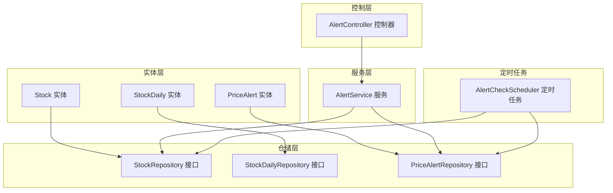
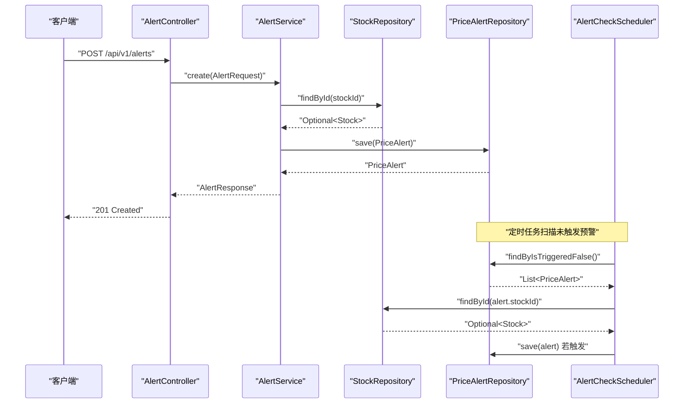
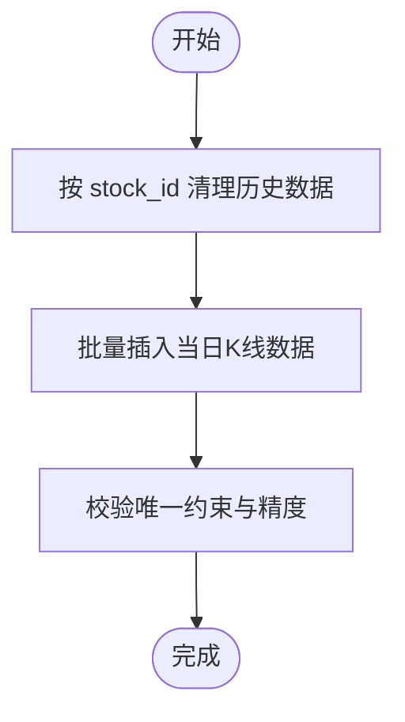
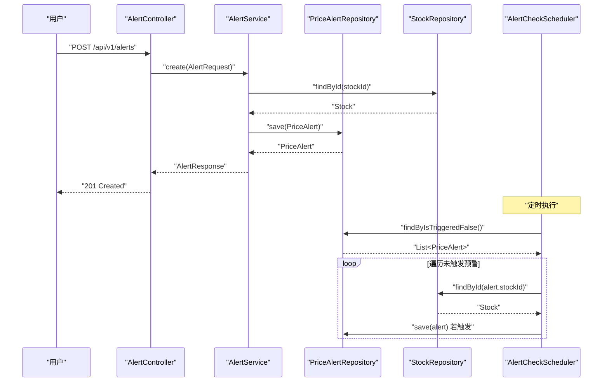
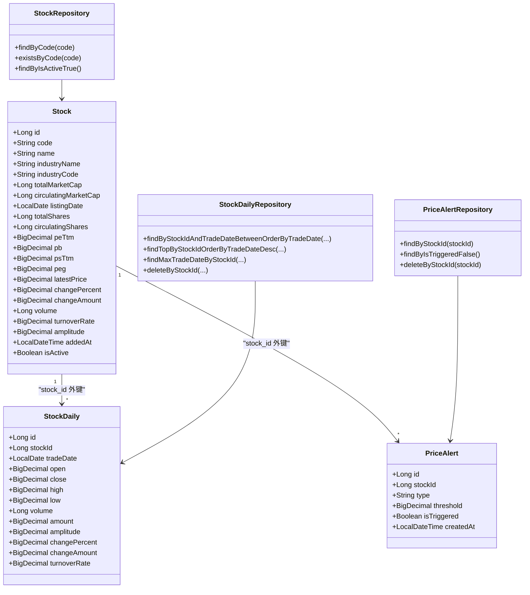

# 核心实体类

<cite>
**本文引用的文件**
- [Stock.java](file://backend/src/main/java/com/stock/entity/Stock.java)
- [StockDaily.java](file://backend/src/main/java/com/stock/entity/StockDaily.java)
- [PriceAlert.java](file://backend/src/main/java/com/stock/entity/PriceAlert.java)
- [StockRepository.java](file://backend/src/main/java/com/stock/repository/StockRepository.java)
- [StockDailyRepository.java](file://backend/src/main/java/com/stock/repository/StockDailyRepository.java)
- [PriceAlertRepository.java](file://backend/src/main/java/com/stock/repository/PriceAlertRepository.java)
- [AlertService.java](file://backend/src/main/java/com/stock/service/AlertService.java)
- [AlertController.java](file://backend/src/main/java/com/stock/controller/AlertController.java)
- [AlertCheckScheduler.java](file://backend/src/main/java/com/stock/scheduler/AlertCheckScheduler.java)
- [AlertRequest.java](file://backend/src/main/java/com/stock/dto/request/AlertRequest.java)
- [AlertResponse.java](file://backend/src/main/java/com/stock/dto/response/AlertResponse.java)
- [KlineDataItem.java](file://backend/src/main/java/com/stock/dto/fetcher/KlineDataItem.java)
- [application.yml](file://backend/src/main/resources/application.yml)
- [dd-check-report.md](file://system-planner/dd-check-report.md)
- [detailed-design.md](file://system-planner/detailed-design.md)
</cite>

## 目录
1. [简介](#简介)
2. [项目结构](#项目结构)
3. [核心组件](#核心组件)
4. [架构总览](#架构总览)
5. [详细组件分析](#详细组件分析)
6. [依赖分析](#依赖分析)
7. [性能考虑](#性能考虑)
8. [故障排查指南](#故障排查指南)
9. [结论](#结论)
10. [附录](#附录)

## 简介
本文件聚焦于系统中的三个核心实体类：Stock（股票）、StockDaily（日线行情）与PriceAlert（价格预警）。我们将从字段映射策略、数据类型选择与精度控制、时间序列数据处理、业务逻辑与触发机制、实体间关系映射与索引优化等方面进行深入解析，并结合实际代码路径给出使用模式与最佳实践。

## 项目结构
围绕核心实体类，后端采用分层架构：实体位于entity包，仓库接口位于repository包，服务与控制器分别在service与controller包，定时任务位于scheduler包；数据传输对象位于dto包。配置文件application.yml定义了调度周期等运行参数。

**图表来源**
- [Stock.java:14-85](file://backend/src/main/java/com/stock/entity/Stock.java#L14-L85)
- [StockDaily.java:14-59](file://backend/src/main/java/com/stock/entity/StockDaily.java#L14-L59)
- [PriceAlert.java:14-36](file://backend/src/main/java/com/stock/entity/PriceAlert.java#L14-L36)
- [StockRepository.java:10-17](file://backend/src/main/java/com/stock/repository/StockRepository.java#L10-L17)
- [StockDailyRepository.java:13-23](file://backend/src/main/java/com/stock/repository/StockDailyRepository.java#L13-L23)
- [PriceAlertRepository.java:9-16](file://backend/src/main/java/com/stock/repository/PriceAlertRepository.java#L9-L16)
- [AlertService.java:15-62](file://backend/src/main/java/com/stock/service/AlertService.java#L15-L62)
- [AlertController.java:13-39](file://backend/src/main/java/com/stock/controller/AlertController.java#L13-L39)
- [AlertCheckScheduler.java:14-51](file://backend/src/main/java/com/stock/scheduler/AlertCheckScheduler.java#L14-L51)

**章节来源**
- [application.yml:19-27](file://backend/src/main/resources/application.yml#L19-L27)

## 核心组件
本节对三个核心实体类进行逐项剖析，涵盖字段语义、JPA注解、精度与范围设定、唯一性与外键约束、以及与仓库接口的交互方式。

- Stock（股票）
  - 字段映射策略：使用@Column定义列名与长度，如code、name、industryName、industryCode等；数值型财务指标使用Long或BigDecimal，如totalMarketCap、peTtm等。
  - 数据类型与精度：大量使用BigDecimal并设置precision与scale，确保金融计算精度；日期使用LocalDate，时间戳使用LocalDateTime。
  - 唯一性与索引：code字段唯一且非空；DDL中为stock(code)建立唯一索引。
  - 关系映射：作为被参照表，stock_daily、price_alert等子表通过stock_id外键关联。
  - 激活状态：isActive布尔字段用于软删除/停用标记。

- StockDaily（日线行情）
  - 时间序列设计：trade_date表示交易日，stock_id+trade_date组合唯一，保证单只股票每日一条记录。
  - 字段复杂度：开盘价、收盘价、最高价、最低价、成交量、成交额、振幅、涨跌幅、换手率等，均采用BigDecimal并设置合适精度。
  - 精度控制：金额amount使用更高精度（20位整数、4位小数），价格类字段使用10位整数、4位小数，满足日线行情的高精度需求。
  - 查询接口：StockDailyRepository提供按日期区间查询、取最新交易日、按stockId批量删除等方法。

- PriceAlert（价格预警）
  - 业务逻辑：支持“高于阈值”和“低于阈值”两类预警；isTriggered字段用于标记是否已触发。
  - 触发机制：由AlertCheckScheduler定时扫描未触发的预警，根据Stock的最新价格与阈值比较决定是否置位isTriggered并持久化。
  - 参数校验：AlertRequest对阈值设置最小下限，避免无效阈值。

**章节来源**
- [Stock.java:19-84](file://backend/src/main/java/com/stock/entity/Stock.java#L19-L84)
- [StockDaily.java:15-59](file://backend/src/main/java/com/stock/entity/StockDaily.java#L15-L59)
- [PriceAlert.java:15-36](file://backend/src/main/java/com/stock/entity/PriceAlert.java#L15-L36)
- [StockRepository.java:10-17](file://backend/src/main/java/com/stock/repository/StockRepository.java#L10-L17)
- [StockDailyRepository.java:13-23](file://backend/src/main/java/com/stock/repository/StockDailyRepository.java#L13-L23)
- [PriceAlertRepository.java:9-16](file://backend/src/main/java/com/stock/repository/PriceAlertRepository.java#L9-L16)
- [AlertRequest.java:6-10](file://backend/src/main/java/com/stock/dto/request/AlertRequest.java#L6-L10)

## 架构总览
下图展示了从HTTP请求到定时任务检查的完整流程，以及实体与仓库的协作关系。

**图表来源**
- [AlertController.java:23-38](file://backend/src/main/java/com/stock/controller/AlertController.java#L23-L38)
- [AlertService.java:41-56](file://backend/src/main/java/com/stock/service/AlertService.java#L41-L56)
- [AlertCheckScheduler.java:26-50](file://backend/src/main/java/com/stock/scheduler/AlertCheckScheduler.java#L26-L50)
- [StockRepository.java:10-17](file://backend/src/main/java/com/stock/repository/StockRepository.java#L10-L17)
- [PriceAlertRepository.java:9-16](file://backend/src/main/java/com/stock/repository/PriceAlertRepository.java#L9-L16)

## 详细组件分析

### Stock 股票实体类
- 设计要点
  - 主键自增：使用@GeneratedValue，适合快速插入与查询。
  - 唯一约束：code唯一，保障股票代码全局唯一。
  - 数值精度：peTtm/pb/psTtm/peg/latestPrice等采用BigDecimal(10,4)，满足财务比率与股价精度要求。
  - 时间字段：addedAt记录入库时间，便于统计与审计。
  - 可用性：isActive默认true，便于后续软删除或暂停跟踪。

- 使用模式与最佳实践
  - 创建：通过StockRepository.existsByCode与findByCode避免重复创建。
  - 更新：使用StockRepository.save更新字段，注意latestPrice与changePercent等需与行情同步。
  - 过滤：使用findByIsActiveTrue筛选活跃股票，配合前端展示。

- 复杂度与性能
  - 查询：code唯一索引支持O(1)查找；isActive过滤可结合复合索引优化。
  - 写入：自增主键写入性能稳定；唯一约束在并发插入时可能产生锁竞争，建议批量入库时合并去重。

**章节来源**
- [Stock.java:19-84](file://backend/src/main/java/com/stock/entity/Stock.java#L19-L84)
- [StockRepository.java:10-17](file://backend/src/main/java/com/stock/repository/StockRepository.java#L10-L17)

### StockDaily 日线数据实体
- 设计要点
  - 唯一约束：stock_id+trade_date唯一，确保单只股票每日仅一条记录。
  - 精度策略：价格类字段(10,4)，金额(amount)采用(20,4)以容纳大额成交额。
  - 时间序列：trade_date升序排列，便于区间查询与回测。
  - 仓库接口：提供按日期范围查询、取最新交易日、按stockId删除等常用操作。

- 使用模式与最佳实践
  - 批量导入：先清理旧数据（deleteByStockId），再批量插入，避免唯一冲突。
  - 区间查询：使用StockDailyRepository.findByStockIdAndTradeDateBetweenOrderByTradeDate实现K线图数据拉取。
  - 最新行情：使用findTopByStockIdOrderByTradeDateDesc获取最近交易日。

- 复杂度与性能
  - 查询：stock_id+trade_date组合索引支持高效范围查询；高频读取建议缓存最近N日数据。
  - 写入：按日写入，单条记录写入成本低；批量导入时建议分批并开启事务。

**图表来源**
- [StockDailyRepository.java:17-22](file://backend/src/main/java/com/stock/repository/StockDailyRepository.java#L17-L22)
- [KlineDataItem.java:7-19](file://backend/src/main/java/com/stock/dto/fetcher/KlineDataItem.java#L7-L19)

**章节来源**
- [StockDaily.java:15-59](file://backend/src/main/java/com/stock/entity/StockDaily.java#L15-L59)
- [StockDailyRepository.java:13-23](file://backend/src/main/java/com/stock/repository/StockDailyRepository.java#L13-L23)
- [KlineDataItem.java:1-20](file://backend/src/main/java/com/stock/dto/fetcher/KlineDataItem.java#L1-L20)

### PriceAlert 价格预警实体
- 设计要点
  - 类型：type字段标识“高于阈值”或“低于阈值”，便于扩展更多类型。
  - 阈值：threshold使用BigDecimal(10,4)，并配合AlertRequest的最小阈值校验。
  - 触发：isTriggered默认false，由定时任务扫描并置位。
  - 关联：stock_id外键指向Stock，形成一对多关系。

- 业务逻辑与触发机制
  - 创建：AlertController接收AlertRequest，AlertService校验Stock存在后创建PriceAlert。
  - 触发：AlertCheckScheduler按配置周期扫描未触发预警，比较Stock.latestPrice与阈值，满足条件则置位并保存。
  - 查询：AlertService聚合返回AlertResponse，包含股票名称与最新价格，便于前端展示。

- 使用模式与最佳实践
  - 创建：使用AlertService.create，确保stockId有效且type合法。
  - 查询：AlertController.list支持按stockId过滤，便于用户管理自己的预警。
  - 删除：AlertController.delete删除指定预警，避免冗余。

**图表来源**
- [AlertController.java:23-38](file://backend/src/main/java/com/stock/controller/AlertController.java#L23-L38)
- [AlertService.java:41-56](file://backend/src/main/java/com/stock/service/AlertService.java#L41-L56)
- [AlertCheckScheduler.java:26-50](file://backend/src/main/java/com/stock/scheduler/AlertCheckScheduler.java#L26-L50)
- [PriceAlertRepository.java:9-16](file://backend/src/main/java/com/stock/repository/PriceAlertRepository.java#L9-L16)
- [StockRepository.java:10-17](file://backend/src/main/java/com/stock/repository/StockRepository.java#L10-L17)

**章节来源**
- [PriceAlert.java:15-36](file://backend/src/main/java/com/stock/entity/PriceAlert.java#L15-L36)
- [AlertService.java:26-39](file://backend/src/main/java/com/stock/service/AlertService.java#L26-L39)
- [AlertController.java:23-38](file://backend/src/main/java/com/stock/controller/AlertController.java#L23-L38)
- [AlertCheckScheduler.java:26-50](file://backend/src/main/java/com/stock/scheduler/AlertCheckScheduler.java#L26-L50)
- [AlertRequest.java:6-10](file://backend/src/main/java/com/stock/dto/request/AlertRequest.java#L6-L10)
- [AlertResponse.java:5-13](file://backend/src/main/java/com/stock/dto/response/AlertResponse.java#L5-L13)

## 依赖分析
- 实体与仓库
  - Stock → StockRepository：提供按code查询、存在性判断、活跃股票列表。
  - StockDaily → StockDailyRepository：提供按stockId+日期范围查询、取最新交易日、按stockId删除。
  - PriceAlert → PriceAlertRepository：提供按stockId查询、未触发列表、按stockId删除。
- 服务与控制器
  - AlertService依赖StockRepository与PriceAlertRepository，负责业务编排与响应封装。
  - AlertController提供REST接口，调用AlertService。
- 定时任务
  - AlertCheckScheduler定期扫描未触发预警，依赖StockRepository与PriceAlertRepository。

**图表来源**
- [Stock.java:14-85](file://backend/src/main/java/com/stock/entity/Stock.java#L14-L85)
- [StockDaily.java:14-59](file://backend/src/main/java/com/stock/entity/StockDaily.java#L14-L59)
- [PriceAlert.java:14-36](file://backend/src/main/java/com/stock/entity/PriceAlert.java#L14-L36)
- [StockRepository.java:10-17](file://backend/src/main/java/com/stock/repository/StockRepository.java#L10-L17)
- [StockDailyRepository.java:13-23](file://backend/src/main/java/com/stock/repository/StockDailyRepository.java#L13-L23)
- [PriceAlertRepository.java:9-16](file://backend/src/main/java/com/stock/repository/PriceAlertRepository.java#L9-L16)

**章节来源**
- [StockRepository.java:10-17](file://backend/src/main/java/com/stock/repository/StockRepository.java#L10-L17)
- [StockDailyRepository.java:13-23](file://backend/src/main/java/com/stock/repository/StockDailyRepository.java#L13-L23)
- [PriceAlertRepository.java:9-16](file://backend/src/main/java/com/stock/repository/PriceAlertRepository.java#L9-L16)

## 性能考虑
- 索引优化
  - DDL中已为stock_daily(stock_id)等高频查询字段建立索引，有助于WHERE与JOIN性能。
  - dd-check-report指出stock_daily.stock_id为高频查询字段，需显式索引，DDL已覆盖。
- 精度与存储
  - 价格类字段统一采用(10,4)精度，金额(amount)采用(20,4)，平衡精度与存储空间。
  - BigDecimal在Java侧进行高精度计算，避免浮点误差。
- 调度周期
  - application.yml中配置了定时任务的Cron表达式，合理安排行情刷新与预警检查频率，避免过度IO压力。

**章节来源**
- [detailed-design.md:352-367](file://system-planner/detailed-design.md#L352-L367)
- [dd-check-report.md:52-64](file://system-planner/dd-check-report.md#L52-L64)
- [application.yml:23-27](file://backend/src/main/resources/application.yml#L23-L27)

## 故障排查指南
- 预警未触发
  - 检查AlertCheckScheduler的Cron配置与日志输出，确认任务正常执行。
  - 核对Stock.latestPrice是否为空，若为空则不会触发。
  - 确认AlertRequest阈值合法（大于等于0.01）。
- 重复创建
  - 使用StockRepository.existsByCode避免重复创建同一只股票。
- 数据不一致
  - 导入StockDaily前先deleteByStockId，避免唯一约束冲突。
- 查询性能问题
  - 确认stock_daily(stock_id)等索引是否存在；必要时在生产环境补充索引。

**章节来源**
- [AlertCheckScheduler.java:26-50](file://backend/src/main/java/com/stock/scheduler/AlertCheckScheduler.java#L26-L50)
- [AlertRequest.java:6-10](file://backend/src/main/java/com/stock/dto/request/AlertRequest.java#L6-L10)
- [StockRepository.java:12-14](file://backend/src/main/java/com/stock/repository/StockRepository.java#L12-L14)
- [StockDailyRepository.java:22](file://backend/src/main/java/com/stock/repository/StockDailyRepository.java#L22)

## 结论
本系统通过Stock、StockDaily、PriceAlert三类核心实体，构建了从基础信息、日线行情到价格预警的完整数据模型。实体设计遵循金融数据精度优先原则，结合JPA与Spring Data的仓储接口，提供了清晰的业务边界与良好的扩展性。配合合理的索引与调度策略，能够支撑日线级行情与实时预警的高效运行。

## 附录
- 实体字段与精度对照（示例）
  - 财务比率与股价：BigDecimal(10,4)
  - 成交额：BigDecimal(20,4)
  - 百分比类指标：BigDecimal(10,4)
- 常用查询接口参考
  - 按股票代码查询：StockRepository.findByCode
  - 按日期范围查询日线：StockDailyRepository.findByStockIdAndTradeDateBetweenOrderByTradeDate
  - 未触发预警列表：PriceAlertRepository.findByIsTriggeredFalse