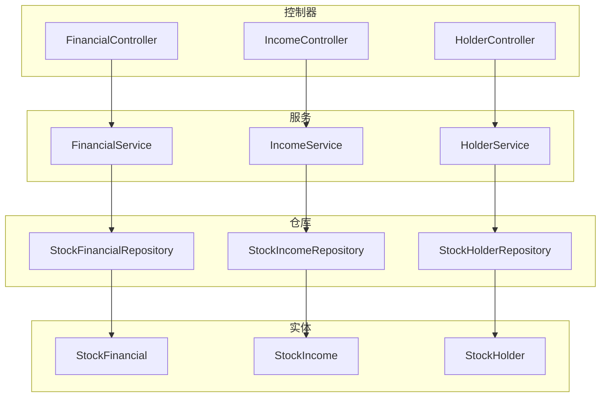
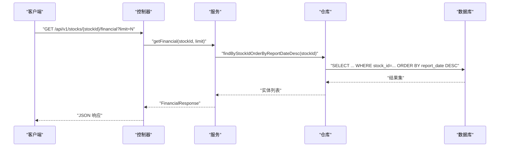
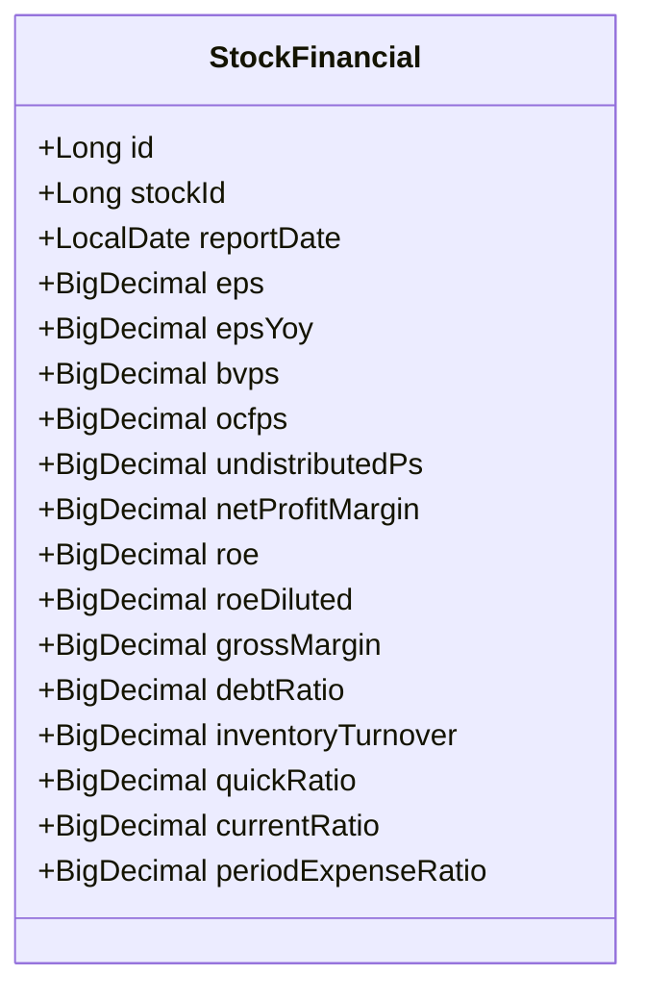
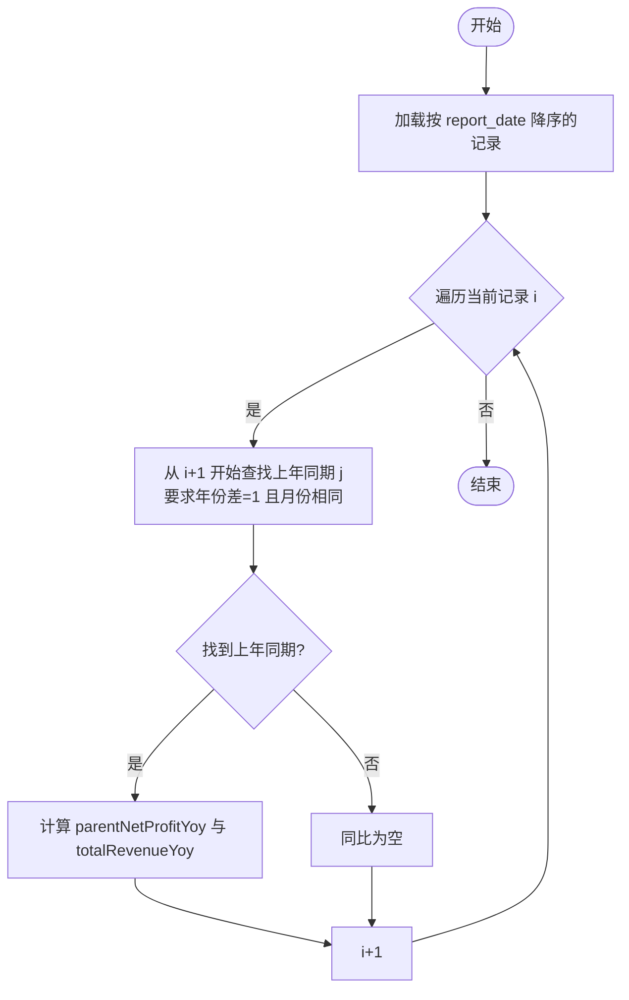
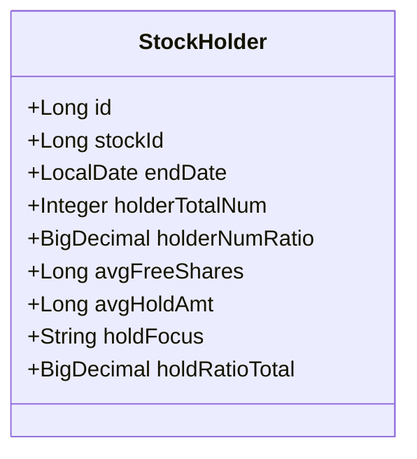
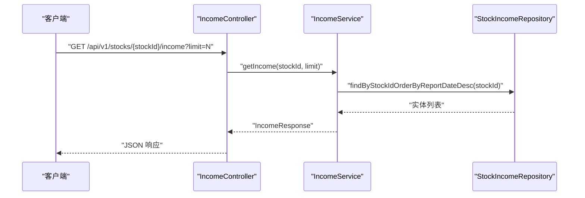
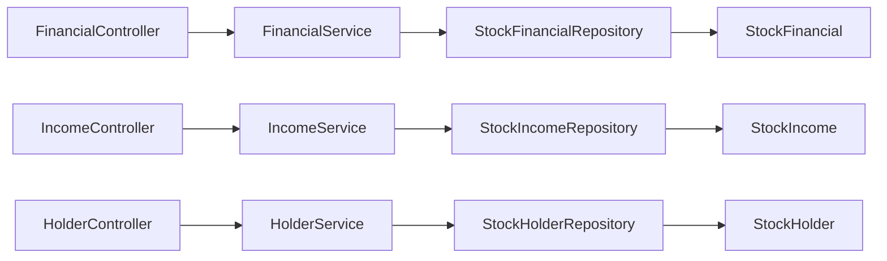

# 财务相关实体

<cite>
**本文引用的文件**
- [StockFinancial.java](file://backend/src/main/java/com/stock/entity/StockFinancial.java)
- [StockIncome.java](file://backend/src/main/java/com/stock/entity/StockIncome.java)
- [StockHolder.java](file://backend/src/main/java/com/stock/entity/StockHolder.java)
- [FinancialService.java](file://backend/src/main/java/com/stock/service/FinancialService.java)
- [IncomeService.java](file://backend/src/main/java/com/stock/service/IncomeService.java)
- [HolderService.java](file://backend/src/main/java/com/stock/service/HolderService.java)
- [StockFinancialRepository.java](file://backend/src/main/java/com/stock/repository/StockFinancialRepository.java)
- [StockIncomeRepository.java](file://backend/src/main/java/com/stock/repository/StockIncomeRepository.java)
- [StockHolderRepository.java](file://backend/src/main/java/com/stock/repository/StockHolderRepository.java)
- [FinancialController.java](file://backend/src/main/java/com/stock/controller/FinancialController.java)
- [IncomeController.java](file://backend/src/main/java/com/stock/controller/IncomeController.java)
- [HolderController.java](file://backend/src/main/java/com/stock/controller/HolderController.java)
- [FinancialItem.java](file://backend/src/main/java/com/stock/dto/response/FinancialItem.java)
- [IncomeItem.java](file://backend/src/main/java/com/stock/dto/response/IncomeItem.java)
- [HolderItem.java](file://backend/src/main/java/com/stock/dto/response/HolderItem.java)
</cite>

## 目录
1. [引言](#引言)
2. [项目结构](#项目结构)
3. [核心组件](#核心组件)
4. [架构总览](#架构总览)
5. [详细组件分析](#详细组件分析)
6. [依赖分析](#依赖分析)
7. [性能考虑](#性能考虑)
8. [故障排查指南](#故障排查指南)
9. [结论](#结论)
10. [附录](#附录)

## 引言
本文件聚焦于财务相关实体的设计与实现，覆盖以下主题：
- StockFinancial 财务数据实体的字段设计与财务指标含义
- StockIncome 收入实体的时间维度设计与季度/年度数据处理思路
- StockHolder 股东结构实体的层级关系与数据聚合策略
- 财务数据的标准化处理流程、数据验证规则与异常处理机制
- 财务报表数据的存储优化与查询性能提升方案

## 项目结构
财务相关模块采用分层架构：控制器（Controller）负责对外接口；服务（Service）封装业务逻辑；仓库（Repository）负责数据访问；实体（Entity）映射数据库表；响应 DTO（如 FinancialItem、IncomeItem、HolderItem）用于输出。

图表来源
- [FinancialController.java:1-23](file://backend/src/main/java/com/stock/controller/FinancialController.java#L1-L23)
- [IncomeController.java:1-23](file://backend/src/main/java/com/stock/controller/IncomeController.java#L1-L23)
- [HolderController.java:1-23](file://backend/src/main/java/com/stock/controller/HolderController.java#L1-L23)
- [FinancialService.java:1-45](file://backend/src/main/java/com/stock/service/FinancialService.java#L1-L45)
- [IncomeService.java:1-71](file://backend/src/main/java/com/stock/service/IncomeService.java#L1-L71)
- [HolderService.java:1-43](file://backend/src/main/java/com/stock/service/HolderService.java#L1-L43)
- [StockFinancialRepository.java:1-15](file://backend/src/main/java/com/stock/repository/StockFinancialRepository.java#L1-L15)
- [StockIncomeRepository.java:1-15](file://backend/src/main/java/com/stock/repository/StockIncomeRepository.java#L1-L15)
- [StockHolderRepository.java:1-15](file://backend/src/main/java/com/stock/repository/StockHolderRepository.java#L1-L15)
- [StockFinancial.java:1-72](file://backend/src/main/java/com/stock/entity/StockFinancial.java#L1-L72)
- [StockIncome.java:1-41](file://backend/src/main/java/com/stock/entity/StockIncome.java#L1-L41)
- [StockHolder.java:1-48](file://backend/src/main/java/com/stock/entity/StockHolder.java#L1-L48)

章节来源
- [FinancialController.java:1-23](file://backend/src/main/java/com/stock/controller/FinancialController.java#L1-L23)
- [IncomeController.java:1-23](file://backend/src/main/java/com/stock/controller/IncomeController.java#L1-L23)
- [HolderController.java:1-23](file://backend/src/main/java/com/stock/controller/HolderController.java#L1-L23)

## 核心组件
本节对三个财务实体进行字段设计与业务语义说明，并给出标准化处理流程与验证规则建议。

- StockFinancial（财务指标）
  - 字段设计要点
    - 主键与唯一约束：stock_id + report_date 唯一，避免重复报告日期的数据写入
    - 数值精度：使用高精度十进制类型保存财务比率与同比，保证计算精度
    - 指标类别：盈利能力（EPS、ROE 等）、营运能力（存货周转等）、偿债能力（速动比率、流动比率等）、成长性（EPS 同比）等
  - 标准化处理流程
    - 数据清洗：缺失值标记、异常值检测（如负数的债务比率或为零的分母）
    - 单位统一：统一为元、百分比、比率等标准单位
    - 时间对齐：按 report_date 降序排列，便于前端展示最新数据
  - 验证规则
    - 非空校验：stock_id、report_date 必填
    - 合法范围：比率类字段通常在 0~1 或 0~100 区间内，同比可正可负
    - 唯一性：同一股票同一天仅允许一条记录
  - 异常处理
    - 写入冲突：唯一约束冲突时返回错误或合并更新
    - 计算异常：除零或空值时，对应同比字段置空或标记未知

- StockIncome（收入与利润）
  - 字段设计要点
    - 报告类型：report_type 标识季度/年度，配合 report_date 实现时间维度
    - 唯一约束：stock_id + report_date + report_type 唯一，确保季度/年度不混
    - 财务数值：parentNetProfit、totalRevenue、operatingCost 等
  - 标准化处理流程
    - 报告类型解析：根据 report_type 与 report_date 推断会计期间
    - 同比计算：按年同比（上一年同月）近似匹配，计算 parentNetProfitYoy、totalRevenueYoy
    - 排序与截断：按 report_date 降序，限制返回条数
  - 验证规则
    - 非空校验：stock_id、report_date、report_type 必填
    - 报告类型枚举：仅接受“季度”、“年度”等预定义值
    - 数值合法性：收入与利润应非负，同比以百分比形式保留两位小数
  - 异常处理
    - 上年匹配失败：找不到对应去年同期时，同比字段为空
    - 除零保护：去年同期为 0 时，同比不计算

- StockHolder（股东结构）
  - 字段设计要点
    - 结束日期：end_date 表示该报告期末的股东状态，唯一约束避免重复
    - 聚合指标：holder_total_num、holder_num_ratio、avg_free_shares、avg_hold_amt、hold_ratio_total 等
  - 标准化处理流程
    - 时间对齐：按 end_date 降序排列，展示最新股东结构
    - 聚合策略：若存在多期数据，优先取最新一期；历史对比可做同比变化分析
  - 验证规则
    - 非空校验：stock_id、end_date 必填
    - 合法范围：持有比例类字段通常在 0~1 或 0~100 区间内
  - 异常处理
    - 数据缺失：若某期无股东数据，返回空集或提示无数据

章节来源
- [StockFinancial.java:1-72](file://backend/src/main/java/com/stock/entity/StockFinancial.java#L1-L72)
- [StockIncome.java:1-41](file://backend/src/main/java/com/stock/entity/StockIncome.java#L1-L41)
- [StockHolder.java:1-48](file://backend/src/main/java/com/stock/entity/StockHolder.java#L1-L48)
- [FinancialItem.java:1-22](file://backend/src/main/java/com/stock/dto/response/FinancialItem.java#L1-L22)
- [IncomeItem.java:1-14](file://backend/src/main/java/com/stock/dto/response/IncomeItem.java#L1-L14)
- [HolderItem.java:1-14](file://backend/src/main/java/com/stock/dto/response/HolderItem.java#L1-L14)

## 架构总览
下图展示了从控制器到服务、仓库与实体的调用链路与数据流向。

图表来源
- [FinancialController.java:1-23](file://backend/src/main/java/com/stock/controller/FinancialController.java#L1-L23)
- [FinancialService.java:1-45](file://backend/src/main/java/com/stock/service/FinancialService.java#L1-L45)
- [StockFinancialRepository.java:1-15](file://backend/src/main/java/com/stock/repository/StockFinancialRepository.java#L1-L15)
- [StockFinancial.java:1-72](file://backend/src/main/java/com/stock/entity/StockFinancial.java#L1-L72)

## 详细组件分析

### StockFinancial 实体与财务指标
- 字段与含义
  - 报告日期：report_date，作为时间主键之一
  - 盈利能力：eps、eps_yoy、bvps、roe、roe_diluted
  - 营运能力：ocfps、inventory_turnover
  - 成长性：eps_yoy
  - 偿债能力：quick_ratio、current_ratio
  - 费用控制：period_expense_ratio
  - 利润质量：net_profit_margin、debt_ratio
  - 未分配利润：undistributed_ps
- 设计模式与复杂度
  - JPA 映射：基于注解的 ORM 映射，唯一约束通过 @UniqueConstraint 定义
  - 查询复杂度：按 stock_id + report_date 排序，时间复杂度 O(n log n)，单次查询 O(n)
- 依赖关系
  - 与 FinancialService 的映射：服务层负责排序与截断、DTO 转换
  - 与 StockFinancialRepository 的交互：按 stock_id 降序查询

图表来源
- [StockFinancial.java:1-72](file://backend/src/main/java/com/stock/entity/StockFinancial.java#L1-L72)

章节来源
- [StockFinancial.java:1-72](file://backend/src/main/java/com/stock/entity/StockFinancial.java#L1-L72)
- [FinancialService.java:1-45](file://backend/src/main/java/com/stock/service/FinancialService.java#L1-L45)
- [StockFinancialRepository.java:1-15](file://backend/src/main/java/com/stock/repository/StockFinancialRepository.java#L1-L15)
- [FinancialItem.java:1-22](file://backend/src/main/java/com/stock/dto/response/FinancialItem.java#L1-L22)

### StockIncome 实体与时间维度
- 字段与含义
  - 报告日期：report_date
  - 报告类型：report_type（季度/年度）
  - 财务指标：parent_net_profit、total_revenue、operating_cost
- 同比计算逻辑
  - 近似匹配：寻找 report_date 年份差为 1、月份相同的记录作为上年同期
  - 计算公式：(当期-上年同期)/上年同期 × 100%，保留两位小数
  - 异常处理：上年同期为 0 或空值时不计算同比
- 设计模式与复杂度
  - 时间序列：按 report_date 降序排列，便于展示最新报告
  - 双重唯一约束：stock_id + report_date + report_type，避免重复或混淆
  - 同比计算复杂度：双重循环 O(n^2)，在数据量较大时需优化

图表来源
- [IncomeService.java:1-71](file://backend/src/main/java/com/stock/service/IncomeService.java#L1-L71)
- [StockIncome.java:1-41](file://backend/src/main/java/com/stock/entity/StockIncome.java#L1-L41)

章节来源
- [StockIncome.java:1-41](file://backend/src/main/java/com/stock/entity/StockIncome.java#L1-L41)
- [IncomeService.java:1-71](file://backend/src/main/java/com/stock/service/IncomeService.java#L1-L71)
- [StockIncomeRepository.java:1-15](file://backend/src/main/java/com/stock/repository/StockIncomeRepository.java#L1-L15)
- [IncomeItem.java:1-14](file://backend/src/main/java/com/stock/dto/response/IncomeItem.java#L1-L14)

### StockHolder 实体与数据聚合
- 字段与含义
  - 结束日期：end_date，表示该报告期末的股东结构
  - 聚合指标：holder_total_num、holder_num_ratio、avg_free_shares、avg_hold_amt、hold_ratio_total、hold_focus
- 聚合策略
  - 最新一期优先：按 end_date 降序取最新数据
  - 截断策略：limit 控制返回条数
- 设计模式与复杂度
  - 唯一约束：stock_id + end_date，避免重复期末数据
  - 查询复杂度：按 stock_id + end_date 降序，O(n log n)

图表来源
- [StockHolder.java:1-48](file://backend/src/main/java/com/stock/entity/StockHolder.java#L1-L48)

章节来源
- [StockHolder.java:1-48](file://backend/src/main/java/com/stock/entity/StockHolder.java#L1-L48)
- [HolderService.java:1-43](file://backend/src/main/java/com/stock/service/HolderService.java#L1-L43)
- [StockHolderRepository.java:1-15](file://backend/src/main/java/com/stock/repository/StockHolderRepository.java#L1-L15)
- [HolderItem.java:1-14](file://backend/src/main/java/com/stock/dto/response/HolderItem.java#L1-L14)

### 控制器与服务交互
- 控制器职责
  - 提供 REST 接口：/api/v1/stocks/{stockId}/financial、/income、/holders
  - 参数校验：stockId 存在性检查、limit 默认值与边界
- 服务职责
  - 数据查询：按 stock_id 查询并按时间倒序
  - 数据转换：实体转 DTO，必要时进行同比计算
  - 异常处理：股票不存在抛出业务异常

图表来源
- [IncomeController.java:1-23](file://backend/src/main/java/com/stock/controller/IncomeController.java#L1-L23)
- [IncomeService.java:1-71](file://backend/src/main/java/com/stock/service/IncomeService.java#L1-L71)
- [StockIncomeRepository.java:1-15](file://backend/src/main/java/com/stock/repository/StockIncomeRepository.java#L1-L15)

章节来源
- [FinancialController.java:1-23](file://backend/src/main/java/com/stock/controller/FinancialController.java#L1-L23)
- [IncomeController.java:1-23](file://backend/src/main/java/com/stock/controller/IncomeController.java#L1-L23)
- [HolderController.java:1-23](file://backend/src/main/java/com/stock/controller/HolderController.java#L1-L23)
- [FinancialService.java:1-45](file://backend/src/main/java/com/stock/service/FinancialService.java#L1-L45)
- [IncomeService.java:1-71](file://backend/src/main/java/com/stock/service/IncomeService.java#L1-L71)
- [HolderService.java:1-43](file://backend/src/main/java/com/stock/service/HolderService.java#L1-L43)

## 依赖分析
- 组件耦合
  - 控制器仅依赖服务接口，低耦合
  - 服务依赖仓库接口与股票仓储，中等耦合
  - 仓库依赖 JPA，与实体强耦合
- 外部依赖
  - Spring Data JPA 提供 CRUD 与排序能力
  - Lombok 简化实体与 DTO 的样板代码
- 潜在环路
  - 当前模块无循环依赖

图表来源
- [FinancialController.java:1-23](file://backend/src/main/java/com/stock/controller/FinancialController.java#L1-L23)
- [IncomeController.java:1-23](file://backend/src/main/java/com/stock/controller/IncomeController.java#L1-L23)
- [HolderController.java:1-23](file://backend/src/main/java/com/stock/controller/HolderController.java#L1-L23)
- [FinancialService.java:1-45](file://backend/src/main/java/com/stock/service/FinancialService.java#L1-L45)
- [IncomeService.java:1-71](file://backend/src/main/java/com/stock/service/IncomeService.java#L1-L71)
- [HolderService.java:1-43](file://backend/src/main/java/com/stock/service/HolderService.java#L1-L43)
- [StockFinancialRepository.java:1-15](file://backend/src/main/java/com/stock/repository/StockFinancialRepository.java#L1-L15)
- [StockIncomeRepository.java:1-15](file://backend/src/main/java/com/stock/repository/StockIncomeRepository.java#L1-L15)
- [StockHolderRepository.java:1-15](file://backend/src/main/java/com/stock/repository/StockHolderRepository.java#L1-L15)
- [StockFinancial.java:1-72](file://backend/src/main/java/com/stock/entity/StockFinancial.java#L1-L72)
- [StockIncome.java:1-41](file://backend/src/main/java/com/stock/entity/StockIncome.java#L1-L41)
- [StockHolder.java:1-48](file://backend/src/main/java/com/stock/entity/StockHolder.java#L1-L48)

章节来源
- [StockFinancialRepository.java:1-15](file://backend/src/main/java/com/stock/repository/StockFinancialRepository.java#L1-L15)
- [StockIncomeRepository.java:1-15](file://backend/src/main/java/com/stock/repository/StockIncomeRepository.java#L1-L15)
- [StockHolderRepository.java:1-15](file://backend/src/main/java/com/stock/repository/StockHolderRepository.java#L1-L15)

## 性能考虑
- 查询优化
  - 索引建议：stock_id + report_date（财务与收入）、stock_id + end_date（股东）建立复合索引
  - 分页与截断：服务层限制返回条数，避免一次性拉取过多数据
  - 排序优化：数据库层面按 report_date 或 end_date 降序，减少内存排序
- 计算优化
  - 同比计算：当前实现为 O(n^2)，建议引入“上年同期映射表”或缓存已匹配的上年同期，降低时间复杂度
  - 批量处理：入库时按 report_type 与 report_date 去重，减少重复计算
- 存储优化
  - 数值精度：统一使用高精度十进制，避免浮点误差累积
  - 数据压缩：对历史数据可考虑归档存储，减少在线库压力
- 缓存策略
  - 热点股票的最新财务数据可缓存，设置合理过期时间
  - DTO 序列化：避免重复转换，复用对象池

## 故障排查指南
- 常见问题
  - 股票不存在：StockNotFoundException，检查 stockId 是否正确
  - 数据重复：唯一约束冲突，检查 report_date 或 end_date 是否重复
  - 同比为空：上年同期缺失或为 0，检查 report_type 与 report_date 的匹配
- 排查步骤
  - 核对请求参数：stockId、limit、report_type
  - 检查数据库唯一约束是否生效
  - 查看服务层日志：是否存在空值或除零情况
- 建议
  - 在入库阶段增加数据校验与清洗
  - 对关键字段添加数据库级约束与默认值
  - 使用统一的异常处理器记录错误上下文

章节来源
- [FinancialService.java:1-45](file://backend/src/main/java/com/stock/service/FinancialService.java#L1-L45)
- [IncomeService.java:1-71](file://backend/src/main/java/com/stock/service/IncomeService.java#L1-L71)
- [HolderService.java:1-43](file://backend/src/main/java/com/stock/service/HolderService.java#L1-L43)

## 结论
本文系统梳理了财务相关实体的设计与实现，明确了字段语义、时间维度与聚合策略，并给出了标准化处理流程、验证规则与性能优化建议。通过合理的索引、缓存与计算优化，可在保证数据准确性的同时显著提升查询与计算效率。

## 附录
- API 示例
  - 获取财务数据：GET /api/v1/stocks/{stockId}/financial?limit=N
  - 获取收入数据：GET /api/v1/stocks/{stockId}/income?limit=N
  - 获取股东结构：GET /api/v1/stocks/{stockId}/holders?limit=N
- 关键配置
  - 默认 limit：8 条记录
  - 时间排序：按 report_date 或 end_date 降序
  - 报告类型：收入实体支持季度/年度区分