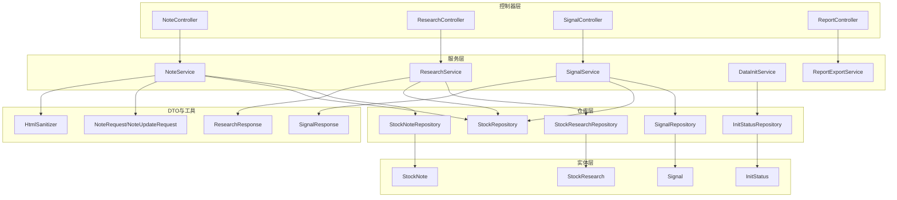
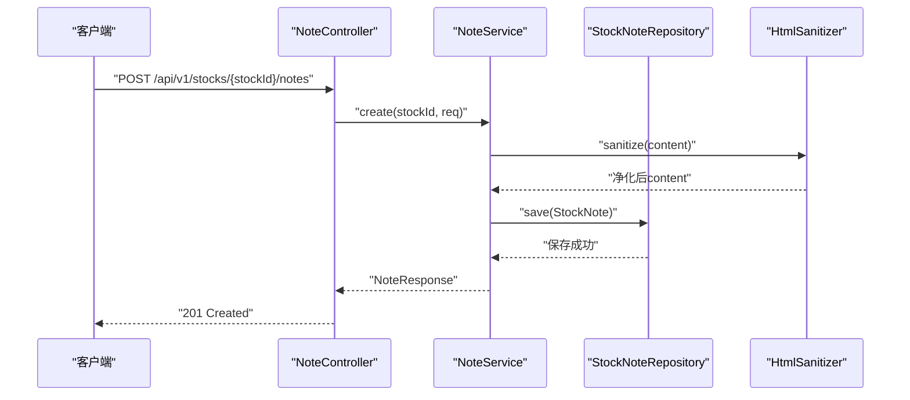
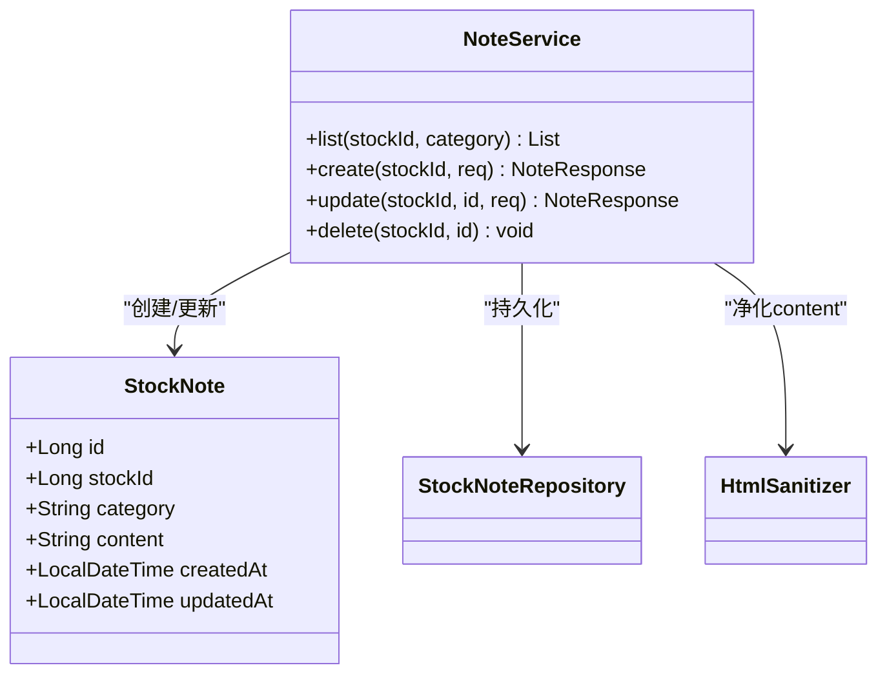
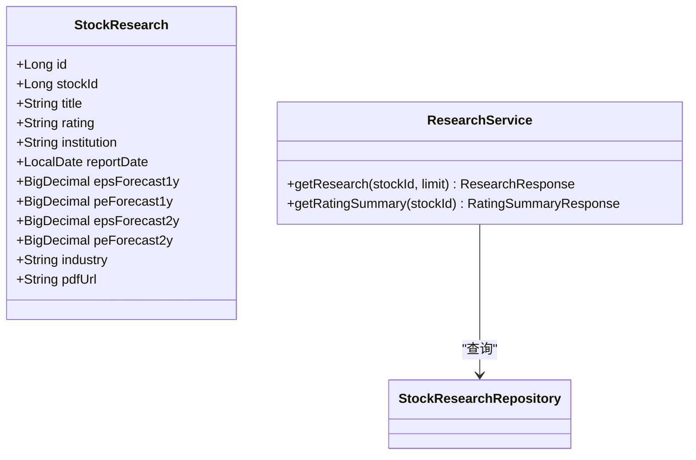
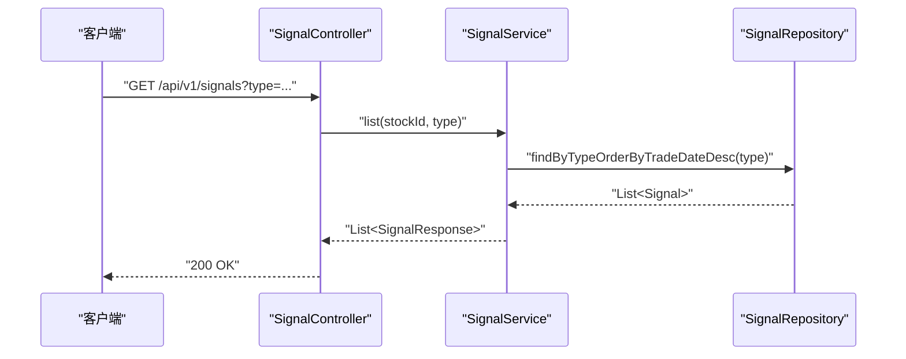
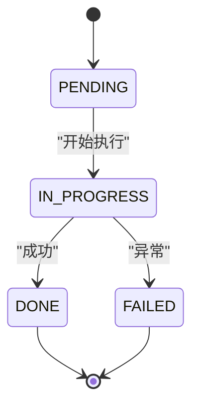
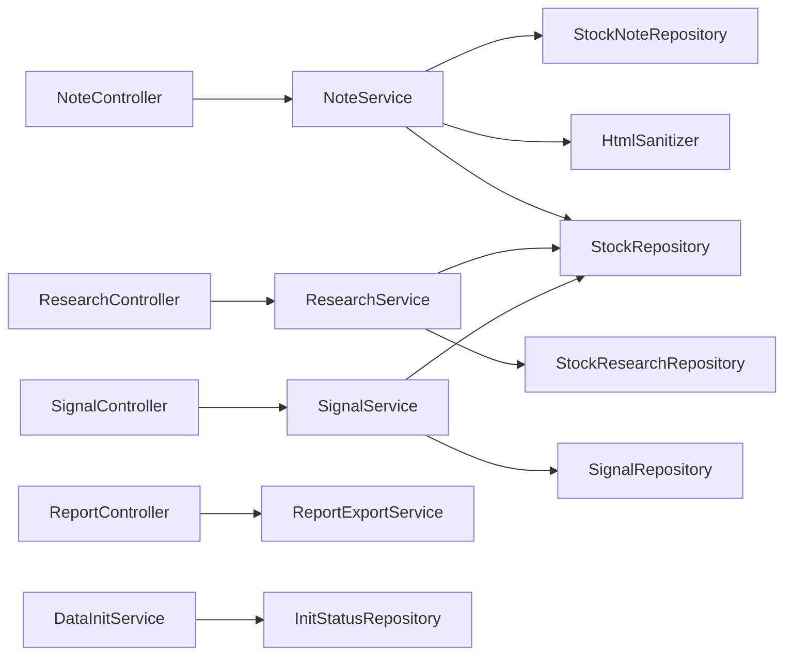

# 辅助功能实体

<cite>
**本文引用的文件**
- [StockNote.java](file://backend/src/main/java/com/stock/entity/StockNote.java)
- [StockResearch.java](file://backend/src/main/java/com/stock/entity/StockResearch.java)
- [Signal.java](file://backend/src/main/java/com/stock/entity/Signal.java)
- [InitStatus.java](file://backend/src/main/java/com/stock/entity/InitStatus.java)
- [NoteController.java](file://backend/src/main/java/com/stock/controller/NoteController.java)
- [ResearchController.java](file://backend/src/main/java/com/stock/controller/ResearchController.java)
- [SignalController.java](file://backend/src/main/java/com/stock/controller/SignalController.java)
- [ReportController.java](file://backend/src/main/java/com/stock/controller/ReportController.java)
- [NoteService.java](file://backend/src/main/java/com/stock/service/NoteService.java)
- [ResearchService.java](file://backend/src/main/java/com/stock/service/ResearchService.java)
- [SignalService.java](file://backend/src/main/java/com/stock/service/SignalService.java)
- [DataInitService.java](file://backend/src/main/java/com/stock/service/DataInitService.java)
- [StockNoteRepository.java](file://backend/src/main/java/com/stock/repository/StockNoteRepository.java)
- [StockResearchRepository.java](file://backend/src/main/java/com/stock/repository/StockResearchRepository.java)
- [SignalRepository.java](file://backend/src/main/java/com/stock/repository/SignalRepository.java)
- [InitStatusRepository.java](file://backend/src/main/java/com/stock/repository/InitStatusRepository.java)
- [StockRepository.java](file://backend/src/main/java/com/stock/repository/StockRepository.java)
- [NoteRequest.java](file://backend/src/main/java/com/stock/dto/request/NoteRequest.java)
- [NoteUpdateRequest.java](file://backend/src/main/java/com/stock/dto/request/NoteUpdateRequest.java)
- [ResearchResponse.java](file://backend/src/main/java/com/stock/dto/response/ResearchResponse.java)
- [SignalResponse.java](file://backend/src/main/java/com/stock/dto/response/SignalResponse.java)
- [ReportExportService.java](file://backend/src/main/java/com/stock/service/ReportExportService.java)
- [HtmlSanitizer.java](file://backend/src/main/java/com/stock/util/HtmlSanitizer.java)
</cite>

## 目录
1. [简介](#简介)
2. [项目结构](#项目结构)
3. [核心组件](#核心组件)
4. [架构总览](#架构总览)
5. [详细组件分析](#详细组件分析)
6. [依赖分析](#依赖分析)
7. [性能考虑](#性能考虑)
8. [故障排查指南](#故障排查指南)
9. [结论](#结论)
10. [附录](#附录)

## 简介
本文件聚焦于系统中的“辅助功能实体”，围绕以下四类实体展开：StockNote（股票笔记）、StockResearch（研究报告）、Signal（交易信号）、InitStatus（初始化状态）。文档从数据模型、文本存储与分类、内容组织、生成逻辑与触发条件、状态机与进度跟踪等方面进行深入解析，并补充文本安全存储、搜索优化、权限控制、隐私保护与数据备份策略建议。

## 项目结构
后端采用分层架构：控制器层负责HTTP接口；服务层封装业务逻辑；仓库层负责数据持久化；实体层定义数据模型；DTO用于请求/响应传输；工具类提供安全处理能力。辅助功能实体分布于实体、控制器、服务、仓库与DTO包中，形成清晰的职责边界。

图表来源
- [NoteController.java:14-50](file://backend/src/main/java/com/stock/controller/NoteController.java#L14-L50)
- [ResearchController.java:8-28](file://backend/src/main/java/com/stock/controller/ResearchController.java#L8-L28)
- [SignalController.java:9-29](file://backend/src/main/java/com/stock/controller/SignalController.java#L9-L29)
- [ReportController.java:9-26](file://backend/src/main/java/com/stock/controller/ReportController.java#L9-L26)
- [NoteService.java:17-78](file://backend/src/main/java/com/stock/service/NoteService.java#L17-L78)
- [ResearchService.java:16-87](file://backend/src/main/java/com/stock/service/ResearchService.java#L16-L87)
- [SignalService.java:12-50](file://backend/src/main/java/com/stock/service/SignalService.java#L12-L50)
- [DataInitService.java:17-100](file://backend/src/main/java/com/stock/service/DataInitService.java#L17-L100)
- [StockNoteRepository.java](file://backend/src/main/java/com/stock/repository/StockNoteRepository.java)
- [StockResearchRepository.java](file://backend/src/main/java/com/stock/repository/StockResearchRepository.java)
- [SignalRepository.java](file://backend/src/main/java/com/stock/repository/SignalRepository.java)
- [InitStatusRepository.java](file://backend/src/main/java/com/stock/repository/InitStatusRepository.java)
- [StockRepository.java](file://backend/src/main/java/com/stock/repository/StockRepository.java)
- [NoteRequest.java:6-9](file://backend/src/main/java/com/stock/dto/request/NoteRequest.java#L6-L9)
- [NoteUpdateRequest.java:6-8](file://backend/src/main/java/com/stock/dto/request/NoteUpdateRequest.java#L6-L8)
- [ResearchResponse.java:5-8](file://backend/src/main/java/com/stock/dto/response/ResearchResponse.java#L5-L8)
- [SignalResponse.java:5-12](file://backend/src/main/java/com/stock/dto/response/SignalResponse.java#L5-L12)
- [HtmlSanitizer.java](file://backend/src/main/java/com/stock/util/HtmlSanitizer.java)

章节来源
- [NoteController.java:14-50](file://backend/src/main/java/com/stock/controller/NoteController.java#L14-L50)
- [ResearchController.java:8-28](file://backend/src/main/java/com/stock/controller/ResearchController.java#L8-L28)
- [SignalController.java:9-29](file://backend/src/main/java/com/stock/controller/SignalController.java#L9-L29)
- [ReportController.java:9-26](file://backend/src/main/java/com/stock/controller/ReportController.java#L9-L26)

## 核心组件
本节对四个辅助功能实体进行要点梳理，包括字段含义、约束、默认值与典型用途。

- StockNote（股票笔记）
  - 关键字段：stockId、category、content（TEXT）、createdAt、updatedAt
  - 存储特性：content为LOB/TEXT，支持长文本；按更新时间倒序查询
  - 分类管理：通过category字段实现笔记分类
  - 安全处理：创建/更新时经由HTML净化器处理

- StockResearch（研究报告）
  - 关键字段：stockId、title、rating、institution、reportDate、多期EPS/PE预测、行业、PDF链接
  - 组织方式：按报告日期倒序展示；支持评级汇总统计
  - 数据精度：财务预测字段采用高精度数值类型

- Signal（交易信号）
  - 关键字段：stockId、type、tradeDate、description、isRead
  - 触发条件：来源于计算或外部数据源，按类型与日期筛选
  - 状态标记：支持标记已读

- InitStatus（初始化状态）
  - 关键字段：stockId、stepName、status（默认PENDING）
  - 唯一约束：stock_id与step_name组合唯一
  - 进度跟踪：异步初始化流程中逐步骤更新状态

章节来源
- [StockNote.java:15-36](file://backend/src/main/java/com/stock/entity/StockNote.java#L15-L36)
- [StockResearch.java:16-54](file://backend/src/main/java/com/stock/entity/StockResearch.java#L16-L54)
- [Signal.java:15-35](file://backend/src/main/java/com/stock/entity/Signal.java#L15-L35)
- [InitStatus.java:15-29](file://backend/src/main/java/com/stock/entity/InitStatus.java#L15-L29)

## 架构总览
下图展示了控制器到服务再到仓库与实体的整体调用链路，以及关键数据流。

图表来源
- [NoteController.java:30-35](file://backend/src/main/java/com/stock/controller/NoteController.java#L30-L35)
- [NoteService.java:40-55](file://backend/src/main/java/com/stock/service/NoteService.java#L40-L55)
- [HtmlSanitizer.java](file://backend/src/main/java/com/stock/util/HtmlSanitizer.java)

## 详细组件分析

### StockNote 股票笔记实体
- 文本存储与分类管理
  - 使用TEXT列存储长文本，适合自由格式笔记
  - 通过category字段实现分类检索，支持按stockId+category或仅stockId查询
  - 更新时间字段用于排序，确保最新笔记优先显示
- 安全存储
  - 创建与更新均调用HTML净化器，过滤潜在危险标签与脚本
  - DTO对content长度进行上限约束，防止异常输入
- 控制器与服务
  - 提供列表、创建、更新、删除接口
  - 服务层在事务中执行持久化，保证一致性

图表来源
- [StockNote.java:15-36](file://backend/src/main/java/com/stock/entity/StockNote.java#L15-L36)
- [NoteService.java:18-78](file://backend/src/main/java/com/stock/service/NoteService.java#L18-L78)
- [StockNoteRepository.java](file://backend/src/main/java/com/stock/repository/StockNoteRepository.java)
- [HtmlSanitizer.java](file://backend/src/main/java/com/stock/util/HtmlSanitizer.java)

章节来源
- [StockNote.java:15-36](file://backend/src/main/java/com/stock/entity/StockNote.java#L15-L36)
- [NoteService.java:28-72](file://backend/src/main/java/com/stock/service/NoteService.java#L28-L72)
- [NoteController.java:24-49](file://backend/src/main/java/com/stock/controller/NoteController.java#L24-L49)
- [NoteRequest.java:6-9](file://backend/src/main/java/com/stock/dto/request/NoteRequest.java#L6-L9)
- [NoteUpdateRequest.java:6-8](file://backend/src/main/java/com/stock/dto/request/NoteUpdateRequest.java#L6-L8)

### StockResearch 研究报告实体
- 数据结构与内容组织
  - 标题、评级、机构、报告日期、行业、PDF链接等元信息
  - 多期盈利与估值预测字段，便于趋势分析
  - 按报告日期倒序排列，便于查看最新研究
- 服务层功能
  - 支持分页式返回与评级汇总统计
  - 汇总计算共识目标价（基于PE与EPS预测）

图表来源
- [StockResearch.java:16-54](file://backend/src/main/java/com/stock/entity/StockResearch.java#L16-L54)
- [ResearchService.java:16-87](file://backend/src/main/java/com/stock/service/ResearchService.java#L16-L87)
- [StockResearchRepository.java](file://backend/src/main/java/com/stock/repository/StockResearchRepository.java)

章节来源
- [StockResearch.java:16-54](file://backend/src/main/java/com/stock/entity/StockResearch.java#L16-L54)
- [ResearchService.java:27-86](file://backend/src/main/java/com/stock/service/ResearchService.java#L27-L86)
- [ResearchController.java:18-27](file://backend/src/main/java/com/stock/controller/ResearchController.java#L18-L27)
- [ResearchResponse.java:5-8](file://backend/src/main/java/com/stock/dto/response/ResearchResponse.java#L5-L8)

### Signal 交易信号实体
- 生成逻辑与触发条件
  - 信号类型与交易日期是关键筛选维度
  - 可按股票、类型或全局范围查询
  - 支持标记已读，避免重复提醒
- 服务层处理
  - 查询时根据参数组合构建不同查询路径
  - 标记已读在事务中完成，确保一致性

图表来源
- [SignalController.java:19-23](file://backend/src/main/java/com/stock/controller/SignalController.java#L19-L23)
- [SignalService.java:21-34](file://backend/src/main/java/com/stock/service/SignalService.java#L21-L34)
- [SignalRepository.java](file://backend/src/main/java/com/stock/repository/SignalRepository.java)

章节来源
- [Signal.java:15-35](file://backend/src/main/java/com/stock/entity/Signal.java#L15-L35)
- [SignalService.java:21-43](file://backend/src/main/java/com/stock/service/SignalService.java#L21-L43)
- [SignalController.java:19-28](file://backend/src/main/java/com/stock/controller/SignalController.java#L19-L28)
- [SignalResponse.java:5-12](file://backend/src/main/java/com/stock/dto/response/SignalResponse.java#L5-L12)

### InitStatus 初始化状态实体
- 状态机设计与进度跟踪
  - 状态集合：PENDING、IN_PROGRESS、DONE、FAILED
  - 步骤名称唯一约束：同一股票的同一步骤仅保留一条记录
  - 异步初始化：顺序执行多个步骤，每步之间有延迟，失败时记录FAILED并继续后续步骤
  - 进度查询：聚合各步骤状态，计算已完成数量与总数

图表来源
- [InitStatus.java:15-29](file://backend/src/main/java/com/stock/entity/InitStatus.java#L15-L29)
- [DataInitService.java:42-92](file://backend/src/main/java/com/stock/service/DataInitService.java#L42-L92)

章节来源
- [InitStatus.java:15-29](file://backend/src/main/java/com/stock/entity/InitStatus.java#L15-L29)
- [DataInitService.java:23-92](file://backend/src/main/java/com/stock/service/DataInitService.java#L23-L92)

## 依赖分析
- 控制器到服务：通过构造函数注入，解耦接口与实现
- 服务到仓库：通过JPA仓库进行CRUD与查询
- 实体到表映射：JPA注解定义表名与字段约束
- DTO到实体：服务层在持久化前进行转换与校验
- 工具类：HTML净化器在写入前统一处理

图表来源
- [NoteController.java:18-22](file://backend/src/main/java/com/stock/controller/NoteController.java#L18-L22)
- [ResearchController.java:12-16](file://backend/src/main/java/com/stock/controller/ResearchController.java#L12-L16)
- [SignalController.java:13-17](file://backend/src/main/java/com/stock/controller/SignalController.java#L13-L17)
- [ReportController.java:13-17](file://backend/src/main/java/com/stock/controller/ReportController.java#L13-L17)
- [NoteService.java:20-26](file://backend/src/main/java/com/stock/service/NoteService.java#L20-L26)
- [ResearchService.java:19-25](file://backend/src/main/java/com/stock/service/ResearchService.java#L19-L25)
- [SignalService.java:15-19](file://backend/src/main/java/com/stock/service/SignalService.java#L15-L19)
- [DataInitService.java:19-40](file://backend/src/main/java/com/stock/service/DataInitService.java#L19-L40)
- [HtmlSanitizer.java](file://backend/src/main/java/com/stock/util/HtmlSanitizer.java)

章节来源
- [NoteService.java:18-78](file://backend/src/main/java/com/stock/service/NoteService.java#L18-L78)
- [ResearchService.java:16-87](file://backend/src/main/java/com/stock/service/ResearchService.java#L16-L87)
- [SignalService.java:12-50](file://backend/src/main/java/com/stock/service/SignalService.java#L12-L50)
- [DataInitService.java:17-100](file://backend/src/main/java/com/stock/service/DataInitService.java#L17-L100)

## 性能考虑
- 查询索引建议
  - StockNote：按stockId与category建立复合索引，提升分类检索效率
  - StockResearch：按stockId与reportDate建立索引，加速报告列表与评级汇总
  - Signal：按stockId/type/tradeDate建立索引，优化筛选与排序
  - InitStatus：按stockId与stepName建立索引，保障状态查询与去重
- 分页与限制
  - 研究报告接口支持limit参数，避免一次性加载过多数据
- 缓存策略
  - 对热点股票的研究报告与信号可引入Redis缓存，降低数据库压力
- 异步初始化
  - 初始化流程采用异步执行与步骤间延迟，避免瞬时并发冲击

## 故障排查指南
- 股票不存在异常
  - 在服务层对stockId存在性进行前置校验，避免无效数据写入
- 笔记内容异常
  - HTML净化器会过滤危险内容；若出现显示问题，检查净化规则与前端渲染
- 信号未读状态
  - 确认标记已读接口是否被调用；核对isRead字段更新
- 初始化失败
  - 查看日志输出，定位具体步骤；确认网络与第三方数据源可用性

章节来源
- [NoteService.java:29-31](file://backend/src/main/java/com/stock/service/NoteService.java#L29-L31)
- [ResearchService.java:28-30](file://backend/src/main/java/com/stock/service/ResearchService.java#L28-L30)
- [SignalService.java:38-40](file://backend/src/main/java/com/stock/service/SignalService.java#L38-L40)
- [DataInitService.java:60-63](file://backend/src/main/java/com/stock/service/DataInitService.java#L60-L63)

## 结论
本文系统梳理了StockNote、StockResearch、Signal与InitStatus四大辅助功能实体，覆盖其数据模型、文本存储与分类、内容组织、生成与触发、状态机与进度跟踪等关键点。结合仓库层与服务层的协作，形成了稳定、可扩展的业务支撑。建议在生产环境中完善索引、缓存与异步处理策略，并持续优化安全净化与权限控制以满足合规要求。

## 附录
- 文本安全存储方案
  - 写入前统一进行HTML净化，移除潜在XSS与恶意脚本
  - 对超长文本设置合理上限，避免内存与存储压力
  - 记录审计日志，追踪敏感内容变更
- 搜索优化策略
  - 针对高频查询字段建立索引
  - 使用分页与限制返回条数，避免全表扫描
  - 对全文检索需求可引入搜索引擎（如Elasticsearch）进行二次检索
- 权限控制设计
  - 基于角色的访问控制（RBAC），限制对笔记与研究数据的读写
  - 对外暴露接口增加鉴权与白名单校验
- 用户交互数据的隐私保护
  - 最小化采集原则，明确数据用途与保留期限
  - 对个人身份信息进行脱敏或加密存储
- 数据备份策略
  - 定期全量与增量备份，验证恢复流程
  - 对重要业务数据（如研究报告、交易信号）制定快照策略