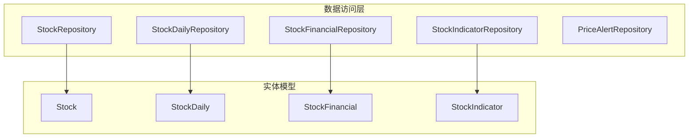
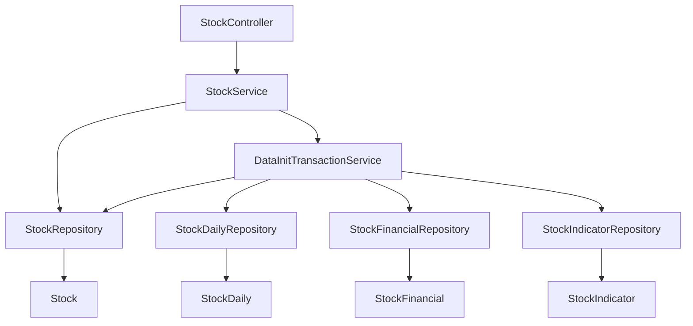
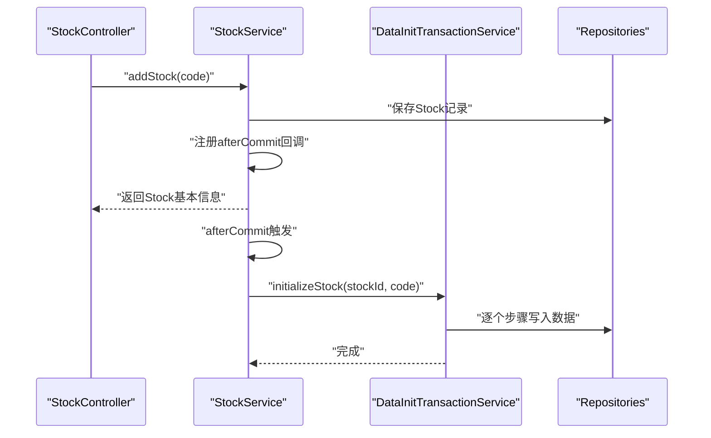
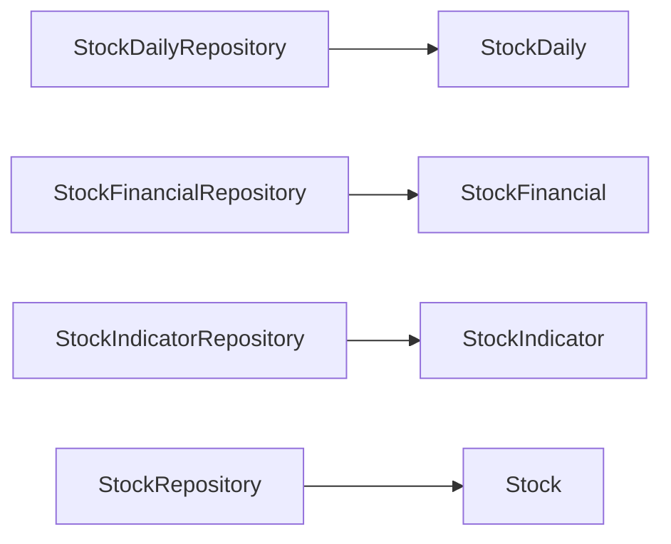

# 数据访问层设计

<cite>
**本文引用的文件**
- [application.yml](file://backend/src/main/resources/application.yml)
- [StockRepository.java](file://backend/src/main/java/com/stock/repository/StockRepository.java)
- [StockDailyRepository.java](file://backend/src/main/java/com/stock/repository/StockDailyRepository.java)
- [StockFinancialRepository.java](file://backend/src/main/java/com/stock/repository/StockFinancialRepository.java)
- [StockIndicatorRepository.java](file://backend/src/main/java/com/stock/repository/StockIndicatorRepository.java)
- [PriceAlertRepository.java](file://backend/src/main/java/com/stock/repository/PriceAlertRepository.java)
- [DataInitTransactionService.java](file://backend/src/main/java/com/stock/service/DataInitTransactionService.java)
- [StockService.java](file://backend/src/main/java/com/stock/service/StockService.java)
- [Stock.java](file://backend/src/main/java/com/stock/entity/Stock.java)
- [StockDaily.java](file://backend/src/main/java/com/stock/entity/StockDaily.java)
- [StockFinancial.java](file://backend/src/main/java/com/stock/entity/StockFinancial.java)
- [StockIndicator.java](file://backend/src/main/java/com/stock/entity/StockIndicator.java)
- [StockControllerTest.java](file://backend/src/test/java/com/stock/controller/StockControllerTest.java)
</cite>

## 目录
1. [引言](#引言)
2. [项目结构](#项目结构)
3. [核心组件](#核心组件)
4. [架构总览](#架构总览)
5. [详细组件分析](#详细组件分析)
6. [依赖分析](#依赖分析)
7. [性能考虑](#性能考虑)
8. [故障排查指南](#故障排查指南)
9. [结论](#结论)
10. [附录](#附录)

## 引言
本文件系统化阐述该股票交易系统数据访问层（Repository Layer）的设计与实现，覆盖以下主题：
- @Repository 注解与 Spring Data JPA 的使用
- Repository 接口设计原则与查询方法命名规范
- 自定义查询方法与 @Query/@Param 的应用
- 复杂查询示例与批量操作优化策略
- 事务管理在数据访问层的应用
- Repository 层测试与集成测试策略
- 性能优化与数据库查询优化建议

## 项目结构
后端采用分层架构，数据访问层位于 repository 包，围绕实体类进行 CRUD 与查询扩展；服务层通过 @Transactional 管理事务边界；控制器层负责对外接口。

图表来源
- [StockRepository.java:10-17](file://backend/src/main/java/com/stock/repository/StockRepository.java#L10-L17)
- [StockDailyRepository.java:13-23](file://backend/src/main/java/com/stock/repository/StockDailyRepository.java#L13-L23)
- [StockFinancialRepository.java:9-14](file://backend/src/main/java/com/stock/repository/StockFinancialRepository.java#L9-L14)
- [StockIndicatorRepository.java:12-20](file://backend/src/main/java/com/stock/repository/StockIndicatorRepository.java#L12-L20)
- [PriceAlertRepository.java:9-16](file://backend/src/main/java/com/stock/repository/PriceAlertRepository.java#L9-L16)
- [Stock.java:17-84](file://backend/src/main/java/com/stock/entity/Stock.java#L17-L84)
- [StockDaily.java:18-59](file://backend/src/main/java/com/stock/entity/StockDaily.java#L18-L59)
- [StockFinancial.java:18-71](file://backend/src/main/java/com/stock/entity/StockFinancial.java#L18-L71)
- [StockIndicator.java:18-71](file://backend/src/main/java/com/stock/entity/StockIndicator.java#L18-L71)

章节来源
- [application.yml:4-17](file://backend/src/main/resources/application.yml#L4-L17)

## 核心组件
- Repository 接口均继承 JpaRepository，天然具备基础 CRUD 与分页排序能力。
- 查询方法遵循 Spring Data JPA 方法名解析规则，支持动态查询生成。
- 部分复杂查询使用 @Query + @Param 显式声明 JPQL/HQL 或原生 SQL。
- 批量写入通过 saveAll 等方法实现，减少往返与事务开销。
- 事务通过 @Transactional 在服务层统一管理，避免自调用导致代理失效。

章节来源
- [StockRepository.java:10-17](file://backend/src/main/java/com/stock/repository/StockRepository.java#L10-L17)
- [StockDailyRepository.java:13-23](file://backend/src/main/java/com/stock/repository/StockDailyRepository.java#L13-L23)
- [StockFinancialRepository.java:9-14](file://backend/src/main/java/com/stock/repository/StockFinancialRepository.java#L9-L14)
- [StockIndicatorRepository.java:12-20](file://backend/src/main/java/com/stock/repository/StockIndicatorRepository.java#L12-L20)
- [PriceAlertRepository.java:9-16](file://backend/src/main/java/com/stock/repository/PriceAlertRepository.java#L9-L16)
- [DataInitTransactionService.java:35-150](file://backend/src/main/java/com/stock/service/DataInitTransactionService.java#L35-L150)

## 架构总览
下图展示数据访问层与实体、服务层的交互关系及事务边界：

图表来源
- [StockService.java:147-176](file://backend/src/main/java/com/stock/service/StockService.java#L147-L176)
- [DataInitTransactionService.java:22-33](file://backend/src/main/java/com/stock/service/DataInitTransactionService.java#L22-L33)
- [StockRepository.java:10-17](file://backend/src/main/java/com/stock/repository/StockRepository.java#L10-L17)
- [StockDailyRepository.java:13-23](file://backend/src/main/java/com/stock/repository/StockDailyRepository.java#L13-L23)
- [StockFinancialRepository.java:9-14](file://backend/src/main/java/com/stock/repository/StockFinancialRepository.java#L9-L14)
- [StockIndicatorRepository.java:12-20](file://backend/src/main/java/com/stock/repository/StockIndicatorRepository.java#L12-L20)
- [Stock.java:17-84](file://backend/src/main/java/com/stock/entity/Stock.java#L17-L84)
- [StockDaily.java:18-59](file://backend/src/main/java/com/stock/entity/StockDaily.java#L18-L59)
- [StockFinancial.java:18-71](file://backend/src/main/java/com/stock/entity/StockFinancial.java#L18-L71)
- [StockIndicator.java:18-71](file://backend/src/main/java/com/stock/entity/StockIndicator.java#L18-L71)

## 详细组件分析

### Repository 接口设计原则
- 统一继承 JpaRepository<T, ID>，获得标准 CRUD、分页与排序能力。
- 使用谓词式方法名表达查询意图，如 findByXxx、existsByXxx、countByXxx 等。
- 对于范围查询，使用 Between/After/Before 等关键字组合参数。
- 对于聚合查询，优先使用 @Query + @Param 声明明确的 JPQL/HQL。
- 对于批量删除或清理，提供 deleteByXxx 方法以简化级联删除逻辑。

章节来源
- [StockRepository.java:10-17](file://backend/src/main/java/com/stock/repository/StockRepository.java#L10-L17)
- [StockDailyRepository.java:13-23](file://backend/src/main/java/com/stock/repository/StockDailyRepository.java#L13-L23)
- [StockFinancialRepository.java:9-14](file://backend/src/main/java/com/stock/repository/StockFinancialRepository.java#L9-L14)
- [StockIndicatorRepository.java:12-20](file://backend/src/main/java/com/stock/repository/StockIndicatorRepository.java#L12-L20)
- [PriceAlertRepository.java:9-16](file://backend/src/main/java/com/stock/repository/PriceAlertRepository.java#L9-L16)

### 查询方法命名规范与示例
- 基础条件查询：findByXxx(...)
- 范围查询：findByXxxBetweenOrderByXxx(...)
- 最值查询：findTopByXxxOrderByXxxDesc(...)
- 聚合查询：@Query("SELECT MAX(xxx) FROM Entity x WHERE x.id = :id")

示例路径
- [StockDailyRepository.java:15-20](file://backend/src/main/java/com/stock/repository/StockDailyRepository.java#L15-L20)
- [StockIndicatorRepository.java:14-17](file://backend/src/main/java/com/stock/repository/StockIndicatorRepository.java#L14-L17)

章节来源
- [StockDailyRepository.java:13-23](file://backend/src/main/java/com/stock/repository/StockDailyRepository.java#L13-L23)
- [StockIndicatorRepository.java:12-20](file://backend/src/main/java/com/stock/repository/StockIndicatorRepository.java#L12-L20)

### @Query 与 @Param 的使用
- 使用 @Query 定义 JPQL/HQL，@Param 绑定命名参数，提升可读性与可维护性。
- 常用于复杂聚合、跨表统计、去重计数等场景。
- 示例路径
  - [StockDailyRepository.java:19-20](file://backend/src/main/java/com/stock/repository/StockDailyRepository.java#L19-L20)
  - [StockIndicatorRepository.java:16-17](file://backend/src/main/java/com/stock/repository/StockIndicatorRepository.java#L16-L17)

章节来源
- [StockDailyRepository.java:13-23](file://backend/src/main/java/com/stock/repository/StockDailyRepository.java#L13-L23)
- [StockIndicatorRepository.java:12-20](file://backend/src/main/java/com/stock/repository/StockIndicatorRepository.java#L12-L20)

### 复杂查询编写方法
- 范围与排序组合：按日期区间查询并按日期降序排列。
- 最大值查询：通过子查询或函数聚合获取最新交易日。
- 聚合统计：结合 @Query 实现按条件的最大/最小/平均等统计。

示例路径
- [StockDailyRepository.java:15-20](file://backend/src/main/java/com/stock/repository/StockDailyRepository.java#L15-L20)
- [StockIndicatorRepository.java:14-17](file://backend/src/main/java/com/stock/repository/StockIndicatorRepository.java#L14-L17)

章节来源
- [StockDailyRepository.java:13-23](file://backend/src/main/java/com/stock/repository/StockDailyRepository.java#L13-L23)
- [StockIndicatorRepository.java:12-20](file://backend/src/main/java/com/stock/repository/StockIndicatorRepository.java#L12-L20)

### Repository 实现示例
- StockRepository：基于代码唯一性查询与状态过滤。
- StockDailyRepository：按股票与日期范围查询行情、取最新交易日、统计最大交易日。
- StockFinancialRepository：按报告期倒序查询财务指标。
- StockIndicatorRepository：按交易日之后查询技术指标、统计最大交易日。
- PriceAlertRepository：按股票与触发状态查询预警。

示例路径
- [StockRepository.java:10-17](file://backend/src/main/java/com/stock/repository/StockRepository.java#L10-L17)
- [StockDailyRepository.java:13-23](file://backend/src/main/java/com/stock/repository/StockDailyRepository.java#L13-L23)
- [StockFinancialRepository.java:9-14](file://backend/src/main/java/com/stock/repository/StockFinancialRepository.java#L9-L14)
- [StockIndicatorRepository.java:12-20](file://backend/src/main/java/com/stock/repository/StockIndicatorRepository.java#L12-L20)
- [PriceAlertRepository.java:9-16](file://backend/src/main/java/com/stock/repository/PriceAlertRepository.java#L9-L16)

章节来源
- [StockRepository.java:10-17](file://backend/src/main/java/com/stock/repository/StockRepository.java#L10-L17)
- [StockDailyRepository.java:13-23](file://backend/src/main/java/com/stock/repository/StockDailyRepository.java#L13-L23)
- [StockFinancialRepository.java:9-14](file://backend/src/main/java/com/stock/repository/StockFinancialRepository.java#L9-L14)
- [StockIndicatorRepository.java:12-20](file://backend/src/main/java/com/stock/repository/StockIndicatorRepository.java#L12-L20)
- [PriceAlertRepository.java:9-16](file://backend/src/main/java/com/stock/repository/PriceAlertRepository.java#L9-L16)

### 事务管理在数据访问层的应用
- 通过 @Transactional 在服务层开启事务，确保初始化步骤的原子性与一致性。
- 避免自调用导致代理失效：将事务性操作放入独立服务（如 DataInitTransactionService），由其他服务调用。
- 事务同步回调：在 StockService 中注册 afterCommit 回调，保证初始化任务在提交后异步执行。

图表来源
- [StockService.java:147-176](file://backend/src/main/java/com/stock/service/StockService.java#L147-L176)
- [DataInitTransactionService.java:35-150](file://backend/src/main/java/com/stock/service/DataInitTransactionService.java#L35-L150)

章节来源
- [StockService.java:147-176](file://backend/src/main/java/com/stock/service/StockService.java#L147-L176)
- [DataInitTransactionService.java:22-33](file://backend/src/main/java/com/stock/service/DataInitTransactionService.java#L22-L33)

### 批量操作优化策略
- 批量写入：使用 saveAll 将多个实体一次性持久化，减少往返与事务开销。
- 分批处理：对超大数据集分批处理，控制内存占用与锁竞争。
- 去重约束：利用实体上的唯一约束（如 StockDaily、StockFinancial、StockIndicator 的唯一索引）避免重复写入。
- 清理策略：提供 deleteByStockId 等方法，配合服务层级联删除，保持数据一致性。

示例路径
- [StockDailyRepository.java](file://backend/src/main/java/com/stock/repository/StockDailyRepository.java#L22)
- [StockFinancialRepository.java](file://backend/src/main/java/com/stock/repository/StockFinancialRepository.java#L13)
- [StockIndicatorRepository.java](file://backend/src/main/java/com/stock/repository/StockIndicatorRepository.java#L19)
- [DataInitTransactionService.java:57-63](file://backend/src/main/java/com/stock/service/DataInitTransactionService.java#L57-L63)

章节来源
- [StockDailyRepository.java:13-23](file://backend/src/main/java/com/stock/repository/StockDailyRepository.java#L13-L23)
- [StockFinancialRepository.java:9-14](file://backend/src/main/java/com/stock/repository/StockFinancialRepository.java#L9-L14)
- [StockIndicatorRepository.java:12-20](file://backend/src/main/java/com/stock/repository/StockIndicatorRepository.java#L12-L20)
- [DataInitTransactionService.java:50-108](file://backend/src/main/java/com/stock/service/DataInitTransactionService.java#L50-L108)

### Repository 层测试方法与集成测试策略
- 单元测试：使用 MockMvc 测试控制器行为，验证接口返回与 JSON 结构。
- 集成测试：通过 @DataJpaTest 或 @ImportAutoConfiguration 等方式加载数据源与 JPA 上下文，验证 Repository 行为。
- 测试策略要点：
  - 使用 H2 内存数据库进行快速回归测试。
  - 通过 @Transactional 在测试结束后回滚，保证测试隔离。
  - 针对复杂查询，构造边界数据（空集、单条、多条、时间边界）进行验证。

示例路径
- [StockControllerTest.java:51-114](file://backend/src/test/java/com/stock/controller/StockControllerTest.java#L51-L114)
- [application.yml:4-17](file://backend/src/main/resources/application.yml#L4-L17)

章节来源
- [StockControllerTest.java:30-115](file://backend/src/test/java/com/stock/controller/StockControllerTest.java#L30-L115)
- [application.yml:4-17](file://backend/src/main/resources/application.yml#L4-L17)

## 依赖分析
- Repository 与实体之间为一对一/一对多映射关系，通过外键 stock_id 关联。
- 服务层通过注入多个 Repository 实现跨表数据的协调与事务控制。
- 配置层使用 H2 文件数据库，便于开发与测试环境快速搭建。

图表来源
- [StockDailyRepository.java:13-23](file://backend/src/main/java/com/stock/repository/StockDailyRepository.java#L13-L23)
- [StockFinancialRepository.java:9-14](file://backend/src/main/java/com/stock/repository/StockFinancialRepository.java#L9-L14)
- [StockIndicatorRepository.java:12-20](file://backend/src/main/java/com/stock/repository/StockIndicatorRepository.java#L12-L20)
- [StockRepository.java:10-17](file://backend/src/main/java/com/stock/repository/StockRepository.java#L10-L17)
- [StockDaily.java:18-59](file://backend/src/main/java/com/stock/entity/StockDaily.java#L18-L59)
- [StockFinancial.java:18-71](file://backend/src/main/java/com/stock/entity/StockFinancial.java#L18-L71)
- [StockIndicator.java:18-71](file://backend/src/main/java/com/stock/entity/StockIndicator.java#L18-L71)
- [Stock.java:17-84](file://backend/src/main/java/com/stock/entity/Stock.java#L17-L84)

章节来源
- [application.yml:4-17](file://backend/src/main/resources/application.yml#L4-L17)

## 性能考虑
- 查询优化
  - 为高频查询列建立索引（如 stock_id、trade_date、report_date）。
  - 使用投影查询仅返回必要字段，减少网络与序列化开销。
  - 避免 N+1 查询：通过 join fetch 或批量抓取策略一次性加载关联数据。
- 写入优化
  - 使用批量插入与批量更新，减少事务次数。
  - 控制每批大小，避免长时间持有行级锁。
- 缓存策略
  - 对只读或低频变更的数据引入缓存（如 Redis），降低数据库压力。
- 事务与锁
  - 缩短事务时间，避免在事务中执行耗时操作（I/O、远程调用）。
  - 使用合适的隔离级别，平衡一致性与并发性能。

## 故障排查指南
- 查询结果为空
  - 检查输入参数是否正确（如 stock_id、日期范围）。
  - 确认实体唯一约束是否导致重复数据被忽略。
- 事务未生效
  - 确保 @Transactional 注解在可被 Spring 代理的方法上。
  - 避免同类内部自调用，改用独立服务或使用 AopContext.currentProxy()。
- 性能问题
  - 使用慢查询日志与执行计划分析工具定位瓶颈。
  - 对热点查询增加复合索引或物化视图。
- 测试失败
  - 确认测试数据库连接与 schema 初始化配置。
  - 使用 @Rollback(false) 临时保留数据以便调试。

章节来源
- [application.yml:4-17](file://backend/src/main/resources/application.yml#L4-L17)
- [StockService.java:147-176](file://backend/src/main/java/com/stock/service/StockService.java#L147-L176)
- [DataInitTransactionService.java:35-150](file://backend/src/main/java/com/stock/service/DataInitTransactionService.java#L35-L150)

## 结论
本数据访问层以 Spring Data JPA 为基础，结合清晰的查询方法命名与 @Query/@Param 的显式查询，实现了高内聚、易维护的仓储接口。通过服务层统一事务管理与异步初始化，保障了数据一致性与系统性能。配合批量写入、索引与缓存策略，可在高并发场景下稳定运行。

## 附录
- 配置要点
  - 数据源与 JPA 属性：参考 application.yml 中的 datasource、jpa、h2.console 配置。
- 实体与表结构
  - Stock、StockDaily、StockFinancial、StockIndicator 等实体对应数据库表，具备唯一约束与数值精度定义，便于精确查询与统计。

章节来源
- [application.yml:4-17](file://backend/src/main/resources/application.yml#L4-L17)
- [Stock.java:17-84](file://backend/src/main/java/com/stock/entity/Stock.java#L17-L84)
- [StockDaily.java:18-59](file://backend/src/main/java/com/stock/entity/StockDaily.java#L18-L59)
- [StockFinancial.java:18-71](file://backend/src/main/java/com/stock/entity/StockFinancial.java#L18-L71)
- [StockIndicator.java:18-71](file://backend/src/main/java/com/stock/entity/StockIndicator.java#L18-L71)