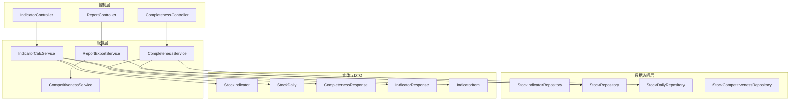
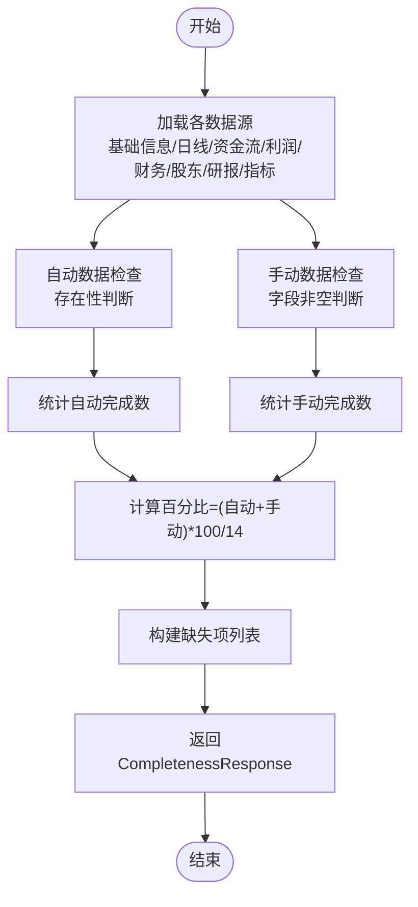
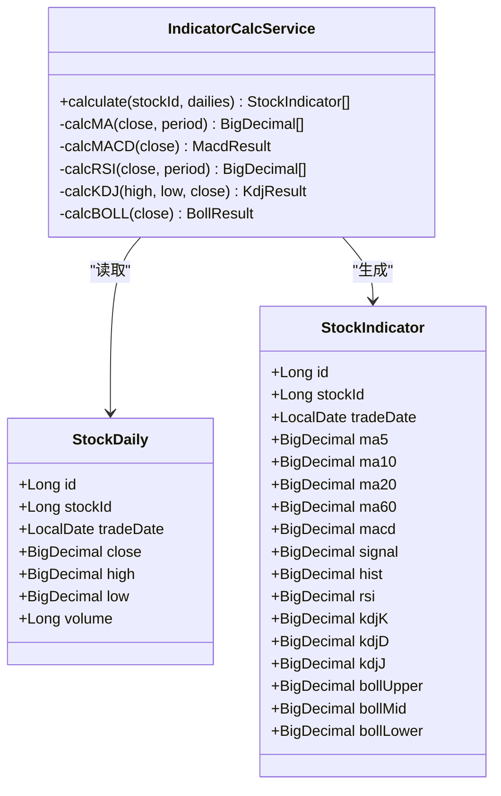
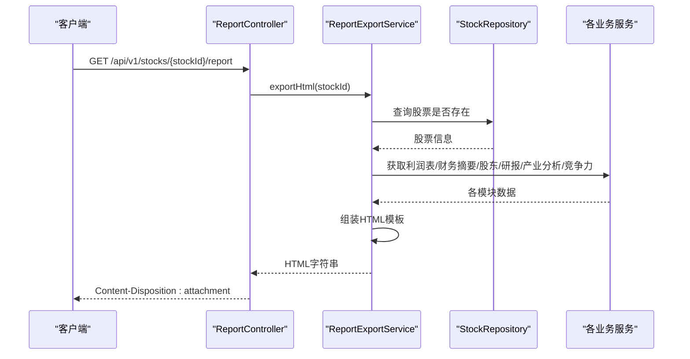
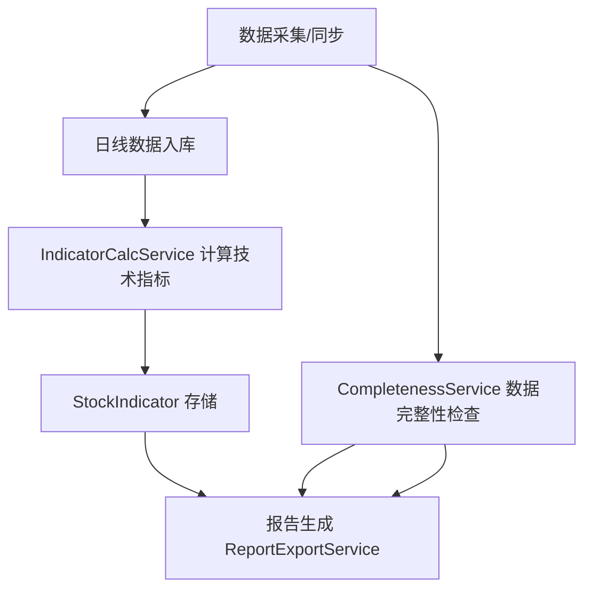
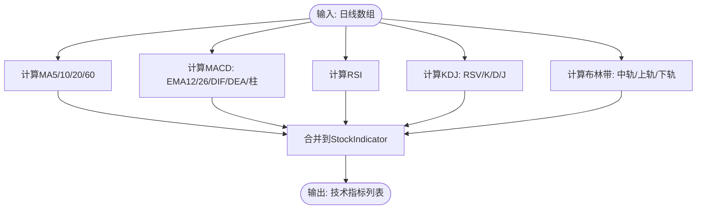
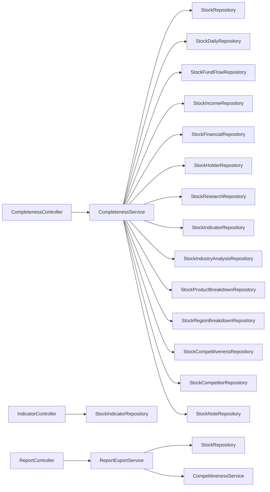
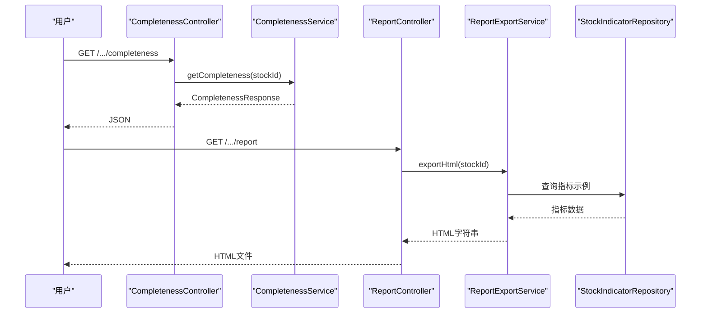

# 其他业务服务

<cite>
**本文引用的文件**
- [CompletenessService.java](file://backend/src/main/java/com/stock/service/CompletenessService.java)
- [CompletenessController.java](file://backend/src/main/java/com/stock/controller/CompletenessController.java)
- [CompletenessResponse.java](file://backend/src/main/java/com/stock/dto/response/CompletenessResponse.java)
- [IndicatorCalcService.java](file://backend/src/main/java/com/stock/service/IndicatorCalcService.java)
- [IndicatorController.java](file://backend/src/main/java/com/stock/controller/IndicatorController.java)
- [IndicatorResponse.java](file://backend/src/main/java/com/stock/dto/response/IndicatorResponse.java)
- [IndicatorItem.java](file://backend/src/main/java/com/stock/dto/response/IndicatorItem.java)
- [StockIndicator.java](file://backend/src/main/java/com/stock/entity/StockIndicator.java)
- [StockIndicatorRepository.java](file://backend/src/main/java/com/stock/repository/StockIndicatorRepository.java)
- [StockDaily.java](file://backend/src/main/java/com/stock/entity/StockDaily.java)
- [ReportExportService.java](file://backend/src/main/java/com/stock/service/ReportExportService.java)
- [ReportController.java](file://backend/src/main/java/com/stock/controller/ReportController.java)
- [CompetitivenessService.java](file://backend/src/main/java/com/stock/service/CompetitivenessService.java)
- [IndicatorCalcServiceTest.java](file://backend/src/test/java/com/stock/service/IndicatorCalcServiceTest.java)
</cite>

## 目录
1. [简介](#简介)
2. [项目结构](#项目结构)
3. [核心组件](#核心组件)
4. [架构概览](#架构概览)
5. [详细组件分析](#详细组件分析)
6. [依赖分析](#依赖分析)
7. [性能考虑](#性能考虑)
8. [故障排除指南](#故障排除指南)
9. [结论](#结论)
10. [附录](#附录)

## 简介
本文件为股票交易系统中其他业务服务的综合技术文档，重点涵盖以下三个服务：
- 完整性评估服务：CompletenessService，用于评估股票数据的完整性并给出评分
- 技术指标计算服务：IndicatorCalcService，用于批量计算多种技术分析指标（MA、MACD、RSI、KDJ、布林带）
- 报告导出服务：ReportExportService，用于生成HTML格式的深度分析报告

文档将从系统架构、组件关系、数据流、处理逻辑、集成点、错误处理与性能特征等方面进行深入分析，并提供具体的使用示例与集成模式。

## 项目结构
后端采用Spring Boot分层架构，主要目录组织如下：
- controller：REST控制器层，负责HTTP请求处理与响应封装
- service：业务服务层，包含核心业务逻辑
- repository：数据访问层，基于Spring Data JPA
- entity：数据库实体模型
- dto/response：对外响应数据传输对象
- scheduler：定时任务调度器
- util：工具类

**图表来源**
- [CompletenessController.java:1-22](file://backend/src/main/java/com/stock/controller/CompletenessController.java#L1-L22)
- [IndicatorController.java:1-48](file://backend/src/main/java/com/stock/controller/IndicatorController.java#L1-L48)
- [ReportController.java:1-27](file://backend/src/main/java/com/stock/controller/ReportController.java#L1-L27)
- [CompletenessService.java:1-118](file://backend/src/main/java/com/stock/service/CompletenessService.java#L1-L118)
- [IndicatorCalcService.java:1-210](file://backend/src/main/java/com/stock/service/IndicatorCalcService.java#L1-L210)
- [ReportExportService.java:1-153](file://backend/src/main/java/com/stock/service/ReportExportService.java#L1-L153)
- [StockIndicatorRepository.java:1-21](file://backend/src/main/java/com/stock/repository/StockIndicatorRepository.java#L1-L21)
- [StockIndicator.java:1-72](file://backend/src/main/java/com/stock/entity/StockIndicator.java#L1-L72)
- [StockDaily.java:1-60](file://backend/src/main/java/com/stock/entity/StockDaily.java#L1-L60)
- [CompletenessResponse.java:1-13](file://backend/src/main/java/com/stock/dto/response/CompletenessResponse.java#L1-L13)
- [IndicatorResponse.java:1-9](file://backend/src/main/java/com/stock/dto/response/IndicatorResponse.java#L1-L9)
- [IndicatorItem.java:1-22](file://backend/src/main/java/com/stock/dto/response/IndicatorItem.java#L1-L22)

**章节来源**
- [CompletenessController.java:1-22](file://backend/src/main/java/com/stock/controller/CompletenessController.java#L1-L22)
- [IndicatorController.java:1-48](file://backend/src/main/java/com/stock/controller/IndicatorController.java#L1-L48)
- [ReportController.java:1-27](file://backend/src/main/java/com/stock/controller/ReportController.java#L1-L27)

## 核心组件
本节对三个核心服务进行深入分析，包括职责、输入输出、算法实现要点与使用方式。

### 完整性评估服务（CompletenessService）
- 职责：评估指定股票的数据完整性，分为自动数据与手动数据两类检查，计算总体完成百分比，并返回缺失项清单
- 数据来源：基础信息、日线行情、资金流、利润表、财务摘要、股东情况、研报、技术指标等；手动数据包括产业分析、产品细分、区域细分、竞争力评估、对手股、笔记
- 评分机制：自动数据8项，手动数据6项，共14项；每项完成计1分，总分14分，按(完成数/14)*100计算百分比
- 返回值：CompletenessResponse，包含股票ID、总体百分比、自动/手动数据映射、缺失项列表

**图表来源**
- [CompletenessService.java:61-112](file://backend/src/main/java/com/stock/service/CompletenessService.java#L61-L112)
- [CompletenessResponse.java:6-12](file://backend/src/main/java/com/stock/dto/response/CompletenessResponse.java#L6-L12)

**章节来源**
- [CompletenessService.java:1-118](file://backend/src/main/java/com/stock/service/CompletenessService.java#L1-L118)
- [CompletenessResponse.java:1-13](file://backend/src/main/java/com/stock/dto/response/CompletenessResponse.java#L1-L13)

### 技术指标计算服务（IndicatorCalcService）
- 职责：基于日线数据批量计算多类技术指标，生成对应StockIndicator记录集合
- 输入：股票ID + 日线数据列表（StockDaily）
- 输出：StockIndicator列表，包含MA5/10/20/60、MACD、RSI、KDJ、布林带上下中轨
- 算法要点：
  - MA：滑动平均，不同周期在有效窗口后才赋值
  - MACD：EMA12、EMA26、DIF、DEA、柱状图，使用指数平滑公式
  - RSI：相对强弱指数，先累积前N日涨跌，再迭代更新均值
  - KDJ：未成熟随机值RSV，结合K、D平滑计算，J=3K-2D
  - 布林带：20日均线与标准差，上下轨=中轨±2倍标准差
- 性能特征：时间复杂度O(N)（N为日线条数），空间复杂度O(N)，适合批量计算

**图表来源**
- [IndicatorCalcService.java:15-64](file://backend/src/main/java/com/stock/service/IndicatorCalcService.java#L15-L64)
- [StockDaily.java:18-59](file://backend/src/main/java/com/stock/entity/StockDaily.java#L18-L59)
- [StockIndicator.java:18-71](file://backend/src/main/java/com/stock/entity/StockIndicator.java#L18-L71)

**章节来源**
- [IndicatorCalcService.java:1-210](file://backend/src/main/java/com/stock/service/IndicatorCalcService.java#L1-L210)
- [StockDaily.java:1-60](file://backend/src/main/java/com/stock/entity/StockDaily.java#L1-L60)
- [StockIndicator.java:1-72](file://backend/src/main/java/com/stock/entity/StockIndicator.java#L1-L72)
- [IndicatorCalcServiceTest.java:1-82](file://backend/src/test/java/com/stock/service/IndicatorCalcServiceTest.java#L1-L82)

### 报告导出服务（ReportExportService）
- 职责：整合多维度数据，生成HTML格式的深度分析报告
- 数据来源：股票基本信息、利润表、财务摘要、股东情况、研报、产业分析、竞争力评估
- 输出：HTML字符串，通过控制器以附件形式下载
- 模板策略：内置HTML模板与样式，动态填充各模块内容；对数值进行格式化处理

**图表来源**
- [ReportController.java:19-25](file://backend/src/main/java/com/stock/controller/ReportController.java#L19-L25)
- [ReportExportService.java:41-130](file://backend/src/main/java/com/stock/service/ReportExportService.java#L41-L130)

**章节来源**
- [ReportExportService.java:1-153](file://backend/src/main/java/com/stock/service/ReportExportService.java#L1-L153)
- [ReportController.java:1-27](file://backend/src/main/java/com/stock/controller/ReportController.java#L1-L27)

## 架构概览
三个服务在整体业务流程中的作用与相互关系：
- CompletenessService：作为数据质量监控入口，为后续分析提供“数据是否完备”的基础判断
- IndicatorCalcService：在数据同步完成后，对日线数据进行批量技术指标计算，生成StockIndicator供图表与信号策略使用
- ReportExportService：整合多源数据，生成可分享的深度分析报告，服务于投研与管理决策

**图表来源**
- [CompletenessService.java:61-112](file://backend/src/main/java/com/stock/service/CompletenessService.java#L61-L112)
- [IndicatorCalcService.java:15-64](file://backend/src/main/java/com/stock/service/IndicatorCalcService.java#L15-L64)
- [ReportExportService.java:41-51](file://backend/src/main/java/com/stock/service/ReportExportService.java#L41-L51)

## 详细组件分析

### 完整性评估服务（CompletenessService）分析
- 数据完整性检查维度
  - 自动数据：基础信息、日线、资金流、利润表、财务摘要、股东、研报、技术指标
  - 手动数据：产业分析（生命周期等）、产品细分、区域细分、竞争力评估、对手股、笔记
- 评分机制
  - 自动完成项计数 + 手动完成项计数，除以14得到百分比
  - 缺失项列表用于定位问题数据域
- 错误处理
  - 对于不存在的股票ID，应由上层控制器或调用方捕获异常并返回友好提示

**章节来源**
- [CompletenessService.java:61-112](file://backend/src/main/java/com/stock/service/CompletenessService.java#L61-L112)
- [CompletenessResponse.java:6-12](file://backend/src/main/java/com/stock/dto/response/CompletenessResponse.java#L6-L12)

### 技术指标计算服务（IndicatorCalcService）分析
- MA算法
  - 不同周期在有效窗口后才产生有效值，避免早期数据偏差
- MACD算法
  - 使用平滑系数α=2/(N+1)，先计算EMA，再推导DIF、DEA与柱状图
- RSI算法
  - 初始N日累积涨跌，后续滚动更新均值，避免除零
- KDJ算法
  - RSV基于最近8日最高最低价，K、D采用指数平滑，J=3K-2D
- 布林带算法
  - 20日均线与标准差，上下轨=中轨±2σ

**图表来源**
- [IndicatorCalcService.java:25-63](file://backend/src/main/java/com/stock/service/IndicatorCalcService.java#L25-L63)

**章节来源**
- [IndicatorCalcService.java:66-204](file://backend/src/main/java/com/stock/service/IndicatorCalcService.java#L66-L204)
- [IndicatorCalcServiceTest.java:47-80](file://backend/src/test/java/com/stock/service/IndicatorCalcServiceTest.java#L47-L80)

### 报告导出服务（ReportExportService）分析
- 数据聚合策略
  - 优先获取最新N期数据（如利润表取4期、股东取4期、研报取5篇）
  - 对缺失数据进行占位处理（“暂无数据”）
- 格式化策略
  - 数值格式化：金额单位转换（亿/万）、小数点显示
  - 字段为空时统一替换为“-”
- 导出方式
  - 控制器以text/html返回，设置Content-Disposition为附件下载

**章节来源**
- [ReportExportService.java:41-130](file://backend/src/main/java/com/stock/service/ReportExportService.java#L41-L130)
- [ReportController.java:19-25](file://backend/src/main/java/com/stock/controller/ReportController.java#L19-L25)

## 依赖分析
- 控制器到服务的依赖
  - CompletenessController → CompletenessService
  - IndicatorController → StockIndicatorRepository（直接依赖存储）
  - ReportController → ReportExportService
- 服务内部依赖
  - CompletenessService → 多个Repository（数据完整性检查）
  - IndicatorCalcService → StockDaily、StockIndicator（实体与存储）
  - ReportExportService → 多个业务服务（数据聚合）

**图表来源**
- [CompletenessController.java:11-20](file://backend/src/main/java/com/stock/controller/CompletenessController.java#L11-L20)
- [IndicatorController.java:19-35](file://backend/src/main/java/com/stock/controller/IndicatorController.java#L19-L35)
- [ReportController.java:13-25](file://backend/src/main/java/com/stock/controller/ReportController.java#L13-L25)
- [CompletenessService.java:31-59](file://backend/src/main/java/com/stock/service/CompletenessService.java#L31-L59)
- [ReportExportService.java:23-39](file://backend/src/main/java/com/stock/service/ReportExportService.java#L23-L39)

**章节来源**
- [CompletenessService.java:16-59](file://backend/src/main/java/com/stock/service/CompletenessService.java#L16-L59)
- [ReportExportService.java:14-39](file://backend/src/main/java/com/stock/service/ReportExportService.java#L14-L39)

## 性能考虑
- IndicatorCalcService
  - 时间复杂度O(N)：每个指标独立遍历一次日线数组
  - 空间复杂度O(N)：为每个指标分配长度为N的数组
  - 优化建议：批量计算时复用数组，减少重复分配；对超长序列可分页处理
- CompletenessService
  - 查询均为存在性/非空判断，复杂度取决于各Repository实现
  - 建议：确保相关字段建立索引，提升查询效率
- ReportExportService
  - HTML拼接为CPU密集型操作，建议在高并发场景下缓存静态部分或采用模板引擎
  - 对大字段（如研报内容）建议延迟加载或分页

[本节为通用性能讨论，无需具体文件引用]

## 故障排除指南
- 股票不存在
  - 现象：调用ReportExportService或IndicatorController时抛出“股票不存在”异常
  - 排查：确认stockId是否正确；检查StockRepository是否存在该ID
  - 参考
    - [ReportExportService.java:42-43](file://backend/src/main/java/com/stock/service/ReportExportService.java#L42-L43)
    - [IndicatorController.java:30-32](file://backend/src/main/java/com/stock/controller/IndicatorController.java#L30-L32)
- 技术指标为空
  - 现象：IndicatorCalcService返回空列表
  - 排查：确认传入的日线数据是否为空或数量不足（例如MA60需要至少60条数据）
  - 参考
    - [IndicatorCalcService.java:15-18](file://backend/src/main/java/com/stock/service/IndicatorCalcService.java#L15-L18)
    - [IndicatorCalcServiceTest.java:42-45](file://backend/src/test/java/com/stock/service/IndicatorCalcServiceTest.java#L42-L45)
- 报告导出失败
  - 现象：无法下载HTML报告
  - 排查：检查ReportController的Content-Type与Content-Disposition头；确认ReportExportService的HTML拼接逻辑
  - 参考
    - [ReportController.java:19-25](file://backend/src/main/java/com/stock/controller/ReportController.java#L19-L25)
    - [ReportExportService.java:128-129](file://backend/src/main/java/com/stock/service/ReportExportService.java#L128-L129)

**章节来源**
- [ReportExportService.java:42-43](file://backend/src/main/java/com/stock/service/ReportExportService.java#L42-L43)
- [IndicatorController.java:30-32](file://backend/src/main/java/com/stock/controller/IndicatorController.java#L30-L32)
- [IndicatorCalcService.java:15-18](file://backend/src/main/java/com/stock/service/IndicatorCalcService.java#L15-L18)
- [IndicatorCalcServiceTest.java:42-45](file://backend/src/test/java/com/stock/service/IndicatorCalcServiceTest.java#L42-L45)
- [ReportController.java:19-25](file://backend/src/main/java/com/stock/controller/ReportController.java#L19-L25)

## 结论
CompletenessService、IndicatorCalcService与ReportExportService共同构成了系统数据质量保障、技术分析与报告输出的核心链路。CompletenessService提供数据完整性基线，IndicatorCalcService实现标准化技术指标计算，ReportExportService将多维数据整合为可读性强的报告。三者通过控制器与服务层清晰解耦，便于扩展与维护。

[本节为总结性内容，无需具体文件引用]

## 附录

### API使用示例与集成模式
- 获取数据完整性
  - 请求路径：GET /api/v1/stocks/{stockId}/completeness
  - 返回：CompletenessResponse
  - 参考
    - [CompletenessController.java:17-20](file://backend/src/main/java/com/stock/controller/CompletenessController.java#L17-L20)
    - [CompletenessResponse.java:6-12](file://backend/src/main/java/com/stock/dto/response/CompletenessResponse.java#L6-L12)
- 获取技术指标
  - 请求路径：GET /api/v1/stocks/{stockId}/indicators?startDate={date}
  - 返回：IndicatorResponse（包含IndicatorItem列表）
  - 参考
    - [IndicatorController.java:27-46](file://backend/src/main/java/com/stock/controller/IndicatorController.java#L27-L46)
    - [IndicatorResponse.java:5-8](file://backend/src/main/java/com/stock/dto/response/IndicatorResponse.java#L5-L8)
    - [IndicatorItem.java:5-21](file://backend/src/main/java/com/stock/dto/response/IndicatorItem.java#L5-L21)
- 导出报告
  - 请求路径：GET /api/v1/stocks/{stockId}/report
  - 返回：text/html（文件名为report_{stockId}.html）
  - 参考
    - [ReportController.java:19-25](file://backend/src/main/java/com/stock/controller/ReportController.java#L19-L25)
    - [ReportExportService.java:41-130](file://backend/src/main/java/com/stock/service/ReportExportService.java#L41-L130)

### 服务间通信与数据传递策略
- 控制器层负责参数解析与响应封装
- 服务层负责业务逻辑与跨服务数据聚合
- Repository层负责数据持久化与查询
- DTO/实体用于跨层数据传递与序列化

**图表来源**
- [CompletenessController.java:17-20](file://backend/src/main/java/com/stock/controller/CompletenessController.java#L17-L20)
- [ReportController.java:19-25](file://backend/src/main/java/com/stock/controller/ReportController.java#L19-L25)
- [StockIndicatorRepository.java:14-17](file://backend/src/main/java/com/stock/repository/StockIndicatorRepository.java#L14-L17)