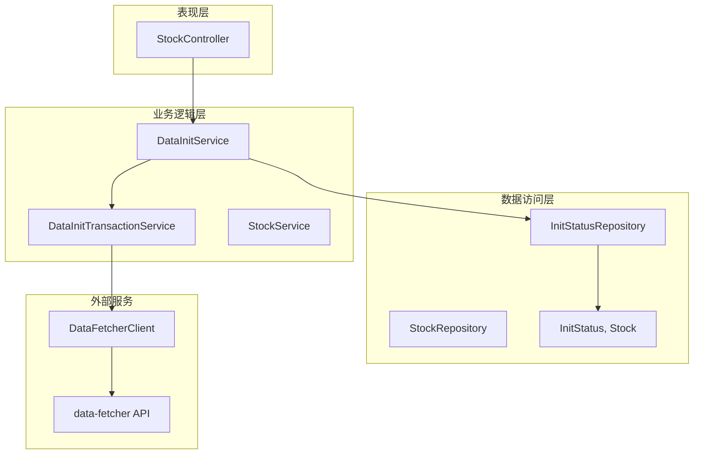
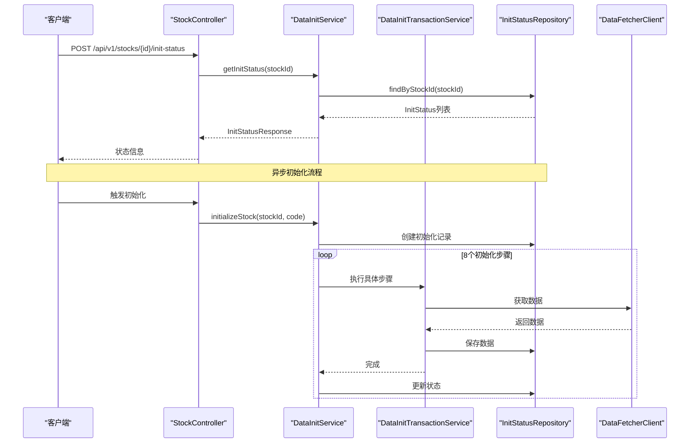
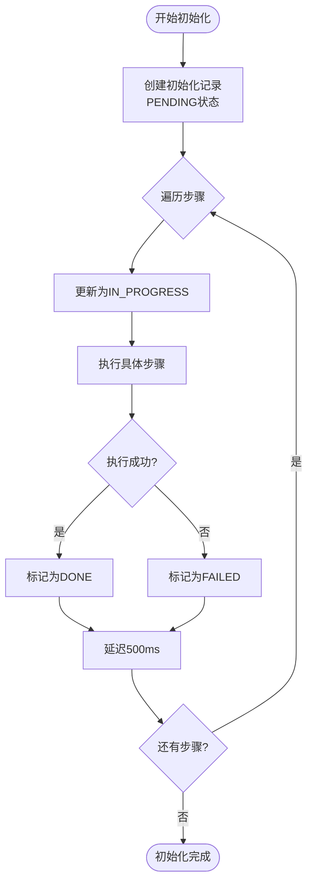
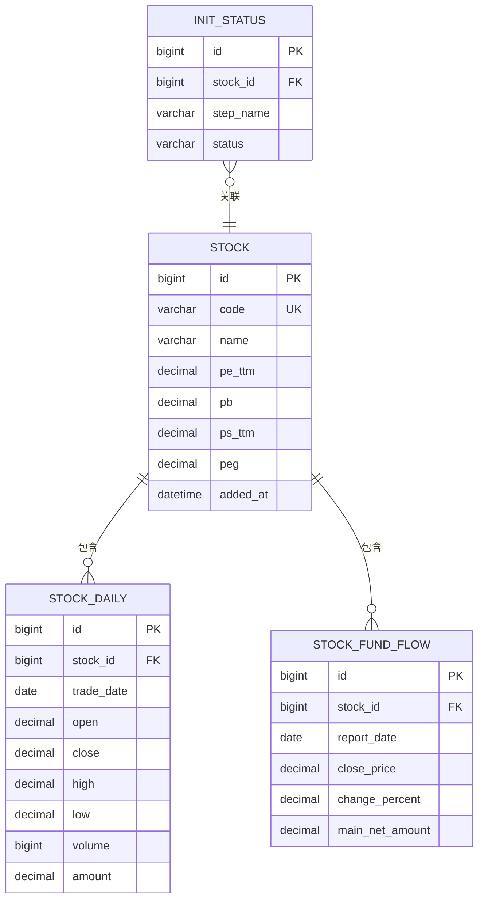
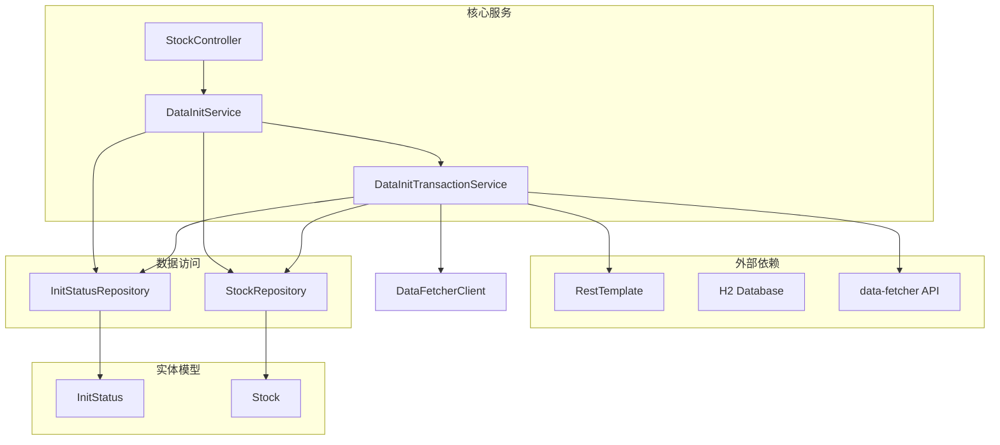

# 数据初始化服务

<cite>
**本文档引用的文件**
- [DataInitService.java](file://backend/src/main/java/com/stock/service/DataInitService.java)
- [DataInitTransactionService.java](file://backend/src/main/java/com/stock/service/DataInitTransactionService.java)
- [InitStatus.java](file://backend/src/main/java/com/stock/entity/InitStatus.java)
- [InitStatusRepository.java](file://backend/src/main/java/com/stock/repository/InitStatusRepository.java)
- [InitStatusResponse.java](file://backend/src/main/java/com/stock/dto/response/InitStatusResponse.java)
- [StepStatus.java](file://backend/src/main/java/com/stock/dto/response/StepStatus.java)
- [DataFetcherClient.java](file://backend/src/main/java/com/stock/client/DataFetcherClient.java)
- [StockController.java](file://backend/src/main/java/com/stock/controller/StockController.java)
- [Stock.java](file://backend/src/main/java/com/stock/entity/Stock.java)
- [StockRepository.java](file://backend/src/main/java/com/stock/repository/StockRepository.java)
- [StockApplication.java](file://backend/src/main/java/com/stock/StockApplication.java)
- [application.yml](file://backend/src/main/resources/application.yml)
- [RestTemplateConfig.java](file://backend/src/main/java/com/stock/config/RestTemplateConfig.java)
</cite>

## 目录
1. [简介](#简介)
2. [项目结构](#项目结构)
3. [核心组件](#核心组件)
4. [架构概览](#架构概览)
5. [详细组件分析](#详细组件分析)
6. [依赖关系分析](#依赖关系分析)
7. [性能考虑](#性能考虑)
8. [故障排除指南](#故障排除指南)
9. [结论](#结论)
10. [附录](#附录)

## 简介
数据初始化服务是股票交易系统中的关键组件，负责为新添加的股票数据进行异步初始化。该服务通过协调多个数据模块的初始化步骤，确保股票数据的完整性和一致性。系统采用分层架构设计，包含数据访问层、业务逻辑层和服务层，实现了高内聚、低耦合的模块化结构。

## 项目结构
系统采用标准的Spring Boot三层架构模式，主要分为以下层次：



**图表来源**
- [StockController.java:17-56](file://backend/src/main/java/com/stock/controller/StockController.java#L17-L56)
- [DataInitService.java:15-101](file://backend/src/main/java/com/stock/service/DataInitService.java#L15-L101)
- [DataInitTransactionService.java:15-152](file://backend/src/main/java/com/stock/service/DataInitTransactionService.java#L15-L152)

**章节来源**
- [StockApplication.java:1-16](file://backend/src/main/java/com/stock/StockApplication.java#L1-L16)
- [application.yml:1-28](file://backend/src/main/resources/application.yml#L1-L28)

## 核心组件
数据初始化服务由三个核心组件构成：主服务(DataInitService)、事务服务(DataInitTransactionService)和状态管理组件。

### 初始化步骤定义
系统定义了8个标准化的数据初始化步骤，每个步骤都有明确的职责和数据源：

| 步骤名称 | 数据类型 | 数据源 | 事务特性 |
|---------|---------|--------|----------|
| VALUATION | 股票估值指标 | 市盈率、市净率等 | ✅ |
| KLINE | 日线行情数据 | OHLCV数据 | ✅ |
| FUND_FLOW | 资金流向数据 | 主力净流入等 | ✅ |
| INCOME | 收入财务数据 | 营业收入等 | ✅ |
| FINANCIAL | 财务指标数据 | EPS、ROE等 | ✅ |
| HOLDER | 股东数据 | 持股数量等 | ✅ |
| RESEARCH | 研究报告数据 | 机构研报等 | ✅ |
| INDICATOR | 技术指标数据 | 计算生成 | ✅ |

**章节来源**
- [DataInitService.java:23-32](file://backend/src/main/java/com/stock/service/DataInitService.java#L23-L32)
- [DataInitService.java:94-99](file://backend/src/main/java/com/stock/service/DataInitService.java#L94-L99)

## 架构概览
数据初始化服务采用异步执行和事务隔离的设计模式，确保数据一致性和系统稳定性。



**图表来源**
- [StockController.java:52-55](file://backend/src/main/java/com/stock/controller/StockController.java#L52-L55)
- [DataInitService.java:42-71](file://backend/src/main/java/com/stock/service/DataInitService.java#L42-L71)
- [DataInitTransactionService.java:35-150](file://backend/src/main/java/com/stock/service/DataInitTransactionService.java#L35-L150)

## 详细组件分析

### DataInitService 分析
DataInitService是初始化流程的协调器，负责管理整个初始化过程的状态和控制流。

#### 核心功能特性
- **异步执行**：使用`@Async`注解实现非阻塞初始化
- **步骤协调**：按固定顺序执行8个初始化步骤
- **状态跟踪**：实时更新每个步骤的执行状态
- **错误处理**：捕获异常并标记失败状态

#### 初始化流程控制


**图表来源**
- [DataInitService.java:42-71](file://backend/src/main/java/com/stock/service/DataInitService.java#L42-L71)

#### 状态管理机制
系统通过数据库表`init_status`跟踪每个步骤的执行状态，支持以下状态转换：
- PENDING → IN_PROGRESS → DONE/FAILED
- 失败状态可作为后续重试的基础

**章节来源**
- [DataInitService.java:15-101](file://backend/src/main/java/com/stock/service/DataInitService.java#L15-L101)
- [InitStatus.java:15-29](file://backend/src/main/java/com/stock/entity/InitStatus.java#L15-L29)

### DataInitTransactionService 分析
DataInitTransactionService专门处理需要事务保证的数据初始化步骤，解决Spring代理自调用问题。

#### 事务边界设计
每个初始化步骤都标注了`@Transactional`注解，确保：
- 单个步骤内的数据操作具有原子性
- 防止部分数据写入导致的数据不一致
- 支持回滚机制处理异常情况

#### 数据初始化步骤详解

##### 估值数据初始化
- **数据源**：实时估值指标
- **字段更新**：PE、PB、PS、PEG比率
- **事务特性**：更新Stock实体属性

##### K线数据初始化
- **时间范围**：最近一年的日线数据
- **数据结构**：开盘价、收盘价、最高价、最低价
- **批量处理**：使用saveAll进行高效存储

##### 财务数据初始化
- **数据类型**：利润表、资产负债表指标
- **计算字段**：EPS、ROE、毛利率等
- **批量操作**：支持多期财务数据

**章节来源**
- [DataInitTransactionService.java:15-152](file://backend/src/main/java/com/stock/service/DataInitTransactionService.java#L15-L152)

### 数据模型设计
系统采用清晰的实体关系设计，支持完整的数据初始化生命周期。



**图表来源**
- [InitStatus.java:15-29](file://backend/src/main/java/com/stock/entity/InitStatus.java#L15-L29)
- [Stock.java:17-85](file://backend/src/main/java/com/stock/entity/Stock.java#L17-L85)

**章节来源**
- [Stock.java:1-86](file://backend/src/main/java/com/stock/entity/Stock.java#L1-L86)
- [InitStatus.java:1-30](file://backend/src/main/java/com/stock/entity/InitStatus.java#L1-L30)

## 依赖关系分析

### 组件依赖图


**图表来源**
- [DataInitService.java:19-40](file://backend/src/main/java/com/stock/service/DataInitService.java#L19-L40)
- [DataInitTransactionService.java:24-33](file://backend/src/main/java/com/stock/service/DataInitTransactionService.java#L24-L33)

### 外部服务集成
系统通过DataFetcherClient与独立的数据获取服务进行通信，支持RESTful API调用和批量数据获取。

**章节来源**
- [DataFetcherClient.java:15-126](file://backend/src/main/java/com/stock/client/DataFetcherClient.java#L15-L126)
- [RestTemplateConfig.java:8-17](file://backend/src/main/java/com/stock/config/RestTemplateConfig.java#L8-L17)

## 性能考虑

### 异步执行策略
系统采用异步初始化避免阻塞主线程，提高用户体验：
- 使用`@Async`注解实现非阻塞执行
- 每个步骤间500ms延迟减少API调用频率
- 支持并发处理多个股票的初始化

### 批量数据处理
为了提高数据导入效率，系统采用批量操作策略：
- 使用`saveAll()`方法进行批量持久化
- 流式处理大量数据避免内存溢出
- 分批处理大型数据集

### 缓存和连接池
- REST客户端配置了合理的超时参数
- 数据库连接池自动管理连接资源
- 内存数据库(H2)适合开发和测试环境

### 并发控制
- 使用Spring异步执行器管理任务队列
- 事务边界确保数据一致性
- 错误恢复机制支持重试策略

## 故障排除指南

### 常见问题诊断
1. **初始化状态异常**
   - 检查`init_status`表中对应记录的状态
   - 验证数据库连接是否正常
   - 查看应用日志中的错误信息

2. **数据获取失败**
   - 确认data-fetcher服务是否运行
   - 检查网络连接和防火墙设置
   - 验证API端点的可用性

3. **事务回滚问题**
   - 检查数据库事务配置
   - 验证实体映射关系
   - 确认外键约束设置

### 错误恢复机制
系统提供了完善的错误处理和恢复策略：
- 失败步骤会标记为FAILED状态
- 支持重新初始化特定步骤
- 提供详细的错误日志信息

**章节来源**
- [DataInitService.java:57-63](file://backend/src/main/java/com/stock/service/DataInitService.java#L57-L63)
- [DataInitTransactionService.java:35-150](file://backend/src/main/java/com/stock/service/DataInitTransactionService.java#L35-L150)

## 结论
数据初始化服务通过精心设计的架构和严格的事务管理，为股票交易系统提供了可靠的数据基础。系统的主要优势包括：

1. **模块化设计**：清晰的职责分离和依赖关系
2. **事务一致性**：每个步骤都在独立的事务边界内执行
3. **异步处理**：非阻塞的初始化流程提升用户体验
4. **状态跟踪**：完整的执行状态监控和报告机制
5. **错误恢复**：健壮的异常处理和重试机制

该服务为后续的数据同步、分析计算和业务功能奠定了坚实的基础。

## 附录

### API使用示例

#### 启动初始化流程
```http
GET /api/v1/stocks/{id}/init-status
```

#### 监控初始化状态
```http
GET /api/v1/stocks/{id}/init-status
```

#### 完成处理
系统自动完成初始化后，可以通过状态查询接口获取最终结果。

### 配置参数说明
- **异步执行器**：默认使用Spring的TaskExecutor
- **数据库连接**：H2内存数据库用于开发环境
- **API超时**：REST客户端配置了合理的超时时间
- **调度配置**：支持定时数据同步任务

### 最佳实践建议
1. **分批处理**：对于大量数据采用分批处理策略
2. **监控告警**：建立初始化状态的监控和告警机制
3. **性能优化**：根据实际需求调整异步执行参数
4. **错误处理**：实现完善的错误日志和重试机制
5. **测试覆盖**：确保初始化流程的单元测试和集成测试