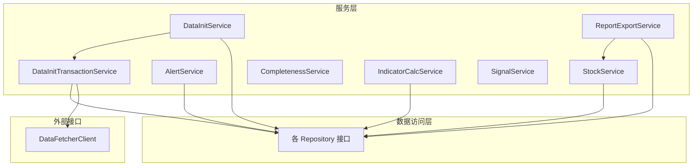
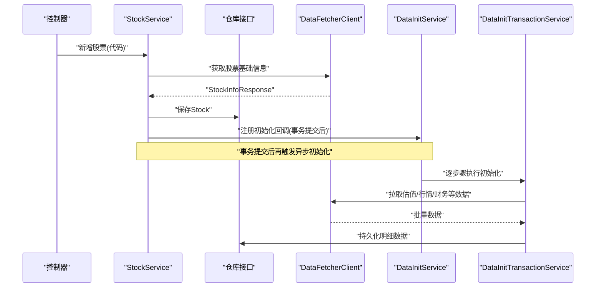
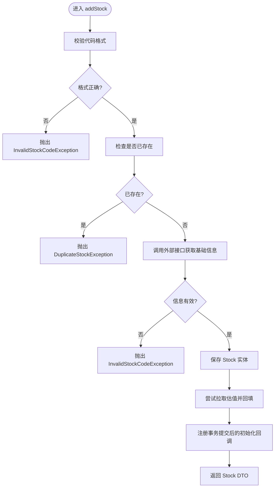
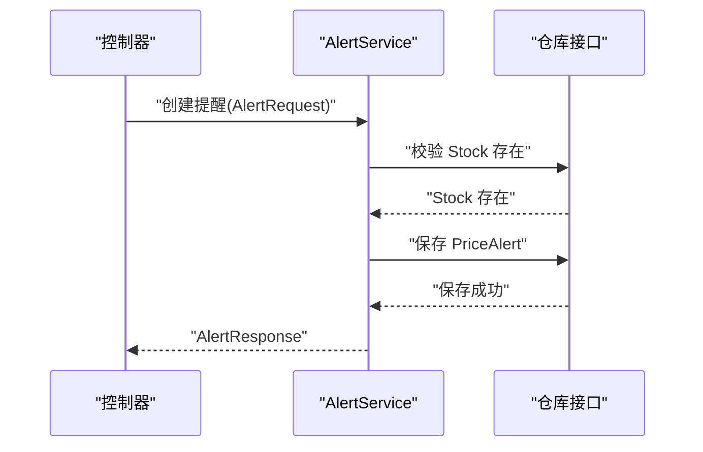
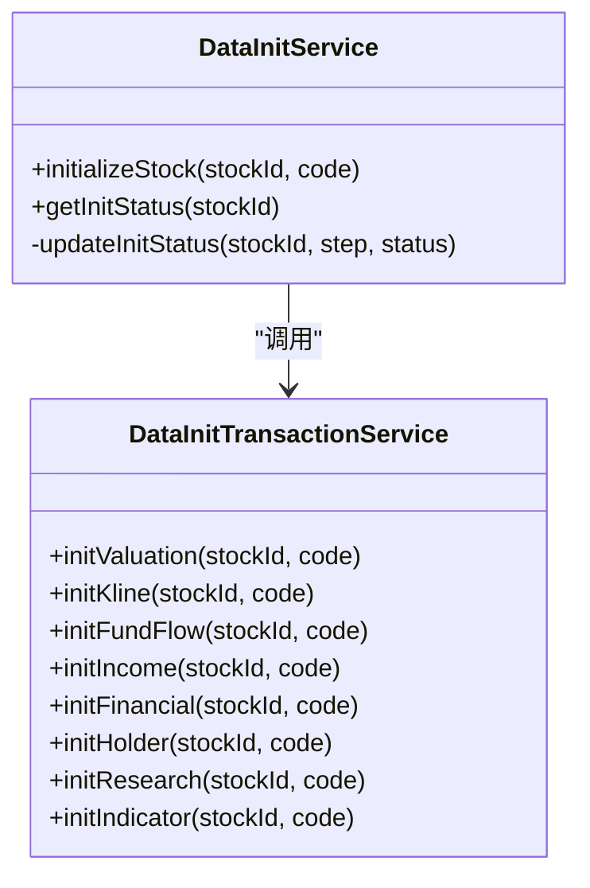
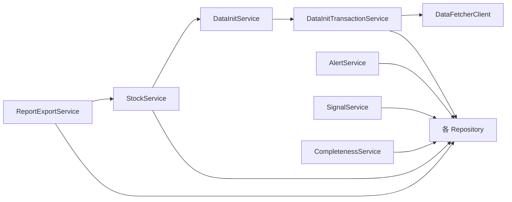

# 服务层业务逻辑

<cite>
**本文引用的文件**
- [StockService.java](file://backend/src/main/java/com/stock/service/StockService.java)
- [AlertService.java](file://backend/src/main/java/com/stock/service/AlertService.java)
- [DataInitService.java](file://backend/src/main/java/com/stock/service/DataInitService.java)
- [DataInitTransactionService.java](file://backend/src/main/java/com/stock/service/DataInitTransactionService.java)
- [CompletenessService.java](file://backend/src/main/java/com/stock/service/CompletenessService.java)
- [IndicatorCalcService.java](file://backend/src/main/java/com/stock/service/IndicatorCalcService.java)
- [SignalService.java](file://backend/src/main/java/com/stock/service/SignalService.java)
- [ReportExportService.java](file://backend/src/main/java/com/stock/service/ReportExportService.java)
- [StockServiceTest.java](file://backend/src/test/java/com/stock/service/StockServiceTest.java)
- [AlertServiceTest.java](file://backend/src/test/java/com/stock/service/AlertServiceTest.java)
- [IndicatorCalcServiceTest.java](file://backend/src/test/java/com/stock/service/IndicatorCalcServiceTest.java)
- [StockResponse.java](file://backend/src/main/java/com/stock/dto/response/StockResponse.java)
- [AlertRequest.java](file://backend/src/main/java/com/stock/dto/request/AlertRequest.java)
- [Stock.java](file://backend/src/main/java/com/stock/entity/Stock.java)
- [GlobalExceptionHandler.java](file://backend/src/main/java/com/stock/exception/GlobalExceptionHandler.java)
- [HtmlSanitizer.java](file://backend/src/main/java/com/stock/util/HtmlSanitizer.java)
</cite>

## 目录
1. [简介](#简介)
2. [项目结构](#项目结构)
3. [核心组件](#核心组件)
4. [架构总览](#架构总览)
5. [详细组件分析](#详细组件分析)
6. [依赖分析](#依赖分析)
7. [性能考虑](#性能考虑)
8. [故障排查指南](#故障排查指南)
9. [结论](#结论)
10. [附录](#附录)

## 简介
本文件面向服务层业务逻辑，系统性阐述服务层在该股票交易系统中的职责边界、设计原则与实现模式。重点覆盖以下主题：
- @Service 注解的使用与职责划分
- 业务逻辑封装原则与事务管理策略
- 异常处理机制与全局异常映射
- 复杂业务流程（如新增股票、异步初始化、指标计算）的实现
- 服务层与数据访问层的交互模式
- 数据传输对象（DTO）的使用规范
- 服务层测试策略与 Mock 测试方法
- 性能优化技巧与并发处理方案

## 项目结构
服务层位于 backend/src/main/java/com/stock/service 下，围绕“股票”这一核心领域，提供从基础信息维护、财务与行情数据接入、到分析与导出等全链路能力。典型模块包括：
- 股票主数据：StockService
- 价格提醒：AlertService
- 初始化与异步数据拉取：DataInitService、DataInitTransactionService
- 完整度统计：CompletenessService
- 技术指标计算：IndicatorCalcService
- 信号管理：SignalService
- 报告导出：ReportExportService

图表来源
- [StockService.java:1-243](file://backend/src/main/java/com/stock/service/StockService.java#L1-L243)
- [AlertService.java:1-63](file://backend/src/main/java/com/stock/service/AlertService.java#L1-L63)
- [DataInitService.java:1-101](file://backend/src/main/java/com/stock/service/DataInitService.java#L1-L101)
- [DataInitTransactionService.java:1-152](file://backend/src/main/java/com/stock/service/DataInitTransactionService.java#L1-L152)
- [CompletenessService.java:1-118](file://backend/src/main/java/com/stock/service/CompletenessService.java#L1-L118)
- [IndicatorCalcService.java:1-210](file://backend/src/main/java/com/stock/service/IndicatorCalcService.java#L1-L210)
- [SignalService.java:1-51](file://backend/src/main/java/com/stock/service/SignalService.java#L1-L51)
- [ReportExportService.java:1-153](file://backend/src/main/java/com/stock/service/ReportExportService.java#L1-L153)

章节来源
- [StockService.java:1-243](file://backend/src/main/java/com/stock/service/StockService.java#L1-L243)
- [DataInitService.java:1-101](file://backend/src/main/java/com/stock/service/DataInitService.java#L1-L101)
- [IndicatorCalcService.java:1-210](file://backend/src/main/java/com/stock/service/IndicatorCalcService.java#L1-L210)

## 核心组件
- StockService：负责股票主数据的新增、删除、查询与列表展示；协调外部数据拉取与异步初始化。
- AlertService：价格提醒的创建、查询与删除，贯穿 Stock 与 PriceAlert 的关联。
- DataInitService：以步骤化方式驱动异步初始化，记录初始化状态。
- DataInitTransactionService：承载每个初始化步骤的事务性操作，避免自调用导致代理失效。
- CompletenessService：基于自动与手动数据维度统计完整性百分比。
- IndicatorCalcService：对日线数据进行多指标计算（MA、MACD、RSI、KDJ、BOLL）。
- SignalService：信号的查询与标记已读。
- ReportExportService：整合多维数据生成深度分析报告。

章节来源
- [StockService.java:26-91](file://backend/src/main/java/com/stock/service/StockService.java#L26-L91)
- [AlertService.java:15-24](file://backend/src/main/java/com/stock/service/AlertService.java#L15-L24)
- [DataInitService.java:15-40](file://backend/src/main/java/com/stock/service/DataInitService.java#L15-L40)
- [DataInitTransactionService.java:20-22](file://backend/src/main/java/com/stock/service/DataInitTransactionService.java#L20-L22)
- [CompletenessService.java:13-59](file://backend/src/main/java/com/stock/service/CompletenessService.java#L13-L59)
- [IndicatorCalcService.java:12-13](file://backend/src/main/java/com/stock/service/IndicatorCalcService.java#L12-L13)
- [SignalService.java:12-19](file://backend/src/main/java/com/stock/service/SignalService.java#L12-L19)
- [ReportExportService.java:11-39](file://backend/src/main/java/com/stock/service/ReportExportService.java#L11-L39)

## 架构总览
服务层采用“单体服务 + 分层清晰”的设计：控制器仅做参数校验与响应组装，业务逻辑集中在服务层；服务层通过仓库接口访问数据库，并通过客户端访问外部数据源；部分耗时任务通过异步执行，保证请求快速返回。

图表来源
- [StockService.java:93-163](file://backend/src/main/java/com/stock/service/StockService.java#L93-L163)
- [DataInitService.java:42-71](file://backend/src/main/java/com/stock/service/DataInitService.java#L42-L71)
- [DataInitTransactionService.java:35-48](file://backend/src/main/java/com/stock/service/DataInitTransactionService.java#L35-L48)

## 详细组件分析

### StockService：股票主数据服务
- 职责边界
  - 新增股票：校验代码格式、去重、拉取基础信息、写入 Stock 并回填估值字段；事务提交后触发异步初始化。
  - 删除股票：级联删除所有相关明细与状态数据。
  - 查询与列表：提供股票详情与列表视图 DTO。
- 设计要点
  - 使用 @Transactional 包裹新增与删除，确保一致性。
  - 通过 TransactionSynchronizationManager 在事务提交后触发异步初始化，避免异步线程读不到刚提交的数据。
  - 返回值统一为 DTO，隐藏实体细节。
- 关键路径
  - 新增：[StockService.addStock:93-163](file://backend/src/main/java/com/stock/service/StockService.java#L93-L163)
  - 删除：[StockService.deleteStock:165-189](file://backend/src/main/java/com/stock/service/StockService.java#L165-L189)
  - 列表：[StockService.listStocks:191-213](file://backend/src/main/java/com/stock/service/StockService.java#L191-L213)
  - 详情：[StockService.getStock:215-236](file://backend/src/main/java/com/stock/service/StockService.java#L215-L236)

图表来源
- [StockService.java:93-163](file://backend/src/main/java/com/stock/service/StockService.java#L93-L163)

章节来源
- [StockService.java:93-163](file://backend/src/main/java/com/stock/service/StockService.java#L93-L163)
- [StockResponse.java:7-24](file://backend/src/main/java/com/stock/dto/response/StockResponse.java#L7-L24)
- [Stock.java:17-85](file://backend/src/main/java/com/stock/entity/Stock.java#L17-L85)

### AlertService：价格提醒服务
- 职责边界
  - 列表查询：支持按股票过滤或全量查询，返回带股票名称与最新价的响应。
  - 创建提醒：校验股票存在性，保存提醒并返回响应。
  - 删除提醒：按 ID 删除。
- 设计要点
  - 使用 @Transactional 保证创建与删除的原子性。
  - DTO 响应中聚合 Stock 字段，减少多次查询。

图表来源
- [AlertService.java:41-56](file://backend/src/main/java/com/stock/service/AlertService.java#L41-L56)
- [AlertRequest.java:6-10](file://backend/src/main/java/com/stock/dto/request/AlertRequest.java#L6-L10)

章节来源
- [AlertService.java:26-61](file://backend/src/main/java/com/stock/service/AlertService.java#L26-L61)
- [AlertRequest.java:6-10](file://backend/src/main/java/com/stock/dto/request/AlertRequest.java#L6-L10)

### DataInitService 与 DataInitTransactionService：异步初始化流水线
- 职责边界
  - DataInitService：定义初始化步骤清单、创建初始化状态记录、顺序执行各步骤、更新状态、异步调度。
  - DataInitTransactionService：每个步骤在独立事务中执行，避免自调用导致事务失效。
- 设计要点
  - 步骤化定义与函数式执行器，便于扩展新步骤。
  - 步骤间延迟（毫秒级），降低外部接口压力。
  - 通过专用事务服务隔离事务上下文。

图表来源
- [DataInitService.java:23-71](file://backend/src/main/java/com/stock/service/DataInitService.java#L23-L71)
- [DataInitTransactionService.java:35-150](file://backend/src/main/java/com/stock/service/DataInitTransactionService.java#L35-L150)

章节来源
- [DataInitService.java:42-84](file://backend/src/main/java/com/stock/service/DataInitService.java#L42-L84)
- [DataInitTransactionService.java:35-150](file://backend/src/main/java/com/stock/service/DataInitTransactionService.java#L35-L150)

### CompletenessService：数据完整性统计
- 职责边界
  - 统计自动数据与手动数据的完成情况，计算整体百分比与缺失项。
- 设计要点
  - 自动数据：基于时间范围与非空判断。
  - 手动数据：基于字段非空判断。
  - 返回标准化的 CompletenessResponse。

章节来源
- [CompletenessService.java:61-112](file://backend/src/main/java/com/stock/service/CompletenessService.java#L61-L112)

### IndicatorCalcService：技术指标计算
- 职责边界
  - 对日线数据计算 MA、MACD、RSI、KDJ、BOLL 等指标序列。
- 设计要点
  - 输入输出均为实体列表，便于与仓库层对接。
  - 使用固定精度与舍入策略，保证数值稳定性。

章节来源
- [IndicatorCalcService.java:15-64](file://backend/src/main/java/com/stock/service/IndicatorCalcService.java#L15-L64)

### SignalService：信号管理
- 职责边界
  - 支持按股票、类型或全量查询信号；标记已读。
- 设计要点
  - 查询条件灵活组合，返回标准化响应。

章节来源
- [SignalService.java:21-43](file://backend/src/main/java/com/stock/service/SignalService.java#L21-L43)

### ReportExportService：报告导出
- 职责边界
  - 聚合股票基础信息、利润表、财务摘要、股东结构、研报、产业分析、竞争力评估等，生成 HTML 报告。
- 设计要点
  - 通过多个服务组合数据，保持单一职责。
  - 使用工具方法进行数值格式化与空值处理。

章节来源
- [ReportExportService.java:41-130](file://backend/src/main/java/com/stock/service/ReportExportService.java#L41-L130)

## 依赖分析
- 组件内聚与耦合
  - StockService 高内聚于股票主数据，依赖多个仓库与外部客户端，同时协调初始化服务。
  - DataInitService 与 DataInitTransactionService 解耦初始化流程与事务控制。
  - ReportExportService 作为门面服务，聚合多维数据，体现“厚服务薄控制器”的设计。
- 外部依赖
  - DataFetcherClient 提供外部数据拉取能力。
  - 全局异常处理器统一映射业务异常为标准响应。

图表来源
- [StockService.java:46-91](file://backend/src/main/java/com/stock/service/StockService.java#L46-L91)
- [DataInitService.java:19-40](file://backend/src/main/java/com/stock/service/DataInitService.java#L19-L40)
- [DataInitTransactionService.java:24-33](file://backend/src/main/java/com/stock/service/DataInitTransactionService.java#L24-L33)
- [ReportExportService.java:14-39](file://backend/src/main/java/com/stock/service/ReportExportService.java#L14-L39)

章节来源
- [StockService.java:46-91](file://backend/src/main/java/com/stock/service/StockService.java#L46-L91)
- [DataInitService.java:19-40](file://backend/src/main/java/com/stock/service/DataInitService.java#L19-L40)
- [ReportExportService.java:14-39](file://backend/src/main/java/com/stock/service/ReportExportService.java#L14-L39)

## 性能考虑
- 异步初始化与步骤延迟
  - 通过 @Async 与步骤间延迟，缓解外部接口限流与数据库写入压力。
- 事务与同步点
  - 使用 TransactionSynchronizationManager.afterCommit 确保异步初始化可见性，避免重复查询或脏读。
- 计算密集型指标
  - 指标计算采用数组批处理与固定精度，减少浮点误差与重复计算。
- 查询优化
  - 列表与分页查询结合仓库接口的排序与限制，避免一次性加载大量数据。
- 缓存建议
  - 对高频查询（如股票列表完整性）可引入缓存层，降低仓库查询次数。

## 故障排查指南
- 常见异常与处理
  - 股票不存在：统一由全局异常处理器映射为 404。
  - 重复股票：409 冲突。
  - 无效代码：400 错误。
  - 数据拉取失败：503 服务不可用。
- 排查步骤
  - 检查 StockService 的输入校验与外部接口调用结果。
  - 查看 DataInitService 的初始化状态记录，定位失败步骤。
  - 核对仓库接口返回数据是否为空或格式异常。
  - 关注事务提交时机与异步初始化的触发点。

章节来源
- [GlobalExceptionHandler.java:7-32](file://backend/src/main/java/com/stock/exception/GlobalExceptionHandler.java#L7-L32)
- [StockService.java:95-105](file://backend/src/main/java/com/stock/service/StockService.java#L95-L105)
- [DataInitService.java:73-84](file://backend/src/main/java/com/stock/service/DataInitService.java#L73-L84)

## 结论
服务层通过清晰的职责划分、严格的事务管理与异步初始化机制，实现了从股票主数据到多维分析的完整业务闭环。配合 DTO 规范与全局异常处理，提升了系统的可维护性与可观测性。建议在高并发场景下进一步引入缓存与限流策略，并持续扩展初始化步骤以覆盖更多数据域。

## 附录

### 服务层方法设计模式
- 工厂/装配模式：构造函数注入多个仓库与外部客户端，集中装配。
- 门面模式：ReportExportService 聚合多服务输出统一报告。
- 策略模式：DataInitService 中以函数式接口定义步骤，便于扩展。

### 事务管理策略
- @Transactional 标注在服务方法上，确保业务原子性。
- 避免自调用导致事务失效，通过专用事务服务执行初始化步骤。
- 使用 afterCommit 回调确保异步任务可见性。

### 异常处理机制
- 局部异常：在服务内部捕获并转换为业务异常。
- 全局异常：通过 @ControllerAdvice 统一映射为标准响应。

### DTO 使用规范
- 请求 DTO：用于入参校验与约束（如 AlertRequest）。
- 响应 DTO：用于对外输出，屏蔽实体细节（如 StockResponse）。
- 实体与 DTO：严格分离，避免跨层泄露。

### 服务层测试策略与 Mock 方法
- 单元测试
  - 使用 Mockito 注入 Mock 仓库与客户端，验证分支逻辑与异常路径。
  - 示例路径：
    - [StockServiceTest.addStock_successfully:86-119](file://backend/src/test/java/com/stock/service/StockServiceTest.java#L86-L119)
    - [AlertServiceTest.create_savesAndReturnsAlert:52-70](file://backend/src/test/java/com/stock/service/AlertServiceTest.java#L52-L70)
    - [IndicatorCalcServiceTest.calculate_withEnoughData_returnsIndicators:47-68](file://backend/src/test/java/com/stock/service/IndicatorCalcServiceTest.java#L47-L68)
- 集成测试
  - 验证服务层与仓库层协作、事务传播与异步初始化流程。
- Mock 测试要点
  - 使用 @Mock 注入依赖，@InjectMocks 构造被测服务。
  - 使用 verify 校验调用行为与参数匹配。
  - 使用 when(...).thenReturn(...) 模拟外部接口与仓库返回。

章节来源
- [StockServiceTest.java:73-177](file://backend/src/test/java/com/stock/service/StockServiceTest.java#L73-L177)
- [AlertServiceTest.java:34-83](file://backend/src/test/java/com/stock/service/AlertServiceTest.java#L34-L83)
- [IndicatorCalcServiceTest.java:41-81](file://backend/src/test/java/com/stock/service/IndicatorCalcServiceTest.java#L41-L81)

### 并发处理方案
- 异步初始化：@Async + 步骤延迟，降低瞬时压力。
- 事务同步：afterCommit 回调，确保异步线程可见性。
- 外部接口限流：在 DataFetcherClient 层增加重试与退避策略（建议在客户端实现中补充）。