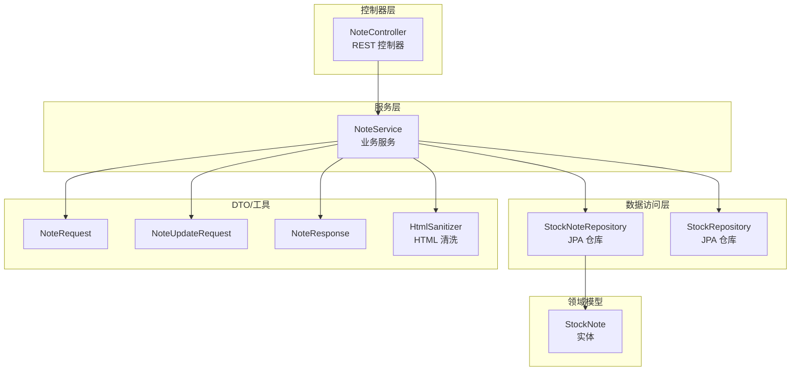
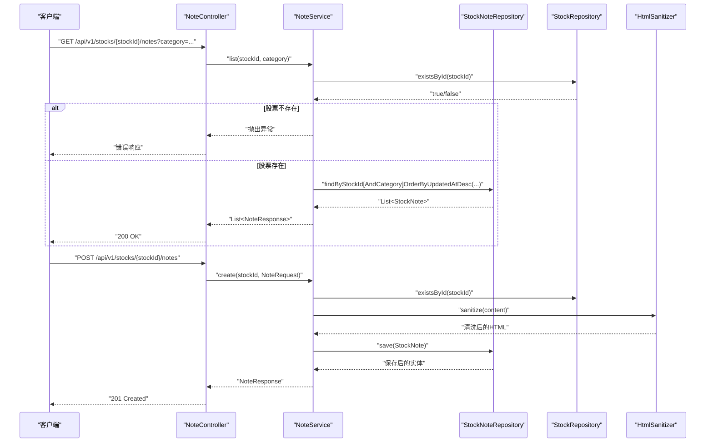
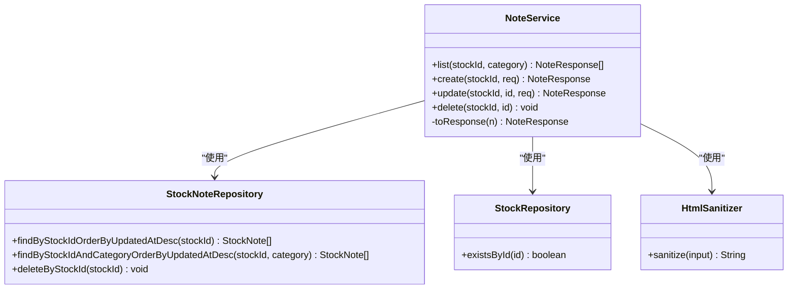
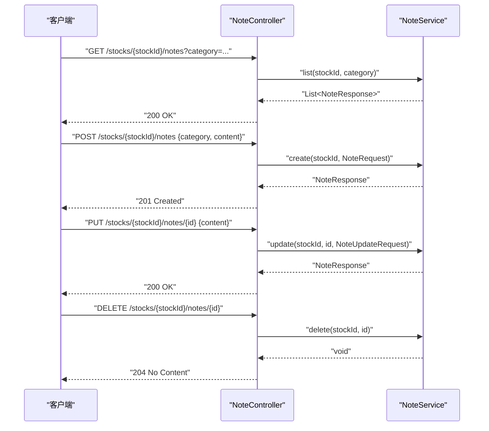
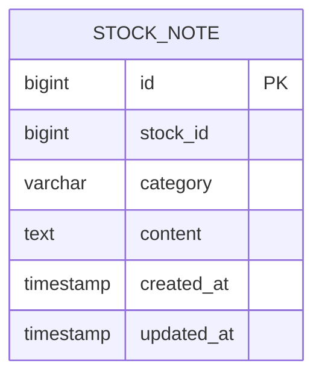
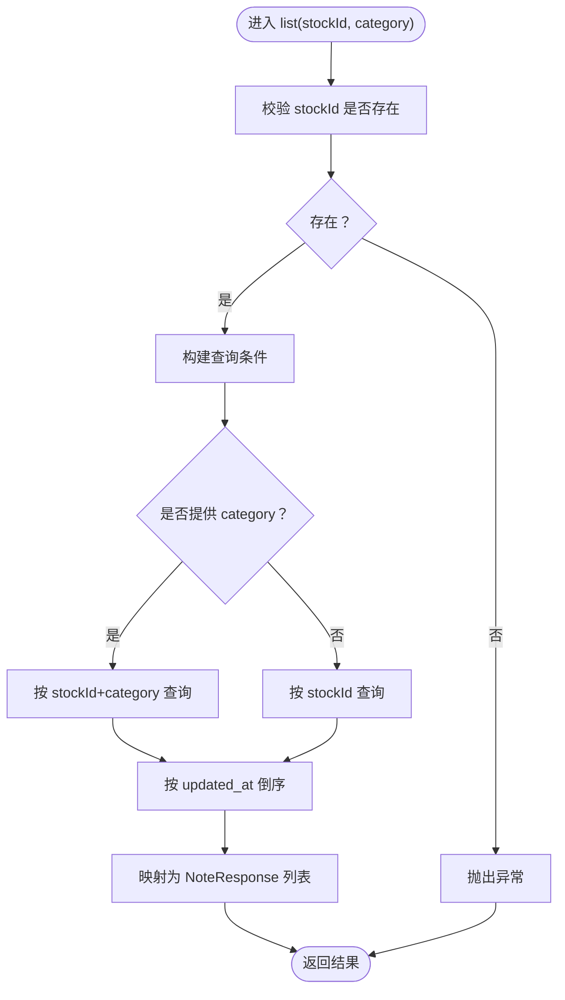
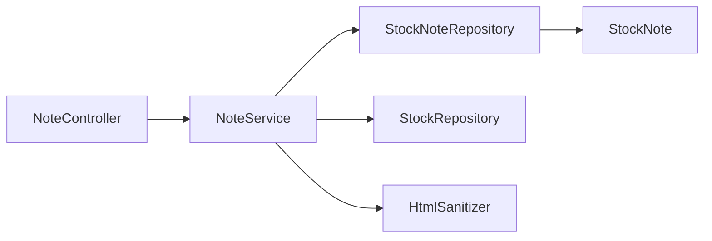

# 笔记服务

<cite>
**本文引用的文件**
- [NoteService.java](file://backend/src/main/java/com/stock/service/NoteService.java)
- [NoteController.java](file://backend/src/main/java/com/stock/controller/NoteController.java)
- [StockNote.java](file://backend/src/main/java/com/stock/entity/StockNote.java)
- [StockNoteRepository.java](file://backend/src/main/java/com/stock/repository/StockNoteRepository.java)
- [StockRepository.java](file://backend/src/main/java/com/stock/repository/StockRepository.java)
- [NoteRequest.java](file://backend/src/main/java/com/stock/dto/request/NoteRequest.java)
- [NoteUpdateRequest.java](file://backend/src/main/java/com/stock/dto/request/NoteUpdateRequest.java)
- [NoteResponse.java](file://backend/src/main/java/com/stock/dto/response/NoteResponse.java)
- [HtmlSanitizer.java](file://backend/src/main/java/com/stock/util/HtmlSanitizer.java)
- [NoteServiceTest.java](file://backend/src/test/java/com/stock/service/NoteServiceTest.java)
- [NoteControllerTest.java](file://backend/src/test/java/com/stock/controller/NoteControllerTest.java)
</cite>

## 目录
1. [简介](#简介)
2. [项目结构](#项目结构)
3. [核心组件](#核心组件)
4. [架构总览](#架构总览)
5. [详细组件分析](#详细组件分析)
6. [依赖分析](#依赖分析)
7. [性能考量](#性能考量)
8. [故障排查指南](#故障排查指南)
9. [结论](#结论)
10. [附录](#附录)

## 简介
本文件为“笔记服务”的技术文档，聚焦于NoteService类的笔记管理能力，涵盖笔记的创建、编辑、删除、查询等CRUD操作；笔记内容的存储与检索机制（含富文本内容与HTML转义策略）；笔记分类与标签组织方式；以及当前实现中的搜索能力现状与扩展建议。同时提供基于仓库现有代码的使用示例路径与安全与权限控制的实践建议。

## 项目结构
笔记服务位于后端模块中，采用分层架构：控制器层负责HTTP接口，服务层封装业务逻辑，数据访问层通过JPA仓库进行持久化，实体模型映射数据库表，工具类提供内容安全处理。

图表来源
- [NoteController.java:14-51](file://backend/src/main/java/com/stock/controller/NoteController.java#L14-L51)
- [NoteService.java:18-79](file://backend/src/main/java/com/stock/service/NoteService.java#L18-L79)
- [StockNoteRepository.java:9-17](file://backend/src/main/java/com/stock/repository/StockNoteRepository.java#L9-L17)
- [StockRepository.java:10-18](file://backend/src/main/java/com/stock/repository/StockRepository.java#L10-L18)
- [StockNote.java:10-37](file://backend/src/main/java/com/stock/entity/StockNote.java#L10-L37)
- [NoteRequest.java:6-9](file://backend/src/main/java/com/stock/dto/request/NoteRequest.java#L6-L9)
- [NoteUpdateRequest.java:6-8](file://backend/src/main/java/com/stock/dto/request/NoteUpdateRequest.java#L6-L8)
- [NoteResponse.java:5-12](file://backend/src/main/java/com/stock/dto/response/NoteResponse.java#L5-L12)
- [HtmlSanitizer.java:5-15](file://backend/src/main/java/com/stock/util/HtmlSanitizer.java#L5-L15)

章节来源
- [NoteController.java:14-51](file://backend/src/main/java/com/stock/controller/NoteController.java#L14-L51)
- [NoteService.java:18-79](file://backend/src/main/java/com/stock/service/NoteService.java#L18-L79)
- [StockNoteRepository.java:9-17](file://backend/src/main/java/com/stock/repository/StockNoteRepository.java#L9-L17)
- [StockRepository.java:10-18](file://backend/src/main/java/com/stock/repository/StockRepository.java#L10-L18)
- [StockNote.java:10-37](file://backend/src/main/java/com/stock/entity/StockNote.java#L10-L37)
- [NoteRequest.java:6-9](file://backend/src/main/java/com/stock/dto/request/NoteRequest.java#L6-L9)
- [NoteUpdateRequest.java:6-8](file://backend/src/main/java/com/stock/dto/request/NoteUpdateRequest.java#L6-L8)
- [NoteResponse.java:5-12](file://backend/src/main/java/com/stock/dto/response/NoteResponse.java#L5-L12)
- [HtmlSanitizer.java:5-15](file://backend/src/main/java/com/stock/util/HtmlSanitizer.java#L5-L15)

## 核心组件
- NoteController：提供REST接口，支持按股票ID列出笔记、创建笔记、更新笔记、删除笔记，并支持按分类过滤。
- NoteService：核心业务逻辑，负责校验股票存在性、调用仓库保存或更新笔记、执行HTML清洗、转换为响应对象。
- StockNoteRepository：JPA仓库，提供按股票ID与分类排序的查询方法，以及按股票ID批量删除等。
- StockRepository：提供股票存在性校验等基础能力。
- 实体StockNote：映射stock_note表，字段包含id、stock_id、category、content、created_at、updated_at。
- DTO：NoteRequest、NoteUpdateRequest、NoteResponse，分别用于创建、更新与响应。
- HtmlSanitizer：基于OWASP HTML Policy对富文本输入进行白名单清洗，仅允许部分安全元素。

章节来源
- [NoteController.java:14-51](file://backend/src/main/java/com/stock/controller/NoteController.java#L14-L51)
- [NoteService.java:18-79](file://backend/src/main/java/com/stock/service/NoteService.java#L18-L79)
- [StockNoteRepository.java:9-17](file://backend/src/main/java/com/stock/repository/StockNoteRepository.java#L9-L17)
- [StockRepository.java:10-18](file://backend/src/main/java/com/stock/repository/StockRepository.java#L10-L18)
- [StockNote.java:10-37](file://backend/src/main/java/com/stock/entity/StockNote.java#L10-L37)
- [NoteRequest.java:6-9](file://backend/src/main/java/com/stock/dto/request/NoteRequest.java#L6-L9)
- [NoteUpdateRequest.java:6-8](file://backend/src/main/java/com/stock/dto/request/NoteUpdateRequest.java#L6-L8)
- [NoteResponse.java:5-12](file://backend/src/main/java/com/stock/dto/response/NoteResponse.java#L5-L12)
- [HtmlSanitizer.java:5-15](file://backend/src/main/java/com/stock/util/HtmlSanitizer.java#L5-L15)

## 架构总览
下图展示了从HTTP请求到数据库持久化的整体流程，以及关键组件之间的交互。

图表来源
- [NoteController.java:24-49](file://backend/src/main/java/com/stock/controller/NoteController.java#L24-L49)
- [NoteService.java:28-55](file://backend/src/main/java/com/stock/service/NoteService.java#L28-L55)
- [StockNoteRepository.java:11-13](file://backend/src/main/java/com/stock/repository/StockNoteRepository.java#L11-L13)
- [StockRepository.java:10-18](file://backend/src/main/java/com/stock/repository/StockRepository.java#L10-L18)
- [HtmlSanitizer.java:10-13](file://backend/src/main/java/com/stock/util/HtmlSanitizer.java#L10-L13)

## 详细组件分析

### NoteService 类
- 角色与职责
  - 提供笔记列表、创建、更新、删除等核心能力。
  - 在创建与更新时对富文本内容进行HTML清洗，确保安全性。
  - 在创建与更新时设置时间戳，保证审计信息完整。
  - 在创建前校验股票是否存在，避免脏数据。
- 关键方法
  - list(stockId, category)：支持按分类过滤，按更新时间倒序返回。
  - create(stockId, NoteRequest)：保存新笔记并返回响应。
  - update(stockId, id, NoteUpdateRequest)：更新指定笔记内容并返回最新响应。
  - delete(stockId, id)：删除指定笔记。
- 数据流与复杂度
  - 查询：O(n) 遍历返回列表，n为匹配笔记数量。
  - 写入：单条记录保存，受数据库索引影响，通常为O(log n)至O(1)范围。
- 错误处理
  - 股票不存在时抛出StockNotFoundException。
  - 更新不存在的笔记会抛出StockNotFoundException。
- 安全性
  - 使用HtmlSanitizer对content进行白名单清洗，限制可接受的HTML标签，降低XSS风险。

图表来源
- [NoteService.java:18-79](file://backend/src/main/java/com/stock/service/NoteService.java#L18-L79)
- [StockNoteRepository.java:9-17](file://backend/src/main/java/com/stock/repository/StockNoteRepository.java#L9-L17)
- [StockRepository.java:10-18](file://backend/src/main/java/com/stock/repository/StockRepository.java#L10-L18)
- [HtmlSanitizer.java:5-15](file://backend/src/main/java/com/stock/util/HtmlSanitizer.java#L5-L15)

章节来源
- [NoteService.java:18-79](file://backend/src/main/java/com/stock/service/NoteService.java#L18-L79)
- [StockNoteRepository.java:9-17](file://backend/src/main/java/com/stock/repository/StockNoteRepository.java#L9-L17)
- [StockRepository.java:10-18](file://backend/src/main/java/com/stock/repository/StockRepository.java#L10-L18)
- [HtmlSanitizer.java:5-15](file://backend/src/main/java/com/stock/util/HtmlSanitizer.java#L5-L15)

### NoteController 类
- 角色与职责
  - 暴露REST接口，绑定路径为/api/v1/stocks/{stockId}/notes。
  - 提供GET（列表）、POST（创建）、PUT（更新）、DELETE（删除）四种操作。
  - 支持通过查询参数category进行分类过滤。
- 参数与响应
  - 创建/更新请求体使用NoteRequest/NoteUpdateRequest进行参数校验。
  - 响应统一为NoteResponse，包含id、stockId、category、content、createdAt、updatedAt。
- 异常处理
  - 由服务层抛出异常，控制器不额外捕获，遵循全局异常处理机制。

图表来源
- [NoteController.java:24-49](file://backend/src/main/java/com/stock/controller/NoteController.java#L24-L49)
- [NoteService.java:28-72](file://backend/src/main/java/com/stock/service/NoteService.java#L28-L72)

章节来源
- [NoteController.java:14-51](file://backend/src/main/java/com/stock/controller/NoteController.java#L14-L51)
- [NoteService.java:28-72](file://backend/src/main/java/com/stock/service/NoteService.java#L28-L72)

### 实体与数据模型
- StockNote
  - 字段：id、stock_id、category、content（TEXT）、created_at、updated_at。
  - 约束：category长度限制为20字符，content为LOB类型，支持大文本。
  - 排序：默认按updated_at倒序，便于展示最新笔记。
- 数据库表映射
  - 表名：stock_note。
  - 主键：自增id。
  - 外键：stock_id关联股票实体（StockRepository提供存在性校验）。

图表来源
- [StockNote.java:14-36](file://backend/src/main/java/com/stock/entity/StockNote.java#L14-L36)

章节来源
- [StockNote.java:10-37](file://backend/src/main/java/com/stock/entity/StockNote.java#L10-L37)

### DTO 与工具类
- NoteRequest
  - 字段：category（非空）、content（非空，长度1-10000）。
- NoteUpdateRequest
  - 字段：content（非空，长度1-10000）。
- NoteResponse
  - 字段：id、stockId、category、content、createdAt、updatedAt。
- HtmlSanitizer
  - 白名单策略：允许p、br、ul、ol、li、b、i、strong、em等元素。
  - 对输入进行清洗，输出安全的HTML字符串。

章节来源
- [NoteRequest.java:6-9](file://backend/src/main/java/com/stock/dto/request/NoteRequest.java#L6-L9)
- [NoteUpdateRequest.java:6-8](file://backend/src/main/java/com/stock/dto/request/NoteUpdateRequest.java#L6-L8)
- [NoteResponse.java:5-12](file://backend/src/main/java/com/stock/dto/response/NoteResponse.java#L5-L12)
- [HtmlSanitizer.java:5-15](file://backend/src/main/java/com/stock/util/HtmlSanitizer.java#L5-L15)

### 查询与过滤流程
- 列表查询
  - 若传入category，则按stockId与category组合查询并按updated_at倒序。
  - 若未传入category，则仅按stockId查询并按updated_at倒序。
- 时间排序
  - 默认按updated_at降序，确保最新笔记优先显示。
- 过滤策略
  - 当前实现支持按category过滤，不支持全文搜索或多维标签过滤。

图表来源
- [NoteService.java:28-38](file://backend/src/main/java/com/stock/service/NoteService.java#L28-L38)
- [StockNoteRepository.java:11-13](file://backend/src/main/java/com/stock/repository/StockNoteRepository.java#L11-L13)

章节来源
- [NoteService.java:28-38](file://backend/src/main/java/com/stock/service/NoteService.java#L28-L38)
- [StockNoteRepository.java:11-13](file://backend/src/main/java/com/stock/repository/StockNoteRepository.java#L11-L13)

### CRUD 使用示例（基于仓库代码）
以下示例展示如何调用笔记服务的CRUD接口与功能，具体实现请参考对应源码路径：

- 创建笔记
  - 请求方法与路径：POST /api/v1/stocks/{stockId}/notes
  - 请求体字段：category、content
  - 示例路径：[NoteController.java:30-35](file://backend/src/main/java/com/stock/controller/NoteController.java#L30-L35)，[NoteService.java:40-55](file://backend/src/main/java/com/stock/service/NoteService.java#L40-L55)，[NoteRequest.java:6-9](file://backend/src/main/java/com/stock/dto/request/NoteRequest.java#L6-L9)
- 更新笔记
  - 请求方法与路径：PUT /api/v1/stocks/{stockId}/notes/{id}
  - 请求体字段：content
  - 示例路径：[NoteController.java:37-42](file://backend/src/main/java/com/stock/controller/NoteController.java#L37-L42)，[NoteService.java:57-67](file://backend/src/main/java/com/stock/service/NoteService.java#L57-L67)，[NoteUpdateRequest.java:6-8](file://backend/src/main/java/com/stock/dto/request/NoteUpdateRequest.java#L6-L8)
- 删除笔记
  - 请求方法与路径：DELETE /api/v1/stocks/{stockId}/notes/{id}
  - 示例路径：[NoteController.java:44-49](file://backend/src/main/java/com/stock/controller/NoteController.java#L44-L49)，[NoteService.java:69-72](file://backend/src/main/java/com/stock/service/NoteService.java#L69-L72)
- 列出笔记（支持分类过滤）
  - 请求方法与路径：GET /api/v1/stocks/{stockId}/notes?category=...
  - 示例路径：[NoteController.java:24-28](file://backend/src/main/java/com/stock/controller/NoteController.java#L24-L28)，[NoteService.java:28-38](file://backend/src/main/java/com/stock/service/NoteService.java#L28-L38)

章节来源
- [NoteController.java:24-49](file://backend/src/main/java/com/stock/controller/NoteController.java#L24-L49)
- [NoteService.java:28-72](file://backend/src/main/java/com/stock/service/NoteService.java#L28-L72)
- [NoteRequest.java:6-9](file://backend/src/main/java/com/stock/dto/request/NoteRequest.java#L6-L9)
- [NoteUpdateRequest.java:6-8](file://backend/src/main/java/com/stock/dto/request/NoteUpdateRequest.java#L6-L8)

### 搜索功能现状与扩展建议
- 现状
  - 当前实现支持按stockId与category过滤，按updated_at倒序返回。
  - 不支持全文搜索（content字段未建立全文索引），也不支持多维标签过滤。
- 扩展建议
  - 全文搜索：在StockNoteRepository中添加基于content的模糊查询方法；或引入Elasticsearch/数据库全文索引（如MySQL FULLTEXT）。
  - 条件过滤：增加按创建时间、标题（若新增title字段）、标签（若扩展标签表）等过滤条件。
  - 性能优化：为stock_id、category、updated_at建立复合索引；对高频查询加缓存（如Redis）。

章节来源
- [StockNoteRepository.java:11-13](file://backend/src/main/java/com/stock/repository/StockNoteRepository.java#L11-L13)
- [StockNote.java:21-35](file://backend/src/main/java/com/stock/entity/StockNote.java#L21-L35)

### 安全性与权限控制
- 内容安全
  - 已在NoteService中对content进行HTML清洗，仅保留白名单元素，降低XSS风险。
  - 建议：对content长度进行更严格的限制与日志审计；对敏感字段（如stock_id）进行二次校验。
- 访问控制
  - 仓库中未发现显式的鉴权与授权逻辑（如Spring Security注解）。建议在控制器或服务层增加基于用户上下文的权限校验，例如：
    - 用户只能访问其拥有权限的股票笔记；
    - 管理员可对所有笔记进行管理；
    - 结合JWT或会话进行身份认证与角色判断。
- 输入校验
  - DTO已对category与content进行非空与长度约束，建议在控制器层开启@Valid并结合全局异常处理统一返回错误信息。

章节来源
- [NoteService.java:49](file://backend/src/main/java/com/stock/service/NoteService.java#L49)
- [HtmlSanitizer.java:10-13](file://backend/src/main/java/com/stock/util/HtmlSanitizer.java#L10-L13)
- [NoteRequest.java:6-9](file://backend/src/main/java/com/stock/dto/request/NoteRequest.java#L6-L9)
- [NoteUpdateRequest.java:6-8](file://backend/src/main/java/com/stock/dto/request/NoteUpdateRequest.java#L6-L8)

## 依赖分析
- 组件耦合
  - NoteController依赖NoteService；NoteService依赖StockNoteRepository、StockRepository与HtmlSanitizer。
  - StockNoteRepository继承JPA接口，提供基于方法名的查询声明。
- 外部依赖
  - OWASP Java HTML Sanitizer用于内容清洗。
  - Spring Data JPA用于数据持久化与查询。
- 循环依赖
  - 未发现循环依赖迹象，层次清晰。

图表来源
- [NoteController.java:18-22](file://backend/src/main/java/com/stock/controller/NoteController.java#L18-L22)
- [NoteService.java:20-26](file://backend/src/main/java/com/stock/service/NoteService.java#L20-L26)
- [StockNoteRepository.java:9-17](file://backend/src/main/java/com/stock/repository/StockNoteRepository.java#L9-L17)
- [StockRepository.java:10-18](file://backend/src/main/java/com/stock/repository/StockRepository.java#L10-L18)
- [StockNote.java:14-36](file://backend/src/main/java/com/stock/entity/StockNote.java#L14-L36)

章节来源
- [NoteController.java:18-22](file://backend/src/main/java/com/stock/controller/NoteController.java#L18-L22)
- [NoteService.java:20-26](file://backend/src/main/java/com/stock/service/NoteService.java#L20-L26)
- [StockNoteRepository.java:9-17](file://backend/src/main/java/com/stock/repository/StockNoteRepository.java#L9-L17)
- [StockRepository.java:10-18](file://backend/src/main/java/com/stock/repository/StockRepository.java#L10-L18)
- [StockNote.java:14-36](file://backend/src/main/java/com/stock/entity/StockNote.java#L14-L36)

## 性能考量
- 查询性能
  - 当前查询基于stockId与可选category，建议为stock_id与category建立索引以提升过滤效率。
  - updated_at用于排序，建议在该列建立索引以减少排序成本。
- 写入性能
  - 单条笔记写入受数据库事务与索引影响，建议批量写入场景使用JDBC模板或原生SQL优化。
- 缓存策略
  - 对热点股票的笔记列表可引入Redis缓存，设置合理TTL与失效策略。
- 内容大小
  - content为TEXT类型，建议对超长内容进行拆分或压缩存储，避免单条记录过大影响IO。

## 故障排查指南
- 常见问题
  - 股票不存在：创建笔记时报错，检查stockId是否正确或股票是否已初始化。
  - 笔记不存在：更新或删除时报错，确认笔记id是否正确。
  - HTML内容异常：若出现渲染问题，检查HtmlSanitizer白名单策略是否覆盖所需标签。
- 单元测试参考
  - 列表按分类过滤、列表无分类返回全部、创建成功与失败、删除操作验证等用例可作为行为参考。
- 测试文件路径
  - [NoteServiceTest.java:32-81](file://backend/src/test/java/com/stock/service/NoteServiceTest.java#L32-L81)
  - [NoteControllerTest.java:40-59](file://backend/src/test/java/com/stock/controller/NoteControllerTest.java#L40-L59)

章节来源
- [NoteServiceTest.java:32-81](file://backend/src/test/java/com/stock/service/NoteServiceTest.java#L32-L81)
- [NoteControllerTest.java:40-59](file://backend/src/test/java/com/stock/controller/NoteControllerTest.java#L40-L59)

## 结论
笔记服务当前实现了围绕StockNote实体的完整CRUD能力，具备基本的分类过滤与HTML内容清洗，满足日常笔记管理需求。为进一步增强可用性与安全性，建议引入全文搜索、多维标签过滤、完善的鉴权与权限控制、以及针对查询与写入的索引与缓存优化。

## 附录
- 快速参考
  - 列表：GET /api/v1/stocks/{stockId}/notes?category=...
  - 创建：POST /api/v1/stocks/{stockId}/notes {category, content}
  - 更新：PUT /api/v1/stocks/{stockId}/notes/{id} {content}
  - 删除：DELETE /api/v1/stocks/{stockId}/notes/{id}