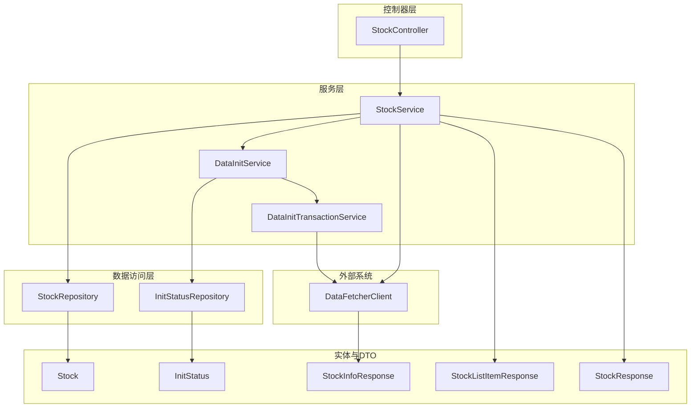
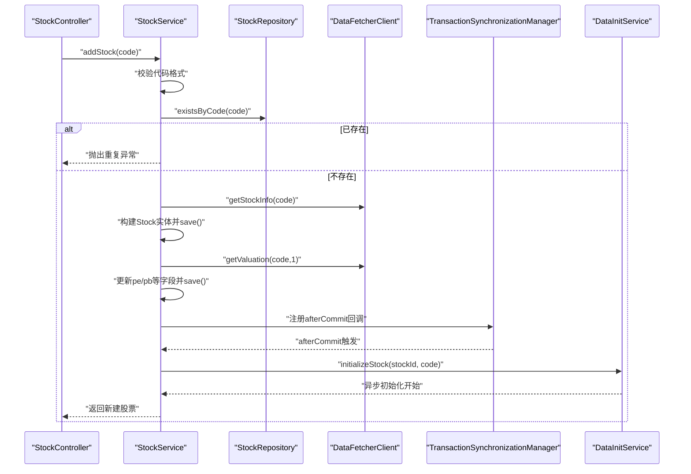
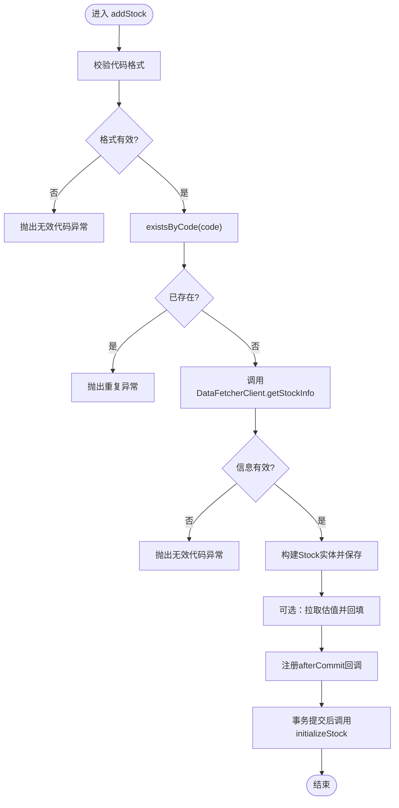
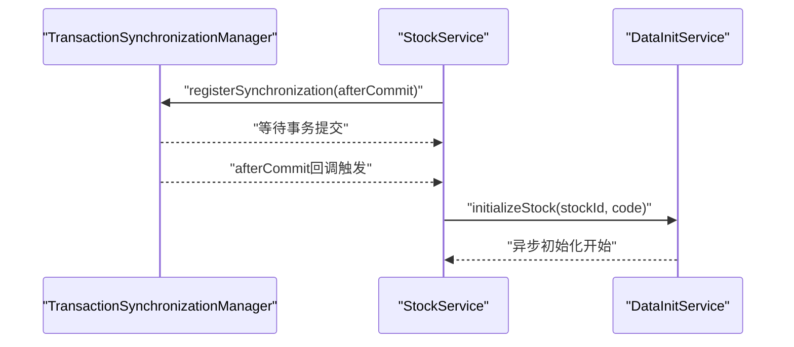
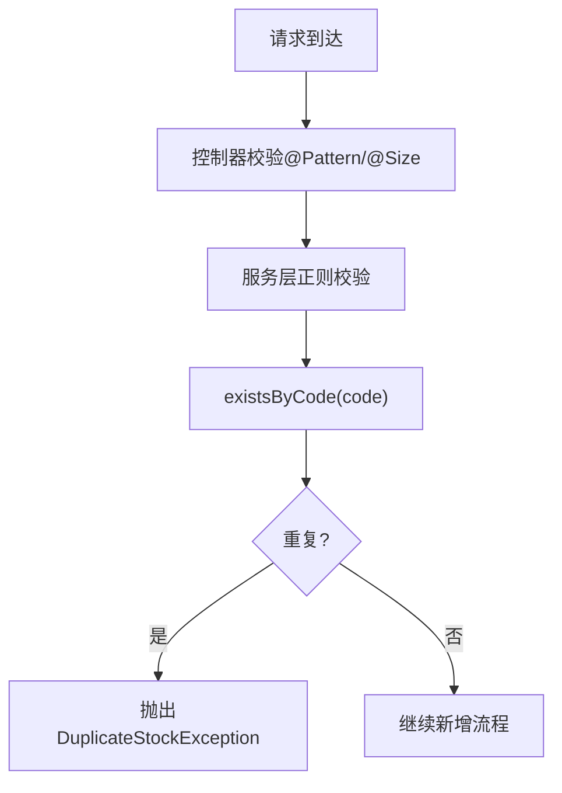
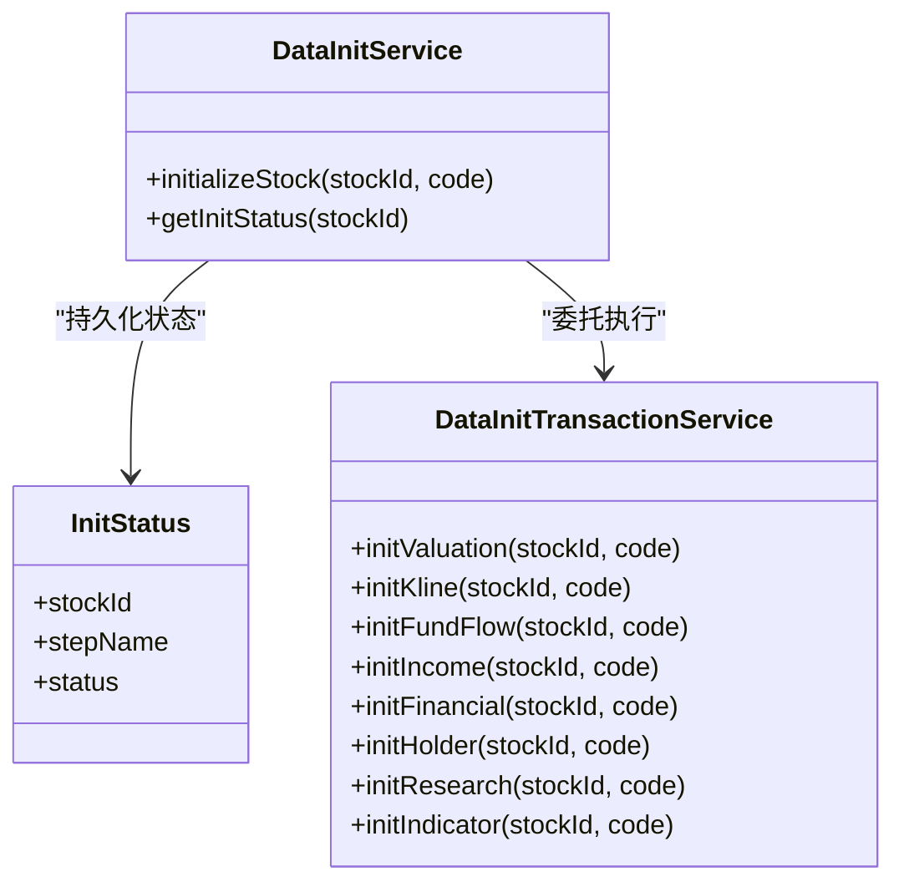
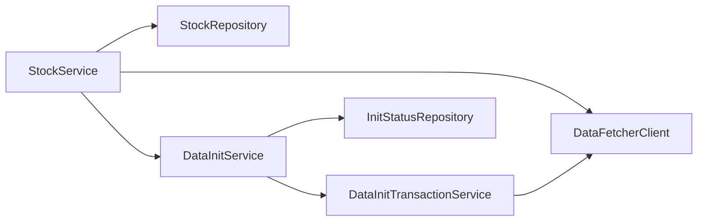

# 股票服务

<cite>
**本文引用的文件**
- [StockService.java](file://backend/src/main/java/com/stock/service/StockService.java)
- [Stock.java](file://backend/src/main/java/com/stock/entity/Stock.java)
- [StockRepository.java](file://backend/src/main/java/com/stock/repository/StockRepository.java)
- [StockController.java](file://backend/src/main/java/com/stock/controller/StockController.java)
- [AddStockRequest.java](file://backend/src/main/java/com/stock/dto/request/AddStockRequest.java)
- [StockInfoResponse.java](file://backend/src/main/java/com/stock/dto/fetcher/StockInfoResponse.java)
- [DataFetcherClient.java](file://backend/src/main/java/com/stock/client/DataFetcherClient.java)
- [DataInitService.java](file://backend/src/main/java/com/stock/service/DataInitService.java)
- [DataInitTransactionService.java](file://backend/src/main/java/com/stock/service/DataInitTransactionService.java)
- [InitStatus.java](file://backend/src/main/java/com/stock/entity/InitStatus.java)
- [StockResponse.java](file://backend/src/main/java/com/stock/dto/response/StockResponse.java)
- [StockListItemResponse.java](file://backend/src/main/java/com/stock/dto/response/StockListItemResponse.java)
- [DuplicateStockException.java](file://backend/src/main/java/com/stock/exception/DuplicateStockException.java)
- [InvalidStockCodeException.java](file://backend/src/main/java/com/stock/exception/InvalidStockCodeException.java)
- [GlobalExceptionHandler.java](file://backend/src/main/java/com/stock/exception/GlobalExceptionHandler.java)
- [StockServiceTest.java](file://backend/src/test/java/com/stock/service/StockServiceTest.java)
- [StockControllerTest.java](file://backend/src/test/java/com/stock/controller/StockControllerTest.java)
</cite>

## 目录
1. [简介](#简介)
2. [项目结构](#项目结构)
3. [核心组件](#核心组件)
4. [架构总览](#架构总览)
5. [详细组件分析](#详细组件分析)
6. [依赖关系分析](#依赖关系分析)
7. [性能考量](#性能考量)
8. [故障排查指南](#故障排查指南)
9. [结论](#结论)
10. [附录](#附录)

## 简介
本文件面向“股票服务”的技术文档，聚焦于StockService类的CRUD能力与事务管理策略，涵盖以下主题：
- 股票新增、删除、查询等CRUD操作的实现细节
- @Transactional注解的使用场景与事务管理策略
- 股票代码验证逻辑与重复股票检测机制
- 异步初始化流程中TransactionSynchronization的使用，确保数据库事务提交后正确触发
- 股票信息获取、数据映射、异常处理的最佳实践
- 性能优化建议与并发安全考虑

## 项目结构
后端采用分层架构：控制器层（Controller）、服务层（Service）、数据访问层（Repository）与实体模型（Entity），并配合客户端封装数据抓取接口。

图表来源
- [StockController.java:1-57](file://backend/src/main/java/com/stock/controller/StockController.java#L1-L57)
- [StockService.java:1-243](file://backend/src/main/java/com/stock/service/StockService.java#L1-L243)
- [DataInitService.java:1-101](file://backend/src/main/java/com/stock/service/DataInitService.java#L1-L101)
- [DataInitTransactionService.java:1-152](file://backend/src/main/java/com/stock/service/DataInitTransactionService.java#L1-L152)
- [StockRepository.java:1-18](file://backend/src/main/java/com/stock/repository/StockRepository.java#L1-L18)
- [InitStatus.java:1-30](file://backend/src/main/java/com/stock/entity/InitStatus.java#L1-L30)
- [StockInfoResponse.java:1-27](file://backend/src/main/java/com/stock/dto/fetcher/StockInfoResponse.java#L1-L27)
- [StockResponse.java:1-25](file://backend/src/main/java/com/stock/dto/response/StockResponse.java#L1-L25)
- [StockListItemResponse.java:1-23](file://backend/src/main/java/com/stock/dto/response/StockListItemResponse.java#L1-L23)

章节来源
- [StockController.java:1-57](file://backend/src/main/java/com/stock/controller/StockController.java#L1-L57)
- [StockService.java:1-243](file://backend/src/main/java/com/stock/service/StockService.java#L1-L243)

## 核心组件
- StockService：提供股票新增、删除、列表与详情查询；负责在事务内完成持久化与校验，并通过TransactionSynchronization在事务提交后触发异步初始化。
- DataInitService：定义初始化步骤清单，异步执行各模块数据抓取与入库，维护初始化状态。
- DataInitTransactionService：为每个初始化步骤提供独立的事务上下文，避免自调用导致代理失效问题。
- DataFetcherClient：封装对数据抓取服务的REST调用，统一异常转换。
- StockRepository：JPA仓储，提供按代码存在性检查、活跃股票查询等基础能力。
- 实体与DTO：Stock、InitStatus、StockInfoResponse、StockResponse、StockListItemResponse等。

章节来源
- [StockService.java:28-91](file://backend/src/main/java/com/stock/service/StockService.java#L28-L91)
- [DataInitService.java:17-40](file://backend/src/main/java/com/stock/service/DataInitService.java#L17-L40)
- [DataInitTransactionService.java:20-22](file://backend/src/main/java/com/stock/service/DataInitTransactionService.java#L20-L22)
- [DataFetcherClient.java:14-24](file://backend/src/main/java/com/stock/client/DataFetcherClient.java#L14-L24)
- [StockRepository.java:10-17](file://backend/src/main/java/com/stock/repository/StockRepository.java#L10-L17)

## 架构总览
StockService作为核心协调者，负责：
- 在事务内进行输入校验、重复检测与持久化
- 同步拉取估值数据并回写到Stock
- 注册TransactionSynchronization.afterCommit回调，在事务提交后调用DataInitService.initializeStock进行异步初始化

图表来源
- [StockController.java:29-34](file://backend/src/main/java/com/stock/controller/StockController.java#L29-L34)
- [StockService.java:93-163](file://backend/src/main/java/com/stock/service/StockService.java#L93-L163)
- [DataInitService.java:42-71](file://backend/src/main/java/com/stock/service/DataInitService.java#L42-L71)

## 详细组件分析

### StockService 类分析
- 新增股票（addStock）
  - 输入校验：代码必须为6位纯数字
  - 重复检测：基于StockRepository.existsByCode
  - 拉取股票基础信息：DataFetcherClient.getStockInfo
  - 数据映射：将StockInfoResponse映射到Stock实体字段
  - 估值同步：可选地拉取估值数据并回填pe/pb等字段
  - 事务提交后异步初始化：通过TransactionSynchronizationManager注册afterCommit回调，确保异步线程可见新插入的记录
- 删除股票（deleteStock）
  - 严格存在性检查后，按顺序删除多表关联数据，最后删除Stock主记录
- 查询列表与详情（listStocks/getStock）
  - 列表：筛选活跃股票，计算并返回完整性指标
  - 详情：返回Stock实体的完整字段集

图表来源
- [StockService.java:93-163](file://backend/src/main/java/com/stock/service/StockService.java#L93-L163)
- [StockRepository.java:12-14](file://backend/src/main/java/com/stock/repository/StockRepository.java#L12-L14)
- [StockInfoResponse.java:8-26](file://backend/src/main/java/com/stock/dto/fetcher/StockInfoResponse.java#L8-L26)

章节来源
- [StockService.java:93-163](file://backend/src/main/java/com/stock/service/StockService.java#L93-L163)
- [StockService.java:165-189](file://backend/src/main/java/com/stock/service/StockService.java#L165-L189)
- [StockService.java:191-241](file://backend/src/main/java/com/stock/service/StockService.java#L191-L241)

### 事务管理与TransactionSynchronization 使用
- @Transactional注解用于：
  - addStock：保证新增、估值回填与后续异步初始化的原子性
  - deleteStock：保证级联删除的一致性
  - DataInitTransactionService中的各个初始化步骤：确保每一步在独立事务中执行，避免跨步骤污染
- TransactionSynchronizationManager：
  - 在事务提交后触发回调，确保异步初始化读取到最新数据库状态
  - 若无活动同步器，则直接调用initializeStock，保证兼容性

图表来源
- [StockService.java:145-160](file://backend/src/main/java/com/stock/service/StockService.java#L145-L160)
- [DataInitService.java:42-71](file://backend/src/main/java/com/stock/service/DataInitService.java#L42-L71)

章节来源
- [StockService.java:93-93](file://backend/src/main/java/com/stock/service/StockService.java#L93-L93)
- [StockService.java:165-165](file://backend/src/main/java/com/stock/service/StockService.java#L165-L165)
- [DataInitTransactionService.java:35-150](file://backend/src/main/java/com/stock/service/DataInitTransactionService.java#L35-L150)

### 股票代码验证与重复检测
- 控制器层：AddStockRequest对code进行@Pattern与长度约束
- 服务层：StockService再次校验格式与重复
- 仓储层：StockRepository.existsByCode提供数据库级重复检测

图表来源
- [AddStockRequest.java:7-9](file://backend/src/main/java/com/stock/dto/request/AddStockRequest.java#L7-L9)
- [StockService.java:95-100](file://backend/src/main/java/com/stock/service/StockService.java#L95-L100)
- [StockRepository.java:14](file://backend/src/main/java/com/stock/repository/StockRepository.java#L14)

章节来源
- [AddStockRequest.java:7-9](file://backend/src/main/java/com/stock/dto/request/AddStockRequest.java#L7-L9)
- [StockService.java:95-100](file://backend/src/main/java/com/stock/service/StockService.java#L95-L100)
- [StockRepository.java:14](file://backend/src/main/java/com/stock/repository/StockRepository.java#L14)

### 异步初始化流程与并发安全
- 初始化步骤清单：估值、日线、资金流、利润表、财务报表、股东、研报、指标
- 并发与隔离：
  - 每个初始化步骤在独立事务中执行，避免相互影响
  - 初始化状态表InitStatus记录各步骤状态，支持重试与监控
- 延迟与限流：
  - 步骤间500ms延迟，降低外部数据源压力
- 自身调用与代理：
  - 将事务方法置于独立的DataInitTransactionService，避免同类内部调用导致代理失效

图表来源
- [DataInitService.java:17-101](file://backend/src/main/java/com/stock/service/DataInitService.java#L17-L101)
- [DataInitTransactionService.java:20-152](file://backend/src/main/java/com/stock/service/DataInitTransactionService.java#L20-L152)
- [InitStatus.java:15-29](file://backend/src/main/java/com/stock/entity/InitStatus.java#L15-L29)

章节来源
- [DataInitService.java:23-71](file://backend/src/main/java/com/stock/service/DataInitService.java#L23-L71)
- [DataInitTransactionService.java:35-150](file://backend/src/main/java/com/stock/service/DataInitTransactionService.java#L35-L150)
- [InitStatus.java:12-29](file://backend/src/main/java/com/stock/entity/InitStatus.java#L12-L29)

### 股票信息获取与数据映射最佳实践
- 信息获取：通过DataFetcherClient统一调用，集中异常转换
- 数据映射：从StockInfoResponse映射到Stock实体字段，保持字段一致性
- 估值回填：优先使用外部数据，若为空则保留已有值，避免覆盖

章节来源
- [DataFetcherClient.java:26-93](file://backend/src/main/java/com/stock/client/DataFetcherClient.java#L26-L93)
- [StockInfoResponse.java:8-26](file://backend/src/main/java/com/stock/dto/fetcher/StockInfoResponse.java#L8-L26)
- [StockService.java:107-143](file://backend/src/main/java/com/stock/service/StockService.java#L107-L143)

### 异常处理最佳实践
- 全局异常处理器将业务异常映射为标准HTTP状态码与错误响应
- 服务层抛出明确异常类型：InvalidStockCodeException、DuplicateStockException、StockNotFoundException
- 客户端请求参数校验由控制器层AddStockRequest完成

章节来源
- [GlobalExceptionHandler.java:7-32](file://backend/src/main/java/com/stock/exception/GlobalExceptionHandler.java#L7-L32)
- [InvalidStockCodeException.java:1-5](file://backend/src/main/java/com/stock/exception/InvalidStockCodeException.java#L1-L5)
- [DuplicateStockException.java:1-5](file://backend/src/main/java/com/stock/exception/DuplicateStockException.java#L1-L5)
- [AddStockRequest.java:7-9](file://backend/src/main/java/com/stock/dto/request/AddStockRequest.java#L7-L9)

## 依赖关系分析
- StockService依赖多个仓储与DataFetcherClient，负责协调新增、删除、查询与异步初始化
- DataInitService依赖InitStatusRepository与DataInitTransactionService，负责初始化流程编排
- DataInitTransactionService依赖DataFetcherClient与各业务仓储，负责具体初始化步骤

图表来源
- [StockService.java:30-91](file://backend/src/main/java/com/stock/service/StockService.java#L30-L91)
- [DataInitService.java:19-40](file://backend/src/main/java/com/stock/service/DataInitService.java#L19-L40)
- [DataInitTransactionService.java:24-33](file://backend/src/main/java/com/stock/service/DataInitTransactionService.java#L24-L33)

章节来源
- [StockService.java:30-91](file://backend/src/main/java/com/stock/service/StockService.java#L30-L91)
- [DataInitService.java:19-40](file://backend/src/main/java/com/stock/service/DataInitService.java#L19-L40)
- [DataInitTransactionService.java:24-33](file://backend/src/main/java/com/stock/service/DataInitTransactionService.java#L24-L33)

## 性能考量
- 事务粒度控制：将新增与初始化拆分为同步事务与异步任务，减少长事务占用
- 外部调用节流：初始化步骤间500ms延迟，避免对外部数据源造成过大压力
- 批量写入：初始化步骤中使用批量保存（如saveAll），减少数据库往返
- 缓存与索引：建议对Stock.code建立唯一索引（已具备），并根据查询热点建立合适索引
- 并发初始化：异步初始化支持多股票并行，但需注意外部数据源速率限制与后端资源

## 故障排查指南
- 新增失败（400/409/404）：
  - 400：无效股票代码或参数校验失败
  - 409：股票代码重复
  - 404：查询不存在的股票
- 初始化异常：
  - 检查InitStatus表中对应步骤的状态是否为FAILED
  - 查看DataInitService日志，定位具体步骤与异常原因
- 事务未生效：
  - 确认方法被Spring代理调用（避免同类自调用）
  - 确认TransactionSynchronization回调是否注册成功

章节来源
- [GlobalExceptionHandler.java:9-31](file://backend/src/main/java/com/stock/exception/GlobalExceptionHandler.java#L9-L31)
- [DataInitService.java:60-63](file://backend/src/main/java/com/stock/service/DataInitService.java#L60-L63)
- [StockService.java:148-160](file://backend/src/main/java/com/stock/service/StockService.java#L148-L160)

## 结论
StockService通过严格的输入校验、重复检测与事务管理，确保新增流程的正确性；借助TransactionSynchronization在事务提交后触发异步初始化，兼顾了性能与一致性。结合DataInitService与DataInitTransactionService的分层设计，系统实现了可扩展、可观测的数据初始化能力。

## 附录
- 测试参考：
  - StockServiceTest：覆盖新增、删除、查询与列表等关键路径
  - StockControllerTest：验证控制器端点行为与响应结构

章节来源
- [StockServiceTest.java:73-178](file://backend/src/test/java/com/stock/service/StockServiceTest.java#L73-L178)
- [StockControllerTest.java:51-115](file://backend/src/test/java/com/stock/controller/StockControllerTest.java#L51-L115)