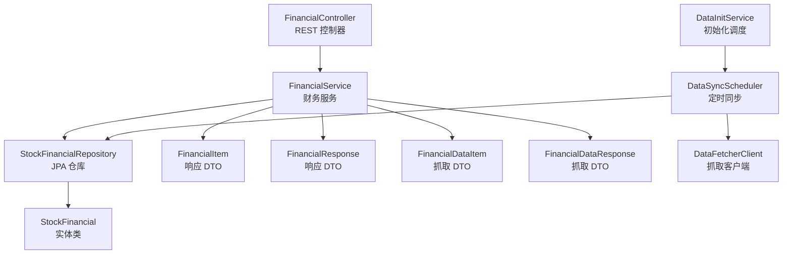
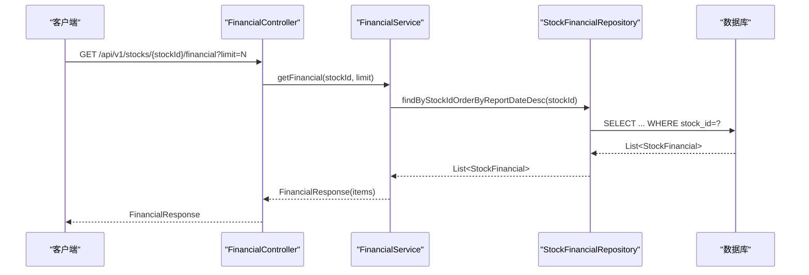
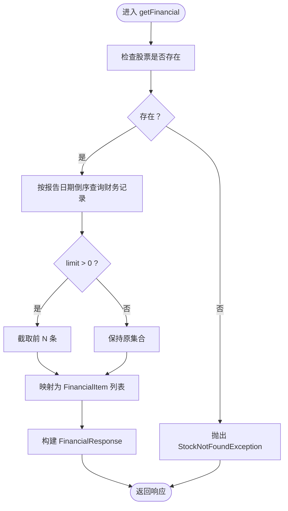
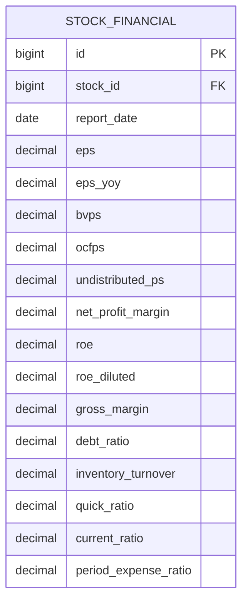
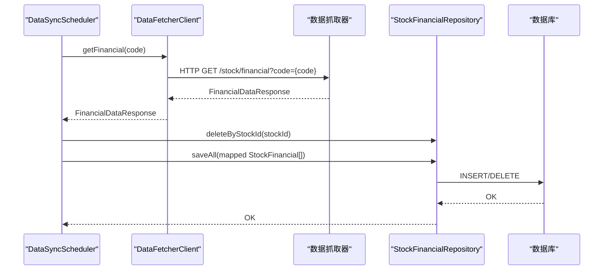
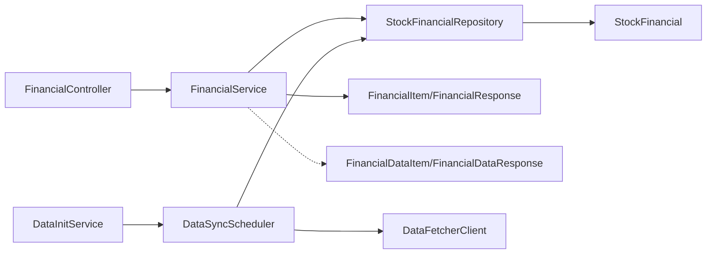

# 财务服务

<cite>
**本文引用的文件**
- [FinancialService.java](file://backend/src/main/java/com/stock/service/FinancialService.java)
- [FinancialController.java](file://backend/src/main/java/com/stock/controller/FinancialController.java)
- [FinancialItem.java](file://backend/src/main/java/com/stock/dto/response/FinancialItem.java)
- [FinancialResponse.java](file://backend/src/main/java/com/stock/dto/response/FinancialResponse.java)
- [StockFinancial.java](file://backend/src/main/java/com/stock/entity/StockFinancial.java)
- [StockFinancialRepository.java](file://backend/src/main/java/com/stock/repository/StockFinancialRepository.java)
- [FinancialDataItem.java](file://backend/src/main/java/com/stock/dto/fetcher/FinancialDataItem.java)
- [FinancialDataResponse.java](file://backend/src/main/java/com/stock/dto/fetcher/FinancialDataResponse.java)
- [DataSyncScheduler.java](file://backend/src/main/java/com/stock/scheduler/DataSyncScheduler.java)
- [DataFetcherClient.java](file://backend/src/main/java/com/stock/client/DataFetcherClient.java)
- [DataInitService.java](file://backend/src/main/java/com/stock/service/DataInitService.java)
</cite>

## 目录
1. [简介](#简介)
2. [项目结构](#项目结构)
3. [核心组件](#核心组件)
4. [架构总览](#架构总览)
5. [详细组件分析](#详细组件分析)
6. [依赖分析](#依赖分析)
7. [性能考虑](#性能考虑)
8. [故障排查指南](#故障排查指南)
9. [结论](#结论)
10. [附录](#附录)

## 简介
本文件面向财务服务模块的技术文档，聚焦于 FinancialService 类在财务数据分析方面的职责与实现，涵盖财务报表的获取、解析与存储；财务指标的计算与映射；时间序列分析（趋势与同比/环比）的实现思路；财务数据的标准化与质量控制；以及缓存策略与性能优化建议。为便于非专业读者理解，文档采用由浅入深的方式，并通过图示与路径引用帮助定位具体实现。

## 项目结构
财务服务相关代码位于后端 Java 工程中，主要涉及以下层次：
- 控制器层：对外提供 REST 接口，接收请求参数并调用服务层
- 服务层：封装业务逻辑，负责数据查询与转换
- 数据访问层：基于 JPA 的仓库接口，负责持久化读写
- 实体层：数据库表映射对象，定义字段精度与约束
- DTO 层：用于外部数据抓取与响应封装
- 定时任务：从数据抓取器拉取财务数据并入库
- 客户端：统一调用数据抓取器服务

**图表来源**
- [FinancialController.java:1-23](file://backend/src/main/java/com/stock/controller/FinancialController.java#L1-L23)
- [FinancialService.java:1-45](file://backend/src/main/java/com/stock/service/FinancialService.java#L1-L45)
- [StockFinancialRepository.java:1-15](file://backend/src/main/java/com/stock/repository/StockFinancialRepository.java#L1-L15)
- [StockFinancial.java:1-72](file://backend/src/main/java/com/stock/entity/StockFinancial.java#L1-L72)
- [FinancialItem.java:1-22](file://backend/src/main/java/com/stock/dto/response/FinancialItem.java#L1-L22)
- [FinancialResponse.java:1-9](file://backend/src/main/java/com/stock/dto/response/FinancialResponse.java#L1-L9)
- [FinancialDataItem.java:1-24](file://backend/src/main/java/com/stock/dto/fetcher/FinancialDataItem.java#L1-L24)
- [FinancialDataResponse.java:1-10](file://backend/src/main/java/com/stock/dto/fetcher/FinancialDataResponse.java#L1-L10)
- [DataSyncScheduler.java:1-238](file://backend/src/main/java/com/stock/scheduler/DataSyncScheduler.java#L1-L238)
- [DataFetcherClient.java:1-126](file://backend/src/main/java/com/stock/client/DataFetcherClient.java#L1-L126)
- [DataInitService.java:1-101](file://backend/src/main/java/com/stock/service/DataInitService.java#L1-L101)

**章节来源**
- [FinancialController.java:1-23](file://backend/src/main/java/com/stock/controller/FinancialController.java#L1-L23)
- [FinancialService.java:1-45](file://backend/src/main/java/com/stock/service/FinancialService.java#L1-L45)
- [StockFinancialRepository.java:1-15](file://backend/src/main/java/com/stock/repository/StockFinancialRepository.java#L1-L15)
- [StockFinancial.java:1-72](file://backend/src/main/java/com/stock/entity/StockFinancial.java#L1-L72)
- [FinancialItem.java:1-22](file://backend/src/main/java/com/stock/dto/response/FinancialItem.java#L1-L22)
- [FinancialResponse.java:1-9](file://backend/src/main/java/com/stock/dto/response/FinancialResponse.java#L1-L9)
- [FinancialDataItem.java:1-24](file://backend/src/main/java/com/stock/dto/fetcher/FinancialDataItem.java#L1-L24)
- [FinancialDataResponse.java:1-10](file://backend/src/main/java/com/stock/dto/fetcher/FinancialDataResponse.java#L1-L10)
- [DataSyncScheduler.java:1-238](file://backend/src/main/java/com/stock/scheduler/DataSyncScheduler.java#L1-L238)
- [DataFetcherClient.java:1-126](file://backend/src/main/java/com/stock/client/DataFetcherClient.java#L1-L126)
- [DataInitService.java:1-101](file://backend/src/main/java/com/stock/service/DataInitService.java#L1-L101)

## 核心组件
- FinancialController：提供 REST 接口，接收 stockId 与 limit 参数，调用 FinancialService 获取财务数据
- FinancialService：核心业务类，校验股票存在性，按报告日期倒序查询财务记录，限制返回条数，并将实体映射为响应 DTO
- StockFinancialRepository：JPA 仓库，提供按股票 ID 查询并按报告日期倒序排序的方法
- StockFinancial：财务数据实体，定义字段精度与唯一约束（stock_id + report_date）
- FinancialItem/FinancialResponse：响应 DTO，承载前端所需财务指标字段
- FinancialDataItem/FinancialDataResponse：抓取 DTO，承载从数据抓取器返回的原始财务字段
- DataSyncScheduler：定时任务，按周同步财务数据，先清空旧数据再批量保存
- DataFetcherClient：统一调用数据抓取器服务，封装 HTTP 请求
- DataInitService：初始化调度，包含“FINANCIAL”步骤，驱动财务数据初始化流程

**章节来源**
- [FinancialController.java:17-21](file://backend/src/main/java/com/stock/controller/FinancialController.java#L17-L21)
- [FinancialService.java:24-43](file://backend/src/main/java/com/stock/service/FinancialService.java#L24-L43)
- [StockFinancialRepository.java:11](file://backend/src/main/java/com/stock/repository/StockFinancialRepository.java#L11)
- [StockFinancial.java:15-17](file://backend/src/main/java/com/stock/entity/StockFinancial.java#L15-L17)
- [FinancialItem.java:5-21](file://backend/src/main/java/com/stock/dto/response/FinancialItem.java#L5-L21)
- [FinancialResponse.java:5-8](file://backend/src/main/java/com/stock/dto/response/FinancialResponse.java#L5-L8)
- [FinancialDataItem.java:7-23](file://backend/src/main/java/com/stock/dto/fetcher/FinancialDataItem.java#L7-L23)
- [FinancialDataResponse.java:7-9](file://backend/src/main/java/com/stock/dto/fetcher/FinancialDataResponse.java#L7-L9)
- [DataSyncScheduler.java:182-194](file://backend/src/main/java/com/stock/scheduler/DataSyncScheduler.java#L182-L194)
- [DataFetcherClient.java:71-75](file://backend/src/main/java/com/stock/client/DataFetcherClient.java#L71-L75)
- [DataInitService.java:28](file://backend/src/main/java/com/stock/service/DataInitService.java#L28)

## 架构总览
财务服务的典型调用链路如下：

**图表来源**
- [FinancialController.java:17-21](file://backend/src/main/java/com/stock/controller/FinancialController.java#L17-L21)
- [FinancialService.java:24-43](file://backend/src/main/java/com/stock/service/FinancialService.java#L24-L43)
- [StockFinancialRepository.java:11](file://backend/src/main/java/com/stock/repository/StockFinancialRepository.java#L11)

## 详细组件分析

### FinancialService 组件分析
- 职责与流程
  - 校验股票是否存在，否则抛出异常
  - 按报告日期倒序查询财务记录
  - 若 limit > 0，则截取前 N 条
  - 将 StockFinancial 列表映射为 FinancialItem 列表，封装到 FinancialResponse 返回
- 关键点
  - 报告日期倒序保证最新数据优先
  - 限制返回数量避免超大数据量
  - 映射字段覆盖盈利能力（EPS、ROE）、偿债能力（资产负债率、速动比率、流动比率）、运营效率（存货周转率）等常用指标
- 可扩展性
  - 当前仅做简单映射，未进行时间序列计算或同比/环比处理
  - 如需新增指标，可在映射阶段加入计算逻辑或引入 IndicatorCalcService

**图表来源**
- [FinancialService.java:24-43](file://backend/src/main/java/com/stock/service/FinancialService.java#L24-L43)

**章节来源**
- [FinancialService.java:14-43](file://backend/src/main/java/com/stock/service/FinancialService.java#L14-L43)

### 数据模型与字段映射
- 实体与表结构
  - 表名：stock_financial
  - 唯一约束：stock_id + report_date
  - 字段精度：统一使用 BigDecimal，精度与小数位配置在实体中
- 字段映射关系（节选）
  - 报告期：report_date
  - 盈利能力：eps、eps_yoy、bvps、ocfps、undistributed_ps、net_profit_margin、roe、roe_diluted
  - 偿债能力：debt_ratio、quick_ratio、current_ratio
  - 运营效率：inventory_turnover
  - 费用结构：period_expense_ratio

**图表来源**
- [StockFinancial.java:18-71](file://backend/src/main/java/com/stock/entity/StockFinancial.java#L18-L71)

**章节来源**
- [StockFinancial.java:15-71](file://backend/src/main/java/com/stock/entity/StockFinancial.java#L15-L71)

### 财务数据获取与存储流程
- 定时同步策略
  - 每周日 0 点执行，抓取当周财务数据
  - 先删除该股票历史财务数据，再批量插入新数据，确保数据一致性
- 抓取与入库
  - 通过 DataFetcherClient 调用 /stock/financial 接口
  - 使用 FinancialDataResponse/FinancialDataItem 解析原始字段
  - 转换为 StockFinancial 并保存至数据库

**图表来源**
- [DataSyncScheduler.java:182-194](file://backend/src/main/java/com/stock/scheduler/DataSyncScheduler.java#L182-L194)
- [DataFetcherClient.java:71-75](file://backend/src/main/java/com/stock/client/DataFetcherClient.java#L71-L75)
- [StockFinancialRepository.java:13](file://backend/src/main/java/com/stock/repository/StockFinancialRepository.java#L13)

**章节来源**
- [DataSyncScheduler.java:163-214](file://backend/src/main/java/com/stock/scheduler/DataSyncScheduler.java#L163-L214)
- [DataFetcherClient.java:71-75](file://backend/src/main/java/com/stock/client/DataFetcherClient.java#L71-L75)
- [StockFinancialRepository.java:11-13](file://backend/src/main/java/com/stock/repository/StockFinancialRepository.java#L11-L13)

### 财务指标计算与时间序列分析
- 现状
  - FinancialService 当前仅做字段映射，未进行指标计算与时间序列分析
- 可行的扩展方向
  - 盈利能力：EPS 同比（已含 eps_yoy），可补充 ROE 趋势、毛利率/净利率变化
  - 偿债能力：资产负债率、流动比率、速动比率的趋势与分位对比
  - 运营效率：存货周转率、应收账款周转率的同比/环比
  - 成长性：营收/利润同比、复合增长率
- 实现建议
  - 在 FinancialService 中增加时间序列处理逻辑，对 FinancialItem 列表按 report_date 排序后计算同比/环比
  - 引入 IndicatorCalcService 或在服务内实现通用指标计算函数
  - 对缺失值进行填充或标记，确保序列完整性

[本节为概念性分析，不直接引用具体源码]

### 财务数据标准化与质量控制
- 标准化
  - 字段类型：统一使用 BigDecimal，精度与小数位在实体中定义
  - 时间格式：report_date 使用 LocalDate，避免字符串解析错误
- 质量控制
  - 唯一约束：stock_id + report_date 防止重复入库
  - 定时同步：每周清理旧数据，保证数据新鲜度
  - 初始化流程：DataInitService 包含 FINANCIAL 步骤，确保首次数据完整性

**章节来源**
- [StockFinancial.java:15-17](file://backend/src/main/java/com/stock/entity/StockFinancial.java#L15-L17)
- [StockFinancialRepository.java:13](file://backend/src/main/java/com/stock/repository/StockFinancialRepository.java#L13)
- [DataInitService.java:28](file://backend/src/main/java/com/stock/service/DataInitService.java#L28)

### 代码示例路径
- 获取财务数据（控制器）
  - [FinancialController.java:17-21](file://backend/src/main/java/com/stock/controller/FinancialController.java#L17-L21)
- 查询财务数据（服务）
  - [FinancialService.java:24-43](file://backend/src/main/java/com/stock/service/FinancialService.java#L24-L43)
- 查询财务数据（仓库）
  - [StockFinancialRepository.java:11](file://backend/src/main/java/com/stock/repository/StockFinancialRepository.java#L11)
- 实体定义
  - [StockFinancial.java:18-71](file://backend/src/main/java/com/stock/entity/StockFinancial.java#L18-L71)
- 响应 DTO
  - [FinancialItem.java:5-21](file://backend/src/main/java/com/stock/dto/response/FinancialItem.java#L5-L21)
  - [FinancialResponse.java:5-8](file://backend/src/main/java/com/stock/dto/response/FinancialResponse.java#L5-L8)
- 抓取 DTO
  - [FinancialDataItem.java:7-23](file://backend/src/main/java/com/stock/dto/fetcher/FinancialDataItem.java#L7-L23)
  - [FinancialDataResponse.java:7-9](file://backend/src/main/java/com/stock/dto/fetcher/FinancialDataResponse.java#L7-L9)
- 定时同步
  - [DataSyncScheduler.java:182-194](file://backend/src/main/java/com/stock/scheduler/DataSyncScheduler.java#L182-L194)
- 抓取客户端
  - [DataFetcherClient.java:71-75](file://backend/src/main/java/com/stock/client/DataFetcherClient.java#L71-L75)

**章节来源**
- [FinancialController.java:17-21](file://backend/src/main/java/com/stock/controller/FinancialController.java#L17-L21)
- [FinancialService.java:24-43](file://backend/src/main/java/com/stock/service/FinancialService.java#L24-L43)
- [StockFinancialRepository.java:11](file://backend/src/main/java/com/stock/repository/StockFinancialRepository.java#L11)
- [StockFinancial.java:18-71](file://backend/src/main/java/com/stock/entity/StockFinancial.java#L18-L71)
- [FinancialItem.java:5-21](file://backend/src/main/java/com/stock/dto/response/FinancialItem.java#L5-L21)
- [FinancialResponse.java:5-8](file://backend/src/main/java/com/stock/dto/response/FinancialResponse.java#L5-L8)
- [FinancialDataItem.java:7-23](file://backend/src/main/java/com/stock/dto/fetcher/FinancialDataItem.java#L7-L23)
- [FinancialDataResponse.java:7-9](file://backend/src/main/java/com/stock/dto/fetcher/FinancialDataResponse.java#L7-L9)
- [DataSyncScheduler.java:182-194](file://backend/src/main/java/com/stock/scheduler/DataSyncScheduler.java#L182-L194)
- [DataFetcherClient.java:71-75](file://backend/src/main/java/com/stock/client/DataFetcherClient.java#L71-L75)

## 依赖分析
- 控制器依赖服务，服务依赖仓库与实体
- 服务层不直接依赖抓取 DTO，但通过仓库与实体间接依赖抓取流程
- 定时任务依赖抓取客户端与仓库，形成闭环

**图表来源**
- [FinancialController.java:13-15](file://backend/src/main/java/com/stock/controller/FinancialController.java#L13-L15)
- [FinancialService.java:16-22](file://backend/src/main/java/com/stock/service/FinancialService.java#L16-L22)
- [StockFinancialRepository.java:9-14](file://backend/src/main/java/com/stock/repository/StockFinancialRepository.java#L9-L14)
- [StockFinancial.java:14-17](file://backend/src/main/java/com/stock/entity/StockFinancial.java#L14-L17)
- [DataSyncScheduler.java:32-51](file://backend/src/main/java/com/stock/scheduler/DataSyncScheduler.java#L32-L51)
- [DataFetcherClient.java:17-24](file://backend/src/main/java/com/stock/client/DataFetcherClient.java#L17-L24)
- [DataInitService.java:34-40](file://backend/src/main/java/com/stock/service/DataInitService.java#L34-L40)

**章节来源**
- [FinancialController.java:13-15](file://backend/src/main/java/com/stock/controller/FinancialController.java#L13-L15)
- [FinancialService.java:16-22](file://backend/src/main/java/com/stock/service/FinancialService.java#L16-L22)
- [StockFinancialRepository.java:9-14](file://backend/src/main/java/com/stock/repository/StockFinancialRepository.java#L9-L14)
- [StockFinancial.java:14-17](file://backend/src/main/java/com/stock/entity/StockFinancial.java#L14-L17)
- [DataSyncScheduler.java:32-51](file://backend/src/main/java/com/stock/scheduler/DataSyncScheduler.java#L32-L51)
- [DataFetcherClient.java:17-24](file://backend/src/main/java/com/stock/client/DataFetcherClient.java#L17-L24)
- [DataInitService.java:34-40](file://backend/src/main/java/com/stock/service/DataInitService.java#L34-L40)

## 性能考虑
- 查询优化
  - 使用按 report_date 倒序的查询，避免全表扫描
  - 通过 limit 限制返回数量，减少序列化与网络传输开销
- 存储优化
  - 批量保存（saveAll）替代逐条插入，降低事务开销
  - 定时清理旧数据，避免表膨胀
- 缓存策略建议
  - 控制器层缓存最近一次查询结果（基于 stockId+limit 组合键），有效期可根据更新频率设置
  - 服务层对同一 stockId 的多次请求进行内存去重与短时缓存
  - 注意缓存失效：在 DataSyncScheduler 定时同步完成后主动失效对应 stockId 的缓存
- 并发与事务
  - 定时任务使用 @Transactional，确保一致性
  - 控制器与服务层默认无状态，天然支持高并发

[本节提供通用优化建议，不直接引用具体源码]

## 故障排查指南
- 常见问题
  - 股票不存在：服务层会抛出 StockNotFoundException，需确认 stockId 是否正确
  - 数据为空：检查 DataSyncScheduler 是否成功执行，确认抓取接口可用
  - 字段缺失：检查抓取 DTO 与实体字段映射是否一致
- 日志与监控
  - 定时任务与控制器均输出日志，可通过日志定位失败节点
  - 建议增加指标埋点统计查询耗时与成功率

**章节来源**
- [FinancialService.java:25-27](file://backend/src/main/java/com/stock/service/FinancialService.java#L25-L27)
- [DataSyncScheduler.java:182-194](file://backend/src/main/java/com/stock/scheduler/DataSyncScheduler.java#L182-L194)

## 结论
当前财务服务以简洁高效为核心设计目标：通过控制器-服务-仓库三层结构，完成财务数据的查询与映射；借助定时任务与抓取客户端，实现财务数据的自动同步与入库。若需进一步增强分析能力，可在服务层扩展时间序列与指标计算逻辑，并结合缓存策略提升性能与用户体验。

## 附录
- 初始化流程（包含财务步骤）
  - [DataInitService.java:23-32](file://backend/src/main/java/com/stock/service/DataInitService.java#L23-L32)
- 抓取接口定义
  - [DataFetcherClient.java:71-75](file://backend/src/main/java/com/stock/client/DataFetcherClient.java#L71-L75)

**章节来源**
- [DataInitService.java:23-32](file://backend/src/main/java/com/stock/service/DataInitService.java#L23-L32)
- [DataFetcherClient.java:71-75](file://backend/src/main/java/com/stock/client/DataFetcherClient.java#L71-L75)