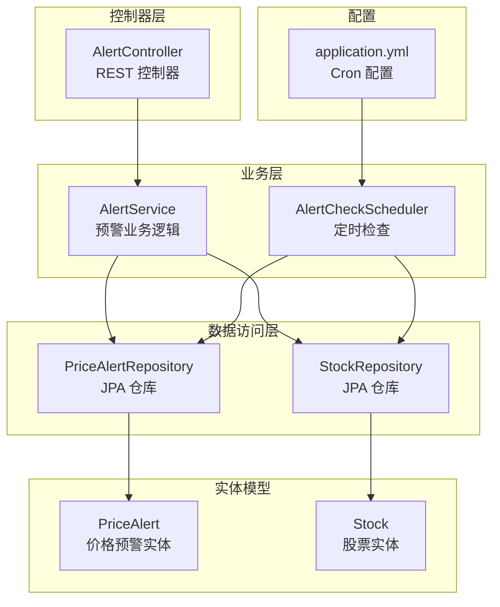
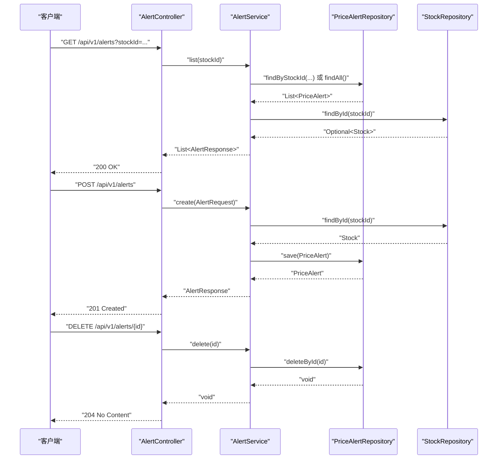
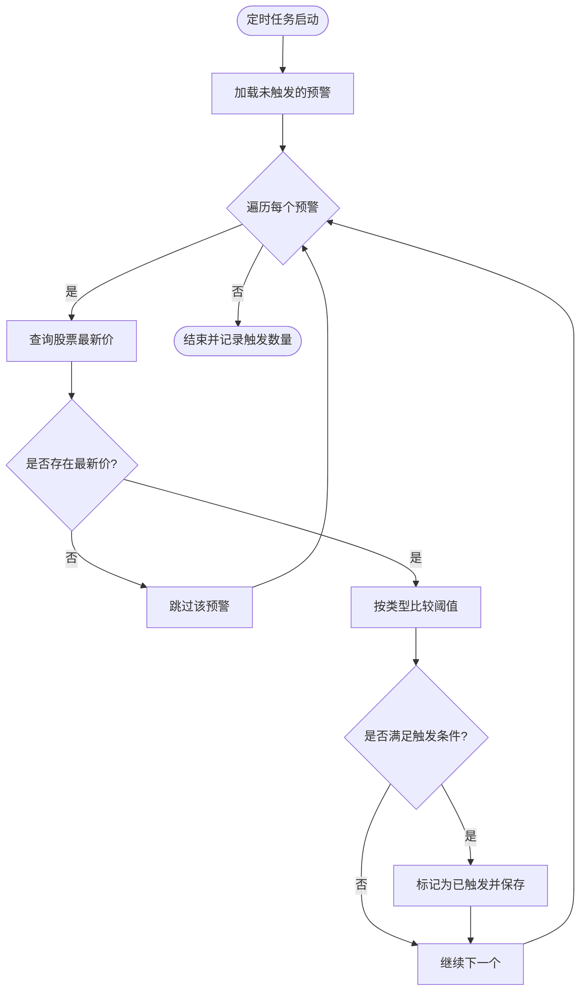
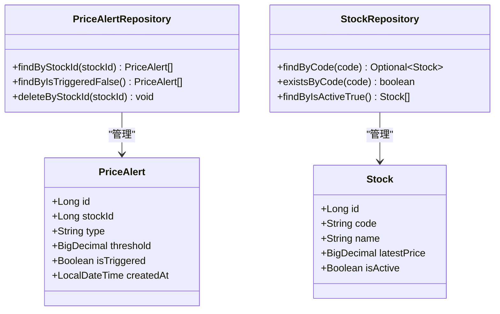
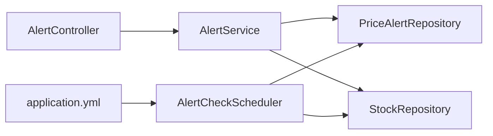

# 预警服务

<cite>
**本文引用的文件**
- [AlertService.java](file://backend/src/main/java/com/stock/service/AlertService.java)
- [AlertController.java](file://backend/src/main/java/com/stock/controller/AlertController.java)
- [AlertRequest.java](file://backend/src/main/java/com/stock/dto/request/AlertRequest.java)
- [AlertResponse.java](file://backend/src/main/java/com/stock/dto/response/AlertResponse.java)
- [PriceAlert.java](file://backend/src/main/java/com/stock/entity/PriceAlert.java)
- [Stock.java](file://backend/src/main/java/com/stock/entity/Stock.java)
- [PriceAlertRepository.java](file://backend/src/main/java/com/stock/repository/PriceAlertRepository.java)
- [StockRepository.java](file://backend/src/main/java/com/stock/repository/StockRepository.java)
- [AlertCheckScheduler.java](file://backend/src/main/java/com/stock/scheduler/AlertCheckScheduler.java)
- [application.yml](file://backend/src/main/resources/application.yml)
- [AlertServiceTest.java](file://backend/src/test/java/com/stock/service/AlertServiceTest.java)
- [AlertControllerTest.java](file://backend/src/test/java/com/stock/controller/AlertControllerTest.java)
- [DataFetcherClient.java](file://backend/src/main/java/com/stock/client/DataFetcherClient.java)
- [StockNotFoundException.java](file://backend/src/main/java/com/stock/exception/StockNotFoundException.java)
</cite>

## 目录
1. [简介](#简介)
2. [项目结构](#项目结构)
3. [核心组件](#核心组件)
4. [架构总览](#架构总览)
5. [详细组件分析](#详细组件分析)
6. [依赖分析](#依赖分析)
7. [性能考虑](#性能考虑)
8. [故障排查指南](#故障排查指南)
9. [结论](#结论)
10. [附录](#附录)

## 简介
本文件为“预警服务”的全面技术文档，聚焦于价格预警的全生命周期管理：创建、查询、删除；预警规则的判定逻辑（价格阈值与触发条件）；以及预警触发后的通知机制现状与扩展建议；同时涵盖预警历史记录的存储与查询思路。文档还提供了关键流程的时序图与类图，帮助读者快速理解系统架构与实现要点。

## 项目结构
预警服务位于后端模块中，采用分层架构：
- 控制器层：对外暴露 REST 接口，负责请求参数校验与响应封装
- 业务层：核心预警逻辑，包括创建、查询、删除与规则判定
- 数据访问层：JPA 仓库负责持久化与查询
- 定时调度：基于 Cron 的定时任务扫描未触发预警并进行判定
- 实体模型：PriceAlert 与 Stock 描述预警与股票数据

图表来源
- [AlertController.java:1-40](file://backend/src/main/java/com/stock/controller/AlertController.java#L1-L40)
- [AlertService.java:1-63](file://backend/src/main/java/com/stock/service/AlertService.java#L1-L63)
- [AlertCheckScheduler.java:1-52](file://backend/src/main/java/com/stock/scheduler/AlertCheckScheduler.java#L1-L52)
- [PriceAlertRepository.java:1-17](file://backend/src/main/java/com/stock/repository/PriceAlertRepository.java#L1-L17)
- [StockRepository.java:1-18](file://backend/src/main/java/com/stock/repository/StockRepository.java#L1-L18)
- [PriceAlert.java:1-37](file://backend/src/main/java/com/stock/entity/PriceAlert.java#L1-L37)
- [Stock.java:1-86](file://backend/src/main/java/com/stock/entity/Stock.java#L1-L86)
- [application.yml:19-28](file://backend/src/main/resources/application.yml#L19-L28)

章节来源
- [AlertController.java:1-40](file://backend/src/main/java/com/stock/controller/AlertController.java#L1-L40)
- [AlertService.java:1-63](file://backend/src/main/java/com/stock/service/AlertService.java#L1-L63)
- [AlertCheckScheduler.java:1-52](file://backend/src/main/java/com/stock/scheduler/AlertCheckScheduler.java#L1-L52)
- [PriceAlertRepository.java:1-17](file://backend/src/main/java/com/stock/repository/PriceAlertRepository.java#L1-L17)
- [StockRepository.java:1-18](file://backend/src/main/java/com/stock/repository/StockRepository.java#L1-L18)
- [PriceAlert.java:1-37](file://backend/src/main/java/com/stock/entity/PriceAlert.java#L1-L37)
- [Stock.java:1-86](file://backend/src/main/java/com/stock/entity/Stock.java#L1-L86)
- [application.yml:19-28](file://backend/src/main/resources/application.yml#L19-L28)

## 核心组件
- AlertController：提供 /api/v1/alerts 的 REST 接口，支持按股票筛选查询、创建与删除预警
- AlertService：核心业务逻辑，负责预警的创建、查询与删除，并在创建时校验股票存在性
- AlertCheckScheduler：定时任务，扫描未触发的预警并根据最新股价进行阈值判定
- PriceAlert 与 Stock：持久化实体，分别描述预警与股票信息
- PriceAlertRepository 与 StockRepository：JPA 仓库，提供按股票筛选、按状态筛选、删除等查询能力

章节来源
- [AlertController.java:23-38](file://backend/src/main/java/com/stock/controller/AlertController.java#L23-L38)
- [AlertService.java:26-61](file://backend/src/main/java/com/stock/service/AlertService.java#L26-L61)
- [AlertCheckScheduler.java:26-50](file://backend/src/main/java/com/stock/scheduler/AlertCheckScheduler.java#L26-L50)
- [PriceAlert.java:18-36](file://backend/src/main/java/com/stock/entity/PriceAlert.java#L18-L36)
- [Stock.java:19-84](file://backend/src/main/java/com/stock/entity/Stock.java#L19-L84)
- [PriceAlertRepository.java:11-15](file://backend/src/main/java/com/stock/repository/PriceAlertRepository.java#L11-L15)
- [StockRepository.java:10-17](file://backend/src/main/java/com/stock/repository/StockRepository.java#L10-L17)

## 架构总览
预警服务遵循典型的三层架构：控制层接收请求，业务层编排规则与数据访问，定时任务负责周期性检查。下图展示了从接口到数据库与定时任务的整体交互：

图表来源
- [AlertController.java:23-38](file://backend/src/main/java/com/stock/controller/AlertController.java#L23-L38)
- [AlertService.java:26-61](file://backend/src/main/java/com/stock/service/AlertService.java#L26-L61)
- [PriceAlertRepository.java:11-15](file://backend/src/main/java/com/stock/repository/PriceAlertRepository.java#L11-L15)
- [StockRepository.java:10-17](file://backend/src/main/java/com/stock/repository/StockRepository.java#L10-L17)

## 详细组件分析

### AlertController：REST 接口层
- GET /api/v1/alerts：支持按 stockId 过滤查询，返回预警列表
- POST /api/v1/alerts：创建新预警，返回 201 与新建的 AlertResponse
- DELETE /api/v1/alerts/{id}：删除指定预警，返回 204

章节来源
- [AlertController.java:23-38](file://backend/src/main/java/com/stock/controller/AlertController.java#L23-L38)

### AlertService：业务逻辑层
- 查询 list(stockId)：若传入 stockId 则按股票筛选，否则返回全部；组装 AlertResponse，包含股票名称与最新价
- 创建 create(AlertRequest)：校验股票存在性，构造 PriceAlert 并保存，返回 AlertResponse
- 删除 delete(id)：直接删除指定预警

章节来源
- [AlertService.java:26-61](file://backend/src/main/java/com/stock/service/AlertService.java#L26-L61)
- [AlertRequest.java:6-10](file://backend/src/main/java/com/stock/dto/request/AlertRequest.java#L6-L10)
- [AlertResponse.java:5-13](file://backend/src/main/java/com/stock/dto/response/AlertResponse.java#L5-L13)

### AlertCheckScheduler：规则判定与触发
- 周期性扫描：使用 Cron 表达式定期执行
- 规则判定：遍历未触发的预警，读取对应股票的最新价，依据类型（高于/低于阈值）进行比较
- 触发更新：满足条件则标记 isTriggered=true 并持久化

图表来源
- [AlertCheckScheduler.java:26-50](file://backend/src/main/java/com/stock/scheduler/AlertCheckScheduler.java#L26-L50)
- [PriceAlertRepository.java:13](file://backend/src/main/java/com/stock/repository/PriceAlertRepository.java#L13)
- [StockRepository.java:10-17](file://backend/src/main/java/com/stock/repository/StockRepository.java#L10-L17)

章节来源
- [AlertCheckScheduler.java:26-50](file://backend/src/main/java/com/stock/scheduler/AlertCheckScheduler.java#L26-L50)

### 数据模型与仓库
- PriceAlert：包含 stock_id、type、threshold、is_triggered、created_at 等字段
- Stock：包含 code、name、latest_price 等字段，用于规则判定与响应组装
- PriceAlertRepository：提供按 stockId、按 isTriggered=false、按 stockId 删除等查询
- StockRepository：提供按 code 查询与活跃股票列表等查询

图表来源
- [PriceAlert.java:18-36](file://backend/src/main/java/com/stock/entity/PriceAlert.java#L18-L36)
- [Stock.java:19-84](file://backend/src/main/java/com/stock/entity/Stock.java#L19-L84)
- [PriceAlertRepository.java:11-15](file://backend/src/main/java/com/stock/repository/PriceAlertRepository.java#L11-L15)
- [StockRepository.java:10-17](file://backend/src/main/java/com/stock/repository/StockRepository.java#L10-L17)

章节来源
- [PriceAlert.java:18-36](file://backend/src/main/java/com/stock/entity/PriceAlert.java#L18-L36)
- [Stock.java:19-84](file://backend/src/main/java/com/stock/entity/Stock.java#L19-L84)
- [PriceAlertRepository.java:11-15](file://backend/src/main/java/com/stock/repository/PriceAlertRepository.java#L11-L15)
- [StockRepository.java:10-17](file://backend/src/main/java/com/stock/repository/StockRepository.java#L10-L17)

### 预警规则实现逻辑
- 类型与阈值：type 支持 ABOVE（高于）与 BELOW（低于），threshold 为数值阈值
- 触发条件：当 latestPrice 与 threshold 比较满足 type 条件时触发
- 触发结果：isTriggered=true 并持久化，后续查询可据此识别历史触发记录

章节来源
- [AlertCheckScheduler.java:37-47](file://backend/src/main/java/com/stock/scheduler/AlertCheckScheduler.java#L37-L47)
- [PriceAlert.java:25-29](file://backend/src/main/java/com/stock/entity/PriceAlert.java#L25-L29)
- [Stock.java:62](file://backend/src/main/java/com/stock/entity/Stock.java#L62)

### 预警通知机制现状与扩展
- 现状：当前代码未实现通知发送逻辑（如邮件、短信）
- 扩展建议：可在触发成功后调用通知服务或消息队列，异步发送通知；或在 AlertCheckScheduler 中增加通知调用点

章节来源
- [AlertCheckScheduler.java:43-47](file://backend/src/main/java/com/stock/scheduler/AlertCheckScheduler.java#L43-L47)

### 预警历史记录管理
- 存储：每次触发后将 isTriggered=true 写入数据库，形成历史记录
- 查询：可通过 AlertService.list() 返回的 isTriggered 字段识别历史触发情况
- 建议：若需更详细的触发日志（时间戳、通知状态等），可在 PriceAlert 增加触发时间与通知状态字段

章节来源
- [AlertService.java:31-38](file://backend/src/main/java/com/stock/service/AlertService.java#L31-L38)
- [PriceAlert.java:31](file://backend/src/main/java/com/stock/entity/PriceAlert.java#L31)

### API 使用示例（路径指引）
- 创建预警
  - 请求方法与路径：POST /api/v1/alerts
  - 请求体字段：stockId、type、threshold
  - 参考路径：[AlertController.java:28-32](file://backend/src/main/java/com/stock/controller/AlertController.java#L28-L32)，[AlertRequest.java:6-10](file://backend/src/main/java/com/stock/dto/request/AlertRequest.java#L6-L10)
- 查询预警
  - 请求方法与路径：GET /api/v1/alerts?stockId=...
  - 返回：包含 isTriggered、latestPrice 等字段的列表
  - 参考路径：[AlertController.java:23-26](file://backend/src/main/java/com/stock/controller/AlertController.java#L23-L26)，[AlertService.java:26-39](file://backend/src/main/java/com/stock/service/AlertService.java#L26-L39)
- 删除预警
  - 请求方法与路径：DELETE /api/v1/alerts/{id}
  - 参考路径：[AlertController.java:34-38](file://backend/src/main/java/com/stock/controller/AlertController.java#L34-L38)，[AlertService.java:58-61](file://backend/src/main/java/com/stock/service/AlertService.java#L58-L61)

## 依赖分析
- 控制器依赖业务服务，业务服务依赖两个仓库
- 定时任务依赖仓库进行扫描与更新
- 配置通过 application.yml 提供 Cron 表达式

图表来源
- [AlertController.java:17-21](file://backend/src/main/java/com/stock/controller/AlertController.java#L17-L21)
- [AlertService.java:18-24](file://backend/src/main/java/com/stock/service/AlertService.java#L18-L24)
- [AlertCheckScheduler.java:21-24](file://backend/src/main/java/com/stock/scheduler/AlertCheckScheduler.java#L21-L24)
- [application.yml:27](file://backend/src/main/resources/application.yml#L27)

章节来源
- [AlertController.java:17-21](file://backend/src/main/java/com/stock/controller/AlertController.java#L17-L21)
- [AlertService.java:18-24](file://backend/src/main/java/com/stock/service/AlertService.java#L18-L24)
- [AlertCheckScheduler.java:21-24](file://backend/src/main/java/com/stock/scheduler/AlertCheckScheduler.java#L21-L24)
- [application.yml:27](file://backend/src/main/resources/application.yml#L27)

## 性能考虑
- 定时任务频率：当前每分钟检查一次，建议结合业务需求调整 Cron，避免过于频繁导致数据库压力
- 批量处理：若预警数量较多，可考虑分页或批量更新，减少单次事务开销
- 缓存策略：对热点股票的最新价可引入缓存，降低数据库查询次数
- 异步通知：触发后通知发送建议异步化，避免阻塞定时任务
- 数据库索引：为 price_alert 的 stock_id、is_triggered 建立索引，提升查询效率

## 故障排查指南
- 股票不存在异常：创建预警时若股票不存在会抛出 StockNotFoundException
  - 参考路径：[AlertService.java:43-44](file://backend/src/main/java/com/stock/service/AlertService.java#L43-L44)，[StockNotFoundException.java:2-5](file://backend/src/main/java/com/stock/exception/StockNotFoundException.java#L2-L5)
- 接口测试验证：通过单元测试验证控制器与服务的行为
  - 参考路径：[AlertControllerTest.java:44-65](file://backend/src/test/java/com/stock/controller/AlertControllerTest.java#L44-L65)，[AlertServiceTest.java:34-83](file://backend/src/test/java/com/stock/service/AlertServiceTest.java#L34-L83)
- 定时任务日志：检查日志输出，确认触发数量统计与执行耗时
  - 参考路径：[AlertCheckScheduler.java:29](file://backend/src/main/java/com/stock/scheduler/AlertCheckScheduler.java#L29)，[AlertCheckScheduler.java:49](file://backend/src/main/java/com/stock/scheduler/AlertCheckScheduler.java#L49)

章节来源
- [AlertService.java:43-44](file://backend/src/main/java/com/stock/service/AlertService.java#L43-L44)
- [StockNotFoundException.java:2-5](file://backend/src/main/java/com/stock/exception/StockNotFoundException.java#L2-L5)
- [AlertControllerTest.java:44-65](file://backend/src/test/java/com/stock/controller/AlertControllerTest.java#L44-L65)
- [AlertServiceTest.java:34-83](file://backend/src/test/java/com/stock/service/AlertServiceTest.java#L34-L83)
- [AlertCheckScheduler.java:29](file://backend/src/main/java/com/stock/scheduler/AlertCheckScheduler.java#L29)
- [AlertCheckScheduler.java:49](file://backend/src/main/java/com/stock/scheduler/AlertCheckScheduler.java#L49)

## 结论
预警服务实现了价格预警的完整生命周期管理：通过 REST 接口完成创建、查询与删除；通过定时任务实现规则判定与触发；通过实体与仓库实现数据持久化。当前版本未包含通知发送逻辑，建议在触发后接入异步通知通道。整体架构清晰、职责分离明确，具备良好的扩展性与可维护性。

## 附录
- 配置项参考：定时任务 Cron 表达式位于 application.yml 中，可按需调整
  - 参考路径：[application.yml:27](file://backend/src/main/resources/application.yml#L27)
- 数据获取客户端：DataFetcherClient 提供外部数据拉取能力，可作为股价来源的补充
  - 参考路径：[DataFetcherClient.java:19](file://backend/src/main/java/com/stock/client/DataFetcherClient.java#L19)