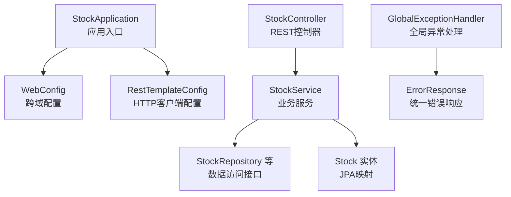
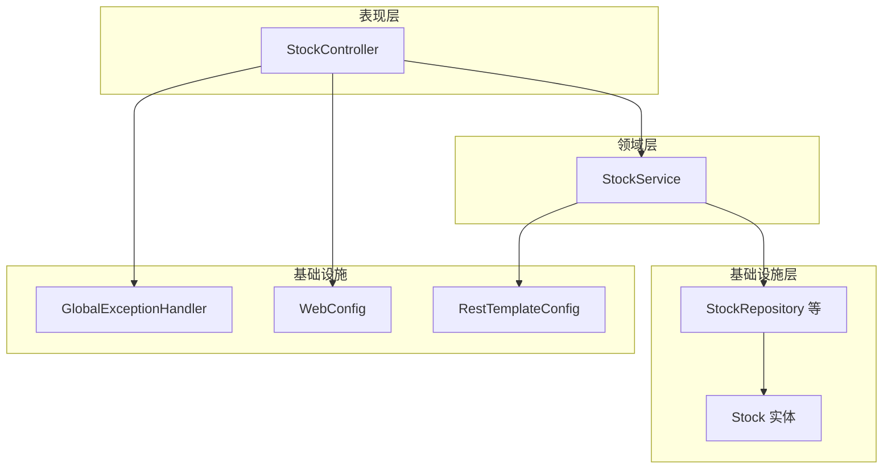
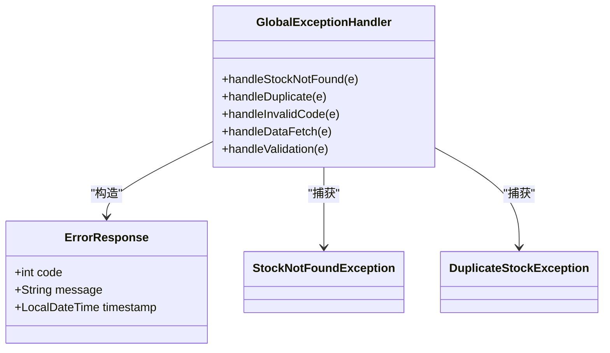
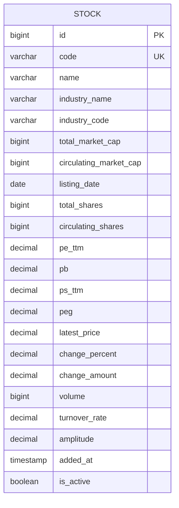
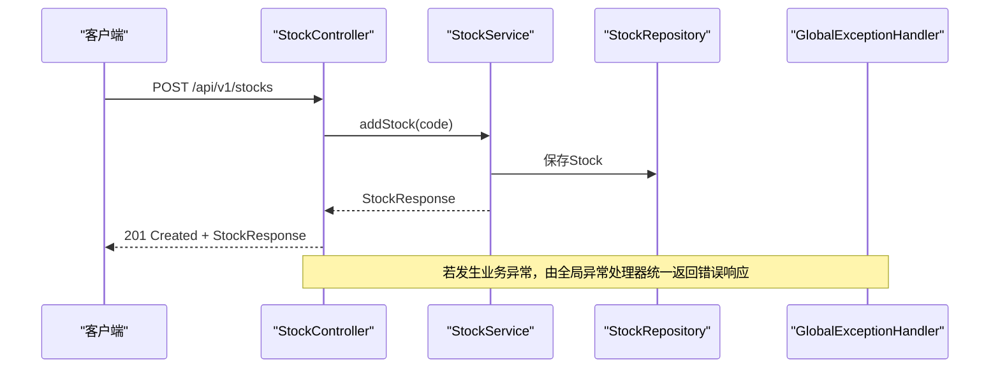
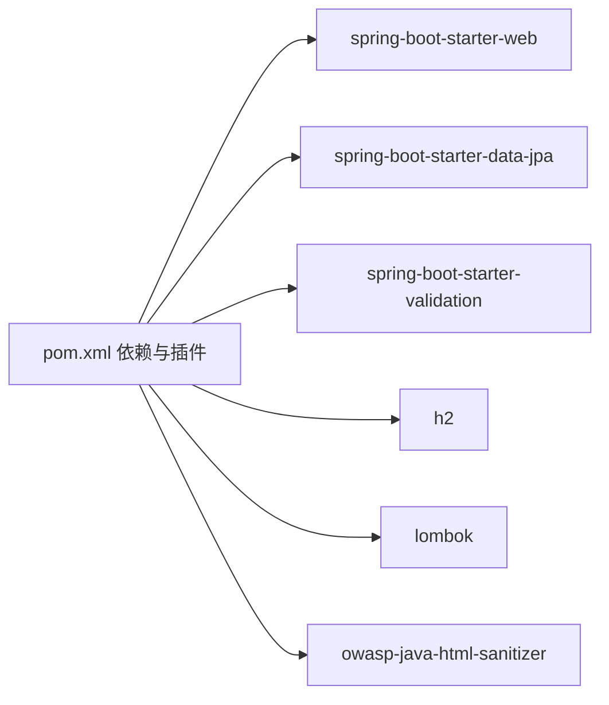

# Java后端代码规范

<cite>
**本文引用的文件**
- [StockApplication.java](file://backend/src/main/java/com/stock/StockApplication.java)
- [WebConfig.java](file://backend/src/main/java/com/stock/config/WebConfig.java)
- [RestTemplateConfig.java](file://backend/src/main/java/com/stock/config/RestTemplateConfig.java)
- [StockController.java](file://backend/src/main/java/com/stock/controller/StockController.java)
- [StockService.java](file://backend/src/main/java/com/stock/service/StockService.java)
- [Stock.java](file://backend/src/main/java/com/stock/entity/Stock.java)
- [StockRepository.java](file://backend/src/main/java/com/stock/repository/StockRepository.java)
- [GlobalExceptionHandler.java](file://backend/src/main/java/com/stock/exception/GlobalExceptionHandler.java)
- [ErrorResponse.java](file://backend/src/main/java/com/stock/exception/ErrorResponse.java)
- [StockNotFoundException.java](file://backend/src/main/java/com/stock/exception/StockNotFoundException.java)
- [DuplicateStockException.java](file://backend/src/main/java/com/stock/exception/DuplicateStockException.java)
- [AddStockRequest.java](file://backend/src/main/java/com/stock/dto/request/AddStockRequest.java)
- [StockResponse.java](file://backend/src/main/java/com/stock/dto/response/StockResponse.java)
- [application.yml](file://backend/src/main/resources/application.yml)
- [pom.xml](file://backend/pom.xml)
</cite>

## 目录
1. [引言](#引言)
2. [项目结构](#项目结构)
3. [核心组件](#核心组件)
4. [架构总览](#架构总览)
5. [详细组件分析](#详细组件分析)
6. [依赖分析](#依赖分析)
7. [性能考虑](#性能考虑)
8. [故障排查指南](#故障排查指南)
9. [结论](#结论)
10. [附录](#附录)

## 引言
本规范面向Spring Boot后端开发团队，旨在统一代码风格与工程实践，提升可读性、可维护性与协作效率。本文结合现有代码库中的实际实现，给出命名约定、注释规范、异常与日志处理、JPA与Spring注解使用、REST API设计以及IDE与静态分析工具配置建议。

## 项目结构
后端采用标准Spring Boot目录结构，按功能域分层组织：入口类、配置、控制器、服务、仓库、实体、DTO、异常与测试等。该结构清晰分离关注点，便于扩展与维护。

图表来源
- [StockApplication.java:1-16](file://backend/src/main/java/com/stock/StockApplication.java#L1-L16)
- [WebConfig.java:1-15](file://backend/src/main/java/com/stock/config/WebConfig.java#L1-L15)
- [RestTemplateConfig.java:1-18](file://backend/src/main/java/com/stock/config/RestTemplateConfig.java#L1-L18)
- [StockController.java:1-57](file://backend/src/main/java/com/stock/controller/StockController.java#L1-L57)
- [StockService.java:1-243](file://backend/src/main/java/com/stock/service/StockService.java#L1-L243)
- [StockRepository.java:1-18](file://backend/src/main/java/com/stock/repository/StockRepository.java#L1-L18)
- [Stock.java:1-86](file://backend/src/main/java/com/stock/entity/Stock.java#L1-L86)
- [GlobalExceptionHandler.java:1-33](file://backend/src/main/java/com/stock/exception/GlobalExceptionHandler.java#L1-L33)
- [ErrorResponse.java:1-8](file://backend/src/main/java/com/stock/exception/ErrorResponse.java#L1-L8)

章节来源
- [StockApplication.java:1-16](file://backend/src/main/java/com/stock/StockApplication.java#L1-L16)
- [WebConfig.java:1-15](file://backend/src/main/java/com/stock/config/WebConfig.java#L1-L15)
- [RestTemplateConfig.java:1-18](file://backend/src/main/java/com/stock/config/RestTemplateConfig.java#L1-L18)
- [StockController.java:1-57](file://backend/src/main/java/com/stock/controller/StockController.java#L1-L57)
- [StockService.java:1-243](file://backend/src/main/java/com/stock/service/StockService.java#L1-L243)
- [StockRepository.java:1-18](file://backend/src/main/java/com/stock/repository/StockRepository.java#L1-L18)
- [Stock.java:1-86](file://backend/src/main/java/com/stock/entity/Stock.java#L1-L86)
- [GlobalExceptionHandler.java:1-33](file://backend/src/main/java/com/stock/exception/GlobalExceptionHandler.java#L1-L33)
- [ErrorResponse.java:1-8](file://backend/src/main/java/com/stock/exception/ErrorResponse.java#L1-L8)

## 核心组件
- 应用入口与启动：启用调度与异步，集中于入口类。
- 配置模块：跨域策略、HTTP客户端超时配置。
- 控制器：基于REST风格，返回标准状态码与响应对象。
- 服务层：事务边界明确，调用外部数据源，触发异步初始化。
- 数据访问：JPA仓库接口继承标准基类，提供常用查询方法。
- 实体模型：使用JPA注解映射表与列，字段类型与精度匹配业务需求。
- 异常体系：自定义业务异常，配合全局异常处理器统一输出。

章节来源
- [StockApplication.java:8-11](file://backend/src/main/java/com/stock/StockApplication.java#L8-L11)
- [WebConfig.java:5-14](file://backend/src/main/java/com/stock/config/WebConfig.java#L5-L14)
- [RestTemplateConfig.java:8-17](file://backend/src/main/java/com/stock/config/RestTemplateConfig.java#L8-L17)
- [StockController.java:17-56](file://backend/src/main/java/com/stock/controller/StockController.java#L17-L56)
- [StockService.java:26-91](file://backend/src/main/java/com/stock/service/StockService.java#L26-L91)
- [StockRepository.java:10-17](file://backend/src/main/java/com/stock/repository/StockRepository.java#L10-L17)
- [Stock.java:15-85](file://backend/src/main/java/com/stock/entity/Stock.java#L15-L85)
- [GlobalExceptionHandler.java:7-32](file://backend/src/main/java/com/stock/exception/GlobalExceptionHandler.java#L7-L32)

## 架构总览
系统遵循经典的三层架构：表现层（控制器）、领域层（服务）、基础设施层（仓库与实体）。通过全局异常处理器统一错误响应；通过配置类集中管理跨域与HTTP客户端行为。

图表来源
- [StockController.java:17-56](file://backend/src/main/java/com/stock/controller/StockController.java#L17-L56)
- [StockService.java:26-91](file://backend/src/main/java/com/stock/service/StockService.java#L26-L91)
- [StockRepository.java:10-17](file://backend/src/main/java/com/stock/repository/StockRepository.java#L10-L17)
- [Stock.java:15-85](file://backend/src/main/java/com/stock/entity/Stock.java#L15-L85)
- [GlobalExceptionHandler.java:7-32](file://backend/src/main/java/com/stock/exception/GlobalExceptionHandler.java#L7-L32)
- [WebConfig.java:5-14](file://backend/src/main/java/com/stock/config/WebConfig.java#L5-L14)
- [RestTemplateConfig.java:8-17](file://backend/src/main/java/com/stock/config/RestTemplateConfig.java#L8-L17)

## 详细组件分析

### 命名规范
- 类命名：使用名词短语，如 StockService、StockController、StockRepository。
- 接口命名：使用动词+名词形式，如 StockRepository 继承 JpaRepository。
- 方法命名：使用动词短语，如 addStock、deleteStock、listStocks、getStock。
- 常量命名：全大写+下划线，如在配置中使用的常量键名（例如应用配置中的键）。

章节来源
- [StockService.java:26-91](file://backend/src/main/java/com/stock/service/StockService.java#L26-L91)
- [StockController.java:17-56](file://backend/src/main/java/com/stock/controller/StockController.java#L17-L56)
- [StockRepository.java:10-17](file://backend/src/main/java/com/stock/repository/StockRepository.java#L10-L17)
- [application.yml:19-27](file://backend/src/main/resources/application.yml#L19-L27)

### 注释规范
- 类与方法：使用JavaDoc注释，说明职责、参数、返回值与异常。
- 字段：使用简洁注释说明含义或用途。
- 示例参考：控制器、服务与实体均体现良好的注释习惯。

章节来源
- [StockController.java:17-56](file://backend/src/main/java/com/stock/controller/StockController.java#L17-L56)
- [StockService.java:26-91](file://backend/src/main/java/com/stock/service/StockService.java#L26-L91)
- [Stock.java:15-85](file://backend/src/main/java/com/stock/entity/Stock.java#L15-L85)

### 异常处理规范
- 自定义业务异常：如 StockNotFoundException、DuplicateStockException。
- 全局异常处理器：统一捕获业务异常与校验异常，返回标准化错误响应。
- 错误响应格式：使用 record 类型封装 code、message、timestamp。

图表来源
- [GlobalExceptionHandler.java:7-32](file://backend/src/main/java/com/stock/exception/GlobalExceptionHandler.java#L7-L32)
- [ErrorResponse.java:3-7](file://backend/src/main/java/com/stock/exception/ErrorResponse.java#L3-L7)
- [StockNotFoundException.java:1-6](file://backend/src/main/java/com/stock/exception/StockNotFoundException.java#L1-L6)
- [DuplicateStockException.java:1-5](file://backend/src/main/java/com/stock/exception/DuplicateStockException.java#L1-L5)

章节来源
- [GlobalExceptionHandler.java:7-32](file://backend/src/main/java/com/stock/exception/GlobalExceptionHandler.java#L7-L32)
- [ErrorResponse.java:3-7](file://backend/src/main/java/com/stock/exception/ErrorResponse.java#L3-L7)
- [StockNotFoundException.java:1-6](file://backend/src/main/java/com/stock/exception/StockNotFoundException.java#L1-L6)
- [DuplicateStockException.java:1-5](file://backend/src/main/java/com/stock/exception/DuplicateStockException.java#L1-L5)

### 日志记录规范
- 使用 SLF4J（通过 Lombok 的 @Slf4j），在服务层对关键流程进行日志记录。
- 合理使用日志级别：info 记录流程控制点，warn 记录可恢复的异常情况。

章节来源
- [StockService.java:26](file://backend/src/main/java/com/stock/service/StockService.java#L26)
- [StockService.java:142](file://backend/src/main/java/com/stock/service/StockService.java#L142)
- [StockService.java:149-159](file://backend/src/main/java/com/stock/service/StockService.java#L149-L159)

### JPA 实体注解使用规范
- @Entity：声明为持久化实体。
- @Table：指定表名。
- @Column：映射列，设置长度、精度、是否为空等。
- @GeneratedValue：主键生成策略。
- 字段类型与精度：数值型字段使用 BigDecimal 并设置 precision/scale，日期时间使用 LocalDate/LocalDateTime。

图表来源
- [Stock.java:15-85](file://backend/src/main/java/com/stock/entity/Stock.java#L15-L85)

章节来源
- [Stock.java:15-85](file://backend/src/main/java/com/stock/entity/Stock.java#L15-L85)

### Spring 注解使用规范
- @RestController：控制器层使用，负责HTTP请求处理。
- @Service：服务层使用，承载业务逻辑。
- @Repository：数据访问层使用，继承JpaRepository。
- @Autowired：构造注入（推荐），避免字段注入，增强可测试性与不可变性。
- @EnableScheduling/@EnableAsync：在入口类启用定时与异步任务。

章节来源
- [StockController.java:17-27](file://backend/src/main/java/com/stock/controller/StockController.java#L17-L27)
- [StockService.java:26-91](file://backend/src/main/java/com/stock/service/StockService.java#L26-L91)
- [StockRepository.java:10-17](file://backend/src/main/java/com/stock/repository/StockRepository.java#L10-L17)
- [StockApplication.java:8-11](file://backend/src/main/java/com/stock/StockApplication.java#L8-L11)

### REST API 设计规范
- 路径与资源：使用复数名词表示资源集合，如 /api/v1/stocks。
- 方法语义：POST 创建、GET 获取列表/详情、DELETE 删除。
- 状态码：201 Created（创建成功）、204 No Content（删除成功）、400 Bad Request（参数校验失败）、404 Not Found（资源不存在）、409 Conflict（冲突）、503 Service Unavailable（数据源不可用）。
- 响应格式：统一使用 DTO 对象；错误响应使用 ErrorResponse。

图表来源
- [StockController.java:29-34](file://backend/src/main/java/com/stock/controller/StockController.java#L29-L34)
- [StockService.java:93-163](file://backend/src/main/java/com/stock/service/StockService.java#L93-L163)
- [GlobalExceptionHandler.java:9-24](file://backend/src/main/java/com/stock/exception/GlobalExceptionHandler.java#L9-L24)

章节来源
- [StockController.java:17-56](file://backend/src/main/java/com/stock/controller/StockController.java#L17-L56)
- [StockService.java:93-163](file://backend/src/main/java/com/stock/service/StockService.java#L93-L163)
- [GlobalExceptionHandler.java:9-24](file://backend/src/main/java/com/stock/exception/GlobalExceptionHandler.java#L9-L24)

### 参数校验与请求对象
- 使用 Jakarta Bean Validation 注解对请求参数进行约束，如 @NotBlank、@Size、@Pattern。
- 将校验结果交由全局异常处理器统一处理，返回结构化错误消息。

章节来源
- [AddStockRequest.java:7-9](file://backend/src/main/java/com/stock/dto/request/AddStockRequest.java#L7-L9)
- [GlobalExceptionHandler.java:25-31](file://backend/src/main/java/com/stock/exception/GlobalExceptionHandler.java#L25-L31)

### 跨域与HTTP客户端配置
- 跨域：在 WebConfig 中配置允许的源、方法与头。
- HTTP客户端：通过 RestTemplateConfig 设置连接与读取超时，避免阻塞。

章节来源
- [WebConfig.java:8-13](file://backend/src/main/java/com/stock/config/WebConfig.java#L8-L13)
- [RestTemplateConfig.java:10-16](file://backend/src/main/java/com/stock/config/RestTemplateConfig.java#L10-L16)

### 事务与异步初始化
- 事务：在业务方法上使用 @Transactional，确保数据一致性。
- 异步：在事务提交后注册回调，触发异步初始化，保证后续读取可见性。

章节来源
- [StockService.java:93-93](file://backend/src/main/java/com/stock/service/StockService.java#L93-L93)
- [StockService.java:145-160](file://backend/src/main/java/com/stock/service/StockService.java#L145-L160)

## 依赖分析
- 模块内聚：控制器仅负责编排，服务层承担业务，仓库层专注数据访问。
- 外部依赖：Spring Web、Spring Data JPA、H2数据库、Lombok、HTML净化库等。
- 构建插件：Maven Compiler、Surefire、Spring Boot Maven Plugin。

图表来源
- [pom.xml:23-55](file://backend/pom.xml#L23-L55)

章节来源
- [pom.xml:17-55](file://backend/pom.xml#L17-L55)

## 性能考虑
- 合理使用事务边界，避免长事务持有锁。
- 在服务层对批量删除与初始化操作进行分批处理，降低数据库压力。
- 利用DTO投影减少不必要的字段传输，优化网络开销。
- 对高频查询建立必要索引（如 code 字段），提升查询性能。

## 故障排查指南
- 参数校验失败：检查请求对象注解与全局异常处理器的错误拼接逻辑。
- 资源不存在：确认服务层抛出的 StockNotFoundException 是否被全局异常处理器捕获。
- 数据源不可用：检查数据源URL与超时配置，观察错误响应码是否为 503。
- 跨域问题：核对 WebConfig 中的路径前缀与允许的源、方法、头。

章节来源
- [GlobalExceptionHandler.java:25-31](file://backend/src/main/java/com/stock/exception/GlobalExceptionHandler.java#L25-L31)
- [StockNotFoundException.java:1-6](file://backend/src/main/java/com/stock/exception/StockNotFoundException.java#L1-L6)
- [application.yml:20-22](file://backend/src/main/resources/application.yml#L20-L22)
- [WebConfig.java:8-13](file://backend/src/main/java/com/stock/config/WebConfig.java#L8-L13)

## 结论
本规范以现有代码库为基础，总结了命名、注释、异常与日志、JPA与Spring注解、REST API设计及配置等方面的最佳实践。建议在新功能开发中严格遵循，持续通过静态分析工具与单元测试保障质量。

## 附录

### IDE 配置建议（IntelliJ IDEA）
- 代码风格：使用 Project 格式，启用“保持 import order”和“优化 import”。
- 编译器：启用注解处理器，指向 Lombok。
- 规范提示：开启“在 @NonNull 字段上生成 getter/setter”与“生成 toString”。

### 静态代码分析工具配置
- SonarQube：配置规则集（如 Java 导入规则、命名规则、异常处理规则），在 CI 中执行质量门禁。
- SpotBugs：启用核心规则集，重点关注空指针、并发与资源泄漏风险。