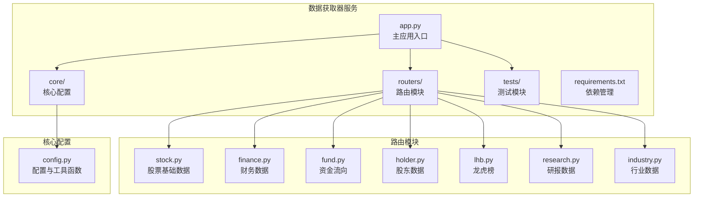
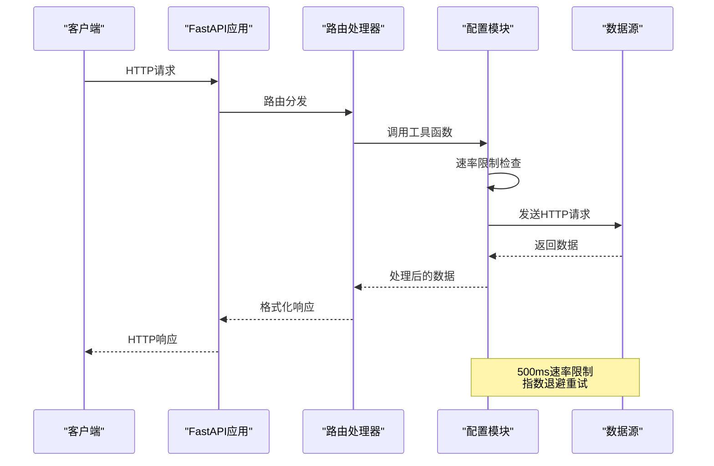
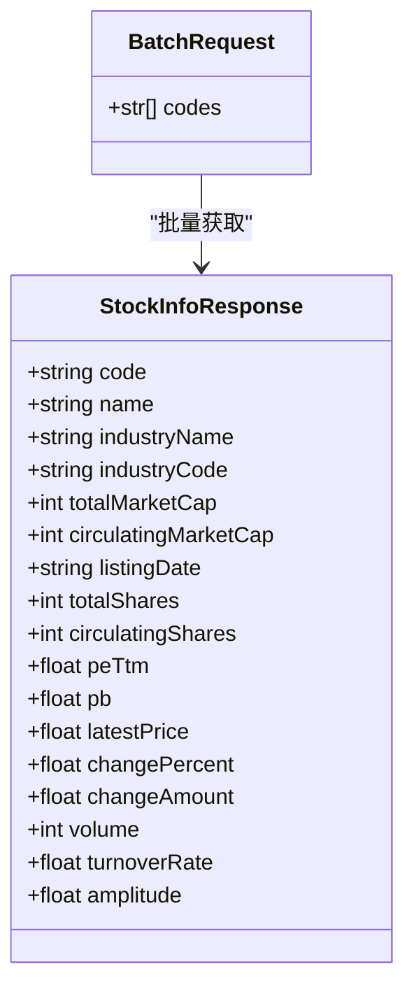
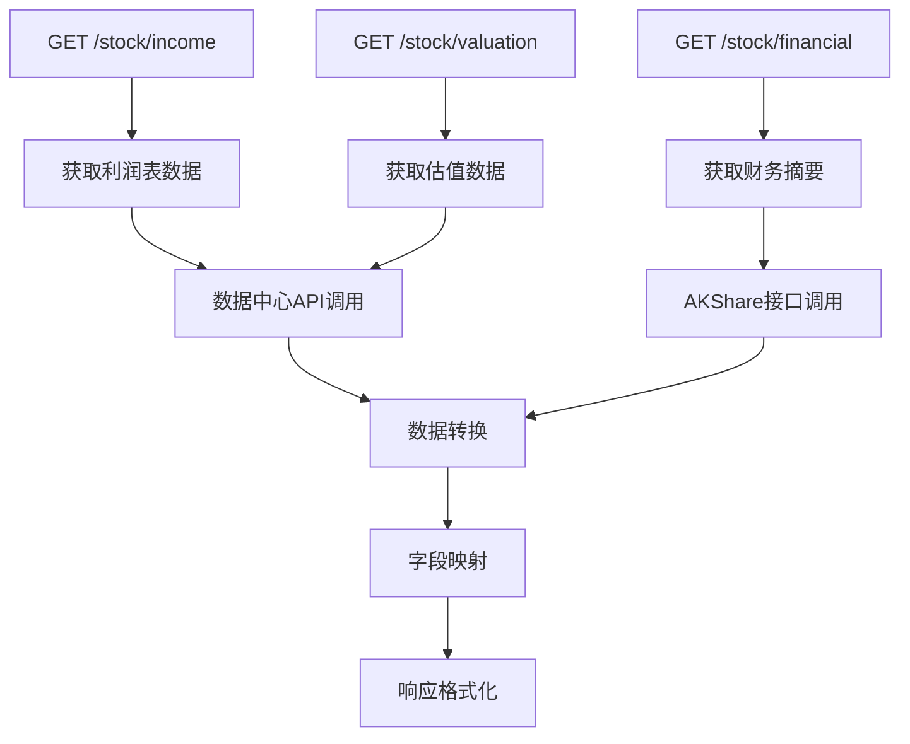
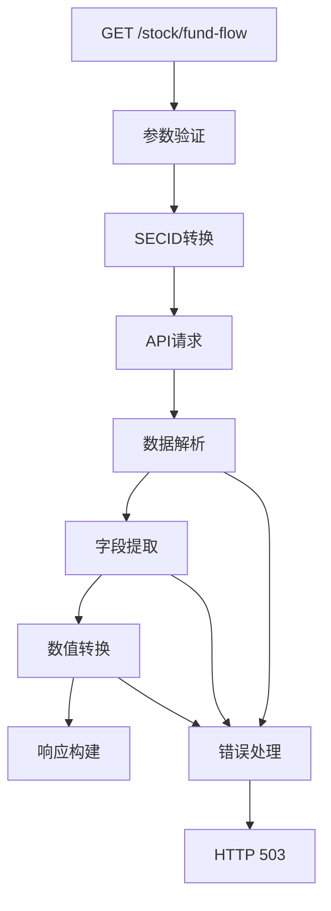
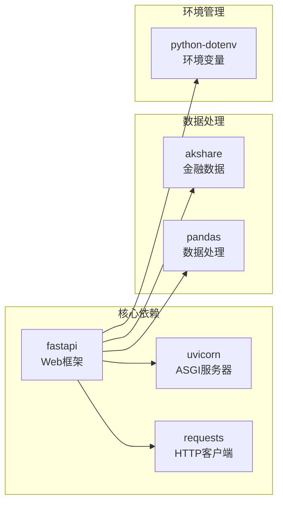
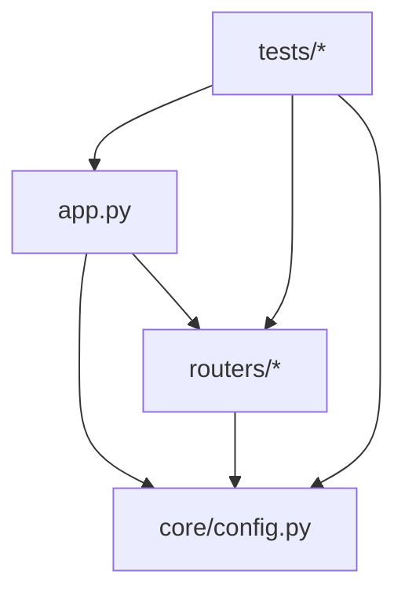
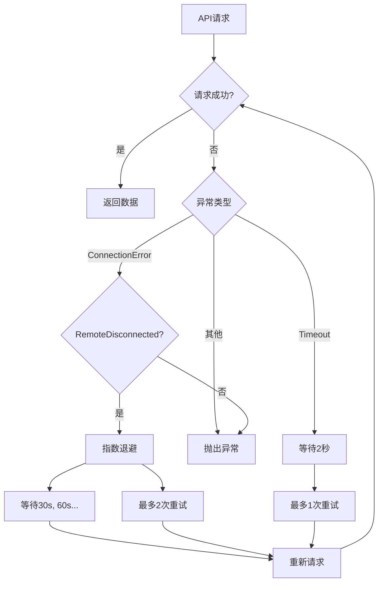

# Python数据获取器规范

<cite>
**本文档引用的文件**
- [app.py](file://data-fetcher/app.py)
- [config.py](file://data-fetcher/core/config.py)
- [stock.py](file://data-fetcher/routers/stock.py)
- [finance.py](file://data-fetcher/routers/finance.py)
- [fund.py](file://data-fetcher/routers/fund.py)
- [test_stock_router.py](file://data-fetcher/tests/test_stock_router.py)
- [test_routers.py](file://data-fetcher/tests/test_routers.py)
- [requirements.txt](file://data-fetcher/requirements.txt)
- [data-fetcher.md](file://system-planner/data-fetcher.md)
- [api-design.md](file://system-planner/api-design.md)
</cite>

## 目录
1. [简介](#简介)
2. [项目结构](#项目结构)
3. [核心组件](#核心组件)
4. [架构概览](#架构概览)
5. [详细组件分析](#详细组件分析)
6. [依赖分析](#依赖分析)
7. [性能考虑](#性能考虑)
8. [故障排除指南](#故障排除指南)
9. [结论](#结论)
10. [附录](#附录)

## 简介

本文档为Python数据获取器项目的代码规范文档，专门针对基于FastAPI构建的微服务制定统一的开发标准。该服务负责从东方财富等数据源获取股票市场数据，为上层Spring Boot应用提供统一的数据入口。

本规范涵盖了代码命名约定、FastAPI路由规范、数据模型规范、错误处理规范、API客户端设计规范、数据转换规范、异步编程规范、pytest测试规范以及代码质量工具配置等方面，确保代码的一致性、可维护性和可靠性。

## 项目结构

数据获取器项目采用清晰的分层架构，主要包含以下核心目录：



**图表来源**
- [app.py:1-31](file://data-fetcher/app.py#L1-L31)
- [config.py:1-121](file://data-fetcher/core/config.py#L1-L121)

**章节来源**
- [app.py:1-31](file://data-fetcher/app.py#L1-L31)
- [requirements.txt:1-7](file://data-fetcher/requirements.txt#L1-L7)

## 核心组件

### 应用入口与中间件

应用入口文件定义了FastAPI实例、CORS中间件配置和路由注册：

- **应用实例**：创建带标题和版本号的FastAPI实例
- **CORS配置**：允许跨域访问，支持所有方法和头部
- **路由注册**：按模块注册各个功能路由，使用标签进行分类
- **健康检查**：提供简单的健康检查端点

### 核心配置模块

配置模块提供了数据获取器的核心功能：

- **HTTP头配置**：必需的User-Agent和Referer头部
- **速率限制**：全局500ms请求间隔，线程安全实现
- **数据转换工具**：
  - `to_secid()`: 股票代码到SECID格式转换
  - `safe_div100()`: 安全除以100处理
  - `safe_float()`: 安全浮点数转换
  - `safe_int()`: 安全整数转换
- **API客户端**：
  - `fetch_json()`: 带速率限制和重试的JSON获取
  - `fetch_datacenter()`: 东方财富数据中心API封装

**章节来源**
- [app.py:5-25](file://data-fetcher/app.py#L5-L25)
- [config.py:8-121](file://data-fetcher/core/config.py#L8-L121)

## 架构概览

数据获取器采用事件驱动的异步架构，结合严格的速率限制和错误处理机制：



**图表来源**
- [app.py:14-20](file://data-fetcher/app.py#L14-L20)
- [config.py:20-100](file://data-fetcher/core/config.py#L20-L100)

## 详细组件分析

### 股票路由模块

股票路由模块提供完整的股票数据获取功能：

#### 函数命名规范
- `get_stock_info()`: 获取股票基本信息
- `get_kline()`: 获取K线数据
- `get_intraday()`: 获取分时数据
- `get_quote()`: 获取实时报价
- `get_quotes_batch()`: 批量获取报价

#### 参数命名规范
- 使用snake_case命名：`code`, `period`, `startDate`, `endDate`, `adjust`
- 查询参数：`code`（必需），其他参数都有合理默认值
- 路径参数：在POST请求中使用Body参数

#### 数据模型规范



**图表来源**
- [stock.py:209-211](file://data-fetcher/routers/stock.py#L209-L211)
- [stock.py:54-72](file://data-fetcher/routers/stock.py#L54-L72)

#### 错误处理规范

路由层使用HTTPException进行错误处理：
- 404错误：股票不存在或数据获取失败
- 503错误：外部数据源不可用
- 异常捕获：使用try-catch包装数据获取操作

**章节来源**
- [stock.py:14-72](file://data-fetcher/routers/stock.py#L14-L72)
- [stock.py:213-246](file://data-fetcher/routers/stock.py#L213-L246)

### 财务路由模块

财务路由模块提供多维度的财务数据分析：

#### 接口设计规范



**图表来源**
- [finance.py:14-40](file://data-fetcher/routers/finance.py#L14-L40)
- [finance.py:43-118](file://data-fetcher/routers/finance.py#L43-L118)
- [finance.py:121-147](file://data-fetcher/routers/finance.py#L121-L147)

#### 数据转换规范

财务数据处理包含复杂的字段映射和数据清洗：
- **日期标准化**：统一YYYY-MM-DD格式
- **字段映射**：中文指标名到英文字段名的转换
- **数值处理**：NaN值和特殊字符串的处理
- **数据结构转换**：横向表格到纵向记录的转换

**章节来源**
- [finance.py:43-118](file://data-fetcher/routers/finance.py#L43-L118)

### 资金流向路由模块

资金流向模块提供主力资金流向分析：

#### 数据处理流程



**图表来源**
- [fund.py:9-49](file://data-fetcher/routers/fund.py#L9-L49)

**章节来源**
- [fund.py:9-49](file://data-fetcher/routers/fund.py#L9-L49)

## 依赖分析

### 外部依赖管理

项目依赖采用明确的版本控制和功能分离：



**图表来源**
- [requirements.txt:1-7](file://data-fetcher/requirements.txt#L1-L7)

### 内部模块依赖



**图表来源**
- [app.py:3](file://data-fetcher/app.py#L3)
- [stock.py:6-9](file://data-fetcher/routers/stock.py#L6-L9)

**章节来源**
- [requirements.txt:1-7](file://data-fetcher/requirements.txt#L1-L7)

## 性能考虑

### 速率限制实现

系统实现了严格的速率限制机制以避免API封禁：

- **全局锁保护**：使用threading.Lock确保线程安全
- **精确计时**：time.time()提供高精度时间戳
- **最小间隔**：500ms的请求间隔，高于某些API要求
- **阻塞等待**：不足间隔时进行sleep等待

### 重试机制设计



**图表来源**
- [config.py:80-100](file://data-fetcher/core/config.py#L80-L100)

### 批量处理优化

- **批量上限**：单轮批量请求不超过20只股票
- **串行处理**：保持500ms间隔，避免并发冲突
- **失败跳过**：单个股票失败不影响整体批量处理

**章节来源**
- [config.py:20-28](file://data-fetcher/core/config.py#L20-L28)
- [config.py:80-100](file://data-fetcher/core/config.py#L80-L100)
- [stock.py:217](file://data-fetcher/routers/stock.py#L217)

## 故障排除指南

### 常见错误类型

| 错误类型 | HTTP状态码 | 触发条件 | 解决方案 |
|---------|-----------|----------|----------|
| 股票不存在 | 404 | 数据源无返回或空数据 | 验证股票代码格式 |
| 数据源不可用 | 503 | 外部API连接失败 | 检查网络连接和API可用性 |
| 参数错误 | 400 | 请求参数验证失败 | 检查参数格式和范围 |
| 速率限制 | 429 | 请求过于频繁 | 等待500ms间隔 |

### 调试技巧

1. **启用详细日志**：在开发环境中增加日志级别
2. **模拟外部服务**：使用unittest.mock进行接口模拟
3. **监控API响应**：检查HTTP状态码和响应时间
4. **验证数据格式**：确保返回数据符合预期结构

**章节来源**
- [test_stock_router.py:35-63](file://data-fetcher/tests/test_stock_router.py#L35-L63)
- [test_routers.py:11-34](file://data-fetcher/tests/test_routers.py#L11-L34)

## 结论

本Python数据获取器项目遵循了严格的代码规范和最佳实践，建立了可靠的微服务架构。通过统一的命名约定、完善的错误处理机制、严格的速率限制和全面的测试覆盖，确保了服务的稳定性、可维护性和扩展性。

项目的核心优势包括：
- 清晰的分层架构和职责分离
- 严格的代码规范和一致性
- 完善的错误处理和重试机制
- 全面的单元测试覆盖
- 明确的性能考虑和优化策略

这些规范为后续的功能扩展和维护奠定了坚实的基础。

## 附录

### 代码质量工具配置

#### Black格式化配置
```python
# black配置示例
{
    "line-length": 88,
    "target-version": ["py38"],
    "extend-exclude": "generated/"
}
```

#### Flake8检查配置
```python
# flake8配置示例
{
    "max-line-length": 88,
    "ignore": ["E203", "W503"],
    "exclude": ["__pycache__", "*.egg-info"]
}
```

#### mypy类型检查配置
```python
# mypy配置示例
{
    "python_version": "3.8",
    "warn_return_any": true,
    "warn_unused_configs": true,
    "files": ["data-fetcher"],
    "exclude": ["tests/", "venv/"]
}
```

### API客户端设计最佳实践

#### requests库使用规范
- **超时设置**：统一设置15秒超时
- **重试机制**：指数退避重试策略
- **错误处理**：区分不同类型的异常
- **连接池**：复用HTTP连接减少开销

#### 数据转换最佳实践
- **数值处理**：使用safe_*函数进行安全转换
- **格式转换**：统一日期和数值格式
- **数据清洗**：处理None值和异常数据
- **精度控制**：合理控制浮点数精度

#### 异步编程规范
- **async/await**：在I/O密集型操作中使用
- **并发控制**：避免过度并发导致API封禁
- **资源管理**：正确管理HTTP连接和数据库连接
- **错误传播**：确保异常正确传播到调用方