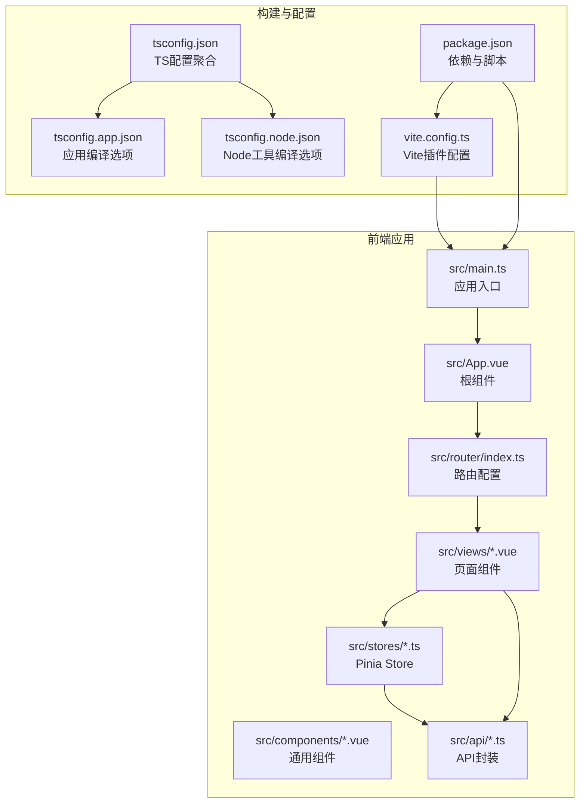
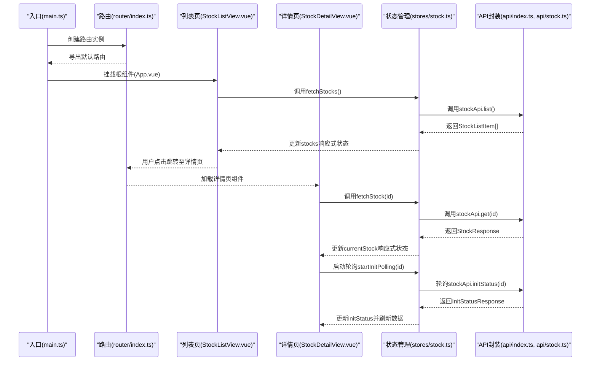
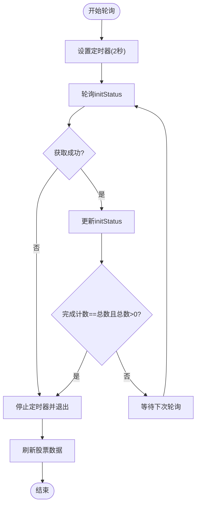
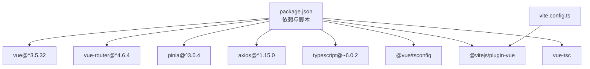

# TypeScript前端代码规范

<cite>
**本文档引用的文件**
- [package.json](file://frontend/package.json)
- [tsconfig.json](file://frontend/tsconfig.json)
- [tsconfig.app.json](file://frontend/tsconfig.app.json)
- [tsconfig.node.json](file://frontend/tsconfig.node.json)
- [vite.config.ts](file://frontend/vite.config.ts)
- [main.ts](file://frontend/src/main.ts)
- [App.vue](file://frontend/src/App.vue)
- [router/index.ts](file://frontend/src/router/index.ts)
- [stores/stock.ts](file://frontend/src/stores/stock.ts)
- [api/index.ts](file://frontend/src/api/index.ts)
- [api/stock.ts](file://frontend/src/api/stock.ts)
- [views/StockListView.vue](file://frontend/src/views/StockListView.vue)
- [views/StockDetailView.vue](file://frontend/src/views/StockDetailView.vue)
- [views/tabs/OverviewTab.vue](file://frontend/src/views/tabs/OverviewTab.vue)
</cite>

## 目录
1. [引言](#引言)
2. [项目结构](#项目结构)
3. [核心组件](#核心组件)
4. [架构概览](#架构概览)
5. [详细组件分析](#详细组件分析)
6. [依赖分析](#依赖分析)
7. [性能考虑](#性能考虑)
8. [故障排除指南](#故障排除指南)
9. [结论](#结论)
10. [附录](#附录)

## 引言

本规范文档为Vue 3 + TypeScript项目的代码编写指南，涵盖组件命名、属性命名、方法命名、常量命名等基础规范；TypeScript类型定义规范（接口命名使用I前缀）；组件结构规范（setup()语法、响应式数据管理、组合式API使用）；状态管理规范（Pinia store设计、action命名、state结构）；Vue组件最佳实践（props验证、事件发射、生命周期使用）；API调用规范（axios封装、请求拦截、响应处理）；错误处理规范（try-catch使用、错误边界、用户友好的错误提示）以及ESLint配置建议、Prettier格式化设置、TypeScript编译选项配置。

本规范以仓库中的实际实现为基础，结合Vue 3生态的最佳实践，提供可操作的指导原则与示例路径，帮助团队建立一致、可维护、可扩展的前端代码风格。

## 项目结构

前端项目采用Vite + Vue 3 + TypeScript的标准工程化结构，主要目录与职责如下：

- src/api：统一的API封装层，基于axios进行HTTP请求与拦截器配置
- src/stores：Pinia状态管理模块，集中管理应用状态与业务逻辑
- src/views：页面级组件，负责路由视图渲染与页面交互
- src/components：通用UI组件（示例：HelloWorld.vue）
- src/router：路由配置，支持动态导入与嵌套路由
- 配置文件：package.json、tsconfig.*.json、vite.config.ts

**图表来源**
- [main.ts:1-11](file://frontend/src/main.ts#L1-L11)
- [App.vue:1-4](file://frontend/src/App.vue#L1-L4)
- [router/index.ts:1-28](file://frontend/src/router/index.ts#L1-L28)
- [stores/stock.ts:1-80](file://frontend/src/stores/stock.ts#L1-L80)
- [api/index.ts:1-18](file://frontend/src/api/index.ts#L1-L18)
- [vite.config.ts:1-8](file://frontend/vite.config.ts#L1-L8)
- [tsconfig.json:1-8](file://frontend/tsconfig.json#L1-L8)
- [tsconfig.app.json:1-15](file://frontend/tsconfig.app.json#L1-L15)
- [tsconfig.node.json:1-25](file://frontend/tsconfig.node.json#L1-L25)
- [package.json:1-27](file://frontend/package.json#L1-L27)

**章节来源**
- [package.json:1-27](file://frontend/package.json#L1-L27)
- [tsconfig.json:1-8](file://frontend/tsconfig.json#L1-L8)
- [vite.config.ts:1-8](file://frontend/vite.config.ts#L1-L8)
- [main.ts:1-11](file://frontend/src/main.ts#L1-L11)
- [App.vue:1-4](file://frontend/src/App.vue#L1-L4)
- [router/index.ts:1-28](file://frontend/src/router/index.ts#L1-L28)

## 核心组件

本节总结项目中体现的关键代码规范与最佳实践，便于快速对照与执行。

- 组件命名规范
  - 页面组件使用PascalCase，如StockListView.vue
  - 通用组件使用PascalCase，如HelloWorld.vue
  - 命名应语义明确，避免缩写，优先使用名词短语

- 属性命名规范
  - props使用camelCase，如stockCode
  - 内部变量使用camelCase，如isLoading、errorMessage
  - 禁止使用下划线或横线连接

- 方法命名规范
  - 事件处理器使用动词短语，如handleAdd、handleChange
  - 异步方法使用动词+名词，如fetchStockData、deleteStock
  - 私有方法以下划线前缀，如_handleError()

- 常量命名规范
  - 全局常量使用UPPER_SNAKE_CASE，如MAX_STOCK_COUNT
  - 枚举值使用UPPER_SNAKE_CASE，如INIT_STATUS.PENDING

- TypeScript类型定义规范
  - 接口命名使用I前缀，如IStockInfo
  - 类型导出时保持与文件名一致，便于查找
  - 使用联合类型与字面量类型提升类型安全

- 组件结构规范
  - 使用<script setup>语法，减少样板代码
  - 响应式数据通过ref或reactive声明，避免直接修改
  - 组合式API优先使用onMounted、onUnmounted等生命周期钩子
  - 将副作用逻辑封装为函数，提高复用性

- 状态管理规范（Pinia）
  - 使用defineStore定义store，返回响应式状态与action
  - state结构清晰，避免深层嵌套
  - action内部使用try-catch处理异步错误
  - 使用storeToRefs解构响应式引用，避免丢失响应性

- API调用规范
  - axios实例集中配置baseURL与超时时间
  - 在响应拦截器中统一处理错误日志与错误传播
  - 对外暴露typed API对象，如stockApi
  - 请求参数与返回值使用明确的接口类型

- 错误处理规范
  - 组件内使用try-catch包裹异步操作
  - 提供用户友好的错误提示，避免显示原始错误信息
  - 在finally块中重置加载状态，确保界面一致性

**章节来源**
- [views/StockListView.vue:50-102](file://frontend/src/views/StockListView.vue#L50-L102)
- [views/StockDetailView.vue:47-82](file://frontend/src/views/StockDetailView.vue#L47-L82)
- [stores/stock.ts:1-80](file://frontend/src/stores/stock.ts#L1-L80)
- [api/stock.ts:1-61](file://frontend/src/api/stock.ts#L1-L61)
- [api/index.ts:1-18](file://frontend/src/api/index.ts#L1-L18)

## 架构概览

下图展示了从入口到页面组件的数据流与交互关系，体现了组件、路由、状态管理与API层之间的协作模式。

**图表来源**
- [main.ts:1-11](file://frontend/src/main.ts#L1-L11)
- [router/index.ts:1-28](file://frontend/src/router/index.ts#L1-L28)
- [views/StockListView.vue:50-102](file://frontend/src/views/StockListView.vue#L50-L102)
- [views/StockDetailView.vue:47-82](file://frontend/src/views/StockDetailView.vue#L47-L82)
- [stores/stock.ts:1-80](file://frontend/src/stores/stock.ts#L1-L80)
- [api/index.ts:1-18](file://frontend/src/api/index.ts#L1-L18)
- [api/stock.ts:1-61](file://frontend/src/api/stock.ts#L1-L61)

## 详细组件分析

### 组件命名与结构规范

- 页面组件命名
  - StockListView.vue：使用PascalCase，语义明确
  - StockDetailView.vue：使用PascalCase，体现页面职责
  - OverviewTab.vue：使用PascalCase，作为子页面组件

- 结构规范
  - 使用<script setup>简化组件声明
  - 响应式数据通过ref声明，如stocks、loading、newCode
  - 生命周期钩子在onMounted中触发数据加载
  - 事件处理器分离为独立函数，便于测试与复用

- 反例参考
  - 避免使用下划线或横线命名组件文件
  - 避免在模板中直接修改响应式状态，应通过事件处理器间接更新

**章节来源**
- [views/StockListView.vue:50-102](file://frontend/src/views/StockListView.vue#L50-L102)
- [views/StockDetailView.vue:47-82](file://frontend/src/views/StockDetailView.vue#L47-L82)
- [views/tabs/OverviewTab.vue:45-86](file://frontend/src/views/tabs/OverviewTab.vue#L45-L86)

### 属性与方法命名规范

- 属性命名
  - props：camelCase，如stockCode
  - 内部变量：camelCase，如isLoading、errorMessage
  - 常量：UPPER_SNAKE_CASE，如MAX_STOCK_COUNT

- 方法命名
  - 事件处理器：handleXxx，如handleAdd、handleDelete
  - 异步方法：动词+名词，如fetchStockData、deleteStock
  - 私有方法：_xxx，如_handleError()

- 反例参考
  - 避免使用全大写或全小写命名属性
  - 避免使用缩写，除非是广泛接受的缩写（如id、url）

**章节来源**
- [views/StockListView.vue:64-80](file://frontend/src/views/StockListView.vue#L64-L80)
- [stores/stock.ts:12-36](file://frontend/src/stores/stock.ts#L12-L36)

### TypeScript类型定义规范

- 接口命名
  - 使用I前缀，如IStockInfo
  - 类型导出与文件名保持一致，便于查找

- 类型使用
  - 对外暴露的API使用明确的接口类型，如StockListItem、StockResponse
  - 联合类型与字面量类型用于枚举值，如StepStatus.status

- 反例参考
  - 避免使用any或unknown替代具体类型
  - 避免在类型定义中使用下划线或横线

**章节来源**
- [api/stock.ts:3-61](file://frontend/src/api/stock.ts#L3-L61)

### Pinia状态管理规范

- Store设计
  - 使用defineStore定义store，返回响应式状态与action
  - state结构清晰，避免深层嵌套
  - action内部使用try-catch处理异步错误

- 响应式数据管理
  - 使用ref声明响应式状态，如stocks、currentStock、loading
  - 使用storeToRefs解构响应式引用，避免丢失响应性

- 轮询机制
  - startInitPolling与stopInitPolling成对出现
  - 轮询中捕获异常并停止定时器，防止内存泄漏

**图表来源**
- [stores/stock.ts:43-65](file://frontend/src/stores/stock.ts#L43-L65)

**章节来源**
- [stores/stock.ts:1-80](file://frontend/src/stores/stock.ts#L1-L80)

### Vue组件最佳实践

- props验证
  - 使用TypeScript接口约束props类型
  - 对可选属性使用联合类型，如string | null

- 事件发射
  - 使用emit传递事件与数据，遵循camelCase命名
  - 在模板中通过@事件绑定处理器

- 生命周期使用
  - 在onMounted中发起数据加载
  - 在onUnmounted中清理定时器与订阅
  - 使用watch监听状态变化并触发副作用

- 反例参考
  - 避免在模板中直接调用方法，应通过事件处理器间接调用
  - 避免在组件销毁后继续使用定时器或订阅

**章节来源**
- [views/StockDetailView.vue:47-82](file://frontend/src/views/StockDetailView.vue#L47-L82)
- [views/tabs/OverviewTab.vue:45-86](file://frontend/src/views/tabs/OverviewTab.vue#L45-L86)

### API调用规范

- axios封装
  - 创建axios实例，设置baseURL与timeout
  - 在响应拦截器中统一记录错误日志并抛出错误

- 请求拦截
  - 可在请求拦截器中添加认证头或签名
  - 对请求参数进行校验与转换

- 响应处理
  - 对响应数据进行类型断言与校验
  - 在组件中使用try-catch处理异步错误

- 反例参考
  - 避免在多个地方重复配置axios实例
  - 避免在组件中直接处理HTTP错误，应通过拦截器统一处理

**章节来源**
- [api/index.ts:1-18](file://frontend/src/api/index.ts#L1-L18)
- [api/stock.ts:53-61](file://frontend/src/api/stock.ts#L53-L61)

### 错误处理规范

- try-catch使用
  - 在异步操作中使用try-catch捕获错误
  - 在finally块中重置加载状态，确保界面一致性

- 错误边界
  - 在组件顶层使用try-catch包裹可能失败的操作
  - 对用户不可见的错误进行日志记录，向用户提供友好提示

- 用户友好的错误提示
  - 显示简明易懂的错误信息
  - 避免暴露技术细节给最终用户

- 反例参考
  - 避免吞掉异常而不做任何处理
  - 避免在控制台输出敏感信息

**章节来源**
- [views/StockListView.vue:64-80](file://frontend/src/views/StockListView.vue#L64-L80)
- [views/tabs/OverviewTab.vue:58-64](file://frontend/src/views/tabs/OverviewTab.vue#L58-L64)

## 依赖分析

项目依赖与配置关系如下：

- 运行时依赖
  - vue：框架核心
  - pinia：状态管理
  - vue-router：路由管理
  - axios：HTTP客户端

- 开发依赖
  - typescript、@vue/tsconfig：TypeScript配置
  - vite、@vitejs/plugin-vue：构建工具
  - vue-tsc：类型检查

**图表来源**
- [package.json:11-25](file://frontend/package.json#L11-L25)
- [vite.config.ts:1-8](file://frontend/vite.config.ts#L1-L8)

**章节来源**
- [package.json:1-27](file://frontend/package.json#L1-L27)
- [vite.config.ts:1-8](file://frontend/vite.config.ts#L1-L8)

## 性能考虑

- 组件懒加载
  - 路由按需加载页面组件，减少首屏体积
  - 使用动态import优化打包体积

- 响应式数据最小化
  - 仅在需要时更新响应式状态
  - 使用storeToRefs避免不必要的响应式包装

- 轮询优化
  - 合理设置轮询间隔，避免频繁请求
  - 在组件卸载时及时停止轮询

- 编译优化
  - 启用TypeScript严格模式与未使用变量检查
  - 使用bundler模式与模块检测提升构建性能

**章节来源**
- [router/index.ts:9,14,16,18,20:9-22](file://frontend/src/router/index.ts#L9-L22)
- [stores/stock.ts:43-65](file://frontend/src/stores/stock.ts#L43-L65)
- [tsconfig.app.json:8-11](file://frontend/tsconfig.app.json#L8-L11)
- [tsconfig.node.json:10-15](file://frontend/tsconfig.node.json#L10-L15)

## 故障排除指南

- 常见问题与解决方案
  - 路由无法加载：检查动态import路径是否正确
  - 状态不更新：确认使用storeToRefs解构响应式引用
  - 轮询不停止：在onUnmounted中调用stopInitPolling
  - API错误：查看响应拦截器日志，确认错误信息

- 调试建议
  - 在开发环境中开启严格模式，利用TypeScript类型检查
  - 使用浏览器开发者工具监控网络请求与状态变更
  - 在组件中添加必要的日志输出，定位问题范围

**章节来源**
- [views/StockDetailView.vue:67-69](file://frontend/src/views/StockDetailView.vue#L67-L69)
- [stores/stock.ts:60-65](file://frontend/src/stores/stock.ts#L60-L65)
- [api/index.ts:9-15](file://frontend/src/api/index.ts#L9-L15)

## 结论

本规范文档基于项目现有实现，总结了Vue 3 + TypeScript项目的代码规范与最佳实践。通过统一的命名约定、类型定义规范、组件结构与状态管理模式、API调用与错误处理策略，能够有效提升代码质量与可维护性。建议团队在日常开发中严格遵循本规范，并根据项目演进持续优化与完善。

## 附录

### ESLint配置建议

- 规则建议
  - no-undef：禁止未声明变量
  - no-unused-vars：禁止未使用变量
  - no-console：禁止console语句
  - camelcase：强制驼峰命名
  - no-trailing-spaces：禁止行尾空格

- 插件建议
  - @typescript-eslint/eslint-plugin：TypeScript规则
  - eslint-plugin-vue：Vue相关规则

### Prettier格式化设置

- 规则建议
  - semi：分号
  - singleQuote：单引号
  - trailingComma：尾随逗号
  - printWidth：每行最大宽度
  - tabWidth：制表符宽度

### TypeScript编译选项配置

- 应用编译选项（tsconfig.app.json）
  - strict：启用严格模式
  - noUnusedLocals：未使用局部变量报错
  - noUnusedParameters：未使用参数报错
  - noFallthroughCasesInSwitch：switch遗漏case报错
  - esModuleInterop：兼容ES模块

- Node工具编译选项（tsconfig.node.json）
  - moduleResolution：bundler
  - verbatimModuleSyntax：严格模块语法
  - noEmit：不生成输出文件

**章节来源**
- [tsconfig.app.json:3-11](file://frontend/tsconfig.app.json#L3-L11)
- [tsconfig.node.json:2-21](file://frontend/tsconfig.node.json#L2-L21)