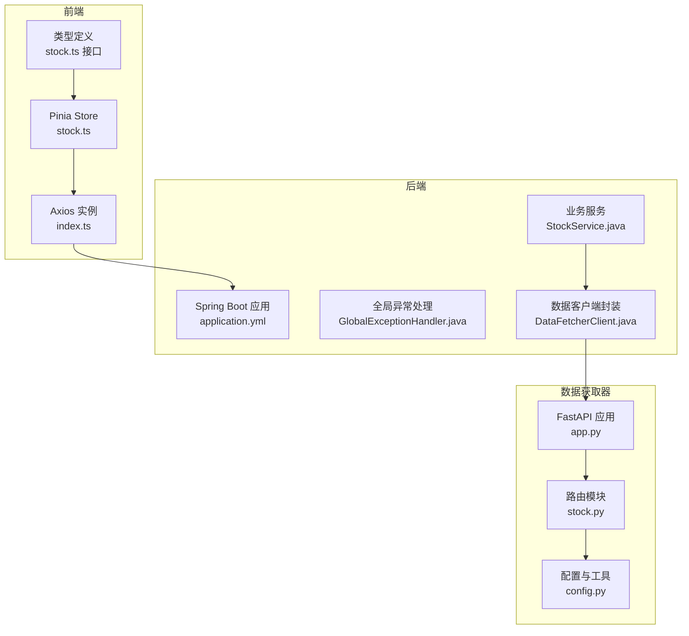
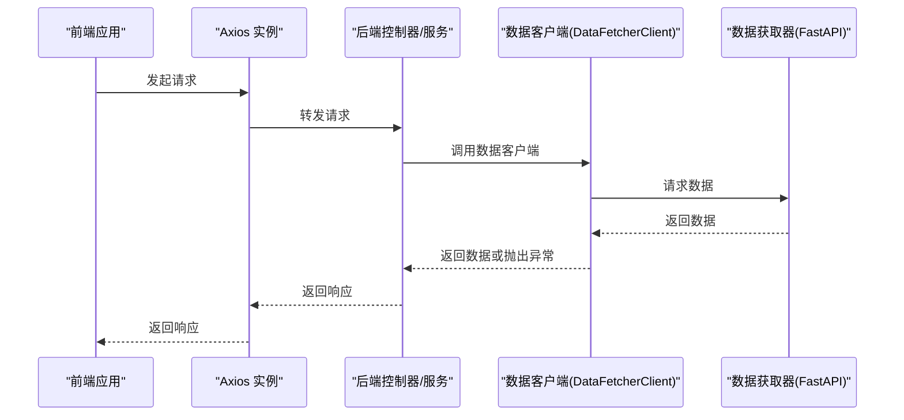
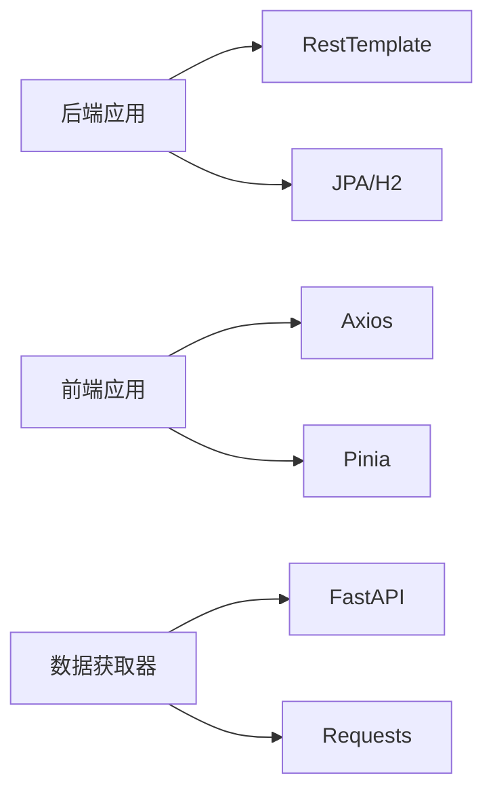

# 代码规范

<cite>
**本文引用的文件**
- [DataFetcherClient.java](file://backend/src/main/java/com/stock/client/DataFetcherClient.java)
- [GlobalExceptionHandler.java](file://backend/src/main/java/com/stock/exception/GlobalExceptionHandler.java)
- [HtmlSanitizer.java](file://backend/src/main/java/com/stock/util/HtmlSanitizer.java)
- [StockService.java](file://backend/src/main/java/com/stock/service/StockService.java)
- [application.yml](file://backend/src/main/resources/application.yml)
- [StockControllerTest.java](file://backend/src/test/java/com/stock/controller/StockControllerTest.java)
- [app.py](file://data-fetcher/app.py)
- [config.py](file://data-fetcher/core/config.py)
- [stock.py](file://data-fetcher/routers/stock.py)
- [requirements.txt](file://data-fetcher/requirements.txt)
- [index.ts](file://frontend/src/api/index.ts)
- [stock.ts](file://frontend/src/stores/stock.ts)
- [stock.ts](file://frontend/src/api/stock.ts)
- [package.json](file://frontend/package.json)
- [vite.config.ts](file://frontend/vite.config.ts)
</cite>

## 目录
1. 引言
2. 项目结构
3. 核心组件
4. 架构总览
5. 详细组件分析
6. 依赖分析
7. 性能考虑
8. 故障排查指南
9. 结论
10. 附录

## 引言
本规范文档面向多语言混合的股票交易系统，覆盖后端 Java、前端 TypeScript/Vue、数据获取器 Python 的代码规范与最佳实践。内容包括命名约定、注释规范、异常处理、日志记录、前端组件与状态管理、API 调用、Python 数据获取器函数与参数、错误处理策略、性能优化建议、安全编码要求，以及 IDE 配置、代码格式化与静态分析工具的落地建议。

## 项目结构
系统由三部分组成：
- 后端 Spring Boot 应用：提供 REST API、异常统一处理、定时任务、数据访问层与服务层。
- 前端 Vue 3 + Pinia 应用：通过 Axios 统一请求与拦截错误；使用 Vite 构建。
- 数据获取器 FastAPI 应用：对接第三方行情与财务数据源，提供健康检查与多路由接口。

图表来源
- [application.yml:1-28](file://backend/src/main/resources/application.yml#L1-L28)
- [index.ts:1-18](file://frontend/src/api/index.ts#L1-L18)
- [stock.ts:1-80](file://frontend/src/stores/stock.ts#L1-L80)
- [stock.ts:1-61](file://frontend/src/api/stock.ts#L1-L61)
- [GlobalExceptionHandler.java:1-33](file://backend/src/main/java/com/stock/exception/GlobalExceptionHandler.java#L1-L33)
- [DataFetcherClient.java:1-126](file://backend/src/main/java/com/stock/client/DataFetcherClient.java#L1-L126)
- [StockService.java:1-243](file://backend/src/main/java/com/stock/service/StockService.java#L1-L243)
- [app.py:1-31](file://data-fetcher/app.py#L1-L31)
- [stock.py:1-246](file://data-fetcher/routers/stock.py#L1-L246)
- [config.py:1-121](file://data-fetcher/core/config.py#L1-L121)

章节来源
- [application.yml:1-28](file://backend/src/main/resources/application.yml#L1-L28)
- [index.ts:1-18](file://frontend/src/api/index.ts#L1-L18)
- [stock.ts:1-80](file://frontend/src/stores/stock.ts#L1-L80)
- [stock.ts:1-61](file://frontend/src/api/stock.ts#L1-L61)
- [GlobalExceptionHandler.java:1-33](file://backend/src/main/java/com/stock/exception/GlobalExceptionHandler.java#L1-L33)
- [DataFetcherClient.java:1-126](file://backend/src/main/java/com/stock/client/DataFetcherClient.java#L1-L126)
- [StockService.java:1-243](file://backend/src/main/java/com/stock/service/StockService.java#L1-L243)
- [app.py:1-31](file://data-fetcher/app.py#L1-L31)
- [stock.py:1-246](file://data-fetcher/routers/stock.py#L1-L246)
- [config.py:1-121](file://data-fetcher/core/config.py#L1-L121)

## 核心组件
- 后端异常处理：集中处理业务异常与校验异常，返回标准化错误响应。
- 数据客户端封装：对数据获取器进行统一封装，统一异常转换与空值校验。
- 业务服务：事务边界内的核心逻辑，包含输入校验、调用数据客户端、触发异步初始化等。
- 前端 API 封装：Axios 实例与响应拦截器，统一错误日志输出。
- 前端状态管理：Pinia Store 管理列表、详情、初始化状态轮询。
- 数据获取器：FastAPI 路由聚合，统一跨域配置与健康检查。

章节来源
- [GlobalExceptionHandler.java:1-33](file://backend/src/main/java/com/stock/exception/GlobalExceptionHandler.java#L1-L33)
- [DataFetcherClient.java:1-126](file://backend/src/main/java/com/stock/client/DataFetcherClient.java#L1-L126)
- [StockService.java:1-243](file://backend/src/main/java/com/stock/service/StockService.java#L1-L243)
- [index.ts:1-18](file://frontend/src/api/index.ts#L1-L18)
- [stock.ts:1-80](file://frontend/src/stores/stock.ts#L1-L80)
- [app.py:1-31](file://data-fetcher/app.py#L1-L31)

## 架构总览
后端通过 DataFetcherClient 调用数据获取器，数据获取器再对接第三方数据源。前端通过 Axios 访问后端 API，Pinia Store 管理状态与轮询。

图表来源
- [index.ts:1-18](file://frontend/src/api/index.ts#L1-L18)
- [DataFetcherClient.java:1-126](file://backend/src/main/java/com/stock/client/DataFetcherClient.java#L1-L126)
- [app.py:1-31](file://data-fetcher/app.py#L1-L31)

## 详细组件分析

### Java 后端代码规范

- 命名约定
  - 包名全小写，类名采用帕斯卡命名法，方法与字段采用驼峰命名法。
  - 控制器、服务、仓库、DTO、实体分别位于 controller、service、repository、dto、entity 包中，职责清晰。
  - 异常类以异常语义命名，如 DataFetchException、InvalidStockCodeException。

- 注释规范
  - 公共 API 方法与复杂逻辑应有简要注释说明用途、参数与返回值。
  - 关键流程注释用于解释事务同步回调注册与异步初始化时机。

- 异常处理
  - 使用统一的 @ControllerAdvice 捕获业务异常与校验异常，返回标准化错误响应体。
  - 对外部数据获取失败进行包装，便于前端识别与提示。

- 日志记录
  - 使用 SLF4J 注解记录关键事件与警告，如初始化前后的事务回调日志、估值数据获取失败的日志。

- 安全编码
  - 对用户输入进行严格校验（如股票代码格式），避免非法字符进入下游。
  - 对富文本输入使用 HTML 清洗工具，限制允许标签集合，防止 XSS。

- 性能优化
  - 批量查询时对数量进行上限控制（例如批量报价最多 20 只）。
  - 使用事务同步机制在提交后触发异步初始化，确保并发一致性。

- 测试与验证
  - 单元测试覆盖常见场景（列表、新增、详情、删除、初始化状态）与状态码断言。

章节来源
- [GlobalExceptionHandler.java:1-33](file://backend/src/main/java/com/stock/exception/GlobalExceptionHandler.java#L1-L33)
- [DataFetcherClient.java:1-126](file://backend/src/main/java/com/stock/client/DataFetcherClient.java#L1-L126)
- [StockService.java:1-243](file://backend/src/main/java/com/stock/service/StockService.java#L1-L243)
- [HtmlSanitizer.java:1-15](file://backend/src/main/java/com/stock/util/HtmlSanitizer.java#L1-L15)
- [StockControllerTest.java:1-116](file://backend/src/test/java/com/stock/controller/StockControllerTest.java#L1-L116)

### TypeScript 前端代码规范

- Vue 组件规范
  - 使用 Composition API 与 <script setup> 语法，保持简洁与可读性。
  - 组件内状态使用 ref 或 reactive，避免在模板外直接修改。
  - 事件与副作用集中在方法内部，避免在模板表达式中执行副作用。

- 状态管理规范
  - 使用 Pinia defineStore 管理全局状态，导出只读状态与可变状态。
  - 初始化轮询使用定时器，注意在组件卸载或异常时清理定时器，避免内存泄漏。

- API 调用规范
  - Axios 实例集中配置 baseURL 与超时时间，统一拦截器处理错误日志。
  - 类型定义与接口分离，保证前后端契约一致。

- 错误处理
  - 在响应拦截器中打印错误信息并透传错误，便于上层统一处理。
  - Store 中的异步方法使用 try/finally 或 try/catch 确保 loading 状态正确恢复。

- 性能优化
  - 避免不必要的响应式更新，合理拆分组件与状态粒度。
  - 轮询频率与超时时间需平衡实时性与资源消耗。

章节来源
- [index.ts:1-18](file://frontend/src/api/index.ts#L1-L18)
- [stock.ts:1-80](file://frontend/src/stores/stock.ts#L1-L80)
- [stock.ts:1-61](file://frontend/src/api/stock.ts#L1-L61)
- [package.json:1-27](file://frontend/package.json#L1-L27)
- [vite.config.ts:1-8](file://frontend/vite.config.ts#L1-L8)

### Python 数据获取器规范

- 函数命名与参数传递
  - 工具函数采用下划线命名法，参数类型与返回值明确，必要时提供默认值。
  - 路由函数参数来自查询字符串或请求体，使用 Pydantic 模型约束请求体。

- 错误处理
  - 对第三方接口异常进行捕获并转换为 HTTP 异常，返回标准状态码与错误信息。
  - 对缺失数据或解析失败的情况返回 404 或 503，便于前端区分。

- 安全与合规
  - 设置必要的请求头（含 Referer），遵守目标站点的访问规则。
  - 使用速率限制与指数退避重试，避免触发风控。

- 性能与稳定性
  - 对批量请求进行数量限制（如批量报价最多 20 只）。
  - 提供健康检查端点，便于运维监控。

章节来源
- [app.py:1-31](file://data-fetcher/app.py#L1-L31)
- [stock.py:1-246](file://data-fetcher/routers/stock.py#L1-L246)
- [config.py:1-121](file://data-fetcher/core/config.py#L1-L121)
- [requirements.txt:1-7](file://data-fetcher/requirements.txt#L1-L7)

## 依赖分析
- 后端依赖
  - Spring Boot、JPA/H2、RestTemplate、Lombok、SLF4J。
  - 配置文件中定义数据源、JPA 属性与调度 Cron 表达式。

- 前端依赖
  - Vue 3、Pinia、Axios、Vue Router、Vite、TypeScript。

- 数据获取器依赖
  - FastAPI、Uvicorn、AkShare、Pandas、Requests、python-dotenv。

图表来源
- [application.yml:1-28](file://backend/src/main/resources/application.yml#L1-L28)
- [package.json:1-27](file://frontend/package.json#L1-L27)
- [requirements.txt:1-7](file://data-fetcher/requirements.txt#L1-L7)

章节来源
- [application.yml:1-28](file://backend/src/main/resources/application.yml#L1-L28)
- [package.json:1-27](file://frontend/package.json#L1-L27)
- [requirements.txt:1-7](file://data-fetcher/requirements.txt#L1-L7)

## 性能考虑
- 后端
  - 事务提交后再触发异步初始化，避免并发读取未落盘数据。
  - 对批量查询设置上限，减少一次性 IO 压力。
  - 使用 SLF4J 记录关键路径耗时与异常，便于定位瓶颈。

- 前端
  - 合理设置轮询间隔与超时时间，避免频繁请求。
  - 使用响应拦截器统一处理错误，减少重复逻辑。

- 数据获取器
  - 速率限制与重试策略降低被限流风险。
  - 健康检查端点与日志输出便于问题快速定位。

## 故障排查指南
- 后端
  - 全局异常处理器会将业务异常映射为标准 HTTP 状态码与错误消息，优先检查异常映射是否符合预期。
  - 数据客户端对空结果抛出特定异常，确认上游数据源可用性与网络连通性。

- 前端
  - 响应拦截器会打印错误详情，结合浏览器 Network 面板定位具体接口与状态码。
  - Store 中的轮询需在组件卸载时清理，避免悬挂请求与内存泄漏。

- 数据获取器
  - 健康检查端点用于快速判断服务可用性。
  - 路由函数对缺失数据返回 404，对网络异常返回 503，便于前端区分处理。

章节来源
- [GlobalExceptionHandler.java:1-33](file://backend/src/main/java/com/stock/exception/GlobalExceptionHandler.java#L1-L33)
- [DataFetcherClient.java:1-126](file://backend/src/main/java/com/stock/client/DataFetcherClient.java#L1-L126)
- [index.ts:1-18](file://frontend/src/api/index.ts#L1-L18)
- [stock.ts:1-80](file://frontend/src/stores/stock.ts#L1-L80)
- [app.py:23-25](file://data-fetcher/app.py#L23-L25)

## 结论
本规范文档基于现有代码库提炼了多语言开发的关键实践：后端通过统一异常与日志、严格的输入校验与事务边界保障稳定性；前端通过 Axios 封装与 Pinia 管理状态提升可维护性；数据获取器通过速率限制与健康检查确保对外部接口的稳健接入。建议在后续迭代中持续完善静态分析与自动化测试，以进一步提升质量与交付效率。

## 附录

### IDE 与工具配置建议
- Java
  - 使用 Lombok 注解简化 POJO，开启注解处理器。
  - 使用 SpotBugs/Checkstyle/PMD 进行静态分析，结合 Maven 插件在 CI 中强制执行。
  - 使用 Spring Boot DevTools 提升热重载体验（开发环境）。

- TypeScript/Vue
  - 使用 ESLint + Prettier 统一风格，配合 VS Code 插件自动格式化。
  - 使用 Vitest/Jest 进行单元测试，Playwright 进行端到端测试。
  - 使用 TypeScript 编译器严格模式，启用 noImplicitAny、strictNullChecks 等。

- Python
  - 使用 Ruff/Pylance 进行静态分析与类型检查，Black/Isort 统一格式化。
  - 使用 pytest 进行单元测试，pytest-mock 模拟外部依赖。
  - 使用 uvicorn/gunicorn 部署，结合 health check 端点进行容器探针。

### 代码示例与反例对比（路径指引）
- Java
  - 正例：统一异常处理与错误响应封装
    - [GlobalExceptionHandler.java:9-31](file://backend/src/main/java/com/stock/exception/GlobalExceptionHandler.java#L9-L31)
  - 反例：未捕获外部调用异常导致服务中断
    - [DataFetcherClient.java:112-124](file://backend/src/main/java/com/stock/client/DataFetcherClient.java#L112-L124)
  - 正例：输入校验与业务前置检查
    - [StockService.java:94-105](file://backend/src/main/java/com/stock/service/StockService.java#L94-L105)
  - 反例：未校验输入导致非法参数进入数据库
    - [StockService.java:94-97](file://backend/src/main/java/com/stock/service/StockService.java#L94-L97)

- TypeScript
  - 正例：Axios 响应拦截器统一错误处理
    - [index.ts:8-15](file://frontend/src/api/index.ts#L8-L15)
  - 反例：未清理定时器导致内存泄漏
    - [stock.ts:60-65](file://frontend/src/stores/stock.ts#L60-L65)
  - 正例：Pinia Store 管理加载状态与轮询
    - [stock.ts:12-20](file://frontend/src/stores/stock.ts#L12-L20)

- Python
  - 正例：路由函数对异常进行 HTTP 化处理
    - [stock.py:25-31](file://data-fetcher/routers/stock.py#L25-L31)
  - 反例：未处理第三方接口异常导致服务崩溃
    - [stock.py:102-105](file://data-fetcher/routers/stock.py#L102-L105)
  - 正例：速率限制与重试策略
    - [config.py:20-100](file://data-fetcher/core/config.py#L20-L100)