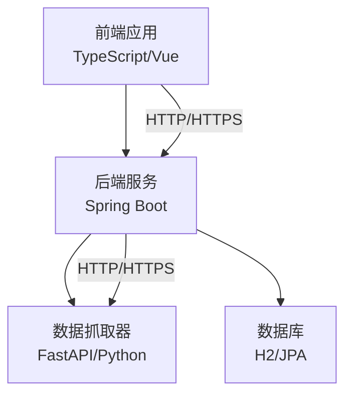
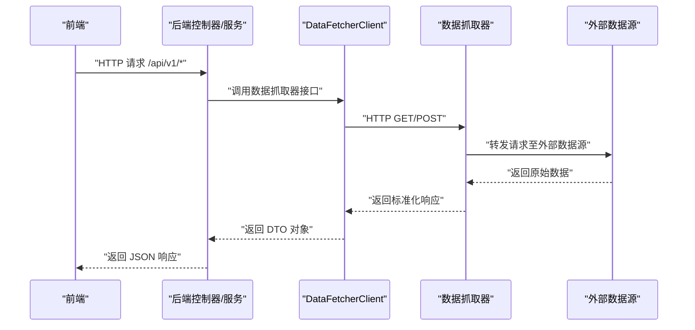
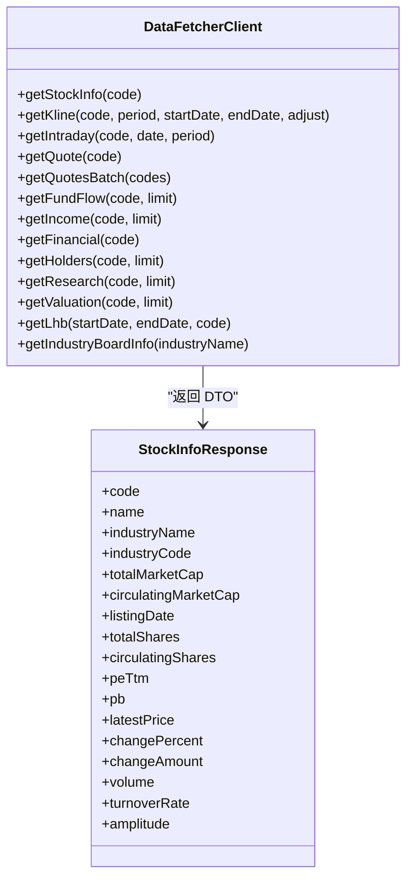
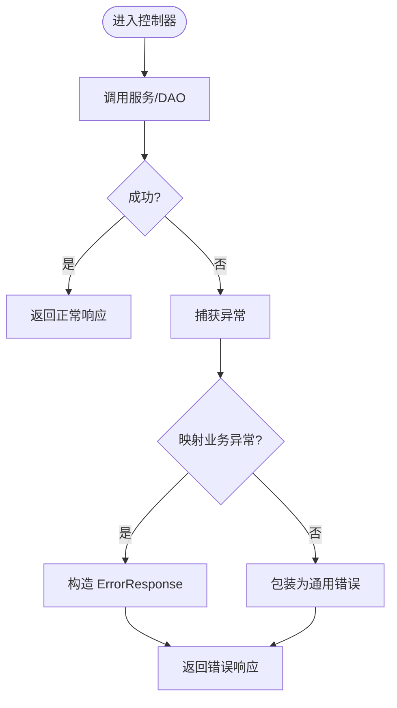
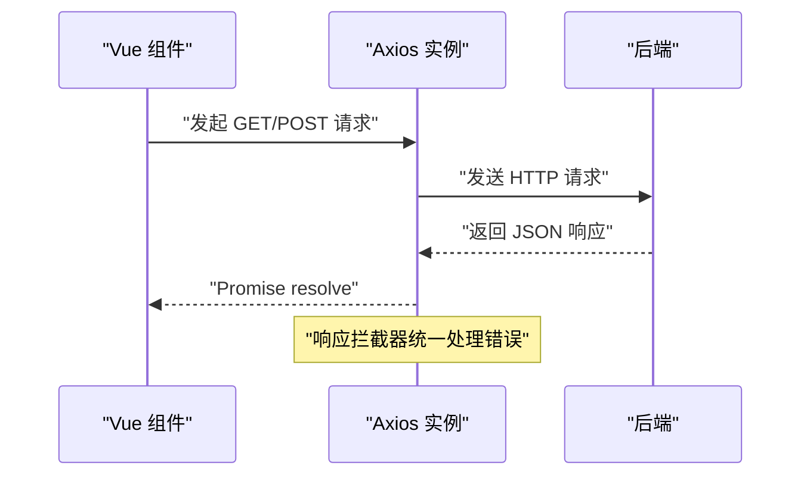
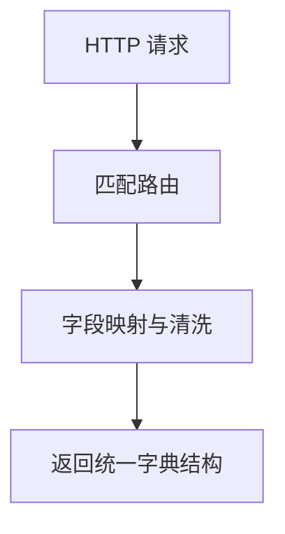
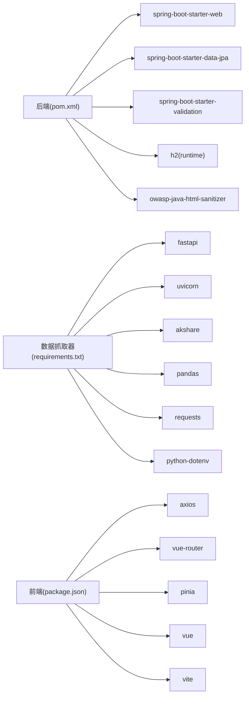

# 跨语言开发指南

<cite>
**本文引用的文件**
- [backend/src/main/java/com/stock/client/DataFetcherClient.java](file://backend/src/main/java/com/stock/client/DataFetcherClient.java)
- [backend/src/main/java/com/stock/config/RestTemplateConfig.java](file://backend/src/main/java/com/stock/config/RestTemplateConfig.java)
- [backend/src/main/java/com/stock/config/WebConfig.java](file://backend/src/main/java/com/stock/config/WebConfig.java)
- [backend/src/main/java/com/stock/exception/ErrorResponse.java](file://backend/src/main/java/com/stock/exception/ErrorResponse.java)
- [backend/src/main/java/com/stock/exception/GlobalExceptionHandler.java](file://backend/src/main/java/com/stock/exception/GlobalExceptionHandler.java)
- [backend/src/main/java/com/stock/dto/fetcher/StockInfoResponse.java](file://backend/src/main/java/com/stock/dto/fetcher/StockInfoResponse.java)
- [backend/src/main/java/com/stock/dto/fetcher/KlineDataResponse.java](file://backend/src/main/java/com/stock/dto/fetcher/KlineDataResponse.java)
- [backend/src/main/resources/application.yml](file://backend/src/main/resources/application.yml)
- [data-fetcher/app.py](file://data-fetcher/app.py)
- [data-fetcher/routers/stock.py](file://data-fetcher/routers/stock.py)
- [frontend/src/api/index.ts](file://frontend/src/api/index.ts)
- [frontend/src/api/stock.ts](file://frontend/src/api/stock.ts)
- [backend/pom.xml](file://backend/pom.xml)
- [data-fetcher/requirements.txt](file://data-fetcher/requirements.txt)
- [frontend/package.json](file://frontend/package.json)
- [system-planner/api-design.md](file://system-planner/api-design.md)
</cite>

## 目录
1. [引言](#引言)
2. [项目结构](#项目结构)
3. [核心组件](#核心组件)
4. [架构总览](#架构总览)
5. [详细组件分析](#详细组件分析)
6. [依赖分析](#依赖分析)
7. [性能考虑](#性能考虑)
8. [故障排查指南](#故障排查指南)
9. [结论](#结论)
10. [附录](#附录)

## 引言
本指南面向跨语言团队，围绕“前后端协作规范、数据交换格式规范、API 版本管理规范”展开，结合仓库中的 Java/Spring Boot 后端、Python/FastAPI 数据抓取器、TypeScript/Vue 前端的实际实现，给出统一约定与最佳实践。目标是确保多语言环境下的数据一致性、错误处理一致性和可维护性。

## 项目结构
该项目采用“多语言分层”的组织方式：
- 后端（Java/Spring Boot）：提供 REST API、定时任务、数据访问与业务逻辑
- 数据抓取器（Python/FastAPI）：对外提供统一的数据源接口，供后端调用
- 前端（TypeScript/Vue）：通过 Axios 访问后端 API，展示与交互

图表来源
- [backend/src/main/resources/application.yml:1-28](file://backend/src/main/resources/application.yml#L1-L28)
- [backend/src/main/java/com/stock/config/WebConfig.java:1-15](file://backend/src/main/java/com/stock/config/WebConfig.java#L1-L15)
- [data-fetcher/app.py:1-31](file://data-fetcher/app.py#L1-L31)

章节来源
- [backend/src/main/resources/application.yml:1-28](file://backend/src/main/resources/application.yml#L1-L28)
- [backend/pom.xml:1-103](file://backend/pom.xml#L1-L103)
- [data-fetcher/requirements.txt:1-7](file://data-fetcher/requirements.txt#L1-L7)
- [frontend/package.json:1-27](file://frontend/package.json#L1-L27)

## 核心组件
- 后端客户端（DataFetcherClient）：封装对数据抓取器的 HTTP 调用，统一异常转换
- Web 配置（WebConfig）：统一 CORS 配置，限定 API v1 路径
- 全局异常处理器（GlobalExceptionHandler）：统一错误响应格式
- DTO（StockInfoResponse、KlineDataResponse）：前后端数据契约载体
- 前端 API 客户端（Axios）：统一基础地址、超时与错误拦截
- 数据抓取器（FastAPI）：提供健康检查、CORS 中间件与路由集合

章节来源
- [backend/src/main/java/com/stock/client/DataFetcherClient.java:1-126](file://backend/src/main/java/com/stock/client/DataFetcherClient.java#L1-L126)
- [backend/src/main/java/com/stock/config/WebConfig.java:1-15](file://backend/src/main/java/com/stock/config/WebConfig.java#L1-L15)
- [backend/src/main/java/com/stock/exception/GlobalExceptionHandler.java:1-33](file://backend/src/main/java/com/stock/exception/GlobalExceptionHandler.java#L1-L33)
- [backend/src/main/java/com/stock/dto/fetcher/StockInfoResponse.java:1-27](file://backend/src/main/java/com/stock/dto/fetcher/StockInfoResponse.java#L1-L27)
- [backend/src/main/java/com/stock/dto/fetcher/KlineDataResponse.java:1-10](file://backend/src/main/java/com/stock/dto/fetcher/KlineDataResponse.java#L1-L10)
- [frontend/src/api/index.ts:1-18](file://frontend/src/api/index.ts#L1-L18)
- [data-fetcher/app.py:1-31](file://data-fetcher/app.py#L1-L31)

## 架构总览
下图展示了跨语言调用链路：前端 → 后端 → 数据抓取器 → 外部数据源；以及后端内部的异常统一处理与 CORS 配置。

图表来源
- [backend/src/main/java/com/stock/client/DataFetcherClient.java:26-99](file://backend/src/main/java/com/stock/client/DataFetcherClient.java#L26-L99)
- [data-fetcher/routers/stock.py:14-246](file://data-fetcher/routers/stock.py#L14-L246)

章节来源
- [backend/src/main/java/com/stock/config/WebConfig.java:1-15](file://backend/src/main/java/com/stock/config/WebConfig.java#L1-L15)
- [backend/src/main/resources/application.yml:1-28](file://backend/src/main/resources/application.yml#L1-L28)

## 详细组件分析

### 组件A：后端客户端与数据抓取器对接
- 后端通过 RestTemplate 发起 HTTP 请求，支持 GET/POST，支持批量查询
- 客户端对异常进行统一包装，避免传播底层异常类型
- 数据抓取器使用 FastAPI 提供路由，返回字典结构数据，CORS 允许通配

图表来源
- [backend/src/main/java/com/stock/client/DataFetcherClient.java:1-126](file://backend/src/main/java/com/stock/client/DataFetcherClient.java#L1-L126)
- [backend/src/main/java/com/stock/dto/fetcher/StockInfoResponse.java:1-27](file://backend/src/main/java/com/stock/dto/fetcher/StockInfoResponse.java#L1-L27)

章节来源
- [backend/src/main/java/com/stock/client/DataFetcherClient.java:26-99](file://backend/src/main/java/com/stock/client/DataFetcherClient.java#L26-L99)
- [data-fetcher/routers/stock.py:14-246](file://data-fetcher/routers/stock.py#L14-L246)

### 组件B：全局异常处理与错误码规范
- 统一错误响应结构：包含 code、message、timestamp
- 常见业务错误映射：400/404/409/503
- 参数校验错误聚合为字段级提示

图表来源
- [backend/src/main/java/com/stock/exception/GlobalExceptionHandler.java:1-33](file://backend/src/main/java/com/stock/exception/GlobalExceptionHandler.java#L1-L33)
- [backend/src/main/java/com/stock/exception/ErrorResponse.java:1-8](file://backend/src/main/java/com/stock/exception/ErrorResponse.java#L1-L8)

章节来源
- [backend/src/main/java/com/stock/exception/GlobalExceptionHandler.java:9-31](file://backend/src/main/java/com/stock/exception/GlobalExceptionHandler.java#L9-L31)
- [backend/src/main/java/com/stock/exception/ErrorResponse.java:3-7](file://backend/src/main/java/com/stock/exception/ErrorResponse.java#L3-L7)

### 组件C：前端 API 客户端与 TypeScript 接口
- Axios 基础配置：baseURL、timeout
- 统一错误拦截：打印错误详情并拒绝 Promise
- TypeScript 接口与后端 DTO 的字段映射关系

图表来源
- [frontend/src/api/index.ts:1-18](file://frontend/src/api/index.ts#L1-L18)
- [frontend/src/api/stock.ts:1-61](file://frontend/src/api/stock.ts#L1-L61)

章节来源
- [frontend/src/api/index.ts:3-15](file://frontend/src/api/index.ts#L3-L15)
- [frontend/src/api/stock.ts:3-61](file://frontend/src/api/stock.ts#L3-L61)

### 组件D：数据抓取器路由与数据标准化
- 提供 /stock/info、/stock/kline、/stock/quote、/stock/quotes/batch 等路由
- 将外部数据源字段映射为统一字典结构
- 健康检查接口 /health

图表来源
- [data-fetcher/routers/stock.py:14-246](file://data-fetcher/routers/stock.py#L14-L246)
- [data-fetcher/app.py:23-25](file://data-fetcher/app.py#L23-L25)

章节来源
- [data-fetcher/routers/stock.py:14-246](file://data-fetcher/routers/stock.py#L14-L246)
- [data-fetcher/app.py:1-31](file://data-fetcher/app.py#L1-L31)

## 依赖分析
- 后端依赖 Spring Web、JPA、验证、H2、OWASP HTML Sanitizer、测试框架
- 数据抓取器依赖 FastAPI、Uvicorn、AkShare、Pandas、Requests、dotenv
- 前端依赖 Vue、Vue Router、Pinia、Axios、Vite、TypeScript

图表来源
- [backend/pom.xml:23-56](file://backend/pom.xml#L23-L56)
- [data-fetcher/requirements.txt:1-7](file://data-fetcher/requirements.txt#L1-L7)
- [frontend/package.json:11-25](file://frontend/package.json#L11-L25)

章节来源
- [backend/pom.xml:1-103](file://backend/pom.xml#L1-L103)
- [data-fetcher/requirements.txt:1-7](file://data-fetcher/requirements.txt#L1-L7)
- [frontend/package.json:1-27](file://frontend/package.json#L1-L27)

## 性能考虑
- 超时与连接设置：后端 RestTemplate 使用连接超时与读取超时，避免阻塞
- 批量查询限制：数据抓取器对批量请求数量进行上限控制，降低外部接口压力
- 前端请求超时：Axios 设置合理超时时间，提升用户体验
- 建议优化方向
  - 序列化优化：后端 DTO 字段尽量扁平化，减少嵌套层级
  - 缓存策略：对高频查询结果增加本地缓存（如 Redis），设置 TTL
  - 并发控制：对数据抓取器外部接口增加限流与熔断
  - 前端分页与懒加载：避免一次性拉取大量数据

章节来源
- [backend/src/main/java/com/stock/config/RestTemplateConfig.java:10-16](file://backend/src/main/java/com/stock/config/RestTemplateConfig.java#L10-L16)
- [data-fetcher/routers/stock.py:217-218](file://data-fetcher/routers/stock.py#L217-L218)
- [frontend/src/api/index.ts:3-6](file://frontend/src/api/index.ts#L3-L6)

## 故障排查指南
- 统一错误响应：前端统一拦截错误并打印，便于定位问题
- CORS 问题：确认后端 WebConfig 中允许的路径与来源
- 超时与网络：检查后端 RestTemplate 超时配置与数据抓取器运行状态
- 数据抓取器健康：访问 /health 确认服务可用
- 日志与追踪：建议引入统一日志结构与追踪 ID，跨服务串联请求链路

章节来源
- [frontend/src/api/index.ts:8-15](file://frontend/src/api/index.ts#L8-L15)
- [backend/src/main/java/com/stock/config/WebConfig.java:8-13](file://backend/src/main/java/com/stock/config/WebConfig.java#L8-L13)
- [data-fetcher/app.py:23-25](file://data-fetcher/app.py#L23-L25)

## 结论
通过统一的错误响应格式、明确的 CORS 配置、前后端一致的数据契约与跨语言的调用链路，本项目在多语言环境下实现了高内聚、低耦合的协作模式。建议在现有基础上进一步完善统一日志结构、分布式追踪与缓存策略，以支撑更大规模的业务演进。

## 附录

### 数据交换格式规范
- 统一响应结构
  - 字段：code（HTTP 状态码语义化）、message（错误描述或业务提示）、timestamp（时间戳）
- 字段命名约定
  - 后端 DTO：遵循 Java 命名规范（驼峰）
  - 前端接口：与后端 DTO 字段一一对应，必要时通过适配层转换
  - 数据抓取器：返回字典键名遵循 Python 风格（snake_case），后端再映射为 DTO
- 示例参考
  - 后端 DTO：参见 [StockInfoResponse.java:8-26](file://backend/src/main/java/com/stock/dto/fetcher/StockInfoResponse.java#L8-L26)
  - 前端接口：参见 [stock.ts:3-38](file://frontend/src/api/stock.ts#L3-L38)
  - 数据抓取器响应：参见 [stock.py:54-72](file://data-fetcher/routers/stock.py#L54-L72)

章节来源
- [backend/src/main/java/com/stock/exception/ErrorResponse.java:3-7](file://backend/src/main/java/com/stock/exception/ErrorResponse.java#L3-L7)
- [backend/src/main/java/com/stock/dto/fetcher/StockInfoResponse.java:8-26](file://backend/src/main/java/com/stock/dto/fetcher/StockInfoResponse.java#L8-L26)
- [frontend/src/api/stock.ts:3-38](file://frontend/src/api/stock.ts#L3-L38)
- [data-fetcher/routers/stock.py:54-72](file://data-fetcher/routers/stock.py#L54-L72)

### API 版本管理规范
- 基础地址：/api/v1
- 路由命名：REST 风格，资源化路径
- 版本策略：当前为 v1，后续新增功能以新字段或子资源形式扩展，保持向后兼容
- 参考设计：参见 [api-design.md](file://system-planner/api-design.md#L3)

章节来源
- [system-planner/api-design.md](file://system-planner/api-design.md#L3)

### 跨语言映射与一致性
- Java 实体类 ↔ Python 数据模型
  - 建议：以 DTO 为中心，Java Record 与 Python 字典结构一一对应
  - 映射依据：字段名与类型（数值、字符串、日期）保持一致
  - 参考：[StockInfoResponse.java:8-26](file://backend/src/main/java/com/stock/dto/fetcher/StockInfoResponse.java#L8-L26) ↔ [stock.py:54-72](file://data-fetcher/routers/stock.py#L54-L72)
- TypeScript 接口 ↔ 后端 DTO
  - 建议：前端接口与后端 DTO 字段同名，类型与范围一致
  - 参考：[stock.ts:3-38](file://frontend/src/api/stock.ts#L3-L38) 与 [StockInfoResponse.java:8-26](file://backend/src/main/java/com/stock/dto/fetcher/StockInfoResponse.java#L8-L26)

章节来源
- [backend/src/main/java/com/stock/dto/fetcher/StockInfoResponse.java:8-26](file://backend/src/main/java/com/stock/dto/fetcher/StockInfoResponse.java#L8-L26)
- [frontend/src/api/stock.ts:3-38](file://frontend/src/api/stock.ts#L3-L38)
- [data-fetcher/routers/stock.py:54-72](file://data-fetcher/routers/stock.py#L54-L72)

### 跨语言调试技巧
- 跨服务日志关联：为每个请求生成唯一 traceId，贯穿前端、后端、数据抓取器
- 分布式追踪：集成 OpenTelemetry 或类似方案，采集链路时延与错误
- 前端：在响应拦截器中记录请求 URL、状态码与错误信息
- 后端：统一异常处理器记录 code、message、timestamp
- 数据抓取器：记录请求参数、外部接口返回状态与异常栈

章节来源
- [frontend/src/api/index.ts:8-15](file://frontend/src/api/index.ts#L8-L15)
- [backend/src/main/java/com/stock/exception/GlobalExceptionHandler.java:9-31](file://backend/src/main/java/com/stock/exception/GlobalExceptionHandler.java#L9-L31)

### 安全编码要求
- CORS 配置：后端限定允许来源与方法，避免通配
- 输入验证：后端启用参数校验，前端提交前进行基础校验
- XSS 防护：后端使用 OWASP HTML Sanitizer 清洗富文本
- 前端：避免 innerHTML 直接拼接用户输入，使用受控组件与转义

章节来源
- [backend/src/main/java/com/stock/config/WebConfig.java:8-13](file://backend/src/main/java/com/stock/config/WebConfig.java#L8-L13)
- [backend/src/main/java/com/stock/util/HtmlSanitizer.java](file://backend/src/main/java/com/stock/util/HtmlSanitizer.java)
- [backend/pom.xml:47-50](file://backend/pom.xml#L47-L50)

### 项目结构组织原则、依赖管理与构建部署
- 组织原则
  - 按语言分层：后端、数据抓取器、前端独立目录
  - 按职责分包：controller/service/repository/dto/exception/config
- 依赖管理
  - 后端：Maven 管理依赖与插件
  - 数据抓取器：pip requirements.txt
  - 前端：npm 管理依赖与脚本
- 构建与部署
  - 后端：Spring Boot Maven 插件打包
  - 数据抓取器：Uvicorn 运行 FastAPI 应用
  - 前端：Vite 构建，静态资源部署

章节来源
- [backend/pom.xml:58-101](file://backend/pom.xml#L58-L101)
- [data-fetcher/app.py:28-31](file://data-fetcher/app.py#L28-L31)
- [frontend/package.json:6-10](file://frontend/package.json#L6-L10)