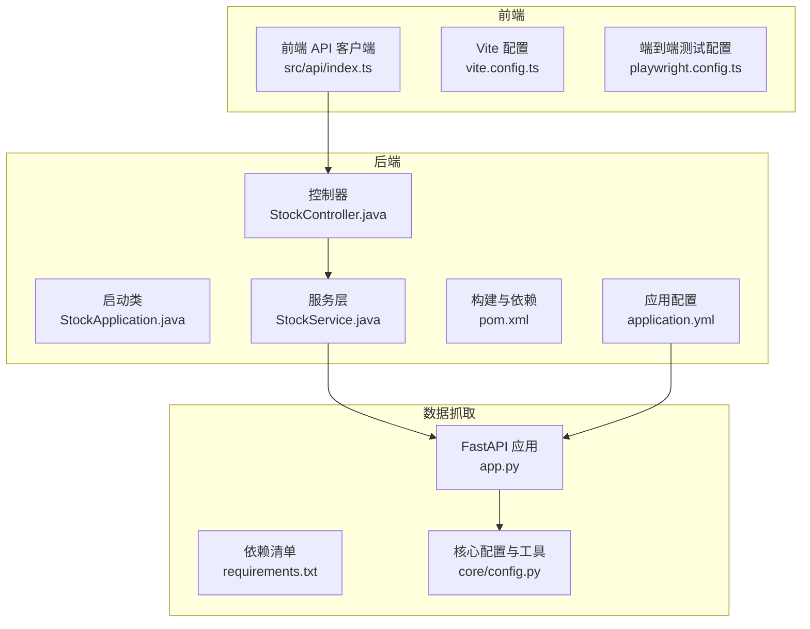
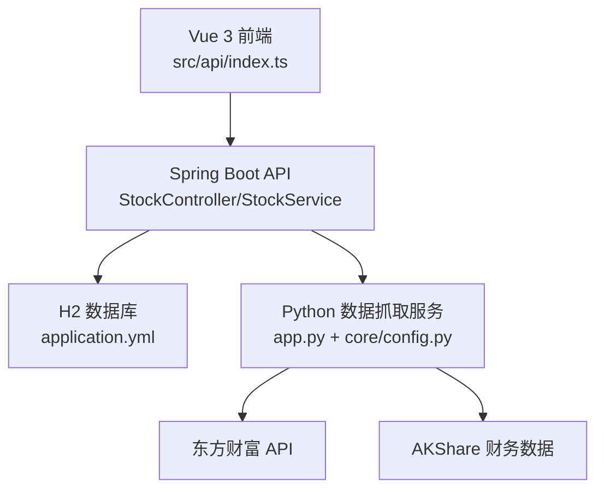
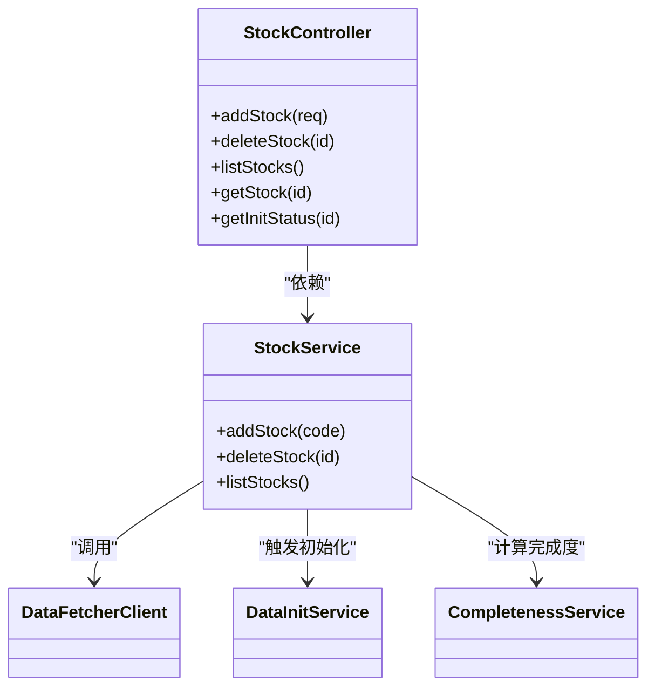
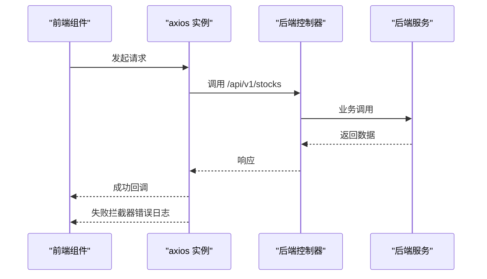
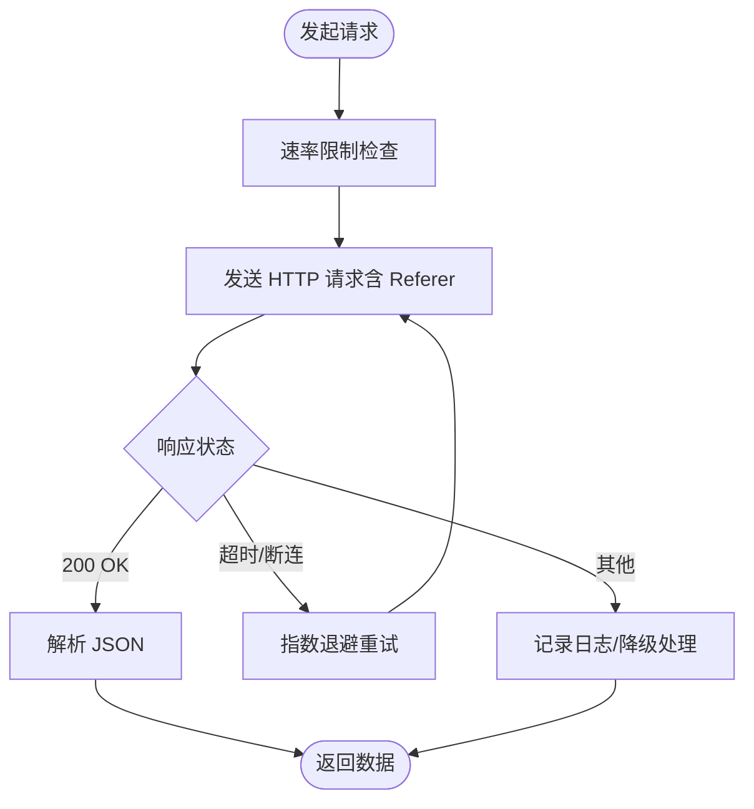

# 开发指南

<cite>
**本文引用的文件**
- [StockApplication.java](file://backend/src/main/java/com/stock/StockApplication.java)
- [pom.xml](file://backend/pom.xml)
- [application.yml](file://backend/src/main/resources/application.yml)
- [StockController.java](file://backend/src/main/java/com/stock/controller/StockController.java)
- [StockService.java](file://backend/src/main/java/com/stock/service/StockService.java)
- [StockControllerTest.java](file://backend/src/test/java/com/stock/controller/StockControllerTest.java)
- [index.ts](file://frontend/src/api/index.ts)
- [vite.config.ts](file://frontend/vite.config.ts)
- [playwright.config.ts](file://frontend/playwright.config.ts)
- [package.json](file://frontend/package.json)
- [tsconfig.json](file://frontend/tsconfig.json)
- [app.py](file://data-fetcher/app.py)
- [requirements.txt](file://data-fetcher/requirements.txt)
- [config.py](file://data-fetcher/core/config.py)
- [SKILL.md（开发流程）](file://dev-workflow/SKILL.md)
- [SKILL.md（系统规划）](file://system-planner/SKILL.md)
</cite>

## 目录
1. [简介](#简介)
2. [项目结构](#项目结构)
3. [核心组件](#核心组件)
4. [架构总览](#架构总览)
5. [详细组件分析](#详细组件分析)
6. [依赖分析](#依赖分析)
7. [性能考虑](#性能考虑)
8. [故障排查指南](#故障排查指南)
9. [结论](#结论)
10. [附录](#附录)

## 简介
本开发指南面向后端（Java/Spring Boot）、前端（Vue 3 + TypeScript）、数据抓取（Python/FastAPI）三个子系统，提供统一的代码规范、Git 工作流程、代码审查标准、开发环境配置、IDE 设置、调试技巧、新功能开发流程、接口设计原则、测试要求、最佳实践、性能优化建议与安全编码规范，以及团队协作流程、文档编写标准与知识分享机制。

## 项目结构
项目采用多模块结构：
- backend：Spring Boot 后端，REST API + 定时任务 + H2 数据库
- frontend：Vue 3 + Vite + TypeScript 前端
- data-fetcher：Python FastAPI 数据抓取服务，对接东方财富与 AKShare
- system-planner：系统设计与规划文档
- dev-workflow：开发流程规范与检查清单

图表来源
- [StockApplication.java:11-15](file://backend/src/main/java/com/stock/StockApplication.java#L11-L15)
- [application.yml:1-28](file://backend/src/main/resources/application.yml#L1-L28)
- [StockController.java:17-56](file://backend/src/main/java/com/stock/controller/StockController.java#L17-L56)
- [StockService.java:26-91](file://backend/src/main/java/com/stock/service/StockService.java#L26-L91)
- [index.ts:1-18](file://frontend/src/api/index.ts#L1-L18)
- [vite.config.ts:1-8](file://frontend/vite.config.ts#L1-L8)
- [playwright.config.ts:1-25](file://frontend/playwright.config.ts#L1-L25)
- [app.py:1-31](file://data-fetcher/app.py#L1-L31)
- [requirements.txt:1-7](file://data-fetcher/requirements.txt#L1-L7)
- [config.py:1-121](file://data-fetcher/core/config.py#L1-L121)

章节来源
- [StockApplication.java:11-15](file://backend/src/main/java/com/stock/StockApplication.java#L11-L15)
- [application.yml:1-28](file://backend/src/main/resources/application.yml#L1-L28)
- [StockController.java:17-56](file://backend/src/main/java/com/stock/controller/StockController.java#L17-L56)
- [StockService.java:26-91](file://backend/src/main/java/com/stock/service/StockService.java#L26-L91)
- [index.ts:1-18](file://frontend/src/api/index.ts#L1-L18)
- [vite.config.ts:1-8](file://frontend/vite.config.ts#L1-L8)
- [playwright.config.ts:1-25](file://frontend/playwright.config.ts#L1-L25)
- [app.py:1-31](file://data-fetcher/app.py#L1-L31)
- [requirements.txt:1-7](file://data-fetcher/requirements.txt#L1-L7)
- [config.py:1-121](file://data-fetcher/core/config.py#L1-L121)

## 核心组件
- 后端启动与配置
  - 启动类启用调度与异步，主端口 8080，H2 控制台 /h2-console
  - 配置数据源、JPA、定时任务表达式、数据抓取服务地址与超时
- 前端 API 客户端
  - axios 实例，baseURL 指向后端 /api/v1，统一响应拦截器
- 数据抓取服务
  - FastAPI 应用，CORS 允许通配，注册各路由模块，健康检查端点
  - 核心配置包含请求头（必需 Referer）、速率限制、secid 编码、数值安全转换、HTTP 重试与退避

章节来源
- [StockApplication.java:8-15](file://backend/src/main/java/com/stock/StockApplication.java#L8-L15)
- [application.yml:1-28](file://backend/src/main/resources/application.yml#L1-L28)
- [index.ts:1-18](file://frontend/src/api/index.ts#L1-L18)
- [app.py:1-31](file://data-fetcher/app.py#L1-L31)
- [config.py:8-121](file://data-fetcher/core/config.py#L8-L121)

## 架构总览
系统采用“前端 SPA + 后端 REST + Python 数据抓取服务”的三层架构，数据通过 H2 文件数据库持久化。

图表来源
- [index.ts:1-18](file://frontend/src/api/index.ts#L1-L18)
- [StockController.java:17-56](file://backend/src/main/java/com/stock/controller/StockController.java#L17-L56)
- [StockService.java:26-91](file://backend/src/main/java/com/stock/service/StockService.java#L26-L91)
- [application.yml:4-27](file://backend/src/main/resources/application.yml#L4-L27)
- [app.py:1-31](file://data-fetcher/app.py#L1-L31)
- [config.py:80-121](file://data-fetcher/core/config.py#L80-L121)

## 详细组件分析

### 后端：StockController 与 StockService
- 控制器
  - 提供添加/删除/查询股票及初始化状态查询接口
  - 使用 Jakarta Validation 注解进行请求体校验
- 服务层
  - 股票添加：校验代码格式、去重；调用数据抓取客户端获取基础信息与估值；保存后在事务提交后触发异步初始化
  - 删除：级联清理相关数据与分析表
  - 列表：聚合分析完成度

图表来源
- [StockController.java:17-56](file://backend/src/main/java/com/stock/controller/StockController.java#L17-L56)
- [StockService.java:26-91](file://backend/src/main/java/com/stock/service/StockService.java#L26-L91)

章节来源
- [StockController.java:29-55](file://backend/src/main/java/com/stock/controller/StockController.java#L29-L55)
- [StockService.java:93-189](file://backend/src/main/java/com/stock/service/StockService.java#L93-L189)

### 前端：API 客户端与测试配置
- API 客户端
  - axios 实例，统一 baseURL 与超时，响应拦截器统一错误处理
- Vite 配置
  - 插件化配置，便于扩展
- Playwright 端到端测试
  - 指定测试目录、超时、无头模式、webServer 命令与端口

图表来源
- [index.ts:1-18](file://frontend/src/api/index.ts#L1-L18)
- [StockController.java:29-55](file://backend/src/main/java/com/stock/controller/StockController.java#L29-L55)

章节来源
- [index.ts:1-18](file://frontend/src/api/index.ts#L1-L18)
- [vite.config.ts:1-8](file://frontend/vite.config.ts#L1-L8)
- [playwright.config.ts:1-25](file://frontend/playwright.config.ts#L1-L25)

### 数据抓取服务：FastAPI 与核心配置
- 应用
  - CORS 允许通配，注册多个路由模块，健康检查端点
- 核心配置
  - 必需请求头（含 Referer），最小 500ms 速率限制，secid 编码规则，数值安全转换，HTTP 重试与退避，datacenter 接口封装

图表来源
- [app.py:1-31](file://data-fetcher/app.py#L1-L31)
- [config.py:80-121](file://data-fetcher/core/config.py#L80-L121)

章节来源
- [app.py:1-31](file://data-fetcher/app.py#L1-L31)
- [config.py:8-121](file://data-fetcher/core/config.py#L8-L121)

## 依赖分析
- 后端
  - Java 17，Spring Boot Starter Web/JPA/Validation，H2，Lombok，OWASP HTML Sanitizer，测试依赖
  - Maven 编译插件、Surefire 参数（ByteBuddy agent、模块开放参数）、Spring Boot 插件排除 Lombok
- 前端
  - Vue 3 + Vue Router + Pinia + Axios，Vite + TypeScript，Playwright 测试
- 数据抓取
  - FastAPI + Uvicorn + AKShare + pandas + requests + python-dotenv

章节来源
- [pom.xml:17-101](file://backend/pom.xml#L17-L101)
- [package.json:1-27](file://frontend/package.json#L1-L27)
- [requirements.txt:1-7](file://data-fetcher/requirements.txt#L1-L7)

## 性能考虑
- 后端
  - 定时任务在交易时段按配置周期执行，避免高峰并发
  - 异步初始化在事务提交后触发，保证读取一致性
  - DTO/实体字段映射与查询路径在设计文档中明确，减少 N+1 风险
- 前端
  - 大数据量 K 线建议默认展示一年，必要时降采样
- 数据抓取
  - 500ms 最小请求间隔，超时与断连退避重试，Referer 必需以避免断连

章节来源
- [application.yml:23-27](file://backend/src/main/resources/application.yml#L23-L27)
- [StockService.java:145-160](file://backend/src/main/java/com/stock/service/StockService.java#L145-L160)
- [config.py:14-29](file://data-fetcher/core/config.py#L14-L29)
- [SKILL.md（系统规划）:646-655](file://system-planner/SKILL.md#L646-L655)

## 故障排查指南
- 后端
  - 全局异常处理统一返回错误格式；常见异常类型包括股票不存在、数据获取失败、重复股票、无效股票代码
  - H2 控制台 /h2-console 可查看表结构与数据
- 前端
  - API 拦截器统一记录错误；网络断开时全局提示
- 数据抓取
  - 无 Referer 会导致断连；超时/429/403 采用退避重试；数值转换统一使用安全转换函数

章节来源
- [application.yml:14-17](file://backend/src/main/resources/application.yml#L14-L17)
- [index.ts:8-15](file://frontend/src/api/index.ts#L8-L15)
- [config.py:80-100](file://data-fetcher/core/config.py#L80-L100)
- [StockService.java:130-143](file://backend/src/main/java/com/stock/service/StockService.java#L130-L143)

## 结论
本指南提供了从开发流程、代码规范、测试策略到性能与安全的完整实践框架。建议团队在每次功能开发前先完成设计文档与自检，严格遵循单元测试与代码审查流程，确保前后端与数据抓取服务协同一致。

## 附录

### 代码规范（Java）
- 版本与依赖
  - Java 17，使用 Lombok 简化样板代码，OWASP HTML Sanitizer 用于富文本净化
- 注解与装配
  - 控制器使用 @RestController + @RequestMapping，服务层 @Service，事务 @Transactional
  - 构造器注入依赖，避免字段注入
- 校验与异常
  - 使用 Jakarta Validation 注解校验请求体；自定义业务异常，全局异常统一返回格式
- 日志与测试
  - 使用 SLF4J 日志门面；单元测试使用 JUnit 5 + Mockito；控制器集成测试使用 MockMvc

章节来源
- [pom.xml:17-56](file://backend/pom.xml#L17-L56)
- [StockController.java:10-15](file://backend/src/main/java/com/stock/controller/StockController.java#L10-L15)
- [StockService.java:15-25](file://backend/src/main/java/com/stock/service/StockService.java#L15-L25)
- [StockControllerTest.java:10-28](file://backend/src/test/java/com/stock/controller/StockControllerTest.java#L10-L28)

### 代码规范（TypeScript）
- 语言与工具
  - TypeScript 6.x，Vite 8.x，Vue 3 + Vue Router + Pinia
- API 客户端
  - axios 实例统一 baseURL 与超时；响应拦截器统一错误处理
- 配置
  - Vite 插件化配置；Playwright 端到端测试配置 base URL、超时、无头模式与 webServer

章节来源
- [package.json:11-25](file://frontend/package.json#L11-L25)
- [index.ts:1-18](file://frontend/src/api/index.ts#L1-L18)
- [vite.config.ts:1-8](file://frontend/vite.config.ts#L1-L8)
- [playwright.config.ts:1-25](file://frontend/playwright.config.ts#L1-L25)

### Git 工作流程
- 开发流程（12 步）
  - 需求定稿 → 概要设计 → 概要设计自检 → 详细设计 → 详细设计自检 → 编码 → 单元测试 → 代码审查 → 阶段回归 → E2E 测试
- 流程规则
  - 不跳步、文档先行、追溯联动、测试同步、变更记录
- 代码审查与 Lint/Typecheck
  - Java：checkstyle/spotbugs；Python：ruff/flake8；JS：eslint
  - 类型检查：Java 编译、Python mypy、TS tsc
  - 人工审查重点：XSS/注入、N+1 查询、规范违反

章节来源
- [SKILL.md（开发流程）:10-131](file://dev-workflow/SKILL.md#L10-L131)

### 代码审查标准
- 设计一致性
  - 详细设计与概要设计追溯矩阵一致；字段命名与类型对齐
- 代码质量
  - 无魔法数字/字符串；方法职责单一；异常处理完备
- 安全与性能
  - 输入校验与输出净化；避免 N+1 查询；合理使用缓存与异步
- 测试覆盖
  - Service 层单元测试覆盖率目标 80%+；控制器集成测试覆盖所有端点；外部依赖一律 Mock

章节来源
- [SKILL.md（开发流程）:92-103](file://dev-workflow/SKILL.md#L92-L103)
- [StockControllerTest.java:51-114](file://backend/src/test/java/com/stock/controller/StockControllerTest.java#L51-L114)

### 开发环境配置
- 后端
  - Java 17+，Maven 构建，Spring Boot 运行，H2 控制台 /h2-console
- 前端
  - Node.js 18+，npm 安装依赖，Vite 开发服务器，Playwright 端到端测试
- 数据抓取
  - Python 3.9+，pip 安装依赖，Uvicorn 运行，FastAPI 路由注册

章节来源
- [SKILL.md（系统规划）:483-510](file://system-planner/SKILL.md#L483-L510)
- [pom.xml:17-21](file://backend/pom.xml#L17-L21)
- [package.json:6-10](file://frontend/package.json#L6-L10)
- [requirements.txt:1-7](file://data-fetcher/requirements.txt#L1-L7)

### IDE 设置
- Java
  - 使用 Lombok 插件；启用 SpotBugs/Checkstyle；启用编译期注解处理器
- TypeScript/Vue
  - VS Code/Volar 插件；ESLint + Prettier；TypeScript 严格模式
- Python
  - PyCharm/VS Code；ruff/flake8；mypy；pytest 集成

章节来源
- [pom.xml:62-74](file://backend/pom.xml#L62-L74)
- [package.json:17-25](file://frontend/package.json#L17-L25)
- [SKILL.md（开发流程）:94-96](file://dev-workflow/SKILL.md#L94-L96)

### 调试技巧
- 后端
  - 使用 H2 控制台查看数据；开启 INFO/WARN 日志；事务提交后异步初始化可观察日志
- 前端
  - 浏览器控制台查看 API 错误；Playwright 截图仅失败时生成
- 数据抓取
  - 打印 URL + 耗时 + 状态；检查 Referer 与速率限制；重试与退避策略

章节来源
- [application.yml:14-17](file://backend/src/main/resources/application.yml#L14-L17)
- [index.ts:11-15](file://frontend/src/api/index.ts#L11-L15)
- [config.py:80-100](file://data-fetcher/core/config.py#L80-L100)

### 新功能开发流程
- 设计阶段
  - 输出 HLD 与 DD，完成自检与追溯矩阵
- 编码阶段
  - 严格遵循 DD 中类名/方法签名/字段名；边写边测
- 测试阶段
  - 单元测试 + 阶段回归 + E2E
- 交付阶段
  - 代码审查 + Lint/Typecheck + 变更记录

章节来源
- [SKILL.md（开发流程）:14-131](file://dev-workflow/SKILL.md#L14-L131)

### 接口设计原则
- 命名与版本
  - 统一前缀 /api/v1；资源名词化；幂等性明确
- 请求/响应
  - 明确字段含义、类型、范围；错误响应统一格式
- 前后端契约
  - 前端与后端 DTO 字段映射清晰；前端状态与后端状态一致

章节来源
- [StockController.java:17-56](file://backend/src/main/java/com/stock/controller/StockController.java#L17-L56)
- [index.ts:3-6](file://frontend/src/api/index.ts#L3-L6)

### 测试要求
- 后端
  - JUnit 5 + Mockito；Service 层单元测试；控制器集成测试；仓库层 H2 集成测试
- 前端
  - Vitest + Vue Test Utils；组件渲染、Store 状态变更、API 客户端 Mock
- 数据抓取
  - pytest；Mock 东方财富/AKShare 响应；数值转换与错误处理测试

章节来源
- [StockControllerTest.java:10-28](file://backend/src/test/java/com/stock/controller/StockControllerTest.java#L10-L28)
- [SKILL.md（系统规划）:520-546](file://system-planner/SKILL.md#L520-L546)

### 开发最佳实践
- 设计先行：先文档后编码，保持追溯矩阵同步
- 测试驱动：编码与单元测试同步进行
- 安全优先：输入校验、输出净化、CORS 配置、异常统一处理
- 性能优化：合理索引、异步初始化、速率限制、降采样

章节来源
- [SKILL.md（开发流程）:124-131](file://dev-workflow/SKILL.md#L124-L131)
- [config.py:14-29](file://data-fetcher/core/config.py#L14-L29)

### 性能优化建议
- 后端
  - 事务提交后触发异步初始化；定时任务在交易时段执行；DTO/SQL 设计避免 N+1
- 前端
  - K 线默认一年展示，大数据量降采样
- 数据抓取
  - 500ms 速率限制；超时与断连退避重试；Referer 必需

章节来源
- [StockService.java:145-160](file://backend/src/main/java/com/stock/service/StockService.java#L145-L160)
- [config.py:14-29](file://data-fetcher/core/config.py#L14-L29)
- [SKILL.md（系统规划）:646-655](file://system-planner/SKILL.md#L646-L655)

### 安全编码规范
- 输入校验
  - 股票代码格式校验；请求体字段必填与范围校验
- 输出净化
  - OWASP HTML Sanitizer 用于富文本
- CORS 与跨域
  - 后端配置允许前端开发服务器访问
- 错误处理
  - 全局异常捕获，错误响应统一格式

章节来源
- [StockService.java:95-105](file://backend/src/main/java/com/stock/service/StockService.java#L95-L105)
- [pom.xml:47-50](file://backend/pom.xml#L47-L50)
- [application.yml:440-481](file://backend/src/main/resources/application.yml#L440-L481)

### 团队协作流程
- 文档标准
  - HLD/DD/检查清单；追溯矩阵；变更记录
- 知识分享
  - 定期回顾开发流程与设计文档；共享数据源验证与性能测试结果

章节来源
- [SKILL.md（系统规划）:1-694](file://system-planner/SKILL.md#L1-L694)
- [SKILL.md（开发流程）:1-131](file://dev-workflow/SKILL.md#L1-L131)