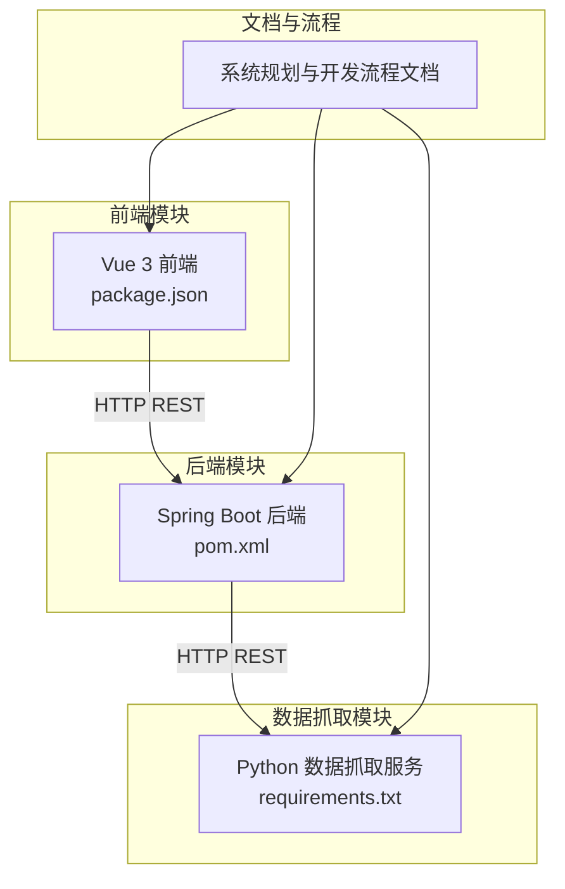
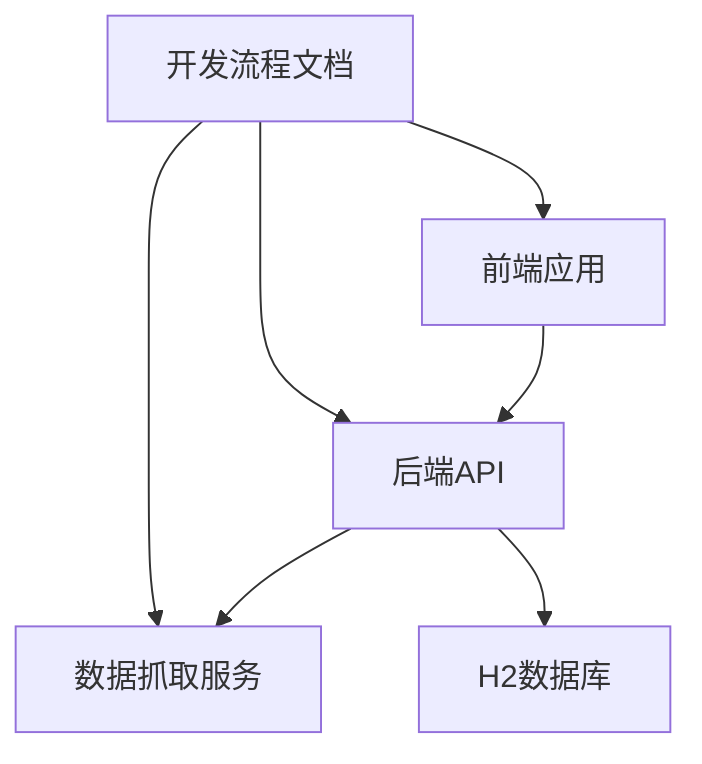
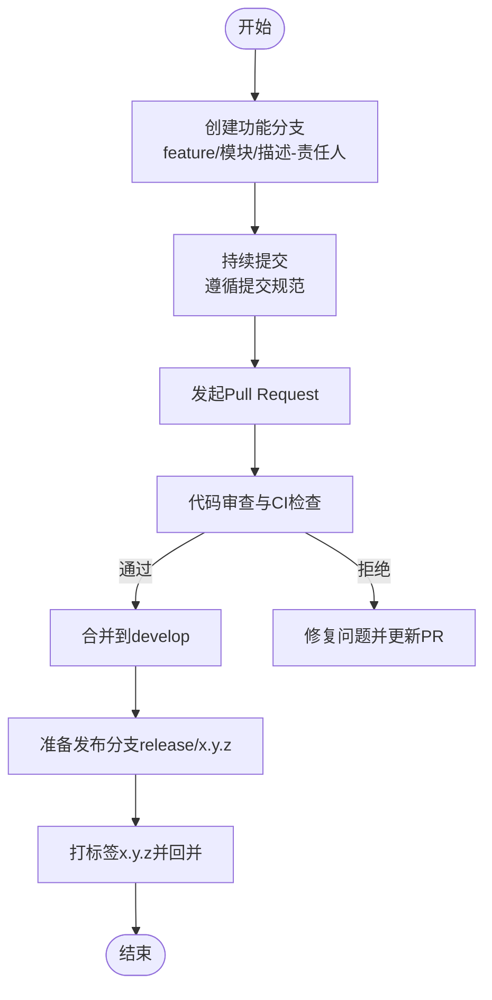
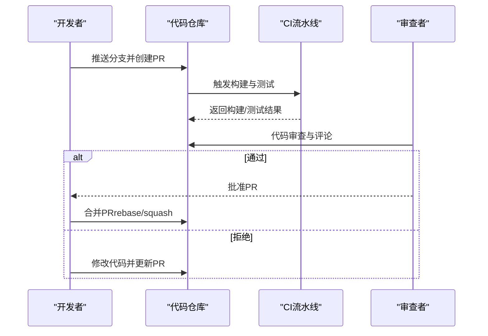
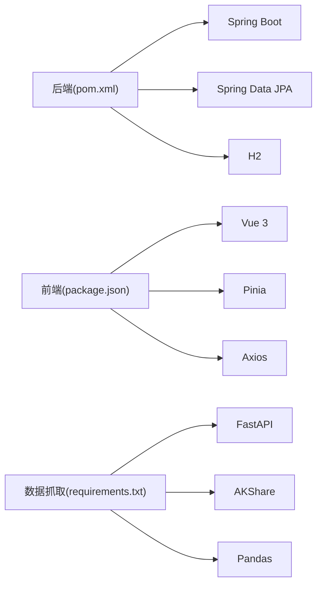

# Git工作流程

<cite>
**本文引用的文件**
- [dev-workflow/SKILL.md](file://dev-workflow/SKILL.md)
- [system-planner/SKILL.md](file://system-planner/SKILL.md)
- [system-planner/high-level-design.md](file://system-planner/high-level-design.md)
- [backend/pom.xml](file://backend/pom.xml)
- [frontend/package.json](file://frontend/package.json)
- [data-fetcher/requirements.txt](file://data-fetcher/requirements.txt)
- [frontend/.gitignore](file://frontend/.gitignore)
- [backend/src/main/java/com/stock/service/DataInitService.java](file://backend/src/main/java/com/stock/service/DataInitService.java)
- [backend/src/main/java/com/stock/dto/response/StepStatus.java](file://backend/src/main/java/com/stock/dto/response/StepStatus.java)
</cite>

## 目录
1. [简介](#简介)
2. [项目结构](#项目结构)
3. [核心组件](#核心组件)
4. [架构总览](#架构总览)
5. [详细组件分析](#详细组件分析)
6. [依赖分析](#依赖分析)
7. [性能考量](#性能考量)
8. [故障排查指南](#故障排查指南)
9. [结论](#结论)
10. [附录](#附录)

## 简介
本文件面向StockTradingSystem项目，提供一套完整的Git工作流程规范，覆盖分支策略、提交规范、合并流程、版本标签与发布流程、回滚机制、Git配置建议、钩子脚本与自动化工具集成方案。该工作流程以项目现有开发流程文档为基础，结合实际代码结构与依赖关系，形成可落地的工程实践。

## 项目结构
项目采用多模块架构，包含后端（Spring Boot）、前端（Vue 3 + Vite）、数据抓取服务（Python FastAPI）以及系统规划与开发流程文档。各模块职责清晰，便于分阶段迭代与质量管控。

**图表来源**
- [backend/pom.xml:1-103](file://backend/pom.xml#L1-L103)
- [frontend/package.json:1-27](file://frontend/package.json#L1-L27)
- [data-fetcher/requirements.txt:1-7](file://data-fetcher/requirements.txt#L1-L7)
- [system-planner/SKILL.md:1-694](file://system-planner/SKILL.md#L1-L694)

**章节来源**
- [system-planner/SKILL.md:213-247](file://system-planner/SKILL.md#L213-L247)
- [system-planner/high-level-design.md:1-68](file://system-planner/high-level-design.md#L1-L68)

## 核心组件
- 后端服务：提供REST API、定时任务、数据持久化与业务逻辑。
- 前端应用：Vue 3单页应用，负责数据展示与用户交互。
- 数据抓取服务：Python FastAPI封装东方财富与AKShare接口，统一限流与缓存。
- 系统规划与开发流程：定义开发阶段、模块映射、接口契约与测试策略。

**章节来源**
- [system-planner/SKILL.md:483-510](file://system-planner/SKILL.md#L483-L510)
- [system-planner/high-level-design.md:80-111](file://system-planner/high-level-design.md#L80-L111)

## 架构总览
系统采用前后端分离架构，后端通过HTTP与数据抓取服务交互，前端通过REST API消费数据。开发流程文档明确了各阶段的模块映射与接口契约，确保跨模块协作的一致性与可追溯性。

**图表来源**
- [system-planner/high-level-design.md:185-271](file://system-planner/high-level-design.md#L185-L271)
- [system-planner/SKILL.md:494-503](file://system-planner/SKILL.md#L494-L503)

## 详细组件分析

### 分支策略
- 主分支保护
  - master/main分支启用保护规则：禁止直接推送、强制PR合并、必需CI通过。
  - 代码审查：至少一名维护者批准。
  - 状态检查：构建、测试、静态分析通过。
- 功能分支命名规范
  - 命名格式：feature/模块名/功能描述-责任人
  - 示例：feature/backend/add-stock-controller-zhangsan
- 发布分支管理
  - release/x.y.z：用于发布准备与最后修复，合并后打标签并回并至develop与main。
  - hotfix/x.y.z：紧急修复，从main切出，修复后回并至main与develop。

[本图为概念性流程示意，不直接映射具体源文件]

### 提交规范
- 提交消息格式
  - 标题：类型(作用域): 简要描述
  - 正文：动机、变更点、兼容性影响
  - 底部：关联Issue或任务编号
- 类型分类
  - feat：新功能
  - fix：缺陷修复
  - docs：文档更新
  - style：格式调整（不影响逻辑）
  - refactor：重构（既不修复bug也不新增功能）
  - perf：性能优化
  - test：测试相关
  - chore：构建流程、依赖管理等杂项
- 描述规范
  - 使用祈使句，避免人称；首字母不大写；不超过50字符；正文分两段，首段总结，次段详述。

**章节来源**
- [dev-workflow/SKILL.md:84-96](file://dev-workflow/SKILL.md#L84-L96)
- [system-planner/SKILL.md:520-554](file://system-planner/SKILL.md#L520-L554)

### 合并流程
- Pull Request模板
  - 摘要：功能概述与目标
  - 变更内容：文件变更清单与影响范围
  - 测试策略：单元测试、集成测试、端到端测试
  - 风险与回滚：潜在风险与回滚计划
- 代码审查要求
  - 至少一名维护者批准；审查关注点：安全性、性能、可维护性、测试覆盖。
- 冲突解决
  - 优先rebase解决；若多人修改同一文件，优先通过沟通协调，必要时通过squash合并。

[本图为概念性流程示意，不直接映射具体源文件]

### 版本标签策略与发布流程
- 版本号语义化：x.y.z（主.次.补丁）
- 标签策略
  - 仅在release分支合并后打标签，标签名与版本号一致。
- 发布流程
  - 从release分支合并至main与develop，打标签并推送；发布制品（如后端Jar包、前端构建产物）。
- 回滚机制
  - 回滚到上一个稳定标签；若涉及数据库变更，配合迁移脚本或数据备份恢复。

**章节来源**
- [system-planner/SKILL.md:483-510](file://system-planner/SKILL.md#L483-L510)

### Git配置建议
- 用户信息
  - git config --global user.name "开发者姓名"
  - git config --global user.email "开发者邮箱"
- 提交行为
  - git config --global core.autocrlf false（Linux/macOS设为input）
  - git config --global core.safecrlf true
- 分支与合并
  - git config --global pull.rebase true
  - git config --global rebase.autoSquash true
- 代码风格
  - git config --global core.editor "vim"（或IDE默认编辑器）

[本节为通用配置建议，不直接引用具体源文件]

### 钩子脚本与自动化工具集成
- 预提交钩子（pre-commit）
  - 格式化与静态检查：Java checkstyle/spotbugs、Python ruff/flake8、JS eslint
  - 类型检查：Java编译、Python mypy、TS tsc
  - 单元测试：确保所有测试通过
- 提交后钩子（post-commit）
  - 触发CI流水线（如GitHub Actions/GitLab CI）
- 自动化工具集成
  - 代码扫描：SonarQube
  - 依赖审计：Dependabot
  - 文档生成：根据变更自动生成变更日志

[本节为通用实践建议，不直接引用具体源文件]

## 依赖分析
- 后端依赖
  - Spring Boot Starter Web、Data JPA、H2、OWASP HTML Sanitizer、JUnit 5等。
- 前端依赖
  - Vue 3、Pinia、Vue Router、Axios、Playwright等。
- 数据抓取服务依赖
  - FastAPI、Uvicorn、AKShare、Pandas、Requests、python-dotenv等。

**图表来源**
- [backend/pom.xml:23-56](file://backend/pom.xml#L23-L56)
- [frontend/package.json:11-25](file://frontend/package.json#L11-L25)
- [data-fetcher/requirements.txt:1-7](file://data-fetcher/requirements.txt#L1-L7)

**章节来源**
- [backend/pom.xml:1-103](file://backend/pom.xml#L1-L103)
- [frontend/package.json:1-27](file://frontend/package.json#L1-L27)
- [data-fetcher/requirements.txt:1-7](file://data-fetcher/requirements.txt#L1-L7)

## 性能考量
- 数据初始化与异步处理
  - 后端提供初始化状态查询接口，前端轮询进度，避免阻塞主线程。
- 定时任务与限流
  - 后端与数据抓取服务分别设置定时任务与限流策略，降低对外部接口的压力。
- 前端资源与渲染
  - 前端组件按需加载，K线图支持降采样，提升大数据量下的渲染性能。

**章节来源**
- [system-planner/SKILL.md:555-587](file://system-planner/SKILL.md#L555-L587)
- [system-planner/high-level-design.md:321-351](file://system-planner/high-level-design.md#L321-L351)

## 故障排查指南
- 提交规范问题
  - 使用git log --oneline查看提交历史，不符合规范的提交可通过reword或squash修正。
- CI失败
  - 查看CI日志中的构建、测试与静态检查结果，逐项修复。
- 代码冲突
  - 优先rebase解决；多人修改同一文件时，先沟通再合并。
- 数据初始化失败
  - 通过后端初始化状态接口定位失败步骤，结合日志与错误响应排查。

**章节来源**
- [backend/src/main/java/com/stock/service/DataInitService.java:87-100](file://backend/src/main/java/com/stock/service/DataInitService.java#L87-L100)
- [backend/src/main/java/com/stock/dto/response/StepStatus.java:1-3](file://backend/src/main/java/com/stock/dto/response/StepStatus.java#L1-L3)

## 结论
本工作流程以开发流程文档为依据，结合项目实际模块与依赖，制定了可执行的分支策略、提交规范、合并流程与发布回滚机制。通过预提交钩子与CI集成，确保代码质量与交付稳定性；通过异步初始化与定时任务，保障系统性能与可靠性。

## 附录
- 前端忽略文件
  - 前端根目录包含.gitignore，用于忽略日志、依赖与IDE临时文件，避免污染仓库。
- 开发阶段与模块映射
  - 明确各阶段的后端、前端与数据抓取模块职责，便于并行开发与质量控制。

**章节来源**
- [frontend/.gitignore:1-25](file://frontend/.gitignore#L1-L25)
- [system-planner/high-level-design.md:494-503](file://system-planner/high-level-design.md#L494-L503)