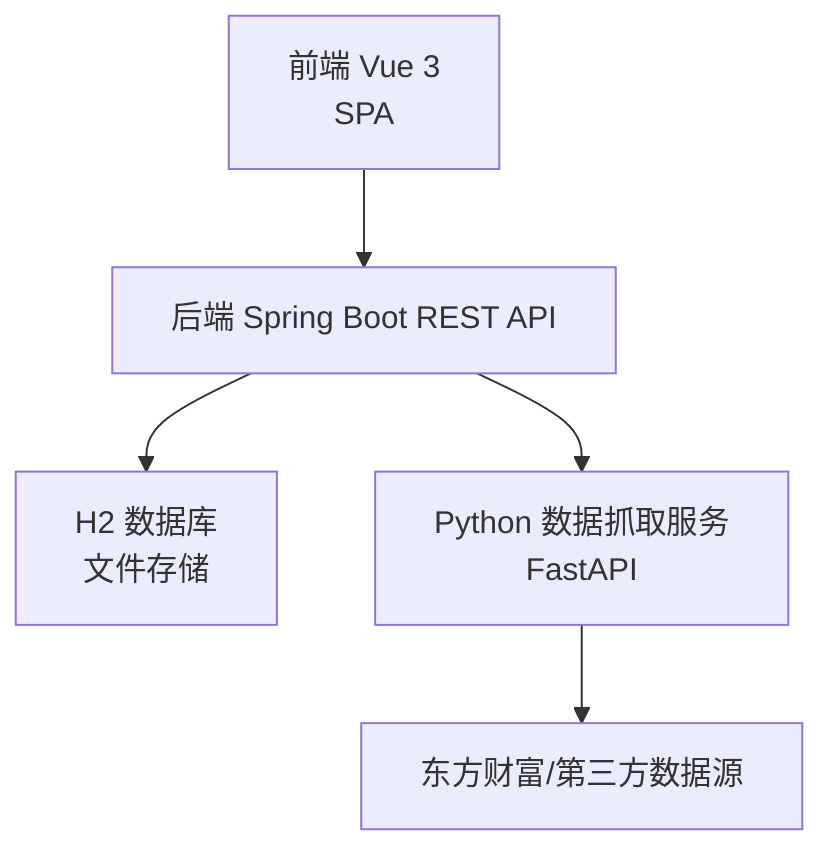
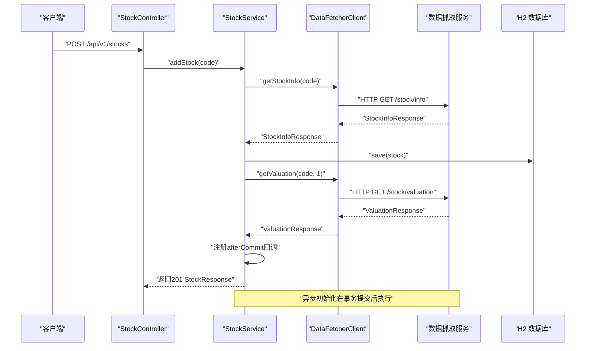
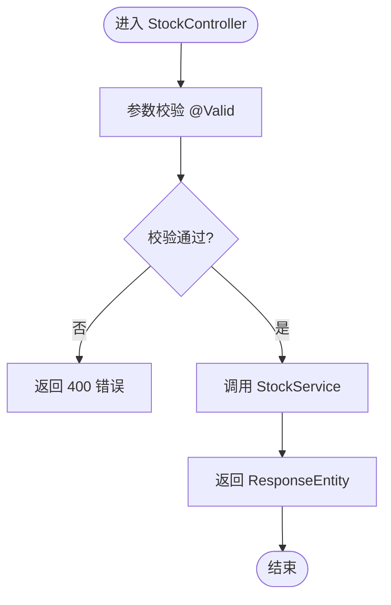
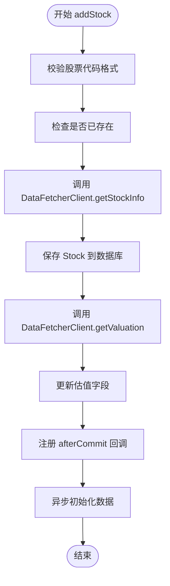
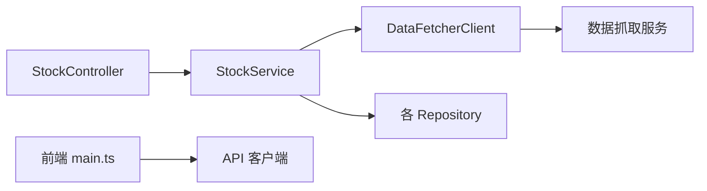

# 代码审查

<cite>
**本文引用的文件**
- [StockApplication.java](file://backend/src/main/java/com/stock/StockApplication.java)
- [DataFetcherClient.java](file://backend/src/main/java/com/stock/client/DataFetcherClient.java)
- [StockController.java](file://backend/src/main/java/com/stock/controller/StockController.java)
- [StockService.java](file://backend/src/main/java/com/stock/service/StockService.java)
- [GlobalExceptionHandler.java](file://backend/src/main/java/com/stock/exception/GlobalExceptionHandler.java)
- [HtmlSanitizer.java](file://backend/src/main/java/com/stock/util/HtmlSanitizer.java)
- [application.yml](file://backend/src/main/resources/application.yml)
- [pom.xml](file://backend/pom.xml)
- [app.py](file://data-fetcher/app.py)
- [requirements.txt](file://data-fetcher/requirements.txt)
- [package.json](file://frontend/package.json)
- [main.ts](file://frontend/src/main.ts)
- [StockControllerTest.java](file://backend/src/test/java/com/stock/controller/StockControllerTest.java)
- [SKILL.md](file://system-planner/SKILL.md)
- [api-design.md](file://system-planner/api-design.md)
- [data-fetcher.md](file://system-planner/data-fetcher.md)
</cite>

## 目录
1. [简介](#简介)
2. [项目结构](#项目结构)
3. [核心组件](#核心组件)
4. [架构总览](#架构总览)
5. [详细组件分析](#详细组件分析)
6. [依赖分析](#依赖分析)
7. [性能考量](#性能考量)
8. [故障排查指南](#故障排查指南)
9. [结论](#结论)
10. [附录](#附录)

## 简介
本审查文档面向“股票交易分析系统”的后端、前端与数据抓取服务，旨在建立一套可落地的代码审查标准、清单与流程，覆盖代码质量、安全与性能；并配套反馈机制、审查模板与常见问题处理建议。审查对象包括但不限于控制器、服务层、客户端适配器、异常处理、配置与测试。

## 项目结构
系统采用三层架构：前端 Vue 3 SPA、后端 Spring Boot REST API、Python 数据抓取服务，数据持久化使用 H2 文件数据库。后端通过 HTTP 调用数据抓取服务，控制器负责对外暴露 API，服务层编排业务与数据初始化，客户端适配器封装外部调用，全局异常处理器统一错误响应。

图表来源
- [StockApplication.java:1-16](file://backend/src/main/java/com/stock/StockApplication.java#L1-L16)
- [app.py:1-31](file://data-fetcher/app.py#L1-L31)
- [application.yml:1-28](file://backend/src/main/resources/application.yml#L1-L28)

章节来源
- [StockApplication.java:1-16](file://backend/src/main/java/com/stock/StockApplication.java#L1-L16)
- [app.py:1-31](file://data-fetcher/app.py#L1-L31)
- [application.yml:1-28](file://backend/src/main/resources/application.yml#L1-L28)
- [SKILL.md:22-36](file://system-planner/SKILL.md#L22-L36)

## 核心组件
- 启动类与调度：启用调度与异步，支撑定时任务与异步初始化。
- 控制器：暴露股票相关 REST 接口，处理请求与响应。
- 服务层：编排业务逻辑、事务控制、调用数据抓取客户端与初始化服务。
- 客户端适配器：封装对外部数据抓取服务的 HTTP 调用，统一异常处理。
- 全局异常处理：统一错误响应格式，便于前后端一致处理。
- HTML 清洗工具：对富文本输入进行白名单清洗，降低 XSS 风险。
- 配置：后端端口、数据源、JPA、定时任务表达式与数据抓取服务地址。
- 依赖：后端使用 Spring Web、JPA、验证、H2、OWASP HTML Sanitizer、测试依赖；前端使用 Vue 3、Pinia、Vue Router、Axios；数据抓取服务使用 FastAPI、Uvicorn、AKShare、Pandas、Requests。

章节来源
- [StockApplication.java:1-16](file://backend/src/main/java/com/stock/StockApplication.java#L1-L16)
- [StockController.java:1-57](file://backend/src/main/java/com/stock/controller/StockController.java#L1-L57)
- [StockService.java:1-243](file://backend/src/main/java/com/stock/service/StockService.java#L1-L243)
- [DataFetcherClient.java:1-126](file://backend/src/main/java/com/stock/client/DataFetcherClient.java#L1-L126)
- [GlobalExceptionHandler.java:1-33](file://backend/src/main/java/com/stock/exception/GlobalExceptionHandler.java#L1-L33)
- [HtmlSanitizer.java:1-15](file://backend/src/main/java/com/stock/util/HtmlSanitizer.java#L1-L15)
- [application.yml:1-28](file://backend/src/main/resources/application.yml#L1-L28)
- [pom.xml:1-103](file://backend/pom.xml#L1-L103)
- [package.json:1-27](file://frontend/package.json#L1-L27)
- [main.ts:1-11](file://frontend/src/main.ts#L1-L11)
- [requirements.txt:1-7](file://data-fetcher/requirements.txt#L1-L7)

## 架构总览
后端通过 DataFetcherClient 统一调用数据抓取服务，服务层在添加股票时同步获取基本信息与估值，并在事务提交后异步触发初始化流程，避免异步线程读取不到刚写入的数据。全局异常处理器保证错误响应一致性。前端通过 Axios 调用后端 API，Pinia 管理状态，Vue Router 管理页面路由。

图表来源
- [StockController.java:29-34](file://backend/src/main/java/com/stock/controller/StockController.java#L29-L34)
- [StockService.java:93-163](file://backend/src/main/java/com/stock/service/StockService.java#L93-L163)
- [DataFetcherClient.java:26-93](file://backend/src/main/java/com/stock/client/DataFetcherClient.java#L26-L93)
- [app.py:1-31](file://data-fetcher/app.py#L1-L31)

章节来源
- [StockController.java:1-57](file://backend/src/main/java/com/stock/controller/StockController.java#L1-L57)
- [StockService.java:1-243](file://backend/src/main/java/com/stock/service/StockService.java#L1-L243)
- [DataFetcherClient.java:1-126](file://backend/src/main/java/com/stock/client/DataFetcherClient.java#L1-L126)
- [app.py:1-31](file://data-fetcher/app.py#L1-L31)

## 详细组件分析

### 组件一：StockController（控制器）
- 职责：接收请求、参数校验、调用服务层、返回响应。
- 审查要点：
  - 参数校验是否完整（@Valid 是否覆盖所有必填字段）。
  - 响应状态码是否符合 REST 语义（创建资源使用 201）。
  - 路径变量与查询参数命名一致性与可读性。
  - 是否遗漏对空集合的处理（如列表接口）。
- 安全检查：
  - 是否对输入进行最小权限校验（如股票代码格式）。
  - 是否防止路径遍历与注入（本例为数值 ID，风险较低）。
- 性能考虑：
  - 列表接口是否返回必要字段，避免冗余数据。
  - 是否存在不必要的二次查询或 N+1 问题（当前为单表查询，无明显风险）。

图表来源
- [StockController.java:29-55](file://backend/src/main/java/com/stock/controller/StockController.java#L29-L55)

章节来源
- [StockController.java:1-57](file://backend/src/main/java/com/stock/controller/StockController.java#L1-L57)
- [StockControllerTest.java:51-114](file://backend/src/test/java/com/stock/controller/StockControllerTest.java#L51-L114)

### 组件二：StockService（服务层）
- 职责：业务编排、事务控制、调用数据抓取客户端、触发异步初始化。
- 审查要点：
  - 事务边界是否合理（添加/删除股票涉及多表级联，需在事务内完成）。
  - 股票代码格式校验与重复校验是否前置。
  - 异步初始化是否在事务提交后触发，避免并发读取不到最新数据。
  - 异常捕获与降级处理（估值获取失败是否记录日志并继续流程）。
- 安全检查：
  - 外部调用返回空值时是否抛出 DataFetchException 或进行降级。
  - 对外部返回数据进行空值保护（如 info.name）。
- 性能考虑：
  - 初始化步骤间 500ms 间隔是否满足限流要求。
  - 批量删除是否考虑级联删除顺序与性能。

图表来源
- [StockService.java:93-163](file://backend/src/main/java/com/stock/service/StockService.java#L93-L163)

章节来源
- [StockService.java:1-243](file://backend/src/main/java/com/stock/service/StockService.java#L1-L243)

### 组件三：DataFetcherClient（外部客户端）
- 职责：封装对数据抓取服务的 HTTP 调用，统一异常处理。
- 审查要点：
  - URL 拼接是否健壮（参数名与占位符匹配）。
  - 批量请求时对空集合的处理（避免空请求）。
  - call 方法是否捕获并转换为 DataFetchException。
- 安全检查：
  - 是否对返回结果进行空值校验（null 则抛异常）。
  - 是否避免在日志中泄露敏感参数。
- 性能考虑：
  - 是否使用合适的超时与重试策略（由配置与数据抓取服务共同决定）。

章节来源
- [DataFetcherClient.java:1-126](file://backend/src/main/java/com/stock/client/DataFetcherClient.java#L1-L126)

### 组件四：全局异常处理
- 职责：统一捕获业务异常与参数校验异常，返回标准化错误响应。
- 审查要点：
  - 错误码与消息是否清晰、一致。
  - 是否覆盖所有关键异常类型（股票不存在、重复、无效代码、数据抓取失败）。
  - 参数校验异常是否返回具体字段提示。
- 安全检查：
  - 错误响应不泄露内部堆栈细节。
- 性能考虑：
  - 异常处理不应引入额外 IO 或长耗时操作。

章节来源
- [GlobalExceptionHandler.java:1-33](file://backend/src/main/java/com/stock/exception/GlobalExceptionHandler.java#L1-L33)

### 组件五：HTML 清洗工具
- 职责：对富文本输入进行白名单清洗，降低 XSS 风险。
- 审查要点：
  - 白名单元素是否覆盖常用富文本标签。
  - 是否对 null 输入进行空值保护。
- 安全检查：
  - 是否与表单校验结合，避免绕过。
- 性能考虑：
  - 清洗算法复杂度是否可接受（当前为固定策略，开销较小）。

章节来源
- [HtmlSanitizer.java:1-15](file://backend/src/main/java/com/stock/util/HtmlSanitizer.java#L1-L15)

### 组件六：配置与依赖
- 配置：
  - 数据源 URL、JPA DDL 自动更新、H2 控制台开启。
  - 数据抓取服务地址与定时任务表达式。
- 依赖：
  - 后端：Spring Web、JPA、验证、H2、OWASP HTML Sanitizer、测试依赖。
  - 前端：Vue 3、Pinia、Vue Router、Axios。
  - 数据抓取服务：FastAPI、Uvicorn、AKShare、Pandas、Requests。
- 审查要点：
  - 配置项是否与部署环境一致（端口、URL、CORS）。
  - 依赖版本是否锁定，避免冲突。
  - 测试依赖是否与生产依赖分离。

章节来源
- [application.yml:1-28](file://backend/src/main/resources/application.yml#L1-L28)
- [pom.xml:1-103](file://backend/pom.xml#L1-L103)
- [package.json:1-27](file://frontend/package.json#L1-L27)
- [requirements.txt:1-7](file://data-fetcher/requirements.txt#L1-L7)

## 依赖分析
- 后端依赖关系：控制器依赖服务层，服务层依赖客户端适配器与多个仓库；全局异常处理器为横切关注点。
- 前端依赖关系：应用挂载点 main.ts 使用 Vue、Pinia、Router；API 客户端位于 src/api。
- 数据抓取服务：FastAPI 应用包含多个路由模块，统一健康检查与跨域配置。

图表来源
- [StockController.java:1-57](file://backend/src/main/java/com/stock/controller/StockController.java#L1-L57)
- [StockService.java:1-91](file://backend/src/main/java/com/stock/service/StockService.java#L1-L91)
- [DataFetcherClient.java:1-24](file://backend/src/main/java/com/stock/client/DataFetcherClient.java#L1-L24)
- [main.ts:1-11](file://frontend/src/main.ts#L1-L11)

章节来源
- [StockController.java:1-57](file://backend/src/main/java/com/stock/controller/StockController.java#L1-L57)
- [StockService.java:1-91](file://backend/src/main/java/com/stock/service/StockService.java#L1-L91)
- [DataFetcherClient.java:1-24](file://backend/src/main/java/com/stock/client/DataFetcherClient.java#L1-L24)
- [main.ts:1-11](file://frontend/src/main.ts#L1-L11)

## 性能考量
- 外部调用限流：数据抓取服务要求接口间至少 500ms 间隔，批量请求限制 20 只，需在客户端适配器与服务层严格遵守。
- 异步初始化：添加股票后在事务提交后再触发初始化，避免并发读取不到最新数据，同时减少主请求延迟。
- 数据库查询：H2 在百万级以内性能稳定，建议为高频查询字段建立索引（如 stock_daily 的 trade_date、stock_id）。
- 前端渲染：K 线大数据量建议降采样，默认展示 1 年，避免卡顿。
- 缓存策略：实时行情缓存 10 秒，K 线 5 分钟，利润表/财务摘要 24 小时等，减少外部调用频率。

章节来源
- [data-fetcher.md:24-321](file://system-planner/data-fetcher.md#L24-L321)
- [StockService.java:145-160](file://backend/src/main/java/com/stock/service/StockService.java#L145-L160)
- [SKILL.md:646-655](file://system-planner/SKILL.md#L646-L655)

## 故障排查指南
- 常见错误与定位：
  - 股票代码格式错误：InvalidStockCodeException，检查输入格式与正则。
  - 股票已存在：DuplicateStockException，检查重复添加。
  - 股票不存在：StockNotFoundException，检查 ID 是否正确。
  - 数据抓取失败：DataFetchException，检查数据抓取服务健康状态与网络。
  - 参数校验失败：MethodArgumentNotValidException，查看字段提示。
- 排查步骤：
  - 查看全局异常处理器返回的错误码与消息。
  - 检查 DataFetcherClient 的调用日志与返回值。
  - 验证数据抓取服务 /health 与接口响应。
  - 核对 application.yml 中的配置项（端口、URL、定时任务）。
- 重复问题处理：
  - 建立问题分类与标签，记录相似问题的根因与修复方案。
  - 对外部接口失败设置指数退避与熔断策略（可在客户端适配器扩展）。

章节来源
- [GlobalExceptionHandler.java:1-33](file://backend/src/main/java/com/stock/exception/GlobalExceptionHandler.java#L1-L33)
- [DataFetcherClient.java:112-124](file://backend/src/main/java/com/stock/client/DataFetcherClient.java#L112-L124)
- [app.py:23-25](file://data-fetcher/app.py#L23-L25)
- [application.yml:1-28](file://backend/src/main/resources/application.yml#L1-L28)

## 结论
本系统在架构上清晰、职责分离良好，服务层通过事务与异步初始化保障数据一致性与用户体验。建议在后续迭代中强化客户端适配器的重试与熔断、完善参数校验与边界条件测试、加强日志与监控埋点，以进一步提升稳定性与可观测性。

## 附录

### 审查标准与清单
- 代码质量标准
  - 命名规范：类名、方法名、变量名语义明确，遵循驼峰或帕斯卡命名。
  - 结构清晰：单一职责、方法长度适中、嵌套层级合理。
  - 注释与文档：公共 API 与复杂逻辑具备说明，避免显而易见的注释。
  - 异常处理：区分业务异常与系统异常，错误响应统一。
- 安全检查要点
  - 输入校验：参数必填、范围、格式校验，避免注入与越界。
  - 输出编码：富文本输出进行 HTML 清洗，防止 XSS。
  - 配置安全：敏感信息不硬编码，使用环境变量或密钥管理。
  - 跨域与认证：CORS 配置最小授权，认证与鉴权策略明确。
- 性能考虑因素
  - 外部调用限流与退避，批量请求分批处理。
  - 数据库索引与查询优化，避免 N+1。
  - 前端渲染降采样与懒加载，缓存策略合理。
  - 异步初始化与事务边界，避免阻塞主流程。

### 审查清单（功能性验证）
- 控制器
  - 请求参数校验是否完整（@Valid、路径变量、查询参数）。
  - 响应状态码是否符合 REST 语义（200/201/204/4xx/5xx）。
  - 是否覆盖边界条件（空集合、空字符串、非法 ID）。
- 服务层
  - 事务边界是否正确（添加/删除涉及多表）。
  - 异步初始化是否在事务提交后触发。
  - 外部调用失败是否降级或抛出业务异常。
- 客户端适配器
  - URL 拼接与参数占位符是否一致。
  - 批量请求是否处理空集合。
  - 返回值空值保护与异常转换。
- 异常处理
  - 是否覆盖关键业务异常类型。
  - 错误响应格式是否统一。
- HTML 清洗
  - 白名单元素是否覆盖常用富文本标签。
  - null 输入是否安全处理。

### 审查流程与工具
- 审查流程
  - 准备：确定审查范围与目标，准备审查清单与模板。
  - 自查：开发者先行自查，记录潜在问题与改进点。
  - 评审：小组评审，聚焦代码质量、安全与性能。
  - 跟踪：记录问题与修复计划，形成闭环。
- 工具使用
  - 后端：SonarQube（静态分析与质量门禁）、SpotBugs（字节码分析）、Checkstyle/PMD（风格与规则检查）。
  - 前端：ESLint（JavaScript/Vue）、Stylelint（CSS）、Playwright（端到端测试）。
  - 数据抓取服务：pytest（接口与数据转换测试）、Black/Flake8（代码风格）。
  - 配置与依赖：OWASP Dependency-Check（漏洞扫描）、Maven Enforcer（依赖规则）。

### 反馈机制
- 建设性反馈原则
  - 具体描述问题与影响，提供修改建议与替代方案。
  - 以事实为依据，避免主观臆断；关注行为而非个人。
- 问题跟踪
  - 使用 Issue 模板记录问题类型、严重程度、影响范围与修复优先级。
  - 对重复问题建立根因分析与知识库沉淀。
- 重复问题处理
  - 建立问题分类与标签体系，定期回顾与复盘。
  - 对高频问题制定自动化检查或重构计划。

### 审查模板（示例）
- 问题类型：[功能性/安全性/性能/可维护性]
- 涉及文件：[路径与行号]
- 描述：[简要说明问题]
- 影响：[对功能/性能/安全的影响]
- 建议修复：[具体修改建议]
- 验证方法：[如何验证修复效果]

### 常见问题类型及解决方案
- 外部接口超时/限流
  - 现象：DataFetchException 或 503 错误。
  - 解决：在客户端适配器增加重试与退避；在服务层进行降级处理。
- 股票代码格式错误
  - 现象：InvalidStockCodeException。
  - 解决：在控制器与服务层统一校验，返回明确错误提示。
- 参数校验失败
  - 现象：MethodArgumentNotValidException。
  - 解决：在全局异常处理器中返回字段级错误提示。
- HTML 注入风险
  - 现象：富文本显示异常或潜在 XSS。
  - 解决：使用 HtmlSanitizer 进行白名单清洗。

### 审查者责任与被审查者配合
- 审查者责任
  - 依据标准与清单逐项检查，提出建设性意见。
  - 关注安全与性能，推动问题闭环。
- 被审查者配合
  - 提供上下文与背景说明，协助定位问题。
  - 及时修复并验证，补充必要的测试与文档。

### 审查效率提升技巧
- 代码整洁度：保持方法短小、类职责单一，减少审查负担。
- 自动化：CI 中集成静态分析与测试，提前发现问题。
- 模板化：使用统一的审查模板与 Issue 模板，提高沟通效率。
- 分层审查：先审查高层架构与接口契约，再深入实现细节。