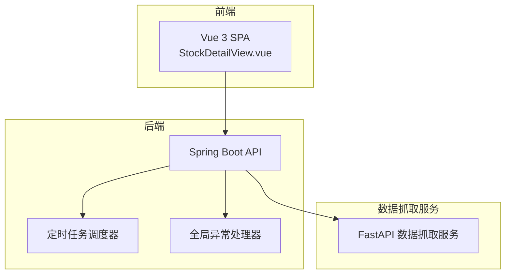
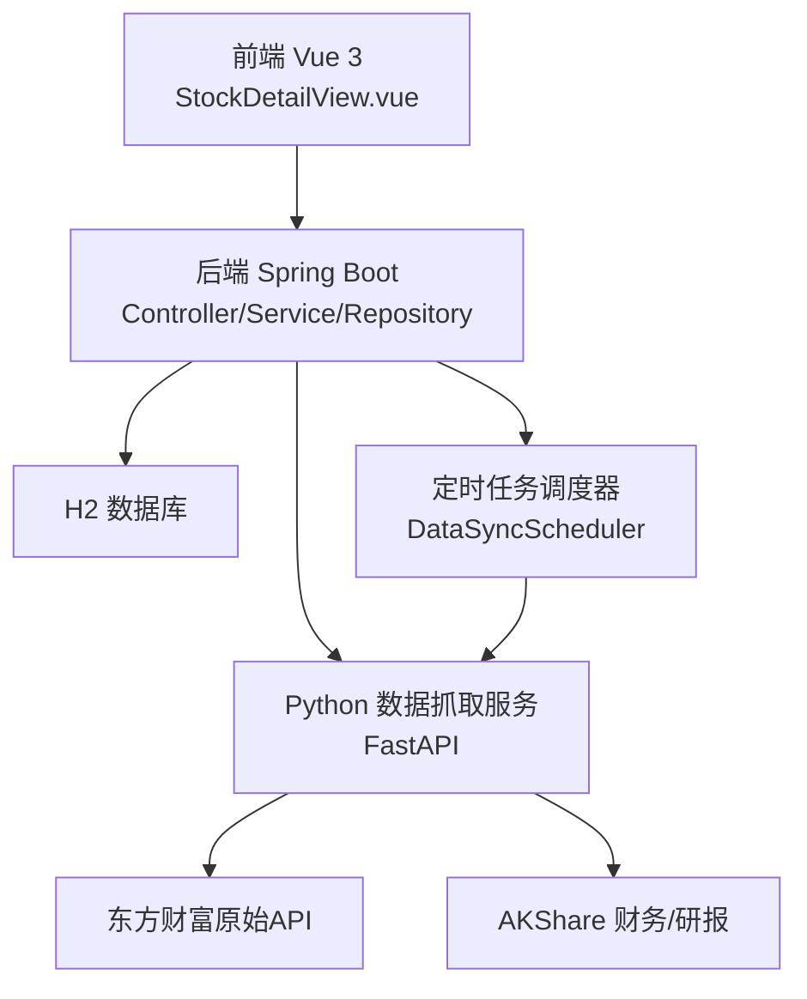
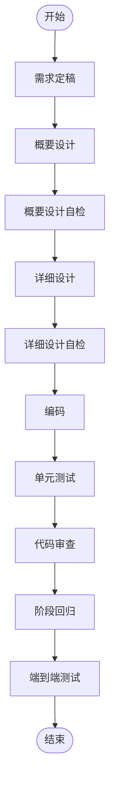
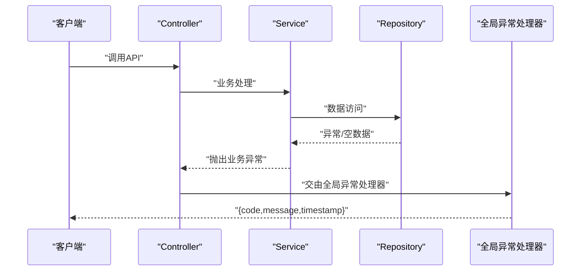
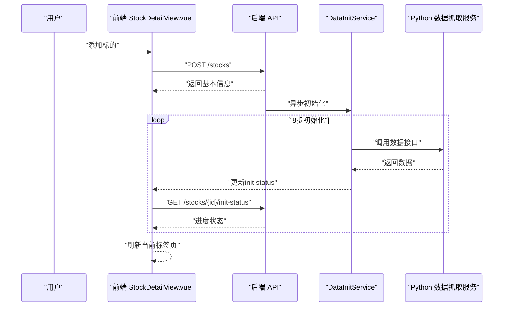
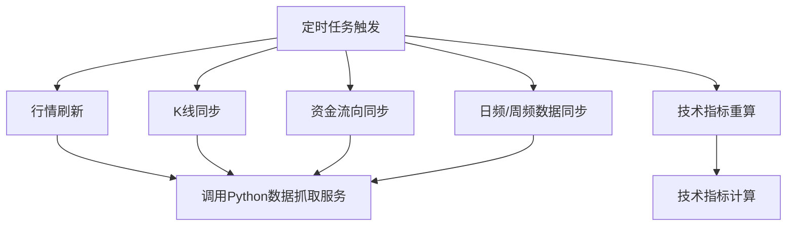
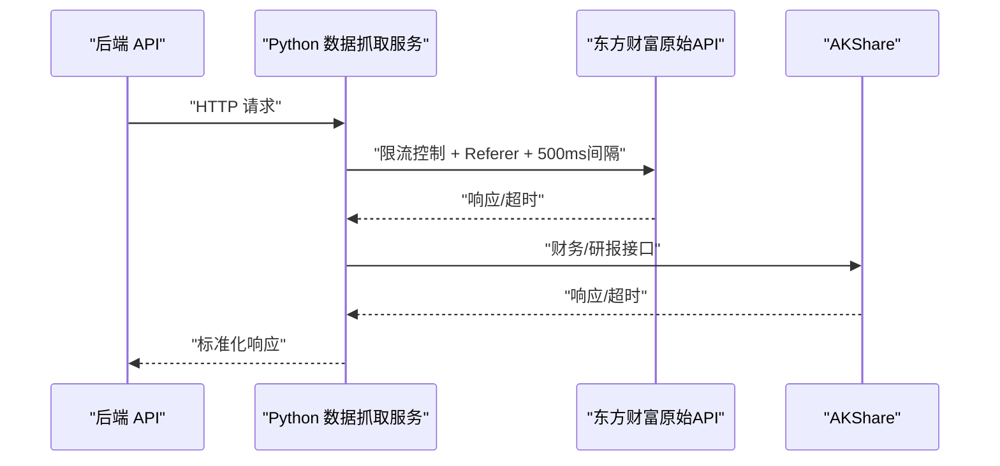
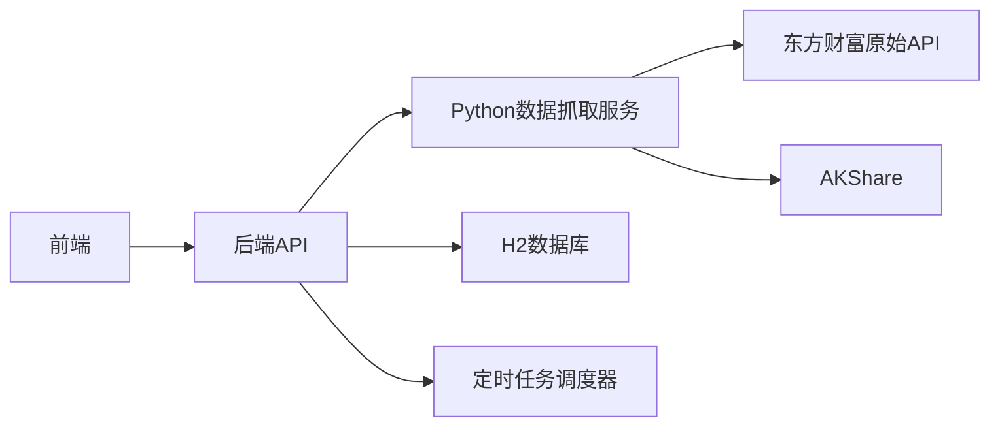

# 团队协作

<cite>
**本文引用的文件**
- [dev-workflow/SKILL.md](file://dev-workflow/SKILL.md)
- [system-planner/SKILL.md](file://system-planner/SKILL.md)
- [system-planner/high-level-design.md](file://system-planner/high-level-design.md)
- [system-planner/api-design.md](file://system-planner/api-design.md)
- [system-planner/detailed-design.md](file://system-planner/detailed-design.md)
- [system-planner/data-fetcher.md](file://system-planner/data-fetcher.md)
- [backend/src/main/java/com/stock/exception/GlobalExceptionHandler.java](file://backend/src/main/java/com/stock/exception/GlobalExceptionHandler.java)
- [backend/src/main/java/com/stock/scheduler/DataSyncScheduler.java](file://backend/src/main/java/com/stock/scheduler/DataSyncScheduler.java)
- [backend/src/main/java/com/stock/service/DataInitService.java](file://backend/src/main/java/com/stock/service/DataInitService.java)
- [frontend/src/views/StockDetailView.vue](file://frontend/src/views/StockDetailView.vue)
- [backend/src/test/java/com/stock/controller/StockControllerTest.java](file://backend/src/test/java/com/stock/controller/StockControllerTest.java)
- [data-fetcher/app.py](file://data-fetcher/app.py)
</cite>

## 目录
1. [简介](#简介)
2. [项目结构](#项目结构)
3. [核心组件](#核心组件)
4. [架构总览](#架构总览)
5. [详细组件分析](#详细组件分析)
6. [依赖分析](#依赖分析)
7. [性能考量](#性能考量)
8. [故障排查指南](#故障排查指南)
9. [结论](#结论)
10. [附录](#附录)

## 简介
本团队协作文档面向“股票分析系统”项目，围绕沟通机制、问题跟踪流程、知识管理策略、角色职责分工、决策流程、冲突解决机制、绩效评估标准展开，同时结合项目现有的开发流程规范、概要设计与详细设计文档，给出可落地的协作实践建议。文档还解释了协作工具使用（Jira、Confluence、Slack等）与远程协作最佳实践、团队文化建设要点，帮助跨职能团队高效协同、高质量交付。

## 项目结构
项目采用前后端分离与微服务化的数据抓取架构：
- 后端（Spring Boot）：提供REST API、定时任务、业务编排与异常处理。
- 前端（Vue 3 + Vite）：单页应用，负责数据展示、用户交互与状态管理。
- 数据抓取（Python FastAPI）：对外部数据源进行统一封装与限流控制，作为后端唯一数据入口。
- 系统规划与设计文档：贯穿开发流程，形成“需求—设计—实现—测试—上线”的闭环。

图表来源
- [system-planner/high-level-design.md:1-68](file://system-planner/high-level-design.md#L1-L68)
- [frontend/src/views/StockDetailView.vue:1-82](file://frontend/src/views/StockDetailView.vue#L1-L82)
- [backend/src/main/java/com/stock/scheduler/DataSyncScheduler.java:1-238](file://backend/src/main/java/com/stock/scheduler/DataSyncScheduler.java#L1-L238)
- [backend/src/main/java/com/stock/exception/GlobalExceptionHandler.java:1-33](file://backend/src/main/java/com/stock/exception/GlobalExceptionHandler.java#L1-L33)
- [data-fetcher/app.py:1-31](file://data-fetcher/app.py#L1-L31)

章节来源
- [system-planner/high-level-design.md:1-68](file://system-planner/high-level-design.md#L1-L68)

## 核心组件
- 开发流程规范：定义从需求到上线的12步流程，强调“文档先行、不跳步、追溯联动、测试同步、变更记录”，确保质量与可追溯性。
- 系统规划与设计：提供概要设计、详细设计、API设计、数据抓取服务设计，形成端到端的设计与实现依据。
- 异常与可观测性：统一异常处理、日志策略、定时任务监控，保障系统稳定性与可运维性。
- 前后端契约：明确API路径、参数、响应结构与错误格式，降低沟通成本与集成风险。

章节来源
- [dev-workflow/SKILL.md:1-131](file://dev-workflow/SKILL.md#L1-L131)
- [system-planner/SKILL.md:1-694](file://system-planner/SKILL.md#L1-L694)
- [system-planner/high-level-design.md:1-503](file://system-planner/high-level-design.md#L1-L503)
- [system-planner/api-design.md:1-688](file://system-planner/api-design.md#L1-L688)
- [system-planner/detailed-design.md:1-800](file://system-planner/detailed-design.md#L1-L800)
- [system-planner/data-fetcher.md:1-350](file://system-planner/data-fetcher.md#L1-L350)
- [backend/src/main/java/com/stock/exception/GlobalExceptionHandler.java:1-33](file://backend/src/main/java/com/stock/exception/GlobalExceptionHandler.java#L1-L33)

## 架构总览
系统采用“前端SPA + 后端REST + Python数据抓取服务”的三层架构，后端通过定时任务与业务编排实现数据同步与指标计算，前端通过轮询与组件化实现渐进式数据加载与交互体验。

图表来源
- [system-planner/high-level-design.md:1-68](file://system-planner/high-level-design.md#L1-L68)
- [backend/src/main/java/com/stock/scheduler/DataSyncScheduler.java:1-238](file://backend/src/main/java/com/stock/scheduler/DataSyncScheduler.java#L1-L238)
- [data-fetcher/app.py:1-31](file://data-fetcher/app.py#L1-L31)

章节来源
- [system-planner/high-level-design.md:1-68](file://system-planner/high-level-design.md#L1-L68)

## 详细组件分析

### 组件A：开发流程与质量门禁
- 流程步骤：需求定稿 → 概要设计 → 概要设计自检 → 详细设计 → 详细设计自检 → 编码 → 单元测试 → 代码审查 → 阶段回归 → E2E测试。
- 质量门禁：文档先行、不跳步、追溯联动、测试同步、变更记录。
- 适用场景：需求变更、设计评审、代码审查、回归测试、端到端验证。

图表来源
- [dev-workflow/SKILL.md:10-131](file://dev-workflow/SKILL.md#L10-L131)

章节来源
- [dev-workflow/SKILL.md:1-131](file://dev-workflow/SKILL.md#L1-L131)

### 组件B：异常处理与统一错误响应
- 全局异常处理器：针对业务异常与参数校验异常，统一返回标准化错误响应。
- 错误响应格式：包含code、message、timestamp，便于前端统一处理与用户提示。
- 适用场景：API调用失败、资源不存在、参数校验失败、数据源不可用等。

图表来源
- [backend/src/main/java/com/stock/exception/GlobalExceptionHandler.java:1-33](file://backend/src/main/java/com/stock/exception/GlobalExceptionHandler.java#L1-L33)
- [system-planner/api-design.md:666-688](file://system-planner/api-design.md#L666-L688)

章节来源
- [backend/src/main/java/com/stock/exception/GlobalExceptionHandler.java:1-33](file://backend/src/main/java/com/stock/exception/GlobalExceptionHandler.java#L1-L33)
- [system-planner/api-design.md:666-688](file://system-planner/api-design.md#L666-L688)

### 组件C：数据初始化与前端轮询
- 异步初始化：添加标的后，后端异步执行初始化步骤（估值、K线、资金流向、利润表、财务摘要、股东、研报、技术指标），前端轮询进度。
- 前端体验：骨架屏 + 进度条 + 步骤状态，初始化完成后刷新当前标签页。
- 适用场景：标的添加、竞品初始化、数据加载体验优化。

图表来源
- [system-planner/api-design.md:68-101](file://system-planner/api-design.md#L68-L101)
- [frontend/src/views/StockDetailView.vue:1-82](file://frontend/src/views/StockDetailView.vue#L1-L82)
- [backend/src/main/java/com/stock/service/DataInitService.java:1-101](file://backend/src/main/java/com/stock/service/DataInitService.java#L1-L101)
- [system-planner/detailed-design.md:620-697](file://system-planner/detailed-design.md#L620-L697)

章节来源
- [system-planner/api-design.md:68-101](file://system-planner/api-design.md#L68-L101)
- [frontend/src/views/StockDetailView.vue:1-82](file://frontend/src/views/StockDetailView.vue#L1-L82)
- [backend/src/main/java/com/stock/service/DataInitService.java:1-101](file://backend/src/main/java/com/stock/service/DataInitService.java#L1-L101)
- [system-planner/detailed-design.md:620-697](file://system-planner/detailed-design.md#L620-L697)

### 组件D：定时任务与数据同步
- 定时任务：行情刷新、K线同步、资金流向同步、日频/周频数据同步、技术指标重算。
- 同步策略：按数据类型与频率设定，利用限流与退避策略保障稳定性。
- 适用场景：自动化数据更新、信号检测、预警触发、指标计算。

图表来源
- [backend/src/main/java/com/stock/scheduler/DataSyncScheduler.java:1-238](file://backend/src/main/java/com/stock/scheduler/DataSyncScheduler.java#L1-L238)
- [system-planner/SKILL.md:358-401](file://system-planner/SKILL.md#L358-L401)

章节来源
- [backend/src/main/java/com/stock/scheduler/DataSyncScheduler.java:1-238](file://backend/src/main/java/com/stock/scheduler/DataSyncScheduler.java#L1-L238)
- [system-planner/SKILL.md:358-401](file://system-planner/SKILL.md#L358-L401)

### 组件E：数据抓取服务与限流策略
- 服务职责：统一封装东方财富原始API与AKShare，提供限流、重试、缓存与错误处理。
- 限流与退避：同一时刻仅1个请求，500ms间隔，遇到断连指数退避。
- 适用场景：外部数据源接入、批量请求、降级方案与容错。

图表来源
- [system-planner/data-fetcher.md:1-350](file://system-planner/data-fetcher.md#L1-L350)
- [data-fetcher/app.py:1-31](file://data-fetcher/app.py#L1-L31)

章节来源
- [system-planner/data-fetcher.md:1-350](file://system-planner/data-fetcher.md#L1-L350)
- [data-fetcher/app.py:1-31](file://data-fetcher/app.py#L1-L31)

## 依赖分析
- 前端依赖后端API契约，后端依赖Python数据抓取服务，Python服务依赖外部数据源。
- 后端内部模块通过Controller/Service/Repository分层解耦，定时任务与业务编排相互独立。
- 设计文档与实现文档双向追溯，确保变更可追踪、可审计。

图表来源
- [system-planner/high-level-design.md:1-68](file://system-planner/high-level-design.md#L1-L68)
- [system-planner/api-design.md:1-688](file://system-planner/api-design.md#L1-L688)
- [system-planner/data-fetcher.md:1-350](file://system-planner/data-fetcher.md#L1-L350)

章节来源
- [system-planner/high-level-design.md:1-68](file://system-planner/high-level-design.md#L1-L68)
- [system-planner/api-design.md:1-688](file://system-planner/api-design.md#L1-L688)
- [system-planner/data-fetcher.md:1-350](file://system-planner/data-fetcher.md#L1-L350)

## 性能考量
- 后端：H2文件存储、索引优化、JPA查询优化、定时任务批处理。
- 前端：骨架屏、渐进式数据加载、组件懒加载、状态管理优化。
- 数据抓取：限流与退避、批量请求上限、缓存策略、降级方案。
- 测试：单元测试覆盖率目标、端到端测试范围、阶段回归保障。

章节来源
- [system-planner/SKILL.md:520-554](file://system-planner/SKILL.md#L520-L554)
- [system-planner/SKILL.md:418-436](file://system-planner/SKILL.md#L418-L436)
- [system-planner/SKILL.md:512-520](file://system-planner/SKILL.md#L512-L520)

## 故障排查指南
- 异常处理：统一错误响应格式，便于前端与监控系统识别与处理。
- 日志策略：后端INFO级别、Python INFO级别、前端WARN级别，关键路径记录。
- 定时任务：记录执行时间与结果，异常时告警与重试。
- 数据初始化：前端轮询init-status，失败步骤定位与重试。
- 外部接口：超时/断连/限流处理，指数退避与降级方案。

章节来源
- [backend/src/main/java/com/stock/exception/GlobalExceptionHandler.java:1-33](file://backend/src/main/java/com/stock/exception/GlobalExceptionHandler.java#L1-L33)
- [system-planner/SKILL.md:512-520](file://system-planner/SKILL.md#L512-L520)
- [system-planner/SKILL.md:418-436](file://system-planner/SKILL.md#L418-L436)
- [system-planner/api-design.md:666-688](file://system-planner/api-design.md#L666-L688)

## 结论
本项目已具备完善的开发流程、系统设计与质量保障机制。团队协作应围绕“流程规范、文档驱动、测试先行、可观测性”展开，结合现有设计文档与实现细节，建立清晰的角色分工、问题跟踪与知识管理策略，持续优化远程协作与团队文化，确保高质量交付与长期可维护性。

## 附录

### 团队协作与沟通机制
- 日常站会：每日固定时间同步进展、阻塞问题与风险，控制在15分钟内。
- 周会：每周回顾进度、评审需求变更、规划下周任务，记录会议纪要。
- 异步沟通：使用即时通讯工具（如Slack）进行快速讨论与问题澄清，重要决策沉淀至文档。
- 决策流程：重大技术决策需在概要设计阶段评审，形成决策记录与风险评估。
- 冲突解决：遵循“事实导向、数据支撑、最小可行方案”，必要时升级至技术负责人。
- 绩效评估：以任务完成度、代码质量、测试覆盖率、问题解决时效与协作贡献为指标。

### 问题跟踪流程
- 缺陷管理：使用问题跟踪系统（如Jira）登记缺陷，明确严重级别、重现步骤、期望结果与实际结果。
- 需求跟踪：需求冻结后变更走变更流程，记录原因、影响范围与追溯矩阵。
- 变更控制：每次变更需更新设计文档与测试用例，执行回归测试并通过质量门禁。

### 知识管理策略
- 文档维护：需求、设计、API、数据抓取服务文档集中管理，版本化与可追溯。
- 经验分享：定期组织技术分享会，沉淀最佳实践与常见问题解决方案。
- 培训计划：新成员入职培训包含开发流程、技术栈与工具使用，老成员定期复盘与提升。

### 协作工具使用建议
- Jira：需求与缺陷管理，设置工作流与看板，启用自动化通知。
- Confluence：团队知识库，存放流程规范、设计文档、会议纪要与最佳实践。
- Slack：日常沟通与快速问题澄清，重要讨论转为异步文档沉淀。
- Git/GitHub：代码托管与协作，分支策略与合并规范，强制代码审查与CI检查。

### 远程协作最佳实践
- 透明沟通：公开任务状态与阻塞问题，使用共享看板与日历。
- 文档优先：口头沟通尽量转化为书面文档，确保信息可检索与可追溯。
- 时间同步：跨时区团队协调会议时间，尊重时差差异。
- 工具统一：统一使用协作工具与模板，减少上下文切换成本。

### 团队文化建设
- 信任与尊重：鼓励开放反馈与建设性批评，营造安全的试错环境。
- 成长导向：关注个人成长与技能提升，提供学习资源与实践机会。
- 共享责任：共同维护代码质量与系统稳定性，跨职能协作解决问题。
- 正向激励：认可优秀贡献与团队协作，庆祝里程碑与阶段性成果。