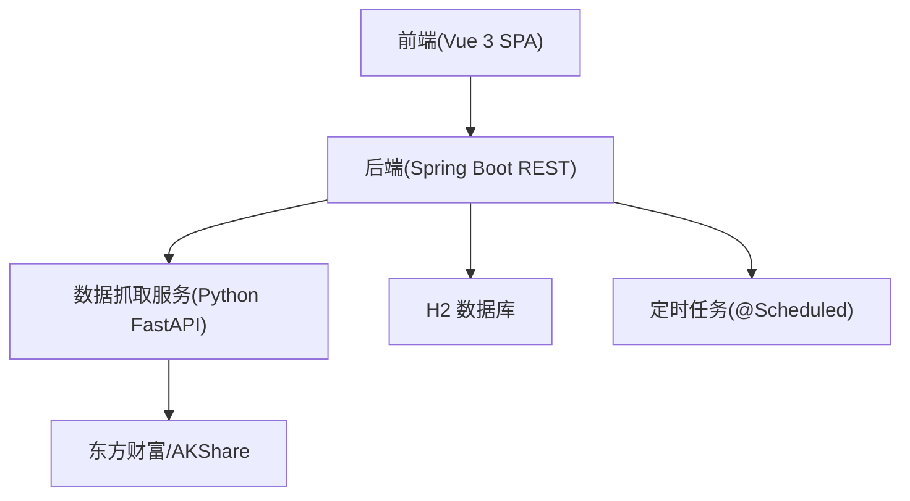
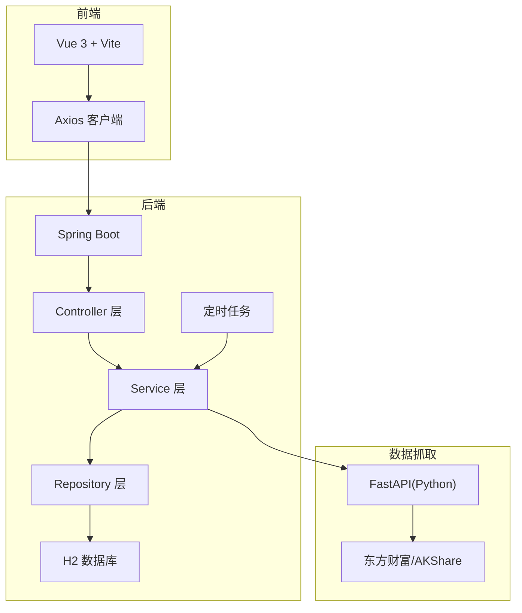
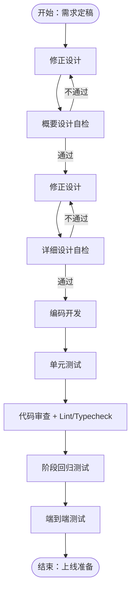
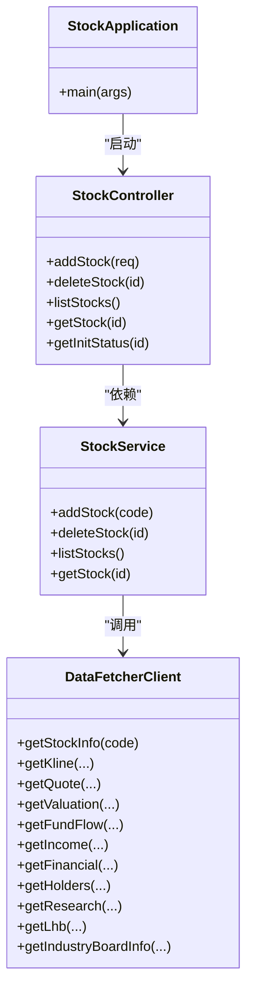

# 开发流程

<cite>
**本文引用的文件**
- [dev-workflow\SKILL.md](file://dev-workflow\SKILL.md)
- [system-planner\SKILL.md](file://system-planner\SKILL.md)
- [system-planner\api-design.md](file://system-planner\api-design.md)
- [system-planner\high-level-design.md](file://system-planner\high-level-design.md)
- [system-planner\detailed-design.md](file://system-planner\detailed-design.md)
- [system-planner\hld-checklist\SKILL.md](file://system-planner\hld-checklist\SKILL.md)
- [system-planner\dd-checklist\SKILL.md](file://system-planner\dd-checklist\SKILL.md)
- [backend\src\main\java\com\stock\StockApplication.java](file://backend\src\main\java\com\stock\StockApplication.java)
- [backend\pom.xml](file://backend\pom.xml)
- [backend\src\main\resources\application.yml](file://backend\src\main\resources\application.yml)
- [backend\src\main\java\com\stock\controller\StockController.java](file://backend\src\main\java\com\stock\controller\StockController.java)
- [backend\src\main\java\com\stock\service\StockService.java](file://backend\src\main\java\com\stock\service\StockService.java)
- [frontend\package.json](file://frontend\package.json)
- [data-fetcher\requirements.txt](file://data-fetcher\requirements.txt)
</cite>

## 目录
1. [简介](#简介)
2. [项目结构](#项目结构)
3. [核心组件](#核心组件)
4. [架构总览](#架构总览)
5. [详细组件分析](#详细组件分析)
6. [依赖分析](#依赖分析)
7. [性能考量](#性能考量)
8. [故障排查指南](#故障排查指南)
9. [结论](#结论)
10. [附录](#附录)

## 简介
本开发流程文档面向“股票分析系统”项目，围绕从需求到上线的全流程质量保障，提供标准化的开发流程、Git 工作流、代码审查标准、新功能开发流程、团队协作与问题跟踪机制，以及开发环境配置与版本控制最佳实践。文档以系统规划与设计文档为基础，结合后端 Spring Boot、前端 Vue 3、Python 数据抓取服务的实现现状，形成可落地的工程化规范。

## 项目结构
项目采用多模块组织：后端（Spring Boot）、前端（Vue 3 + Vite）、数据抓取（Python FastAPI）、系统规划与检查清单（system-planner）。各模块职责清晰，通过 REST API 与 HTTP 服务交互，配合定时任务与异步初始化流程，实现从外部数据源到前端展示的完整链路。

**图表来源**
- [system-planner\high-level-design.md](file://system-planner\high-level-design.md)
- [system-planner\SKILL.md](file://system-planner\SKILL.md)

**章节来源**
- [system-planner\SKILL.md](file://system-planner\SKILL.md)
- [system-planner\high-level-design.md](file://system-planner\high-level-design.md)

## 核心组件
- 后端应用入口与配置
  - 应用入口启用调度与异步，便于定时任务与异步初始化。
  - 数据源与 JPA 配置、H2 控制台、定时任务 Cron 表达式集中于配置文件。
- 核心控制器与服务
  - 标的控制器提供增删改查与初始化状态查询。
  - 标的服务负责股票校验、信息入库、估值同步与异步初始化触发。
- 前端与测试
  - 前端依赖 Vue 3、Pinia、Vue Router、Axios，脚手架使用 Vite。
  - Playwright 用于端到端测试，Vitest 用于组件与 Store 测试。
- 数据抓取服务
  - Python 服务封装东方财富与 AKShare 接口，提供限流、缓存与字段映射。

**章节来源**
- [backend\src\main\java\com\stock\StockApplication.java](file://backend\src\main\java\com\stock\StockApplication.java)
- [backend\src\main\resources\application.yml](file://backend\src\main\resources\application.yml)
- [backend\src\main\java\com\stock\controller\StockController.java](file://backend\src\main\java\com\stock\controller\StockController.java)
- [backend\src\main\java\com\stock\service\StockService.java](file://backend\src\main\java\com\stock\service\StockService.java)
- [frontend\package.json](file://frontend\package.json)
- [data-fetcher\requirements.txt](file://data-fetcher\requirements.txt)

## 架构总览
系统采用三层架构：前端负责展示与交互，后端负责业务逻辑与数据持久化，Python 服务负责外部数据抓取与转换。后端通过 DataFetcherClient 统一调用 Python 服务，定时任务负责增量同步与指标重算，前端通过轮询获取初始化进度。

**图表来源**
- [system-planner\high-level-design.md](file://system-planner\high-level-design.md)
- [system-planner\SKILL.md](file://system-planner\SKILL.md)

## 详细组件分析

### Git 工作流程与分支策略
- 分支模型
  - main：发布分支，保护分支，禁止直接推送。
  - develop：集成分支，合并特性分支后进行回归测试。
  - feature/*：功能开发分支，基于 develop 创建，完成后合并回 develop。
  - hotfix/*：紧急修复分支，基于 main 创建，修复后同时合并回 main 与 develop。
- 提交规范
  - 类型限定：feat、fix、docs、style、refactor、test、chore、perf、ci。
  - 格式：type(scope): subject；subject 首字母小写，不以句号结尾。
  - 说明：简短描述 + 详细说明（必要时），引用 Issue 编号。
- 合并流程
  - PR 必须通过 CI 与代码审查，至少一名 reviewer 同意。
  - 合并前需满足：通过单元/集成测试、无新增告警、文档更新、变更日志记录。

**章节来源**
- [dev-workflow\SKILL.md](file://dev-workflow\SKILL.md)

### 代码审查标准
- 审查清单
  - 架构一致性：是否符合概要设计与模块边界。
  - 接口契约：前后端接口、后端与 Python 服务接口是否一致。
  - 数据流完整性：自动/手动数据链路是否闭环。
  - 方法签名与 DTO：参数、返回值、校验注解是否与 API 设计一致。
  - 字段映射与精度：Python→Java 字段映射与精度处理是否正确。
  - SQL 合理性：主键、外键、唯一约束、索引、CHECK 约束是否合理。
  - 可追溯性：详细设计与概要设计、需求的追溯矩阵是否完整。
  - 错误处理：全局异常、业务异常、统一错误响应是否一致。
- 质量标准
  - 单元测试覆盖率目标：Service 层 80%+。
  - 集成测试覆盖所有 API 端点。
  - 代码风格：Java（Checkstyle/SpotBugs）、Python（Ruff/Flake8）、JS（ESLint）。
  - 类型检查：Java（编译）、Python（mypy）、TS（tsc）。
- 反馈机制
  - PR 评论与线程讨论，明确问题与修改建议。
  - 重大设计变更需在系统规划组内讨论并通过。

**章节来源**
- [system-planner\hld-checklist\SKILL.md](file://system-planner\hld-checklist\SKILL.md)
- [system-planner\dd-checklist\SKILL.md](file://system-planner\dd-checklist\SKILL.md)
- [system-planner\SKILL.md](file://system-planner\SKILL.md)

### 新功能开发流程
- 需求定稿
  - 使用系统规划技能，完成需求自检与风险项确认，冻结需求文档。
- 概要设计
  - 输出高阶设计文档，包含架构图、模块划分、接口契约、数据流图与技术选型理由。
- 概要设计自检
  - 使用 HLD 自检清单，逐项检查架构合理性、接口一致性、数据流完整性与需求一致性。
- 详细设计
  - 输出详细设计文档，包含类设计、方法签名、字段映射、SQL DDL、前端组件树与状态管理结构，并建立追溯矩阵。
- 详细设计自检
  - 使用 DD 自检清单，检查类职责单一性、方法签名完整性、字段映射正确性、SQL 合理性与与 API 设计一致性。
- 编码开发
  - 严格遵循详细设计，先文档后编码，设计问题先更新设计再编码。
- 单元测试
  - 后端 JUnit 5 + Mockito，前端 Vitest，Python pytest，测试与编码同步进行。
- 代码审查 + Lint/Typecheck
  - 运行 Lint 与 Typecheck，人工审查安全与性能隐患。
- 阶段回归测试
  - 每个阶段完成后运行全量测试，确保无回归。
- 端到端测试
  - 全系统完成后执行 Playwright 端到端测试，覆盖功能可达性、数据格式、CRUD、空数据/错误状态、跨页面一致性、表单校验、初始化流程、竞品联动、预警触发、导航与交互、数据过期标记等。

**图表来源**
- [dev-workflow\SKILL.md](file://dev-workflow\SKILL.md)
- [system-planner\SKILL.md](file://system-planner\SKILL.md)

**章节来源**
- [dev-workflow\SKILL.md](file://dev-workflow\SKILL.md)
- [system-planner\SKILL.md](file://system-planner\SKILL.md)

### 开发模板与检查清单
- 需求自检模板
  - 不通过项：已修复/未修复（需说明原因与责任人）
  - 有风险项：已接受/未接受（需记录应对方案）
  - 需求冻结：变更走需求变更流程，记录原因、影响范围与涉及文档
- 概要设计自检报告模板
  - 汇总：架构合理性、接口一致性、数据流完整性、与需求一致性、可扩展性、性能与可靠性
  - 逐项详情：每条检查的结论与说明
  - 必须修复项、建议改进项
- 详细设计自检报告模板
  - 汇总：类职责单一性、方法签名完整性、字段映射正确性、SQL 合理性、追溯完整性、API 一致性
  - 逐项详情与修复建议
- API 设计参考
  - 基础地址、端点、方法、请求/响应结构、错误码与业务异常

**章节来源**
- [system-planner\hld-checklist\SKILL.md](file://system-planner\hld-checklist\SKILL.md)
- [system-planner\dd-checklist\SKILL.md](file://system-planner\dd-checklist\SKILL.md)
- [system-planner\api-design.md](file://system-planner\api-design.md)

### 里程碑节点
- 阶段一：基础搭建 + 数据管道
  - 后端骨架、H2、标的 CRUD、Python 数据服务、自动拉取基本信息/行业/估值、单元测试、接口测试
- 阶段二：标的概览页
  - 自动数据总览页面、行情展示、估值、股东、研报、初始化状态、分析完成度、组件测试
- 阶段三：图表与指标
  - K 线图、技术指标计算、资金流向图、财务趋势图、指标计算测试
- 阶段四：手动数据框架
  - 产业分析编辑、主营构成录入、竞争力评估、竞品对比、投资笔记、数据校验
- 阶段五：预警与整合
  - 价格预警、资金异动、信号检测、分析报告导出、端到端测试

**章节来源**
- [system-planner\SKILL.md](file://system-planner\SKILL.md)

### 团队协作流程与沟通机制
- 角色分工
  - 项目经理：需求冻结、里程碑推进、变更审批
  - 后端工程师：后端开发、定时任务、异常处理、数据初始化
  - 前端工程师：组件开发、状态管理、API 客户端、端到端测试
  - Python 工程师：数据抓取服务、限流与缓存、字段映射
- 沟通机制
  - 每日站会：同步进展、阻塞问题、风险
  - 设计评审：概要/详细设计评审，记录结论与待办
  - 代码评审：PR 审查、问题跟踪、修复闭环
- 问题跟踪
  - 使用 Issue 管理需求、缺陷与任务，标签区分类型与优先级
  - Hotfix 与 Bug 修复走紧急流程，确保快速回归 main

**章节来源**
- [dev-workflow\SKILL.md](file://dev-workflow\SKILL.md)
- [system-planner\SKILL.md](file://system-planner\SKILL.md)

### 问题跟踪流程
- 提交 Issue
  - 明确标题、描述、期望结果、实际结果、复现步骤、日志与截图
- 分派与升级
  - 开发者初步评估，必要时升级至技术负责人
- 修复与验证
  - 修复后附带测试用例，回归测试通过后关闭
- 紧急修复
  - hotfix/* 分支修复，合并回 main 与 develop，打补丁版本

**章节来源**
- [dev-workflow\SKILL.md](file://dev-workflow\SKILL.md)

### 开发环境配置指南
- 后端
  - JDK 17+、Maven、Spring Boot 3、H2 控制台启用
  - 配置文件：端口、数据源 URL、JPA DDL 自动更新、H2 控制台路径、数据抓取服务地址与定时任务 Cron
- 前端
  - Node.js 18+、Vite、Vue 3、Pinia、Vue Router、Axios
  - 测试：Playwright（端到端）、Vitest（单元）
- Python 数据服务
  - Python 3.9+、FastAPI、Uvicorn、AkShare、Pandas、Requests、python-dotenv
  - 启动顺序：先启动 Python 服务，再启动 Spring Boot，最后启动前端

**章节来源**
- [backend\pom.xml](file://backend\pom.xml)
- [backend\src\main\resources\application.yml](file://backend\src\main\resources\application.yml)
- [frontend\package.json](file://frontend\package.json)
- [data-fetcher\requirements.txt](file://data-fetcher\requirements.txt)

### 依赖管理策略
- 后端依赖
  - Spring Boot Starter Web、Data JPA、Validation、H2、OWASP HTML Sanitizer、Lombok、测试依赖
  - 编译插件配置 Lombok、Surefire 参数（ByteBuddy agent）
- 前端依赖
  - Vue 3、Pinia、Vue Router、Axios、Vite、TypeScript、Playwright、Vitest
- Python 依赖
  - FastAPI、Uvicorn、AkShare、Pandas、Requests、python-dotenv

**章节来源**
- [backend\pom.xml](file://backend\pom.xml)
- [frontend\package.json](file://frontend\package.json)
- [data-fetcher\requirements.txt](file://data-fetcher\requirements.txt)

### 版本控制最佳实践
- 分支命名
  - feature/xxx、hotfix/xxx、release/xxx
- 提交信息
  - 类型(scope): subject；subject 首字母小写；引用 Issue
- 合并与审核
  - PR 必须通过 CI 与代码审查；重大变更需设计评审
- 标签与发布
  - 使用语义化版本，main 合并后打 Tag，发布包与 Docker 镜像

**章节来源**
- [dev-workflow\SKILL.md](file://dev-workflow\SKILL.md)

## 依赖分析
后端应用启用调度与异步，控制器与服务通过依赖注入协作，服务层调用 DataFetcherClient 访问 Python 服务，定时任务负责行情刷新、数据同步与信号检测，前端通过 Axios 调用后端 API。

**图表来源**
- [backend\src\main\java\com\stock\StockApplication.java](file://backend\src\main\java\com\stock\StockApplication.java)
- [backend\src\main\java\com\stock\controller\StockController.java](file://backend\src\main\java\com\stock\controller\StockController.java)
- [backend\src\main\java\com\stock\service\StockService.java](file://backend\src\main\java\com\stock\service\StockService.java)

**章节来源**
- [backend\src\main\java\com\stock\StockApplication.java](file://backend\src\main\java\com\stock\StockApplication.java)
- [backend\src\main\java\com\stock\controller\StockController.java](file://backend\src\main\java\com\stock\controller\StockController.java)
- [backend\src\main\java\com\stock\service\StockService.java](file://backend\src\main\java\com\stock\service\StockService.java)

## 性能考量
- 外部接口限流与退避：Python 限流器 500ms 间隔，指数退避，不同域名可交叉调用以减少总等待。
- 缓存策略：Python TTL 缓存（实时行情/资金流向/财务等），H2 文件存储作为持久缓存。
- 计算与存储：技术指标后端计算并存储，避免前端重复计算；H2 在百万级数据量下性能稳定。
- 前端渲染：大数据量 K 线建议降采样，默认展示 1 年数据，5 年数据实现降采样以避免卡顿。

**章节来源**
- [system-planner\high-level-design.md](file://system-planner\high-level-design.md)
- [system-planner\SKILL.md](file://system-planner\SKILL.md)

## 故障排查指南
- 外部接口调用失败
  - 东方财富超时：重试一次（2 秒间隔），仍失败返回缓存数据并标记过期
  - 429/403 限流：指数退避，间隔从 5 秒到 60 秒
  - AKShare 财务接口失败：返回错误提示，不影响其他功能
- 后端统一异常处理
  - 全局异常捕获，业务异常（股票不存在、重复添加、非法代码、数据获取失败）统一错误响应格式
- 前端错误展示
  - 自动数据获取失败内联展示“数据暂时不可用”，手动数据保存失败显示红色提示条，网络断开显示全局提示
- 初始化与竞品流程
  - 添加竞品时若不在系统内，自动添加并触发完整初始化流程，前端显示“数据加载中”
  - 初始化失败的项目显示“数据获取失败，点击重试”

**章节来源**
- [system-planner\SKILL.md](file://system-planner\SKILL.md)

## 结论
本开发流程文档以系统规划与设计为依据，结合现有后端、前端与 Python 服务实现，建立了从需求到上线的标准化流程与质量保障机制。通过严格的自检清单、代码审查与测试策略，确保系统在可扩展性、性能与可靠性方面满足项目目标。

## 附录
- API 设计参考：基础地址、端点、方法、请求/响应结构、错误码与业务异常
- 数据初始化流程：添加标的后异步执行 8 步初始化，前端轮询进度
- 定时任务时间表：行情刷新、K 线同步、资金流向同步、估值/研报/龙虎榜同步、财务/利润表/股东同步、预警检测、技术指标重算

**章节来源**
- [system-planner\api-design.md](file://system-planner\api-design.md)
- [system-planner\SKILL.md](file://system-planner\SKILL.md)