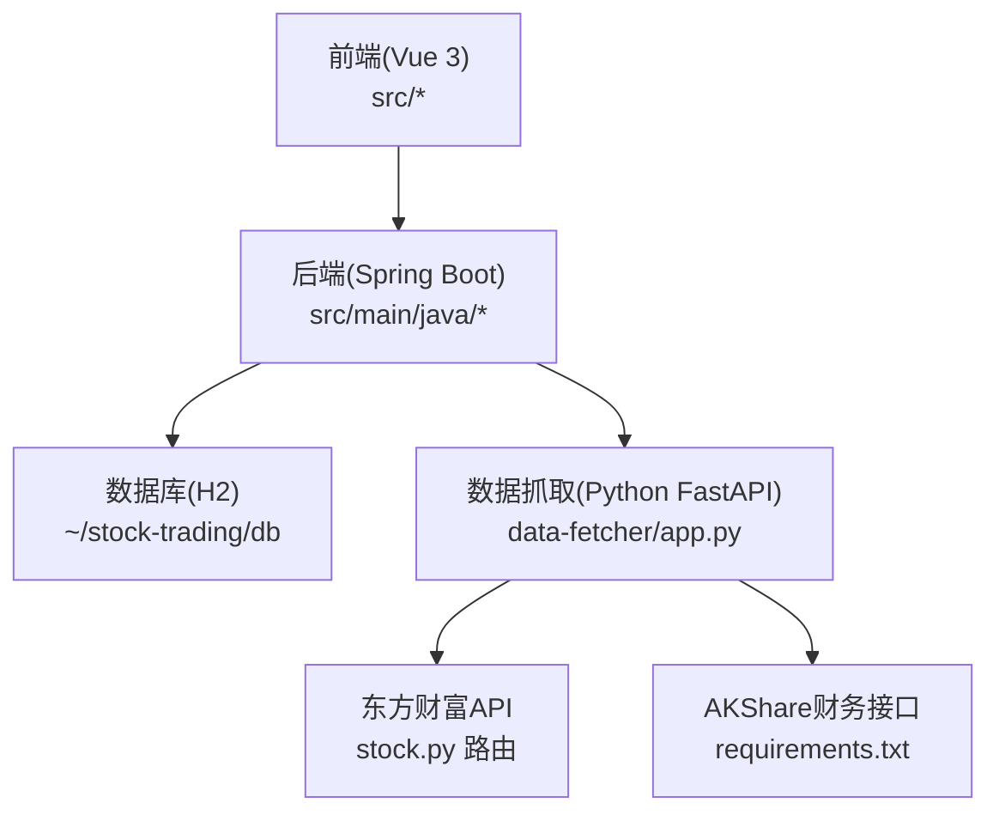
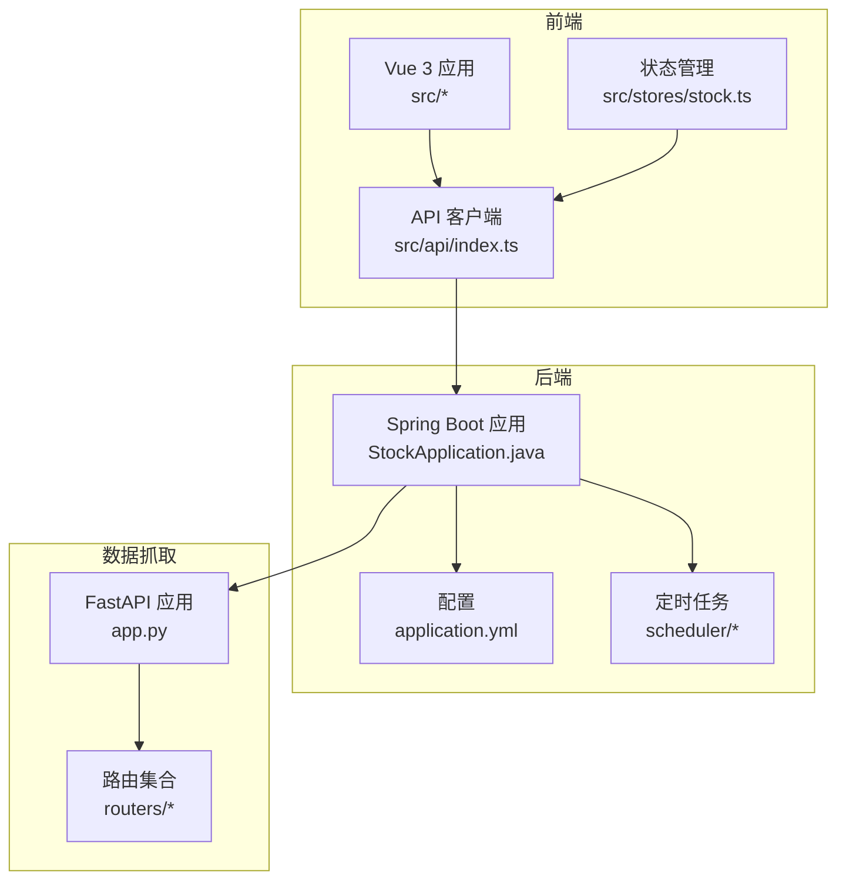
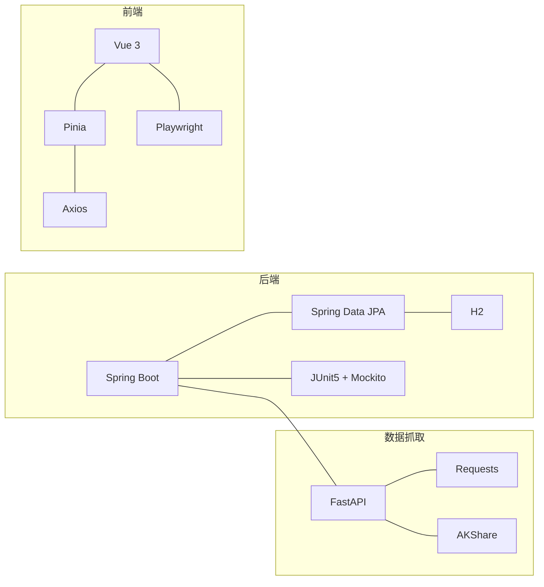

# 开发实施

<cite>
**本文引用的文件**
- [StockApplication.java](file://backend/src/main/java/com/stock/StockApplication.java)
- [pom.xml](file://backend/pom.xml)
- [application.yml](file://backend/src/main/resources/application.yml)
- [app.py](file://data-fetcher/app.py)
- [requirements.txt](file://data-fetcher/requirements.txt)
- [stock.py](file://data-fetcher/routers/stock.py)
- [package.json](file://frontend/package.json)
- [playwright.config.ts](file://frontend/playwright.config.ts)
- [vite.config.ts](file://frontend/vite.config.ts)
- [index.ts](file://frontend/src/api/index.ts)
- [stock.ts](file://frontend/src/stores/stock.ts)
- [stock.spec.ts](file://frontend/e2e/stock.spec.ts)
- [SKILL.md（开发流程）](file://dev-workflow/SKILL.md)
- [SKILL.md（系统规划）](file://system-planner/SKILL.md)
- [api-design.md](file://system-planner/api-design.md)
- [StockControllerTest.java](file://backend/src/test/java/com/stock/controller/StockControllerTest.java)
- [StockServiceTest.java](file://backend/src/test/java/com/stock/service/StockServiceTest.java)
</cite>

## 目录
1. [简介](#简介)
2. [项目结构](#项目结构)
3. [核心组件](#核心组件)
4. [架构总览](#架构总览)
5. [详细组件分析](#详细组件分析)
6. [依赖分析](#依赖分析)
7. [性能考量](#性能考量)
8. [故障排查指南](#故障排查指南)
9. [结论](#结论)
10. [附录](#附录)

## 简介
本实施文档面向开发团队，系统化阐述本项目的开发规范、测试策略（单元测试、集成测试、端到端测试、性能测试）、开发环境与IDE配置、代码格式化与静态检查、持续集成建议、版本控制最佳实践、代码重构原则与技术债务管理。文档以仓库现有实现为依据，结合系统规划与开发流程技能，给出可落地的工程实践。

## 项目结构
项目采用前后端分离与微服务化的组织方式：
- 后端（Java/Spring Boot）：REST API、定时任务、数据库（H2）
- 数据抓取（Python/FastAPI）：封装东方财富与AKShare接口
- 前端（Vue 3/Vite）：状态管理（Pinia）、API客户端、端到端测试（Playwright）

图表来源
- [StockApplication.java:1-16](file://backend/src/main/java/com/stock/StockApplication.java#L1-L16)
- [application.yml:1-28](file://backend/src/main/resources/application.yml#L1-L28)
- [app.py:1-31](file://data-fetcher/app.py#L1-L31)
- [stock.py:1-246](file://data-fetcher/routers/stock.py#L1-L246)

章节来源
- [StockApplication.java:1-16](file://backend/src/main/java/com/stock/StockApplication.java#L1-L16)
- [application.yml:1-28](file://backend/src/main/resources/application.yml#L1-L28)
- [app.py:1-31](file://data-fetcher/app.py#L1-L31)
- [stock.py:1-246](file://data-fetcher/routers/stock.py#L1-L246)

## 核心组件
- 后端启动与配置
  - 启动类启用调度与异步，主配置文件定义端口、H2数据库、定时任务Cron表达式与数据抓取服务地址。
- 数据抓取服务
  - FastAPI应用注册CORS，挂载多路由（股票、资金、财务、股东、研报、龙虎榜、行业），健康检查端点。
- 前端API与状态
  - Axios基础配置指向后端API；Pinia Store管理列表、当前标的、初始化进度轮询；Playwright配置用于端到端测试。

章节来源
- [StockApplication.java:1-16](file://backend/src/main/java/com/stock/StockApplication.java#L1-L16)
- [application.yml:1-28](file://backend/src/main/resources/application.yml#L1-L28)
- [app.py:1-31](file://data-fetcher/app.py#L1-L31)
- [index.ts:1-18](file://frontend/src/api/index.ts#L1-L18)
- [stock.ts:1-80](file://frontend/src/stores/stock.ts#L1-L80)
- [playwright.config.ts:1-25](file://frontend/playwright.config.ts#L1-L25)

## 架构总览
系统采用“前端SPA + 后端REST + 数据抓取微服务”的三层架构。后端通过定时任务与数据抓取服务协同，实现数据的增量/全量同步与指标计算。

图表来源
- [StockApplication.java:1-16](file://backend/src/main/java/com/stock/StockApplication.java#L1-L16)
- [application.yml:1-28](file://backend/src/main/resources/application.yml#L1-L28)
- [app.py:1-31](file://data-fetcher/app.py#L1-L31)
- [stock.py:1-246](file://data-fetcher/routers/stock.py#L1-L246)
- [index.ts:1-18](file://frontend/src/api/index.ts#L1-L18)
- [stock.ts:1-80](file://frontend/src/stores/stock.ts#L1-L80)

## 详细组件分析

### 后端：启动与配置
- 启用调度与异步，便于定时任务与异步初始化流程。
- 数据库使用H2文件模式，DDL自动更新，开启H2控制台便于调试。
- 定时任务Cron表达式覆盖行情刷新、K线/资金流同步、预警检测等。

章节来源
- [StockApplication.java:1-16](file://backend/src/main/java/com/stock/StockApplication.java#L1-L16)
- [application.yml:1-28](file://backend/src/main/resources/application.yml#L1-L28)

### 数据抓取：FastAPI与路由
- CORS允许任意来源/方法/头，便于本地联调。
- 股票路由提供基本信息、K线、分时、实时行情、批量行情等接口，内部统一处理异常并返回HTTP状态码。
- 东方财富接口调用需正确Header（含Referer），否则易断连；AKShare财务接口作为降级方案。

章节来源
- [app.py:1-31](file://data-fetcher/app.py#L1-L31)
- [stock.py:1-246](file://data-fetcher/routers/stock.py#L1-L246)

### 前端：API客户端与状态管理
- Axios基础配置指向后端API，统一错误拦截。
- Pinia Store负责列表、当前标的、初始化进度轮询（2秒周期），轮询结束自动刷新详情。
- Playwright配置本地开发服务器端口、超时、截图策略与浏览器项目。

章节来源
- [index.ts:1-18](file://frontend/src/api/index.ts#L1-L18)
- [stock.ts:1-80](file://frontend/src/stores/stock.ts#L1-L80)
- [playwright.config.ts:1-25](file://frontend/playwright.config.ts#L1-L25)

### 端到端测试：Playwright
- 测试覆盖首页加载、添加输入、跳转详情、标签页切换、预警入口可达等。
- 使用Vite开发服务器作为webServer，headless模式执行，失败截图。

章节来源
- [stock.spec.ts:1-67](file://frontend/e2e/stock.spec.ts#L1-L67)
- [playwright.config.ts:1-25](file://frontend/playwright.config.ts#L1-L25)

### 后端测试：控制器与服务
- 控制器集成测试：MockMvc验证列表、新增、详情、删除、初始化状态等端点。
- 服务层单元测试：Mock仓储与外部HTTP调用，覆盖新增校验、重复添加、删除级联、查询等。

章节来源
- [StockControllerTest.java:1-116](file://backend/src/test/java/com/stock/controller/StockControllerTest.java#L1-L116)
- [StockServiceTest.java:1-179](file://backend/src/test/java/com/stock/service/StockServiceTest.java#L1-L179)

## 依赖分析
- 后端依赖
  - Spring Boot Starter Web、Data JPA、Validation、H2、Lombok、OWASP HTML Sanitizer、测试依赖。
  - Maven插件：编译器、Surefire（ByteBuddy agent支持）、Spring Boot打包。
- Python数据服务依赖
  - FastAPI、Uvicorn、AKShare、Pandas、Requests、python-dotenv。
- 前端依赖
  - Vue 3、Pinia、Vue Router、Axios、Playwright测试、Vite构建、TypeScript类型配置。

图表来源
- [pom.xml:23-56](file://backend/pom.xml#L23-L56)
- [requirements.txt:1-7](file://data-fetcher/requirements.txt#L1-L7)
- [package.json:11-25](file://frontend/package.json#L11-L25)

章节来源
- [pom.xml:1-103](file://backend/pom.xml#L1-L103)
- [requirements.txt:1-7](file://data-fetcher/requirements.txt#L1-L7)
- [package.json:1-27](file://frontend/package.json#L1-L27)

## 性能考量
- 后端定时任务与数据同步
  - 交易时段每5分钟刷新行情；日K/资金流在收盘后同步；财务/股东/研报/龙虎榜按周/日定时；技术指标在K线同步后重算。
- 数据抓取
  - 东方财富接口需正确Header，避免断连；必要时退避重试；批量行情限制单批数量。
- 前端渲染
  - K线大数据量建议降采样；Canvas/WebGL渲染；初始化阶段使用骨架屏提升感知速度。

章节来源
- [application.yml:23-28](file://backend/src/main/resources/application.yml#L23-L28)
- [stock.py:14-72](file://data-fetcher/routers/stock.py#L14-L72)
- [SKILL.md（系统规划）:375-401](file://system-planner/SKILL.md#L375-L401)

## 故障排查指南
- 后端异常处理
  - 统一异常响应格式；常见错误码与业务异常类型（资源不存在、重复、无效代码、数据源不可用）。
- 数据抓取异常
  - 东方财富超时/限流/空响应的处理策略（重试、返回缓存、降级）。
- 前端错误展示
  - 自动数据失败内联提示+重试；过期数据旁提示；手动保存失败保留输入；网络断开全局提示。

章节来源
- [api-design.md:666-688](file://system-planner/api-design.md#L666-L688)
- [SKILL.md（系统规划）:418-435](file://system-planner/SKILL.md#L418-L435)
- [SKILL.md（系统规划）:577-587](file://system-planner/SKILL.md#L577-L587)

## 结论
本项目已具备清晰的开发流程、系统架构与测试策略。建议在现有基础上进一步完善静态检查与格式化工具配置、CI流水线与覆盖率目标、以及持续改进的技术债务管理机制，以保障长期演进的质量与稳定性。

## 附录

### 编码规范与工具配置

- Java（Spring Boot）
  - 版本：Java 17
  - 依赖管理：Maven（见pom.xml）
  - Lombok：简化实体与DTO
  - OWASP HTML Sanitizer：防止XSS
  - 建议：引入checkstyle/spotbugs（已在流程中提及），统一注释与包结构
  - 代码生成：使用Lombok注解减少样板代码，DTO与Entity命名区分

- TypeScript（Vue 3）
  - 版本：TypeScript ~6.0
  - 构建：Vite
  - 建议：ESLint + Prettier，统一格式与规则；Pinia Store按模块拆分

- Python（FastAPI）
  - 版本：3.9+
  - 依赖：FastAPI、Uvicorn、AKShare、Requests、Pandas、python-dotenv
  - 建议：ruff/flake8/mypy，统一格式与类型检查

- IDE与格式化
  - Java：IntelliJ IDEA（启用Lombok插件、Checkstyle/SpotBugs）
  - TS：VS Code（ESLint、Prettier、Vue Language Features）
  - Python：PyCharm/VS Code（ruff、mypy、black/isort）

章节来源
- [pom.xml:17-21](file://backend/pom.xml#L17-L21)
- [package.json:17-25](file://frontend/package.json#L17-L25)
- [requirements.txt:1-7](file://data-fetcher/requirements.txt#L1-L7)
- [SKILL.md（开发流程）:92-96](file://dev-workflow/SKILL.md#L92-L96)

### 单元测试要求
- 覆盖率目标
  - Service层目标80%+（流程中明确）
- 测试用例设计
  - 后端：控制器集成测试覆盖所有端点；服务层单元测试Mock仓储与外部HTTP调用
  - 前端：组件渲染、Store状态变更、API客户端请求参数
  - Python：接口集成测试Mock外部HTTP响应，数据转换与错误处理单元测试
- Mock策略
  - 后端：Mock Repository与RestTemplate（调Python服务）
  - 前端：vi.mock axios API调用
  - Python：pytest-mock + responses Mock 东方财富/AKShare响应

章节来源
- [StockControllerTest.java:1-116](file://backend/src/test/java/com/stock/controller/StockControllerTest.java#L1-L116)
- [StockServiceTest.java:1-179](file://backend/src/test/java/com/stock/service/StockServiceTest.java#L1-L179)
- [SKILL.md（开发流程）:520-554](file://dev-workflow/SKILL.md#L520-L554)

### 集成测试流程
- 接口测试
  - 后端：@WebMvcTest + MockMvc验证请求路由、参数校验、响应格式
  - 前端：Vitest + Vue Test Utils验证组件与Store
- 端到端测试
  - Playwright：页面可达性、数据返回与格式、CRUD全链路、跨页面一致性、表单校验、初始化流程、竞品联动、预警触发、导航交互、数据过期标记
- 性能测试
  - 后端：定时任务与数据同步策略；前端：K线大数据量降采样
  - 建议：引入JMeter/Locust进行压力测试（流程未强制要求，建议纳入CI）

章节来源
- [playwright.config.ts:1-25](file://frontend/playwright.config.ts#L1-L25)
- [stock.spec.ts:1-67](file://frontend/e2e/stock.spec.ts#L1-L67)
- [SKILL.md（开发流程）:104-123](file://dev-workflow/SKILL.md#L104-L123)
- [SKILL.md（系统规划）:646-655](file://system-planner/SKILL.md#L646-L655)

### 开发环境配置与IDE设置
- 后端
  - JDK 17+，Maven，Spring Boot DevTools（可选）
  - H2控制台：/h2-console
- Python
  - pip安装requirements.txt，Uvicorn运行app.py
- 前端
  - npm install，Vite开发服务器，Playwright测试

章节来源
- [application.yml:14-17](file://backend/src/main/resources/application.yml#L14-L17)
- [app.py:28-31](file://data-fetcher/app.py#L28-L31)
- [package.json:7-10](file://frontend/package.json#L7-L10)

### 持续集成配置（建议）
- Java：Maven构建、Surefire测试、JaCoCo覆盖率（目标80%+）
- Python：pytest + coverage
- 前端：Vitest + Playwright
- 建议：在CI中执行静态检查（checkstyle/spotbugs/ruff/flake8/eslint/mypy/tsc），失败即阻断

章节来源
- [pom.xml:77-87](file://backend/pom.xml#L77-L87)
- [SKILL.md（开发流程）:92-96](file://dev-workflow/SKILL.md#L92-L96)

### 版本控制最佳实践
- 分支策略：主干保护、Feature分支、Pull Request + 代码审查
- 提交规范：Conventional Commits（feat/fix/docs/chore）
- 变更管理：需求/设计变更走流程（追溯矩阵与文档冻结）

章节来源
- [SKILL.md（开发流程）:124-131](file://dev-workflow/SKILL.md#L124-L131)
- [SKILL.md（系统规划）:667-689](file://system-planner/SKILL.md#L667-L689)

### 代码重构原则与技术债务管理
- 重构原则
  - 保持小步快跑，每次重构聚焦单一职责；确保测试通过后再提交
- 技术债务
  - 明确风险项（如AKShare新浪源降级、行业资金流向不可用）并记录应对
  - 定期回顾与清理：接口幂等性、异常处理一致性、字段映射与校验

章节来源
- [SKILL.md（系统规划）:680-688](file://system-planner/SKILL.md#L680-L688)
- [api-design.md:666-688](file://system-planner/api-design.md#L666-L688)