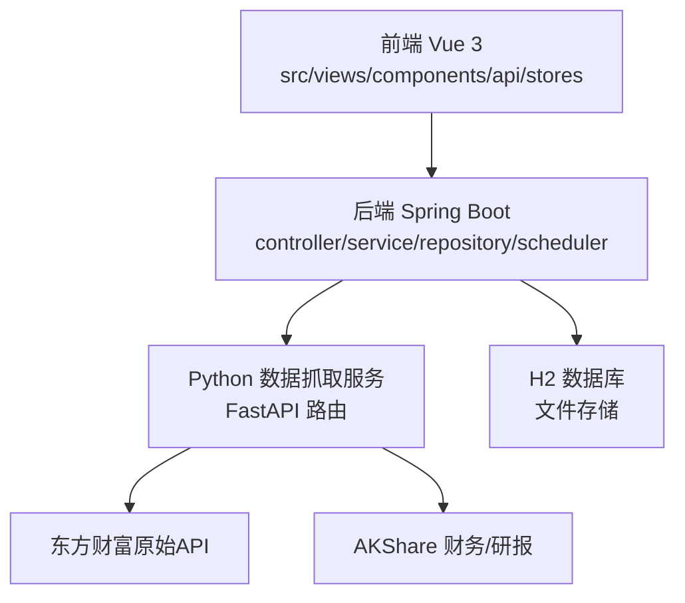
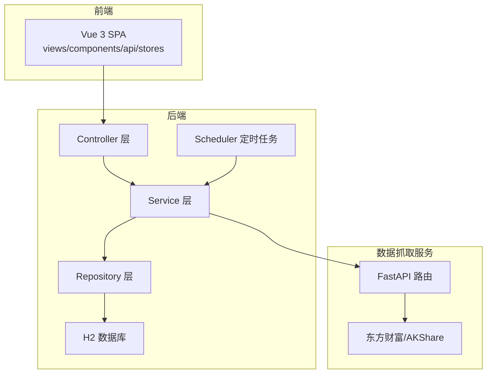
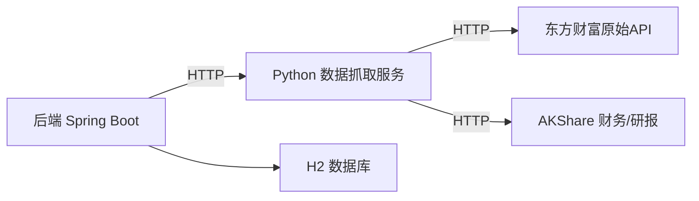

# 新功能开发流程

<cite>
**本文引用的文件**
- [StockApplication.java](file://backend/src/main/java/com/stock/StockApplication.java)
- [pom.xml](file://backend/pom.xml)
- [app.py](file://data-fetcher/app.py)
- [package.json](file://frontend/package.json)
- [SKILL.md（开发流程规范）](file://dev-workflow/SKILL.md)
- [SKILL.md（系统规划器）](file://system-planner/SKILL.md)
- [api-design.md](file://system-planner/api-design.md)
- [high-level-design.md](file://system-planner/high-level-design.md)
- [detailed-design.md](file://system-planner/detailed-design.md)
- [data-fetcher.md](file://system-planner/data-fetcher.md)
- [StockController.java](file://backend/src/main/java/com/stock/controller/StockController.java)
- [StockService.java](file://backend/src/main/java/com/stock/service/StockService.java)
</cite>

## 目录
1. [简介](#简介)
2. [项目结构](#项目结构)
3. [核心组件](#核心组件)
4. [架构总览](#架构总览)
5. [详细组件分析](#详细组件分析)
6. [依赖分析](#依赖分析)
7. [性能考量](#性能考量)
8. [故障排查指南](#故障排查指南)
9. [结论](#结论)
10. [附录](#附录)

## 简介
本文件面向“新功能开发”的全流程规范化落地，结合现有系统的设计文档与开发实践，给出从需求分析、设计评审、开发实施到质量门禁的完整方法论与检查清单。目标是确保新增功能在架构、数据、接口、前后端协同与测试层面均满足一致性、可扩展性与可维护性要求。

## 项目结构
系统采用“前端Vue 3 + 后端Spring Boot + Python数据抓取服务”的三层协作架构，数据通过Python服务统一对接东方财富与AKShare，后端负责业务编排、持久化与定时任务，前端负责展示与交互。

**图示来源**
- [high-level-design.md: HD-01 系统架构:7-68](file://system-planner/high-level-design.md#L7-L68)
- [data-fetcher.md: 概述与基础地址:1-8](file://system-planner/data-fetcher.md#L1-L8)
- [pom.xml: 依赖与构建:23-56](file://backend/pom.xml#L23-L56)
- [app.py: FastAPI 应用与路由:1-31](file://data-fetcher/app.py#L1-L31)

**章节来源**
- [high-level-design.md: HD-01 系统架构:7-68](file://system-planner/high-level-design.md#L7-L68)
- [pom.xml: 依赖与构建:23-56](file://backend/pom.xml#L23-L56)
- [app.py: FastAPI 应用与路由:1-31](file://data-fetcher/app.py#L1-L31)

## 核心组件
- 后端启动与配置
  - 启动类启用调度与异步，便于定时任务与异步初始化。
  - Maven依赖包含Web、JPA、验证、H2、Lombok、HTML Sanitizer、测试等。
- Python数据抓取服务
  - FastAPI封装东方财富与AKShare，统一限流、缓存与错误处理。
- 前端工程
  - Vue 3 + Vite，Axios封装API，Pinia状态管理，Playwright端到端测试。

**章节来源**
- [StockApplication.java: 启动类与注解:8-15](file://backend/src/main/java/com/stock/StockApplication.java#L8-L15)
- [pom.xml: 依赖与插件:23-101](file://backend/pom.xml#L23-L101)
- [app.py: FastAPI 应用与路由:1-31](file://data-fetcher/app.py#L1-L31)
- [package.json: 前端依赖与脚本:11-26](file://frontend/package.json#L11-L26)

## 架构总览
系统采用“前端-后端-数据抓取服务-外部数据源”的分层协作模式，后端通过DataFetcherClient统一调用Python服务，Python服务负责对外部接口的限流、缓存与格式转换，后端专注于业务逻辑与持久化。

**图示来源**
- [high-level-design.md: HD-01 系统架构:7-68](file://system-planner/high-level-design.md#L7-L68)
- [high-level-design.md: HD-03 模块间接口契约:185-271](file://system-planner/high-level-design.md#L185-L271)
- [data-fetcher.md: 接口列表与核心逻辑:31-350](file://system-planner/data-fetcher.md#L31-L350)

## 详细组件分析

### 需求分析流程
- 需求收集
  - 明确功能边界与用户价值，参考系统定位与核心功能章节。
  - 识别与既有模块的依赖关系与数据流，避免重复建设。
- 可行性评估
  - 技术栈与现有实现一致性评估（Java/Python/Vue）。
  - 外部数据源可用性与稳定性评估（东方财富/AKShare）。
  - 性能与限流影响评估（500ms间隔、指数退避、批量上限）。
- 技术方案设计
  - 输出高阶设计（模块划分、接口契约、数据流）与详细设计（类/方法/字段映射、SQL DDL、前端组件树）。
  - 设计初始化流程与定时任务策略，确保与现有机制一致。

**章节来源**
- [SKILL.md（系统规划器）: 技术栈与定位:8-117](file://system-planner/SKILL.md#L8-L117)
- [SKILL.md（系统规划器）: 数据同步策略与定时任务:358-401](file://system-planner/SKILL.md#L358-L401)
- [data-fetcher.md: 限流与容错:24-322](file://system-planner/data-fetcher.md#L24-L322)

### 设计评审标准
- 架构设计
  - 模块边界清晰、职责单一；三层协作合理；跨语言调用协议一致。
- 数据库设计
  - 表结构与索引设计满足高频查询；字段命名与精度处理一致；外键与唯一约束明确。
- API设计评审
  - 接口契约完整（路径、方法、参数、响应、错误码）；与前端/Python映射一致；枚举与校验规则明确。

**章节来源**
- [high-level-design.md: HD-02 模块划分:80-182](file://system-planner/high-level-design.md#L80-L182)
- [high-level-design.md: HD-03 模块间接口契约:185-271](file://system-planner/high-level-design.md#L185-L271)
- [detailed-design.md: DD-02 JPA实体与Repository:129-494](file://system-planner/detailed-design.md#L129-L494)
- [api-design.md: API 接口设计参考:1-688](file://system-planner/api-design.md#L1-L688)

### 开发实施规范
- 编码规范
  - Java：使用Lombok简化POJO，JPA注解映射字段，全局异常统一处理。
  - Python：FastAPI路由签名与字段映射，限流与缓存策略。
  - 前端：Vue 3组合式API、Pinia状态管理、组件化设计。
- 单元测试要求
  - 后端：Service层单元测试 + Controller集成测试 + Repository集成测试。
  - Python：接口集成测试 + 数据转换单元测试 + 错误处理单元测试。
  - 前端：组件单元测试 + Store单元测试 + API客户端单元测试。
- 文档编写
  - 详细设计与高阶设计同步更新，字段映射与SQL DDL保持一致，前端组件与路由同步维护。

**章节来源**
- [pom.xml: 依赖与测试插件:57-101](file://backend/pom.xml#L57-L101)
- [SKILL.md（开发流程规范）: 流程步骤与测试要求:84-123](file://dev-workflow/SKILL.md#L84-L123)
- [detailed-design.md: DD-26 Python数据服务:1144-1224](file://system-planner/detailed-design.md#L1144-L1224)

### 开发模板与检查清单
- 需求定稿
  - 需求冻结、风险项记录与应对方案确认。
- 高阶设计
  - 架构图、模块划分、接口契约、数据流图、技术选型理由、关键设计决策。
- 详细设计
  - 类设计、方法签名、字段映射、SQL DDL、前端组件树与路由、状态管理结构。
- 编码与测试
  - 严格遵循详细设计；同步编写单元测试；通过代码审查与lint/typecheck。
- 质量门禁
  - 阶段回归测试全量通过；端到端测试覆盖关键流程。

**章节来源**
- [SKILL.md（开发流程规范）: 流程总览与步骤明细:10-131](file://dev-workflow/SKILL.md#L10-L131)
- [SKILL.md（系统规划器）: 需求定稿声明与已接受风险:667-689](file://system-planner/SKILL.md#L667-L689)

### 里程碑节点与质量门禁
- 里程碑
  - 需求冻结 → 高阶设计评审 → 详细设计评审 → 编码 → 单元测试 → 代码审查 → 阶段回归 → E2E测试
- 质量门禁
  - 每步“不跳步”；文档先行；追溯联动；测试同步；变更记录。

**章节来源**
- [SKILL.md（开发流程规范）: 流程规则:124-131](file://dev-workflow/SKILL.md#L124-L131)

### 跨组件协作与依赖管理
- 后端与Python服务
  - 通过DataFetcherClient统一调用，串行化请求避免并发冲突；字段映射与精度处理一致。
- 后端内部
  - Controller → Service → Repository → Python服务；定时任务编排数据同步与预警检测。
- 前后端
  - API契约一致；前端Store与组件与后端响应结构对齐；错误提示与状态管理一致。

**章节来源**
- [high-level-design.md: HD-03 模块间接口契约:185-271](file://system-planner/high-level-design.md#L185-L271)
- [detailed-design.md: DD-03 DataFetcherClient:519-603](file://system-planner/detailed-design.md#L519-L603)
- [detailed-design.md: DD-24 Scheduler层:1073-1114](file://system-planner/detailed-design.md#L1073-L1114)

### 风险控制措施
- 外部接口调用
  - 500ms间隔、指数退避、批量上限；超时/空数据/限流处理策略明确。
- 数据一致性
  - 初始化流程异步化，事务提交后触发；竞品初始化自动编排。
- 安全与合规
  - OWASP HTML Sanitizer + 参数化查询；XSS过滤与输入校验。

**章节来源**
- [data-fetcher.md: 限流与容错:314-322](file://system-planner/data-fetcher.md#L314-L322)
- [StockService.java: 初始化触发与事务同步:145-162](file://backend/src/main/java/com/stock/service/StockService.java#L145-L162)
- [detailed-design.md: DD-01 全局基础设施:72-125](file://system-planner/detailed-design.md#L72-L125)

### 开发环境配置指南
- 后端
  - Java 17+、Maven、Spring Boot 3、H2数据库、Lombok、OWASP Sanitizer。
- Python数据抓取服务
  - Python 3.9+、FastAPI、uvicorn、akshare、pandas、requests、python-dotenv。
- 前端
  - Node.js 18+、Vite、Vue 3、Pinia、Vue Router、Playwright。
- 启动顺序
  - Python服务 → 后端 → 前端；端口与CORS配置需与文档一致。

**章节来源**
- [SKILL.md（系统规划器）: 启动与运行:483-510](file://system-planner/SKILL.md#L483-L510)
- [pom.xml: 依赖与插件:23-101](file://backend/pom.xml#L23-L101)
- [app.py: FastAPI 应用与路由:1-31](file://data-fetcher/app.py#L1-L31)
- [package.json: 前端依赖与脚本:11-26](file://frontend/package.json#L11-L26)

### 调试技巧
- 后端
  - 全局异常统一处理与错误响应格式；日志级别与输出位置明确。
- Python服务
  - 每次外部调用记录URL、耗时与状态；限流与缓存策略可观察。
- 前端
  - API调用失败在控制台记录；组件渲染与Store状态变更单元测试覆盖。

**章节来源**
- [detailed-design.md: DD-01 全局基础设施:72-125](file://system-planner/detailed-design.md#L72-L125)
- [SKILL.md（系统规划器）: 日志策略:512-520](file://system-planner/SKILL.md#L512-L520)

### 性能优化建议
- 指标计算与渲染
  - 技术指标后端计算并存储，前端仅渲染；大数据量K线建议降采样。
- 数据库查询
  - 外键字段建立索引；高频查询使用索引扫描；H2在百万级以内性能稳定。
- 外部调用
  - 利用不同域名限流独立性交叉调用；批量请求分批执行。

**章节来源**
- [SKILL.md（系统规划器）: 性能预估:646-655](file://system-planner/SKILL.md#L646-L655)
- [detailed-design.md: DD-02 JPA实体与Repository:129-494](file://system-planner/detailed-design.md#L129-L494)
- [high-level-design.md: HD-07 非功能性设计:439-491](file://system-planner/high-level-design.md#L439-L491)

## 依赖分析
后端与Python服务通过HTTP通信，Python服务负责对外部数据源的封装与限流，后端负责业务编排与持久化。

**图示来源**
- [high-level-design.md: HD-03 模块间接口契约:185-271](file://system-planner/high-level-design.md#L185-L271)
- [data-fetcher.md: 接口列表与核心逻辑:31-350](file://system-planner/data-fetcher.md#L31-L350)

**章节来源**
- [high-level-design.md: HD-03 模块间接口契约:185-271](file://system-planner/high-level-design.md#L185-L271)
- [data-fetcher.md: 接口列表与核心逻辑:31-350](file://system-planner/data-fetcher.md#L31-L350)

## 性能考量
- 指标计算与渲染
  - 后端计算并存储技术指标，前端仅渲染，避免重复计算。
- 数据库查询
  - 为外键字段建立索引，高频查询使用索引扫描。
- 外部调用
  - 利用不同域名限流独立性交叉调用，减少总等待时间。

**章节来源**
- [SKILL.md（系统规划器）: 性能预估:646-655](file://system-planner/SKILL.md#L646-L655)
- [high-level-design.md: HD-07 非功能性设计:439-491](file://system-planner/high-level-design.md#L439-L491)

## 故障排查指南
- 外部接口调用失败
  - 超时/空数据/限流：重试1次、退避重试、返回缓存数据并标记过期。
- 后端统一异常处理
  - 全局异常捕获与统一错误响应格式；业务异常分类处理。
- 前端错误展示
  - 自动数据获取失败内联展示“重试”；手动数据保存失败保留输入内容。

**章节来源**
- [SKILL.md（系统规划器）: 错误处理策略:418-435](file://system-planner/SKILL.md#L418-L435)
- [detailed-design.md: DD-01 全局基础设施:72-125](file://system-planner/detailed-design.md#L72-L125)
- [SKILL.md（系统规划器）: 前端错误展示设计:577-587](file://system-planner/SKILL.md#L577-L587)

## 结论
通过将现有系统的设计文档与开发流程规范相结合，新功能开发可在“需求—设计—实施—质量门禁”的闭环中高效推进。建议在每个阶段严格执行文档先行、追溯联动与测试同步，确保新增功能与既有架构一致、可扩展且可维护。

## 附录
- API设计参考：[api-design.md](file://system-planner/api-design.md)
- 高阶设计：[high-level-design.md](file://system-planner/high-level-design.md)
- 详细设计：[detailed-design.md](file://system-planner/detailed-design.md)
- 数据抓取服务参考：[data-fetcher.md](file://system-planner/data-fetcher.md)
- 开发流程规范：[SKILL.md（开发流程规范）](file://dev-workflow/SKILL.md)
- 系统规划器：[SKILL.md（系统规划器）](file://system-planner/SKILL.md)