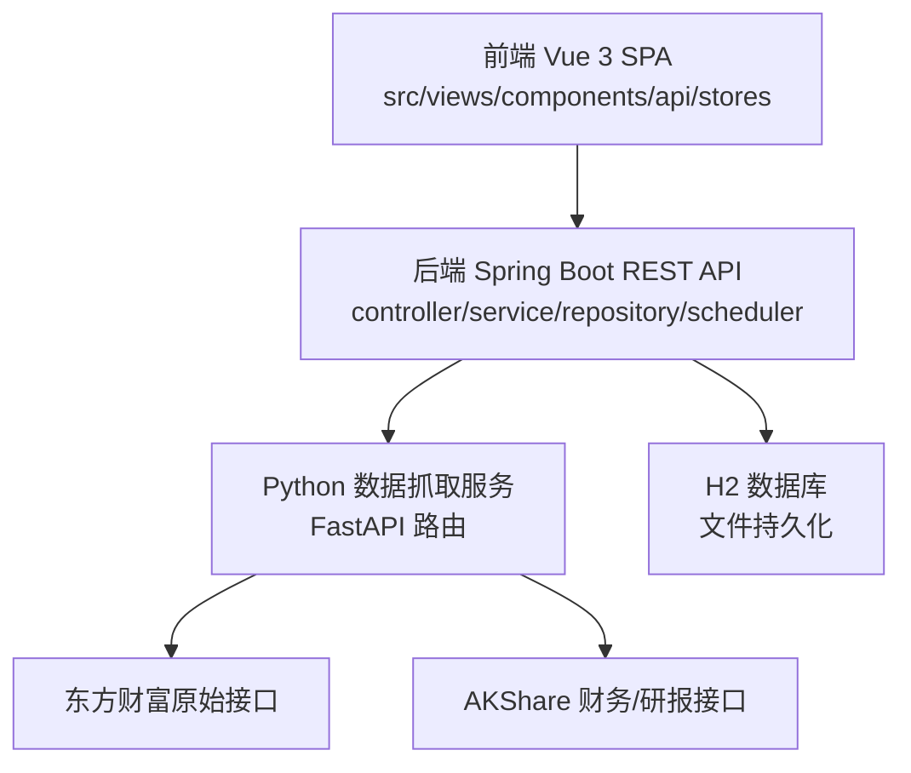
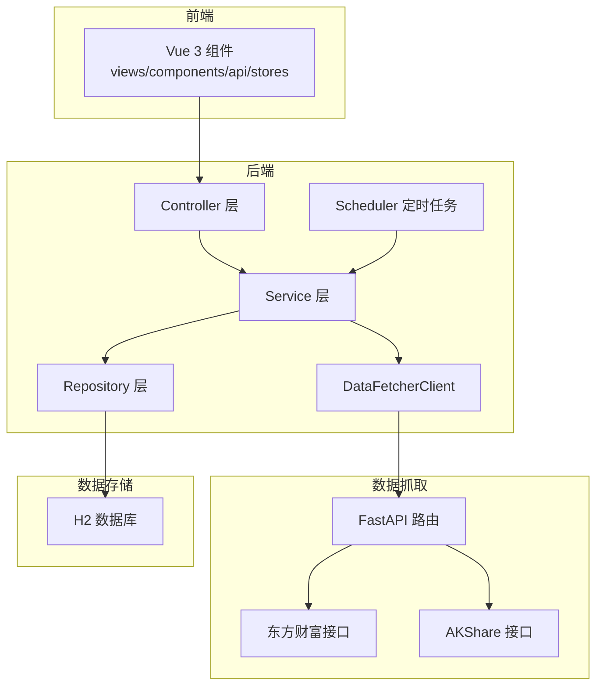
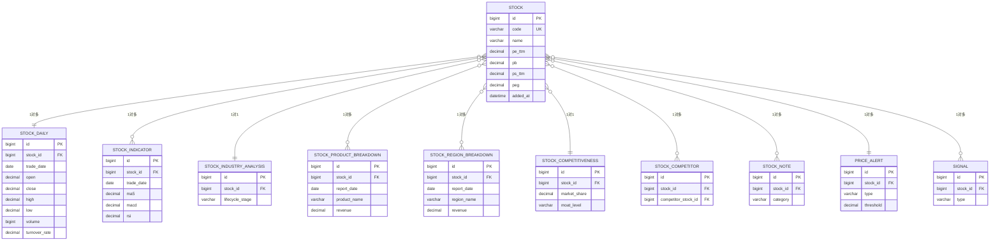
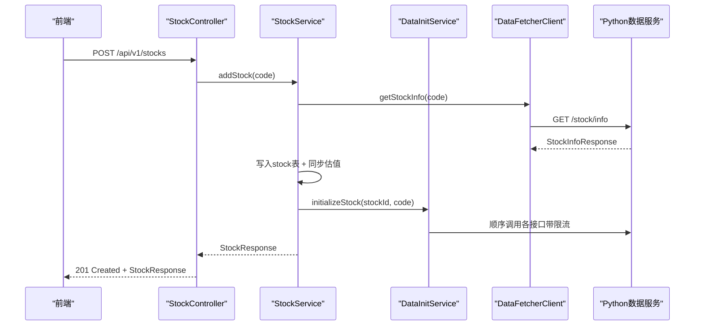
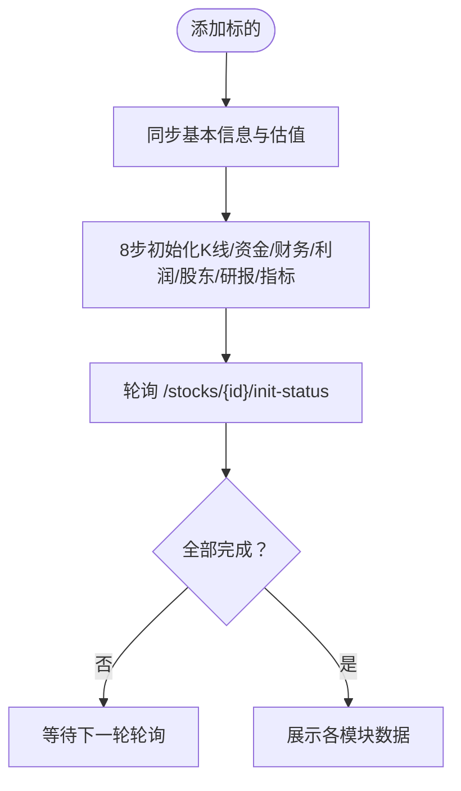
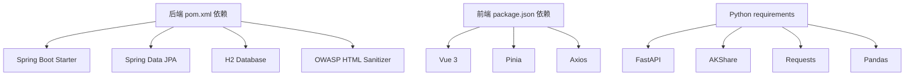

# 设计评审

<cite>
**本文引用的文件**
- [StockApplication.java](file://backend/src/main/java/com/stock/StockApplication.java)
- [pom.xml](file://backend/pom.xml)
- [app.py](file://data-fetcher/app.py)
- [package.json](file://frontend/package.json)
- [high-level-design.md](file://system-planner/high-level-design.md)
- [detailed-design.md](file://system-planner/detailed-design.md)
- [api-design.md](file://system-planner/api-design.md)
- [data-fetcher.md](file://system-planner/data-fetcher.md)
- [SKILL.md](file://system-planner/SKILL.md)
- [application.yml](file://backend/src/main/resources/application.yml)
- [WebConfig.java](file://backend/src/main/java/com/stock/config/WebConfig.java)
- [RestTemplateConfig.java](file://backend/src/main/java/com/stock/config/RestTemplateConfig.java)
- [GlobalExceptionHandler.java](file://backend/src/main/java/com/stock/exception/GlobalExceptionHandler.java)
- [HtmlSanitizer.java](file://backend/src/main/java/com/stock/util/HtmlSanitizer.java)
- [StockController.java](file://backend/src/main/java/com/stock/controller/StockController.java)
- [StockService.java](file://backend/src/main/java/com/stock/service/StockService.java)
- [DataSyncScheduler.java](file://backend/src/main/java/com/stock/scheduler/DataSyncScheduler.java)
- [AddStockRequest.java](file://backend/src/main/java/com/stock/dto/request/AddStockRequest.java)
- [Stock.java](file://backend/src/main/java/com/stock/entity/Stock.java)
- [DataFetcherClient.java](file://backend/src/main/java/com/stock/client/DataFetcherClient.java)
- [DataInitService.java](file://backend/src/main/java/com/stock/service/DataInitService.java)
- [stock.py](file://data-fetcher/routers/stock.py)
</cite>

## 目录
1. [简介](#简介)
2. [项目结构](#项目结构)
3. [核心组件](#核心组件)
4. [架构总览](#架构总览)
5. [详细组件分析](#详细组件分析)
6. [依赖分析](#依赖分析)
7. [性能考虑](#性能考虑)
8. [故障排查指南](#故障排查指南)
9. [结论](#结论)
10. [附录](#附录)

## 简介
本设计评审面向“股票交易分析系统”的架构、数据库与API设计，围绕系统架构、模块划分、接口契约、数据库表结构与索引策略、数据一致性、API RESTful设计、参数规范与错误处理等方面进行全面评审。评审目标包括：
- 明确系统架构与模块边界，验证分层与职责分离
- 评估数据库设计的合理性与扩展性
- 审核API设计的一致性、健壮性与可维护性
- 建立评审标准、检查清单、评审流程与问题跟踪机制
- 提供设计文档模板、技术选型原则与性能优化建议

## 项目结构
系统采用前后端分离与微服务化的数据抓取架构：
- 后端（Spring Boot）：REST API、业务逻辑、定时任务、JPA数据访问
- 前端（Vue 3 + Vite）：单页应用，组件化与状态管理
- 数据抓取（Python FastAPI）：封装东方财富与AKShare接口，提供统一数据源

**图表来源**
- [high-level-design.md](file://system-planner/high-level-design.md)
- [SKILL.md](file://system-planner/SKILL.md)

**章节来源**
- [high-level-design.md](file://system-planner/high-level-design.md)
- [SKILL.md](file://system-planner/SKILL.md)

## 核心组件
- 启动与容器：Spring Boot 应用启动类启用调度与异步，后端依赖H2数据库与JPA
- 配置层：CORS、定时任务开关、RestTemplate超时与连接超时配置
- 异常体系：全局异常处理器统一错误响应格式
- XSS防护：OWASP HTML Sanitizer用于输入过滤
- 控制器与服务：StockController/Service负责标的增删改查与初始化编排
- 数据同步：DataSyncScheduler按计划任务同步各类数据
- 数据抓取：DataFetcherClient封装HTTP调用，Python服务提供路由与限流

**章节来源**
- [StockApplication.java](file://backend/src/main/java/com/stock/StockApplication.java)
- [WebConfig.java](file://backend/src/main/java/com/stock/config/WebConfig.java)
- [RestTemplateConfig.java](file://backend/src/main/java/com/stock/config/RestTemplateConfig.java)
- [GlobalExceptionHandler.java](file://backend/src/main/java/com/stock/exception/GlobalExceptionHandler.java)
- [HtmlSanitizer.java](file://backend/src/main/java/com/stock/util/HtmlSanitizer.java)
- [StockController.java](file://backend/src/main/java/com/stock/controller/StockController.java)
- [StockService.java](file://backend/src/main/java/com/stock/service/StockService.java)
- [DataSyncScheduler.java](file://backend/src/main/java/com/stock/scheduler/DataSyncScheduler.java)
- [DataFetcherClient.java](file://backend/src/main/java/com/stock/client/DataFetcherClient.java)

## 架构总览
系统采用三层架构与微服务化数据抓取：
- 前端：Vue 3 SPA，组件化展示与状态管理
- 后端：Spring Boot，三层分层（Controller/Service/Repository），JPA持久化，定时任务
- 数据抓取：Python FastAPI，封装东方财富与AKShare接口，提供统一REST服务

**图表来源**
- [high-level-design.md](file://system-planner/high-level-design.md)
- [detailed-design.md](file://system-planner/detailed-design.md)
- [app.py](file://data-fetcher/app.py)

**章节来源**
- [high-level-design.md](file://system-planner/high-level-design.md)
- [detailed-design.md](file://system-planner/detailed-design.md)

## 详细组件分析

### 数据库设计评审
- 表结构设计
  - 自动数据表：stock、stock_daily、stock_fund_flow、stock_income、stock_financial、stock_holder、stock_research、stock_indicator
  - 手动数据表：stock_industry_analysis、stock_product_breakdown、stock_region_breakdown、stock_competitiveness、stock_competitor、stock_note、price_alert、signal、init_status
- 索引策略
  - 外键字段建立索引（如 idx_stock_daily_stock），提升高频查询性能
- 数据一致性
  - 使用JPA与H2，结合事务控制保障写入一致性
  - 定时任务采用增量同步策略，避免重复与丢失
- 复杂度与扩展性
  - 指标表按日粒度存储，便于回溯与重算
  - 手动数据表支持1对1/1对多，满足灵活扩展

**图表来源**
- [detailed-design.md](file://system-planner/detailed-design.md)

**章节来源**
- [detailed-design.md](file://system-planner/detailed-design.md)

### API设计评审
- RESTful设计
  - 资源命名与HTTP方法匹配，如 GET /stocks/{id}、POST /stocks、DELETE /stocks/{id}
  - 手动数据采用PUT/POST/DELETE语义，符合资源幂等与CRUD约定
- 参数规范
  - 请求体与响应体结构统一，参数校验严格（如股票代码6位数字）
  - 时间范围、周期、调整因子等参数明确默认值与取值范围
- 错误处理
  - 统一错误响应格式，包含code、message、timestamp
  - 常见错误码与业务异常定义清晰

**图表来源**
- [StockController.java](file://backend/src/main/java/com/stock/controller/StockController.java)
- [StockService.java](file://backend/src/main/java/com/stock/service/StockService.java)
- [DataInitService.java](file://backend/src/main/java/com/stock/service/DataInitService.java)
- [DataFetcherClient.java](file://backend/src/main/java/com/stock/client/DataFetcherClient.java)
- [stock.py](file://data-fetcher/routers/stock.py)

**章节来源**
- [api-design.md](file://system-planner/api-design.md)
- [StockController.java](file://backend/src/main/java/com/stock/controller/StockController.java)
- [StockService.java](file://backend/src/main/java/com/stock/service/StockService.java)

### 数据流与初始化流程
- 自动数据流：从东方财富与AKShare拉取，经Python服务转换后写入H2
- 手动数据流：前端表单提交，后端校验与XSS过滤后持久化
- 初始化流程：添加标的后异步执行8步初始化，前端轮询进度

**图表来源**
- [high-level-design.md](file://system-planner/high-level-design.md)
- [api-design.md](file://system-planner/api-design.md)

**章节来源**
- [high-level-design.md](file://system-planner/high-level-design.md)
- [api-design.md](file://system-planner/api-design.md)

### 安全与异常处理
- 安全设计
  - OWASP HTML Sanitizer用于XSS过滤
  - CORS配置仅允许前端开发服务器访问
- 异常处理
  - 全局异常处理器统一返回错误响应
  - 自定义业务异常区分不同错误场景

**章节来源**
- [GlobalExceptionHandler.java](file://backend/src/main/java/com/stock/exception/GlobalExceptionHandler.java)
- [HtmlSanitizer.java](file://backend/src/main/java/com/stock/util/HtmlSanitizer.java)
- [WebConfig.java](file://backend/src/main/java/com/stock/config/WebConfig.java)

## 依赖分析
- 技术栈与依赖
  - 后端：Spring Boot 3、JPA/H2、OWASP HTML Sanitizer、Byte-Buddy（测试）
  - 前端：Vue 3、Pinia、Axios、Vite
  - 数据抓取：FastAPI、AKShare、Requests、Pandas
- 外部依赖与集成点
  - 东方财富原始API与AKShare财务/研报接口
  - Python服务通过HTTP向后端提供数据

**图表来源**
- [pom.xml](file://backend/pom.xml)
- [package.json](file://frontend/package.json)
- [data-fetcher.md](file://system-planner/data-fetcher.md)

**章节来源**
- [pom.xml](file://backend/pom.xml)
- [package.json](file://frontend/package.json)
- [data-fetcher.md](file://system-planner/data-fetcher.md)

## 性能考虑
- 数据库性能
  - H2文件存储适合单机与小规模数据，索引覆盖高频查询
  - 指标与K线按日粒度存储，避免超大数据量
- 网络与限流
  - Python服务统一限流与队列串行化，避免并发冲突
  - 后端RestTemplate设置合理超时与连接超时
- 前端渲染
  - K线大数据量建议降采样，默认展示1年数据
- 定时任务
  - 交易时段与非交易时段分别设置同步频率，降低峰值压力

**章节来源**
- [SKILL.md](file://system-planner/SKILL.md)
- [RestTemplateConfig.java](file://backend/src/main/java/com/stock/config/RestTemplateConfig.java)
- [DataSyncScheduler.java](file://backend/src/main/java/com/stock/scheduler/DataSyncScheduler.java)

## 故障排查指南
- 常见问题与定位
  - 股票代码无效：校验失败抛出业务异常，检查AddStockRequest
  - 数据源不可用：Python服务返回503，检查接口可用性与限流
  - 初始化失败：轮询init-status查看具体步骤状态
- 日志与监控
  - Spring Boot与Python服务均记录INFO级别日志
  - 前端API失败记录在控制台（WARN级别）
- 修复建议
  - 校验参数与业务规则，确保输入符合枚举与范围
  - 检查CORS配置与跨域头，确保前端可访问后端
  - 验证Python服务健康检查端点与限流策略

**章节来源**
- [AddStockRequest.java](file://backend/src/main/java/com/stock/dto/request/AddStockRequest.java)
- [GlobalExceptionHandler.java](file://backend/src/main/java/com/stock/exception/GlobalExceptionHandler.java)
- [SKILL.md](file://system-planner/SKILL.md)

## 结论
该系统在架构设计上实现了清晰的分层与职责分离，数据库设计满足当前业务需求并具备良好扩展性，API设计遵循RESTful规范并与前端形成稳定契约。Python数据抓取服务有效隔离了外部接口的复杂性与限流问题。建议在后续迭代中持续完善测试覆盖、监控告警与文档更新，确保系统稳定性与可维护性。

## 附录

### 评审标准与检查清单
- 架构评审标准
  - 分层清晰、职责单一、模块解耦
  - 外部依赖可控、限流与容错策略明确
  - 数据一致性与事务边界清晰
- 数据库评审标准
  - 表结构与索引满足查询性能
  - 数据类型与精度符合业务需求
  - 手动/自动数据分离合理
- API评审标准
  - 资源命名与HTTP方法一致
  - 参数校验与错误码统一
  - 响应结构与契约文档一致
- 检查清单
  - 是否存在循环依赖
  - 是否遗漏关键索引
  - 是否统一错误响应格式
  - 是否覆盖关键异常分支
  - 是否满足性能与容量预期

### 评审流程与问题跟踪
- 评审流程
  - 文档准备与分发 → 组织评审会 → 问题收集与分类 → 责任分配与闭环
- 问题跟踪
  - 使用统一问题模板记录问题、责任人、优先级与截止日期
  - 评审纪要与问题清单作为基线，版本冻结后变更需走需求变更流程

### 设计文档模板与技术选型原则
- 设计文档模板
  - 概要设计：系统架构、模块划分、接口契约、数据流
  - 详细设计：实体/DTO/Repository/Service/Controller/Scheduler
  - API设计：端点、参数、响应、错误码
  - 数据抓取：接口映射、限流与缓存策略
- 技术选型原则
  - 以实用性与可维护性为核心，优先选择生态成熟、文档完善的方案
  - 在性能与复杂度之间平衡，避免过度工程化
  - 明确边界与依赖，确保可演进与可替换

**章节来源**
- [high-level-design.md](file://system-planner/high-level-design.md)
- [detailed-design.md](file://system-planner/detailed-design.md)
- [api-design.md](file://system-planner/api-design.md)
- [data-fetcher.md](file://system-planner/data-fetcher.md)
- [SKILL.md](file://system-planner/SKILL.md)