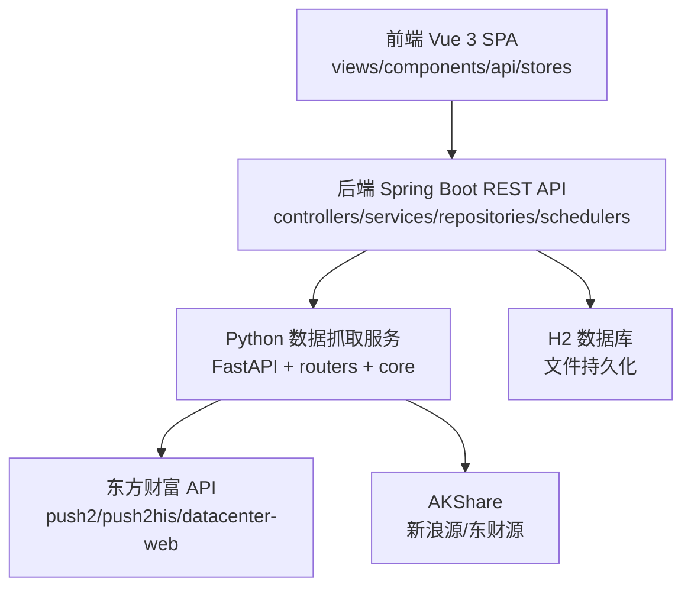
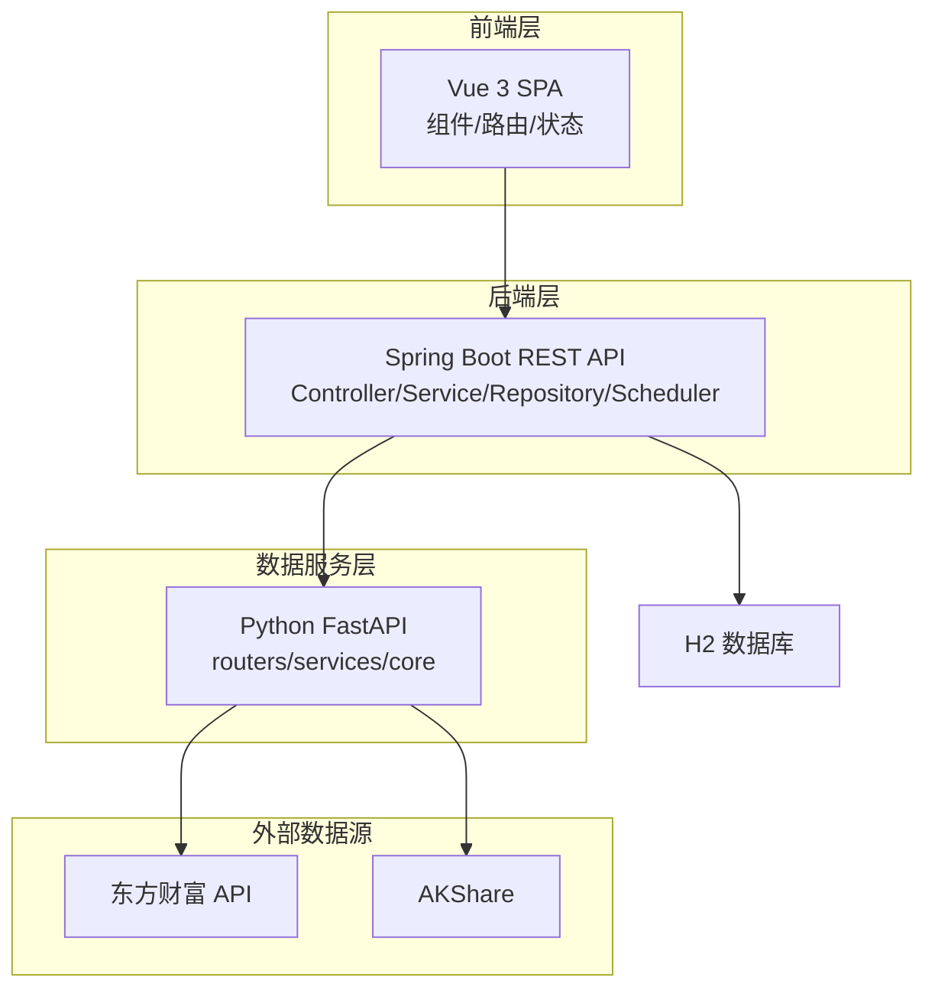
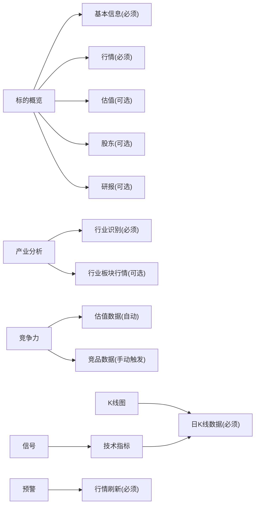
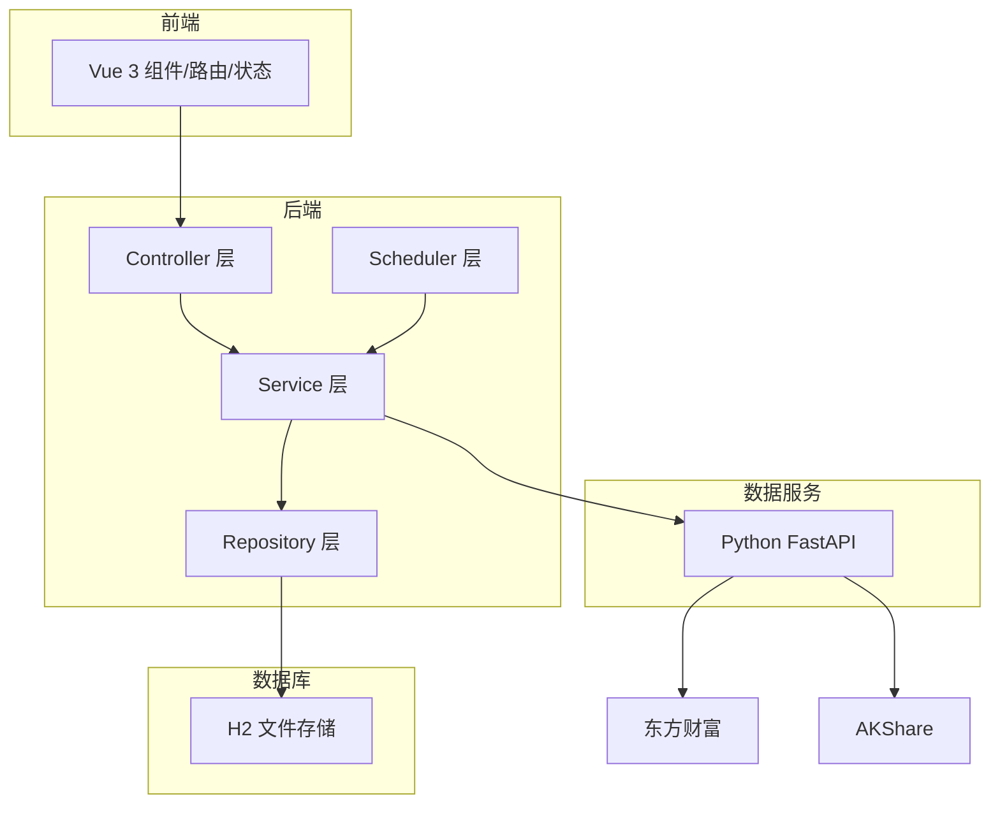

# 需求分析

<cite>
**本文引用的文件**
- [StockApplication.java](file://backend/src/main/java/com/stock/StockApplication.java)
- [application.yml](file://backend/src/main/resources/application.yml)
- [app.py](file://data-fetcher/app.py)
- [SKILL.md](file://system-planner/SKILL.md)
- [api-design.md](file://system-planner/api-design.md)
- [data-fetcher.md](file://system-planner/data-fetcher.md)
- [high-level-design.md](file://system-planner/high-level-design.md)
- [detailed-design.md](file://system-planner/detailed-design.md)
- [hld-checklist\SKILL.md](file://system-planner/hld-checklist/SKILL.md)
- [StockController.java](file://backend/src/main/java/com/stock/controller/StockController.java)
- [StockService.java](file://backend/src/main/java/com/stock/service/StockService.java)
- [StockDetailView.vue](file://frontend/src/views/StockDetailView.vue)
</cite>

## 目录
1. [简介](#简介)
2. [项目结构](#项目结构)
3. [核心组件](#核心组件)
4. [架构总览](#架构总览)
5. [详细组件分析](#详细组件分析)
6. [依赖分析](#依赖分析)
7. [性能考量](#性能考量)
8. [故障排查指南](#故障排查指南)
9. [结论](#结论)
10. [附录](#附录)

## 简介
本需求分析文档面向“股票分析系统”项目，基于现有系统规划与设计文档，构建一套可落地的需求收集、评估、编写、评审、变更与跟踪的完整方法论。系统定位为“标的深度分析系统”，聚焦于对单只股票的全面梳理与分析，涵盖产业背景、财务数据、市场表现、竞争格局等维度，强调自动数据与手动补充相结合，提供可导出的分析报告。

## 项目结构
系统采用前后端分离架构，后端为Spring Boot应用，前端为Vue 3单页应用，数据抓取通过独立的Python FastAPI服务完成。整体结构如下：

**图表来源**
- [high-level-design.md: 第7-68行:7-68](file://system-planner/high-level-design.md#L7-L68)
- [SKILL.md: 第22-36行:22-36](file://system-planner/SKILL.md#L22-L36)

**章节来源**
- [high-level-design.md: 第70-182行:70-182](file://system-planner/high-level-design.md#L70-L182)
- [SKILL.md: 第8-21行:8-21](file://system-planner/SKILL.md#L8-L21)

## 核心组件
- 后端应用启动与配置
  - 启动类启用调度与异步，配置文件定义数据库、JPA、H2控制台与数据抓取服务地址、定时任务Cron表达式。
- Python数据抓取服务
  - FastAPI封装东方财富与AKShare接口，统一处理限流、重试、缓存与数值精度转换。
- 前端交互与状态管理
  - 基于Vue 3与Pinia的状态管理，提供标的详情页、模块化组件与API客户端封装。
- 核心业务模块
  - 标的管理、行情刷新、K线与技术指标、资金流向、财务数据、股东与研报、产业分析、竞争力评估、竞品对比、投资笔记、预警与信号检测、分析完成度与报告导出。

**章节来源**
- [StockApplication.java: 第1-16行:1-16](file://backend/src/main/java/com/stock/StockApplication.java#L1-L16)
- [application.yml: 第1-28行:1-28](file://backend/src/main/resources/application.yml#L1-L28)
- [app.py: 第1-31行:1-31](file://data-fetcher/app.py#L1-L31)
- [StockDetailView.vue: 第1-82行:1-82](file://frontend/src/views/StockDetailView.vue#L1-L82)

## 架构总览
系统采用三层架构与微服务思想：
- 前端层：负责数据展示、用户交互与状态管理，不直接调用外部API。
- 后端层：负责业务逻辑、数据持久化、定时调度与技术指标计算，不直接调用外部API。
- 数据服务层：Python微服务封装外部API，统一限流与转换，不存储数据。

**图表来源**
- [high-level-design.md: 第70-111行:70-111](file://system-planner/high-level-design.md#L70-L111)
- [high-level-design.md: 第157-181行:157-181](file://system-planner/high-level-design.md#L157-L181)

**章节来源**
- [high-level-design.md: 第70-111行:70-111](file://system-planner/high-level-design.md#L70-L111)
- [high-level-design.md: 第157-181行:157-181](file://system-planner/high-level-design.md#L157-L181)

## 详细组件分析

### 需求收集方法
- 用户访谈
  - 目标用户：个人价值投资者，关注单只股票的深度基本面分析。
  - 访谈要点：用户期望的分析维度、数据完整性要求、界面交互偏好、报告导出需求。
- 竞品分析
  - 对比通用看盘工具与专业分析平台，明确本系统“标的深度分析”的差异化定位，聚焦“不做什么”的边界。
- 数据分析
  - 基于系统规划文档中的数据源验证结论与数据同步策略，识别自动数据与手动数据的边界，明确数据质量与可用性要求。

**章节来源**
- [SKILL.md: 第99-118行:99-118](file://system-planner/SKILL.md#L99-L118)
- [SKILL.md: 第38-44行:38-44](file://system-planner/SKILL.md#L38-L44)
- [SKILL.md: 第358-374行:358-374](file://system-planner/SKILL.md#L358-L374)

### 需求评估标准
- 业务价值
  - 用户添加股票后5分钟内看到完整自动数据概览；自动数据获取成功率>95%；用户能在30分钟内完成手动分析数据补充。
- 技术可行性
  - 明确外部接口稳定性与降级方案（如AKShare新浪源不可用时的财务数据降级）；限流与缓存策略与验证结论一致。
- 资源投入
  - 后端模块数量、前端组件数量与实施阶段映射，指导资源与排期规划。

**章节来源**
- [SKILL.md: 第103-108行:103-108](file://system-planner/SKILL.md#L103-L108)
- [SKILL.md: 第639-644行:639-644](file://system-planner/SKILL.md#L639-L644)
- [high-level-design.md: 第496-503行:496-503](file://system-planner/high-level-design.md#L496-L503)

### 需求文档编写规范
- 功能规格说明书
  - 依据API设计文档定义的端点、请求参数、响应结构与错误码，形成后端接口契约与前端调用规范。
- 用户故事
  - 以用户视角描述需求，如“作为用户，我希望添加股票后能快速看到概览数据，以便进行初步分析”。
- 验收标准
  - 明确功能完成度指标（如分析完成度百分比）、数据可用性（如自动数据过期标记）、错误处理（如数据获取失败的提示与重试）。

**章节来源**
- [api-design.md: 第1-688行:1-688](file://system-planner/api-design.md#L1-L688)
- [SKILL.md: 第555-587行:555-587](file://system-planner/SKILL.md#L555-L587)

### 需求评审流程
- 自检清单
  - 使用概要设计自检清单，从架构合理性、接口一致性、数据流完整性、与需求一致性、可扩展性、性能与可靠性六个维度进行系统性检查。
- 交叉参考
  - 以系统规划文档为核心，交叉参考API设计与数据抓取服务文档，确保设计与需求一致。

**章节来源**
- [hld-checklist\SKILL.md: 第1-110行:1-110](file://system-planner/hld-checklist/SKILL.md#L1-L110)
- [high-level-design.md: 第185-271行:185-271](file://system-planner/high-level-design.md#L185-L271)

### 变更管理机制
- 变更触发
  - 当外部数据源策略调整（如接口稳定性变化）、用户反馈或业务边界变更时，触发需求变更。
- 变更评估
  - 评估对后端模块、前端组件与Python服务的影响范围，遵循“新增一类外部数据源或一个分析模块，改动不超过3个模块”的可扩展性原则。
- 变更实施
  - 通过版本冻结与需求变更流程，确保变更可控并可追溯。

**章节来源**
- [SKILL.md: 第667-670行:667-670](file://system-planner/SKILL.md#L667-L670)
- [SKILL.md: 第601-621行:601-621](file://system-planner/SKILL.md#L601-L621)

### 需求跟踪矩阵
- 追溯关系
  - 详细设计文档中的DD编号与概要设计、需求功能形成一一对应关系，便于需求跟踪与变更追溯。

**章节来源**
- [detailed-design.md: 第3-34行:3-34](file://system-planner/detailed-design.md#L3-L34)

### 需求优先级排序
- 业务价值优先
  - 核心功能（标的概览、行情与交易分析、财务数据、股东与机构、研报与观点）优先保障；手动数据框架（产业分析、主营构成、竞争力评估、竞品对比、投资笔记）次之。
- 技术可行性优先
  - 优先实现外部数据源稳定的部分，对不可用或不稳定的数据源制定降级方案。
- 用户体验优先
  - 异步初始化与进度提示、骨架屏与空状态引导、错误提示与重试机制优先实现。

**章节来源**
- [SKILL.md: 第119-212行:119-212](file://system-planner/SKILL.md#L119-L212)
- [SKILL.md: 第403-417行:403-417](file://system-planner/SKILL.md#L403-L417)

### 依赖关系分析
- 模块依赖
  - 标的概览依赖基本信息与行情；产业分析依赖行业识别；竞争力依赖估值与竞品数据；K线图与技术指标依赖日K线；预警与信号依赖行情与技术指标。
- 外部依赖
  - 东方财富API与AKShare的稳定性与限流特性直接影响系统可用性与性能。

**图表来源**
- [SKILL.md: 第601-621行:601-621](file://system-planner/SKILL.md#L601-L621)

**章节来源**
- [SKILL.md: 第601-621行:601-621](file://system-planner/SKILL.md#L601-L621)

### 风险评估方法
- 已验证结论
  - 外部接口限流独立性验证通过；部分字段精度需实际测试确认。
- 已接受风险
  - AKShare新浪源无第三方替代；行业板块行情依赖同花顺源；前端K线大数据量渲染性能。
- 降级与容错
  - 外部接口失败时返回缓存数据或“暂不可用”提示；Python服务内部限流与指数退避重试；后端统一异常处理与错误响应格式。

**章节来源**
- [SKILL.md: 第671-688行:671-688](file://system-planner/SKILL.md#L671-L688)
- [SKILL.md: 第418-429行:418-429](file://system-planner/SKILL.md#L418-L429)
- [data-fetcher.md: 第314-322行:314-322](file://system-planner/data-fetcher.md#L314-L322)

## 依赖分析
系统模块间的依赖关系与数据流如下：

**图表来源**
- [high-level-design.md: 第185-271行:185-271](file://system-planner/high-level-design.md#L185-L271)

**章节来源**
- [high-level-design.md: 第185-271行:185-271](file://system-planner/high-level-design.md#L185-L271)

## 性能考量
- 外部接口限流与并发
  - Python服务内部请求队列串行化，同一时刻仅一个东方财富请求；不同域名请求可交叉排列，利用限流独立性。
- 数据存储与查询
  - H2文件存储满足单用户场景，高频查询建立外键索引；技术指标后端计算并存储，减少前端重复计算。
- 前端渲染
  - K线图默认展示1年数据，大数据量时考虑降采样；骨架屏与空状态提升用户体验。

**章节来源**
- [high-level-design.md: 第267-271行:267-271](file://system-planner/high-level-design.md#L267-L271)
- [high-level-design.md: 第441-466行:441-466](file://system-planner/high-level-design.md#L441-L466)
- [SKILL.md: 第646-655行:646-655](file://system-planner/SKILL.md#L646-L655)

## 故障排查指南
- 添加股票失败
  - 检查股票代码格式与是否存在；查看后端异常响应与日志；确认Python数据服务健康状态。
- 数据初始化卡住
  - 前端轮询初始化状态；后端查看init_status表；检查Python服务限流与重试策略。
- 外部接口超时或失败
  - 查看统一异常处理与错误响应格式；确认缓存策略与降级方案是否生效。

**章节来源**
- [StockController.java: 第29-55行:29-55](file://backend/src/main/java/com/stock/controller/StockController.java#L29-L55)
- [StockService.java: 第93-163行:93-163](file://backend/src/main/java/com/stock/service/StockService.java#L93-L163)
- [detailed-design.md: 第72-109行:72-109](file://system-planner/detailed-design.md#L72-L109)

## 结论
本需求分析文档基于系统规划与设计文档，建立了覆盖需求收集、评估、编写、评审、变更与跟踪的完整方法论。通过明确业务价值、技术可行性和资源投入，结合自检清单与风险评估，确保系统在满足用户需求的同时具备良好的可扩展性与可靠性。建议在后续迭代中持续完善需求跟踪矩阵与变更流程，保障项目有序推进。

## 附录
- API设计参考与端点定义
- 数据抓取服务接口与字段映射
- 概要设计自检清单与检查项

**章节来源**
- [api-design.md: 第1-688行:1-688](file://system-planner/api-design.md#L1-L688)
- [data-fetcher.md: 第1-350行:1-350](file://system-planner/data-fetcher.md#L1-L350)
- [hld-checklist\SKILL.md: 第16-74行:16-74](file://system-planner/hld-checklist/SKILL.md#L16-L74)