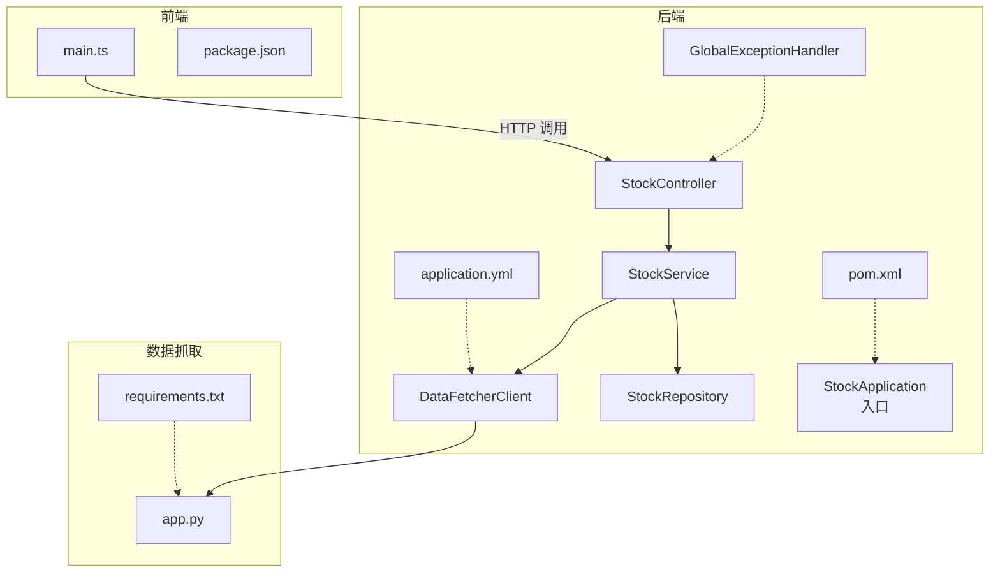
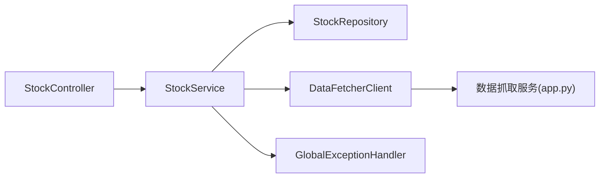
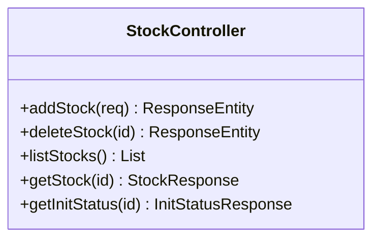
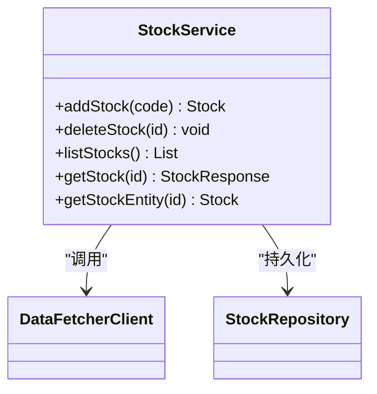
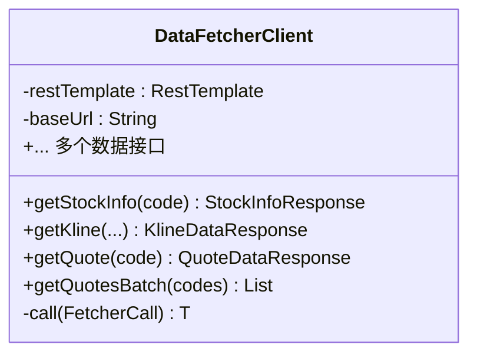
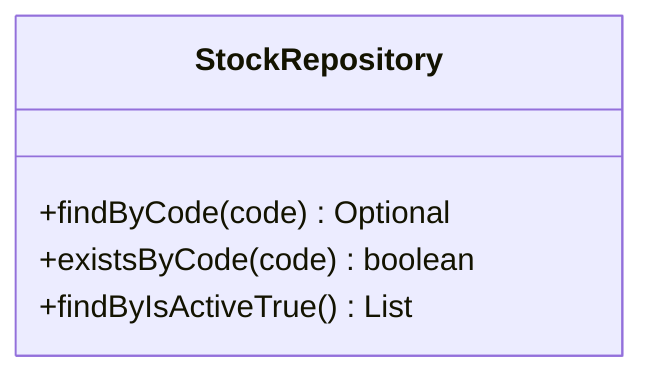
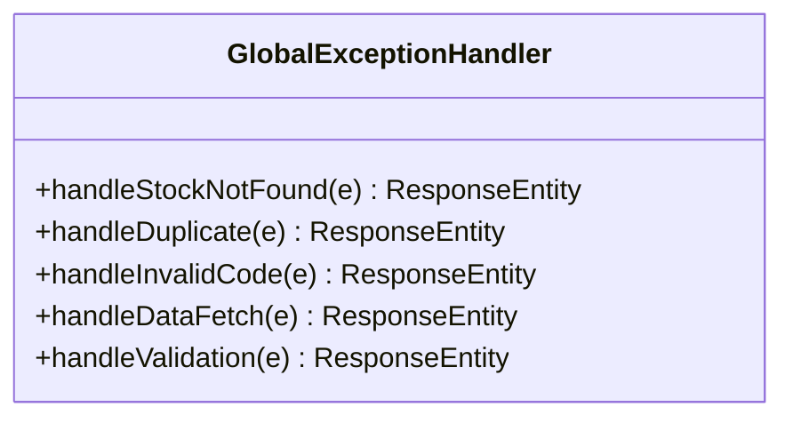
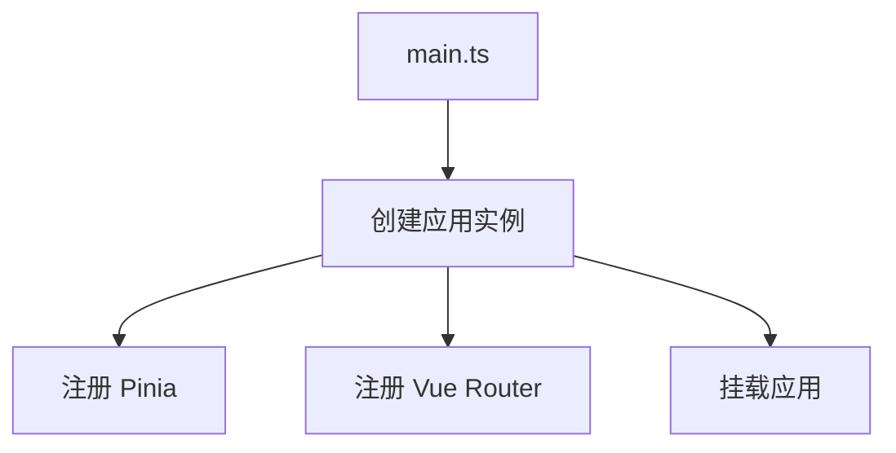
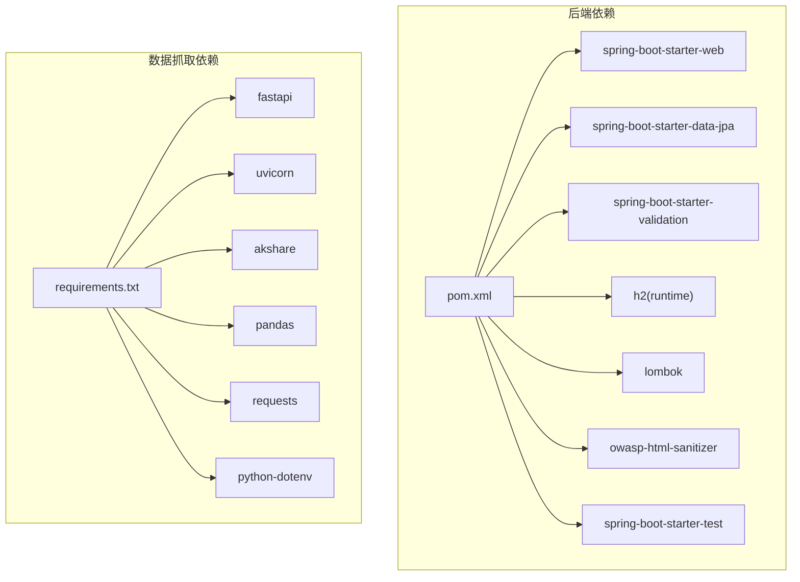
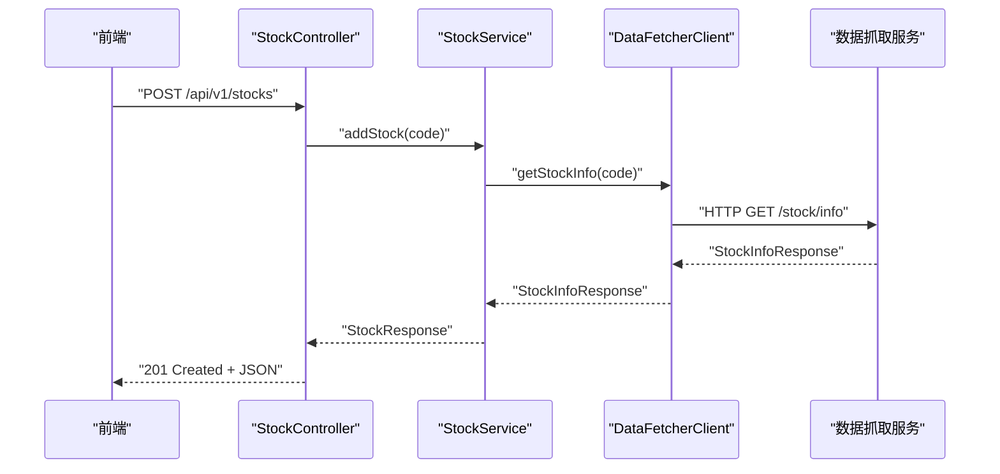

# 代码质量与重构

<cite>
**本文引用的文件**   
- [DataFetcherClient.java](file://backend/src/main/java/com/stock/client/DataFetcherClient.java)
- [RestTemplateConfig.java](file://backend/src/main/java/com/stock/config/RestTemplateConfig.java)
- [StockController.java](file://backend/src/main/java/com/stock/controller/StockController.java)
- [StockService.java](file://backend/src/main/java/com/stock/service/StockService.java)
- [StockRepository.java](file://backend/src/main/java/com/stock/repository/StockRepository.java)
- [GlobalExceptionHandler.java](file://backend/src/main/java/com/stock/exception/GlobalExceptionHandler.java)
- [application.yml](file://backend/src/main/resources/application.yml)
- [pom.xml](file://backend/pom.xml)
- [StockControllerTest.java](file://backend/src/test/java/com/stock/controller/StockControllerTest.java)
- [HtmlSanitizer.java](file://backend/src/main/java/com/stock/util/HtmlSanitizer.java)
- [Stock.java](file://backend/src/main/java/com/stock/entity/Stock.java)
- [AddStockRequest.java](file://backend/src/main/java/com/stock/dto/request/AddStockRequest.java)
- [app.py](file://data-fetcher/app.py)
- [requirements.txt](file://data-fetcher/requirements.txt)
- [package.json](file://frontend/package.json)
- [main.ts](file://frontend/src/main.ts)
- [SKILL.md](file://dev-workflow/SKILL.md)
</cite>

## 目录
1. [简介](#简介)
2. [项目结构](#项目结构)
3. [核心组件](#核心组件)
4. [架构总览](#架构总览)
5. [详细组件分析](#详细组件分析)
6. [依赖分析](#依赖分析)
7. [性能考虑](#性能考虑)
8. [故障排查指南](#故障排查指南)
9. [结论](#结论)
10. [附录](#附录)

## 简介
本文件面向“代码质量与重构”主题，结合仓库现有实现，系统化梳理代码规范、审查流程、重构策略、度量指标、静态分析与持续集成配置，并给出技术债务识别与管理、复杂度控制、可维护性提升策略及团队协作最佳实践。文档同时提供可落地的工具推荐与案例分析，帮助团队建立可持续的质量保障体系。

## 项目结构
项目采用前后端分离架构：
- 后端（Spring Boot）：提供REST API、数据访问、定时任务与全局异常处理。
- 数据抓取（FastAPI）：独立的数据采集服务，供后端调用。
- 前端（Vue 3 + TypeScript）：基于Vite构建，使用Pinia状态管理与Vue Router路由。

图表来源
- [main.ts:1-11](file://frontend/src/main.ts#L1-L11)
- [package.json:1-27](file://frontend/package.json#L1-L27)
- [application.yml:1-28](file://backend/src/main/resources/application.yml#L1-L28)
- [StockController.java:1-57](file://backend/src/main/java/com/stock/controller/StockController.java#L1-L57)
- [StockService.java:1-243](file://backend/src/main/java/com/stock/service/StockService.java#L1-L243)
- [DataFetcherClient.java:1-126](file://backend/src/main/java/com/stock/client/DataFetcherClient.java#L1-L126)
- [StockRepository.java:1-18](file://backend/src/main/java/com/stock/repository/StockRepository.java#L1-L18)
- [GlobalExceptionHandler.java:1-33](file://backend/src/main/java/com/stock/exception/GlobalExceptionHandler.java#L1-L33)
- [pom.xml:1-103](file://backend/pom.xml#L1-L103)
- [app.py:1-31](file://data-fetcher/app.py#L1-L31)
- [requirements.txt:1-7](file://data-fetcher/requirements.txt#L1-L7)

章节来源
- [main.ts:1-11](file://frontend/src/main.ts#L1-L11)
- [package.json:1-27](file://frontend/package.json#L1-L27)
- [application.yml:1-28](file://backend/src/main/resources/application.yml#L1-L28)
- [StockController.java:1-57](file://backend/src/main/java/com/stock/controller/StockController.java#L1-L57)
- [StockService.java:1-243](file://backend/src/main/java/com/stock/service/StockService.java#L1-L243)
- [DataFetcherClient.java:1-126](file://backend/src/main/java/com/stock/client/DataFetcherClient.java#L1-L126)
- [StockRepository.java:1-18](file://backend/src/main/java/com/stock/repository/StockRepository.java#L1-L18)
- [GlobalExceptionHandler.java:1-33](file://backend/src/main/java/com/stock/exception/GlobalExceptionHandler.java#L1-L33)
- [pom.xml:1-103](file://backend/pom.xml#L1-L103)
- [app.py:1-31](file://data-fetcher/app.py#L1-L31)
- [requirements.txt:1-7](file://data-fetcher/requirements.txt#L1-L7)

## 核心组件
- 控制器层：集中暴露REST接口，负责参数绑定与响应封装。
- 服务层：业务编排与事务控制，协调数据抓取与持久化。
- 数据访问层：JPA仓储接口，提供基础CRUD能力。
- 客户端层：统一调用数据抓取服务，内置错误包装与空值校验。
- 异常处理：全局异常映射，标准化错误响应。
- 配置与依赖：应用配置、RestTemplate超时设置、Maven插件与测试环境。

章节来源
- [StockController.java:1-57](file://backend/src/main/java/com/stock/controller/StockController.java#L1-L57)
- [StockService.java:1-243](file://backend/src/main/java/com/stock/service/StockService.java#L1-L243)
- [StockRepository.java:1-18](file://backend/src/main/java/com/stock/repository/StockRepository.java#L1-L18)
- [DataFetcherClient.java:1-126](file://backend/src/main/java/com/stock/client/DataFetcherClient.java#L1-L126)
- [GlobalExceptionHandler.java:1-33](file://backend/src/main/java/com/stock/exception/GlobalExceptionHandler.java#L1-L33)
- [RestTemplateConfig.java:1-18](file://backend/src/main/java/com/stock/config/RestTemplateConfig.java#L1-L18)
- [application.yml:1-28](file://backend/src/main/resources/application.yml#L1-L28)
- [pom.xml:1-103](file://backend/pom.xml#L1-L103)

## 架构总览
后端通过控制器接收请求，服务层进行业务处理与事务管理，客户端层统一访问数据抓取服务，仓储层负责数据库交互；异常处理贯穿控制器层，保证对外输出一致的错误格式。

图表来源
- [StockController.java:1-57](file://backend/src/main/java/com/stock/controller/StockController.java#L1-L57)
- [StockService.java:1-243](file://backend/src/main/java/com/stock/service/StockService.java#L1-L243)
- [StockRepository.java:1-18](file://backend/src/main/java/com/stock/repository/StockRepository.java#L1-L18)
- [DataFetcherClient.java:1-126](file://backend/src/main/java/com/stock/client/DataFetcherClient.java#L1-L126)
- [GlobalExceptionHandler.java:1-33](file://backend/src/main/java/com/stock/exception/GlobalExceptionHandler.java#L1-L33)
- [app.py:1-31](file://data-fetcher/app.py#L1-L31)

## 详细组件分析

### 组件A：StockController（控制器）
- 职责：暴露股票相关REST接口，处理HTTP请求与响应。
- 规范遵循：使用@RequestMapping与@RestController，参数校验由DTO驱动。
- 错误处理：交由全局异常处理器统一处理。
- 复杂度：低，职责单一，便于测试与维护。

图表来源
- [StockController.java:1-57](file://backend/src/main/java/com/stock/controller/StockController.java#L1-L57)

章节来源
- [StockController.java:1-57](file://backend/src/main/java/com/stock/controller/StockController.java#L1-L57)

### 组件B：StockService（服务）
- 职责：添加/删除股票、列表与详情查询、初始化流程触发。
- 事务与异步：在事务提交后触发异步初始化，避免并发读取问题。
- 数据抓取：调用DataFetcherClient获取股票信息与估值数据。
- 复杂度：中等，包含条件分支与异常处理，但方法职责相对清晰。

图表来源
- [StockService.java:1-243](file://backend/src/main/java/com/stock/service/StockService.java#L1-L243)
- [DataFetcherClient.java:1-126](file://backend/src/main/java/com/stock/client/DataFetcherClient.java#L1-L126)
- [StockRepository.java:1-18](file://backend/src/main/java/com/stock/repository/StockRepository.java#L1-L18)

章节来源
- [StockService.java:1-243](file://backend/src/main/java/com/stock/service/StockService.java#L1-L243)
- [StockRepository.java:1-18](file://backend/src/main/java/com/stock/repository/StockRepository.java#L1-L18)

### 组件C：DataFetcherClient（客户端）
- 职责：封装对数据抓取服务的HTTP调用，统一异常处理与空值校验。
- 设计要点：内部函数式接口与私有call方法，减少重复try/catch。
- 风险点：对上游服务不可用时的降级策略可进一步完善。

图表来源
- [DataFetcherClient.java:1-126](file://backend/src/main/java/com/stock/client/DataFetcherClient.java#L1-L126)

章节来源
- [DataFetcherClient.java:1-126](file://backend/src/main/java/com/stock/client/DataFetcherClient.java#L1-L126)

### 组件D：StockRepository（仓储）
- 职责：提供基于JPA的股票数据访问能力。
- 设计要点：简洁的接口定义，满足当前业务查询需求。

图表来源
- [StockRepository.java:1-18](file://backend/src/main/java/com/stock/repository/StockRepository.java#L1-L18)

章节来源
- [StockRepository.java:1-18](file://backend/src/main/java/com/stock/repository/StockRepository.java#L1-L18)

### 组件E：全局异常处理（GlobalExceptionHandler）
- 职责：统一捕获业务异常并返回标准化错误响应。
- 设计要点：针对不同异常类型返回相应HTTP状态码，便于前端处理。

图表来源
- [GlobalExceptionHandler.java:1-33](file://backend/src/main/java/com/stock/exception/GlobalExceptionHandler.java#L1-L33)

章节来源
- [GlobalExceptionHandler.java:1-33](file://backend/src/main/java/com/stock/exception/GlobalExceptionHandler.java#L1-L33)

### 组件F：前端入口与依赖
- 入口：main.ts注册应用、Pinia与路由。
- 依赖：Vue 3、Pinia、Vue Router、Axios等。

图表来源
- [main.ts:1-11](file://frontend/src/main.ts#L1-L11)

章节来源
- [main.ts:1-11](file://frontend/src/main.ts#L1-L11)
- [package.json:1-27](file://frontend/package.json#L1-L27)

## 依赖分析
- 后端依赖：Spring Web、Data JPA、Validation、H2、Lombok、OWASP HTML Sanitizer、测试框架等。
- 数据抓取依赖：FastAPI、Uvicorn、AkShare、Pandas、Requests、python-dotenv。
- 前端依赖：Vue 3、Pinia、Vue Router、Axios、TypeScript、Vite、Playwright等。

图表来源
- [pom.xml:1-103](file://backend/pom.xml#L1-L103)
- [requirements.txt:1-7](file://data-fetcher/requirements.txt#L1-L7)

章节来源
- [pom.xml:1-103](file://backend/pom.xml#L1-L103)
- [requirements.txt:1-7](file://data-fetcher/requirements.txt#L1-L7)

## 性能考虑
- 网络调用超时：通过RestTemplate配置连接与读取超时，避免阻塞。
- 异步初始化：在事务提交后再触发初始化，降低并发读取风险。
- 批量接口：批量查询报价接口支持多股票并行获取，减少往返次数。
- 数据库：DDL自动更新适合开发环境，生产建议显式迁移脚本与索引规划。

章节来源
- [RestTemplateConfig.java:1-18](file://backend/src/main/java/com/stock/config/RestTemplateConfig.java#L1-L18)
- [StockService.java:145-160](file://backend/src/main/java/com/stock/service/StockService.java#L145-L160)
- [DataFetcherClient.java:48-57](file://backend/src/main/java/com/stock/client/DataFetcherClient.java#L48-L57)
- [application.yml:1-28](file://backend/src/main/resources/application.yml#L1-L28)

## 故障排查指南
- 控制器测试：通过MockMvc验证接口行为，覆盖增删改查与初始化状态查询。
- 异常映射：全局异常处理器统一返回状态码与错误信息，便于定位问题。
- 数据抓取健康检查：数据抓取服务提供健康端点，用于快速判断服务可用性。
- 前端依赖：确认包管理与构建脚本正确，避免运行时缺失依赖。

图表来源
- [StockController.java:29-34](file://backend/src/main/java/com/stock/controller/StockController.java#L29-L34)
- [StockService.java:94-163](file://backend/src/main/java/com/stock/service/StockService.java#L94-L163)
- [DataFetcherClient.java:26-29](file://backend/src/main/java/com/stock/client/DataFetcherClient.java#L26-L29)
- [app.py:23-25](file://data-fetcher/app.py#L23-L25)

章节来源
- [StockControllerTest.java:1-116](file://backend/src/test/java/com/stock/controller/StockControllerTest.java#L1-L116)
- [GlobalExceptionHandler.java:1-33](file://backend/src/main/java/com/stock/exception/GlobalExceptionHandler.java#L1-L33)
- [app.py:23-25](file://data-fetcher/app.py#L23-L25)

## 结论
本项目在架构与实现上体现了清晰的分层与职责分离，具备良好的可测试性与可维护性基础。建议在现有基础上完善静态分析与持续集成、细化异常降级策略、引入复杂度度量与重构计划，以进一步提升代码质量与交付效率。

## 附录

### 代码质量规范（命名、注释、格式）
- 命名规范
  - 包与类：com.stock.controller、service、repository、dto、util等按功能域组织。
  - DTO：请求/响应对象使用Request/Response后缀，如AddStockRequest、StockResponse。
  - 实体：Stock、StockDaily等使用领域名词，复数形式用于集合。
  - 方法：动词短语，如addStock、listStocks、getStock。
- 注释规范
  - 公共API与复杂逻辑建议补充方法级注释，说明入参、返回值与异常。
  - TODO/NOTE注释仅限临时性说明，需及时清理或转化为任务。
- 格式规范
  - 使用Lombok简化样板代码，保持构造器与Getter/Setter一致性。
  - 统一异常处理与HTTP状态码映射，保证对外接口一致性。

章节来源
- [StockController.java:1-57](file://backend/src/main/java/com/stock/controller/StockController.java#L1-L57)
- [StockService.java:1-243](file://backend/src/main/java/com/stock/service/StockService.java#L1-L243)
- [Stock.java:1-86](file://backend/src/main/java/com/stock/entity/Stock.java#L1-L86)
- [AddStockRequest.java:1-10](file://backend/src/main/java/com/stock/dto/request/AddStockRequest.java#L1-L10)

### 代码审查流程（清单、工具、反馈机制）
- 审查清单
  - 设计一致性：接口契约、字段映射、SQL合理性。
  - 代码规范：命名、注释、异常处理、事务边界。
  - 安全与性能：XSS防护、SQL注入、N+1查询、超时与重试。
  - 可测试性：单元测试覆盖率、Mock使用、边界条件。
- 工具使用
  - Java：Checkstyle、SpotBugs、编译检查、JUnit 5 + Mockito。
  - Python：Ruff、Flake8、MyPy、pytest。
  - JS/TS：ESLint、TypeScript编译检查、Vitest。
- 反馈机制
  - 评审意见需明确修改项与截止时间，形成追踪闭环。

章节来源
- [SKILL.md:92-97](file://dev-workflow/SKILL.md#L92-L97)
- [pom.xml:58-101](file://backend/pom.xml#L58-L101)
- [requirements.txt:1-7](file://data-fetcher/requirements.txt#L1-L7)
- [package.json:1-27](file://frontend/package.json#L1-L27)

### 重构策略（时机、方法、风险控制）
- 重构时机
  - 新增功能影响既有模块时。
  - 发现重复逻辑或违反单一职责的方法时。
  - 性能瓶颈出现（如批量接口优化、缓存引入）。
- 重构方法
  - 提炼方法与类，拆分复杂分支。
  - 引入策略/工厂模式处理多数据源差异。
  - 将硬编码配置移至配置中心或环境变量。
- 风险控制
  - 通过单元测试与集成测试覆盖关键路径。
  - 采用渐进式重构，小步快跑并持续集成。
  - 记录技术债清单，设定偿还优先级与时间表。

章节来源
- [StockService.java:93-163](file://backend/src/main/java/com/stock/service/StockService.java#L93-L163)
- [DataFetcherClient.java:112-124](file://backend/src/main/java/com/stock/client/DataFetcherClient.java#L112-L124)

### 代码质量度量指标
- 复杂度
  - 圈复杂度：关注高圈复杂度方法，必要时拆分。
  - 方法长度：单方法行数上限建议控制在合理范围内。
- 可靠性
  - 异常覆盖率：确保关键异常路径均有处理或降级。
  - 健康检查：数据抓取服务提供健康端点，便于监控。
- 可测试性
  - 单测覆盖率：后端Service层、Python数据层、前端组件层均应有覆盖。
  - Mock策略：对外部依赖使用Mock，隔离不确定性因素。

章节来源
- [app.py:23-25](file://data-fetcher/app.py#L23-L25)
- [StockControllerTest.java:1-116](file://backend/src/test/java/com/stock/controller/StockControllerTest.java#L1-L116)

### 静态分析与持续集成配置
- 静态分析
  - Java：Checkstyle（命名、格式）、SpotBugs（潜在缺陷）、PMD（重复代码、过度嵌套）。
  - Python：Ruff（风格与规则）、MyPy（类型检查）。
  - JS/TS：ESLint（规则与类型）、TSC（编译检查）。
- 持续集成
  - Maven：编译、测试、打包；Surefire配置ByteBuddy代理参数。
  - Python：pytest运行测试集。
  - 前端：Vite构建与预览脚本，Playwright端到端测试。
- 配置示例
  - application.yml：数据库、JPA、H2控制台、数据抓取服务地址与调度配置。
  - pom.xml：编译版本、依赖、Surefire与Spring Boot插件配置。

章节来源
- [application.yml:1-28](file://backend/src/main/resources/application.yml#L1-L28)
- [pom.xml:58-101](file://backend/pom.xml#L58-L101)
- [requirements.txt:1-7](file://data-fetcher/requirements.txt#L1-L7)
- [package.json:1-27](file://frontend/package.json#L1-L27)

### 技术债务识别与管理
- 识别手段
  - 代码扫描与评审发现重复、过长方法、深层嵌套。
  - 性能分析定位慢查询与热点路径。
  - 回归测试失败与缺陷密度高的模块。
- 管理策略
  - 建立债务清单，标注影响面与修复代价。
  - 制定偿还计划，优先解决影响稳定性与可维护性的债务。
  - 在迭代中预留债务偿还时间，避免积累。

章节来源
- [StockService.java:130-143](file://backend/src/main/java/com/stock/service/StockService.java#L130-L143)
- [DataFetcherClient.java:112-124](file://backend/src/main/java/com/stock/client/DataFetcherClient.java#L112-L124)

### 代码复杂度控制与可维护性提升
- 复杂度控制
  - 限制方法长度与嵌套层级，必要时拆分为私有辅助方法。
  - 使用卫语句与早返回，减少嵌套。
  - 对重复逻辑抽象为通用方法或工具类。
- 可维护性提升
  - 明确模块边界与接口契约，减少跨模块耦合。
  - 统一异常处理与错误码，便于问题定位。
  - 引入配置化与可插拔组件，降低硬编码。

章节来源
- [StockService.java:93-163](file://backend/src/main/java/com/stock/service/StockService.java#L93-L163)
- [GlobalExceptionHandler.java:1-33](file://backend/src/main/java/com/stock/exception/GlobalExceptionHandler.java#L1-L33)

### 重构案例分析
- 案例1：DataFetcherClient统一异常处理
  - 问题：多处HTTP调用重复try/catch，易遗漏异常类型。
  - 方案：引入函数式接口与私有call方法，集中处理异常与空值。
  - 收益：减少重复代码、提升一致性与可测试性。
- 案例2：StockService事务后初始化
  - 问题：异步线程可能在事务提交前读取未落盘数据。
  - 方案：利用TransactionSynchronizationManager在afterCommit回调中触发初始化。
  - 收益：避免并发读取问题，保证数据一致性。

章节来源
- [DataFetcherClient.java:107-124](file://backend/src/main/java/com/stock/client/DataFetcherClient.java#L107-L124)
- [StockService.java:145-160](file://backend/src/main/java/com/stock/service/StockService.java#L145-L160)

### 团队协作最佳实践
- 文档先行：概要设计与详细设计文档驱动开发，评审通过后编码。
- 测试同步：单元测试与功能开发同步进行，确保质量门槛。
- 代码审查：工具与人工结合，重点关注安全性、性能与可维护性。
- 端到端测试：使用Playwright覆盖关键用户路径，保障系统稳定性。

章节来源
- [SKILL.md:14-131](file://dev-workflow/SKILL.md#L14-L131)