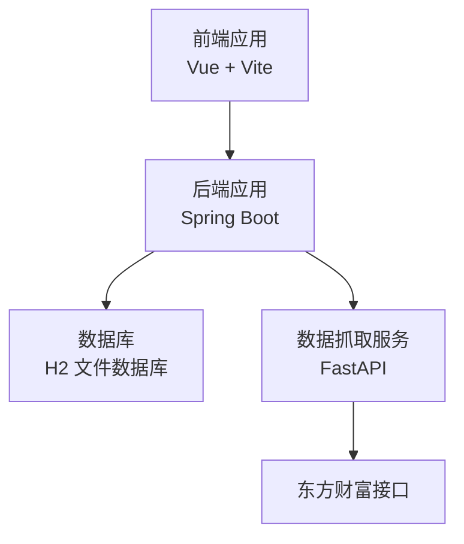
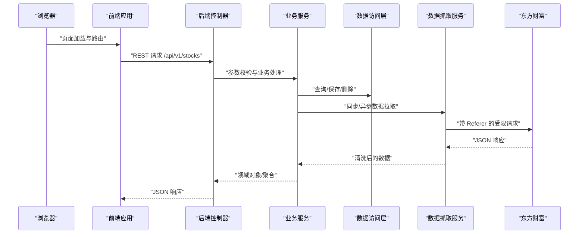
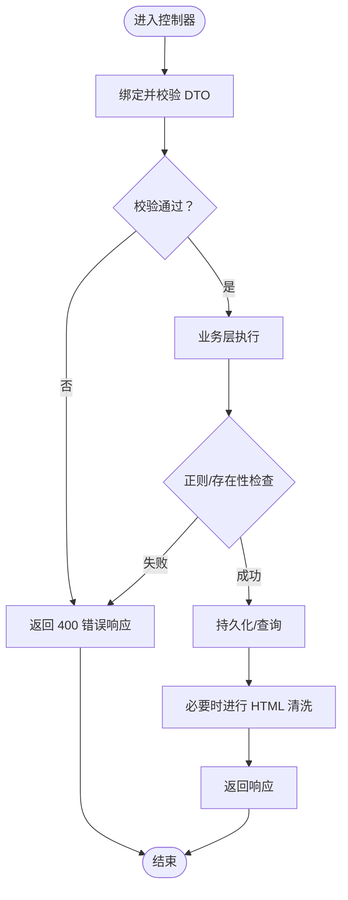
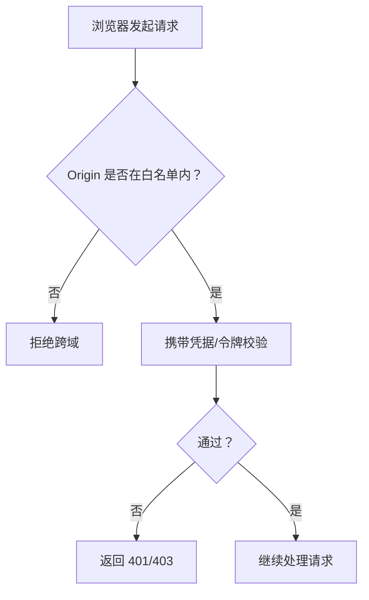
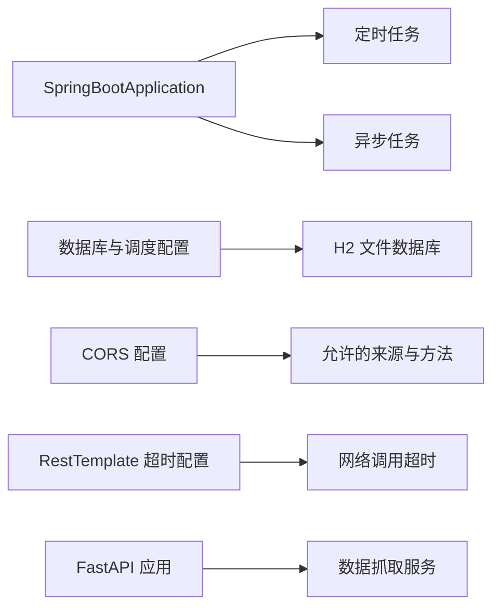

# 安全编码最佳实践

<cite>
**本文引用的文件**
- [StockApplication.java](file://backend/src/main/java/com/stock/StockApplication.java)
- [application.yml](file://backend/src/main/resources/application.yml)
- [WebConfig.java](file://backend/src/main/java/com/stock/config/WebConfig.java)
- [RestTemplateConfig.java](file://backend/src/main/java/com/stock/config/RestTemplateConfig.java)
- [GlobalExceptionHandler.java](file://backend/src/main/java/com/stock/exception/GlobalExceptionHandler.java)
- [ErrorResponse.java](file://backend/src/main/java/com/stock/exception/ErrorResponse.java)
- [StockController.java](file://backend/src/main/java/com/stock/controller/StockController.java)
- [AddStockRequest.java](file://backend/src/main/java/com/stock/dto/request/AddStockRequest.java)
- [Stock.java](file://backend/src/main/java/com/stock/entity/Stock.java)
- [StockService.java](file://backend/src/main/java/com/stock/service/StockService.java)
- [HtmlSanitizer.java](file://backend/src/main/java/com/stock/util/HtmlSanitizer.java)
- [main.ts](file://frontend/src/main.ts)
- [vite.config.ts](file://frontend/vite.config.ts)
- [app.py](file://data-fetcher/app.py)
- [config.py](file://data-fetcher/core/config.py)
</cite>

## 目录
1. [引言](#引言)
2. [项目结构](#项目结构)
3. [核心组件](#核心组件)
4. [架构总览](#架构总览)
5. [详细组件分析](#详细组件分析)
6. [依赖分析](#依赖分析)
7. [性能考虑](#性能考虑)
8. [故障排查指南](#故障排查指南)
9. [结论](#结论)
10. [附录](#附录)

## 引言
本文件面向“股票交易系统”的安全编码最佳实践，聚焦于输入验证策略（参数校验、SQL注入防护、XSS防护）、权限控制机制（RBAC模型、API权限、数据权限）、数据加密实践（传输加密、存储加密、密钥管理），并结合现有代码实现进行漏洞防护案例、安全审计要点与合规性要求说明。同时覆盖前端安全（CSRF防护、CORS配置、敏感信息保护）、API安全设计、日志安全策略，并提供安全测试方法、漏洞扫描工具与应急响应流程建议。

## 项目结构
系统采用前后端分离架构：后端为 Spring Boot 应用，负责业务逻辑、数据持久化与异常统一处理；前端为 Vue 应用，通过 REST 接口调用后端；数据抓取服务为独立的 Python/FastAPI 服务，提供财务、资金流等数据。

图表来源
- [StockApplication.java:1-16](file://backend/src/main/java/com/stock/StockApplication.java#L1-L16)
- [application.yml:1-28](file://backend/src/main/resources/application.yml#L1-L28)
- [app.py:1-31](file://data-fetcher/app.py#L1-L31)

章节来源
- [StockApplication.java:1-16](file://backend/src/main/java/com/stock/StockApplication.java#L1-L16)
- [application.yml:1-28](file://backend/src/main/resources/application.yml#L1-L28)
- [main.ts:1-11](file://frontend/src/main.ts#L1-L11)
- [vite.config.ts:1-8](file://frontend/vite.config.ts#L1-L8)
- [app.py:1-31](file://data-fetcher/app.py#L1-L31)

## 核心组件
- 输入验证与参数校验：使用 Jakarta Bean Validation 对请求 DTO 进行注解式校验；在业务层补充正则与存在性检查。
- 统一异常处理：全局异常处理器返回结构化错误响应，避免泄露内部细节。
- 数据访问与持久化：JPA/Hibernate 访问数据库，使用 Repository 删除时按主键清理关联表。
- 前端路由与状态：Vue 应用初始化与路由挂载。
- CORS 配置：后端开放特定路径的跨域访问白名单。
- 数据抓取与限流：Python 服务对第三方接口进行速率限制与重试控制。

章节来源
- [AddStockRequest.java:1-10](file://backend/src/main/java/com/stock/dto/request/AddStockRequest.java#L1-L10)
- [StockService.java:93-163](file://backend/src/main/java/com/stock/service/StockService.java#L93-L163)
- [GlobalExceptionHandler.java:1-33](file://backend/src/main/java/com/stock/exception/GlobalExceptionHandler.java#L1-L33)
- [ErrorResponse.java:1-8](file://backend/src/main/java/com/stock/exception/ErrorResponse.java#L1-L8)
- [StockController.java:1-57](file://backend/src/main/java/com/stock/controller/StockController.java#L1-L57)
- [Stock.java:1-86](file://backend/src/main/java/com/stock/entity/Stock.java#L1-L86)
- [WebConfig.java:1-15](file://backend/src/main/java/com/stock/config/WebConfig.java#L1-L15)
- [main.ts:1-11](file://frontend/src/main.ts#L1-L11)
- [app.py:1-31](file://data-fetcher/app.py#L1-L31)
- [config.py:20-100](file://data-fetcher/core/config.py#L20-L100)

## 架构总览
下图展示从前端到后端再到数据抓取服务的整体交互，以及关键安全控制点。

图表来源
- [StockController.java:17-57](file://backend/src/main/java/com/stock/controller/StockController.java#L17-L57)
- [StockService.java:93-163](file://backend/src/main/java/com/stock/service/StockService.java#L93-L163)
- [Stock.java:1-86](file://backend/src/main/java/com/stock/entity/Stock.java#L1-L86)
- [app.py:14-25](file://data-fetcher/app.py#L14-L25)
- [config.py:80-121](file://data-fetcher/core/config.py#L80-L121)

## 详细组件分析

### 输入验证策略
- 参数校验
  - DTO 层：使用注解对字段进行非空、长度与格式约束，确保入参符合预期。
  - 控制器层：开启方法级校验，统一捕获校验异常并返回结构化错误。
  - 业务层：补充正则匹配与存在性检查，避免边界条件导致的异常。
- SQL 注入防护
  - 使用 JPA/Hibernate 查询与命名参数，避免拼接原生 SQL。
  - 删除操作按主键清理关联表，减少手写 SQL 风险。
- XSS 防护
  - 提供 HTML 清洗工具，仅允许有限标签集合，对富文本输入进行净化。

图表来源
- [AddStockRequest.java:7-9](file://backend/src/main/java/com/stock/dto/request/AddStockRequest.java#L7-L9)
- [StockController.java:30](file://backend/src/main/java/com/stock/controller/StockController.java#L30)
- [GlobalExceptionHandler.java:25-31](file://backend/src/main/java/com/stock/exception/GlobalExceptionHandler.java#L25-L31)
- [StockService.java:95-97](file://backend/src/main/java/com/stock/service/StockService.java#L95-L97)
- [StockService.java:166-189](file://backend/src/main/java/com/stock/service/StockService.java#L166-L189)
- [HtmlSanitizer.java:10-13](file://backend/src/main/java/com/stock/util/HtmlSanitizer.java#L10-L13)

章节来源
- [AddStockRequest.java:1-10](file://backend/src/main/java/com/stock/dto/request/AddStockRequest.java#L1-L10)
- [StockController.java:17-57](file://backend/src/main/java/com/stock/controller/StockController.java#L17-L57)
- [GlobalExceptionHandler.java:1-33](file://backend/src/main/java/com/stock/exception/GlobalExceptionHandler.java#L1-L33)
- [StockService.java:93-189](file://backend/src/main/java/com/stock/service/StockService.java#L93-L189)
- [HtmlSanitizer.java:1-15](file://backend/src/main/java/com/stock/util/HtmlSanitizer.java#L1-L15)

### 权限控制机制
- RBAC 模型与 API 权限
  - 当前代码未体现基于角色的访问控制（RBAC）或细粒度 API 权限注解。建议引入 Spring Security 的 @PreAuthorize/@PostAuthorize 或基于方法的安全表达式，配合用户角色与资源权限矩阵。
- 数据权限
  - 可通过在查询层增加租户/组织维度过滤，或在业务层根据用户上下文动态限定可见范围。
- 实施建议
  - 在控制器或服务层增加鉴权拦截器或切面，对敏感接口进行权限校验。
  - 将权限判定下沉至 Repository 层，避免越权查询。

[本节为通用安全设计建议，不直接分析具体文件，故不附“章节来源”]

### 数据加密实践
- 传输加密
  - 生产环境应启用 HTTPS，后端配置 SSL/TLS；前端通过受信域名访问后端。
- 存储加密
  - 对敏感字段（如用户标识、凭证）采用强哈希或对称加密；数据库连接凭据与密钥通过环境变量注入。
- 密钥管理
  - 使用密钥管理系统（KMS）或硬件安全模块（HSM）；定期轮换密钥并最小化暴露面。

[本节为通用安全设计建议，不直接分析具体文件，故不附“章节来源”]

### 前端安全
- CSRF 防护
  - 后端未启用 CSRF 保护；建议在 Spring Security 中开启 CSRF 并配合同源策略与 SameSite Cookie。
- CORS 配置
  - 当前后端仅开放特定路径与来源，建议生产环境严格限定 allowedOrigins，避免通配符。
- 敏感信息保护
  - 前端构建产物不应包含敏感配置；通过环境变量注入运行时配置。

图表来源
- [WebConfig.java:8-13](file://backend/src/main/java/com/stock/config/WebConfig.java#L8-L13)

章节来源
- [WebConfig.java:1-15](file://backend/src/main/java/com/stock/config/WebConfig.java#L1-L15)
- [main.ts:1-11](file://frontend/src/main.ts#L1-L11)
- [vite.config.ts:1-8](file://frontend/vite.config.ts#L1-L8)

### API 安全设计
- 身份认证与授权
  - 引入 JWT/OIDC 等标准方案；对敏感接口强制认证与授权。
- 速率限制与防刷
  - 在网关或控制器层实施 IP/用户维度的限流策略。
- 审计日志
  - 记录关键操作（增删改查、登录、导出）的时间戳、用户、IP、参数摘要与结果状态。

[本节为通用安全设计建议，不直接分析具体文件，故不附“章节来源”]

### 日志安全策略
- 结构化日志
  - 输出 JSON 格式日志，包含时间、级别、服务名、请求 ID、用户标识、操作类型与结果。
- 敏感信息脱敏
  - 对密码、令牌、手机号、身份证号等进行脱敏处理。
- 日志隔离与保留
  - 分环境存储，设置保留周期与轮转策略，防止日志被篡改。

[本节为通用安全设计建议，不直接分析具体文件，故不附“章节来源”]

### 安全测试方法与工具
- 单元与集成测试
  - 针对输入验证、异常处理与业务边界编写测试用例。
- 漏洞扫描
  - 使用 SAST（SonarQube/SpotBugs/Spotless）与 DAST（OWASP ZAP/Contrast Security）进行静态与动态扫描。
- 渗透测试
  - 模拟常见攻击（SQL 注入、XSS、CSRF、暴力破解）评估系统韧性。

[本节为通用安全测试建议，不直接分析具体文件，故不附“章节来源”]

### 应急响应流程
- 事件分类与分级
  - 根据影响范围与严重程度划分等级，明确处置时限。
- 处置步骤
  - 隔离受影响系统、定位根因、修复漏洞、回滚变更、恢复服务与复盘总结。
- 报告与改进
  - 形成事件报告，更新安全基线与应急预案。

[本节为通用应急响应建议，不直接分析具体文件，故不附“章节来源”]

## 依赖分析
后端应用启动、定时任务与异步任务均通过注解启用；数据库配置为本地文件型数据库；CORS 仅开放特定路径与来源；数据抓取服务对第三方接口进行速率限制与重试。

图表来源
- [StockApplication.java:8-10](file://backend/src/main/java/com/stock/StockApplication.java#L8-L10)
- [application.yml:4-17](file://backend/src/main/resources/application.yml#L4-L17)
- [WebConfig.java:8-13](file://backend/src/main/java/com/stock/config/WebConfig.java#L8-L13)
- [RestTemplateConfig.java:10-16](file://backend/src/main/java/com/stock/config/RestTemplateConfig.java#L10-L16)
- [app.py:7-12](file://data-fetcher/app.py#L7-L12)

章节来源
- [StockApplication.java:1-16](file://backend/src/main/java/com/stock/StockApplication.java#L1-L16)
- [application.yml:1-28](file://backend/src/main/resources/application.yml#L1-L28)
- [WebConfig.java:1-15](file://backend/src/main/java/com/stock/config/WebConfig.java#L1-L15)
- [RestTemplateConfig.java:1-18](file://backend/src/main/java/com/stock/config/RestTemplateConfig.java#L1-L18)
- [app.py:1-31](file://data-fetcher/app.py#L1-L31)

## 性能考虑
- 网络调用超时
  - 合理设置连接与读取超时，避免阻塞线程池。
- 速率限制
  - Python 服务内置最小请求间隔与指数退避重试，降低第三方接口压力。
- 数据库事务
  - 在新增股票后注册事务提交后的异步初始化回调，保证一致性与并发安全。

章节来源
- [RestTemplateConfig.java:10-16](file://backend/src/main/java/com/stock/config/RestTemplateConfig.java#L10-L16)
- [config.py:20-100](file://data-fetcher/core/config.py#L20-L100)
- [StockService.java:145-160](file://backend/src/main/java/com/stock/service/StockService.java#L145-L160)

## 故障排查指南
- 统一错误响应
  - 全局异常处理器将业务异常映射为结构化错误响应，便于前端与监控系统识别。
- 字段校验失败
  - 方法级校验异常会汇总字段与默认消息，返回 400。
- 数据获取异常
  - 数据抓取异常映射为 503，提示服务不可用或上游问题。

章节来源
- [GlobalExceptionHandler.java:1-33](file://backend/src/main/java/com/stock/exception/GlobalExceptionHandler.java#L1-L33)
- [ErrorResponse.java:1-8](file://backend/src/main/java/com/stock/exception/ErrorResponse.java#L1-L8)

## 结论
当前系统在输入验证、异常处理与前端 CORS 方面具备基础安全能力。建议进一步完善 RBAC 与 API 权限控制、强化传输与存储加密、细化日志与审计策略，并引入统一的安全测试与应急响应流程，以满足更严格的生产安全要求。

## 附录
- 配置参考
  - 数据库与调度配置位于后端资源文件中。
  - 前端构建配置采用默认插件，未发现敏感信息硬编码。
  - 数据抓取服务对第三方接口设置了 Referer 与速率限制。

章节来源
- [application.yml:1-28](file://backend/src/main/resources/application.yml#L1-L28)
- [vite.config.ts:1-8](file://frontend/vite.config.ts#L1-L8)
- [config.py:8-16](file://data-fetcher/core/config.py#L8-L16)