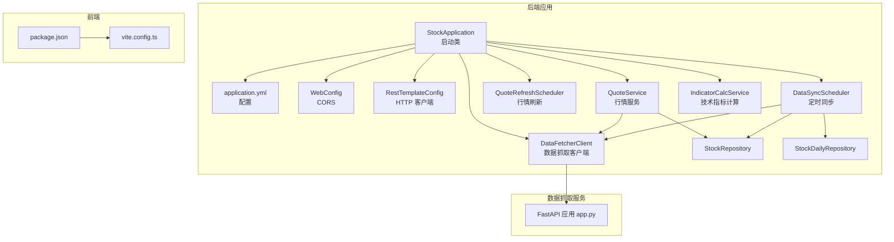
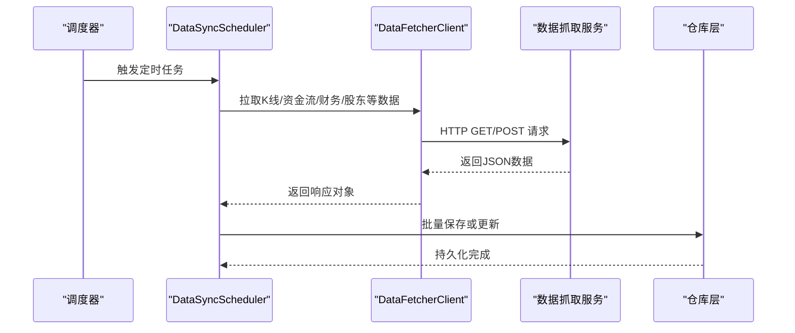
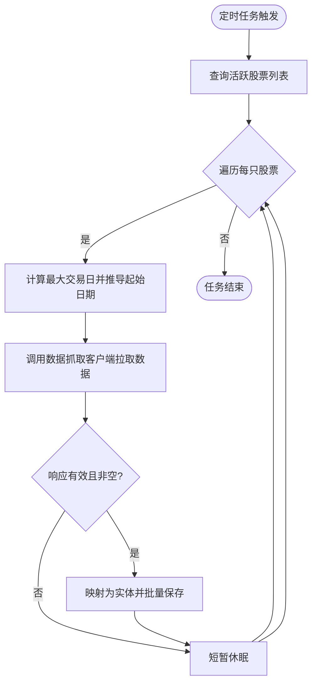
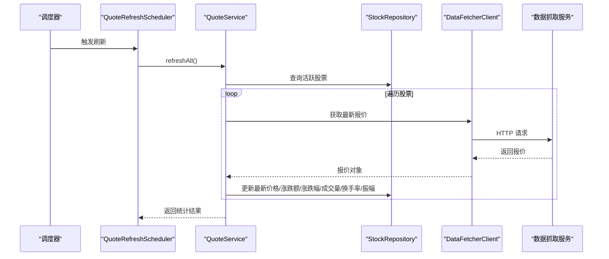
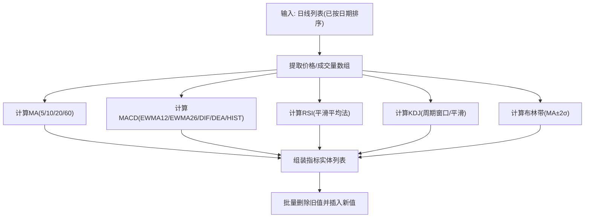
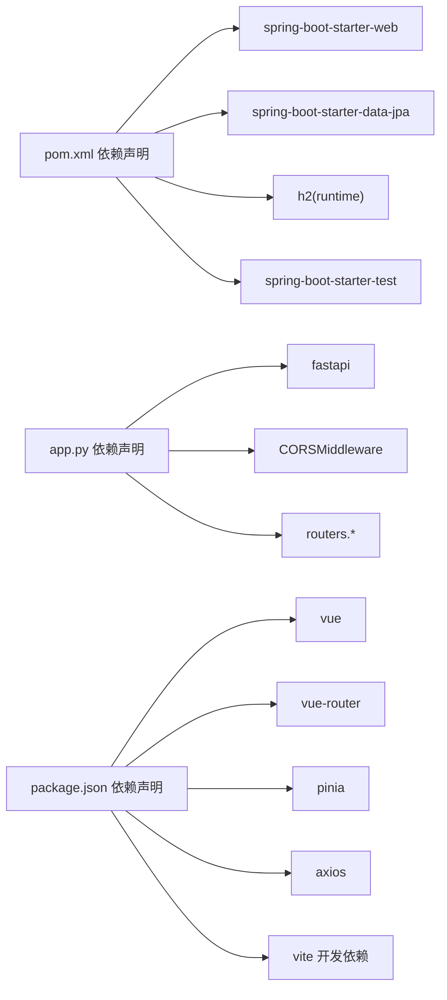

# 性能优化最佳实践

<cite>
**本文引用的文件**
- [StockApplication.java](file://backend/src/main/java/com/stock/StockApplication.java)
- [application.yml](file://backend/src/main/resources/application.yml)
- [RestTemplateConfig.java](file://backend/src/main/java/com/stock/config/RestTemplateConfig.java)
- [WebConfig.java](file://backend/src/main/java/com/stock/config/WebConfig.java)
- [DataSyncScheduler.java](file://backend/src/main/java/com/stock/scheduler/DataSyncScheduler.java)
- [QuoteRefreshScheduler.java](file://backend/src/main/java/com/stock/scheduler/QuoteRefreshScheduler.java)
- [DataFetcherClient.java](file://backend/src/main/java/com/stock/client/DataFetcherClient.java)
- [StockRepository.java](file://backend/src/main/java/com/stock/repository/StockRepository.java)
- [StockDailyRepository.java](file://backend/src/main/java/com/stock/repository/StockDailyRepository.java)
- [QuoteService.java](file://backend/src/main/java/com/stock/service/QuoteService.java)
- [IndicatorCalcService.java](file://backend/src/main/java/com/stock/service/IndicatorCalcService.java)
- [app.py](file://data-fetcher/app.py)
- [pom.xml](file://backend/pom.xml)
- [package.json](file://frontend/package.json)
- [vite.config.ts](file://frontend/vite.config.ts)
</cite>

## 目录
1. [简介](#简介)
2. [项目结构](#项目结构)
3. [核心组件](#核心组件)
4. [架构总览](#架构总览)
5. [详细组件分析](#详细组件分析)
6. [依赖分析](#依赖分析)
7. [性能考虑](#性能考虑)
8. [故障排查指南](#故障排查指南)
9. [结论](#结论)
10. [附录](#附录)

## 简介
本文件面向股票交易系统后端与数据抓取服务，提供一套可落地的性能优化最佳实践，覆盖数据库性能优化、缓存策略设计、并发处理优化、前端性能优化、API性能优化、内存管理与容量规划，并配套性能测试方法与监控指标建议。内容基于现有代码库的实际实现进行提炼与扩展，帮助在保证正确性的前提下提升吞吐、降低延迟、增强稳定性。

## 项目结构
系统采用多模块分层组织：
- 后端 Spring Boot 应用：负责业务编排、定时任务调度、数据持久化与对外接口。
- 数据抓取服务：独立的 Python/FastAPI 服务，提供 REST 接口供后端拉取行情与财务等数据。
- 前端 Vue 应用：通过 Vite 构建，使用 Axios 发起请求。

图表来源
- [StockApplication.java:1-16](file://backend/src/main/java/com/stock/StockApplication.java#L1-L16)
- [application.yml:1-28](file://backend/src/main/resources/application.yml#L1-L28)
- [WebConfig.java:1-15](file://backend/src/main/java/com/stock/config/WebConfig.java#L1-L15)
- [RestTemplateConfig.java:1-18](file://backend/src/main/java/com/stock/config/RestTemplateConfig.java#L1-L18)
- [DataSyncScheduler.java:1-238](file://backend/src/main/java/com/stock/scheduler/DataSyncScheduler.java#L1-L238)
- [QuoteRefreshScheduler.java:1-35](file://backend/src/main/java/com/stock/scheduler/QuoteRefreshScheduler.java#L1-L35)
- [DataFetcherClient.java:1-126](file://backend/src/main/java/com/stock/client/DataFetcherClient.java#L1-L126)
- [StockRepository.java:1-18](file://backend/src/main/java/com/stock/repository/StockRepository.java#L1-L18)
- [StockDailyRepository.java:1-24](file://backend/src/main/java/com/stock/repository/StockDailyRepository.java#L1-L24)
- [app.py:1-31](file://data-fetcher/app.py#L1-L31)
- [package.json:1-27](file://frontend/package.json#L1-L27)
- [vite.config.ts:1-8](file://frontend/vite.config.ts#L1-L8)

章节来源
- [StockApplication.java:1-16](file://backend/src/main/java/com/stock/StockApplication.java#L1-L16)
- [application.yml:1-28](file://backend/src/main/resources/application.yml#L1-L28)
- [WebConfig.java:1-15](file://backend/src/main/java/com/stock/config/WebConfig.java#L1-L15)
- [RestTemplateConfig.java:1-18](file://backend/src/main/java/com/stock/config/RestTemplateConfig.java#L1-L18)
- [DataSyncScheduler.java:1-238](file://backend/src/main/java/com/stock/scheduler/DataSyncScheduler.java#L1-L238)
- [QuoteRefreshScheduler.java:1-35](file://backend/src/main/java/com/stock/scheduler/QuoteRefreshScheduler.java#L1-L35)
- [DataFetcherClient.java:1-126](file://backend/src/main/java/com/stock/client/DataFetcherClient.java#L1-L126)
- [StockRepository.java:1-18](file://backend/src/main/java/com/stock/repository/StockRepository.java#L1-L18)
- [StockDailyRepository.java:1-24](file://backend/src/main/java/com/stock/repository/StockDailyRepository.java#L1-L24)
- [app.py:1-31](file://data-fetcher/app.py#L1-L31)
- [package.json:1-27](file://frontend/package.json#L1-L27)
- [vite.config.ts:1-8](file://frontend/vite.config.ts#L1-L8)

## 核心组件
- 启动与调度：启用调度与异步注解，统一入口启动。
- 配置中心：数据库连接、JPA/H2 控制台、定时任务表达式、数据抓取服务地址与超时。
- Web 层：CORS 配置，允许前端本地开发域访问。
- HTTP 客户端：统一的 RestTemplate 超时配置，避免阻塞。
- 定时任务：行情刷新、K 线/资金流/日频数据同步、周频财务与股东数据同步、技术指标重算。
- 服务层：行情读写、指标计算（含 MA/MACD/RSI/KDJ/BOLL）。
- 仓库层：JPA 访问 Stock 与 StockDaily 等实体。
- 数据抓取客户端：封装对数据抓取服务的调用，统一封装异常。
- 前端构建：Vue + Vite，按需插件与脚本。

章节来源
- [StockApplication.java:1-16](file://backend/src/main/java/com/stock/StockApplication.java#L1-L16)
- [application.yml:1-28](file://backend/src/main/resources/application.yml#L1-L28)
- [WebConfig.java:1-15](file://backend/src/main/java/com/stock/config/WebConfig.java#L1-L15)
- [RestTemplateConfig.java:1-18](file://backend/src/main/java/com/stock/config/RestTemplateConfig.java#L1-L18)
- [DataSyncScheduler.java:1-238](file://backend/src/main/java/com/stock/scheduler/DataSyncScheduler.java#L1-L238)
- [QuoteRefreshScheduler.java:1-35](file://backend/src/main/java/com/stock/scheduler/QuoteRefreshScheduler.java#L1-L35)
- [QuoteService.java:1-98](file://backend/src/main/java/com/stock/service/QuoteService.java#L1-L98)
- [IndicatorCalcService.java:1-210](file://backend/src/main/java/com/stock/service/IndicatorCalcService.java#L1-L210)
- [StockRepository.java:1-18](file://backend/src/main/java/com/stock/repository/StockRepository.java#L1-L18)
- [StockDailyRepository.java:1-24](file://backend/src/main/java/com/stock/repository/StockDailyRepository.java#L1-L24)
- [DataFetcherClient.java:1-126](file://backend/src/main/java/com/stock/client/DataFetcherClient.java#L1-L126)
- [app.py:1-31](file://data-fetcher/app.py#L1-L31)
- [package.json:1-27](file://frontend/package.json#L1-L27)
- [vite.config.ts:1-8](file://frontend/vite.config.ts#L1-L8)

## 架构总览
后端通过定时任务周期性从数据抓取服务拉取数据，写入本地数据库；行情刷新任务定期更新最新价格；服务层负责业务逻辑与指标计算；前端通过 Axios 请求后端接口展示数据。

图表来源
- [DataSyncScheduler.java:54-82](file://backend/src/main/java/com/stock/scheduler/DataSyncScheduler.java#L54-L82)
- [DataFetcherClient.java:31-93](file://backend/src/main/java/com/stock/client/DataFetcherClient.java#L31-L93)
- [app.py:23-25](file://data-fetcher/app.py#L23-L25)

## 详细组件分析

### 数据同步与定时任务
- 任务类型与频率：K 线、资金流、日频（估值/研报）、周频（利润表/资产负债表/股东人数）、技术指标重算。
- 并发与事务：每个任务标注事务注解，逐只股票顺序处理，期间插入固定休眠以缓解上游限流压力。
- 异常处理：捕获异常并记录告警日志，避免中断整个批次。
- 关键路径：仓库查询活跃股票列表 → 计算起止日期 → 调用数据抓取客户端 → 过滤/映射 → 批量持久化。

图表来源
- [DataSyncScheduler.java:54-161](file://backend/src/main/java/com/stock/scheduler/DataSyncScheduler.java#L54-L161)

章节来源
- [DataSyncScheduler.java:1-238](file://backend/src/main/java/com/stock/scheduler/DataSyncScheduler.java#L1-L238)

### 行情刷新与缓存策略
- 刷新策略：每日工作日的特定时间窗口内，遍历所有活跃股票，调用数据抓取服务获取最新报价并更新库存储字段。
- 缓存现状：QuoteService 返回的报价响应中，部分字段未缓存（如昨收、开盘、最高、最低、成交额），而是标记为“过期”状态以便后续拉取。
- 建议：引入 Redis 缓存最新价格与成交量等高频字段，设置合理 TTL；对查询热点增加本地缓存（如 Guava/Caffeine）作为二级缓存；实现缓存失效策略（写后失效或基于版本号）。

图表来源
- [QuoteRefreshScheduler.java:24-33](file://backend/src/main/java/com/stock/scheduler/QuoteRefreshScheduler.java#L24-L33)
- [QuoteService.java:64-96](file://backend/src/main/java/com/stock/service/QuoteService.java#L64-L96)
- [DataFetcherClient.java:43-46](file://backend/src/main/java/com/stock/client/DataFetcherClient.java#L43-L46)
- [app.py:23-25](file://data-fetcher/app.py#L23-L25)

章节来源
- [QuoteRefreshScheduler.java:1-35](file://backend/src/main/java/com/stock/scheduler/QuoteRefreshScheduler.java#L1-L35)
- [QuoteService.java:1-98](file://backend/src/main/java/com/stock/service/QuoteService.java#L1-L98)
- [DataFetcherClient.java:1-126](file://backend/src/main/java/com/stock/client/DataFetcherClient.java#L1-L126)

### 技术指标计算
- 计算范围：基于最近一年的日线数据，批量计算 MA、MACD、RSI、KDJ、布林带。
- 实现要点：数组化处理（价格、成交量）以减少重复转换开销；指数平滑参数预设；边界值处理（不足周期返回空）。
- 性能建议：将日线数据按天排序后一次性传入，避免多次扫描；对长序列计算可考虑分页或滑动窗口优化；结果入库前先删除旧值再批量插入。

图表来源
- [IndicatorCalcService.java:15-63](file://backend/src/main/java/com/stock/service/IndicatorCalcService.java#L15-L63)
- [IndicatorCalcService.java:66-204](file://backend/src/main/java/com/stock/service/IndicatorCalcService.java#L66-L204)

章节来源
- [IndicatorCalcService.java:1-210](file://backend/src/main/java/com/stock/service/IndicatorCalcService.java#L1-L210)

### 数据抓取客户端与外部依赖
- 统一基地址与超时：通过配置注入数据抓取服务地址；RestTemplate 设置连接与读取超时。
- 错误处理：对空响应抛出自定义异常；对底层异常包装为统一的数据抓取异常。
- 批量接口：支持批量获取报价，减少往返次数。

章节来源
- [DataFetcherClient.java:1-126](file://backend/src/main/java/com/stock/client/DataFetcherClient.java#L1-L126)
- [RestTemplateConfig.java:1-18](file://backend/src/main/java/com/stock/config/RestTemplateConfig.java#L1-L18)
- [application.yml:19-22](file://backend/src/main/resources/application.yml#L19-L22)

### 数据库与仓储
- 数据源：H2 文件型数据库，DDL 自动更新，便于开发与测试。
- 仓库接口：提供按日期范围查询、按最新日期查询、求最大交易日、按股票删除等常用操作。
- 建议：为高频查询字段建立复合索引（如 stock_id+trade_date），开启查询日志与慢查询分析；对批量写入使用 JDBC 批处理或 JPA 批量 flush/flush-clear 策略。

章节来源
- [application.yml:5-17](file://backend/src/main/resources/application.yml#L5-L17)
- [StockDailyRepository.java:1-24](file://backend/src/main/java/com/stock/repository/StockDailyRepository.java#L1-L24)
- [StockRepository.java:1-18](file://backend/src/main/java/com/stock/repository/StockRepository.java#L1-L18)

### 前端性能优化
- 构建工具：Vite 提供快速冷启动与热更新；Vue 插件按需加载。
- 依赖与脚本：Axios、Pinia、Vue Router 等，构建脚本包含 TypeScript 编译与产物打包。
- 优化建议：启用代码分割与路由级懒加载；生产环境开启压缩与 Tree-shaking；图片与静态资源 CDN 化；首屏关键资源预加载。

章节来源
- [package.json:1-27](file://frontend/package.json#L1-L27)
- [vite.config.ts:1-8](file://frontend/vite.config.ts#L1-L8)

## 依赖分析
- 后端依赖：Spring Web、Spring Data JPA、H2、Lombok、测试框架等。
- 数据抓取服务：FastAPI、CORS 中间件、多个路由模块。
- 前端依赖：Vue 3、Vue Router、Pinia、Axios、Vite。

图表来源
- [pom.xml:23-55](file://backend/pom.xml#L23-L55)
- [app.py:1-12](file://data-fetcher/app.py#L1-L12)
- [package.json:11-25](file://frontend/package.json#L11-L25)

章节来源
- [pom.xml:1-103](file://backend/pom.xml#L1-L103)
- [app.py:1-31](file://data-fetcher/app.py#L1-L31)
- [package.json:1-27](file://frontend/package.json#L1-L27)

## 性能考虑

### 数据库性能优化
- 索引设计
  - 建议：对 StockDaily 的 stock_id+trade_date 建立复合索引；对 Stock 的 code 建唯一索引；对 Stock 的 isActive 建单列索引以加速活跃股票查询。
  - 参考：仓库接口已提供按 stock_id+trade_date 查询与最大交易日查询，可据此评估是否需要额外索引。
- 查询优化
  - 使用原生 SQL 或命名查询优化高频查询；避免 N+1 查询，优先使用批量查询与投影查询。
  - 对批量写入使用批处理策略，减少往返次数。
- 连接池配置
  - 当前使用默认 H2 驱动配置；建议在生产环境切换到 MySQL/PostgreSQL，并配置连接池（如 HikariCP）参数：最小/最大连接数、空闲超时、连接生命周期、获取超时等。
- 事务与锁
  - 定时任务使用事务包裹，注意长事务会占用锁与缓冲区；建议拆分大批次为小批次提交，降低锁竞争。

章节来源
- [StockDailyRepository.java:15-20](file://backend/src/main/java/com/stock/repository/StockDailyRepository.java#L15-L20)
- [StockRepository.java:12-16](file://backend/src/main/java/com/stock/repository/StockRepository.java#L12-L16)
- [application.yml:5-17](file://backend/src/main/resources/application.yml#L5-L17)

### 缓存策略设计
- Redis 缓存
  - 策略：对最新股价、成交量、涨跌幅、换手率等热点字段设置 TTL（如 30-60 秒），写后失效；对批量报价接口使用布隆过滤器或版本号控制缓存一致性。
  - 失效：写入成功后主动删除对应键；或采用基于版本号的缓存键命名规则。
- 本地缓存
  - 建议：对热点股票的短期缓存使用本地缓存（如 Caffeine），设置容量上限与过期策略，减少 Redis 热点。
- 缓存穿透与雪崩
  - 穿透：对空值也缓存短 TTL；布隆过滤器拦截非法 key。
  - 雪崩：为 TTL 添加抖动；热点 key 单独加互斥锁只让一个线程去拉取。

### 并发处理优化
- 线程池配置
  - 建议：为定时任务与异步处理分别配置线程池；核心线程数根据 CPU 与 IO 比例设置；队列长度与拒绝策略按 SLA 设定。
- 异步处理
  - 对非关键路径（如日志上报、非实时指标计算）使用异步执行，避免阻塞主线程。
- 锁优化
  - 减少细粒度锁范围；使用读写分离或无锁结构；对热点资源使用本地缓存与最终一致策略。

### API 性能优化
- 请求合并与批处理
  - 对批量报价请求使用 DataFetcherClient 的 POST 批量接口，减少网络往返。
- 超时与重试
  - RestTemplate 已设置连接与读取超时；建议在上层增加指数退避重试与熔断降级。
- 响应压缩
  - 在网关或反向代理层启用 gzip 压缩，减少传输体积。

章节来源
- [DataFetcherClient.java:48-57](file://backend/src/main/java/com/stock/client/DataFetcherClient.java#L48-L57)
- [RestTemplateConfig.java:11-16](file://backend/src/main/java/com/stock/config/RestTemplateConfig.java#L11-L16)

### 内存管理最佳实践
- 对象池与复用：对临时数组（如指标计算中的价格数组）尽量复用，避免频繁分配。
- 流式处理：对大批量数据使用流式处理与分页，避免一次性加载到内存。
- GC 友好：减少大对象的跨代引用；及时释放不需要的引用；使用弱引用或软引用缓存少量临时对象。

### 性能测试方法
- 压力测试
  - 使用 JMeter/Locust 对定时任务与行情刷新接口施压，观察吞吐与延迟。
- 端到端测试
  - 前端页面加载时间（First Contentful Paint、Largest Contentful Paint、Cumulative Layout Shift）。
- 数据抓取链路压测
  - 对数据抓取服务进行独立压测，评估其最大承载能力与延迟分布。

### 监控指标设置
- 后端
  - QPS、P95/P99 延迟、错误率、线程池排队长度、数据库连接池使用率、GC 时间占比。
- 前端
  - 首屏时间、交互延迟、资源体积与加载耗时。
- 数据抓取服务
  - 响应时间分布、错误码统计、并发请求数、CPU/内存使用。

### 瓶颈识别技巧
- 数据库瓶颈：慢查询日志、索引使用情况、锁等待与死锁。
- 网络瓶颈：RTT、丢包、带宽饱和；检查 RestTemplate 超时与上游限流。
- 应用瓶颈：CPU 占用高、GC 频繁、线程池饱和；定位热点方法与算法复杂度。
- 前端瓶颈：首屏资源过大、渲染阻塞、重复请求。

## 故障排查指南
- 定时任务失败
  - 检查日志中警告信息，确认是否因上游数据抓取服务不可用或响应为空导致；必要时增加重试与熔断。
- 行情刷新异常
  - 核对 DataFetcherClient 的超时配置与数据抓取服务健康检查接口；确认网络连通性与 CORS 配置。
- 数据库写入缓慢
  - 检查索引缺失、事务过大、批量写入未使用批处理；评估磁盘 IO 与 WAL 写入。
- 前端白屏或加载慢
  - 检查构建产物与静态资源路径；确认网络代理与缓存策略；使用浏览器性能面板分析瓶颈。

章节来源
- [DataSyncScheduler.java:78-81](file://backend/src/main/java/com/stock/scheduler/DataSyncScheduler.java#L78-L81)
- [DataSyncScheduler.java:113-116](file://backend/src/main/java/com/stock/scheduler/DataSyncScheduler.java#L113-L116)
- [DataSyncScheduler.java:157-160](file://backend/src/main/java/com/stock/scheduler/DataSyncScheduler.java#L157-L160)
- [DataSyncScheduler.java:210-214](file://backend/src/main/java/com/stock/scheduler/DataSyncScheduler.java#L210-L214)
- [QuoteService.java:75-79](file://backend/src/main/java/com/stock/service/QuoteService.java#L75-L79)
- [DataFetcherClient.java:112-124](file://backend/src/main/java/com/stock/client/DataFetcherClient.java#L112-L124)
- [app.py:23-25](file://data-fetcher/app.py#L23-L25)

## 结论
本系统在开发阶段已具备完善的定时任务与数据抓取链路，建议在生产环境中重点补齐以下能力：数据库索引与连接池优化、Redis 与本地缓存体系、异步与线程池治理、API 超时与重试、前端资源优化与监控指标完善。通过基准测试与持续监控，逐步迭代性能方案，确保系统在高并发场景下的稳定与高效。

## 附录
- 容量规划建议
  - 依据日均行情刷新量与数据同步量估算数据库写入峰值；结合 Redis 缓存命中率与本地缓存容量，确定缓存节点规模；评估前端并发用户数与静态资源带宽需求。
- 快速验证清单
  - 是否为高频查询字段建立索引？是否启用数据库慢查询分析？
  - 是否引入 Redis 缓存与本地缓存？TTL 与失效策略是否合理？
  - 是否对批量接口与定时任务进行限流与熔断？
  - 是否对前端资源进行压缩与分块加载？