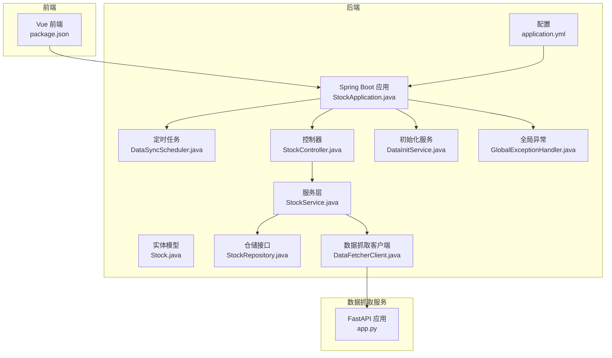
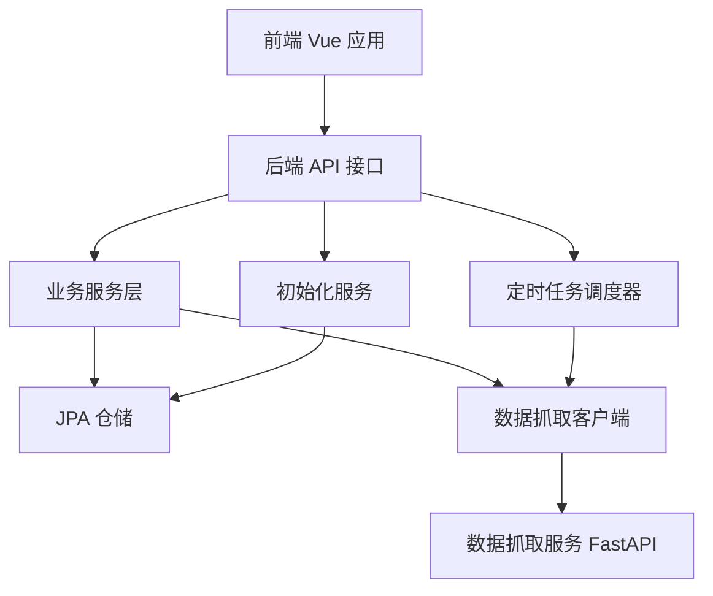
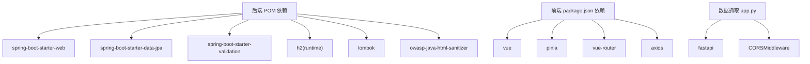

# 最佳实践

<cite>
**本文引用的文件**
- [StockApplication.java](file://backend/src/main/java/com/stock/StockApplication.java)
- [application.yml](file://backend/src/main/resources/application.yml)
- [pom.xml](file://backend/pom.xml)
- [package.json](file://frontend/package.json)
- [app.py](file://data-fetcher/app.py)
- [StockController.java](file://backend/src/main/java/com/stock/controller/StockController.java)
- [StockService.java](file://backend/src/main/java/com/stock/service/StockService.java)
- [Stock.java](file://backend/src/main/java/com/stock/entity/Stock.java)
- [StockRepository.java](file://backend/src/main/java/com/stock/repository/StockRepository.java)
- [DataSyncScheduler.java](file://backend/src/main/java/com/stock/scheduler/DataSyncScheduler.java)
- [RestTemplateConfig.java](file://backend/src/main/java/com/stock/config/RestTemplateConfig.java)
- [DataFetcherClient.java](file://backend/src/main/java/com/stock/client/DataFetcherClient.java)
- [HtmlSanitizer.java](file://backend/src/main/java/com/stock/util/HtmlSanitizer.java)
- [DataInitService.java](file://backend/src/main/java/com/stock/service/DataInitService.java)
- [GlobalExceptionHandler.java](file://backend/src/main/java/com/stock/exception/GlobalExceptionHandler.java)
</cite>

## 目录
1. [引言](#引言)
2. [项目结构](#项目结构)
3. [核心组件](#核心组件)
4. [架构总览](#架构总览)
5. [详细组件分析](#详细组件分析)
6. [依赖分析](#依赖分析)
7. [性能考虑](#性能考虑)
8. [故障排查指南](#故障排查指南)
9. [结论](#结论)
10. [附录](#附录)

## 引言
本最佳实践文档面向股票交易系统后端与数据抓取子系统，聚焦于系统设计原则、模块划分与依赖管理；性能优化（数据库、缓存、并发）；安全编码（输入校验、权限控制、数据加密）；以及可维护性与技术债治理策略。文档同时提供监控告警、故障恢复与灾备建议，并以图示化方式呈现关键流程与架构。

## 项目结构
系统采用多模块分层组织：后端 Spring Boot 应用负责业务编排、定时任务、数据初始化与异常统一处理；前端 Vue 应用通过 API 调用后端；独立的数据抓取服务（FastAPI）提供行情与财务等外部数据接口；后端通过 RestTemplate 客户端访问数据抓取服务。

图表来源
- [StockApplication.java:1-16](file://backend/src/main/java/com/stock/StockApplication.java#L1-L16)
- [application.yml:1-28](file://backend/src/main/resources/application.yml#L1-L28)
- [DataSyncScheduler.java:1-238](file://backend/src/main/java/com/stock/scheduler/DataSyncScheduler.java#L1-L238)
- [StockController.java:1-57](file://backend/src/main/java/com/stock/controller/StockController.java#L1-L57)
- [StockService.java:1-243](file://backend/src/main/java/com/stock/service/StockService.java#L1-L243)
- [Stock.java:1-86](file://backend/src/main/java/com/stock/entity/Stock.java#L1-L86)
- [StockRepository.java:1-18](file://backend/src/main/java/com/stock/repository/StockRepository.java#L1-L18)
- [DataFetcherClient.java:1-126](file://backend/src/main/java/com/stock/client/DataFetcherClient.java#L1-L126)
- [DataInitService.java:1-101](file://backend/src/main/java/com/stock/service/DataInitService.java#L1-L101)
- [GlobalExceptionHandler.java:1-33](file://backend/src/main/java/com/stock/exception/GlobalExceptionHandler.java#L1-L33)
- [app.py:1-31](file://data-fetcher/app.py#L1-L31)

章节来源
- [StockApplication.java:1-16](file://backend/src/main/java/com/stock/StockApplication.java#L1-L16)
- [application.yml:1-28](file://backend/src/main/resources/application.yml#L1-L28)
- [pom.xml:1-103](file://backend/pom.xml#L1-L103)
- [package.json:1-27](file://frontend/package.json#L1-L27)
- [app.py:1-31](file://data-fetcher/app.py#L1-L31)

## 核心组件
- 应用入口与调度：应用启动类启用调度与异步，配置文件定义数据源、JPA、H2 控制台与数据抓取服务地址及定时任务表达式。
- 控制器与服务：StockController 提供增删查改与初始化状态查询；StockService 实现业务逻辑，包含事务边界、调用数据抓取客户端、触发异步初始化与完整性统计。
- 数据模型与仓储：Stock 实体映射 stock 表；StockRepository 提供基础查询能力。
- 定时任务：DataSyncScheduler 按工作日与周维度同步日线、资金流、估值、研报、利润表、资产负债表、股东人数等数据，并在结束后重算指标。
- 数据抓取客户端：DataFetcherClient 统一封装 RestTemplate 调用，集中处理空响应与异常转换。
- 初始化服务：DataInitService 串行执行初始化步骤（估值、日线、资金流、利润、财务、股东、研报、指标），记录每步状态。
- 全局异常：统一处理业务异常与参数校验异常，返回标准化错误响应。

章节来源
- [StockController.java:1-57](file://backend/src/main/java/com/stock/controller/StockController.java#L1-L57)
- [StockService.java:1-243](file://backend/src/main/java/com/stock/service/StockService.java#L1-L243)
- [Stock.java:1-86](file://backend/src/main/java/com/stock/entity/Stock.java#L1-L86)
- [StockRepository.java:1-18](file://backend/src/main/java/com/stock/repository/StockRepository.java#L1-L18)
- [DataSyncScheduler.java:1-238](file://backend/src/main/java/com/stock/scheduler/DataSyncScheduler.java#L1-L238)
- [DataFetcherClient.java:1-126](file://backend/src/main/java/com/stock/client/DataFetcherClient.java#L1-L126)
- [DataInitService.java:1-101](file://backend/src/main/java/com/stock/service/DataInitService.java#L1-L101)
- [GlobalExceptionHandler.java:1-33](file://backend/src/main/java/com/stock/exception/GlobalExceptionHandler.java#L1-L33)

## 架构总览
系统采用“前端-后端-数据抓取服务”的三层架构。后端通过 RestTemplate 访问数据抓取服务，定时任务驱动数据同步与指标重算，初始化服务保障新增股票的数据完整性。

图表来源
- [StockController.java:1-57](file://backend/src/main/java/com/stock/controller/StockController.java#L1-L57)
- [StockService.java:1-243](file://backend/src/main/java/com/stock/service/StockService.java#L1-L243)
- [DataSyncScheduler.java:1-238](file://backend/src/main/java/com/stock/scheduler/DataSyncScheduler.java#L1-L238)
- [DataFetcherClient.java:1-126](file://backend/src/main/java/com/stock/client/DataFetcherClient.java#L1-L126)
- [DataInitService.java:1-101](file://backend/src/main/java/com/stock/service/DataInitService.java#L1-L101)
- [app.py:1-31](file://data-fetcher/app.py#L1-L31)

## 详细组件分析

### 系统设计最佳实践
- 分层清晰：控制器仅做参数绑定与响应封装；服务层承担业务编排与事务边界；仓储层专注数据持久化；客户端封装外部调用。
- 配置集中：数据库、JPA、H2 控制台、数据抓取服务地址与定时任务表达式集中在配置文件中，便于运维与变更。
- 可观测性：日志记录关键路径（如初始化开始/结束、定时任务执行、失败告警），为问题定位提供依据。
- 错误处理：全局异常处理器统一返回标准化错误码与消息，避免泄露内部细节。

章节来源
- [application.yml:1-28](file://backend/src/main/resources/application.yml#L1-L28)
- [StockController.java:1-57](file://backend/src/main/java/com/stock/controller/StockController.java#L1-L57)
- [StockService.java:1-243](file://backend/src/main/java/com/stock/service/StockService.java#L1-L243)
- [GlobalExceptionHandler.java:1-33](file://backend/src/main/java/com/stock/exception/GlobalExceptionHandler.java#L1-L33)

### 性能优化最佳实践
- 数据库优化
  - 使用 JPA 自动建模与 DDL 自动更新，便于开发环境快速迭代；生产环境建议改为手动迁移脚本，避免自动迁移带来的风险。
  - 合理索引：StockRepository 已按活跃状态查询，建议对高频查询字段（如 code、added_at）建立索引。
- 缓存策略
  - 对高频读取且不频繁变化的数据（如个股基础信息、行业板块信息）引入本地缓存或 Redis 缓存，减少数据库压力。
  - 对批量报价请求，结合客户端批处理能力，降低网络往返次数。
- 并发处理
  - 异步初始化：新增股票后，使用异步初始化服务串行执行各数据域初始化，避免阻塞主事务。
  - 定时任务限流：当前实现对每个股票间歇休眠，建议引入令牌桶或队列限速，防止瞬时高峰导致下游限流或超时。
  - 线程池与超时：RestTemplate 连接与读取超时已配置，建议根据外部服务 SLA 调整并增加重试与熔断策略。

章节来源
- [application.yml:1-28](file://backend/src/main/resources/application.yml#L1-L28)
- [DataInitService.java:1-101](file://backend/src/main/java/com/stock/service/DataInitService.java#L1-L101)
- [DataSyncScheduler.java:1-238](file://backend/src/main/java/com/stock/scheduler/DataSyncScheduler.java#L1-L238)
- [RestTemplateConfig.java:1-18](file://backend/src/main/java/com/stock/config/RestTemplateConfig.java#L1-L18)

### 安全编码最佳实践
- 输入验证
  - 控制器层使用校验注解与全局异常处理，确保非法参数被拒绝并返回明确错误。
  - 对用户输入内容进行 HTML 净化，避免 XSS 攻击。
- 权限控制
  - 当前未见鉴权与授权逻辑，建议在网关或控制器层引入基于角色的访问控制（RBAC）与会话/令牌校验。
- 数据加密
  - 敏感配置（如数据库密码）建议通过环境变量或密钥管理服务注入，避免硬编码。
  - 传输加密：对外接口建议启用 HTTPS，内部服务间通信也应加密。

章节来源
- [StockController.java:1-57](file://backend/src/main/java/com/stock/controller/StockController.java#L1-L57)
- [GlobalExceptionHandler.java:1-33](file://backend/src/main/java/com/stock/exception/GlobalExceptionHandler.java#L1-L33)
- [HtmlSanitizer.java:1-15](file://backend/src/main/java/com/stock/util/HtmlSanitizer.java#L1-L15)
- [application.yml:1-28](file://backend/src/main/resources/application.yml#L1-L28)

### 代码重构指导与技术债管理
- 低耦合高内聚
  - 将重复的 DTO 映射逻辑抽取为通用工具类，减少服务层样板代码。
  - 将定时任务中的循环与条件判断拆分为独立方法，提升可测试性。
- 可测试性
  - 为服务层添加单元测试与集成测试，覆盖正常路径与异常路径。
  - 使用 Mock 对外部客户端进行隔离，确保测试稳定。
- 可维护性
  - 统一命名规范与注释风格；对长函数进行拆分。
  - 对配置项进行分组与注释，便于理解与维护。

章节来源
- [StockService.java:1-243](file://backend/src/main/java/com/stock/service/StockService.java#L1-L243)
- [DataSyncScheduler.java:1-238](file://backend/src/main/java/com/stock/scheduler/DataSyncScheduler.java#L1-L238)

### 监控告警与故障恢复
- 监控指标
  - 关键指标：接口 QPS/延迟/错误率、数据库连接数与慢查询、定时任务执行耗时与失败次数、初始化步骤完成率。
  - 日志：对异常与警告级别日志进行聚合与检索。
- 告警策略
  - 设定阈值：接口错误率超过阈值、定时任务失败率上升、初始化步骤长时间未完成。
- 故障恢复
  - 重试与退避：对外部调用增加指数退避重试；对数据库写入失败进行幂等处理。
  - 降级：当外部数据源不可用时，返回缓存数据或降级提示。
- 灾备方案
  - 数据库：主从复制与定期备份；H2 文件型数据库适合开发环境，生产建议迁移到高可用数据库。
  - 多活部署：前后端与数据抓取服务分别部署到不同可用区，实现跨区容灾。

章节来源
- [DataSyncScheduler.java:1-238](file://backend/src/main/java/com/stock/scheduler/DataSyncScheduler.java#L1-L238)
- [DataFetcherClient.java:1-126](file://backend/src/main/java/com/stock/client/DataFetcherClient.java#L1-L126)
- [application.yml:1-28](file://backend/src/main/resources/application.yml#L1-L28)

## 依赖分析
后端使用 Spring Boot Starter Web、Data JPA、Validation 与 H2；前端使用 Vue 3、Pinia、Vue Router 与 Axios；数据抓取服务使用 FastAPI 与 CORS 中间件。

图表来源
- [pom.xml:1-103](file://backend/pom.xml#L1-L103)
- [package.json:1-27](file://frontend/package.json#L1-L27)
- [app.py:1-31](file://data-fetcher/app.py#L1-L31)

章节来源
- [pom.xml:1-103](file://backend/pom.xml#L1-L103)
- [package.json:1-27](file://frontend/package.json#L1-L27)
- [app.py:1-31](file://data-fetcher/app.py#L1-L31)

## 性能考虑
- 数据库层面
  - 开发环境使用 H2 文件型数据库，便于本地开发；生产建议迁移到 MySQL/PostgreSQL 并开启连接池与慢查询日志。
  - 对高频查询字段建立索引，避免全表扫描。
- 缓存与批处理
  - 对个股报价与基础信息引入缓存；批量接口优先使用批处理，减少 RTT。
- 并发与限流
  - 定时任务与初始化服务之间设置合理的节流与限速，避免对上游与数据库造成冲击。
- 超时与重试
  - RestTemplate 的连接与读取超时已配置，建议结合外部服务 SLA 调整并增加重试与熔断。

章节来源
- [application.yml:1-28](file://backend/src/main/resources/application.yml#L1-L28)
- [RestTemplateConfig.java:1-18](file://backend/src/main/java/com/stock/config/RestTemplateConfig.java#L1-L18)
- [DataSyncScheduler.java:1-238](file://backend/src/main/java/com/stock/scheduler/DataSyncScheduler.java#L1-L238)
- [DataInitService.java:1-101](file://backend/src/main/java/com/stock/service/DataInitService.java#L1-L101)

## 故障排查指南
- 常见问题定位
  - 新增股票后初始化未完成：检查初始化服务日志与每步状态；确认事务提交后再触发异步初始化。
  - 定时任务失败：查看任务执行日志与异常堆栈；检查外部数据源可用性与网络超时。
  - 参数校验失败：检查控制器参数与全局异常返回的错误详情。
- 诊断步骤
  - 查看应用日志与定时任务日志。
  - 检查数据抓取服务健康检查接口与路由是否可达。
  - 核对配置文件中的数据抓取服务地址与超时设置。

章节来源
- [DataInitService.java:1-101](file://backend/src/main/java/com/stock/service/DataInitService.java#L1-L101)
- [DataSyncScheduler.java:1-238](file://backend/src/main/java/com/stock/scheduler/DataSyncScheduler.java#L1-L238)
- [GlobalExceptionHandler.java:1-33](file://backend/src/main/java/com/stock/exception/GlobalExceptionHandler.java#L1-L33)
- [app.py:23-25](file://data-fetcher/app.py#L23-L25)

## 结论
该系统通过清晰的分层与模块划分实现了功能扩展与可维护性；通过定时任务与初始化服务保障了数据完整性；通过全局异常与日志提升了可观测性。建议在生产环境中完善鉴权、缓存与限流策略，加强监控与灾备能力，并持续进行代码重构与技术债治理，以进一步提升系统稳定性与性能。

## 附录
- 优化案例
  - 将定时任务中的逐个股票处理改为带限速的并发处理，配合队列与重试，显著缩短同步时间。
  - 对初始化服务引入熔断与降级，避免单点故障影响整体初始化进度。
- 性能测试方法
  - 使用压测工具模拟高并发请求，观察接口延迟与错误率；对数据库与外部服务进行容量评估。
- 安全审计要点
  - 审计敏感配置与密钥管理；检查输入净化与输出编码；验证鉴权与授权策略覆盖所有接口。