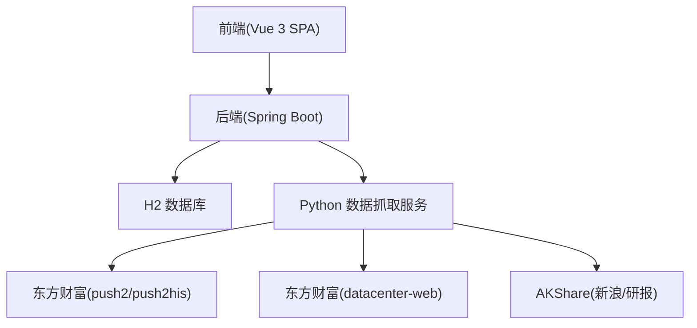
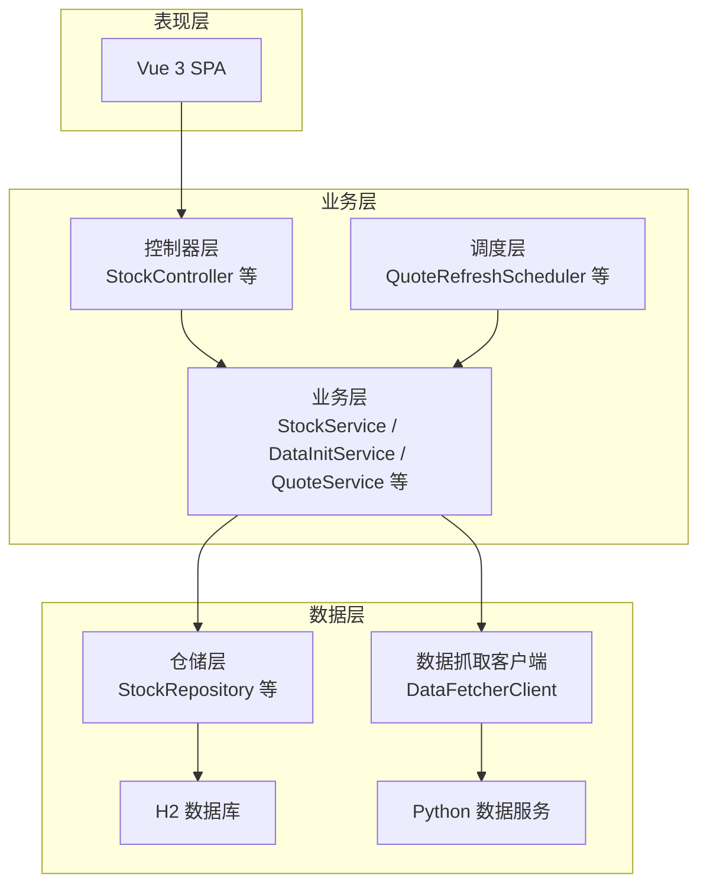
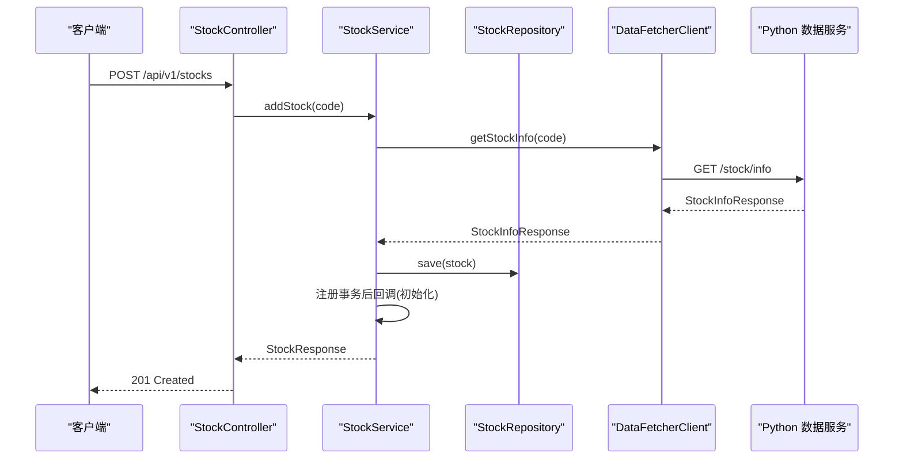
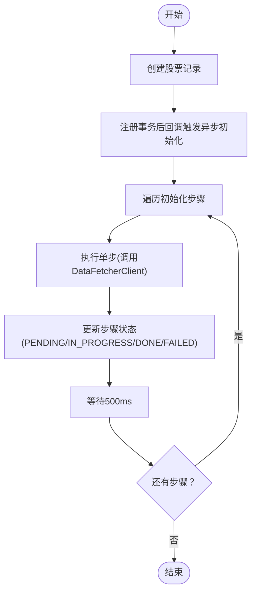
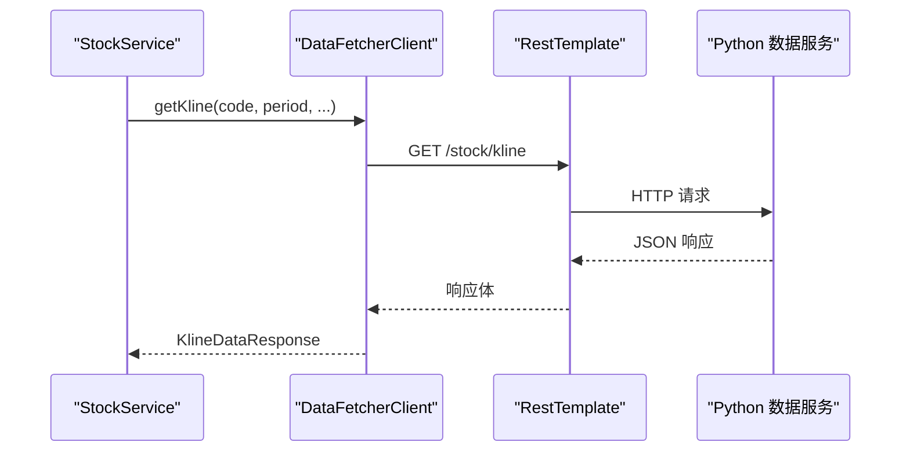
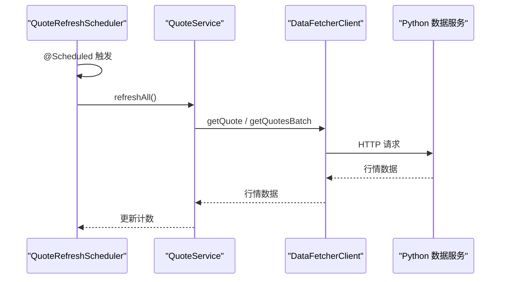
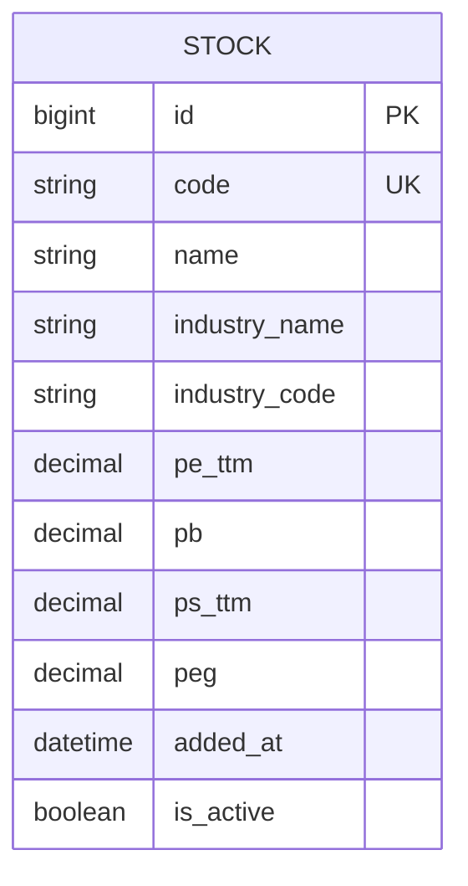
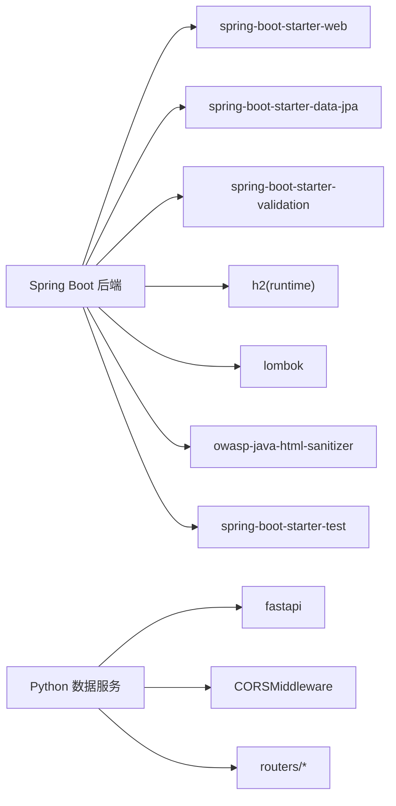

# 架构设计最佳实践

<cite>
**本文引用的文件**
- [StockApplication.java](file://backend/src/main/java/com/stock/StockApplication.java)
- [StockController.java](file://backend/src/main/java/com/stock/controller/StockController.java)
- [StockService.java](file://backend/src/main/java/com/stock/service/StockService.java)
- [DataInitService.java](file://backend/src/main/java/com/stock/service/DataInitService.java)
- [DataFetcherClient.java](file://backend/src/main/java/com/stock/client/DataFetcherClient.java)
- [StockRepository.java](file://backend/src/main/java/com/stock/repository/StockRepository.java)
- [Stock.java](file://backend/src/main/java/com/stock/entity/Stock.java)
- [application.yml](file://backend/src/main/resources/application.yml)
- [RestTemplateConfig.java](file://backend/src/main/java/com/stock/config/RestTemplateConfig.java)
- [QuoteRefreshScheduler.java](file://backend/src/main/java/com/stock/scheduler/QuoteRefreshScheduler.java)
- [AddStockRequest.java](file://backend/src/main/java/com/stock/dto/request/AddStockRequest.java)
- [pom.xml](file://backend/pom.xml)
- [app.py](file://data-fetcher/app.py)
- [high-level-design.md](file://system-planner/high-level-design.md)
- [api-design.md](file://system-planner/api-design.md)
</cite>

## 目录
1. [引言](#引言)
2. [项目结构](#项目结构)
3. [核心组件](#核心组件)
4. [架构总览](#架构总览)
5. [详细组件分析](#详细组件分析)
6. [依赖分析](#依赖分析)
7. [性能考虑](#性能考虑)
8. [故障排查指南](#故障排查指南)
9. [结论](#结论)
10. [附录](#附录)

## 引言
本文件面向“股票交易分析系统”的架构设计与最佳实践，围绕分层架构（表现层、业务层、数据层）、模块划分（功能模块化、依赖倒置）、组件交互（控制器-服务-仓储三层架构）展开，结合系统边界、接口设计原则、依赖管理策略、微服务拆分指导、架构演进与技术债务管理、可扩展性设计原则，提供可落地的设计说明与实施建议。

## 项目结构
系统采用前后端分离与微服务化的混合架构：
- 前端：Vue 3 SPA，负责数据展示与用户交互
- 后端：Spring Boot 应用，提供 REST API、业务逻辑、定时任务与数据持久化
- 微服务：Python FastAPI 数据抓取服务，封装东方财富与 AKShare 等外部数据源
- 数据存储：H2 文件数据库，JPA/Hibernate 管理本地数据

**图表来源**
- [high-level-design.md: 7-68:7-68](file://system-planner/high-level-design.md#L7-L68)
- [application.yml: 1-28:1-28](file://backend/src/main/resources/application.yml#L1-L28)
- [app.py: 1-31:1-31](file://data-fetcher/app.py#L1-L31)

**章节来源**
- [high-level-design.md: 80-181:80-181](file://system-planner/high-level-design.md#L80-L181)
- [application.yml: 1-28:1-28](file://backend/src/main/resources/application.yml#L1-L28)

## 核心组件
- 应用入口与启动：Spring Boot 启动类启用调度与异步能力
- 控制器层：StockController 提供标的管理与初始化状态查询
- 业务层：StockService 负责股票增删改查、数据初始化编排；DataInitService 负责异步初始化步骤编排与状态跟踪
- 数据访问层：StockRepository 等 JPA 仓库，Stock 实体映射 stock 表
- 外部调用：DataFetcherClient 封装 HTTP 客户端，统一调用 Python 数据服务
- 配置与调度：RestTemplateConfig 提供超时配置；QuoteRefreshScheduler 周期刷新行情
- 请求对象：AddStockRequest 提供输入校验

**章节来源**
- [StockApplication.java: 1-16:1-16](file://backend/src/main/java/com/stock/StockApplication.java#L1-L16)
- [StockController.java: 1-57:1-57](file://backend/src/main/java/com/stock/controller/StockController.java#L1-L57)
- [StockService.java: 1-243:1-243](file://backend/src/main/java/com/stock/service/StockService.java#L1-L243)
- [DataInitService.java: 1-101:1-101](file://backend/src/main/java/com/stock/service/DataInitService.java#L1-L101)
- [DataFetcherClient.java: 1-126:1-126](file://backend/src/main/java/com/stock/client/DataFetcherClient.java#L1-L126)
- [StockRepository.java: 1-18:1-18](file://backend/src/main/java/com/stock/repository/StockRepository.java#L1-L18)
- [Stock.java: 1-86:1-86](file://backend/src/main/java/com/stock/entity/Stock.java#L1-L86)
- [RestTemplateConfig.java: 1-18:1-18](file://backend/src/main/java/com/stock/config/RestTemplateConfig.java#L1-L18)
- [QuoteRefreshScheduler.java: 1-35:1-35](file://backend/src/main/java/com/stock/scheduler/QuoteRefreshScheduler.java#L1-L35)
- [AddStockRequest.java: 1-10:1-10](file://backend/src/main/java/com/stock/dto/request/AddStockRequest.java#L1-L10)

## 架构总览
系统遵循三层架构与依赖倒置原则：
- 表现层：Vue 3 SPA，负责视图与交互，不直接调用外部 API
- 业务层：Spring Boot，封装业务逻辑、技术指标计算、定时任务与数据初始化编排
- 数据层：H2 数据库，JPA 仓储访问；Python 微服务负责外部数据拉取与限流控制

**图表来源**
- [high-level-design.md: 70-47:70-47](file://system-planner/high-level-design.md#L70-L47)
- [StockController.java: 17-27:17-27](file://backend/src/main/java/com/stock/controller/StockController.java#L17-L27)
- [StockService.java: 26-91:26-91](file://backend/src/main/java/com/stock/service/StockService.java#L26-L91)
- [DataInitService.java: 15-42:15-42](file://backend/src/main/java/com/stock/service/DataInitService.java#L15-L42)
- [DataFetcherClient.java: 14-24:14-24](file://backend/src/main/java/com/stock/client/DataFetcherClient.java#L14-L24)
- [StockRepository.java: 10-17:10-17](file://backend/src/main/java/com/stock/repository/StockRepository.java#L10-L17)
- [application.yml: 4-27:4-27](file://backend/src/main/resources/application.yml#L4-L27)
- [app.py: 1-31:1-31](file://data-fetcher/app.py#L1-L31)

## 详细组件分析

### 控制器-服务-仓储三层架构
- 控制器接收请求，进行参数校验，委派给服务层
- 服务层组织业务流程，协调仓储与外部客户端
- 仓储层通过 JPA 访问数据库，保持数据一致性

**图表来源**
- [StockController.java: 29-34:29-34](file://backend/src/main/java/com/stock/controller/StockController.java#L29-L34)
- [StockService.java: 93-163:93-163](file://backend/src/main/java/com/stock/service/StockService.java#L93-L163)
- [DataFetcherClient.java: 26-29:26-29](file://backend/src/main/java/com/stock/client/DataFetcherClient.java#L26-L29)
- [app.py: 23-25:23-25](file://data-fetcher/app.py#L23-L25)

**章节来源**
- [StockController.java: 17-56:17-56](file://backend/src/main/java/com/stock/controller/StockController.java#L17-L56)
- [StockService.java: 26-91:26-91](file://backend/src/main/java/com/stock/service/StockService.java#L26-L91)
- [StockRepository.java: 10-17:10-17](file://backend/src/main/java/com/stock/repository/StockRepository.java#L10-L17)

### 异步初始化与状态编排
- 添加标的后，立即返回基本信息，随后异步执行初始化步骤
- DataInitService 维护初始化状态，支持轮询查询
- 步骤间 500ms 间隔，利用不同域名限流独立性优化总耗时

**图表来源**
- [StockService.java: 145-162:145-162](file://backend/src/main/java/com/stock/service/StockService.java#L145-L162)
- [DataInitService.java: 42-71:42-71](file://backend/src/main/java/com/stock/service/DataInitService.java#L42-L71)

**章节来源**
- [DataInitService.java: 15-101:15-101](file://backend/src/main/java/com/stock/service/DataInitService.java#L15-L101)
- [high-level-design.md: 321-348:321-348](file://system-planner/high-level-design.md#L321-L348)

### 外部数据客户端与限流策略
- DataFetcherClient 封装 REST 调用，统一异常处理
- Python 数据服务内置全局请求队列与域名级限流，避免并发冲突
- 后端通过 RestTemplateConfig 设置连接与读取超时

**图表来源**
- [DataFetcherClient.java: 31-41:31-41](file://backend/src/main/java/com/stock/client/DataFetcherClient.java#L31-L41)
- [RestTemplateConfig.java: 10-16:10-16](file://backend/src/main/java/com/stock/config/RestTemplateConfig.java#L10-L16)
- [app.py: 14-20:14-20](file://data-fetcher/app.py#L14-L20)

**章节来源**
- [DataFetcherClient.java: 14-126:14-126](file://backend/src/main/java/com/stock/client/DataFetcherClient.java#L14-L126)
- [RestTemplateConfig.java: 9-17:9-17](file://backend/src/main/java/com/stock/config/RestTemplateConfig.java#L9-L17)
- [high-level-design.md: 441-451:441-451](file://system-planner/high-level-design.md#L441-L451)

### 定时任务与数据同步
- QuoteRefreshScheduler 周期刷新行情，记录执行结果
- 配置项通过 application.yml 管理 Cron 表达式

**图表来源**
- [QuoteRefreshScheduler.java: 24-33:24-33](file://backend/src/main/java/com/stock/scheduler/QuoteRefreshScheduler.java#L24-L33)
- [application.yml: 23-27:23-27](file://backend/src/main/resources/application.yml#L23-L27)

**章节来源**
- [QuoteRefreshScheduler.java: 14-35:14-35](file://backend/src/main/java/com/stock/scheduler/QuoteRefreshScheduler.java#L14-L35)
- [application.yml: 23-27:23-27](file://backend/src/main/resources/application.yml#L23-L27)

### 数据模型与仓储
- Stock 实体映射 stock 表，包含基础字段与估值相关字段
- StockRepository 提供常用查询方法（按代码、活动状态）

**图表来源**
- [Stock.java: 17-85:17-85](file://backend/src/main/java/com/stock/entity/Stock.java#L17-L85)

**章节来源**
- [StockRepository.java: 10-17:10-17](file://backend/src/main/java/com/stock/repository/StockRepository.java#L10-L17)
- [Stock.java: 12-86:12-86](file://backend/src/main/java/com/stock/entity/Stock.java#L12-L86)

### 设计模式应用
- Repository 模式：通过 Spring Data JPA 仓储抽象数据库访问
- 观察者模式：通过 @Scheduled 定时任务观察系统状态并触发相应动作（如行情刷新、初始化状态更新）
- 策略模式：DataInitService 使用步骤定义列表（InitStepDef）实现初始化流程的可配置化扩展

**章节来源**
- [DataInitService.java: 23-32:23-32](file://backend/src/main/java/com/stock/service/DataInitService.java#L23-L32)
- [QuoteRefreshScheduler.java: 24-33:24-33](file://backend/src/main/java/com/stock/scheduler/QuoteRefreshScheduler.java#L24-L33)

## 依赖分析
- 后端依赖：Spring Web、Spring Data JPA、H2、Lombok、OWASP HTML Sanitizer、测试框架
- Python 服务依赖：FastAPI、CORS 中间件、各数据源服务封装
- 依赖管理策略：版本集中管理，注解处理器与测试插件配置明确

**图表来源**
- [pom.xml: 23-56:23-56](file://backend/pom.xml#L23-L56)
- [app.py: 1-31:1-31](file://data-fetcher/app.py#L1-L31)

**章节来源**
- [pom.xml: 17-101:17-101](file://backend/pom.xml#L17-L101)

## 性能考虑
- 异步初始化：添加标的后立即返回，避免阻塞，提升用户体验
- 限流与缓存：Python 侧域名级限流与 TTL 缓存，减少外部接口压力
- 数据库与索引：JPA 自动生成 DDL，合理使用查询方法与投影 DTO 降低传输开销
- 超时配置：RestTemplate 连接与读取超时设置，避免长时间阻塞
- 定时任务频率：根据业务需求调整，避免过度刷新造成资源浪费

**章节来源**
- [DataInitService.java: 42-71:42-71](file://backend/src/main/java/com/stock/service/DataInitService.java#L42-L71)
- [high-level-design.md: 441-466:441-466](file://system-planner/high-level-design.md#L441-L466)
- [RestTemplateConfig.java: 10-16:10-16](file://backend/src/main/java/com/stock/config/RestTemplateConfig.java#L10-L16)

## 故障排查指南
- 全局异常处理：后端提供统一异常响应格式，便于前端与运维定位问题
- 日志与可观测性：后端记录 INFO 级别日志，Python 记录外部调用 URL、耗时与状态，前端记录 API 失败
- 常见错误码：400（参数校验失败）、404（资源不存在）、409（资源已存在）、503（数据源不可用）
- 数据初始化状态：通过 /stocks/{id}/init-status 轮询查看每步状态，快速定位失败步骤

**章节来源**
- [api-design.md: 666-688:666-688](file://system-planner/api-design.md#L666-L688)
- [high-level-design.md: 477-490:477-490](file://system-planner/high-level-design.md#L477-L490)

## 结论
本系统通过清晰的分层架构、模块化设计与依赖倒置，实现了前后端分离与微服务拆分。控制器-服务-仓储三层交互明确，异步初始化与定时任务提升了性能与可用性。通过 Repository 模式与策略化初始化流程，系统具备良好的可扩展性与可维护性。建议持续关注外部数据源稳定性、缓存与限流策略优化，并在演进过程中保持接口契约稳定与文档同步更新。

## 附录

### 系统边界与接口设计原则
- 系统边界：前端不直接调用外部 API；后端不直接调用东方财富 API；Python 服务负责外部数据封装与限流
- 接口设计：REST 风格、JSON 格式、统一错误响应、幂等性与校验前置
- 数据契约：前后端与后端-微服务之间的参数与字段映射以设计文档为准

**章节来源**
- [high-level-design.md: 70-77:70-77](file://system-planner/high-level-design.md#L70-L77)
- [api-design.md: 3-21:3-21](file://system-planner/api-design.md#L3-L21)
- [high-level-design.md: 219-238:219-238](file://system-planner/high-level-design.md#L219-L238)

### 微服务拆分指导
- 拆分维度：按数据域与外部数据源类型拆分（push2/push2his、datacenter-web、AKShare）
- 通信方式：HTTP REST，统一超时与重试策略
- 部署策略：独立进程与端口，健康检查端点，CORS 配置
- 可观测性：日志、指标与告警，确保跨服务链路追踪

**章节来源**
- [high-level-design.md: 370-380:370-380](file://system-planner/high-level-design.md#L370-L380)
- [app.py: 7-12:7-12](file://data-fetcher/app.py#L7-L12)

### 架构演进与技术债务管理
- 演进阶段：基础搭建→数据管道→图表与指标→手动数据框架→预警与整合
- 技术债务：Python 限流与缓存逻辑集中化、后端与前端 DTO 一致性、异常与日志规范
- 可扩展性：仓储接口与服务层解耦、初始化步骤可配置化、定时任务可插拔

**章节来源**
- [high-level-design.md: 494-503:494-503](file://system-planner/high-level-design.md#L494-L503)
- [DataInitService.java: 23-32:23-32](file://backend/src/main/java/com/stock/service/DataInitService.java#L23-L32)