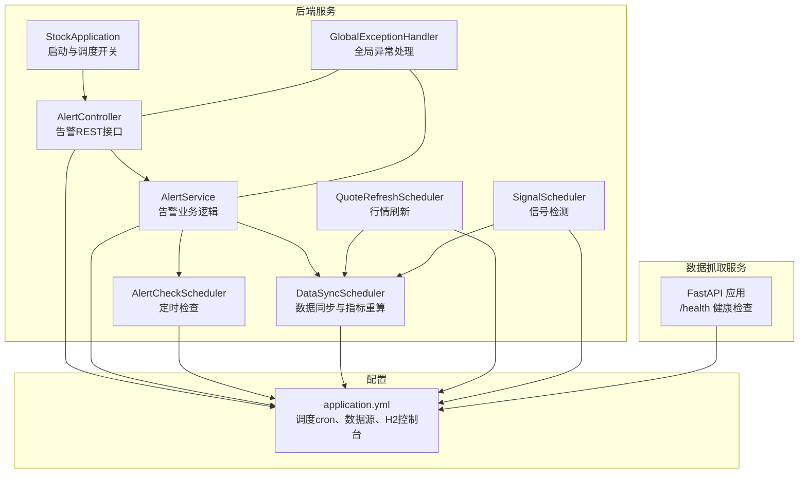
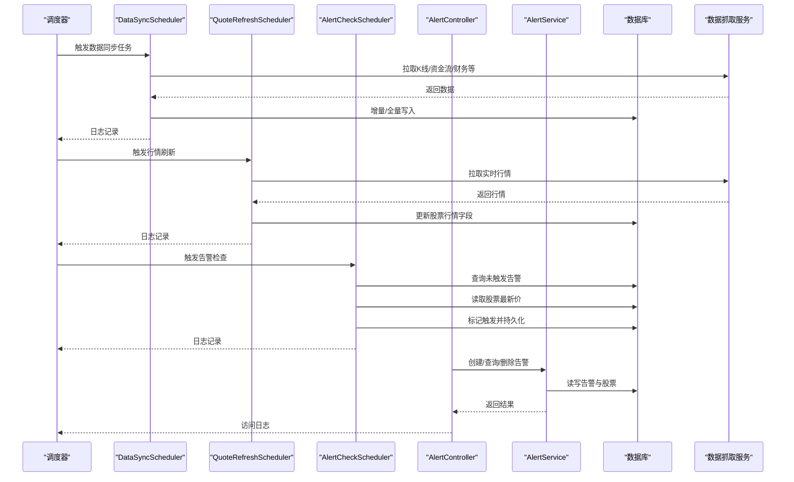
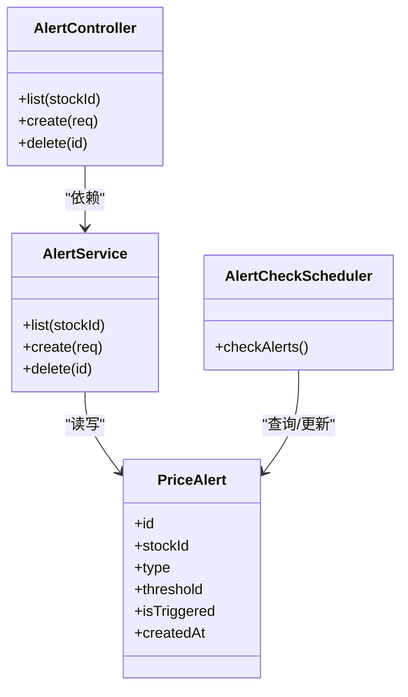
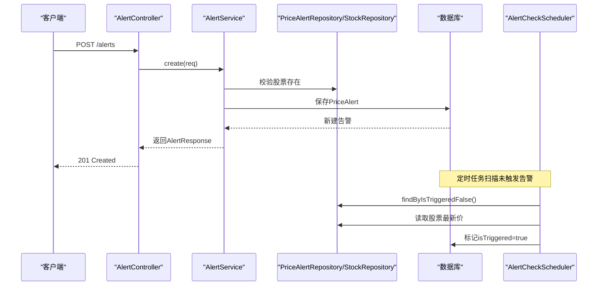
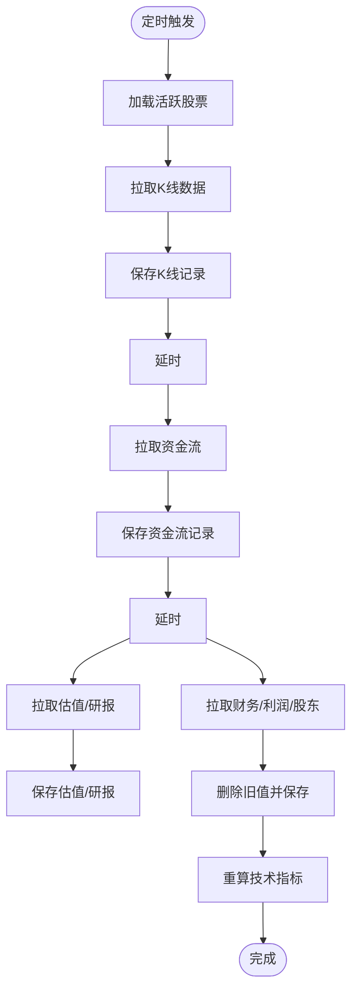
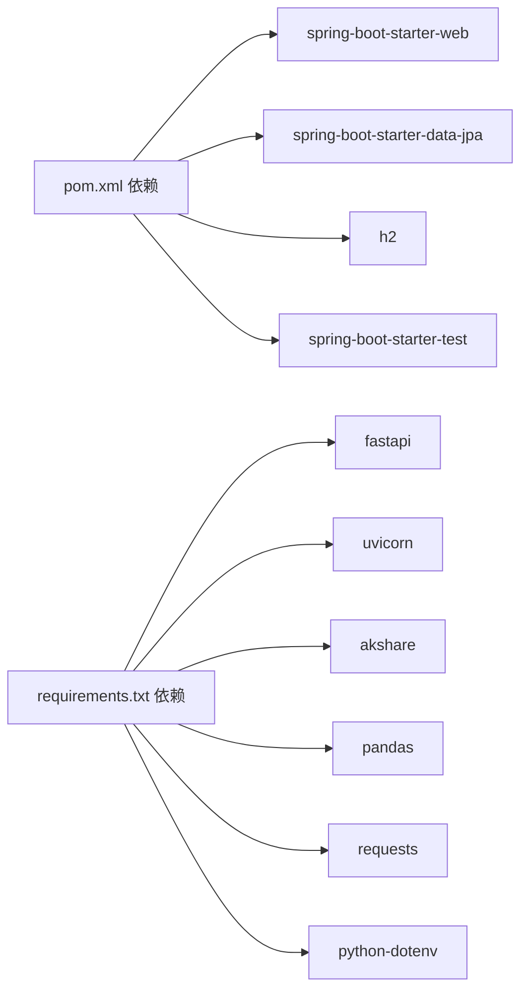

# 监控告警最佳实践

<cite>
**本文引用的文件**
- [StockApplication.java](file://backend/src/main/java/com/stock/StockApplication.java)
- [application.yml](file://backend/src/main/resources/application.yml)
- [AlertController.java](file://backend/src/main/java/com/stock/controller/AlertController.java)
- [AlertService.java](file://backend/src/main/java/com/stock/service/AlertService.java)
- [AlertCheckScheduler.java](file://backend/src/main/java/com/stock/scheduler/AlertCheckScheduler.java)
- [PriceAlert.java](file://backend/src/main/java/com/stock/entity/PriceAlert.java)
- [GlobalExceptionHandler.java](file://backend/src/main/java/com/stock/exception/GlobalExceptionHandler.java)
- [ErrorResponse.java](file://backend/src/main/java/com/stock/exception/ErrorResponse.java)
- [DataSyncScheduler.java](file://backend/src/main/java/com/stock/scheduler/DataSyncScheduler.java)
- [QuoteRefreshScheduler.java](file://backend/src/main/java/com/stock/scheduler/QuoteRefreshScheduler.java)
- [SignalScheduler.java](file://backend/src/main/java/com/stock/scheduler/SignalScheduler.java)
- [app.py](file://data-fetcher/app.py)
- [requirements.txt](file://data-fetcher/requirements.txt)
- [AlertControllerTest.java](file://backend/src/test/java/com/stock/controller/AlertControllerTest.java)
- [AlertServiceTest.java](file://backend/src/test/java/com/stock/service/AlertServiceTest.java)
- [pom.xml](file://backend/pom.xml)
</cite>

## 目录
1. [简介](#简介)
2. [项目结构](#项目结构)
3. [核心组件](#核心组件)
4. [架构总览](#架构总览)
5. [详细组件分析](#详细组件分析)
6. [依赖分析](#依赖分析)
7. [性能考虑](#性能考虑)
8. [故障排查指南](#故障排查指南)
9. [结论](#结论)
10. [附录](#附录)

## 简介
本文件面向股票交易系统的监控与告警最佳实践，结合现有代码库中的调度、异常处理与数据同步能力，系统化地给出指标设计、告警策略、故障恢复、日志与APM建议、仪表板与通知渠道、演练与自动化等运维方案。文档以仓库中实际实现为依据，避免空谈，确保可落地。

## 项目结构
系统由三部分组成：
- 后端服务：基于 Spring Boot 的 Java 应用，负责 REST 接口、调度任务、业务逻辑与数据库交互。
- 数据抓取服务：基于 FastAPI 的 Python 应用，提供股票行情与财务等数据接口。
- 前端应用：用于展示与交互（本文件不涉及前端监控）。

图表来源
- [StockApplication.java:1-16](file://backend/src/main/java/com/stock/StockApplication.java#L1-L16)
- [AlertController.java:1-40](file://backend/src/main/java/com/stock/controller/AlertController.java#L1-L40)
- [AlertService.java:1-63](file://backend/src/main/java/com/stock/service/AlertService.java#L1-L63)
- [AlertCheckScheduler.java:1-52](file://backend/src/main/java/com/stock/scheduler/AlertCheckScheduler.java#L1-L52)
- [DataSyncScheduler.java:1-238](file://backend/src/main/java/com/stock/scheduler/DataSyncScheduler.java#L1-L238)
- [QuoteRefreshScheduler.java:1-34](file://backend/src/main/java/com/stock/scheduler/QuoteRefreshScheduler.java#L1-L34)
- [SignalScheduler.java:1-35](file://backend/src/main/java/com/stock/scheduler/SignalScheduler.java#L1-L35)
- [GlobalExceptionHandler.java:1-33](file://backend/src/main/java/com/stock/exception/GlobalExceptionHandler.java#L1-L33)
- [application.yml:1-28](file://backend/src/main/resources/application.yml#L1-L28)
- [app.py:1-31](file://data-fetcher/app.py#L1-L31)

章节来源
- [StockApplication.java:1-16](file://backend/src/main/java/com/stock/StockApplication.java#L1-L16)
- [application.yml:1-28](file://backend/src/main/resources/application.yml#L1-L28)
- [pom.xml:1-103](file://backend/pom.xml#L1-L103)

## 核心组件
- 启动与调度开关：开启调度与异步支持，统一管理定时任务生命周期。
- 告警模块：提供 REST 接口创建/查询/删除告警；定时器按阈值检查触发状态。
- 数据同步与指标重算：周期性从数据抓取服务拉取数据，增量或全量更新，并重算技术指标。
- 行情刷新：工作日定时刷新所有活跃股票的实时行情。
- 信号检测：基于指标与资金流生成交易信号。
- 全局异常处理：统一封装错误响应，便于监控与告警联动。

章节来源
- [StockApplication.java:1-16](file://backend/src/main/java/com/stock/StockApplication.java#L1-L16)
- [AlertController.java:1-40](file://backend/src/main/java/com/stock/controller/AlertController.java#L1-L40)
- [AlertService.java:1-63](file://backend/src/main/java/com/stock/service/AlertService.java#L1-L63)
- [AlertCheckScheduler.java:1-52](file://backend/src/main/java/com/stock/scheduler/AlertCheckScheduler.java#L1-L52)
- [DataSyncScheduler.java:1-238](file://backend/src/main/java/com/stock/scheduler/DataSyncScheduler.java#L1-L238)
- [QuoteRefreshScheduler.java:1-34](file://backend/src/main/java/com/stock/scheduler/QuoteRefreshScheduler.java#L1-L34)
- [SignalScheduler.java:1-35](file://backend/src/main/java/com/stock/scheduler/SignalScheduler.java#L1-L35)
- [GlobalExceptionHandler.java:1-33](file://backend/src/main/java/com/stock/exception/GlobalExceptionHandler.java#L1-L33)

## 架构总览
下图展示了监控与告警在系统中的位置与交互路径：调度器驱动数据同步与行情刷新，业务层处理请求并持久化状态，异常处理器统一输出错误，外部数据抓取服务提供数据源。

图表来源
- [AlertCheckScheduler.java:26-50](file://backend/src/main/java/com/stock/scheduler/AlertCheckScheduler.java#L26-L50)
- [DataSyncScheduler.java:54-161](file://backend/src/main/java/com/stock/scheduler/DataSyncScheduler.java#L54-L161)
- [QuoteRefreshScheduler.java:24-32](file://backend/src/main/java/com/stock/scheduler/QuoteRefreshScheduler.java#L24-L32)
- [AlertController.java:23-38](file://backend/src/main/java/com/stock/controller/AlertController.java#L23-L38)
- [AlertService.java:26-61](file://backend/src/main/java/com/stock/service/AlertService.java#L26-L61)

## 详细组件分析

### 告警模块（控制器、服务、实体与调度）
- 控制器：提供列表、创建、删除告警的 REST 接口，返回标准状态码。
- 服务：封装告警的查询、创建与删除逻辑，事务性保证一致性。
- 实体：持久化价格告警，包含股票ID、类型（高于/低于）、阈值、触发状态与创建时间。
- 调度：定时扫描未触发告警，比较最新股价与阈值，满足条件则标记为已触发并持久化。

图表来源
- [AlertController.java:13-39](file://backend/src/main/java/com/stock/controller/AlertController.java#L13-L39)
- [AlertService.java:15-62](file://backend/src/main/java/com/stock/service/AlertService.java#L15-L62)
- [AlertCheckScheduler.java:14-51](file://backend/src/main/java/com/stock/scheduler/AlertCheckScheduler.java#L14-L51)
- [PriceAlert.java:11-36](file://backend/src/main/java/com/stock/entity/PriceAlert.java#L11-L36)

图表来源
- [AlertController.java:28-32](file://backend/src/main/java/com/stock/controller/AlertController.java#L28-L32)
- [AlertService.java:41-56](file://backend/src/main/java/com/stock/service/AlertService.java#L41-L56)
- [AlertCheckScheduler.java:26-50](file://backend/src/main/java/com/stock/scheduler/AlertCheckScheduler.java#L26-L50)

章节来源
- [AlertController.java:1-40](file://backend/src/main/java/com/stock/controller/AlertController.java#L1-L40)
- [AlertService.java:1-63](file://backend/src/main/java/com/stock/service/AlertService.java#L1-L63)
- [AlertCheckScheduler.java:1-52](file://backend/src/main/java/com/stock/scheduler/AlertCheckScheduler.java#L1-L52)
- [PriceAlert.java:1-37](file://backend/src/main/java/com/stock/entity/PriceAlert.java#L1-L37)

### 数据同步与指标重算（调度）
- K线同步：按日工作时段增量同步，失败记录警告日志。
- 资金流向：按周范围增量同步，过滤重复记录。
- 估值与研报：每日同步，去重插入。
- 财务/利润/股东：每周全量替换后写入。
- 指标重算：在K线数据就绪后重算技术指标，清理旧值再写入。

图表来源
- [DataSyncScheduler.java:54-236](file://backend/src/main/java/com/stock/scheduler/DataSyncScheduler.java#L54-L236)

章节来源
- [DataSyncScheduler.java:1-238](file://backend/src/main/java/com/stock/scheduler/DataSyncScheduler.java#L1-L238)

### 行情刷新与信号检测（调度）
- 行情刷新：工作日定时刷新所有活跃股票的实时行情，记录成功/失败计数。
- 信号检测：基于最新指标与资金流检测买卖信号，写入信号表。

章节来源
- [QuoteRefreshScheduler.java:1-34](file://backend/src/main/java/com/stock/scheduler/QuoteRefreshScheduler.java#L1-L34)
- [SignalScheduler.java:1-35](file://backend/src/main/java/com/stock/scheduler/SignalScheduler.java#L1-L35)

### 全局异常处理（监控与告警联动）
- 统一捕获业务异常，返回带时间戳的错误响应，便于日志聚合与告警。
- 与监控系统对接时，可将错误码与消息作为告警标签，区分严重程度。

章节来源
- [GlobalExceptionHandler.java:1-33](file://backend/src/main/java/com/stock/exception/GlobalExceptionHandler.java#L1-L33)
- [ErrorResponse.java:1-7](file://backend/src/main/java/com/stock/exception/ErrorResponse.java#L1-L7)

## 依赖分析
- 后端依赖：Spring Web、JPA、H2、Lombok、测试框架等。
- 数据抓取依赖：FastAPI、Uvicorn、AkShare、Pandas、Requests、dotenv。
- 配置：通过 application.yml 注入调度 cron 表达式与数据源参数。

图表来源
- [pom.xml:23-55](file://backend/pom.xml#L23-L55)
- [requirements.txt:1-7](file://data-fetcher/requirements.txt#L1-L7)

章节来源
- [pom.xml:1-103](file://backend/pom.xml#L1-L103)
- [requirements.txt:1-7](file://data-fetcher/requirements.txt#L1-L7)

## 性能考虑
- 调度频率与并发：根据业务需求调整各任务的 cron，避免高峰时段集中写入。
- 批处理与延时：数据同步中使用批量写入与线程延时，降低外部接口压力与数据库写放大。
- 指标重算：仅对最近一年数据重算，减少计算复杂度。
- 数据库连接与DDL：生产环境建议关闭自动DDL，改为显式迁移脚本。

章节来源
- [DataSyncScheduler.java:68-77](file://backend/src/main/java/com/stock/scheduler/DataSyncScheduler.java#L68-L77)
- [DataSyncScheduler.java:97-111](file://backend/src/main/java/com/stock/scheduler/DataSyncScheduler.java#L97-L111)
- [DataSyncScheduler.java:177-179](file://backend/src/main/java/com/stock/scheduler/DataSyncScheduler.java#L177-L179)
- [DataSyncScheduler.java:227-231](file://backend/src/main/java/com/stock/scheduler/DataSyncScheduler.java#L227-L231)
- [application.yml:8-10](file://backend/src/main/resources/application.yml#L8-L10)

## 故障排查指南
- 告警未触发
  - 检查调度 cron 是否正确注入与生效。
  - 核对未触发告警集合是否为空，确认股票最新价非空。
  - 查看日志中“告警检查完成”统计数量。
- 告警创建失败
  - 核对股票是否存在，不存在会抛出业务异常。
  - 检查请求参数校验与异常处理返回码。
- 数据同步失败
  - 关注每类任务的日志警告，定位具体股票与日期范围。
  - 外部数据源不可用时，检查数据抓取服务健康与网络连通。
- 行情刷新异常
  - 查看刷新任务日志，关注更新/失败计数。
- 全局异常
  - 错误响应包含状态码与时间戳，便于定位问题时间窗。

章节来源
- [AlertCheckScheduler.java:26-50](file://backend/src/main/java/com/stock/scheduler/AlertCheckScheduler.java#L26-L50)
- [AlertService.java:41-44](file://backend/src/main/java/com/stock/service/AlertService.java#L41-L44)
- [AlertControllerTest.java:54-65](file://backend/src/test/java/com/stock/controller/AlertControllerTest.java#L54-L65)
- [AlertServiceTest.java:73-77](file://backend/src/test/java/com/stock/service/AlertServiceTest.java#L73-L77)
- [DataSyncScheduler.java:78-81](file://backend/src/main/java/com/stock/scheduler/DataSyncScheduler.java#L78-L81)
- [DataSyncScheduler.java:113-116](file://backend/src/main/java/com/stock/scheduler/DataSyncScheduler.java#L113-L116)
- [DataSyncScheduler.java:157-160](file://backend/src/main/java/com/stock/scheduler/DataSyncScheduler.java#L157-L160)
- [DataSyncScheduler.java:210-214](file://backend/src/main/java/com/stock/scheduler/DataSyncScheduler.java#L210-L214)
- [QuoteRefreshScheduler.java:24-32](file://backend/src/main/java/com/stock/scheduler/QuoteRefreshScheduler.java#L24-L32)
- [GlobalExceptionHandler.java:9-24](file://backend/src/main/java/com/stock/exception/GlobalExceptionHandler.java#L9-L24)

## 结论
本系统已具备完善的调度与异常处理基础，建议在此基础上补充：
- 监控指标：性能（QPS/延迟/线程池）、业务（告警触发率/数据同步成功率）、健康（服务存活/依赖可用）。
- 告警策略：分级阈值、静默窗口、抑制与收敛。
- 故障恢复：自动重试、熔断降级、人工干预通道。
- 日志与APM：结构化日志、链路追踪、仪表板与通知。
- 运维自动化：CI/CD、灰度发布、故障演练。

## 附录

### 监控指标设计建议
- 性能指标
  - 请求延迟与错误率：按接口分组统计 P50/P95/P99 延迟与 4xx/5xx 错误率。
  - 线程池与数据库连接：活跃线程数、队列长度、连接池使用率。
- 业务指标
  - 告警触发率：单位时间内触发告警数/创建告警数。
  - 数据同步成功率：成功记录数/期望记录数，按任务维度拆分。
  - 行情刷新命中率：更新/失败计数与目标股票数。
- 健康指标
  - 服务存活：/health 或 /actuator/health。
  - 外部依赖：数据抓取服务可用性与响应时间。

章节来源
- [app.py:23-25](file://data-fetcher/app.py#L23-L25)
- [application.yml:19-27](file://backend/src/main/resources/application.yml#L19-L27)

### 告警策略配置建议
- 阈值设置
  - 告警：短期高频检查，阈值应留有余量，避免误报。
  - 数据同步：失败率超过阈值触发，区分致命与非致命错误。
- 告警级别
  - P0：服务不可用、核心数据缺失。
  - P1：关键功能异常、大量失败。
  - P2：一般异常、偶发失败。
- 告警抑制
  - 同一周期内相同告警合并上报，设置静默窗口。
  - 依赖不可用时抑制相关告警。

章节来源
- [AlertCheckScheduler.java:26-50](file://backend/src/main/java/com/stock/scheduler/AlertCheckScheduler.java#L26-L50)
- [DataSyncScheduler.java:78-81](file://backend/src/main/java/com/stock/scheduler/DataSyncScheduler.java#L78-L81)

### 故障恢复机制建议
- 自动恢复
  - 失败重试与退避，超限后进入熔断。
- 人工干预
  - 关键任务失败时暂停调度，人工介入修复后恢复。
- 降级策略
  - 数据抓取失败时使用缓存数据或降级接口，保证基本功能。

章节来源
- [DataSyncScheduler.java:78-81](file://backend/src/main/java/com/stock/scheduler/DataSyncScheduler.java#L78-L81)

### 日志监控与APM
- 日志
  - 使用结构化日志格式，包含 traceId/spanId、时间戳、级别、模块、消息。
  - 将错误响应体与异常栈写入错误日志，便于检索。
- APM
  - 为每个请求生成 traceId，贯穿后端与数据抓取服务。
  - 对外部HTTP调用与数据库操作打点，采集耗时与错误。

章节来源
- [GlobalExceptionHandler.java:25-31](file://backend/src/main/java/com/stock/exception/GlobalExceptionHandler.java#L25-L31)
- [app.py:23-25](file://data-fetcher/app.py#L23-L25)

### 分布式追踪配置
- Header传递：在调用数据抓取服务时透传 traceId。
- 跨语言：Python侧使用 OpenTelemetry 或第三方库生成与传播上下文。

章节来源
- [DataSyncScheduler.java:65-66](file://backend/src/main/java/com/stock/scheduler/DataSyncScheduler.java#L65-L66)

### 监控仪表板设计
- 服务面板
  - QPS/错误率、P50/P95 延迟、线程池与连接池使用率。
- 业务面板
  - 告警创建/触发趋势、未触发告警分布、阈值命中情况。
- 数据面板
  - K线/资金流/财务同步成功率、失败明细与重试次数。
- 健康面板
  - 服务存活、数据抓取服务可用性、数据库连通性。

章节来源
- [AlertCheckScheduler.java:26-50](file://backend/src/main/java/com/stock/scheduler/AlertCheckScheduler.java#L26-L50)
- [DataSyncScheduler.java:54-236](file://backend/src/main/java/com/stock/scheduler/DataSyncScheduler.java#L54-L236)

### 告警通知渠道
- 即时通知：邮件、短信、IM（如钉钉/企业微信）。
- 电话：P0/P1 级别在非工作时间转人工。
- 通知模板：包含服务名、实例、指标、阈值、时间窗与处置建议。

章节来源
- [GlobalExceptionHandler.java:9-24](file://backend/src/main/java/com/stock/exception/GlobalExceptionHandler.java#L9-L24)

### 故障演练方法
- 模拟外部依赖不可用：临时禁用数据抓取服务，验证熔断与降级。
- 模拟数据库异常：短时断开数据库，观察错误处理与告警。
- 模拟高负载：压测后端接口，观察线程池与延迟变化。

章节来源
- [DataSyncScheduler.java:78-81](file://backend/src/main/java/com/stock/scheduler/DataSyncScheduler.java#L78-L81)
- [GlobalExceptionHandler.java:21-24](file://backend/src/main/java/com/stock/exception/GlobalExceptionHandler.java#L21-L24)

### 运维自动化策略
- CI/CD：构建镜像、部署与回滚自动化，变更前自动运行单元与集成测试。
- 灰度发布：蓝绿/金丝雀发布，逐步扩大流量并监控关键指标。
- 告警自愈：对可自动恢复的故障（如瞬时依赖抖动）配置自动重试与告警抑制。

章节来源
- [AlertControllerTest.java:43-71](file://backend/src/test/java/com/stock/controller/AlertControllerTest.java#L43-L71)
- [AlertServiceTest.java:34-83](file://backend/src/test/java/com/stock/service/AlertServiceTest.java#L34-L83)