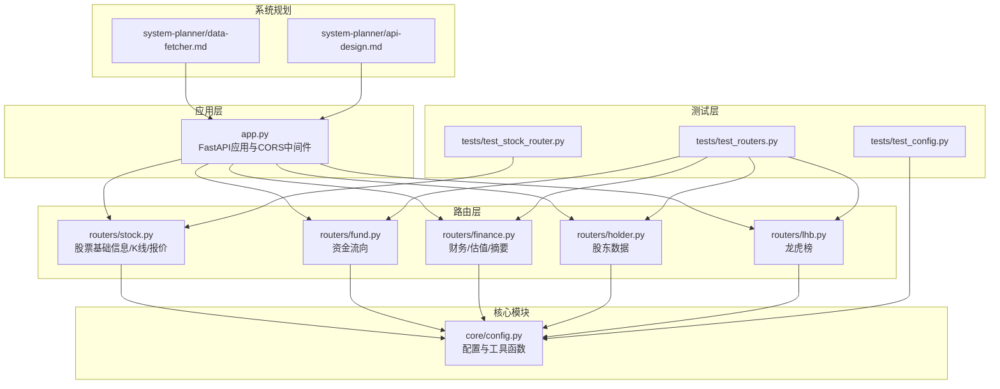
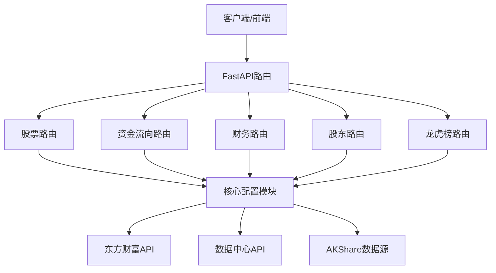
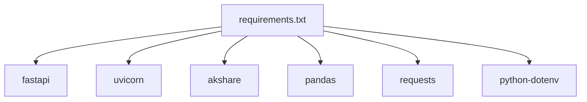

# Python数据获取器调试

<cite>
**本文档引用的文件**
- [app.py](file://data-fetcher/app.py)
- [config.py](file://data-fetcher/core/config.py)
- [stock.py](file://data-fetcher/routers/stock.py)
- [fund.py](file://data-fetcher/routers/fund.py)
- [finance.py](file://data-fetcher/routers/finance.py)
- [holder.py](file://data-fetcher/routers/holder.py)
- [lhb.py](file://data-fetcher/routers/lhb.py)
- [requirements.txt](file://data-fetcher/requirements.txt)
- [test_stock_router.py](file://data-fetcher/tests/test_stock_router.py)
- [test_routers.py](file://data-fetcher/tests/test_routers.py)
- [test_config.py](file://data-fetcher/tests/test_config.py)
- [data-fetcher.md](file://system-planner/data-fetcher.md)
- [api-design.md](file://system-planner/api-design.md)
</cite>

## 目录
1. [简介](#简介)
2. [项目结构](#项目结构)
3. [核心组件](#核心组件)
4. [架构概览](#架构概览)
5. [详细组件分析](#详细组件分析)
6. [依赖分析](#依赖分析)
7. [性能考虑](#性能考虑)
8. [故障排除指南](#故障排除指南)
9. [结论](#结论)
10. [附录](#附录)

## 简介
本文件面向Python数据获取器服务的调试工作，重点覆盖HTTP请求调试（FastAPI服务调试、请求响应监控、网络超时处理）、数据转换调试（东方财富API响应解析、数据格式验证、数值转换错误排查）、错误处理调试（异常捕获机制、重试策略验证、降级方案测试）、测试调试（pytest测试调试、Mock对象验证、测试数据准备）。同时提供具体的调试工具使用建议（FastAPI调试模式、HTTP客户端调试、日志记录分析）、断点调试技巧（Python断点设置、异步函数调试、协程调试）、以及性能优化调试（请求并发控制、内存使用分析、响应时间优化）。

## 项目结构
数据获取器服务采用FastAPI框架，核心目录组织如下：
- 应用入口与中间件：app.py
- 核心配置与通用工具：core/config.py
- 路由模块：routers/stock.py、routers/fund.py、routers/finance.py、routers/holder.py、routers/lhb.py
- 测试套件：tests/test_stock_router.py、tests/test_routers.py、tests/test_config.py
- 依赖声明：requirements.txt
- 系统规划文档：system-planner/data-fetcher.md、system-planner/api-design.md

**图表来源**
- [app.py:1-31](file://data-fetcher/app.py#L1-L31)
- [config.py:1-121](file://data-fetcher/core/config.py#L1-L121)
- [stock.py:1-246](file://data-fetcher/routers/stock.py#L1-L246)
- [fund.py:1-49](file://data-fetcher/routers/fund.py#L1-L49)
- [finance.py:1-148](file://data-fetcher/routers/finance.py#L1-L148)
- [holder.py:1-41](file://data-fetcher/routers/holder.py#L1-L41)
- [lhb.py:1-57](file://data-fetcher/routers/lhb.py#L1-L57)
- [test_stock_router.py:1-185](file://data-fetcher/tests/test_stock_router.py#L1-L185)
- [test_routers.py:1-183](file://data-fetcher/tests/test_routers.py#L1-L183)
- [test_config.py:1-86](file://data-fetcher/tests/test_config.py#L1-L86)
- [data-fetcher.md:1-350](file://system-planner/data-fetcher.md#L1-L350)
- [api-design.md:1-688](file://system-planner/api-design.md#L1-L688)

**章节来源**
- [app.py:1-31](file://data-fetcher/app.py#L1-L31)
- [requirements.txt:1-7](file://data-fetcher/requirements.txt#L1-L7)

## 核心组件
- FastAPI应用与CORS中间件：负责服务启动、跨域配置、路由注册与健康检查端点。
- 核心配置与工具函数：包含请求头、速率限制、secid转换、数值安全转换、JSON获取与重试逻辑、数据中心API封装。
- 路由模块：各业务模块的API端点，统一进行异常捕获与HTTP状态码返回。
- 测试套件：覆盖路由行为、Mock验证、错误场景与边界条件。

**章节来源**
- [config.py:80-121](file://data-fetcher/core/config.py#L80-L121)
- [stock.py:14-246](file://data-fetcher/routers/stock.py#L14-L246)
- [fund.py:9-49](file://data-fetcher/routers/fund.py#L9-L49)
- [finance.py:14-148](file://data-fetcher/routers/finance.py#L14-L148)
- [holder.py:9-41](file://data-fetcher/routers/holder.py#L9-L41)
- [lhb.py:9-57](file://data-fetcher/routers/lhb.py#L9-L57)

## 架构概览
服务采用“应用层-路由层-核心层”的分层架构，所有对外HTTP请求均通过FastAPI路由进入，核心配置模块提供统一的网络访问与数据转换能力。系统规划文档明确了限流策略、重试机制与降级方案，确保在外部数据源不稳定时仍能提供可用的服务。

**图表来源**
- [app.py:14-20](file://data-fetcher/app.py#L14-L20)
- [config.py:80-121](file://data-fetcher/core/config.py#L80-L121)
- [stock.py:14-72](file://data-fetcher/routers/stock.py#L14-L72)
- [finance.py:14-40](file://data-fetcher/routers/finance.py#L14-L40)
- [holder.py:9-40](file://data-fetcher/routers/holder.py#L9-L40)
- [lhb.py:9-56](file://data-fetcher/routers/lhb.py#L9-L56)

## 详细组件分析

### HTTP请求调试与FastAPI服务调试
- 启动与调试模式
  - 使用uvicorn运行服务，监听本地端口，便于本地调试与集成测试。
  - CORS中间件允许任意来源、方法与头部，便于前端联调。
- 请求响应监控
  - 健康检查端点用于快速验证服务可用性。
  - 路由层统一捕获异常并返回HTTP状态码，便于前端识别错误类型。
- 网络超时处理
  - 核心配置模块对请求设置超时时间，并实现指数退避与固定间隔重试策略。

**章节来源**
- [app.py:23-31](file://data-fetcher/app.py#L23-L31)
- [app.py:7-12](file://data-fetcher/app.py#L7-L12)
- [config.py:80-101](file://data-fetcher/core/config.py#L80-L101)

### 数据转换调试：东方财富API响应解析
- secid转换与字段映射
  - 将股票代码转换为东方财富所需的secid格式，确保请求正确。
  - 对实时行情中的价格/百分比字段进行除以100的转换，保证数值一致性。
- K线与资金流向解析
  - 解析K线字符串为结构化数据，进行数值安全转换。
  - 资金流向字段映射与数值转换，确保返回格式符合前端期望。
- 数据中心API封装
  - 统一封装数据中心查询，提取result.data作为标准输出。

**章节来源**
- [config.py:31-38](file://data-fetcher/core/config.py#L31-L38)
- [config.py:41-77](file://data-fetcher/core/config.py#L41-L77)
- [config.py:103-121](file://data-fetcher/core/config.py#L103-L121)
- [stock.py:14-72](file://data-fetcher/routers/stock.py#L14-L72)
- [stock.py:75-126](file://data-fetcher/routers/stock.py#L75-L126)
- [fund.py:9-49](file://data-fetcher/routers/fund.py#L9-L49)

### 错误处理调试：异常捕获与重试策略
- 异常捕获机制
  - 路由层对fetch_json与数据中心调用进行try/catch，遇到异常统一抛出HTTP 503。
  - 对“未找到”场景返回HTTP 404，提升用户体验。
- 重试策略验证
  - RemoteDisconnected采用指数退避重试，超时采用固定间隔重试，最大重试次数受控。
  - 批量请求限制在单轮20只股票以内，避免触发外部限流。
- 降级方案测试
  - 系统规划文档提供了在特定接口不可用时的降级路径，可在测试中模拟失败场景验证降级逻辑。

**章节来源**
- [stock.py:25-31](file://data-fetcher/routers/stock.py#L25-L31)
- [stock.py:102-105](file://data-fetcher/routers/stock.py#L102-L105)
- [stock.py:146-149](file://data-fetcher/routers/stock.py#L146-L149)
- [stock.py:183-189](file://data-fetcher/routers/stock.py#L183-L189)
- [config.py:88-100](file://data-fetcher/core/config.py#L88-L100)
- [data-fetcher.md:24-30](file://system-planner/data-fetcher.md#L24-L30)

### 测试调试：pytest、Mock与测试数据
- Mock对象验证
  - 使用unittest.mock.patch对fetch_json与fetch_datacenter进行Mock，隔离外部依赖。
  - 验证成功响应、空数据、服务错误等不同场景下的路由行为。
- 测试数据准备
  - 提供标准化的Mock响应数据，覆盖字段映射与数值转换逻辑。
  - 针对批量请求场景，验证失败项跳过与结果完整性。

**章节来源**
- [test_stock_router.py:35-64](file://data-fetcher/tests/test_stock_router.py#L35-L64)
- [test_stock_router.py:66-101](file://data-fetcher/tests/test_stock_router.py#L66-L101)
- [test_stock_router.py:103-136](file://data-fetcher/tests/test_stock_router.py#L103-L136)
- [test_stock_router.py:138-178](file://data-fetcher/tests/test_stock_router.py#L138-L178)
- [test_routers.py:11-35](file://data-fetcher/tests/test_routers.py#L11-L35)
- [test_routers.py:37-72](file://data-fetcher/tests/test_routers.py#L37-L72)
- [test_routers.py:134-183](file://data-fetcher/tests/test_routers.py#L134-L183)

### 断点调试技巧
- Python断点设置
  - 在核心配置函数（如fetch_json）与路由处理函数内部设置断点，观察请求参数、响应结构与异常堆栈。
- 异步函数调试
  - FastAPI路由均为异步函数，使用pdb或IDE调试器在关键await点断点，检查协程状态与返回值。
- 协程调试
  - 对批量请求场景，在循环内部设置断点，验证每只股票的请求间隔与错误处理分支。

**章节来源**
- [config.py:80-101](file://data-fetcher/core/config.py#L80-L101)
- [stock.py:213-245](file://data-fetcher/routers/stock.py#L213-L245)

### 性能优化调试
- 请求并发控制
  - 速率限制确保请求间隔≥500ms，避免触发外部限流；批量请求限制在20只以内。
- 内存使用分析
  - 对K线与资金流向的大列表进行分页与字段裁剪，减少内存占用。
- 响应时间优化
  - 通过Mock测试验证关键路径耗时，定位慢点并优化数据转换逻辑。

**章节来源**
- [data-fetcher.md:24-30](file://system-planner/data-fetcher.md#L24-L30)
- [stock.py:75-126](file://data-fetcher/routers/stock.py#L75-L126)
- [fund.py:9-49](file://data-fetcher/routers/fund.py#L9-L49)

## 依赖分析
服务依赖包括FastAPI、uvicorn、akshare、pandas、requests、python-dotenv等，用于Web服务、HTTP请求、数据处理与环境变量管理。

**图表来源**
- [requirements.txt:1-7](file://data-fetcher/requirements.txt#L1-L7)

**章节来源**
- [requirements.txt:1-7](file://data-fetcher/requirements.txt#L1-L7)

## 性能考虑
- 限流与重试
  - 严格遵守500ms最小间隔与指数退避重试策略，降低外部接口压力。
- 批量请求控制
  - 单轮最多20只股票，避免一次性大量请求导致超时或限流。
- 数据转换效率
  - 使用安全转换函数与字符串分割，避免不必要的类型转换开销。
- 缓存策略
  - 系统规划文档提供了各类数据的缓存时间，有助于减少重复请求。

**章节来源**
- [data-fetcher.md:314-338](file://system-planner/data-fetcher.md#L314-L338)

## 故障排除指南
- HTTP请求问题
  - 确认请求头包含Referer，否则会被断连。
  - 检查CORS配置是否允许前端域名访问。
- 数值转换错误
  - 对价格/百分比字段进行除以100的转换，注意None与无效字符串的处理。
  - 使用安全转换函数（safe_div100、safe_float、safe_int）避免异常。
- 重试与降级
  - RemoteDisconnected采用指数退避，超时采用固定间隔重试。
  - 在接口不可用时，验证降级方案是否生效。

**章节来源**
- [data-fetcher.md:11-30](file://system-planner/data-fetcher.md#L11-L30)
- [config.py:41-77](file://data-fetcher/core/config.py#L41-L77)
- [config.py:88-100](file://data-fetcher/core/config.py#L88-L100)
- [data-fetcher.md:339-350](file://system-planner/data-fetcher.md#L339-L350)

## 结论
本调试文档围绕FastAPI数据获取器服务，系统梳理了HTTP请求调试、数据转换调试、错误处理调试与测试调试的关键点，并结合系统规划文档中的限流、重试与降级策略，提供了实用的调试工具与技巧。通过Mock测试与断点调试相结合，可以高效定位与解决外部数据源不稳定带来的问题，同时优化性能与可靠性。

## 附录
- 调试工具清单
  - FastAPI调试模式：启用reload与详细日志
  - HTTP客户端：curl或Postman验证路由行为
  - 日志记录：在核心配置模块中增加请求与响应日志
- 关键测试用例
  - 成功响应、空数据、服务错误、批量请求失败跳过等场景