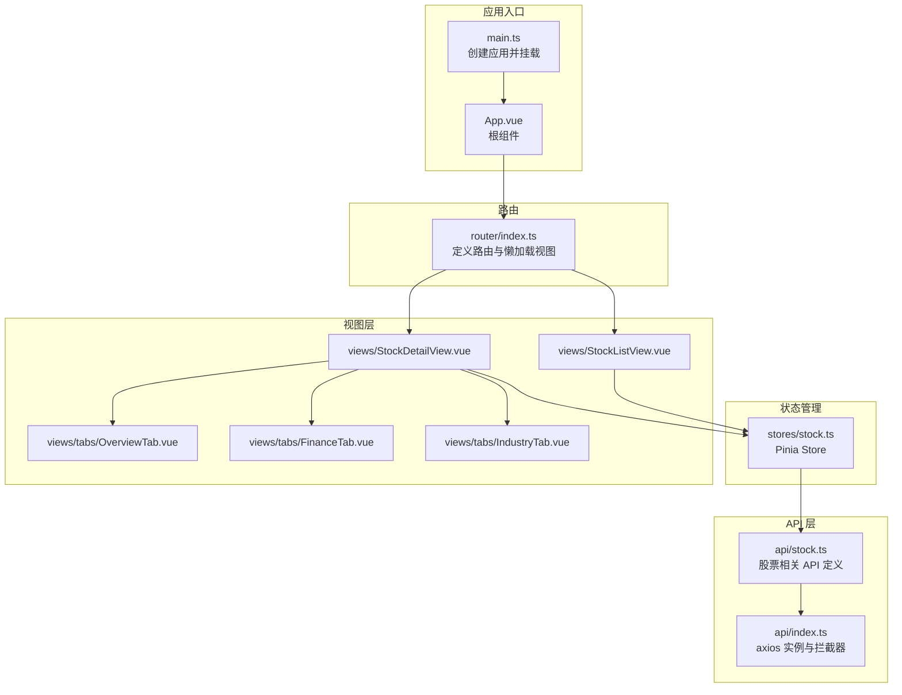
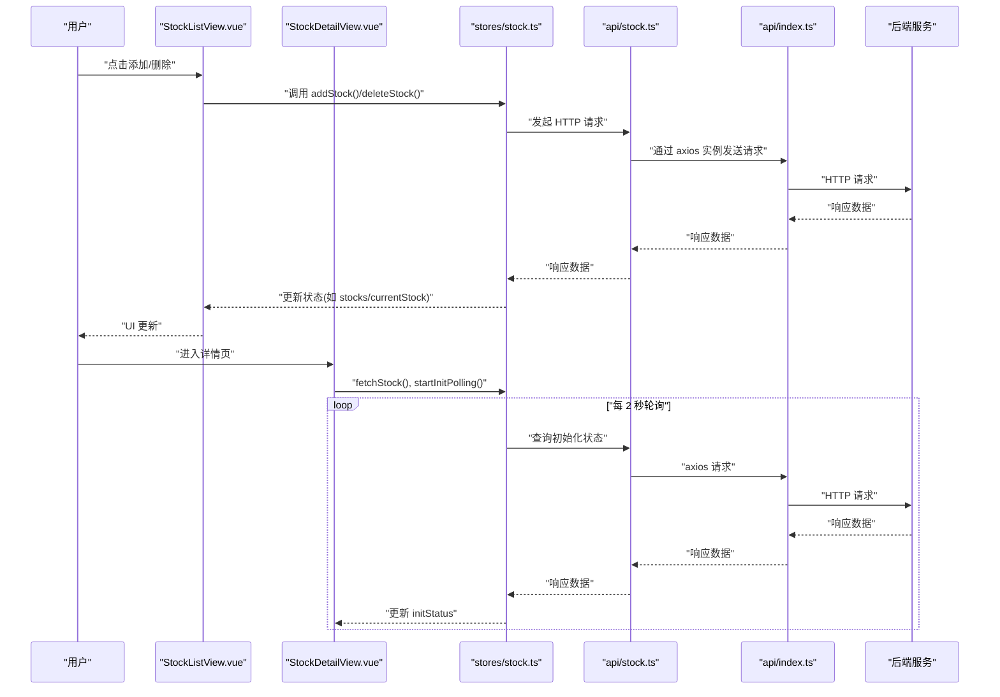
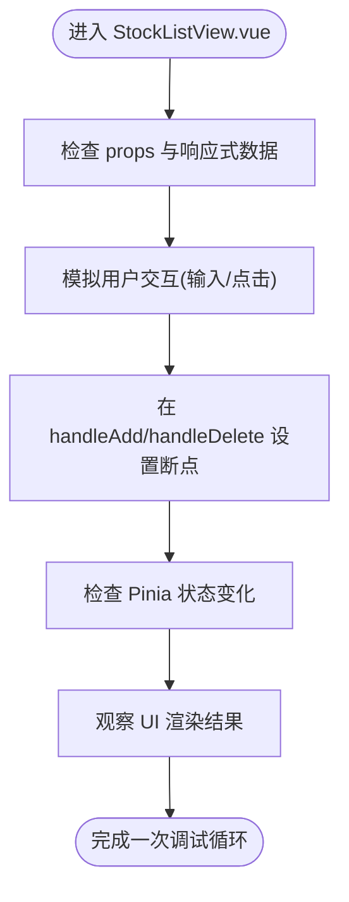
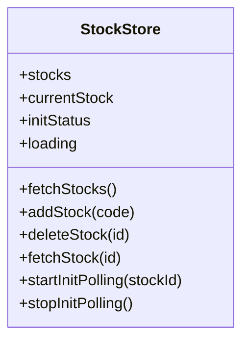
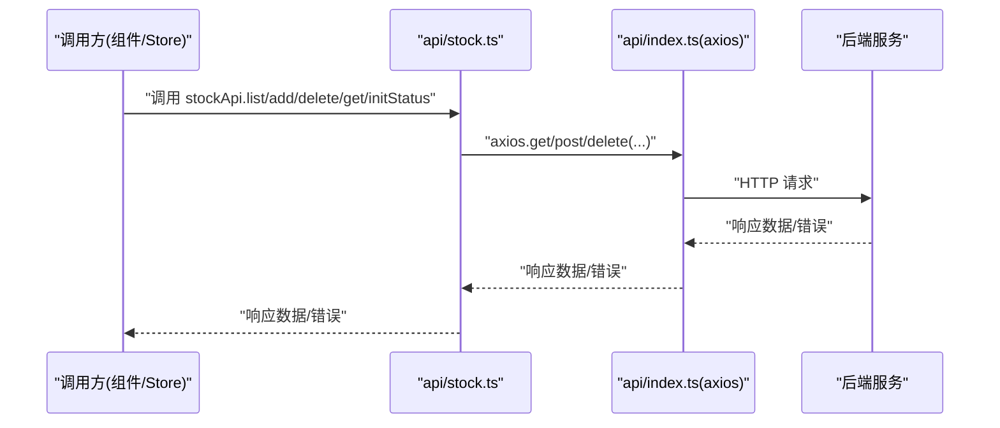
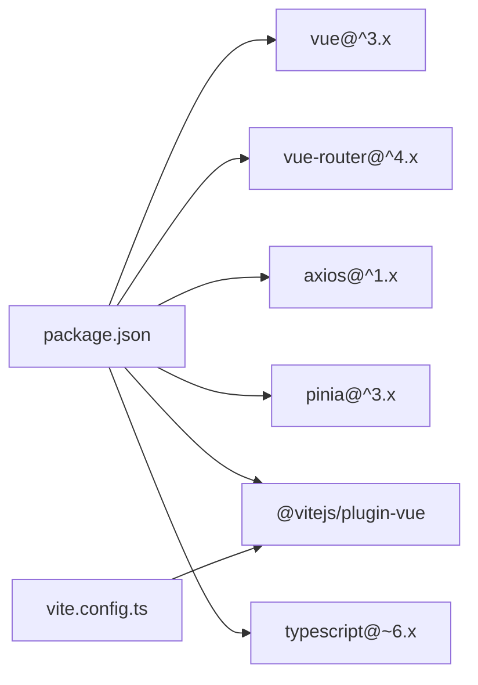

# 前端调试方法

<cite>
**本文引用的文件**
- [frontend/src/main.ts](file://frontend/src/main.ts)
- [frontend/src/App.vue](file://frontend/src/App.vue)
- [frontend/src/router/index.ts](file://frontend/src/router/index.ts)
- [frontend/src/stores/stock.ts](file://frontend/src/stores/stock.ts)
- [frontend/src/api/index.ts](file://frontend/src/api/index.ts)
- [frontend/src/api/stock.ts](file://frontend/src/api/stock.ts)
- [frontend/src/views/StockListView.vue](file://frontend/src/views/StockListView.vue)
- [frontend/src/views/StockDetailView.vue](file://frontend/src/views/StockDetailView.vue)
- [frontend/src/views/tabs/OverviewTab.vue](file://frontend/src/views/tabs/OverviewTab.vue)
- [frontend/src/views/tabs/FinanceTab.vue](file://frontend/src/views/tabs/FinanceTab.vue)
- [frontend/src/views/tabs/IndustryTab.vue](file://frontend/src/views/tabs/IndustryTab.vue)
- [frontend/package.json](file://frontend/package.json)
- [frontend/vite.config.ts](file://frontend/vite.config.ts)
- [frontend/playwright.config.ts](file://frontend/playwright.config.ts)
</cite>

## 目录
1. [简介](#简介)
2. [项目结构](#项目结构)
3. [核心组件](#核心组件)
4. [架构总览](#架构总览)
5. [详细组件分析](#详细组件分析)
6. [依赖分析](#依赖分析)
7. [性能考虑](#性能考虑)
8. [故障排查指南](#故障排查指南)
9. [结论](#结论)
10. [附录](#附录)

## 简介
本文件面向前端开发者与测试工程师，提供一套系统化的前端调试方法论与实操指南，覆盖 Vue.js 组件调试、Pinia 状态管理调试、API 调用调试、性能分析与断点调试策略，并结合本仓库中的实际代码示例进行说明。目标是帮助你在开发过程中快速定位问题、提升调试效率。

## 项目结构
前端采用 Vue 3 + TypeScript + Vite 构建，使用 Pinia 进行状态管理，通过 axios 封装统一 API 访问层，路由采用 Vue Router 的历史模式。页面由 StockListView、StockDetailView 及多个 Tab 视图组成，围绕“股票列表”和“股票详情”两大场景展开。

图表来源
- [frontend/src/main.ts:1-11](file://frontend/src/main.ts#L1-L11)
- [frontend/src/App.vue:1-4](file://frontend/src/App.vue#L1-L4)
- [frontend/src/router/index.ts:1-28](file://frontend/src/router/index.ts#L1-L28)
- [frontend/src/stores/stock.ts:1-80](file://frontend/src/stores/stock.ts#L1-L80)
- [frontend/src/api/index.ts:1-18](file://frontend/src/api/index.ts#L1-L18)
- [frontend/src/api/stock.ts:1-61](file://frontend/src/api/stock.ts#L1-L61)
- [frontend/src/views/StockListView.vue:1-102](file://frontend/src/views/StockListView.vue#L1-L102)
- [frontend/src/views/StockDetailView.vue:1-82](file://frontend/src/views/StockDetailView.vue#L1-L82)
- [frontend/src/views/tabs/OverviewTab.vue:1-86](file://frontend/src/views/tabs/OverviewTab.vue#L1-L86)
- [frontend/src/views/tabs/FinanceTab.vue:1-77](file://frontend/src/views/tabs/FinanceTab.vue#L1-L77)
- [frontend/src/views/tabs/IndustryTab.vue:1-81](file://frontend/src/views/tabs/IndustryTab.vue#L1-L81)

章节来源
- [frontend/src/main.ts:1-11](file://frontend/src/main.ts#L1-L11)
- [frontend/src/App.vue:1-4](file://frontend/src/App.vue#L1-L4)
- [frontend/src/router/index.ts:1-28](file://frontend/src/router/index.ts#L1-L28)
- [frontend/src/stores/stock.ts:1-80](file://frontend/src/stores/stock.ts#L1-L80)
- [frontend/src/api/index.ts:1-18](file://frontend/src/api/index.ts#L1-L18)
- [frontend/src/api/stock.ts:1-61](file://frontend/src/api/stock.ts#L1-L61)
- [frontend/src/views/StockListView.vue:1-102](file://frontend/src/views/StockListView.vue#L1-L102)
- [frontend/src/views/StockDetailView.vue:1-82](file://frontend/src/views/StockDetailView.vue#L1-L82)
- [frontend/src/views/tabs/OverviewTab.vue:1-86](file://frontend/src/views/tabs/OverviewTab.vue#L1-L86)
- [frontend/src/views/tabs/FinanceTab.vue:1-77](file://frontend/src/views/tabs/FinanceTab.vue#L1-L77)
- [frontend/src/views/tabs/IndustryTab.vue:1-81](file://frontend/src/views/tabs/IndustryTab.vue#L1-L81)

## 核心组件
- 应用入口与挂载：在入口文件中创建应用实例、安装路由与 Pinia，并挂载到 DOM。
- 根组件：最外层容器，内部仅包含路由出口。
- 路由系统：定义股票列表页与详情页路由，详情页内嵌多个 Tab 子路由，支持按需加载视图组件。
- 状态管理：以组合式 Store 暴露 stocks、currentStock、initStatus、loading 等状态与异步 action，如 fetchStocks、addStock、deleteStock、fetchStock、startInitPolling、stopInitPolling。
- API 层：统一创建 axios 实例，设置基础地址与超时；注册响应拦截器用于错误日志输出；封装股票相关接口。
- 视图组件：列表页负责展示与交互、触发状态更新；详情页负责展示当前股票信息与初始化进度条，配合轮询刷新；各 Tab 页负责具体业务数据的获取与展示。

章节来源
- [frontend/src/main.ts:1-11](file://frontend/src/main.ts#L1-L11)
- [frontend/src/App.vue:1-4](file://frontend/src/App.vue#L1-L4)
- [frontend/src/router/index.ts:1-28](file://frontend/src/router/index.ts#L1-L28)
- [frontend/src/stores/stock.ts:1-80](file://frontend/src/stores/stock.ts#L1-L80)
- [frontend/src/api/index.ts:1-18](file://frontend/src/api/index.ts#L1-L18)
- [frontend/src/api/stock.ts:1-61](file://frontend/src/api/stock.ts#L1-L61)
- [frontend/src/views/StockListView.vue:1-102](file://frontend/src/views/StockListView.vue#L1-L102)
- [frontend/src/views/StockDetailView.vue:1-82](file://frontend/src/views/StockDetailView.vue#L1-L82)

## 架构总览
下图展示了从用户交互到数据流的完整路径：组件触发 Store Action → Store 调用 API → API 通过 axios 发起请求 → 后端返回数据 → Store 更新状态 → 视图响应更新。

图表来源
- [frontend/src/views/StockListView.vue:64-80](file://frontend/src/views/StockListView.vue#L64-L80)
- [frontend/src/views/StockDetailView.vue:61-79](file://frontend/src/views/StockDetailView.vue#L61-L79)
- [frontend/src/stores/stock.ts:12-78](file://frontend/src/stores/stock.ts#L12-L78)
- [frontend/src/api/stock.ts:53-60](file://frontend/src/api/stock.ts#L53-L60)
- [frontend/src/api/index.ts:3-15](file://frontend/src/api/index.ts#L3-L15)

## 详细组件分析

### Vue 组件调试要点
- 使用 Vue DevTools 检查组件树、Props 与 Events：
  - 在浏览器中打开 Vue DevTools，切换到“组件”标签，查看组件层级与 props 传入情况。
  - 在“事件”标签中观察组件间通信与事件派发。
- 列表页组件调试：
  - 关注输入框与按钮交互、loading 状态、表格渲染逻辑。
  - 断点位置建议：组件 mounted 钩子、handleAdd/handleDelete 方法内部、格式化函数处。
- 详情页组件调试：
  - 关注初始化进度条、轮询控制、路由参数变化与 watch 回调。
  - 断点位置建议：mounted 中的 fetchStock/startInitPolling、onUnmounted 中的 stopInitPolling、watch 回调中。

图表来源
- [frontend/src/views/StockListView.vue:50-102](file://frontend/src/views/StockListView.vue#L50-L102)
- [frontend/src/stores/stock.ts:12-28](file://frontend/src/stores/stock.ts#L12-L28)

章节来源
- [frontend/src/views/StockListView.vue:50-102](file://frontend/src/views/StockListView.vue#L50-L102)
- [frontend/src/views/StockDetailView.vue:47-82](file://frontend/src/views/StockDetailView.vue#L47-L82)
- [frontend/src/stores/stock.ts:12-78](file://frontend/src/stores/stock.ts#L12-L78)

### Pinia Store 调试
- Store 结构与职责：
  - 状态：stocks、currentStock、initStatus、loading。
  - 行为：fetchStocks、addStock、deleteStock、fetchStock、startInitPolling、stopInitPolling。
- 调试策略：
  - 在 Vue DevTools 中启用“Vuex/Pinia”调试，观察状态变更轨迹。
  - 在 addStock、deleteStock、fetchStocks 等关键方法前后设置断点，检查 loading 状态与数据流。
  - 对轮询逻辑（startInitPolling/stopInitPolling）进行单步调试，确保定时器正确启动与清理。
- 异步 action 调试：
  - 在 try/catch 区域设置断点，捕获异常并检查错误响应。
  - 观察 finally 分支对 loading 的复位，避免 UI 卡死。

图表来源
- [frontend/src/stores/stock.ts:5-79](file://frontend/src/stores/stock.ts#L5-L79)

章节来源
- [frontend/src/stores/stock.ts:1-80](file://frontend/src/stores/stock.ts#L1-L80)

### API 调用调试
- axios 实例与拦截器：
  - 基础地址与超时已配置；响应拦截器统一输出错误信息，便于定位问题。
- 接口定义与调用：
  - 股票相关接口包括 list/add/delete/get/initStatus/completeness。
  - 在调用处设置断点，检查请求参数、响应数据结构与异常处理分支。
- 网络面板分析：
  - 打开浏览器 Network 面板，过滤 XHR/Fetch 请求，查看请求头、请求体、响应状态码与响应体。
  - 关注 4xx/5xx 错误与超时重试策略。

图表来源
- [frontend/src/api/stock.ts:53-60](file://frontend/src/api/stock.ts#L53-L60)
- [frontend/src/api/index.ts:3-15](file://frontend/src/api/index.ts#L3-L15)

章节来源
- [frontend/src/api/index.ts:1-18](file://frontend/src/api/index.ts#L1-L18)
- [frontend/src/api/stock.ts:1-61](file://frontend/src/api/stock.ts#L1-L61)

### 性能分析方法
- 浏览器性能面板：
  - 录制渲染、脚本执行与内存分配，识别长任务与频繁重排。
- 内存泄漏检测：
  - 使用 Memory 面板快照对比，关注未释放的定时器与事件监听器。
  - 在详情页组件卸载钩子中确保停止轮询，避免定时器泄漏。
- 渲染性能优化：
  - 列表渲染使用 v-for 时，确保提供稳定 key。
  - 减少不必要的响应式对象嵌套，避免深层依赖导致的无效更新。
  - 对高频格式化函数进行防抖或缓存策略。

章节来源
- [frontend/src/views/StockDetailView.vue:67-69](file://frontend/src/views/StockDetailView.vue#L67-L69)
- [frontend/src/stores/stock.ts:43-65](file://frontend/src/stores/stock.ts#L43-L65)

## 依赖分析
- 开发与运行时依赖：
  - Vue 3、Vue Router、Pinia、Axios、Vite。
- 构建配置：
  - Vite 插件启用 Vue 支持，开发服务器端口默认 5173。
- E2E 测试：
  - Playwright 配置指向本地开发服务器，超时与截图策略已设定。

图表来源
- [frontend/package.json:1-27](file://frontend/package.json#L1-L27)
- [frontend/vite.config.ts:1-8](file://frontend/vite.config.ts#L1-L8)

章节来源
- [frontend/package.json:1-27](file://frontend/package.json#L1-L27)
- [frontend/vite.config.ts:1-8](file://frontend/vite.config.ts#L1-L8)
- [frontend/playwright.config.ts:1-25](file://frontend/playwright.config.ts#L1-L25)

## 性能考虑
- 避免在模板中直接进行复杂计算，将格式化逻辑集中在方法或计算属性中。
- 对于高频轮询（如初始化状态），确保在组件卸载时清理定时器。
- 使用浏览器性能面板识别主线程阻塞，必要时拆分任务或使用 Web Worker。
- 控制响应式数据规模，减少不必要的响应式依赖。

## 故障排查指南
- 组件渲染问题：
  - 检查 v-if/v-show 条件与响应式数据是否正确更新。
  - 在 Vue DevTools 中确认组件树与状态同步。
- 状态不更新：
  - 确认 Store 中的 ref 是否被正确赋值；在 addStock/deleteStock/fetchStocks 中设置断点，检查赋值与 finally 复位。
- API 调用失败：
  - 查看 Network 面板状态码与响应体；检查 axios 拦截器输出；在调用处设置断点，捕获异常并打印错误信息。
- 轮询未停止：
  - 在组件卸载钩子中调用 stopInitPolling；在 Vue DevTools 中确认定时器 ID 已清理。

章节来源
- [frontend/src/views/StockDetailView.vue:67-69](file://frontend/src/views/StockDetailView.vue#L67-L69)
- [frontend/src/stores/stock.ts:60-65](file://frontend/src/stores/stock.ts#L60-L65)
- [frontend/src/api/index.ts:8-15](file://frontend/src/api/index.ts#L8-L15)

## 结论
通过结合 Vue DevTools、浏览器性能面板、Network 面板与断点调试策略，可以高效定位并解决前端开发中的组件渲染、状态更新与 API 调用问题。针对本项目，重点在于 Store 的异步流程、轮询机制与视图层的数据绑定一致性。

## 附录
- 调试工具清单：
  - Chrome DevTools：Elements、Console、Sources、Network、Performance、Memory。
  - Vue DevTools：组件树、状态、事件与时间旅行调试。
  - E2E：Playwright（配置已就绪）。
- 快速检查清单：
  - 组件 props 是否正确传入？
  - Store 状态是否按预期更新？
  - 轮询是否在组件卸载时停止？
  - Network 面板是否存在大量失败或超时请求？