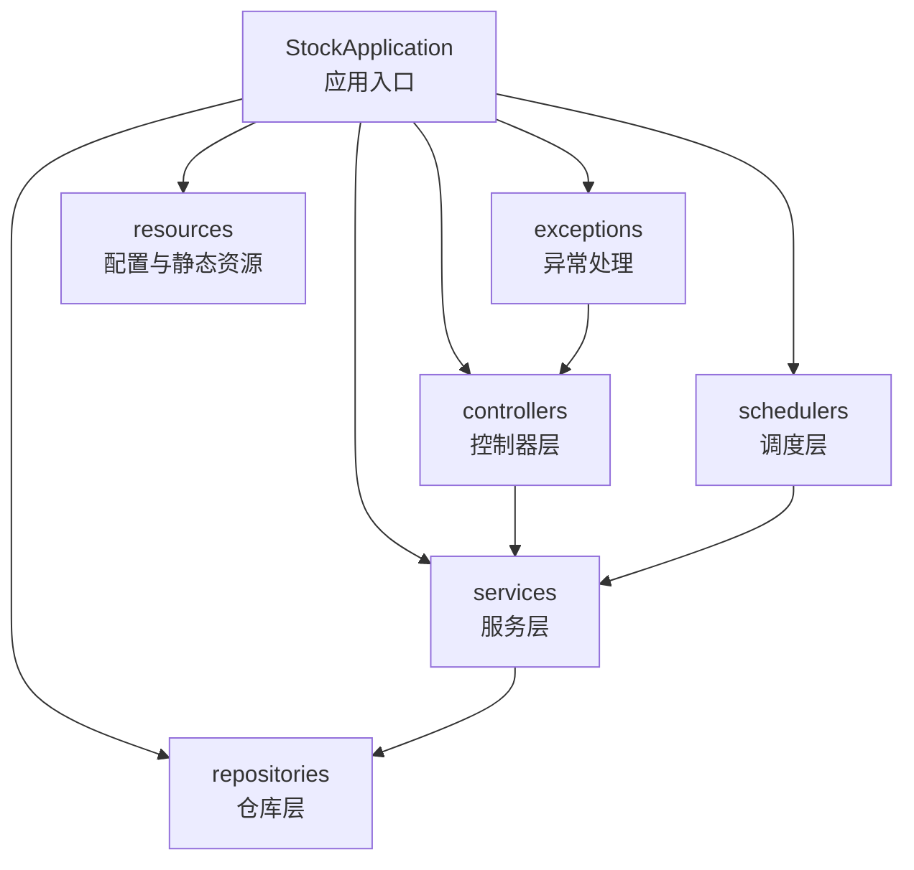
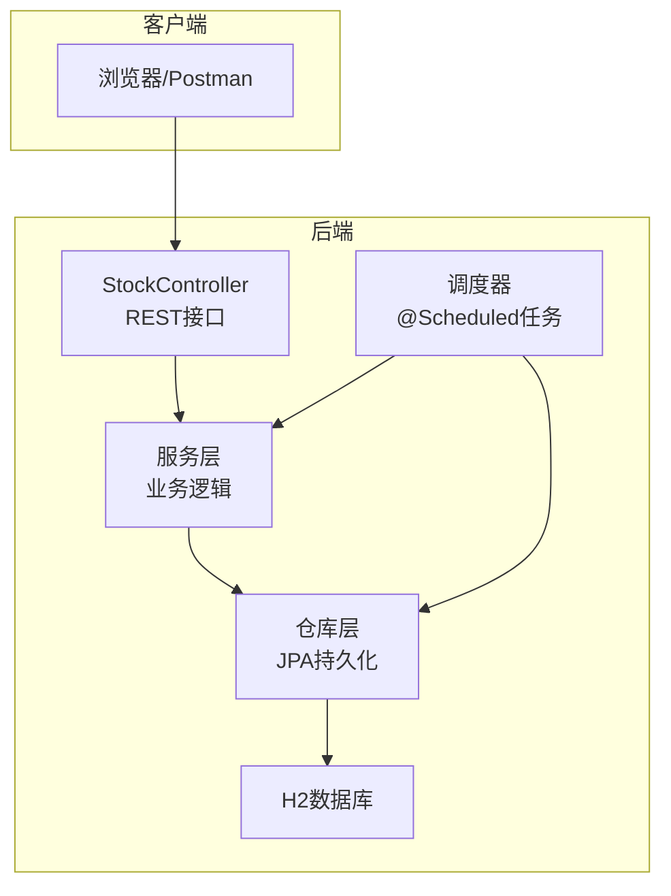
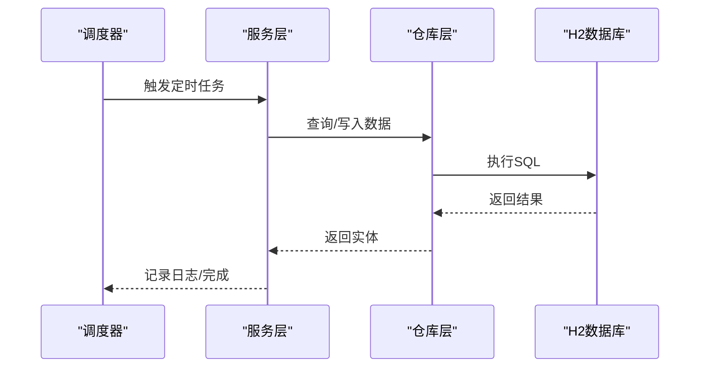
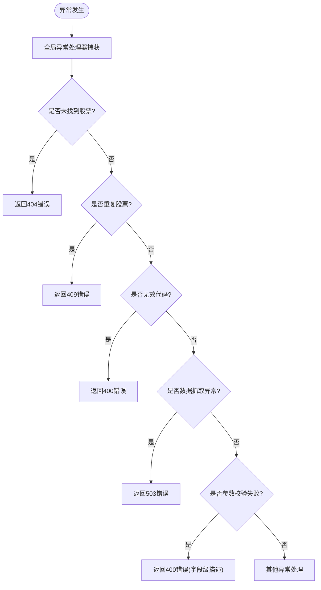
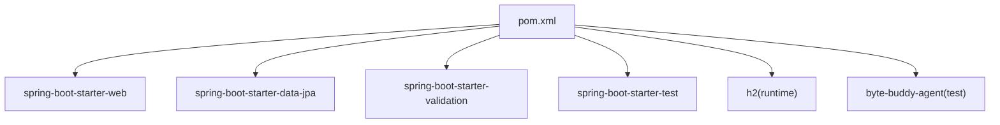

# 后端调试方法

<cite>
**本文引用的文件**
- [StockApplication.java](file://backend/src/main/java/com/stock/StockApplication.java)
- [application.yml](file://backend/src/main/resources/application.yml)
- [GlobalExceptionHandler.java](file://backend/src/main/java/com/stock/exception/GlobalExceptionHandler.java)
- [AlertCheckScheduler.java](file://backend/src/main/java/com/stock/scheduler/AlertCheckScheduler.java)
- [DataSyncScheduler.java](file://backend/src/main/java/com/stock/scheduler/DataSyncScheduler.java)
- [QuoteRefreshScheduler.java](file://backend/src/main/java/com/stock/scheduler/QuoteRefreshScheduler.java)
- [SignalScheduler.java](file://backend/src/main/java/com/stock/scheduler/SignalScheduler.java)
- [StockController.java](file://backend/src/main/java/com/stock/controller/StockController.java)
- [DataFetchException.java](file://backend/src/main/java/com/stock/exception/DataFetchException.java)
- [StockNotFoundException.java](file://backend/src/main/java/com/stock/exception/StockNotFoundException.java)
- [DuplicateStockException.java](file://backend/src/main/java/com/stock/exception/DuplicateStockException.java)
- [StockControllerTest.java](file://backend/src/test/java/com/stock/controller/StockControllerTest.java)
- [StockServiceTest.java](file://backend/src/test/java/com/stock/service/StockServiceTest.java)
- [pom.xml](file://backend/pom.xml)
</cite>

## 目录
1. [简介](#简介)
2. [项目结构](#项目结构)
3. [核心组件](#核心组件)
4. [架构总览](#架构总览)
5. [详细组件分析](#详细组件分析)
6. [依赖分析](#依赖分析)
7. [性能考虑](#性能考虑)
8. [故障排查指南](#故障排查指南)
9. [结论](#结论)
10. [附录](#附录)

## 简介
本文件面向后端开发者与运维工程师，系统化梳理Spring Boot应用在开发与生产环境中的调试方法，覆盖以下主题：
- IDE断点调试与远程调试配置
- 日志级别调整与日志分析
- 数据库查询调试（H2数据库连接、SQL语句调试、查询性能分析）
- 定时任务调试（@Scheduled注解调试、Cron表达式验证、任务执行监控）
- 异常追踪技巧（全局异常处理器调试、堆栈跟踪分析、错误日志定位）
- 调试工具使用（IntelliJ IDEA调试器、Postman接口调试、H2 Console访问）

## 项目结构
后端采用Spring Boot标准目录结构，核心模块包括：
- 应用入口与配置：启动类、Spring配置
- 控制器层：REST接口定义
- 业务服务层：核心业务逻辑
- 持久层：JPA仓库接口
- 调度层：基于注解的定时任务
- 异常处理：全局异常映射
- 测试：控制器与服务单元测试

图表来源
- [StockApplication.java:1-16](file://backend/src/main/java/com/stock/StockApplication.java#L1-L16)
- [application.yml:1-28](file://backend/src/main/resources/application.yml#L1-L28)

章节来源
- [StockApplication.java:1-16](file://backend/src/main/java/com/stock/StockApplication.java#L1-L16)
- [application.yml:1-28](file://backend/src/main/resources/application.yml#L1-L28)

## 核心组件
- 应用入口与开关
  - 启用调度与异步：通过启动类启用定时任务与异步能力，便于调试任务执行链路。
  - 参考路径：[StockApplication.java:8-10](file://backend/src/main/java/com/stock/StockApplication.java#L8-L10)

- 配置中心
  - 数据源与H2控制台：内置H2数据库与控制台，便于本地调试SQL与表结构。
  - JPA格式化SQL：开启SQL格式化，利于阅读与分析。
  - 定时任务Cron：集中管理各任务的触发周期，便于统一调试与验证。
  - 参考路径：[application.yml:4-27](file://backend/src/main/resources/application.yml#L4-L27)

- 全局异常处理
  - 统一响应错误码与消息，便于接口调试时快速定位问题类型。
  - 参考路径：[GlobalExceptionHandler.java:7-31](file://backend/src/main/java/com/stock/exception/GlobalExceptionHandler.java#L7-L31)

- 定时任务
  - 报价刷新、数据同步、信号检测、告警检查等，均使用@Scheduled注解，支持按Cron表达式触发。
  - 参考路径：
    - [AlertCheckScheduler.java:26-50](file://backend/src/main/java/com/stock/scheduler/AlertCheckScheduler.java#L26-L50)
    - [DataSyncScheduler.java:54-236](file://backend/src/main/java/com/stock/scheduler/DataSyncScheduler.java#L54-L236)
    - [QuoteRefreshScheduler.java:24-33](file://backend/src/main/java/com/stock/scheduler/QuoteRefreshScheduler.java#L24-L33)
    - [SignalScheduler.java:39-108](file://backend/src/main/java/com/stock/scheduler/SignalScheduler.java#L39-L108)

- 接口与异常类型
  - 接口示例：股票增删查、初始化状态查询；异常类型：重复股票、无效代码、未找到股票、数据抓取失败。
  - 参考路径：
    - [StockController.java:29-55](file://backend/src/main/java/com/stock/controller/StockController.java#L29-L55)
    - [DataFetchException.java:1-6](file://backend/src/main/java/com/stock/exception/DataFetchException.java#L1-L6)
    - [StockNotFoundException.java:1-6](file://backend/src/main/java/com/stock/exception/StockNotFoundException.java#L1-L6)
    - [DuplicateStockException.java:1-5](file://backend/src/main/java/com/stock/exception/DuplicateStockException.java#L1-L5)

章节来源
- [StockApplication.java:8-10](file://backend/src/main/java/com/stock/StockApplication.java#L8-L10)
- [application.yml:4-27](file://backend/src/main/resources/application.yml#L4-L27)
- [GlobalExceptionHandler.java:7-31](file://backend/src/main/java/com/stock/exception/GlobalExceptionHandler.java#L7-L31)
- [AlertCheckScheduler.java:26-50](file://backend/src/main/java/com/stock/scheduler/AlertCheckScheduler.java#L26-L50)
- [DataSyncScheduler.java:54-236](file://backend/src/main/java/com/stock/scheduler/DataSyncScheduler.java#L54-L236)
- [QuoteRefreshScheduler.java:24-33](file://backend/src/main/java/com/stock/scheduler/QuoteRefreshScheduler.java#L24-L33)
- [SignalScheduler.java:39-108](file://backend/src/main/java/com/stock/scheduler/SignalScheduler.java#L39-L108)
- [StockController.java:29-55](file://backend/src/main/java/com/stock/controller/StockController.java#L29-L55)
- [DataFetchException.java:1-6](file://backend/src/main/java/com/stock/exception/DataFetchException.java#L1-L6)
- [StockNotFoundException.java:1-6](file://backend/src/main/java/com/stock/exception/StockNotFoundException.java#L1-L6)
- [DuplicateStockException.java:1-5](file://backend/src/main/java/com/stock/exception/DuplicateStockException.java#L1-L5)

## 架构总览
下图展示从客户端到数据库的典型请求链路，以及定时任务的触发与执行路径。

图表来源
- [StockController.java:17-56](file://backend/src/main/java/com/stock/controller/StockController.java#L17-L56)
- [application.yml:4-17](file://backend/src/main/resources/application.yml#L4-L17)

## 详细组件分析

### 调试工具与环境准备
- IntelliJ IDEA断点调试
  - 在控制器、服务、调度器的关键方法处设置断点，观察入参、中间结果与返回值。
  - 建议在以下位置设置断点：
    - 控制器入口：[StockController.java:29-55](file://backend/src/main/java/com/stock/controller/StockController.java#L29-L55)
    - 服务方法：结合具体业务方法进行断点
    - 调度任务：如报价刷新、数据同步、信号检测、告警检查
      - [QuoteRefreshScheduler.java:24-33](file://backend/src/main/java/com/stock/scheduler/QuoteRefreshScheduler.java#L24-L33)
      - [DataSyncScheduler.java:54-236](file://backend/src/main/java/com/stock/scheduler/DataSyncScheduler.java#L54-L236)
      - [SignalScheduler.java:39-108](file://backend/src/main/java/com/stock/scheduler/SignalScheduler.java#L39-L108)
      - [AlertCheckScheduler.java:26-50](file://backend/src/main/java/com/stock/scheduler/AlertCheckScheduler.java#L26-L50)

- Postman接口调试
  - 使用REST接口对控制器进行调用，观察响应状态与内容，结合全局异常处理器定位错误。
  - 示例接口：
    - 新增股票：POST /api/v1/stocks
    - 删除股票：DELETE /api/v1/stocks/{id}
    - 列表股票：GET /api/v1/stocks
    - 获取股票详情：GET /api/v1/stocks/{id}
    - 初始化状态：GET /api/v1/stocks/{id}/init-status
  - 参考路径：[StockController.java:29-55](file://backend/src/main/java/com/stock/controller/StockController.java#L29-L55)

- H2 Console访问
  - 启动后访问 /h2-console，连接H2数据库，查看表结构与数据，验证JPA操作是否正确。
  - 参考路径：[application.yml:14-17](file://backend/src/main/resources/application.yml#L14-L17)

- 远程调试配置（可选）
  - 在启动参数中添加远程调试参数，以便在远程或容器环境中进行调试。
  - 参考路径：[pom.xml:91-99](file://backend/pom.xml#L91-L99)

章节来源
- [StockController.java:29-55](file://backend/src/main/java/com/stock/controller/StockController.java#L29-L55)
- [application.yml:14-17](file://backend/src/main/resources/application.yml#L14-L17)
- [pom.xml:91-99](file://backend/pom.xml#L91-L99)

### 定时任务调试流程
- Cron表达式验证
  - 在配置文件中集中维护Cron表达式，便于统一调试与修改。
  - 参考路径：
    - [application.yml:23-27](file://backend/src/main/resources/application.yml#L23-L27)
    - [DataSyncScheduler.java:54-236](file://backend/src/main/java/com/stock/scheduler/DataSyncScheduler.java#L54-L236)
    - [QuoteRefreshScheduler.java:24-33](file://backend/src/main/java/com/stock/scheduler/QuoteRefreshScheduler.java#L24-L33)
    - [SignalScheduler.java:39-108](file://backend/src/main/java/com/stock/scheduler/SignalScheduler.java#L39-L108)
    - [AlertCheckScheduler.java:26-50](file://backend/src/main/java/com/stock/scheduler/AlertCheckScheduler.java#L26-L50)

- 执行监控与日志
  - 各任务在开始与结束时记录日志，便于确认执行情况与耗时。
  - 参考路径：
    - [DataSyncScheduler.java:56-82](file://backend/src/main/java/com/stock/scheduler/DataSyncScheduler.java#L56-L82)
    - [QuoteRefreshScheduler.java:25-32](file://backend/src/main/java/com/stock/scheduler/QuoteRefreshScheduler.java#L25-L32)
    - [SignalScheduler.java:41-107](file://backend/src/main/java/com/stock/scheduler/SignalScheduler.java#L41-L107)
    - [AlertCheckScheduler.java:28-49](file://backend/src/main/java/com/stock/scheduler/AlertCheckScheduler.java#L28-L49)

- 调试步骤建议
  1. 修改Cron为高频表达式（如每分钟），快速验证逻辑。
  2. 在任务方法内设置断点，观察数据加载与计算过程。
  3. 查看日志输出，确认任务执行次数与结果。
  4. 将Cron恢复为原值，避免生产环境压力过大。

图表来源
- [DataSyncScheduler.java:54-236](file://backend/src/main/java/com/stock/scheduler/DataSyncScheduler.java#L54-L236)
- [application.yml:23-27](file://backend/src/main/resources/application.yml#L23-L27)

章节来源
- [application.yml:23-27](file://backend/src/main/resources/application.yml#L23-L27)
- [DataSyncScheduler.java:54-236](file://backend/src/main/java/com/stock/scheduler/DataSyncScheduler.java#L54-L236)
- [QuoteRefreshScheduler.java:24-33](file://backend/src/main/java/com/stock/scheduler/QuoteRefreshScheduler.java#L24-L33)
- [SignalScheduler.java:39-108](file://backend/src/main/java/com/stock/scheduler/SignalScheduler.java#L39-L108)
- [AlertCheckScheduler.java:26-50](file://backend/src/main/java/com/stock/scheduler/AlertCheckScheduler.java#L26-L50)

### 数据库查询调试
- H2数据库连接
  - 使用内置H2与控制台，无需额外安装即可调试SQL。
  - 参考路径：[application.yml:4-17](file://backend/src/main/resources/application.yml#L4-L17)

- SQL格式化与性能分析
  - 开启Hibernate SQL格式化，便于阅读与分析。
  - 参考路径：[application.yml:12-13](file://backend/src/main/resources/application.yml#L12-L13)

- 常见调试场景
  - 验证JPA查询是否正确生成SQL：在仓库层方法处设置断点，观察查询条件与结果集。
  - 使用H2 Console执行手工SQL，比对结果一致性。
  - 关注事务边界：定时任务与服务方法多处使用事务注解，确保数据一致性。

章节来源
- [application.yml:4-17](file://backend/src/main/resources/application.yml#L4-L17)

### 异常追踪与日志分析
- 全局异常处理器
  - 统一捕获业务异常并返回标准化错误响应，便于前端与接口调试。
  - 参考路径：[GlobalExceptionHandler.java:7-31](file://backend/src/main/java/com/stock/exception/GlobalExceptionHandler.java#L7-L31)

- 常见异常类型
  - 未找到股票：用于查询不存在的股票资源。
    - [StockNotFoundException.java:1-6](file://backend/src/main/java/com/stock/exception/StockNotFoundException.java#L1-L6)
  - 重复股票：新增重复代码时触发。
    - [DuplicateStockException.java:1-5](file://backend/src/main/java/com/stock/exception/DuplicateStockException.java#L1-L5)
  - 数据抓取失败：外部数据源异常时触发。
    - [DataFetchException.java:1-6](file://backend/src/main/java/com/stock/exception/DataFetchException.java#L1-L6)

- 日志级别与解读
  - INFO：任务开始/结束、成功更新数量等信息。
  - WARN：任务执行中的异常或跳过项，便于定位个别失败的数据。
  - ERROR：严重异常，需立即关注。
  - 参考路径：
    - [QuoteRefreshScheduler.java:25-32](file://backend/src/main/java/com/stock/scheduler/QuoteRefreshScheduler.java#L25-L32)
    - [DataSyncScheduler.java:78-115](file://backend/src/main/java/com/stock/scheduler/DataSyncScheduler.java#L78-L115)
    - [SignalScheduler.java:103-104](file://backend/src/main/java/com/stock/scheduler/SignalScheduler.java#L103-L104)

图表来源
- [GlobalExceptionHandler.java:9-31](file://backend/src/main/java/com/stock/exception/GlobalExceptionHandler.java#L9-L31)

章节来源
- [GlobalExceptionHandler.java:7-31](file://backend/src/main/java/com/stock/exception/GlobalExceptionHandler.java#L7-L31)
- [StockNotFoundException.java:1-6](file://backend/src/main/java/com/stock/exception/StockNotFoundException.java#L1-L6)
- [DuplicateStockException.java:1-5](file://backend/src/main/java/com/stock/exception/DuplicateStockException.java#L1-L5)
- [DataFetchException.java:1-6](file://backend/src/main/java/com/stock/exception/DataFetchException.java#L1-L6)
- [QuoteRefreshScheduler.java:25-32](file://backend/src/main/java/com/stock/scheduler/QuoteRefreshScheduler.java#L25-L32)
- [DataSyncScheduler.java:78-115](file://backend/src/main/java/com/stock/scheduler/DataSyncScheduler.java#L78-L115)
- [SignalScheduler.java:103-104](file://backend/src/main/java/com/stock/scheduler/SignalScheduler.java#L103-L104)

### 接口调试与测试
- 单元测试与Mock
  - 使用MockMvc对控制器进行集成测试，验证HTTP状态码与JSON响应。
  - 参考路径：
    - [StockControllerTest.java:51-114](file://backend/src/test/java/com/stock/controller/StockControllerTest.java#L51-L114)
    - [StockServiceTest.java:73-177](file://backend/src/test/java/com/stock/service/StockServiceTest.java#L73-L177)

- 调试建议
  - 在控制器与服务层设置断点，观察参数绑定、业务逻辑与异常抛出点。
  - 使用Postman构造边界场景（空输入、非法代码、不存在ID）以验证异常处理。

章节来源
- [StockControllerTest.java:51-114](file://backend/src/test/java/com/stock/controller/StockControllerTest.java#L51-L114)
- [StockServiceTest.java:73-177](file://backend/src/test/java/com/stock/service/StockServiceTest.java#L73-L177)

## 依赖分析
- Spring Boot Starter
  - web、data-jpa、validation、test等，支撑REST、ORM、校验与测试。
- H2数据库
  - 内置运行时数据库，配合控制台进行调试。
- ByteBuddy代理
  - 测试插件配置，支持Mock框架与字节码代理。

图表来源
- [pom.xml:23-55](file://backend/pom.xml#L23-L55)

章节来源
- [pom.xml:23-55](file://backend/pom.xml#L23-L55)

## 性能考虑
- JVM内存分析
  - 使用IDE或外部工具采集堆快照，定位内存占用与泄漏风险。
- 数据库查询优化
  - 结合H2控制台与SQL格式化输出，识别慢查询与缺失索引。
- 线程池监控
  - 若启用异步任务，关注线程池队列长度与拒绝策略，避免阻塞。

## 故障排查指南
- 接口调试
  - 使用Postman验证HTTP状态码与响应体，结合全局异常处理器定位错误类型。
  - 参考路径：[StockController.java:29-55](file://backend/src/main/java/com/stock/controller/StockController.java#L29-L55)、[GlobalExceptionHandler.java:7-31](file://backend/src/main/java/com/stock/exception/GlobalExceptionHandler.java#L7-L31)

- 日志分析
  - 关注INFO/WARN/ERROR级别日志，定位异常发生时间与上下文。
  - 参考路径：
    - [QuoteRefreshScheduler.java:25-32](file://backend/src/main/java/com/stock/scheduler/QuoteRefreshScheduler.java#L25-L32)
    - [DataSyncScheduler.java:78-115](file://backend/src/main/java/com/stock/scheduler/DataSyncScheduler.java#L78-L115)
    - [SignalScheduler.java:103-104](file://backend/src/main/java/com/stock/scheduler/SignalScheduler.java#L103-L104)

- 数据库问题
  - 通过H2 Console核对表结构与数据，确认JPA映射与DDL策略。
  - 参考路径：[application.yml:4-17](file://backend/src/main/resources/application.yml#L4-L17)

- 定时任务问题
  - 检查Cron表达式是否符合预期，必要时临时改为高频表达式加速验证。
  - 参考路径：[application.yml:23-27](file://backend/src/main/resources/application.yml#L23-L27)

章节来源
- [StockController.java:29-55](file://backend/src/main/java/com/stock/controller/StockController.java#L29-L55)
- [GlobalExceptionHandler.java:7-31](file://backend/src/main/java/com/stock/exception/GlobalExceptionHandler.java#L7-L31)
- [QuoteRefreshScheduler.java:25-32](file://backend/src/main/java/com/stock/scheduler/QuoteRefreshScheduler.java#L25-L32)
- [DataSyncScheduler.java:78-115](file://backend/src/main/java/com/stock/scheduler/DataSyncScheduler.java#L78-L115)
- [SignalScheduler.java:103-104](file://backend/src/main/java/com/stock/scheduler/SignalScheduler.java#L103-L104)
- [application.yml:4-17](file://backend/src/main/resources/application.yml#L4-L17)
- [application.yml:23-27](file://backend/src/main/resources/application.yml#L23-L27)

## 结论
通过统一的配置中心、完善的异常处理、丰富的日志输出与内置H2数据库，本项目提供了良好的调试基础。建议在开发阶段充分利用断点调试、Postman接口测试与H2 Console，结合全局异常处理器与定时任务日志，快速定位问题并验证修复效果。

## 附录
- 快速调试清单
  - 设置断点于控制器与服务层关键路径
  - 使用Postman验证接口行为
  - 通过H2 Console核对数据库状态
  - 检查全局异常处理器是否按预期返回错误
  - 验证定时任务Cron表达式与日志输出