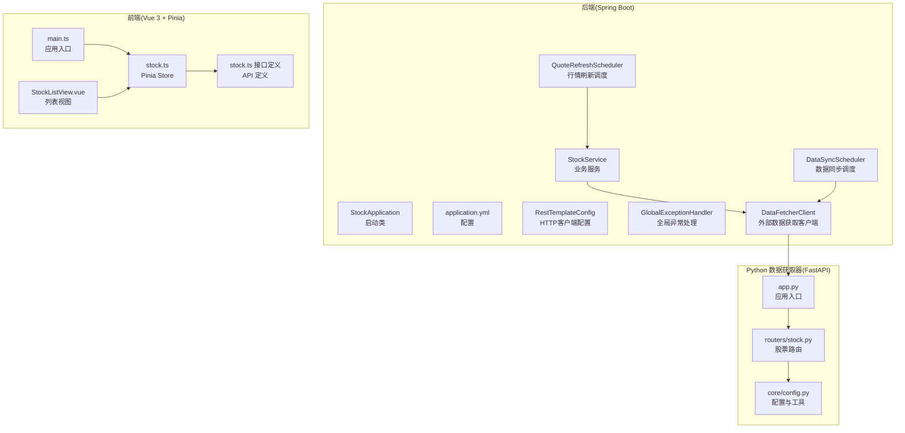
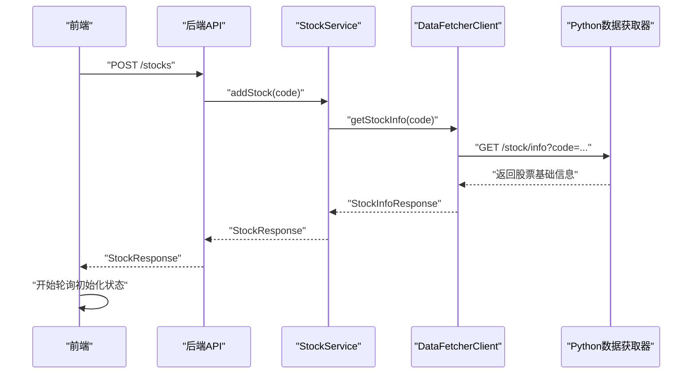
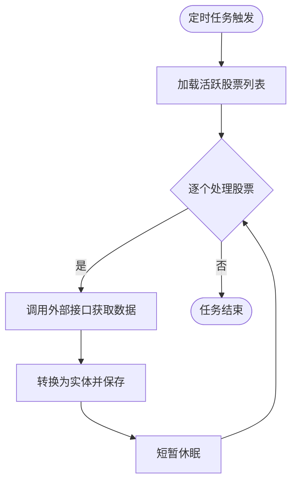
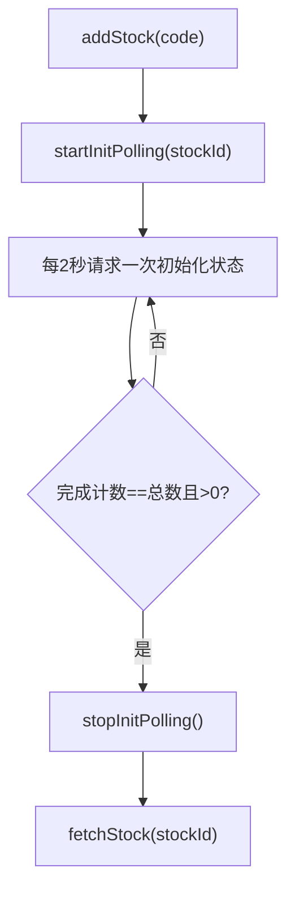
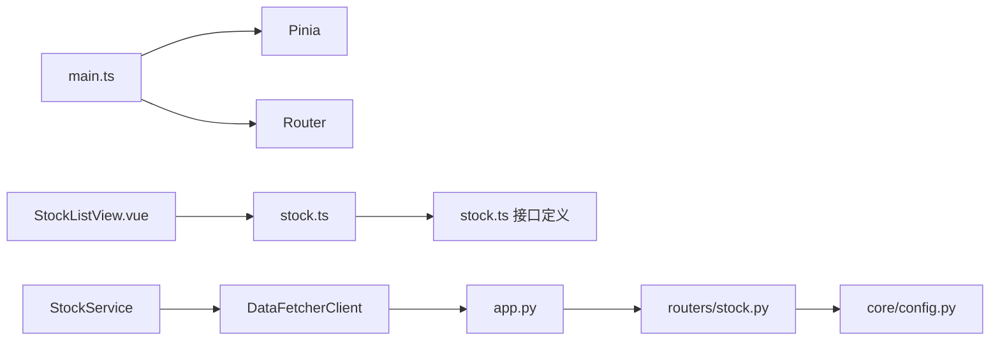

# 调试技巧

<cite>
**本文引用的文件**
- [backend/StockApplication.java](file://backend/src/main/java/com/stock/StockApplication.java)
- [backend/application.yml](file://backend/src/main/resources/application.yml)
- [backend/DataFetcherClient.java](file://backend/src/main/java/com/stock/client/DataFetcherClient.java)
- [backend/RestTemplateConfig.java](file://backend/src/main/java/com/stock/config/RestTemplateConfig.java)
- [backend/GlobalExceptionHandler.java](file://backend/src/main/java/com/stock/exception/GlobalExceptionHandler.java)
- [backend/QuoteRefreshScheduler.java](file://backend/src/main/java/com/stock/scheduler/QuoteRefreshScheduler.java)
- [backend/DataSyncScheduler.java](file://backend/src/main/java/com/stock/scheduler/DataSyncScheduler.java)
- [backend/StockService.java](file://backend/src/main/java/com/stock/service/StockService.java)
- [frontend/main.ts](file://frontend/src/main.ts)
- [frontend/stock.ts](file://frontend/src/stores/stock.ts)
- [frontend/stock.ts 接口定义](file://frontend/src/api/stock.ts)
- [frontend/StockListView.vue](file://frontend/src/views/StockListView.vue)
- [data-fetcher/app.py](file://data-fetcher/app.py)
- [data-fetcher/stock.py](file://data-fetcher/routers/stock.py)
- [data-fetcher/config.py](file://data-fetcher/core/config.py)
</cite>

## 目录
1. [简介](#简介)
2. [项目结构](#项目结构)
3. [核心组件](#核心组件)
4. [架构总览](#架构总览)
5. [详细组件调试指南](#详细组件调试指南)
6. [依赖关系分析](#依赖关系分析)
7. [性能与内存调试建议](#性能与内存调试建议)
8. [故障排查指南](#故障排查指南)
9. [结论](#结论)
10. [附录：常用工具与命令](#附录常用工具与命令)

## 简介
本文件面向后端、前端与 Python 数据获取器三端，提供系统化的调试方法论与实操步骤，覆盖 Spring Boot 应用调试、数据库查询调试、定时任务调试、异常追踪；Vue 组件调试、状态管理调试、API 调用调试、性能分析；以及 Python HTTP 请求调试、数据转换调试与错误处理调试。内容结合仓库现有实现，给出断点调试策略、日志分析技巧、常见问题诊断与性能瓶颈定位方法。

## 项目结构
- 后端采用 Spring Boot，启用调度与异步，配置 H2 控制台与数据源，定时任务按工作日与分钟级周期运行。
- 前端基于 Vue 3 + Pinia，通过统一 API 模块访问后端接口，并以轮询方式监控初始化进度。
- Python 数据获取器基于 FastAPI，提供多路由接口，内部封装了请求限速、重试与安全转换函数。

图表来源
- [backend/StockApplication.java:1-16](file://backend/src/main/java/com/stock/StockApplication.java#L1-L16)
- [backend/application.yml:1-28](file://backend/src/main/resources/application.yml#L1-L28)
- [backend/RestTemplateConfig.java:1-18](file://backend/src/main/java/com/stock/config/RestTemplateConfig.java#L1-L18)
- [backend/GlobalExceptionHandler.java:1-33](file://backend/src/main/java/com/stock/exception/GlobalExceptionHandler.java#L1-L33)
- [backend/QuoteRefreshScheduler.java:1-35](file://backend/src/main/java/com/stock/scheduler/QuoteRefreshScheduler.java#L1-L35)
- [backend/DataSyncScheduler.java:1-238](file://backend/src/main/java/com/stock/scheduler/DataSyncScheduler.java#L1-L238)
- [backend/StockService.java:1-243](file://backend/src/main/java/com/stock/service/StockService.java#L1-L243)
- [backend/DataFetcherClient.java:1-126](file://backend/src/main/java/com/stock/client/DataFetcherClient.java#L1-L126)
- [frontend/main.ts:1-11](file://frontend/src/main.ts#L1-L11)
- [frontend/stock.ts:1-80](file://frontend/src/stores/stock.ts#L1-L80)
- [frontend/stock.ts 接口定义:1-61](file://frontend/src/api/stock.ts#L1-L61)
- [frontend/StockListView.vue:1-102](file://frontend/src/views/StockListView.vue#L1-L102)
- [data-fetcher/app.py:1-31](file://data-fetcher/app.py#L1-L31)
- [data-fetcher/stock.py:1-246](file://data-fetcher/routers/stock.py#L1-L246)
- [data-fetcher/config.py:1-121](file://data-fetcher/core/config.py#L1-L121)

章节来源
- [backend/StockApplication.java:1-16](file://backend/src/main/java/com/stock/StockApplication.java#L1-L16)
- [backend/application.yml:1-28](file://backend/src/main/resources/application.yml#L1-L28)
- [frontend/main.ts:1-11](file://frontend/src/main.ts#L1-L11)
- [data-fetcher/app.py:1-31](file://data-fetcher/app.py#L1-L31)

## 核心组件
- 后端启动与配置
  - 启用调度与异步，暴露 H2 控制台，配置数据源与 JPA。
- HTTP 客户端与异常处理
  - RestTemplate 配置连接/读取超时；全局异常处理器映射业务异常为标准响应。
- 定时任务
  - 行情刷新与多类数据同步按工作日与分钟级周期执行，含事务与日志。
- 前端状态与 API
  - Pinia Store 管理列表、当前股票、初始化状态与加载态；轮询监控初始化完成。
- Python 数据获取器
  - FastAPI 提供股票基础信息、K线、分时、实时行情与批量行情接口；内置限速与安全转换。

章节来源
- [backend/StockApplication.java:1-16](file://backend/src/main/java/com/stock/StockApplication.java#L1-L16)
- [backend/application.yml:1-28](file://backend/src/main/resources/application.yml#L1-L28)
- [backend/RestTemplateConfig.java:1-18](file://backend/src/main/java/com/stock/config/RestTemplateConfig.java#L1-L18)
- [backend/GlobalExceptionHandler.java:1-33](file://backend/src/main/java/com/stock/exception/GlobalExceptionHandler.java#L1-L33)
- [backend/QuoteRefreshScheduler.java:1-35](file://backend/src/main/java/com/stock/scheduler/QuoteRefreshScheduler.java#L1-L35)
- [backend/DataSyncScheduler.java:1-238](file://backend/src/main/java/com/stock/scheduler/DataSyncScheduler.java#L1-L238)
- [frontend/stock.ts:1-80](file://frontend/src/stores/stock.ts#L1-L80)
- [frontend/stock.ts 接口定义:1-61](file://frontend/src/api/stock.ts#L1-L61)
- [data-fetcher/app.py:1-31](file://data-fetcher/app.py#L1-L31)
- [data-fetcher/stock.py:1-246](file://data-fetcher/routers/stock.py#L1-L246)
- [data-fetcher/config.py:1-121](file://data-fetcher/core/config.py#L1-L121)

## 架构总览
后端通过 DataFetcherClient 调用 Python 数据获取器提供的接口，定时任务驱动数据同步与指标计算；前端通过统一 API 访问后端，Pinia Store 管理状态与轮询逻辑。

图表来源
- [backend/StockService.java:93-163](file://backend/src/main/java/com/stock/service/StockService.java#L93-L163)
- [backend/DataFetcherClient.java:26-29](file://backend/src/main/java/com/stock/client/DataFetcherClient.java#L26-L29)
- [data-fetcher/stock.py:14-72](file://data-fetcher/routers/stock.py#L14-L72)
- [frontend/stock.ts:22-28](file://frontend/src/stores/stock.ts#L22-L28)

## 详细组件调试指南

### 后端调试：Spring Boot 应用调试
- 启动与端口
  - 端口在配置文件中设置；可使用 JVM 参数或 IDE 运行参数覆盖。
- 调度与异步
  - 确认调度注解已启用；可通过调整 cron 表达式验证任务触发频率。
- 日志与 H2 控制台
  - 使用 SLF4J 输出关键路径日志；通过 H2 控制台检查表结构与数据一致性。
- 断点策略
  - 在控制器层进入点设置断点，观察请求参数与响应结构。
  - 在服务层关键分支（如新增股票、初始化流程）设置断点，验证事务提交后的异步回调是否生效。
- 全局异常处理
  - 通过全局异常处理器统一返回错误码与消息，便于前端提示与日志定位。

章节来源
- [backend/StockApplication.java:8-15](file://backend/src/main/java/com/stock/StockApplication.java#L8-L15)
- [backend/application.yml:1-28](file://backend/src/main/resources/application.yml#L1-L28)
- [backend/GlobalExceptionHandler.java:7-32](file://backend/src/main/java/com/stock/exception/GlobalExceptionHandler.java#L7-L32)

### 数据库查询调试
- H2 控制台
  - 开启控制台后，直接执行 SQL 查询验证数据完整性与索引使用情况。
- JPA/Hibernate
  - 打开 SQL 格式化输出，观察生成的 SQL 与执行计划；关注批量插入与去重逻辑。
- 事务边界
  - 定时任务与业务方法均使用事务，断点应放在事务提交前后，确保异步线程可见性。

章节来源
- [backend/application.yml:4-17](file://backend/src/main/resources/application.yml#L4-L17)
- [backend/DataSyncScheduler.java:54-82](file://backend/src/main/java/com/stock/scheduler/DataSyncScheduler.java#L54-L82)
- [backend/StockService.java:93-163](file://backend/src/main/java/com/stock/service/StockService.java#L93-L163)

### 定时任务调试
- 触发时机验证
  - 修改 cron 表达式为更短周期或固定时间，快速验证任务执行。
- 日志与异常
  - 关注任务执行前后的日志；捕获异常并记录堆栈，避免静默失败。
- 并发与限流
  - 定时任务内对每只股票循环处理并加入休眠，避免对外部接口造成压力。

图表来源
- [backend/DataSyncScheduler.java:54-82](file://backend/src/main/java/com/stock/scheduler/DataSyncScheduler.java#L54-L82)
- [backend/QuoteRefreshScheduler.java:24-33](file://backend/src/main/java/com/stock/scheduler/QuoteRefreshScheduler.java#L24-L33)

章节来源
- [backend/QuoteRefreshScheduler.java:1-35](file://backend/src/main/java/com/stock/scheduler/QuoteRefreshScheduler.java#L1-L35)
- [backend/DataSyncScheduler.java:1-238](file://backend/src/main/java/com/stock/scheduler/DataSyncScheduler.java#L1-L238)

### 异常追踪
- 全局异常映射
  - 将业务异常映射为明确的 HTTP 状态码与消息体，便于前端统一处理。
- 自定义异常
  - 对外部数据获取失败进行包装，保留原始错误上下文。
- 日志级别
  - 使用 info/warn/error 区分正常、警告与异常场景，便于生产环境检索。

章节来源
- [backend/GlobalExceptionHandler.java:9-31](file://backend/src/main/java/com/stock/exception/GlobalExceptionHandler.java#L9-L31)
- [backend/DataFetcherClient.java:112-124](file://backend/src/main/java/com/stock/client/DataFetcherClient.java#L112-L124)

### 前端调试：Vue 组件调试
- 组件渲染与交互
  - 在组件挂载时触发数据拉取；使用浏览器开发者工具检查 DOM 结构与事件绑定。
- 断点与状态
  - 在模板中使用条件渲染与样式类切换，断点验证数据到达与 UI 更新。
- 列表视图示例
  - 输入框回车添加、删除确认、格式化显示等逻辑均可在组件中设置断点验证。

章节来源
- [frontend/StockListView.vue:50-102](file://frontend/src/views/StockListView.vue#L50-L102)

### 前端调试：状态管理调试（Pinia）
- Store 结构
  - 使用 ref 管理响应式状态，包括列表、当前股票、初始化状态与加载态。
- 轮询逻辑
  - 添加成功后启动轮询，轮询到完成即停止并刷新当前股票详情。
- 断点策略
  - 在轮询回调中断点，观察响应数据与完成条件判断。

图表来源
- [frontend/stock.ts:22-28](file://frontend/src/stores/stock.ts#L22-L28)
- [frontend/stock.ts:43-58](file://frontend/src/stores/stock.ts#L43-L58)

章节来源
- [frontend/stock.ts:1-80](file://frontend/src/stores/stock.ts#L1-L80)

### 前端调试：API 调用调试
- 统一 API 模块
  - 通过接口定义模块集中管理请求路径与类型，便于断点与抓包。
- 错误处理
  - 在组件中捕获错误并弹窗提示，结合后端错误响应体定位问题。

章节来源
- [frontend/stock.ts 接口定义:53-60](file://frontend/src/api/stock.ts#L53-L60)
- [frontend/StockListView.vue:64-75](file://frontend/src/views/StockListView.vue#L64-L75)

### 前端性能分析
- 工具链
  - 使用浏览器性能面板分析渲染耗时、重排重绘与网络请求瀑布。
- 列表优化
  - 对长列表使用虚拟滚动与懒加载；减少不必要的响应式对象与深层嵌套。

[本节为通用指导，无需特定文件来源]

### Python 数据获取器调试：HTTP 请求调试
- CORS 与健康检查
  - 启用 CORS 并提供健康检查端点，便于联调与探活。
- 速率限制与重试
  - 内置最小请求间隔与指数退避重试，避免被目标站点限流。
- 错误处理
  - 对连接异常与超时进行分类处理与重试，保证稳定性。

章节来源
- [data-fetcher/app.py:7-25](file://data-fetcher/app.py#L7-L25)
- [data-fetcher/config.py:20-100](file://data-fetcher/core/config.py#L20-L100)

### Python 数据获取器调试：数据转换调试
- 安全转换
  - 提供除以 100、浮点与整型的安全转换函数，避免脏数据导致解析失败。
- 字段映射
  - 映射不同接口字段到统一结构，断点验证关键字段是否存在与类型正确。

章节来源
- [data-fetcher/config.py:41-78](file://data-fetcher/core/config.py#L41-L78)
- [data-fetcher/stock.py:54-72](file://data-fetcher/routers/stock.py#L54-L72)

### Python 数据获取器调试：错误处理调试
- 异常上抛
  - 当外部接口返回空数据或异常时，抛出 HTTP 异常并携带详细信息。
- 日志与告警
  - 在关键路径打印请求参数与响应摘要，便于定位上游数据问题。

章节来源
- [data-fetcher/stock.py:25-31](file://data-fetcher/routers/stock.py#L25-L31)
- [data-fetcher/stock.py:102-105](file://data-fetcher/routers/stock.py#L102-L105)

## 依赖关系分析
- 后端依赖
  - 启动类启用调度与异步；RestTemplate 配置超时；全局异常处理器统一处理业务异常。
- 前端依赖
  - 应用入口注册 Pinia 与路由；Store 依赖 API 定义；视图组件依赖 Store。
- Python 依赖
  - 应用入口注册各路由模块；路由依赖配置模块中的工具函数。

图表来源
- [frontend/main.ts:1-11](file://frontend/src/main.ts#L1-L11)
- [frontend/stock.ts:1-80](file://frontend/src/stores/stock.ts#L1-L80)
- [frontend/stock.ts 接口定义:53-60](file://frontend/src/api/stock.ts#L53-L60)
- [frontend/StockListView.vue:50-102](file://frontend/src/views/StockListView.vue#L50-L102)
- [backend/StockService.java:93-163](file://backend/src/main/java/com/stock/service/StockService.java#L93-L163)
- [backend/DataFetcherClient.java:26-29](file://backend/src/main/java/com/stock/client/DataFetcherClient.java#L26-L29)
- [data-fetcher/app.py:14-20](file://data-fetcher/app.py#L14-L20)
- [data-fetcher/stock.py:14-72](file://data-fetcher/routers/stock.py#L14-L72)
- [data-fetcher/config.py:80-121](file://data-fetcher/core/config.py#L80-L121)

章节来源
- [backend/StockApplication.java:8-15](file://backend/src/main/java/com/stock/StockApplication.java#L8-L15)
- [backend/RestTemplateConfig.java:10-16](file://backend/src/main/java/com/stock/config/RestTemplateConfig.java#L10-L16)
- [backend/GlobalExceptionHandler.java:7-32](file://backend/src/main/java/com/stock/exception/GlobalExceptionHandler.java#L7-L32)
- [frontend/main.ts:1-11](file://frontend/src/main.ts#L1-L11)
- [data-fetcher/app.py:1-31](file://data-fetcher/app.py#L1-L31)

## 性能与内存调试建议
- 后端
  - 启用慢查询日志与 SQL 格式化；对批量写入使用批处理与事务合并；监控线程池与异步任务队列长度。
- 前端
  - 使用性能面板分析首屏与交互延迟；对长列表使用虚拟滚动；避免频繁创建大型对象。
- Python
  - 控制并发与请求间隔，避免被限流；对大响应进行分页或增量拉取；使用连接池与超时控制。

[本节为通用指导，无需特定文件来源]

## 故障排查指南
- 后端
  - 若新增股票后初始化未完成：检查事务提交后的异步回调是否触发；查看日志中“afterCommit fired”与初始化服务调用。
  - 外部数据获取失败：检查 DataFetcherClient 的异常包装与全局异常映射；核对配置中的数据获取器地址与超时。
- 前端
  - 添加失败：查看组件中错误弹窗与后端返回的消息体；确认轮询是否启动与停止。
  - 列表不更新：检查 Store 中的 fetchStocks 是否被调用；确认响应数据结构与 ref 更新。
- Python
  - 接口返回空数据：检查字段映射与安全转换函数；确认目标站点字段变更；必要时增加降级策略。

章节来源
- [backend/StockService.java:145-160](file://backend/src/main/java/com/stock/service/StockService.java#L145-L160)
- [backend/GlobalExceptionHandler.java:21-24](file://backend/src/main/java/com/stock/exception/GlobalExceptionHandler.java#L21-L24)
- [frontend/StockListView.vue:64-75](file://frontend/src/views/StockListView.vue#L64-L75)
- [data-fetcher/stock.py:30-31](file://data-fetcher/routers/stock.py#L30-L31)

## 结论
通过结合日志、断点、轮询与统一异常处理，可以系统性地定位后端、前端与 Python 数据获取器的问题。建议在开发与测试阶段开启详细日志与 H2 控制台，在生产环境保持合理的日志级别与可观测性指标，配合定时任务与异步机制提升整体稳定性与性能。

[本节为总结，无需特定文件来源]

## 附录：常用工具与命令
- 后端
  - H2 控制台：访问 /h2-console 查看数据库。
  - JVM 参数：用于本地覆盖端口与日志级别。
- 前端
  - 浏览器开发者工具：Elements/Console/Network/Performance 面板。
  - Vue DevTools：检查组件树与 Pinia 状态。
- Python
  - uvicorn 启动：在 app.py 中以主机与端口运行服务。
  - curl/HTTP 客户端：验证路由可用性与响应结构。

章节来源
- [backend/application.yml:14-17](file://backend/src/main/resources/application.yml#L14-L17)
- [data-fetcher/app.py:28-31](file://data-fetcher/app.py#L28-L31)