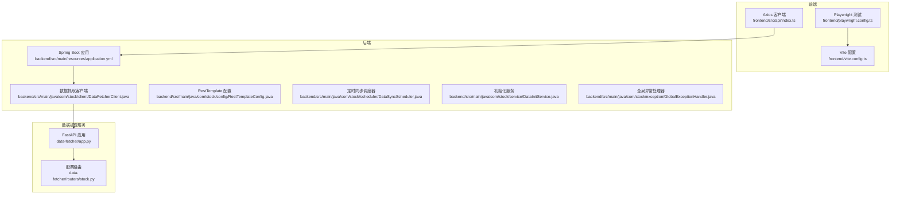
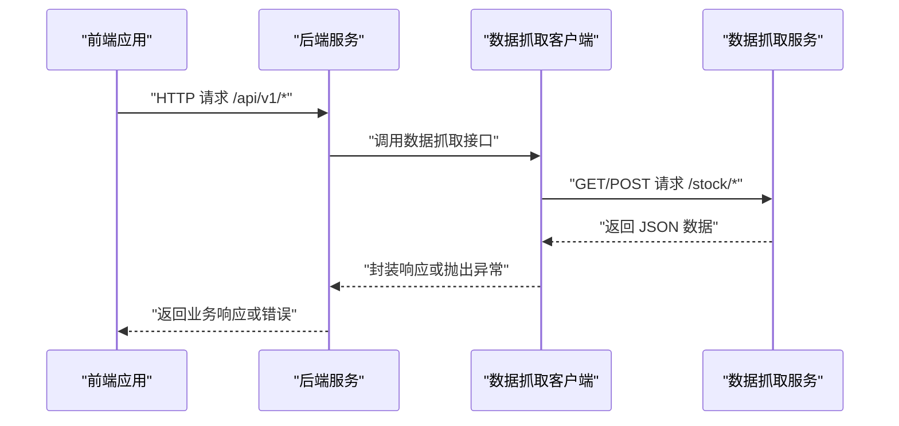
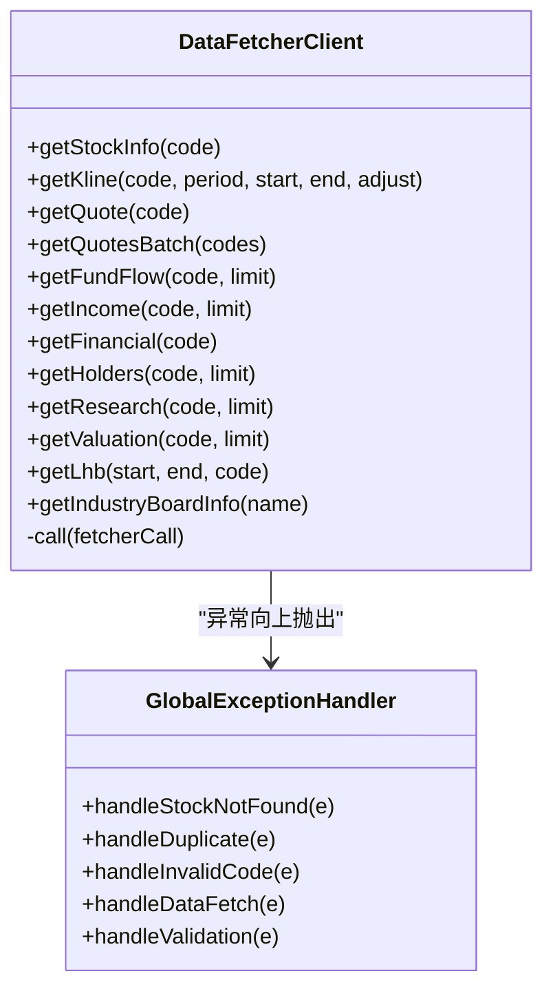
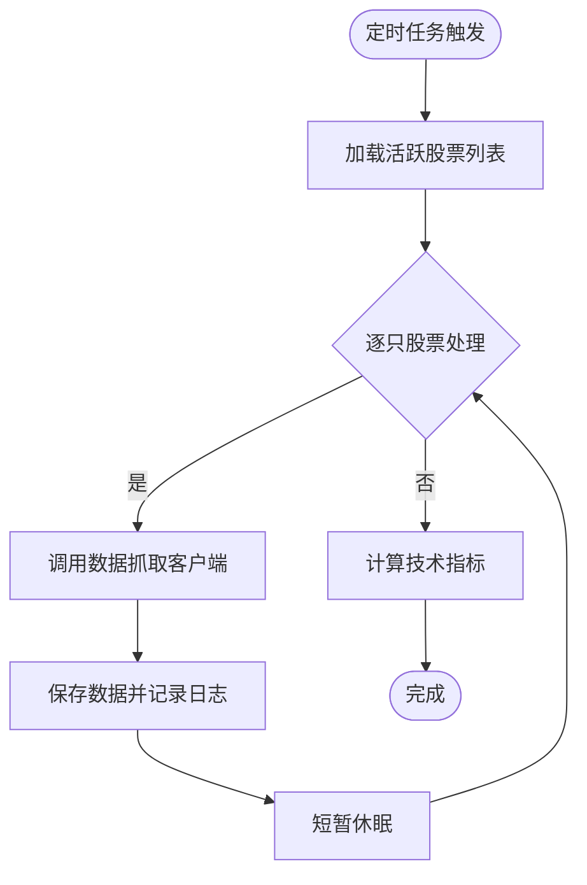
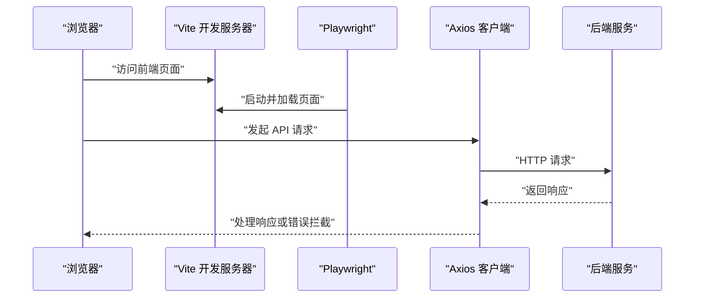
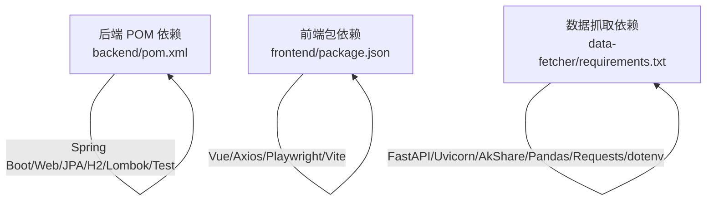

# 通用调试模式

<cite>
**本文引用的文件**
- [backend/src/main/resources/application.yml](file://backend/src/main/resources/application.yml)
- [backend/src/main/java/com/stock/client/DataFetcherClient.java](file://backend/src/main/java/com/stock/client/DataFetcherClient.java)
- [backend/src/main/java/com/stock/config/RestTemplateConfig.java](file://backend/src/main/java/com/stock/config/RestTemplateConfig.java)
- [backend/src/main/java/com/stock/scheduler/DataSyncScheduler.java](file://backend/src/main/java/com/stock/scheduler/DataSyncScheduler.java)
- [backend/src/main/java/com/stock/service/DataInitService.java](file://backend/src/main/java/com/stock/service/DataInitService.java)
- [backend/src/main/java/com/stock/exception/GlobalExceptionHandler.java](file://backend/src/main/java/com/stock/exception/GlobalExceptionHandler.java)
- [backend/src/test/java/com/stock/controller/StockControllerTest.java](file://backend/src/test/java/com/stock/controller/StockControllerTest.java)
- [data-fetcher/app.py](file://data-fetcher/app.py)
- [data-fetcher/routers/stock.py](file://data-fetcher/routers/stock.py)
- [frontend/src/api/index.ts](file://frontend/src/api/index.ts)
- [frontend/playwright.config.ts](file://frontend/playwright.config.ts)
- [frontend/package.json](file://frontend/package.json)
- [data-fetcher/requirements.txt](file://data-fetcher/requirements.txt)
- [backend/pom.xml](file://backend/pom.xml)
- [frontend/vite.config.ts](file://frontend/vite.config.ts)
</cite>

## 目录
1. [引言](#引言)
2. [项目结构](#项目结构)
3. [核心组件](#核心组件)
4. [架构总览](#架构总览)
5. [详细组件分析](#详细组件分析)
6. [依赖分析](#依赖分析)
7. [性能考虑](#性能考虑)
8. [故障排查指南](#故障排查指南)
9. [结论](#结论)
10. [附录](#附录)

## 引言
本文件面向“通用调试模式”，围绕该股票交易系统在前后端联调、API 接口调试、数据流转验证、常见问题诊断、性能调试与优化等方面，提供可操作的调试流程、工具与最佳实践。文档以仓库中实际代码为依据，结合日志记录、异常处理、定时任务、HTTP 客户端与前端请求拦截器等机制，帮助开发者快速定位问题并稳定交付。

## 项目结构
系统采用多模块结构：后端 Spring Boot 应用负责业务逻辑与数据同步；数据抓取服务基于 FastAPI 提供 REST 接口；前端 Vue 应用通过 Axios 发起请求并与 Playwright 进行端到端测试。

图表来源
- [backend/src/main/resources/application.yml:1-28](file://backend/src/main/resources/application.yml#L1-L28)
- [backend/src/main/java/com/stock/client/DataFetcherClient.java:1-126](file://backend/src/main/java/com/stock/client/DataFetcherClient.java#L1-L126)
- [backend/src/main/java/com/stock/config/RestTemplateConfig.java:1-18](file://backend/src/main/java/com/stock/config/RestTemplateConfig.java#L1-L18)
- [backend/src/main/java/com/stock/scheduler/DataSyncScheduler.java:1-238](file://backend/src/main/java/com/stock/scheduler/DataSyncScheduler.java#L1-L238)
- [backend/src/main/java/com/stock/service/DataInitService.java:1-101](file://backend/src/main/java/com/stock/service/DataInitService.java#L1-L101)
- [backend/src/main/java/com/stock/exception/GlobalExceptionHandler.java:1-33](file://backend/src/main/java/com/stock/exception/GlobalExceptionHandler.java#L1-L33)
- [data-fetcher/app.py:1-31](file://data-fetcher/app.py#L1-L31)
- [data-fetcher/routers/stock.py:1-246](file://data-fetcher/routers/stock.py#L1-L246)
- [frontend/src/api/index.ts:1-18](file://frontend/src/api/index.ts#L1-L18)
- [frontend/playwright.config.ts:1-25](file://frontend/playwright.config.ts#L1-L25)
- [frontend/vite.config.ts:1-8](file://frontend/vite.config.ts#L1-L8)

章节来源
- [backend/src/main/resources/application.yml:1-28](file://backend/src/main/resources/application.yml#L1-L28)
- [data-fetcher/app.py:1-31](file://data-fetcher/app.py#L1-L31)
- [frontend/src/api/index.ts:1-18](file://frontend/src/api/index.ts#L1-L18)

## 核心组件
- 数据抓取客户端：封装对数据抓取服务的 HTTP 调用，统一异常包装与空响应校验。
- RestTemplate 配置：设置连接与读取超时，避免阻塞影响业务。
- 全局异常处理器：集中处理业务与参数校验异常，返回标准化错误响应。
- 定时同步调度器：按计划拉取行情、资金流、财务等数据，并计算技术指标。
- 初始化服务：异步执行初始化步骤，记录每步状态，便于调试与重试。
- 前端 Axios 客户端：统一基础地址与超时，拦截响应错误并输出日志。
- 数据抓取服务 FastAPI：提供健康检查与多路由接口，支持批量报价等。

章节来源
- [backend/src/main/java/com/stock/client/DataFetcherClient.java:1-126](file://backend/src/main/java/com/stock/client/DataFetcherClient.java#L1-L126)
- [backend/src/main/java/com/stock/config/RestTemplateConfig.java:1-18](file://backend/src/main/java/com/stock/config/RestTemplateConfig.java#L1-L18)
- [backend/src/main/java/com/stock/exception/GlobalExceptionHandler.java:1-33](file://backend/src/main/java/com/stock/exception/GlobalExceptionHandler.java#L1-L33)
- [backend/src/main/java/com/stock/scheduler/DataSyncScheduler.java:1-238](file://backend/src/main/java/com/stock/scheduler/DataSyncScheduler.java#L1-L238)
- [backend/src/main/java/com/stock/service/DataInitService.java:1-101](file://backend/src/main/java/com/stock/service/DataInitService.java#L1-L101)
- [frontend/src/api/index.ts:1-18](file://frontend/src/api/index.ts#L1-L18)
- [data-fetcher/app.py:1-31](file://data-fetcher/app.py#L1-L31)

## 架构总览
系统采用“前端 → 后端 → 数据抓取服务”的三层链路。后端通过 RestTemplate 访问数据抓取服务，定时任务驱动数据同步与指标计算；前端通过 Axios 请求后端 API 并进行端到端测试。

图表来源
- [frontend/src/api/index.ts:1-18](file://frontend/src/api/index.ts#L1-L18)
- [backend/src/main/java/com/stock/client/DataFetcherClient.java:1-126](file://backend/src/main/java/com/stock/client/DataFetcherClient.java#L1-L126)
- [data-fetcher/routers/stock.py:1-246](file://data-fetcher/routers/stock.py#L1-L246)

## 详细组件分析

### 组件一：数据抓取客户端与异常处理
- 关键点
  - 对外暴露多个数据抓取方法，内部统一封装调用与异常转换。
  - 当远端返回空值时抛出自定义异常，便于上层捕获与降级。
  - 全局异常处理器将业务异常映射为标准 HTTP 状态码与错误体。
- 调试要点
  - 检查远端服务可达性与返回格式一致性。
  - 观察客户端日志与异常栈，确认是网络超时还是数据为空。
  - 在全局异常处理器处断点或增加日志，验证错误映射是否符合预期。

图表来源
- [backend/src/main/java/com/stock/client/DataFetcherClient.java:1-126](file://backend/src/main/java/com/stock/client/DataFetcherClient.java#L1-L126)
- [backend/src/main/java/com/stock/exception/GlobalExceptionHandler.java:1-33](file://backend/src/main/java/com/stock/exception/GlobalExceptionHandler.java#L1-L33)

章节来源
- [backend/src/main/java/com/stock/client/DataFetcherClient.java:1-126](file://backend/src/main/java/com/stock/client/DataFetcherClient.java#L1-L126)
- [backend/src/main/java/com/stock/exception/GlobalExceptionHandler.java:1-33](file://backend/src/main/java/com/stock/exception/GlobalExceptionHandler.java#L1-L33)

### 组件二：定时同步与初始化流程
- 关键点
  - 定时任务按工作日与时间窗口拉取数据，逐只股票处理并记录日志。
  - 初始化服务异步执行多步骤，每步更新状态表，便于可视化与重试。
- 调试要点
  - 使用日志观察任务开始/结束与单只股票处理耗时。
  - 若某步失败，查看状态表与对应日志，定位具体异常原因。
  - 可临时缩短任务周期或禁用事务以加速复现。

图表来源
- [backend/src/main/java/com/stock/scheduler/DataSyncScheduler.java:1-238](file://backend/src/main/java/com/stock/scheduler/DataSyncScheduler.java#L1-L238)
- [backend/src/main/java/com/stock/service/DataInitService.java:1-101](file://backend/src/main/java/com/stock/service/DataInitService.java#L1-L101)

章节来源
- [backend/src/main/java/com/stock/scheduler/DataSyncScheduler.java:1-238](file://backend/src/main/java/com/stock/scheduler/DataSyncScheduler.java#L1-L238)
- [backend/src/main/java/com/stock/service/DataInitService.java:1-101](file://backend/src/main/java/com/stock/service/DataInitService.java#L1-L101)

### 组件三：前端 API 客户端与端到端测试
- 关键点
  - Axios 客户端统一基础地址与超时，响应拦截器打印错误信息。
  - Playwright 配置了测试目录、超时、浏览器与本地开发服务器。
- 调试要点
  - 打开浏览器开发者工具，观察请求/响应与网络耗时。
  - 在响应拦截器中增加更详细的错误上下文（如请求路径、状态码）。
  - 使用 Playwright 的截图功能在失败时定位界面问题。

图表来源
- [frontend/src/api/index.ts:1-18](file://frontend/src/api/index.ts#L1-L18)
- [frontend/playwright.config.ts:1-25](file://frontend/playwright.config.ts#L1-L25)
- [frontend/vite.config.ts:1-8](file://frontend/vite.config.ts#L1-L8)

章节来源
- [frontend/src/api/index.ts:1-18](file://frontend/src/api/index.ts#L1-L18)
- [frontend/playwright.config.ts:1-25](file://frontend/playwright.config.ts#L1-L25)
- [frontend/vite.config.ts:1-8](file://frontend/vite.config.ts#L1-L8)

### 组件四：数据抓取服务路由与健康检查
- 关键点
  - 提供健康检查端点与多条股票相关路由，统一异常处理返回 503/404。
  - 批量报价接口限制最大数量并跳过失败项，保证整体可用性。
- 调试要点
  - 先调用健康检查端点确认服务可用。
  - 针对单个路由构造最小化请求参数，逐步缩小问题范围。
  - 观察异常映射是否正确返回期望的状态码与消息。

章节来源
- [data-fetcher/app.py:1-31](file://data-fetcher/app.py#L1-L31)
- [data-fetcher/routers/stock.py:1-246](file://data-fetcher/routers/stock.py#L1-L246)

## 依赖分析
- 后端依赖
  - Spring Web、JPA、H2 控制台、Lombok、HTML 清洗库、测试框架。
  - Maven Surefire 插件启用 ByteBuddy agent 以支持 Mockito。
- 前端依赖
  - Vue、Vue Router、Pinia、Axios、Playwright 测试框架。
- 数据抓取服务依赖
  - FastAPI、Uvicorn、AkShare、Pandas、Requests、dotenv。

图表来源
- [backend/pom.xml:1-103](file://backend/pom.xml#L1-L103)
- [frontend/package.json:1-27](file://frontend/package.json#L1-L27)
- [data-fetcher/requirements.txt:1-7](file://data-fetcher/requirements.txt#L1-L7)

章节来源
- [backend/pom.xml:1-103](file://backend/pom.xml#L1-L103)
- [frontend/package.json:1-27](file://frontend/package.json#L1-L27)
- [data-fetcher/requirements.txt:1-7](file://data-fetcher/requirements.txt#L1-L7)

## 性能考虑
- 网络与超时
  - RestTemplate 已设置连接与读取超时，避免长时间阻塞。
  - 建议在生产环境根据外部接口稳定性调整超时阈值。
- 日志与可观测性
  - 定时任务与初始化流程均使用日志记录关键节点，便于性能瓶颈定位。
  - 可引入采样日志或结构化日志，减少高并发下的日志风暴。
- 资源使用
  - 数据抓取服务与后端均使用内存数据库与轻量级框架，适合开发与测试。
  - 生产部署建议分离数据库与缓存，配合限流与熔断策略。

章节来源
- [backend/src/main/java/com/stock/config/RestTemplateConfig.java:1-18](file://backend/src/main/java/com/stock/config/RestTemplateConfig.java#L1-L18)
- [backend/src/main/java/com/stock/scheduler/DataSyncScheduler.java:1-238](file://backend/src/main/java/com/stock/scheduler/DataSyncScheduler.java#L1-L238)
- [backend/src/main/java/com/stock/service/DataInitService.java:1-101](file://backend/src/main/java/com/stock/service/DataInitService.java#L1-L101)

## 故障排查指南

### 启动失败排查
- 检查端口占用
  - 后端默认端口与 H2 控制台路径在配置文件中定义，若冲突需修改。
- 依赖安装
  - 后端使用 Maven 构建，确保本地 Java 版本满足要求。
  - 前端与数据抓取服务分别使用 npm 与 pip 安装依赖。
- 健康检查
  - 数据抓取服务提供健康检查端点，先验证其可用性。

章节来源
- [backend/src/main/resources/application.yml:1-28](file://backend/src/main/resources/application.yml#L1-L28)
- [backend/pom.xml:1-103](file://backend/pom.xml#L1-L103)
- [frontend/package.json:1-27](file://frontend/package.json#L1-L27)
- [data-fetcher/requirements.txt:1-7](file://data-fetcher/requirements.txt#L1-L7)
- [data-fetcher/app.py:23-25](file://data-fetcher/app.py#L23-L25)

### 依赖冲突与版本问题
- 后端构建插件与测试框架版本需保持兼容，确保测试可运行。
- 前端与数据抓取服务各自维护独立依赖，避免跨模块污染。

章节来源
- [backend/pom.xml:58-101](file://backend/pom.xml#L58-L101)
- [frontend/package.json:1-27](file://frontend/package.json#L1-L27)
- [data-fetcher/requirements.txt:1-7](file://data-fetcher/requirements.txt#L1-L7)

### 配置错误定位
- 关键配置项
  - 后端数据抓取服务地址、定时任务 Cron 表达式、数据库连接与 H2 控制台路径。
  - 前端 Axios 基础地址与超时、Playwright 测试基地址与超时。
- 排查步骤
  - 逐项核对配置文件中的键值，确保与实际环境一致。
  - 修改后重启对应服务，观察日志输出确认生效。

章节来源
- [backend/src/main/resources/application.yml:1-28](file://backend/src/main/resources/application.yml#L1-L28)
- [frontend/src/api/index.ts:1-18](file://frontend/src/api/index.ts#L1-L18)
- [frontend/playwright.config.ts:1-25](file://frontend/playwright.config.ts#L1-L25)

### API 接口调试流程
- 步骤
  - 使用健康检查确认服务可用。
  - 通过最小参数调用目标路由，观察返回结构与状态码。
  - 若出现异常，检查全局异常处理器映射与客户端包装逻辑。
  - 结合日志与断点定位具体异常点。

章节来源
- [data-fetcher/app.py:23-25](file://data-fetcher/app.py#L23-L25)
- [data-fetcher/routers/stock.py:14-72](file://data-fetcher/routers/stock.py#L14-L72)
- [backend/src/main/java/com/stock/exception/GlobalExceptionHandler.java:1-33](file://backend/src/main/java/com/stock/exception/GlobalExceptionHandler.java#L1-L33)
- [backend/src/main/java/com/stock/client/DataFetcherClient.java:112-124](file://backend/src/main/java/com/stock/client/DataFetcherClient.java#L112-L124)

### 前后端联调流程
- 步骤
  - 前端通过 Axios 请求后端 API，响应拦截器打印错误。
  - 后端调用数据抓取客户端，客户端统一异常包装。
  - 全局异常处理器将异常映射为标准响应。
  - 使用 Playwright 进行端到端验证，失败时保留截图。

章节来源
- [frontend/src/api/index.ts:1-18](file://frontend/src/api/index.ts#L1-L18)
- [backend/src/main/java/com/stock/client/DataFetcherClient.java:1-126](file://backend/src/main/java/com/stock/client/DataFetcherClient.java#L1-L126)
- [backend/src/main/java/com/stock/exception/GlobalExceptionHandler.java:1-33](file://backend/src/main/java/com/stock/exception/GlobalExceptionHandler.java#L1-L33)
- [frontend/playwright.config.ts:1-25](file://frontend/playwright.config.ts#L1-L25)

### 数据流转验证清单
- 后端定时任务
  - 观察日志中“开始/完成”与单只股票处理耗时。
  - 校验数据库中新增记录数量与字段完整性。
- 初始化服务
  - 查看状态表中各步骤状态，定位失败步骤。
- 前端展示
  - 使用 Playwright 断言关键元素与数据渲染。

章节来源
- [backend/src/main/java/com/stock/scheduler/DataSyncScheduler.java:54-82](file://backend/src/main/java/com/stock/scheduler/DataSyncScheduler.java#L54-L82)
- [backend/src/main/java/com/stock/service/DataInitService.java:42-71](file://backend/src/main/java/com/stock/service/DataInitService.java#L42-L71)
- [frontend/playwright.config.ts:12-17](file://frontend/playwright.config.ts#L12-L17)

### 常见问题与修复建议
- 数据抓取客户端返回空值
  - 检查远端接口是否返回空数据集，必要时增加重试或降级策略。
- 定时任务执行缓慢
  - 分析日志中单只股票处理耗时，考虑并发或分片策略。
- 前端请求超时
  - 调整 Axios 超时与重试次数，同时检查后端与数据抓取服务延迟。
- 全局异常未按预期返回
  - 在异常处理器中增加日志，确认异常类型匹配分支。

章节来源
- [backend/src/main/java/com/stock/client/DataFetcherClient.java:112-124](file://backend/src/main/java/com/stock/client/DataFetcherClient.java#L112-L124)
- [backend/src/main/java/com/stock/scheduler/DataSyncScheduler.java:56-82](file://backend/src/main/java/com/stock/scheduler/DataSyncScheduler.java#L56-L82)
- [frontend/src/api/index.ts:3-6](file://frontend/src/api/index.ts#L3-L6)
- [backend/src/main/java/com/stock/exception/GlobalExceptionHandler.java:1-33](file://backend/src/main/java/com/stock/exception/GlobalExceptionHandler.java#L1-L33)

## 结论
通过统一的日志策略、标准化的异常处理、清晰的定时任务与初始化流程、以及前后端联动的调试工具链，可以高效地定位与解决系统问题。建议在开发与测试环境中持续完善日志与监控，形成可追溯的调试闭环。

## 附录

### 调试工具推荐
- 统一日志管理
  - 后端使用 SLF4J 与 Spring Boot 日志配置，建议接入集中式日志系统。
- 跨平台调试
  - 前端使用浏览器开发者工具与 Playwright；后端使用 IDE 断点与日志。
- 自动化测试
  - 前端使用 Playwright；后端使用 JUnit 与 MockMvc。

章节来源
- [backend/src/main/java/com/stock/scheduler/DataSyncScheduler.java:1-238](file://backend/src/main/java/com/stock/scheduler/DataSyncScheduler.java#L1-L238)
- [backend/src/test/java/com/stock/controller/StockControllerTest.java:1-116](file://backend/src/test/java/com/stock/controller/StockControllerTest.java#L1-L116)
- [frontend/playwright.config.ts:1-25](file://frontend/playwright.config.ts#L1-L25)

### 调试效率提升技巧
- 调试环境搭建
  - 使用配置文件中的默认端口与路径，减少手工配置。
- 调试脚本
  - 编写最小化请求脚本与健康检查脚本，快速验证链路。
- 调试知识库
  - 将常见问题与解决方案沉淀为知识库条目，便于复用。

章节来源
- [backend/src/main/resources/application.yml:1-28](file://backend/src/main/resources/application.yml#L1-L28)
- [data-fetcher/app.py:23-25](file://data-fetcher/app.py#L23-L25)