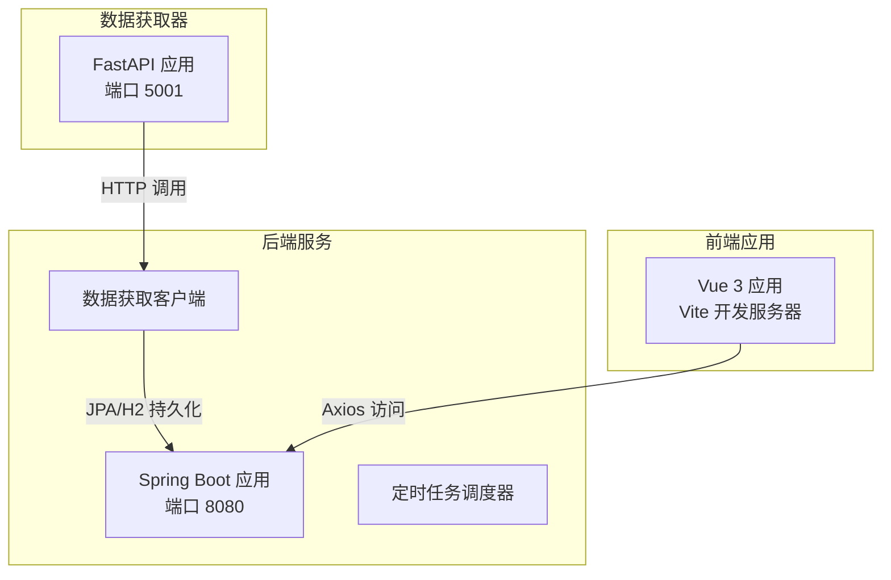
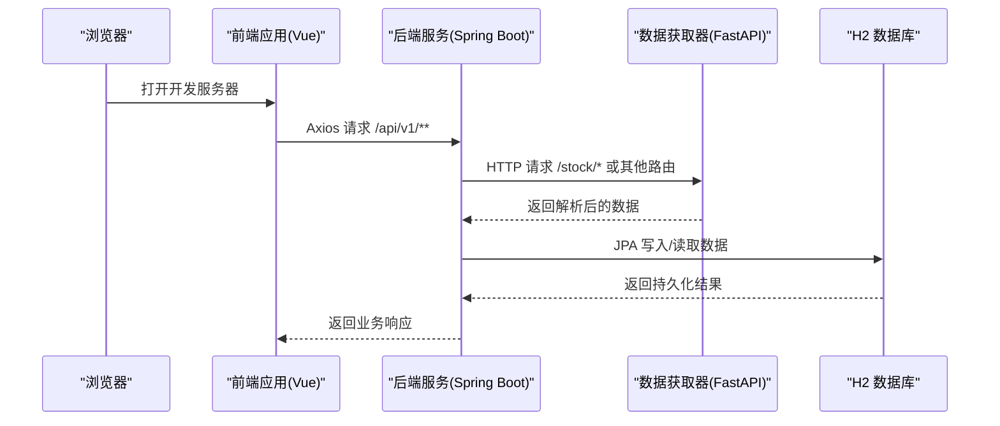
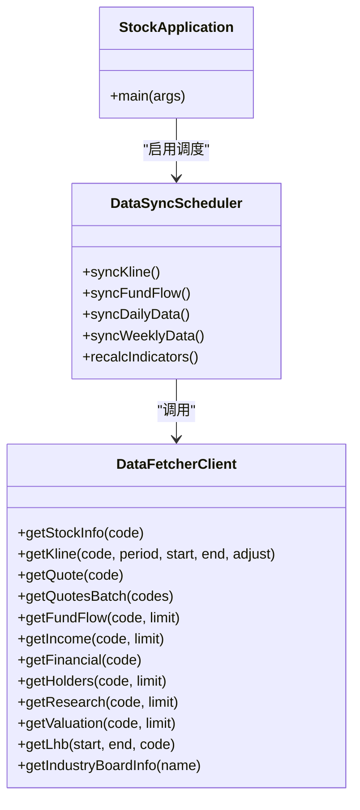
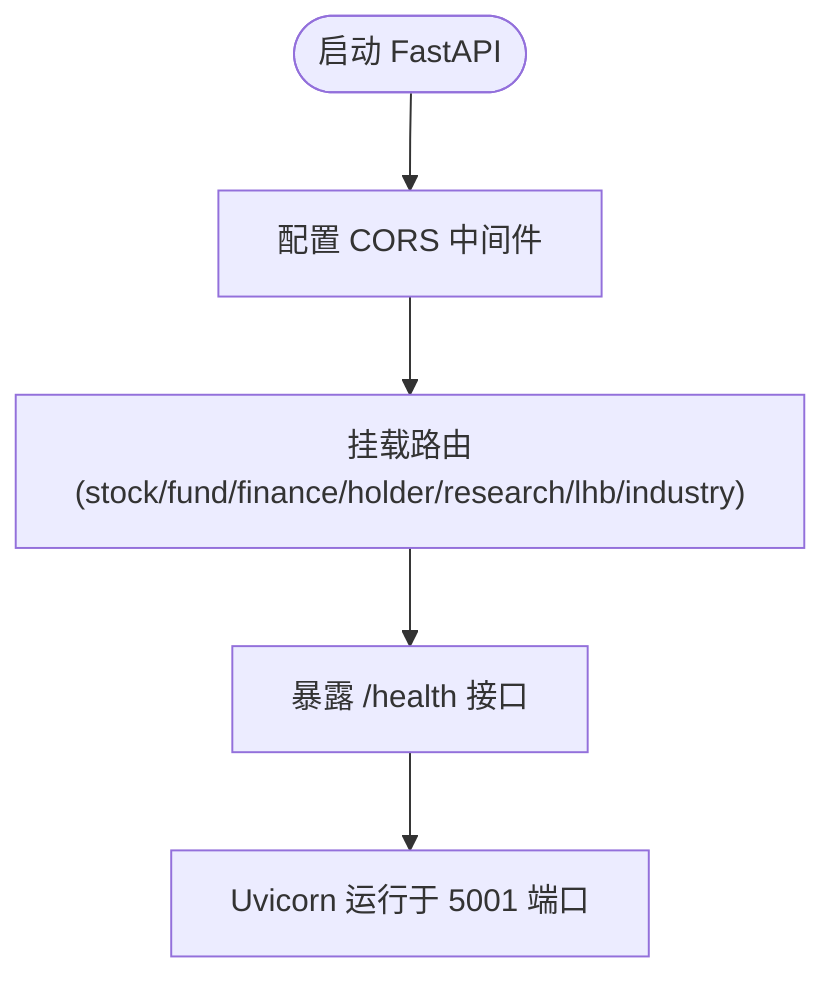
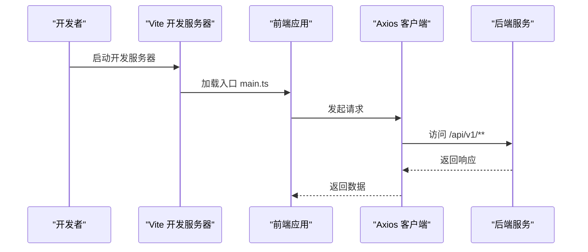

# 快速开始

<cite>
**本文引用的文件**
- [pom.xml](file://backend/pom.xml)
- [application.yml](file://backend/src/main/resources/application.yml)
- [StockApplication.java](file://backend/src/main/java/com/stock/StockApplication.java)
- [DataFetcherClient.java](file://backend/src/main/java/com/stock/client/DataFetcherClient.java)
- [DataSyncScheduler.java](file://backend/src/main/java/com/stock/scheduler/DataSyncScheduler.java)
- [app.py](file://data-fetcher/app.py)
- [requirements.txt](file://data-fetcher/requirements.txt)
- [core/config.py](file://data-fetcher/core/config.py)
- [package.json](file://frontend/package.json)
- [vite.config.ts](file://frontend/vite.config.ts)
- [main.ts](file://frontend/src/main.ts)
- [index.ts](file://frontend/src/api/index.ts)
</cite>

## 目录
1. [简介](#简介)
2. [项目结构](#项目结构)
3. [核心组件](#核心组件)
4. [架构总览](#架构总览)
5. [详细组件分析](#详细组件分析)
6. [依赖分析](#依赖分析)
7. [性能考虑](#性能考虑)
8. [故障排除指南](#故障排除指南)
9. [结论](#结论)
10. [附录](#附录)

## 简介
本指南面向新加入的开发者，帮助你在约 30 分钟内完成股票交易系统的本地环境搭建与完整启动。你将学到：
- 如何安装并校验 Java 17、Node.js、Python 3.x 及其包管理工具（Maven、npm、pip）
- 各模块的启动顺序与依赖关系：数据获取器 → 后端服务 → 前端应用
- 完整的启动命令与关键配置要点
- 常见启动问题的排查思路与解决方案

## 项目结构
该仓库采用多模块结构：
- backend：基于 Spring Boot 的后端服务，提供 REST API 并调度定时任务
- data-fetcher：基于 FastAPI 的数据抓取服务，负责对接第三方行情与财务数据源
- frontend：基于 Vue 3 + Vite 的前端应用，通过 Axios 访问后端 API

图表来源
- [StockApplication.java:1-16](file://backend/src/main/java/com/stock/StockApplication.java#L1-L16)
- [application.yml:1-28](file://backend/src/main/resources/application.yml#L1-L28)
- [DataFetcherClient.java:1-126](file://backend/src/main/java/com/stock/client/DataFetcherClient.java#L1-L126)
- [app.py:1-31](file://data-fetcher/app.py#L1-L31)
- [index.ts:1-18](file://frontend/src/api/index.ts#L1-L18)

章节来源
- [pom.xml:1-103](file://backend/pom.xml#L1-L103)
- [application.yml:1-28](file://backend/src/main/resources/application.yml#L1-L28)
- [package.json:1-27](file://frontend/package.json#L1-L27)
- [requirements.txt:1-7](file://data-fetcher/requirements.txt#L1-L7)

## 核心组件
- 后端服务（Spring Boot）
  - 使用 Java 17 构建，内置 H2 数据库，启用调度与异步注解
  - 默认监听端口 8080，数据库路径为用户目录下的文件型 H2
  - 通过 DataFetcherClient 统一调用数据获取器服务
- 数据获取器（FastAPI）
  - 提供健康检查接口与多路由（股票、资金流、财务、股东、研报、龙虎榜、行业等）
  - 默认监听端口 5001，支持跨域
- 前端应用（Vue 3 + Vite）
  - Axios 默认请求后端 API 基地址为 http://localhost:8080/api/v1
  - 开发模式由 Vite 提供热更新

章节来源
- [StockApplication.java:1-16](file://backend/src/main/java/com/stock/StockApplication.java#L1-L16)
- [application.yml:1-28](file://backend/src/main/resources/application.yml#L1-L28)
- [DataFetcherClient.java:1-126](file://backend/src/main/java/com/stock/client/DataFetcherClient.java#L1-L126)
- [app.py:1-31](file://data-fetcher/app.py#L1-L31)
- [index.ts:1-18](file://frontend/src/api/index.ts#L1-L18)

## 架构总览
下图展示了从浏览器到后端、再到数据获取器的整体调用链路。

图表来源
- [index.ts:1-18](file://frontend/src/api/index.ts#L1-L18)
- [DataFetcherClient.java:1-126](file://backend/src/main/java/com/stock/client/DataFetcherClient.java#L1-L126)
- [application.yml:1-28](file://backend/src/main/resources/application.yml#L1-L28)
- [app.py:1-31](file://data-fetcher/app.py#L1-L31)

## 详细组件分析

### 后端服务（Spring Boot）
- 启动类与配置
  - 启动类启用调度与异步，主程序入口位于 [StockApplication.java:1-16](file://backend/src/main/java/com/stock/StockApplication.java#L1-L16)
  - 应用配置在 [application.yml:1-28](file://backend/src/main/resources/application.yml#L1-L28)，包含端口、数据库、JPA、H2 控制台以及数据获取器地址与定时任务计划
- 数据获取客户端
  - [DataFetcherClient.java:1-126](file://backend/src/main/java/com/stock/client/DataFetcherClient.java#L1-L126) 封装了对数据获取器的 HTTP 调用，统一异常处理
- 定时任务
  - [DataSyncScheduler.java:1-238](file://backend/src/main/java/com/stock/scheduler/DataSyncScheduler.java#L1-L238) 实现了日线、资金流、估值/研报、周频财务等定时同步与指标重算逻辑

图表来源
- [StockApplication.java:1-16](file://backend/src/main/java/com/stock/StockApplication.java#L1-L16)
- [DataFetcherClient.java:1-126](file://backend/src/main/java/com/stock/client/DataFetcherClient.java#L1-L126)
- [DataSyncScheduler.java:1-238](file://backend/src/main/java/com/stock/scheduler/DataSyncScheduler.java#L1-L238)

章节来源
- [StockApplication.java:1-16](file://backend/src/main/java/com/stock/StockApplication.java#L1-L16)
- [application.yml:1-28](file://backend/src/main/resources/application.yml#L1-L28)
- [DataFetcherClient.java:1-126](file://backend/src/main/java/com/stock/client/DataFetcherClient.java#L1-L126)
- [DataSyncScheduler.java:1-238](file://backend/src/main/java/com/stock/scheduler/DataSyncScheduler.java#L1-L238)

### 数据获取器（FastAPI）
- 应用入口与路由
  - [app.py:1-31](file://data-fetcher/app.py#L1-L31) 定义了 CORS 中间件、多个子路由挂载与健康检查接口
- 依赖与运行
  - 依赖清单见 [requirements.txt:1-7](file://data-fetcher/requirements.txt#L1-L7)，默认以 Uvicorn 运行于 5001 端口
- 核心配置与工具
  - [core/config.py:1-121](file://data-fetcher/core/config.py#L1-L121) 提供请求头、限流、类型转换与通用抓取函数

图表来源
- [app.py:1-31](file://data-fetcher/app.py#L1-L31)
- [requirements.txt:1-7](file://data-fetcher/requirements.txt#L1-L7)

章节来源
- [app.py:1-31](file://data-fetcher/app.py#L1-L31)
- [requirements.txt:1-7](file://data-fetcher/requirements.txt#L1-L7)
- [core/config.py:1-121](file://data-fetcher/core/config.py#L1-L121)

### 前端应用（Vue 3 + Vite）
- 入口与配置
  - 应用入口 [main.ts:1-11](file://frontend/src/main.ts#L1-L11) 初始化 Pinia、路由与根组件
  - Vite 配置 [vite.config.ts:1-8](file://frontend/vite.config.ts#L1-L8) 使用 Vue 插件
- API 客户端
  - Axios 客户端 [index.ts:1-18](file://frontend/src/api/index.ts#L1-L18) 默认指向后端 API 基地址 http://localhost:8080/api/v1

图表来源
- [main.ts:1-11](file://frontend/src/main.ts#L1-L11)
- [vite.config.ts:1-8](file://frontend/vite.config.ts#L1-L8)
- [index.ts:1-18](file://frontend/src/api/index.ts#L1-L18)

章节来源
- [main.ts:1-11](file://frontend/src/main.ts#L1-L11)
- [vite.config.ts:1-8](file://frontend/vite.config.ts#L1-L8)
- [index.ts:1-18](file://frontend/src/api/index.ts#L1-L18)

## 依赖分析
- 后端（Maven）
  - Java 版本：17；Spring Boot 3.x；JPA/H2；Lombok；测试框架等
  - 编译插件与 Surefire 参数已配置，确保测试与代理兼容
- 数据获取器（pip）
  - FastAPI、Uvicorn、AkShare、Pandas、Requests、python-dotenv
- 前端（npm）
  - Vue 3、Vue Router、Pinia、Axios、Vite、TypeScript、Playwright 等

章节来源
- [pom.xml:1-103](file://backend/pom.xml#L1-L103)
- [requirements.txt:1-7](file://data-fetcher/requirements.txt#L1-L7)
- [package.json:1-27](file://frontend/package.json#L1-L27)

## 性能考虑
- 后端定时任务
  - 日线、资金流、周频财务等任务按工作日与时间窗口执行，避免高峰时段高并发
  - 每次批量写入前会清理旧数据，减少重复与冗余
- 数据获取器限流
  - 通过全局锁与最小间隔控制请求频率，降低被目标站点限流或封禁风险
- 前端请求超时
  - Axios 默认超时 30 秒，建议根据网络状况调整

章节来源
- [DataSyncScheduler.java:1-238](file://backend/src/main/java/com/stock/scheduler/DataSyncScheduler.java#L1-L238)
- [core/config.py:1-121](file://data-fetcher/core/config.py#L1-L121)
- [index.ts:1-18](file://frontend/src/api/index.ts#L1-L18)

## 故障排除指南
- 启动顺序错误
  - 必须先启动数据获取器（5001），再启动后端（8080），最后启动前端（Vite）。若后端无法连接数据获取器，会抛出数据抓取异常
- 端口冲突
  - 后端默认 8080，数据获取器默认 5001，前端 Vite 默认端口通常为 5173。如冲突，请修改相应配置
- 数据库权限与路径
  - H2 文件型数据库默认保存在用户目录下，需确保当前用户对该路径有读写权限
- 跨域与网络
  - 数据获取器已启用 CORS，若前端仍跨域失败，请确认前端 Axios 基地址与后端代理一致
- Python 依赖未安装
  - 确保在虚拟环境中安装 requirements.txt 中的依赖后再运行
- Java 版本不匹配
  - Maven 已锁定 Java 17，若 IDE 或构建提示版本不兼容，请统一 JDK 版本

章节来源
- [application.yml:1-28](file://backend/src/main/resources/application.yml#L1-L28)
- [DataFetcherClient.java:1-126](file://backend/src/main/java/com/stock/client/DataFetcherClient.java#L1-L126)
- [app.py:1-31](file://data-fetcher/app.py#L1-L31)
- [requirements.txt:1-7](file://data-fetcher/requirements.txt#L1-L7)
- [pom.xml:17-21](file://backend/pom.xml#L17-L21)

## 结论
按照本指南的步骤，你可以在 30 分钟内完成环境准备、依赖安装与系统启动。建议在首次启动后，先访问后端 H2 控制台与数据获取器健康接口，确认数据库与外部数据源可用性，再进入前端进行功能验证。

## 附录

### 环境与依赖安装清单
- Java 17
  - 下载并安装 JDK 17，设置 JAVA_HOME 与 PATH
  - Maven 用于后端构建与测试
- Node.js 与 npm
  - 安装 Node.js LTS，使用 npm 管理前端依赖
- Python 3.x 与 pip
  - 安装 Python 3.x，使用 pip 安装数据获取器依赖

章节来源
- [pom.xml:17-21](file://backend/pom.xml#L17-L21)
- [requirements.txt:1-7](file://data-fetcher/requirements.txt#L1-L7)
- [package.json:1-27](file://frontend/package.json#L1-L27)

### 启动顺序与命令
- 启动数据获取器（Python）
  - 进入 data-fetcher 目录，安装依赖后运行
  - 参考文件：[requirements.txt:1-7](file://data-fetcher/requirements.txt#L1-L7)、[app.py:1-31](file://data-fetcher/app.py#L1-L31)
- 启动后端服务（Java）
  - 进入 backend 目录，使用 Maven 启动 Spring Boot 应用
  - 参考文件：[pom.xml:1-103](file://backend/pom.xml#L1-L103)、[StockApplication.java:1-16](file://backend/src/main/java/com/stock/StockApplication.java#L1-L16)、[application.yml:1-28](file://backend/src/main/resources/application.yml#L1-L28)
- 启动前端应用（Node.js）
  - 进入 frontend 目录，安装依赖后启动开发服务器
  - 参考文件：[package.json:1-27](file://frontend/package.json#L1-L27)、[vite.config.ts:1-8](file://frontend/vite.config.ts#L1-L8)、[main.ts:1-11](file://frontend/src/main.ts#L1-L11)

章节来源
- [app.py:1-31](file://data-fetcher/app.py#L1-L31)
- [StockApplication.java:1-16](file://backend/src/main/java/com/stock/StockApplication.java#L1-L16)
- [application.yml:1-28](file://backend/src/main/resources/application.yml#L1-L28)
- [package.json:1-27](file://frontend/package.json#L1-L27)
- [vite.config.ts:1-8](file://frontend/vite.config.ts#L1-L8)
- [main.ts:1-11](file://frontend/src/main.ts#L1-L11)