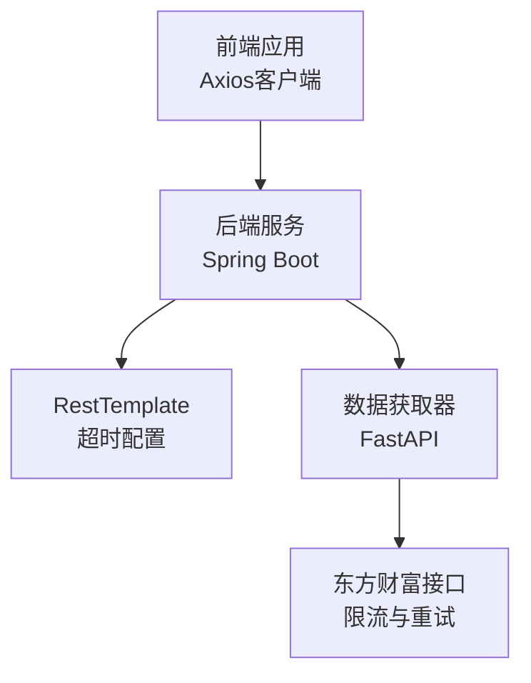
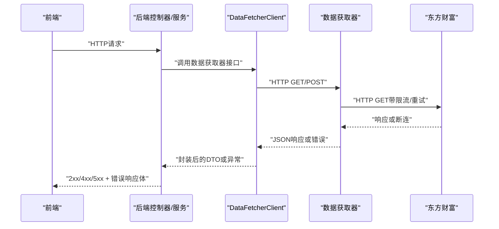
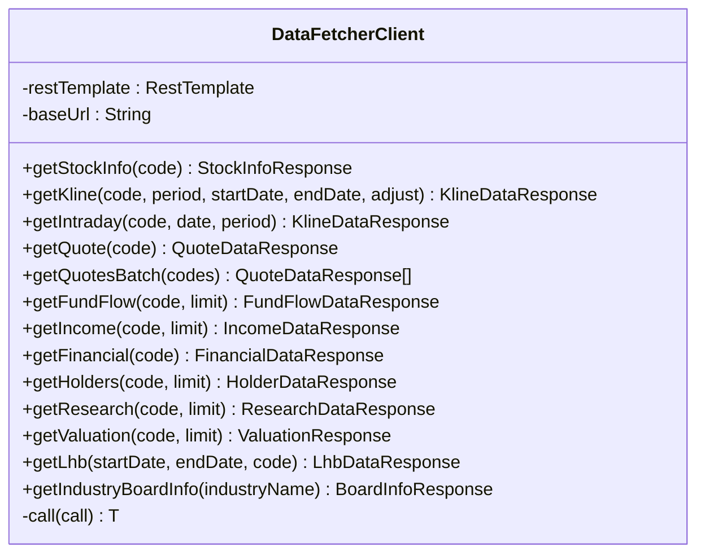
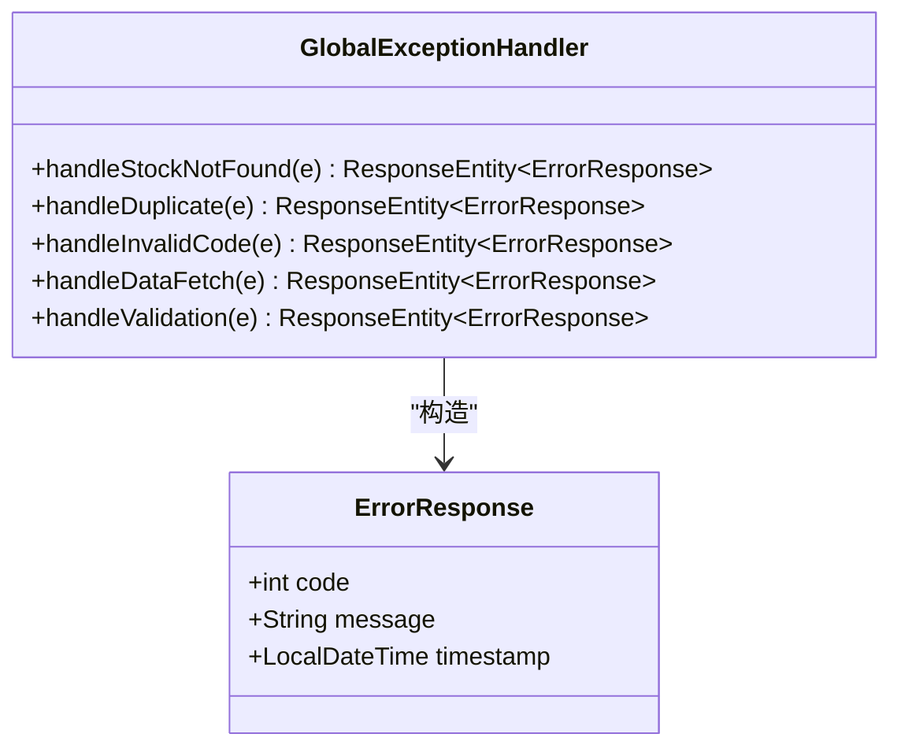
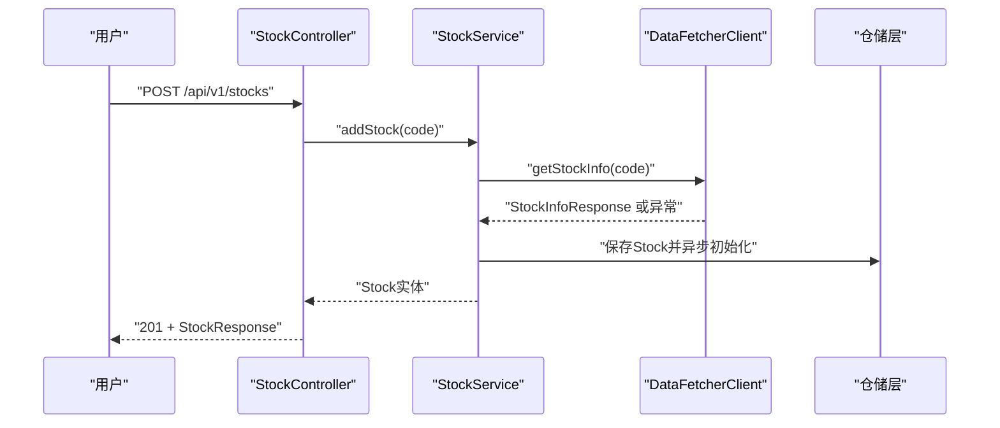
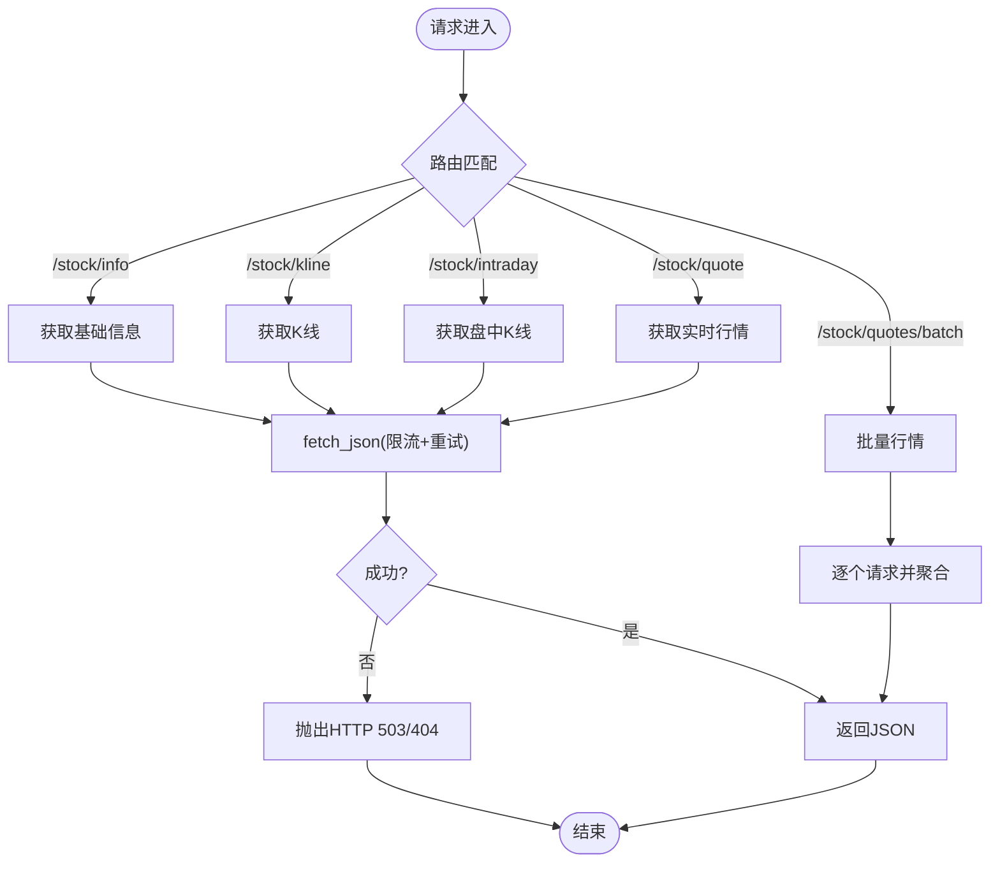
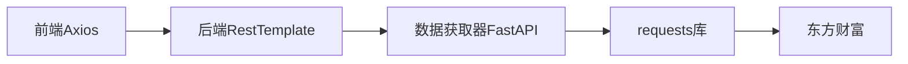
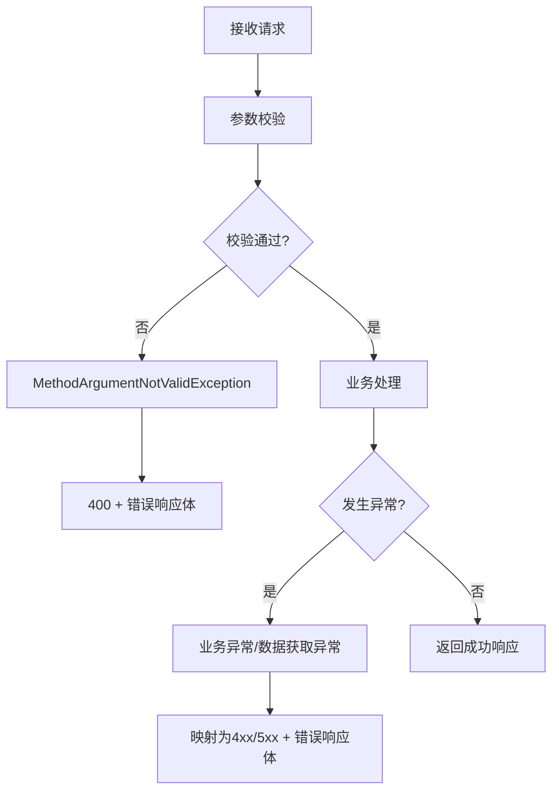

# API调用问题

<cite>
**本文引用的文件**
- [DataFetcherClient.java](file://backend/src/main/java/com/stock/client/DataFetcherClient.java)
- [RestTemplateConfig.java](file://backend/src/main/java/com/stock/config/RestTemplateConfig.java)
- [GlobalExceptionHandler.java](file://backend/src/main/java/com/stock/exception/GlobalExceptionHandler.java)
- [ErrorResponse.java](file://backend/src/main/java/com/stock/exception/ErrorResponse.java)
- [DataFetchException.java](file://backend/src/main/java/com/stock/exception/DataFetchException.java)
- [StockService.java](file://backend/src/main/java/com/stock/service/StockService.java)
- [StockController.java](file://backend/src/main/java/com/stock/controller/StockController.java)
- [application.yml](file://backend/src/main/resources/application.yml)
- [index.ts](file://frontend/src/api/index.ts)
- [stock.ts](file://frontend/src/api/stock.ts)
- [app.py](file://data-fetcher/app.py)
- [stock.py](file://data-fetcher/routers/stock.py)
- [config.py](file://data-fetcher/core/config.py)
- [data-source-verification.md](file://system-planner/data-source-verification.md)
</cite>

## 目录
1. [简介](#简介)
2. [项目结构](#项目结构)
3. [核心组件](#核心组件)
4. [架构总览](#架构总览)
5. [详细组件分析](#详细组件分析)
6. [依赖分析](#依赖分析)
7. [性能考虑](#性能考虑)
8. [故障排除指南](#故障排除指南)
9. [结论](#结论)
10. [附录](#附录)

## 简介
本指南聚焦于API调用问题的诊断与修复，覆盖以下方面：
- HTTP状态码含义与错误响应格式
- 请求参数验证失败的定位方法
- 数据获取器API调用失败、跨服务通信异常、网络超时等场景的排查步骤
- API测试工具使用方法、错误日志分析技巧、重试机制配置

目标是帮助开发者快速定位问题根因，并给出可操作的修复建议。

## 项目结构
该系统由三层组成：
- 前端层：基于Axios封装的HTTP客户端，统一拦截错误并输出到控制台
- 后端层：Spring Boot应用，负责业务编排、参数校验、异常统一处理，并通过RestTemplate调用数据获取器
- 数据获取器：FastAPI服务，提供股票基础信息、K线、实时行情等接口，并内置限流与重试逻辑

图表来源
- [index.ts:1-18](file://frontend/src/api/index.ts#L1-L18)
- [RestTemplateConfig.java:1-18](file://backend/src/main/java/com/stock/config/RestTemplateConfig.java#L1-L18)
- [app.py:1-31](file://data-fetcher/app.py#L1-L31)

章节来源
- [index.ts:1-18](file://frontend/src/api/index.ts#L1-L18)
- [RestTemplateConfig.java:1-18](file://backend/src/main/java/com/stock/config/RestTemplateConfig.java#L1-L18)
- [app.py:1-31](file://data-fetcher/app.py#L1-L31)

## 核心组件
- 前端Axios客户端：统一设置baseURL与超时，拦截响应错误并打印到控制台
- 后端RestTemplate：配置连接与读取超时，封装对数据获取器的HTTP调用
- 数据获取器FastAPI：提供健康检查、股票基础信息、K线、实时行情、批量行情等接口
- 统一异常处理：将业务异常映射为标准错误响应体，包含状态码与消息
- 参数校验：Spring Validation在控制器层进行参数校验，失败时返回400

章节来源
- [index.ts:1-18](file://frontend/src/api/index.ts#L1-L18)
- [RestTemplateConfig.java:1-18](file://backend/src/main/java/com/stock/config/RestTemplateConfig.java#L1-L18)
- [stock.py:1-246](file://data-fetcher/routers/stock.py#L1-L246)
- [GlobalExceptionHandler.java:1-33](file://backend/src/main/java/com/stock/exception/GlobalExceptionHandler.java#L1-L33)
- [ErrorResponse.java:1-8](file://backend/src/main/java/com/stock/exception/ErrorResponse.java#L1-L8)

## 架构总览
后端通过DataFetcherClient调用数据获取器，数据获取器内部对东方财富接口做限流与重试；前端通过Axios访问后端API。异常与错误响应在后端统一处理。

图表来源
- [DataFetcherClient.java:1-126](file://backend/src/main/java/com/stock/client/DataFetcherClient.java#L1-L126)
- [stock.py:1-246](file://data-fetcher/routers/stock.py#L1-L246)
- [GlobalExceptionHandler.java:1-33](file://backend/src/main/java/com/stock/exception/GlobalExceptionHandler.java#L1-L33)

## 详细组件分析

### 组件A：数据获取器客户端（DataFetcherClient）
职责：封装对数据获取器的HTTP调用，统一封装异常，避免空响应。

图表来源
- [DataFetcherClient.java:1-126](file://backend/src/main/java/com/stock/client/DataFetcherClient.java#L1-L126)

章节来源
- [DataFetcherClient.java:1-126](file://backend/src/main/java/com/stock/client/DataFetcherClient.java#L1-L126)

### 组件B：统一异常处理（GlobalExceptionHandler）
职责：将业务异常转换为标准化错误响应体，包含状态码与消息；对参数校验失败返回400。

图表来源
- [GlobalExceptionHandler.java:1-33](file://backend/src/main/java/com/stock/exception/GlobalExceptionHandler.java#L1-L33)
- [ErrorResponse.java:1-8](file://backend/src/main/java/com/stock/exception/ErrorResponse.java#L1-L8)

章节来源
- [GlobalExceptionHandler.java:1-33](file://backend/src/main/java/com/stock/exception/GlobalExceptionHandler.java#L1-L33)
- [ErrorResponse.java:1-8](file://backend/src/main/java/com/stock/exception/ErrorResponse.java#L1-L8)

### 组件C：后端服务与控制器（StockService/StockController）
职责：参数校验、业务流程编排、调用数据获取器、异常捕获与事务同步回调。

图表来源
- [StockController.java:1-57](file://backend/src/main/java/com/stock/controller/StockController.java#L1-L57)
- [StockService.java:1-243](file://backend/src/main/java/com/stock/service/StockService.java#L1-L243)
- [DataFetcherClient.java:1-126](file://backend/src/main/java/com/stock/client/DataFetcherClient.java#L1-L126)

章节来源
- [StockController.java:1-57](file://backend/src/main/java/com/stock/controller/StockController.java#L1-L57)
- [StockService.java:1-243](file://backend/src/main/java/com/stock/service/StockService.java#L1-L243)

### 组件D：数据获取器（FastAPI）
职责：提供健康检查、股票基础信息、K线、实时行情、批量行情等接口；内部对东方财富接口做限流与重试。

图表来源
- [stock.py:1-246](file://data-fetcher/routers/stock.py#L1-L246)
- [config.py:1-121](file://data-fetcher/core/config.py#L1-L121)

章节来源
- [stock.py:1-246](file://data-fetcher/routers/stock.py#L1-L246)
- [config.py:1-121](file://data-fetcher/core/config.py#L1-L121)

## 依赖分析
- 后端依赖RestTemplate进行HTTP调用，超时配置为连接5秒、读取15秒
- 数据获取器依赖requests库，对东方财富接口做限流与重试
- 前端依赖Axios，统一拦截错误并打印

图表来源
- [index.ts:1-18](file://frontend/src/api/index.ts#L1-L18)
- [RestTemplateConfig.java:1-18](file://backend/src/main/java/com/stock/config/RestTemplateConfig.java#L1-L18)
- [config.py:1-121](file://data-fetcher/core/config.py#L1-L121)

章节来源
- [index.ts:1-18](file://frontend/src/api/index.ts#L1-L18)
- [RestTemplateConfig.java:1-18](file://backend/src/main/java/com/stock/config/RestTemplateConfig.java#L1-L18)
- [config.py:1-121](file://data-fetcher/core/config.py#L1-L121)

## 性能考虑
- 连接与读取超时：后端RestTemplate连接超时5秒、读取超时15秒，避免长时间阻塞
- 数据获取器限流：每请求间隔≥500ms，防止触发东方财富限流
- 批量上限：单轮批量请求不超过20只股票，降低限流风险
- 指数退避：遇到断连时按30秒×2^attempt等待，最多重试2次
- 并发控制：同一时刻仅1个请求，排队处理

章节来源
- [RestTemplateConfig.java:1-18](file://backend/src/main/java/com/stock/config/RestTemplateConfig.java#L1-L18)
- [config.py:1-121](file://data-fetcher/core/config.py#L1-L121)
- [data-source-verification.md:379-437](file://system-planner/data-source-verification.md#L379-L437)

## 故障排除指南

### 一、HTTP状态码与错误响应格式
- 400（参数校验失败）：后端统一返回标准错误响应体，包含状态码与消息
- 404（资源未找到）：如股票信息缺失、实时行情缺失
- 409（冲突）：如重复添加股票
- 503（服务不可用/上游失败）：数据获取器调用失败或超时
- 错误响应体结构：包含状态码、消息与时间戳

排查步骤
1. 检查后端日志中的异常栈与错误消息
2. 确认请求是否命中了参数校验规则
3. 核对错误响应体中的状态码与消息，定位具体异常类型

章节来源
- [GlobalExceptionHandler.java:1-33](file://backend/src/main/java/com/stock/exception/GlobalExceptionHandler.java#L1-L33)
- [ErrorResponse.java:1-8](file://backend/src/main/java/com/stock/exception/ErrorResponse.java#L1-L8)

### 二、请求参数验证失败
常见场景
- 缺少必填字段、字段类型不匹配、格式不符合约束

定位方法
- 查看后端拦截到的MethodArgumentNotValidException，确认字段名与默认消息
- 在前端发起请求前，使用接口定义进行自检（如接口定义文件）

章节来源
- [GlobalExceptionHandler.java:25-31](file://backend/src/main/java/com/stock/exception/GlobalExceptionHandler.java#L25-L31)
- [stock.ts:1-61](file://frontend/src/api/stock.ts#L1-L61)

### 三、数据获取器API调用失败
症状
- 后端返回503，消息提示“Failed to call data fetcher”
- 前端收到5xx或超时

排查步骤
1. 检查数据获取器健康状态
   - 访问健康检查接口，确认服务正常
2. 检查数据获取器日志，关注断连与限流
3. 核对请求参数与URL拼接是否正确
4. 若出现“RemoteDisconnected”，按指数退避策略等待后重试

章节来源
- [DataFetcherClient.java:112-124](file://backend/src/main/java/com/stock/client/DataFetcherClient.java#L112-L124)
- [stock.py:25-31](file://data-fetcher/routers/stock.py#L25-L31)
- [config.py:80-100](file://data-fetcher/core/config.py#L80-L100)
- [data-source-verification.md:379-437](file://system-planner/data-source-verification.md#L379-L437)

### 四、跨服务通信异常
症状
- 后端调用数据获取器超时或抛出异常
- 前端收到503或超时

排查步骤
1. 检查后端配置的数据获取器地址与端口
2. 使用curl或Postman直接调用数据获取器接口，验证可达性
3. 关注网络连通性与防火墙策略
4. 核对CORS配置（若前端跨域访问）

章节来源
- [application.yml:19-22](file://backend/src/main/resources/application.yml#L19-L22)
- [app.py:1-31](file://data-fetcher/app.py#L1-L31)

### 五、网络超时
症状
- 后端日志显示连接超时或读取超时
- 前端收到超时错误

排查步骤
1. 检查后端RestTemplate超时配置（连接5秒、读取15秒）
2. 评估上游接口响应时间，必要时调整超时或增加重试
3. 在高并发场景下，确保请求频率不超过限流阈值

章节来源
- [RestTemplateConfig.java:1-18](file://backend/src/main/java/com/stock/config/RestTemplateConfig.java#L1-L18)
- [data-source-verification.md:379-437](file://system-planner/data-source-verification.md#L379-L437)

### 六、API测试工具使用方法
- curl
  - 健康检查：curl http://localhost:5001/health
  - 获取基础信息：curl "http://localhost:5001/stock/info?code=600519"
  - 批量行情：curl -X POST http://localhost:5001/stock/quotes/batch -H "Content-Type: application/json" -d '{"codes":["600519","000001"]}'
- Postman
  - 导入接口集合，设置环境变量（如baseURL）
  - 使用预设的请求模板验证各端点
- 前端调试
  - 打开浏览器开发者工具Network标签，查看请求与响应
  - 观察拦截器输出的错误信息

章节来源
- [app.py:23-25](file://data-fetcher/app.py#L23-L25)
- [stock.py:14-72](file://data-fetcher/routers/stock.py#L14-L72)
- [index.ts:1-18](file://frontend/src/api/index.ts#L1-L18)

### 七、错误日志分析技巧
- 后端
  - 关注GlobalExceptionHandler的异常映射与堆栈
  - 结合DataFetcherClient的包装异常，定位上游失败点
- 数据获取器
  - 关注限流与断连日志，识别“RemoteDisconnected”与退避行为
  - 检查fetch_json的重试次数与等待时间
- 前端
  - 利用Axios拦截器输出的错误对象，提取状态码与消息

章节来源
- [GlobalExceptionHandler.java:1-33](file://backend/src/main/java/com/stock/exception/GlobalExceptionHandler.java#L1-L33)
- [DataFetcherClient.java:112-124](file://backend/src/main/java/com/stock/client/DataFetcherClient.java#L112-L124)
- [config.py:80-100](file://data-fetcher/core/config.py#L80-L100)
- [index.ts:8-15](file://frontend/src/api/index.ts#L8-L15)

### 八、重试机制配置
- 数据获取器
  - fetch_json：最大重试2次，遇到断连按30秒×2^attempt等待
  - 限流：每请求间隔≥500ms，全局锁保证串行
  - 批量上限：单轮最多20只股票
- 后端
  - RestTemplate：连接超时5秒、读取超时15秒
  - 建议：在业务层根据场景增加幂等与指数退避策略

章节来源
- [config.py:80-100](file://data-fetcher/core/config.py#L80-L100)
- [RestTemplateConfig.java:1-18](file://backend/src/main/java/com/stock/config/RestTemplateConfig.java#L1-L18)
- [data-source-verification.md:379-437](file://system-planner/data-source-verification.md#L379-L437)

## 结论
通过统一的异常处理、标准化的错误响应、严格的限流与重试策略，以及完善的日志与测试工具，可以有效提升API调用的稳定性与可观测性。建议在生产环境中持续监控上游接口状态、优化请求频率，并完善降级与缓存策略以增强韧性。

## 附录

### A. 常见错误与处理建议
- 400参数校验失败：检查请求体字段与格式，参考字段默认消息
- 404资源缺失：确认股票代码有效且上游接口可返回数据
- 409重复添加：避免重复提交相同股票代码
- 503上游失败：检查数据获取器健康状态与限流情况，按退避策略重试

章节来源
- [GlobalExceptionHandler.java:9-20](file://backend/src/main/java/com/stock/exception/GlobalExceptionHandler.java#L9-L20)
- [stock.py:30-31](file://data-fetcher/routers/stock.py#L30-L31)

### B. 关键流程图：参数校验与异常映射

图表来源
- [GlobalExceptionHandler.java:25-31](file://backend/src/main/java/com/stock/exception/GlobalExceptionHandler.java#L25-L31)
- [ErrorResponse.java:1-8](file://backend/src/main/java/com/stock/exception/ErrorResponse.java#L1-L8)