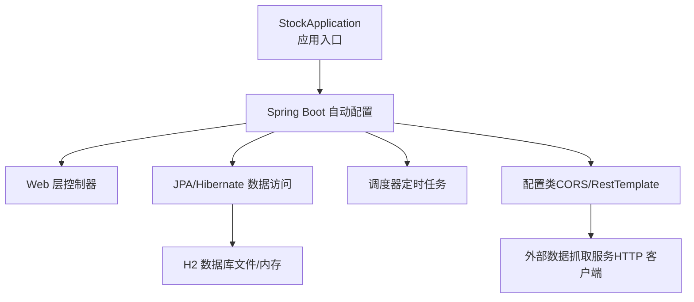
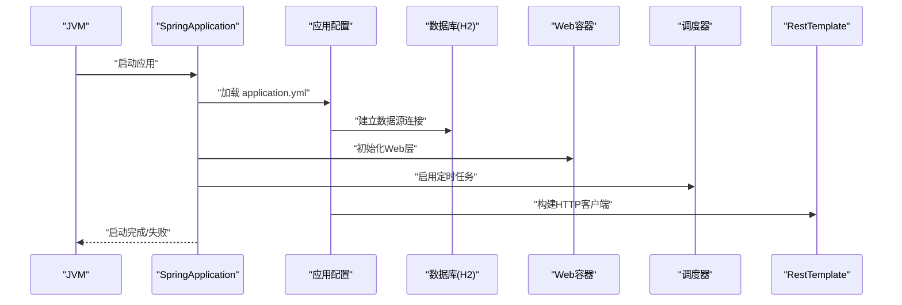
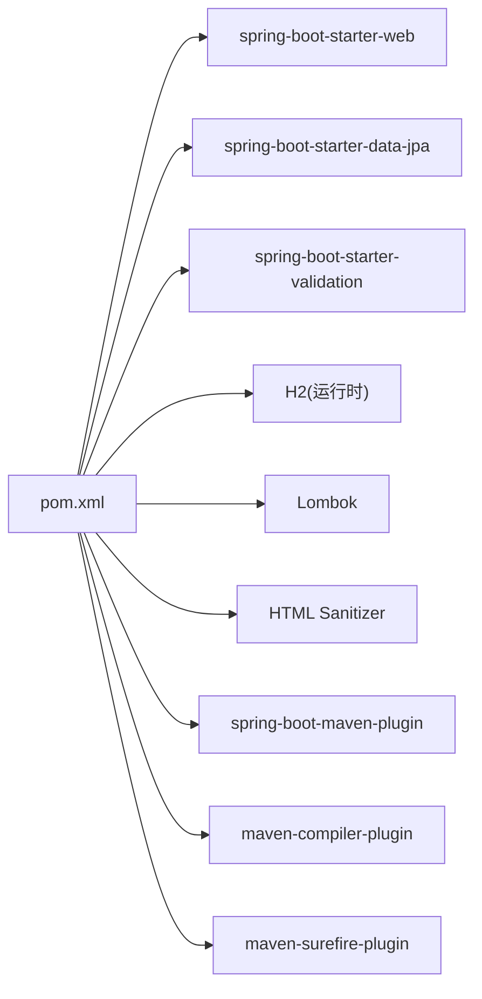
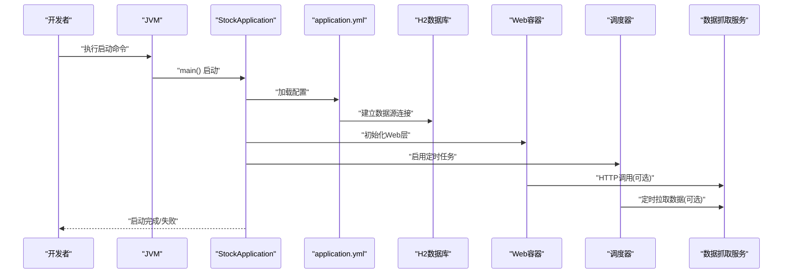

# 启动问题

<cite>
**本文引用的文件**
- [StockApplication.java](file://backend/src/main/java/com/stock/StockApplication.java)
- [application.yml（主）](file://backend/src/main/resources/application.yml)
- [pom.xml](file://backend/pom.xml)
- [GlobalExceptionHandler.java](file://backend/src/main/java/com/stock/exception/GlobalExceptionHandler.java)
- [RestTemplateConfig.java](file://backend/src/main/java/com/stock/config/RestTemplateConfig.java)
- [WebConfig.java](file://backend/src/main/java/com/stock/config/WebConfig.java)
- [DataSyncScheduler.java](file://backend/src/main/java/com/stock/scheduler/DataSyncScheduler.java)
- [DataInitService.java](file://backend/src/main/java/com/stock/service/DataInitService.java)
- [application.yml（测试）](file://backend/src/test/resources/application.yml)
</cite>

## 目录
1. [简介](#简介)
2. [项目结构](#项目结构)
3. [核心组件](#核心组件)
4. [架构总览](#架构总览)
5. [详细组件分析](#详细组件分析)
6. [依赖关系分析](#依赖关系分析)
7. [性能考虑](#性能考虑)
8. [故障排除指南](#故障排除指南)
9. [结论](#结论)
10. [附录](#附录)

## 简介
本指南聚焦于Spring Boot应用在启动阶段可能遇到的问题与排障流程，覆盖端口冲突、数据库连接失败、依赖缺失、配置错误等常见场景，并提供启动日志分析技巧、快速修复方案、环境配置验证方法、启动检查清单与预防措施。读者可据此快速定位并解决启动失败问题。

## 项目结构
后端为标准Spring Boot工程，采用Maven管理依赖，使用H2内存或文件数据库进行开发与测试，默认端口为8080，启用调度与异步功能，通过RestTemplate访问数据抓取服务，提供跨域支持。

图表来源
- [StockApplication.java:1-16](file://backend/src/main/java/com/stock/StockApplication.java#L1-L16)
- [application.yml（主）:1-28](file://backend/src/main/resources/application.yml#L1-L28)
- [pom.xml:1-103](file://backend/pom.xml#L1-L103)

章节来源
- [StockApplication.java:1-16](file://backend/src/main/java/com/stock/StockApplication.java#L1-L16)
- [application.yml（主）:1-28](file://backend/src/main/resources/application.yml#L1-L28)
- [pom.xml:1-103](file://backend/pom.xml#L1-L103)

## 核心组件
- 应用入口与启动：应用入口类负责启动Spring Boot容器，启用调度与异步能力。
- 配置体系：主配置文件定义服务器端口、数据库连接、JPA行为、H2控制台、数据抓取服务地址与超时、调度表达式等。
- 异常处理：全局异常处理器对业务异常进行统一响应。
- Web配置：CORS策略限定前端域名与方法。
- HTTP客户端：RestTemplate配置连接与读取超时。
- 调度器：定时同步行情、资金流、财务与研究等数据。
- 初始化服务：异步初始化各股票的数据步骤状态跟踪。

章节来源
- [StockApplication.java:1-16](file://backend/src/main/java/com/stock/StockApplication.java#L1-L16)
- [application.yml（主）:1-28](file://backend/src/main/resources/application.yml#L1-L28)
- [GlobalExceptionHandler.java:1-33](file://backend/src/main/java/com/stock/exception/GlobalExceptionHandler.java#L1-L33)
- [WebConfig.java:1-15](file://backend/src/main/java/com/stock/config/WebConfig.java#L1-L15)
- [RestTemplateConfig.java:1-18](file://backend/src/main/java/com/stock/config/RestTemplateConfig.java#L1-L18)
- [DataSyncScheduler.java:1-238](file://backend/src/main/java/com/stock/scheduler/DataSyncScheduler.java#L1-L238)
- [DataInitService.java:1-101](file://backend/src/main/java/com/stock/service/DataInitService.java#L1-L101)

## 架构总览
下图展示启动阶段的关键交互：应用入口加载自动配置，解析主配置，建立数据库连接，初始化Web与调度组件，准备HTTP客户端以访问外部数据源。

图表来源
- [StockApplication.java:1-16](file://backend/src/main/java/com/stock/StockApplication.java#L1-L16)
- [application.yml（主）:1-28](file://backend/src/main/resources/application.yml#L1-L28)
- [pom.xml:1-103](file://backend/pom.xml#L1-L103)

## 详细组件分析

### 启动入口与自动配置
- 入口类启用调度与异步注解，确保定时任务与异步初始化可用。
- Spring Boot根据starter自动装配Web、JPA、验证等模块。

章节来源
- [StockApplication.java:1-16](file://backend/src/main/java/com/stock/StockApplication.java#L1-L16)
- [pom.xml:23-56](file://backend/pom.xml#L23-L56)

### 配置文件与环境变量
- 服务器端口默认8080；数据库使用H2，支持文件与内存两种模式；JPA自动更新DDL；H2控制台开启。
- 外部数据抓取服务地址与超时时间可调；调度表达式用于控制定时任务执行频率。
- 测试配置中数据库切换为内存数据库，禁用H2控制台，调度表达式设为占位符以避免测试期间触发。

章节来源
- [application.yml（主）:1-28](file://backend/src/main/resources/application.yml#L1-L28)
- [application.yml（测试）:1-27](file://backend/src/test/resources/application.yml#L1-L27)

### 数据库连接与JPA
- 使用H2驱动，文件数据库路径位于用户目录下的子路径；JPA自动建模与更新。
- 若数据库文件损坏或权限不足，将导致启动失败或运行期异常。

章节来源
- [application.yml（主）:4-17](file://backend/src/main/resources/application.yml#L4-L17)
- [pom.xml:32-40](file://backend/pom.xml#L32-L40)

### Web与CORS
- 默认允许来自本地开发前端的跨域请求，若前端端口变更需同步调整。
- 若浏览器报跨域错误，优先检查CORS配置与前端实际端口。

章节来源
- [WebConfig.java:1-15](file://backend/src/main/java/com/stock/config/WebConfig.java#L1-L15)

### HTTP客户端与外部服务
- RestTemplate设置连接与读取超时，便于在外部服务不可达时快速失败。
- 数据抓取服务地址默认指向本地端口，若未启动或端口不一致会导致调度任务失败或接口调用异常。

章节来源
- [RestTemplateConfig.java:1-18](file://backend/src/main/java/com/stock/config/RestTemplateConfig.java#L1-L18)
- [application.yml（主）:19-22](file://backend/src/main/resources/application.yml#L19-L22)

### 调度器与定时任务
- 定时任务按工作日与交易时段执行，若外部服务不可用会记录警告日志但不会中断应用启动。
- 建议在启动后观察日志确认任务是否正常调度与执行。

章节来源
- [DataSyncScheduler.java:1-238](file://backend/src/main/java/com/stock/scheduler/DataSyncScheduler.java#L1-L238)
- [application.yml（主）:23-27](file://backend/src/main/resources/application.yml#L23-L27)

### 异常处理与初始化服务
- 全局异常处理器对业务异常返回标准化错误响应。
- 初始化服务异步执行多步骤数据初始化，并记录每步状态，便于排查单步失败原因。

章节来源
- [GlobalExceptionHandler.java:1-33](file://backend/src/main/java/com/stock/exception/GlobalExceptionHandler.java#L1-L33)
- [DataInitService.java:1-101](file://backend/src/main/java/com/stock/service/DataInitService.java#L1-L101)

## 依赖关系分析
- 启动依赖：spring-boot-starter-web、spring-boot-starter-data-jpa、spring-boot-starter-validation、H2驱动。
- 运行时依赖：Lombok、HTML净化库、ByteBuddy代理（测试插件）。
- Maven插件：编译器、Surefire（含ByteBuddy agent参数）、Spring Boot打包插件。

图表来源
- [pom.xml:23-101](file://backend/pom.xml#L23-L101)

章节来源
- [pom.xml:23-101](file://backend/pom.xml#L23-L101)

## 性能考虑
- 启动阶段避免过重的初始化逻辑；如无必要，推迟非关键组件的早期加载。
- 调度任务间增加合理的延迟，避免对外部服务造成瞬时压力。
- 在开发环境使用内存数据库，减少磁盘IO开销；生产环境谨慎使用DDL自动更新策略。

## 故障排除指南

### 一、启动失败的常见症状与定位
- 启动立即退出或卡住：检查端口占用、JVM版本、依赖完整性。
- 启动成功但无法访问：检查端口、CORS配置、防火墙。
- 启动成功但数据库相关报错：检查数据库URL、驱动、文件权限、DDL策略。
- 启动成功但外部服务调用失败：检查数据抓取服务地址与超时配置、网络连通性。

### 二、启动日志分析技巧
- 关注启动阶段的“APPLICATION STARTED”、“SERVER STARTED”等关键节点，定位失败发生的时间点。
- 查找数据库连接与JPA初始化日志，确认DDL执行与表结构一致性。
- 检查调度器初始化日志，确认定时任务表达式是否被正确解析。
- 观察外部HTTP调用日志，识别超时或连接失败的具体请求。

### 三、逐项排查清单
- 环境与端口
  - 确认JDK版本与Maven属性匹配。
  - 检查端口8080是否被占用，必要时修改配置或释放端口。
  - 章节来源
    - [application.yml（主）:1-2](file://backend/src/main/resources/application.yml#L1-L2)
- 数据库与JPA
  - 确认H2驱动存在且版本兼容。
  - 检查数据库URL与文件路径是否存在、权限是否足够。
  - 若使用文件数据库，确认路径中的用户目录可写。
  - 章节来源
    - [application.yml（主）:4-17](file://backend/src/main/resources/application.yml#L4-L17)
    - [pom.xml:32-40](file://backend/pom.xml#L32-L40)
- 配置文件
  - 对照主配置与测试配置差异，避免误用测试配置。
  - 章节来源
    - [application.yml（主）:1-28](file://backend/src/main/resources/application.yml#L1-L28)
    - [application.yml（测试）:1-27](file://backend/src/test/resources/application.yml#L1-L27)
- 外部服务
  - 确认数据抓取服务地址与端口正确，超时时间合理。
  - 章节来源
    - [application.yml（主）:19-22](file://backend/src/main/resources/application.yml#L19-L22)
- CORS与前端联调
  - 若前端端口变更，同步更新CORS允许的源。
  - 章节来源
    - [WebConfig.java:8-13](file://backend/src/main/java/com/stock/config/WebConfig.java#L8-L13)
- 调度器
  - 检查调度表达式是否有效，避免无效表达式导致任务未执行。
  - 章节来源
    - [application.yml（主）:23-27](file://backend/src/main/resources/application.yml#L23-L27)
- 依赖与打包
  - 确保所有starter与运行时依赖已下载，Maven插件配置无误。
  - 章节来源
    - [pom.xml:23-101](file://backend/pom.xml#L23-L101)

### 四、常见启动错误与快速修复
- 端口占用（端口被占用）
  - 现象：启动时报端口冲突。
  - 处理：修改端口或释放占用进程。
  - 章节来源
    - [application.yml（主）:1-2](file://backend/src/main/resources/application.yml#L1-L2)
- 数据库连接失败（驱动缺失/URL错误/文件权限）
  - 现象：启动阶段出现数据库连接异常。
  - 处理：确认H2依赖存在、数据库URL正确、文件路径可写。
  - 章节来源
    - [application.yml（主）:4-17](file://backend/src/main/resources/application.yml#L4-L17)
    - [pom.xml:32-40](file://backend/pom.xml#L32-L40)
- 依赖缺失（缺少starter或运行时依赖）
  - 现象：启动阶段找不到类或自动配置失败。
  - 处理：检查pom依赖声明与版本，重新构建项目。
  - 章节来源
    - [pom.xml:23-56](file://backend/pom.xml#L23-L56)
- 配置错误（无效的调度表达式/CORS源未匹配）
  - 现象：定时任务未执行或跨域失败。
  - 处理：修正表达式或CORS允许源。
  - 章节来源
    - [application.yml（主）:23-27](file://backend/src/main/resources/application.yml#L23-L27)
    - [WebConfig.java:8-13](file://backend/src/main/java/com/stock/config/WebConfig.java#L8-L13)
- 外部服务不可达（数据抓取服务未启动/超时过短）
  - 现象：HTTP调用超时或连接失败。
  - 处理：启动外部服务或适当增大超时时间。
  - 章节来源
    - [application.yml（主）:19-22](file://backend/src/main/resources/application.yml#L19-L22)
    - [RestTemplateConfig.java:11-16](file://backend/src/main/java/com/stock/config/RestTemplateConfig.java#L11-L16)

### 五、启动检查清单
- 环境
  - JDK版本与Maven属性一致
  - 端口未被占用
- 依赖
  - 所有starter与运行时依赖齐全
  - Maven插件配置正确
- 配置
  - 端口、数据库URL、JPA策略、H2控制台、数据抓取服务地址与超时、调度表达式均正确
- 外部服务
  - 数据抓取服务已启动且可访问
- CORS
  - 允许的前端源与方法正确

### 六、预防措施
- 开发环境使用内存数据库，避免文件路径问题。
- 在CI中加入启动前健康检查脚本，验证端口、数据库与外部服务可达性。
- 将调度表达式集中管理并在启动阶段做有效性校验。
- 使用不同环境的配置文件，避免误用测试配置。

## 结论
通过结合配置文件、依赖与启动日志，可以高效定位Spring Boot启动失败的根本原因。建议在启动前对照检查清单，按优先级逐一验证端口、数据库、依赖与外部服务，配合日志分析与最小化复现，通常可在短时间内解决问题。

## 附录

### A. 启动流程时序图（基于现有组件）

图表来源
- [StockApplication.java:1-16](file://backend/src/main/java/com/stock/StockApplication.java#L1-L16)
- [application.yml（主）:1-28](file://backend/src/main/resources/application.yml#L1-L28)
- [DataSyncScheduler.java:1-238](file://backend/src/main/java/com/stock/scheduler/DataSyncScheduler.java#L1-L238)