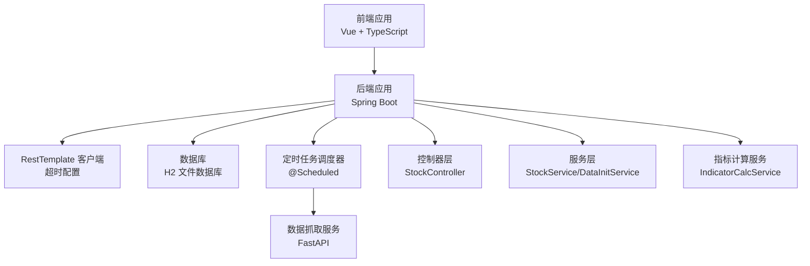
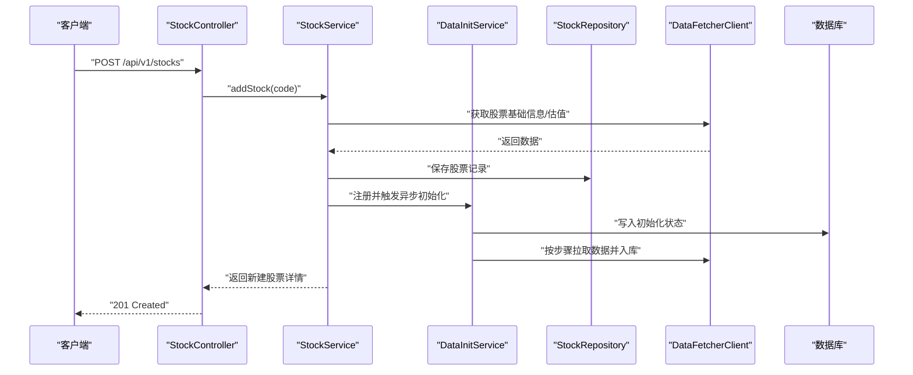
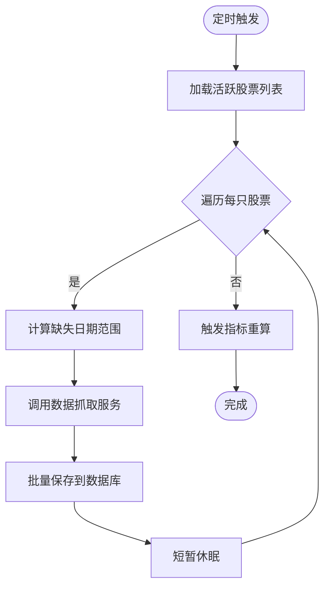
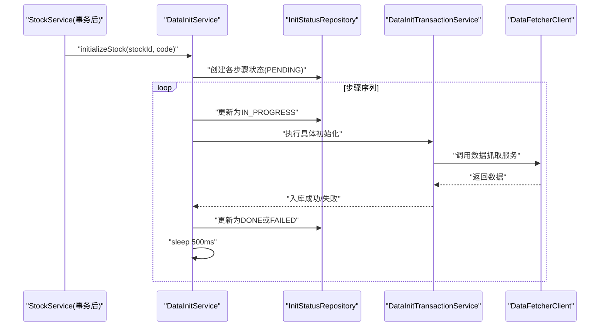
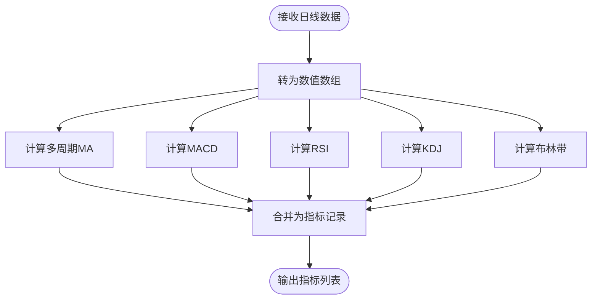
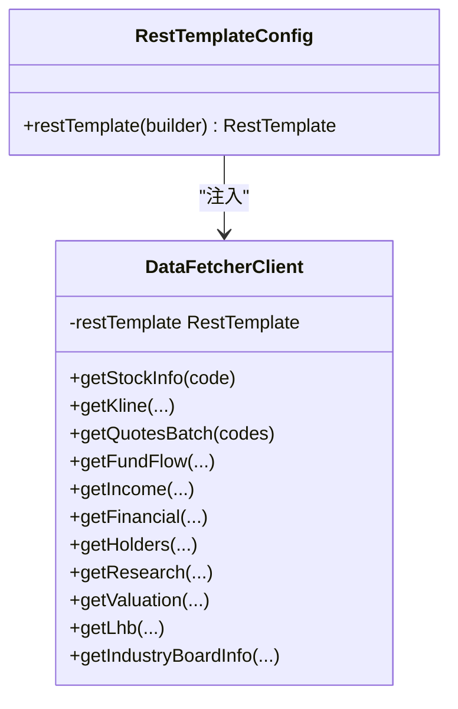
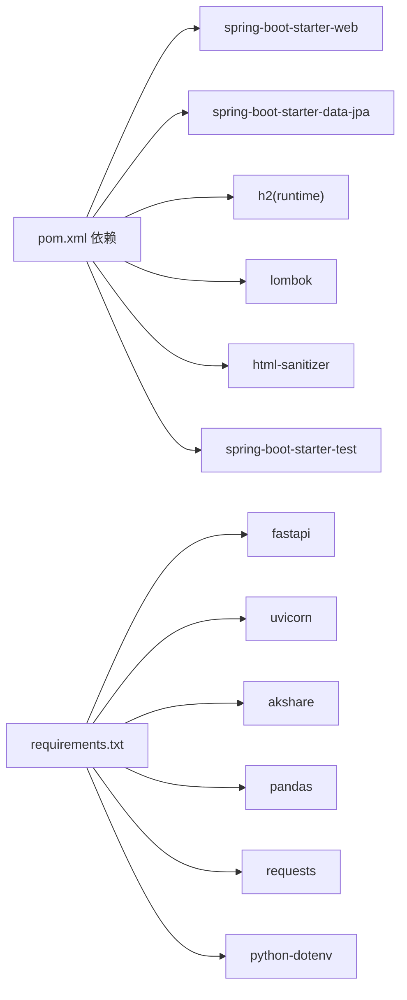

# 性能问题

<cite>
**本文引用的文件**
- [StockApplication.java](file://backend/src/main/java/com/stock/StockApplication.java)
- [application.yml](file://backend/src/main/resources/application.yml)
- [pom.xml](file://backend/pom.xml)
- [RestTemplateConfig.java](file://backend/src/main/java/com/stock/config/RestTemplateConfig.java)
- [WebConfig.java](file://backend/src/main/java/com/stock/config/WebConfig.java)
- [DataSyncScheduler.java](file://backend/src/main/java/com/stock/scheduler/DataSyncScheduler.java)
- [DataFetcherClient.java](file://backend/src/main/java/com/stock/client/DataFetcherClient.java)
- [StockService.java](file://backend/src/main/java/com/stock/service/StockService.java)
- [StockRepository.java](file://backend/src/main/java/com/stock/repository/StockRepository.java)
- [StockController.java](file://backend/src/main/java/com/stock/controller/StockController.java)
- [GlobalExceptionHandler.java](file://backend/src/main/java/com/stock/exception/GlobalExceptionHandler.java)
- [DataInitService.java](file://backend/src/main/java/com/stock/service/DataInitService.java)
- [IndicatorCalcService.java](file://backend/src/main/java/com/stock/service/IndicatorCalcService.java)
- [app.py](file://data-fetcher/app.py)
- [requirements.txt](file://data-fetcher/requirements.txt)
</cite>

## 目录
1. [简介](#简介)
2. [项目结构](#项目结构)
3. [核心组件](#核心组件)
4. [架构总览](#架构总览)
5. [详细组件分析](#详细组件分析)
6. [依赖分析](#依赖分析)
7. [性能考虑](#性能考虑)
8. [故障排除指南](#故障排除指南)
9. [结论](#结论)
10. [附录](#附录)

## 简介
本指南聚焦于系统在运行过程中可能出现的性能问题，包括响应时间过长、内存泄漏、数据库查询慢、并发处理能力不足等。结合代码库中的配置与实现，提供基于JVM性能监控、数据库性能分析、线程池配置优化、缓存策略调整等技术手段，并给出性能基准测试方法、瓶颈识别技巧与优化实施建议。

## 项目结构
后端采用 Spring Boot + JPA/H2 的架构；前端为 Vue + TypeScript；数据抓取服务采用 Python FastAPI。整体交互链路：前端通过 REST 接口调用后端，后端通过 RestTemplate 访问数据抓取服务，再由后端持久化到本地 H2 数据库；定时任务负责周期性同步与指标重算。

图表来源
- [StockApplication.java:1-16](file://backend/src/main/java/com/stock/StockApplication.java#L1-L16)
- [application.yml:1-28](file://backend/src/main/resources/application.yml#L1-L28)
- [RestTemplateConfig.java:1-18](file://backend/src/main/java/com/stock/config/RestTemplateConfig.java#L1-L18)
- [DataSyncScheduler.java:1-238](file://backend/src/main/java/com/stock/scheduler/DataSyncScheduler.java#L1-L238)
- [DataFetcherClient.java:1-126](file://backend/src/main/java/com/stock/client/DataFetcherClient.java#L1-L126)
- [StockController.java:1-57](file://backend/src/main/java/com/stock/controller/StockController.java#L1-L57)
- [IndicatorCalcService.java:1-210](file://backend/src/main/java/com/stock/service/IndicatorCalcService.java#L1-L210)
- [app.py:1-31](file://data-fetcher/app.py#L1-L31)

章节来源
- [StockApplication.java:1-16](file://backend/src/main/java/com/stock/StockApplication.java#L1-L16)
- [application.yml:1-28](file://backend/src/main/resources/application.yml#L1-L28)
- [pom.xml:1-103](file://backend/pom.xml#L1-L103)

## 核心组件
- 应用入口与开关：启用调度与异步，便于后台任务与异步初始化。
- 配置中心：服务器端口、数据源、JPA/H2 控制台、数据抓取服务地址与定时任务表达式。
- 客户端与网络：RestTemplate 超时配置，避免请求阻塞影响主线程。
- 定时任务：周期性同步行情、资金流、财务、股东、研究、K线与指标重算。
- 服务层：新增股票流程中触发异步初始化，保证事务提交后再执行异步步骤。
- 指标计算：批量计算多技术指标（MA、MACD、RSI、KDJ、布林带），涉及大量数值运算。
- 全局异常：对数据抓取失败进行统一 503 响应，便于前端感知上游不可用。

章节来源
- [StockApplication.java:8-15](file://backend/src/main/java/com/stock/StockApplication.java#L8-L15)
- [application.yml:19-27](file://backend/src/main/resources/application.yml#L19-L27)
- [RestTemplateConfig.java:10-16](file://backend/src/main/java/com/stock/config/RestTemplateConfig.java#L10-L16)
- [DataSyncScheduler.java:54-236](file://backend/src/main/java/com/stock/scheduler/DataSyncScheduler.java#L54-L236)
- [StockService.java:145-162](file://backend/src/main/java/com/stock/service/StockService.java#L145-L162)
- [IndicatorCalcService.java:15-64](file://backend/src/main/java/com/stock/service/IndicatorCalcService.java#L15-L64)
- [GlobalExceptionHandler.java:21-24](file://backend/src/main/java/com/stock/exception/GlobalExceptionHandler.java#L21-L24)

## 架构总览
下图展示从接口到数据抓取再到数据库的完整链路，以及定时任务与异步初始化的参与点。

图表来源
- [StockController.java:29-34](file://backend/src/main/java/com/stock/controller/StockController.java#L29-L34)
- [StockService.java:94-163](file://backend/src/main/java/com/stock/service/StockService.java#L94-L163)
- [DataInitService.java:42-71](file://backend/src/main/java/com/stock/service/DataInitService.java#L42-L71)
- [DataFetcherClient.java:26-93](file://backend/src/main/java/com/stock/client/DataFetcherClient.java#L26-L93)
- [StockRepository.java:10-17](file://backend/src/main/java/com/stock/repository/StockRepository.java#L10-L17)

## 详细组件分析

### 组件一：定时任务与数据同步（DataSyncScheduler）
- 角色：负责工作日定时同步 K 线、资金流、日度估值与研究、周频财务/收入/股东数据，并在完成后触发指标重算。
- 关键点：
  - 使用 @Scheduled 与 cron 表达式控制频率。
  - 对每只股票循环处理，期间对上游接口做逐个 sleep，降低并发压力。
  - 事务包裹写入，保证一致性。
- 性能关注：
  - 循环内多次远程调用与本地写入，易成为 CPU 与 IO 瓶颈。
  - 可通过批处理、连接池复用、并行化改造提升吞吐。

图表来源
- [DataSyncScheduler.java:54-236](file://backend/src/main/java/com/stock/scheduler/DataSyncScheduler.java#L54-L236)

章节来源
- [DataSyncScheduler.java:54-236](file://backend/src/main/java/com/stock/scheduler/DataSyncScheduler.java#L54-L236)

### 组件二：异步初始化（DataInitService）
- 角色：在新增股票后，异步顺序执行多个初始化步骤（估值、K线、资金流、收入、财务、股东、研究、指标）。
- 关键点：
  - 使用 @Async 异步执行，步骤间以固定延迟分隔，避免上游限流或资源争用。
  - 初始化状态持久化，便于前端轮询进度。
- 性能关注：
  - 步骤串行且有固定延迟，整体耗时较长；可通过并行化与更细粒度的批处理优化。

图表来源
- [DataInitService.java:42-92](file://backend/src/main/java/com/stock/service/DataInitService.java#L42-L92)

章节来源
- [DataInitService.java:42-92](file://backend/src/main/java/com/stock/service/DataInitService.java#L42-L92)

### 组件三：指标计算（IndicatorCalcService）
- 角色：对日线数据批量计算多种技术指标（MA、MACD、RSI、KDJ、布林带）。
- 关键点：
  - 将价格数组转换为 BigDecimal 数组，进行向量化计算。
  - 多重循环与数学运算，CPU 密集型。
- 性能关注：
  - 可引入并行流、分块计算、缓存中间结果、减少重复计算。
  - 对于历史回测场景，可考虑预计算与增量更新。

图表来源
- [IndicatorCalcService.java:15-64](file://backend/src/main/java/com/stock/service/IndicatorCalcService.java#L15-L64)

章节来源
- [IndicatorCalcService.java:15-64](file://backend/src/main/java/com/stock/service/IndicatorCalcService.java#L15-L64)

### 组件四：REST 客户端与网络超时（DataFetcherClient + RestTemplateConfig）
- 角色：封装对数据抓取服务的 HTTP 调用，统一异常包装。
- 关键点：
  - RestTemplate 连接超时与读取超时分别设置，避免长时间阻塞。
  - 对上游异常进行捕获并转换为业务异常，便于上层处理。
- 性能关注：
  - 当前超时参数需结合上游服务能力评估；若上游不稳定，可引入重试与熔断。

图表来源
- [RestTemplateConfig.java:10-16](file://backend/src/main/java/com/stock/config/RestTemplateConfig.java#L10-L16)
- [DataFetcherClient.java:14-24](file://backend/src/main/java/com/stock/client/DataFetcherClient.java#L14-L24)

章节来源
- [RestTemplateConfig.java:10-16](file://backend/src/main/java/com/stock/config/RestTemplateConfig.java#L10-L16)
- [DataFetcherClient.java:112-124](file://backend/src/main/java/com/stock/client/DataFetcherClient.java#L112-L124)

### 组件五：控制器与全局异常（StockController + GlobalExceptionHandler）
- 角色：对外暴露 REST 接口，统一异常处理。
- 关键点：
  - 新增股票接口返回 201，查询与列表接口返回 200。
  - 全局异常将数据抓取失败映射为 503，便于前端感知上游不可用。
- 性能关注：
  - 控制器层轻量，主要瓶颈在服务层与数据库；异常处理有助于快速定位问题。

章节来源
- [StockController.java:29-55](file://backend/src/main/java/com/stock/controller/StockController.java#L29-L55)
- [GlobalExceptionHandler.java:9-31](file://backend/src/main/java/com/stock/exception/GlobalExceptionHandler.java#L9-L31)

## 依赖分析
- 后端依赖：Spring Web、Spring Data JPA、H2、Lombok、HTML Sanitizer、测试依赖。
- Maven 插件：编译器、Surefire（含 ByteBuddy agent 开启模块反射）、Spring Boot 插件。
- 数据抓取服务：FastAPI + Uvicorn，使用 akshare 等库抓取数据。

图表来源
- [pom.xml:23-55](file://backend/pom.xml#L23-L55)
- [requirements.txt:1-7](file://data-fetcher/requirements.txt#L1-L7)

章节来源
- [pom.xml:23-55](file://backend/pom.xml#L23-L55)
- [requirements.txt:1-7](file://data-fetcher/requirements.txt#L1-L7)

## 性能考虑
- JVM 性能监控
  - 使用 JVM 自带工具（如 jstat、jstack、jmap、VisualVM 或 JFR）观察 GC、线程、堆内存与锁竞争。
  - 在生产环境开启 GC 日志与线程 dump，定位长时间停顿与死锁。
- 数据库性能
  - H2 为嵌入式文件数据库，适合开发/测试；生产建议迁移到 PostgreSQL/MySQL 并启用连接池、索引优化与慢查询日志。
  - 对高频查询建立合适索引（如按股票 ID、日期范围、状态字段）。
- 线程池与异步
  - 当前 @Async 默认线程池较小，建议显式配置核心/最大线程数、队列容量与拒绝策略，避免任务堆积。
  - 对外部调用（数据抓取）建议使用连接池与超时控制，防止阻塞线程。
- 缓存策略
  - 对热点查询（如股票列表、个股详情）引入 Redis 缓存，设置合理过期时间与失效策略。
  - 对指标计算结果进行缓存，支持增量更新与失效。
- 网络与超时
  - RestTemplate 已设置连接与读取超时，建议结合重试与熔断（Resilience4j）提升稳定性。
- 批处理与并行化
  - 定时任务与初始化流程中对每只股票循环，可改为分批并行，同时限制并发度避免上游限流。
- 指标计算优化
  - 使用并行流与分块计算，减少重复子数组计算；对滑动窗口指标采用增量更新。

## 故障排除指南

### 响应时间过长
- 症状：接口响应缓慢，页面卡顿。
- 诊断步骤：
  - 使用 JVM 监控工具查看 GC 频率与停顿时间，确认是否存在频繁 Full GC 或长时间停顿。
  - 分析控制器到服务层调用链，定位耗时环节（数据库查询、外部 HTTP 调用、指标计算）。
  - 检查数据库慢查询日志，确认是否缺少索引或查询未命中索引。
  - 检查外部数据抓取服务健康状态与响应时间。
- 优化建议：
  - 为高频查询添加复合索引；对大结果集分页。
  - 对外部调用增加超时与重试；必要时引入熔断。
  - 对指标计算进行分块并行与缓存。

章节来源
- [application.yml:19-27](file://backend/src/main/resources/application.yml#L19-L27)
- [RestTemplateConfig.java:10-16](file://backend/src/main/java/com/stock/config/RestTemplateConfig.java#L10-L16)
- [DataSyncScheduler.java:54-236](file://backend/src/main/java/com/stock/scheduler/DataSyncScheduler.java#L54-L236)
- [IndicatorCalcService.java:15-64](file://backend/src/main/java/com/stock/service/IndicatorCalcService.java#L15-L64)

### 内存泄漏
- 症状：堆内存持续增长，GC 无法回收，最终导致 OOM。
- 诊断步骤：
  - 采集堆快照（heap dump），使用工具分析对象保留链。
  - 关注线程池、缓存、集合容器是否持有对象引用。
  - 检查定时任务与异步任务是否正确释放资源。
- 优化建议：
  - 清理不再使用的缓存条目；设置合理的过期策略。
  - 确保线程池关闭与资源释放；避免静态集合累积。
  - 对大数据结构（如指标数组）及时释放引用。

章节来源
- [DataInitService.java:42-92](file://backend/src/main/java/com/stock/service/DataInitService.java#L42-L92)
- [IndicatorCalcService.java:15-64](file://backend/src/main/java/com/stock/service/IndicatorCalcService.java#L15-L64)

### 数据库查询慢
- 症状：查询响应时间长，事务提交慢。
- 诊断步骤：
  - 分析 SQL 执行计划，确认是否使用了索引。
  - 检查是否存在 N+1 查询、未分页的大结果集。
  - 观察数据库锁等待与并发冲突。
- 优化建议：
  - 为常用过滤字段建立索引；避免 select *。
  - 使用分页查询与投影查询；对聚合查询加缓存。
  - 考虑读写分离与只读副本。

章节来源
- [StockRepository.java:10-17](file://backend/src/main/java/com/stock/repository/StockRepository.java#L10-L17)
- [DataSyncScheduler.java:54-236](file://backend/src/main/java/com/stock/scheduler/DataSyncScheduler.java#L54-L236)

### 并发处理能力不足
- 症状：高并发下接口排队、超时增多、吞吐下降。
- 诊断步骤：
  - 查看线程池队列长度与拒绝次数。
  - 检查外部服务限流与下游响应时间。
  - 分析是否存在热点资源争用（如数据库连接池）。
- 优化建议：
  - 显式配置 @Async 线程池大小与队列容量。
  - 对外部调用引入连接池与超时控制。
  - 对热点接口进行限流与降级。

章节来源
- [StockApplication.java:8-15](file://backend/src/main/java/com/stock/StockApplication.java#L8-L15)
- [RestTemplateConfig.java:10-16](file://backend/src/main/java/com/stock/config/RestTemplateConfig.java#L10-L16)
- [DataInitService.java:42-92](file://backend/src/main/java/com/stock/service/DataInitService.java#L42-L92)

### 数据抓取服务异常
- 症状：新增股票或初始化失败，返回 503。
- 诊断步骤：
  - 检查数据抓取服务健康检查接口与日志。
  - 确认网络连通性与跨域配置。
  - 分析上游数据源可用性与速率限制。
- 优化建议：
  - 在客户端增加指数退避重试与熔断。
  - 对上游不稳定接口引入本地缓存兜底。

章节来源
- [GlobalExceptionHandler.java:21-24](file://backend/src/main/java/com/stock/exception/GlobalExceptionHandler.java#L21-L24)
- [DataFetcherClient.java:112-124](file://backend/src/main/java/com/stock/client/DataFetcherClient.java#L112-L124)
- [app.py:23-25](file://data-fetcher/app.py#L23-L25)

## 结论
本系统在开发阶段使用 H2 与嵌入式 FastAPI，具备良好的可测试性与可维护性。针对性能问题，建议从 JVM 监控、数据库索引与慢查询、线程池与异步配置、缓存与批处理优化、外部调用超时与重试五个维度入手，结合基准测试与瓶颈识别，逐步迭代优化。

## 附录

### 性能基准测试方法
- 接口压测：使用 JMeter/Artillery/K6 对关键接口（新增股票、列表、详情）施压，记录 P50/P95/P99 延迟与吞吐。
- 数据库压测：对高频查询构造批量脚本，观察不同索引下的 QPS 与延迟变化。
- 指标计算压测：准备不同长度的日线数据集，测量指标计算耗时与内存占用。
- 外部调用压测：模拟上游服务限流与抖动，验证重试与熔断效果。

### 瓶颈识别技巧
- 通过 JVM 监控定位 GC 与线程瓶颈。
- 通过数据库慢查询日志与执行计划定位 SQL 瓶颈。
- 通过分布式链路追踪（如 Micrometer + Prometheus + Grafana）定位调用链中最慢环节。
- 通过 A/B 测试对比优化前后指标。

### 优化实施建议
- 线程池：显式配置 @Async 与 Web 线程池，限制并发度并设置合理拒绝策略。
- 缓存：对列表、详情、指标结果引入 Redis 缓存，设置过期与失效策略。
- 批处理：将定时任务与初始化流程改为分批并行，控制并发度。
- 外部调用：增加超时、重试、熔断与隔离，避免级联故障。
- 数据库：建立必要索引、分页查询、读写分离与只读副本。