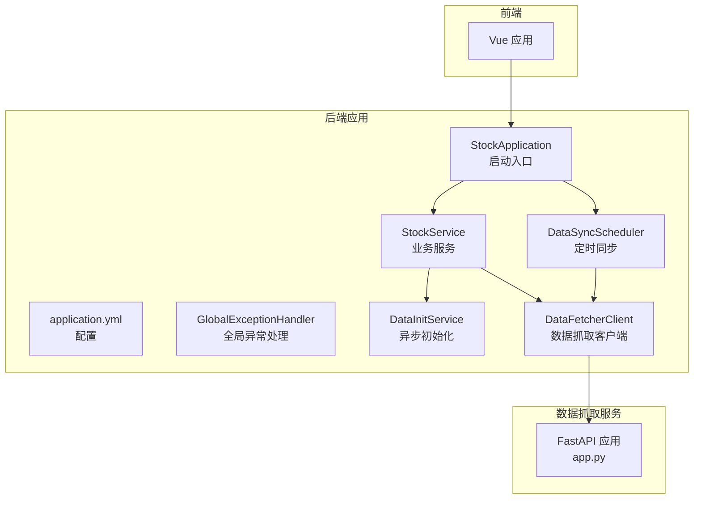
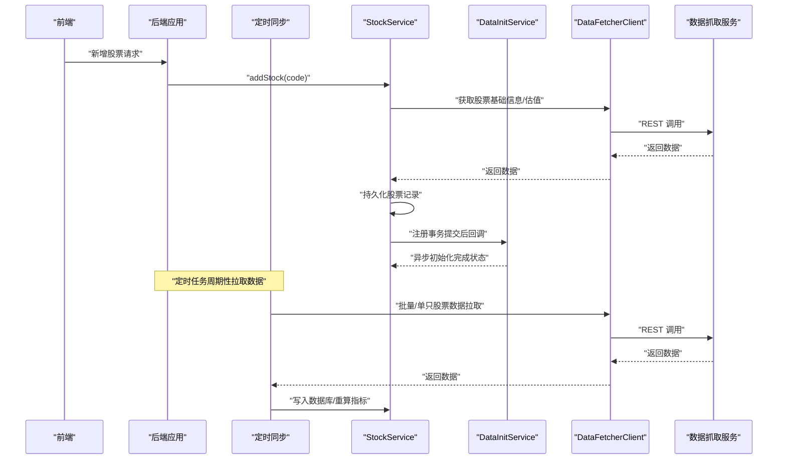
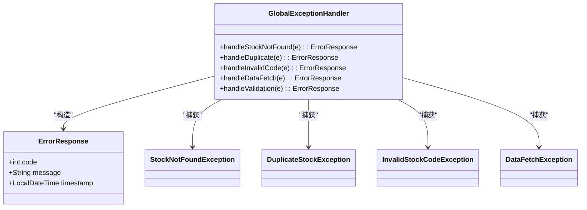
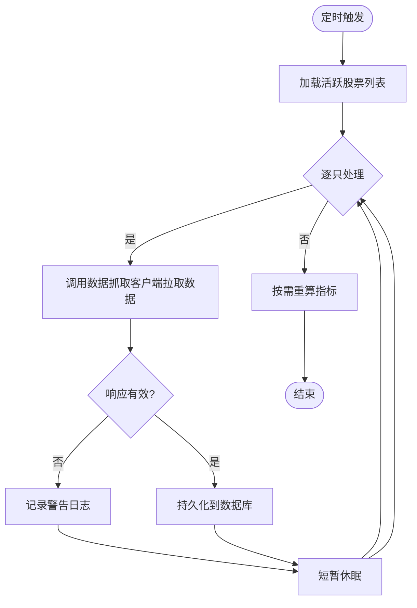
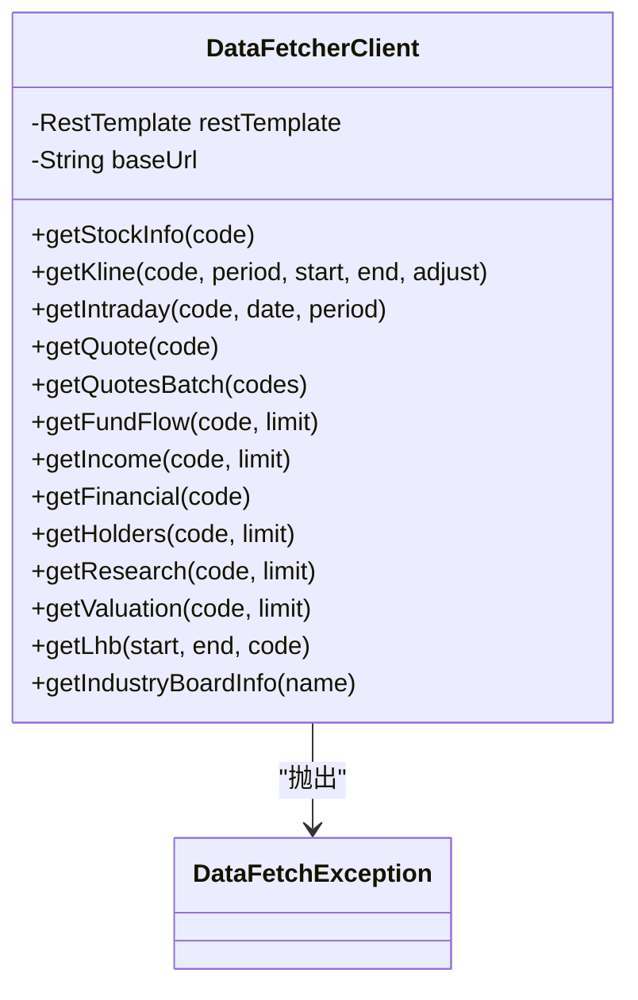
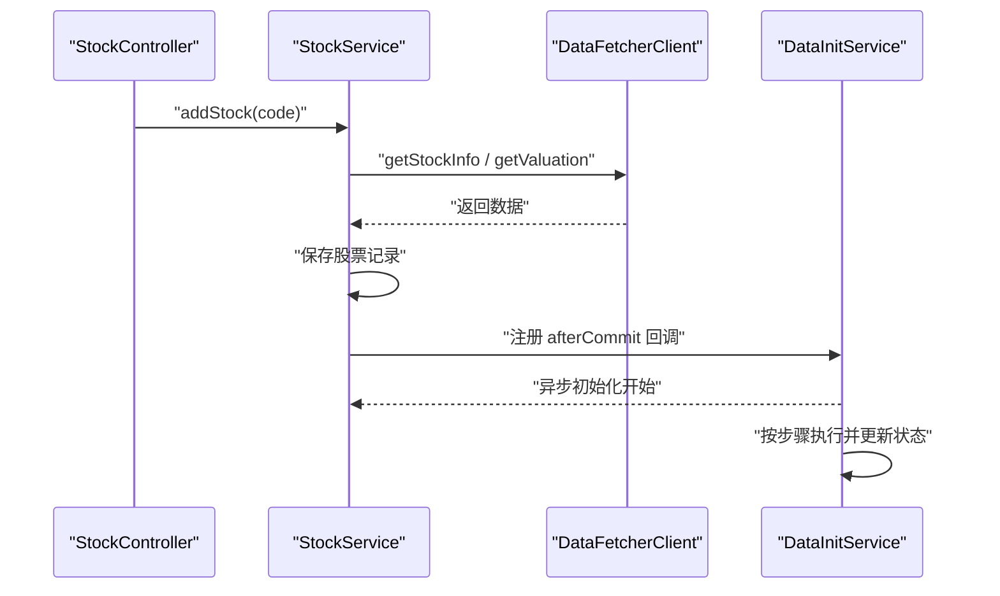
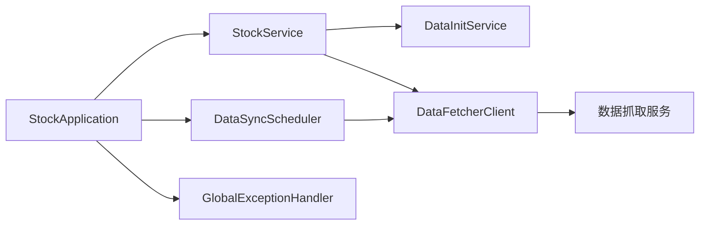

# 故障排除

<cite>
**本文引用的文件**
- [StockApplication.java](file://backend/src/main/java/com/stock/StockApplication.java)
- [application.yml](file://backend/src/main/resources/application.yml)
- [GlobalExceptionHandler.java](file://backend/src/main/java/com/stock/exception/GlobalExceptionHandler.java)
- [ErrorResponse.java](file://backend/src/main/java/com/stock/exception/ErrorResponse.java)
- [DataSyncScheduler.java](file://backend/src/main/java/com/stock/scheduler/DataSyncScheduler.java)
- [DataFetcherClient.java](file://backend/src/main/java/com/stock/client/DataFetcherClient.java)
- [DataFetchException.java](file://backend/src/main/java/com/stock/exception/DataFetchException.java)
- [StockController.java](file://backend/src/main/java/com/stock/controller/StockController.java)
- [StockService.java](file://backend/src/main/java/com/stock/service/StockService.java)
- [DataInitService.java](file://backend/src/main/java/com/stock/service/DataInitService.java)
- [StockNotFoundException.java](file://backend/src/main/java/com/stock/exception/StockNotFoundException.java)
- [DuplicateStockException.java](file://backend/src/main/java/com/stock/exception/DuplicateStockException.java)
- [InvalidStockCodeException.java](file://backend/src/main/java/com/stock/exception/InvalidStockCodeException.java)
- [app.py](file://data-fetcher/app.py)
</cite>

## 目录
1. [简介](#简介)
2. [项目结构](#项目结构)
3. [核心组件](#核心组件)
4. [架构总览](#架构总览)
5. [详细组件分析](#详细组件分析)
6. [依赖关系分析](#依赖关系分析)
7. [性能考虑](#性能考虑)
8. [故障排除指南](#故障排除指南)
9. [结论](#结论)
10. [附录](#附录)

## 简介
本指南面向运维与开发人员，聚焦于系统启动失败、API 调用异常、数据同步问题、性能瓶颈等常见故障场景，提供可操作的诊断步骤、日志关键字、错误码对照、调试工具使用方法、预防性维护与监控告警建议，以及应急响应流程。

## 项目结构
后端采用 Spring Boot 应用，前端为 Vue 应用，数据抓取服务为独立的 Python/FastAPI 服务。系统通过定时任务从数据抓取服务拉取数据，并在数据库中进行存储与指标计算；新增股票时触发异步初始化流程。

图表来源
- [StockApplication.java:1-16](file://backend/src/main/java/com/stock/StockApplication.java#L1-L16)
- [application.yml:1-28](file://backend/src/main/resources/application.yml#L1-L28)
- [GlobalExceptionHandler.java:1-33](file://backend/src/main/java/com/stock/exception/GlobalExceptionHandler.java#L1-L33)
- [DataSyncScheduler.java:1-238](file://backend/src/main/java/com/stock/scheduler/DataSyncScheduler.java#L1-L238)
- [StockService.java:1-243](file://backend/src/main/java/com/stock/service/StockService.java#L1-L243)
- [DataInitService.java:1-101](file://backend/src/main/java/com/stock/service/DataInitService.java#L1-L101)
- [DataFetcherClient.java:1-126](file://backend/src/main/java/com/stock/client/DataFetcherClient.java#L1-L126)
- [app.py:1-31](file://data-fetcher/app.py#L1-L31)

章节来源
- [StockApplication.java:1-16](file://backend/src/main/java/com/stock/StockApplication.java#L1-L16)
- [application.yml:1-28](file://backend/src/main/resources/application.yml#L1-L28)

## 核心组件
- 启动与调度
  - 启动入口启用调度与异步能力，确保定时任务与异步初始化可用。
- 全局异常处理
  - 将业务异常映射为统一错误响应，便于前端与监控识别。
- 数据同步调度器
  - 周期性从数据抓取服务拉取日线、资金流、估值研究、周频财务等数据，并进行指标重算。
- 数据抓取客户端
  - 统一封装对数据抓取服务的 REST 调用，统一异常转换。
- 业务服务与初始化
  - 新增股票时先持久化，再在事务提交后触发异步初始化，避免并发读取问题。
- 配置
  - 数据源、JPA、H2 控制台、数据抓取服务地址与超时、定时任务表达式等。

章节来源
- [StockApplication.java:1-16](file://backend/src/main/java/com/stock/StockApplication.java#L1-L16)
- [GlobalExceptionHandler.java:1-33](file://backend/src/main/java/com/stock/exception/GlobalExceptionHandler.java#L1-L33)
- [DataSyncScheduler.java:1-238](file://backend/src/main/java/com/stock/scheduler/DataSyncScheduler.java#L1-L238)
- [DataFetcherClient.java:1-126](file://backend/src/main/java/com/stock/client/DataFetcherClient.java#L1-L126)
- [StockService.java:1-243](file://backend/src/main/java/com/stock/service/StockService.java#L1-L243)
- [DataInitService.java:1-101](file://backend/src/main/java/com/stock/service/DataInitService.java#L1-L101)
- [application.yml:1-28](file://backend/src/main/resources/application.yml#L1-L28)

## 架构总览
系统以“后端应用 + 数据抓取服务 + 前端”三层协作：后端负责业务编排、数据持久化与定时同步；数据抓取服务负责对外数据源聚合；前端负责用户交互。

图表来源
- [StockService.java:93-163](file://backend/src/main/java/com/stock/service/StockService.java#L93-L163)
- [DataInitService.java:42-71](file://backend/src/main/java/com/stock/service/DataInitService.java#L42-L71)
- [DataSyncScheduler.java:54-82](file://backend/src/main/java/com/stock/scheduler/DataSyncScheduler.java#L54-L82)
- [DataFetcherClient.java:26-93](file://backend/src/main/java/com/stock/client/DataFetcherClient.java#L26-L93)
- [app.py:23-25](file://data-fetcher/app.py#L23-L25)

## 详细组件分析

### 异常处理与错误响应
- 全局异常处理器将业务异常映射为统一的错误响应体，包含状态码与时间戳。
- 常见异常类型与对应 HTTP 状态：
  - 股票不存在：404
  - 股票重复：409
  - 股票代码非法：400
  - 数据抓取失败：503
  - 参数校验失败：400（字段级错误拼接）

图表来源
- [GlobalExceptionHandler.java:1-33](file://backend/src/main/java/com/stock/exception/GlobalExceptionHandler.java#L1-L33)
- [ErrorResponse.java:1-8](file://backend/src/main/java/com/stock/exception/ErrorResponse.java#L1-L8)
- [StockNotFoundException.java:1-6](file://backend/src/main/java/com/stock/exception/StockNotFoundException.java#L1-L6)
- [DuplicateStockException.java:1-5](file://backend/src/main/java/com/stock/exception/DuplicateStockException.java#L1-L5)
- [InvalidStockCodeException.java:1-5](file://backend/src/main/java/com/stock/exception/InvalidStockCodeException.java#L1-L5)
- [DataFetchException.java:1-6](file://backend/src/main/java/com/stock/exception/DataFetchException.java#L1-L6)

章节来源
- [GlobalExceptionHandler.java:1-33](file://backend/src/main/java/com/stock/exception/GlobalExceptionHandler.java#L1-L33)
- [ErrorResponse.java:1-8](file://backend/src/main/java/com/stock/exception/ErrorResponse.java#L1-L8)

### 数据同步调度器
- 定时策略
  - 日线：工作日 15:30
  - 资金流：工作日 16:00
  - 估值/研究：工作日 18:00
  - 周频财务/报表/股东：每周日 02:00
  - 指标重算：工作日 15:45
- 失败处理
  - 单只股票失败仅记录警告日志，不影响整体流程。
- 关键日志
  - 开始/结束、成功条数、失败警告。

图表来源
- [DataSyncScheduler.java:54-82](file://backend/src/main/java/com/stock/scheduler/DataSyncScheduler.java#L54-L82)
- [DataSyncScheduler.java:84-117](file://backend/src/main/java/com/stock/scheduler/DataSyncScheduler.java#L84-L117)
- [DataSyncScheduler.java:119-161](file://backend/src/main/java/com/stock/scheduler/DataSyncScheduler.java#L119-L161)
- [DataSyncScheduler.java:163-214](file://backend/src/main/java/com/stock/scheduler/DataSyncScheduler.java#L163-L214)
- [DataSyncScheduler.java:216-236](file://backend/src/main/java/com/stock/scheduler/DataSyncScheduler.java#L216-L236)

章节来源
- [DataSyncScheduler.java:1-238](file://backend/src/main/java/com/stock/scheduler/DataSyncScheduler.java#L1-L238)
- [application.yml:23-27](file://backend/src/main/resources/application.yml#L23-L27)

### 数据抓取客户端
- 统一封装 REST 调用，自动处理空响应与异常转换。
- 对外接口包括：股票信息、日线、分时、报价、批量报价、资金流、利润表、财务表、股东、研报、估值、龙虎榜、行业板块等。
- 异常转换
  - 空响应或底层异常均转为数据抓取异常，便于上层统一处理。

图表来源
- [DataFetcherClient.java:1-126](file://backend/src/main/java/com/stock/client/DataFetcherClient.java#L1-L126)
- [DataFetchException.java:1-6](file://backend/src/main/java/com/stock/exception/DataFetchException.java#L1-L6)

章节来源
- [DataFetcherClient.java:1-126](file://backend/src/main/java/com/stock/client/DataFetcherClient.java#L1-L126)
- [DataFetchException.java:1-6](file://backend/src/main/java/com/stock/exception/DataFetchException.java#L1-L6)

### 新增股票与异步初始化
- 新增股票时：
  - 校验代码格式与唯一性
  - 获取基础信息与估值
  - 持久化后注册事务提交后的回调
  - 触发异步初始化，按步骤顺序执行并记录状态
- 初始化步骤（顺序）：估值 → 日线 → 资金流 → 利润表 → 财务表 → 股东 → 研报 → 指标

图表来源
- [StockController.java:29-34](file://backend/src/main/java/com/stock/controller/StockController.java#L29-L34)
- [StockService.java:93-163](file://backend/src/main/java/com/stock/service/StockService.java#L93-L163)
- [DataInitService.java:42-71](file://backend/src/main/java/com/stock/service/DataInitService.java#L42-L71)

章节来源
- [StockController.java:1-57](file://backend/src/main/java/com/stock/controller/StockController.java#L1-L57)
- [StockService.java:1-243](file://backend/src/main/java/com/stock/service/StockService.java#L1-L243)
- [DataInitService.java:1-101](file://backend/src/main/java/com/stock/service/DataInitService.java#L1-L101)

## 依赖关系分析
- 启动入口启用调度与异步，保证定时任务与异步初始化生效。
- 全局异常处理器统一输出错误响应，便于监控与前端展示。
- 数据同步调度器依赖数据抓取客户端与各仓储层。
- 业务服务依赖数据抓取客户端与初始化服务。
- 数据抓取服务提供健康检查端点与多路由接口。

图表来源
- [StockApplication.java:1-16](file://backend/src/main/java/com/stock/StockApplication.java#L1-L16)
- [GlobalExceptionHandler.java:1-33](file://backend/src/main/java/com/stock/exception/GlobalExceptionHandler.java#L1-L33)
- [DataSyncScheduler.java:1-238](file://backend/src/main/java/com/stock/scheduler/DataSyncScheduler.java#L1-L238)
- [StockService.java:1-243](file://backend/src/main/java/com/stock/service/StockService.java#L1-L243)
- [DataInitService.java:1-101](file://backend/src/main/java/com/stock/service/DataInitService.java#L1-L101)
- [DataFetcherClient.java:1-126](file://backend/src/main/java/com/stock/client/DataFetcherClient.java#L1-L126)
- [app.py:1-31](file://data-fetcher/app.py#L1-L31)

章节来源
- [StockApplication.java:1-16](file://backend/src/main/java/com/stock/StockApplication.java#L1-L16)
- [app.py:23-25](file://data-fetcher/app.py#L23-L25)

## 性能考虑
- 定时任务间隔与批处理
  - 同步过程内含短暂休眠，避免对下游抓取服务造成瞬时压力。
- 数据量与索引
  - 日线、资金流等高频数据建议在数据库层面建立必要索引（如按日期、股票ID）。
- 并发与事务
  - 异步初始化在事务提交后触发，避免并发读取未落盘数据。
- 超时与重试
  - 抓取服务超时配置可在应用配置中调整，建议结合熔断与退避策略。

[本节为通用指导，不直接分析具体文件]

## 故障排除指南

### 一、系统启动失败
- 常见原因
  - 端口占用、数据库连接失败、配置项缺失或错误。
- 诊断步骤
  - 检查应用端口与数据库连接配置是否正确。
  - 查看启动日志中的数据库初始化与 JPA 配置输出。
  - 确认 H2 控制台路径与访问权限。
- 关键日志关键字
  - “Started”、“ERROR”、“Connection refused”、“Failed to load”
- 参考配置
  - 服务器端口、数据源 URL、JPA DDL 自动建模、H2 控制台开关。
- 快速验证
  - 启动后访问 H2 控制台路径确认数据库可用。

章节来源
- [application.yml:1-28](file://backend/src/main/resources/application.yml#L1-L28)
- [StockApplication.java:1-16](file://backend/src/main/java/com/stock/StockApplication.java#L1-L16)

### 二、API 调用异常
- 错误码对照
  - 400：参数校验失败/无效股票代码
  - 404：股票不存在
  - 409：股票已存在
  - 503：数据抓取服务不可用或返回空
- 常见现象与定位
  - 新增股票返回 400/409：检查股票代码格式与唯一性。
  - 查询股票返回 404：确认股票 ID 是否正确或已被删除。
  - 新增后初始化失败：查看初始化状态接口返回。
- 日志关键字
  - “Validation failed”、“InvalidStockCodeException”、“StockNotFoundException”、“DuplicateStockException”、“DataFetchException”
- 排查要点
  - 检查数据抓取服务健康状态与可达性。
  - 核对数据抓取服务返回数据结构是否为空。
  - 关注全局异常处理器生成的错误响应体。

章节来源
- [GlobalExceptionHandler.java:1-33](file://backend/src/main/java/com/stock/exception/GlobalExceptionHandler.java#L1-L33)
- [ErrorResponse.java:1-8](file://backend/src/main/java/com/stock/exception/ErrorResponse.java#L1-L8)
- [StockController.java:29-34](file://backend/src/main/java/com/stock/controller/StockController.java#L29-L34)
- [StockService.java:93-163](file://backend/src/main/java/com/stock/service/StockService.java#L93-L163)
- [DataFetchException.java:1-6](file://backend/src/main/java/com/stock/exception/DataFetchException.java#L1-L6)

### 三、数据同步问题
- 现象
  - 某些股票未同步或同步中断。
- 诊断步骤
  - 查看定时任务日志，确认是否触发。
  - 检查数据抓取服务健康检查端点与各路由返回。
  - 核对数据库中最大交易日期与起始日期计算逻辑。
- 关键日志关键字
  - “Starting ... sync”、“Synced ... records”、“Failed to sync ...”、“Recalculated”
- 建议
  - 若某只股票多次失败，可单独重试该股票或人工补数据。
  - 调整抓取客户端超时与重试策略。

章节来源
- [DataSyncScheduler.java:54-82](file://backend/src/main/java/com/stock/scheduler/DataSyncScheduler.java#L54-L82)
- [DataSyncScheduler.java:84-117](file://backend/src/main/java/com/stock/scheduler/DataSyncScheduler.java#L84-L117)
- [DataSyncScheduler.java:119-161](file://backend/src/main/java/com/stock/scheduler/DataSyncScheduler.java#L119-L161)
- [DataSyncScheduler.java:163-214](file://backend/src/main/java/com/stock/scheduler/DataSyncScheduler.java#L163-L214)
- [DataSyncScheduler.java:216-236](file://backend/src/main/java/com/stock/scheduler/DataSyncScheduler.java#L216-L236)
- [app.py:23-25](file://data-fetcher/app.py#L23-L25)

### 四、性能瓶颈
- 现象
  - 新增股票耗时长、定时任务堆积、查询慢。
- 诊断步骤
  - 分析初始化步骤耗时与数据库写入节奏。
  - 检查定时任务是否并发执行导致资源争用。
  - 评估数据库索引与查询计划。
- 优化建议
  - 适当增加批次大小与延迟，降低瞬时压力。
  - 为高频查询字段建立索引。
  - 调整定时任务表达式与并发度。

章节来源
- [DataInitService.java:42-71](file://backend/src/main/java/com/stock/service/DataInitService.java#L42-L71)
- [DataSyncScheduler.java:54-82](file://backend/src/main/java/com/stock/scheduler/DataSyncScheduler.java#L54-L82)

### 五、日志关键字搜索清单
- 启动与配置
  - “Started StockApplication”, “H2 console”, “datasource url”
- 异常与错误
  - “Validation failed”, “InvalidStockCodeException”, “StockNotFoundException”, “DuplicateStockException”, “DataFetchException”
- 同步与初始化
  - “Starting ... sync”, “Synced ... records”, “Failed to sync ...”, “Recalculated”, “initializeStock”, “afterCommit”
- 健康检查
  - “/health”, “status: ok”

章节来源
- [GlobalExceptionHandler.java:1-33](file://backend/src/main/java/com/stock/exception/GlobalExceptionHandler.java#L1-L33)
- [DataSyncScheduler.java:54-82](file://backend/src/main/java/com/stock/scheduler/DataSyncScheduler.java#L54-L82)
- [DataInitService.java:42-71](file://backend/src/main/java/com/stock/service/DataInitService.java#L42-L71)
- [app.py:23-25](file://data-fetcher/app.py#L23-L25)

### 六、调试工具使用方法
- 后端
  - 使用 H2 控制台路径访问数据库，核对表与数据。
  - 打印并检查全局异常响应体，定位业务异常来源。
- 前端
  - 使用浏览器开发者工具查看网络请求与响应状态码。
- 数据抓取服务
  - 访问健康检查端点确认服务可用。
  - 逐步调用各路由接口验证返回结构。

章节来源
- [application.yml:14-17](file://backend/src/main/resources/application.yml#L14-L17)
- [GlobalExceptionHandler.java:1-33](file://backend/src/main/java/com/stock/exception/GlobalExceptionHandler.java#L1-L33)
- [app.py:23-25](file://data-fetcher/app.py#L23-L25)

### 七、预防性维护与监控告警
- 预防性维护
  - 定期清理历史无用数据，保持数据库健康。
  - 优化数据库索引，提升查询性能。
  - 限制定时任务并发度，避免资源争用。
- 监控告警
  - 关键指标：定时任务成功率、初始化完成率、数据抓取服务可用性、数据库连接池使用率。
  - 告警阈值：定时任务失败率超过阈值、健康检查失败、初始化长时间未完成。
- 应急响应流程
  - 发现异常 → 快速定位日志与错误码 → 临时降级或限流 → 修复后回归测试 → 恢复全量运行。

[本节为通用指导，不直接分析具体文件]

## 结论
通过统一的异常处理、明确的日志关键字、完善的定时同步机制与异步初始化流程，系统具备较好的可观测性与可维护性。建议在生产环境中完善监控告警与应急预案，持续优化数据库与定时任务策略，保障系统稳定运行。

[本节为总结性内容，不直接分析具体文件]

## 附录

### A. 错误码对照表
- 400：参数校验失败/无效股票代码
- 404：股票不存在
- 409：股票已存在
- 503：数据抓取异常（服务不可用或返回空）

章节来源
- [GlobalExceptionHandler.java:1-33](file://backend/src/main/java/com/stock/exception/GlobalExceptionHandler.java#L1-L33)
- [ErrorResponse.java:1-8](file://backend/src/main/java/com/stock/exception/ErrorResponse.java#L1-L8)

### B. 关键配置项
- 服务器端口、数据源 URL、JPA DDL 自动建模、H2 控制台路径
- 数据抓取服务地址与超时
- 定时任务 Cron 表达式（日线、资金流、研究、周频、指标重算）

章节来源
- [application.yml:1-28](file://backend/src/main/resources/application.yml#L1-L28)