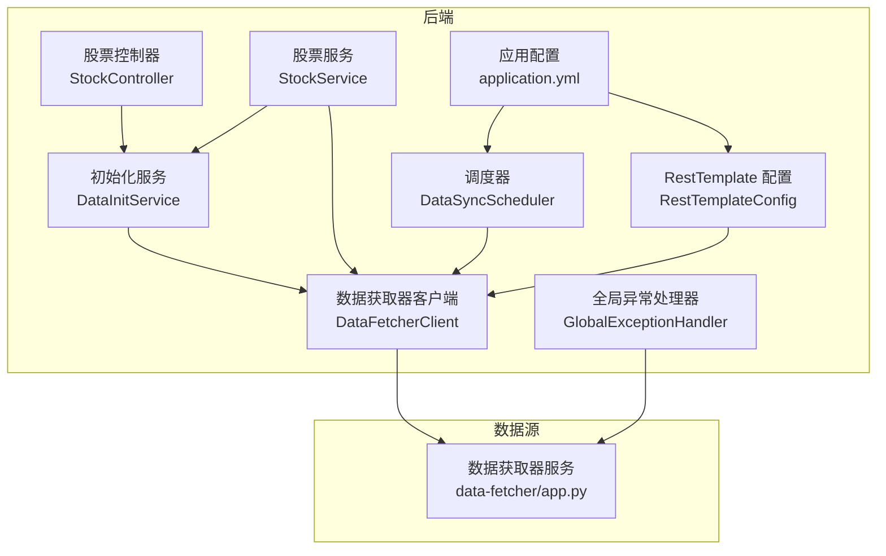
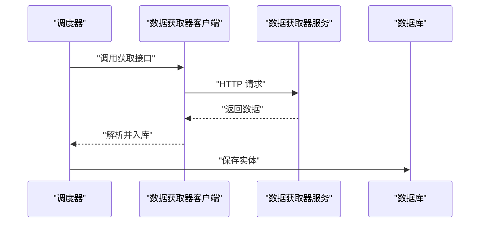
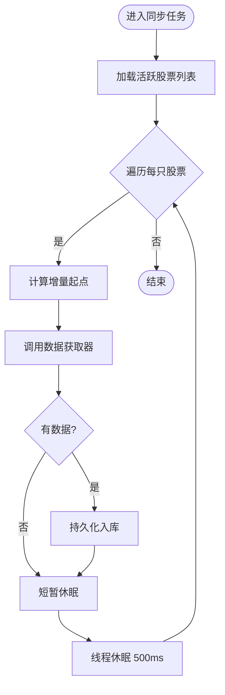
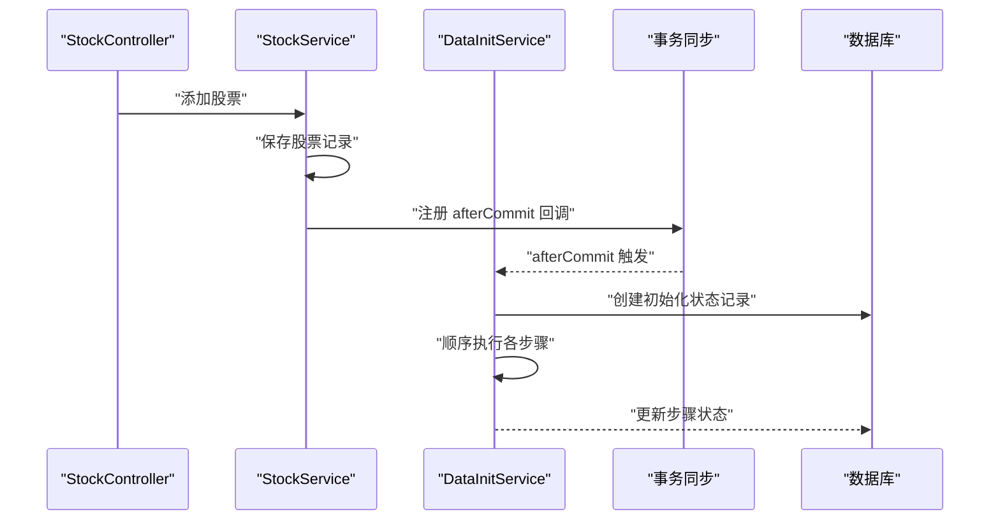
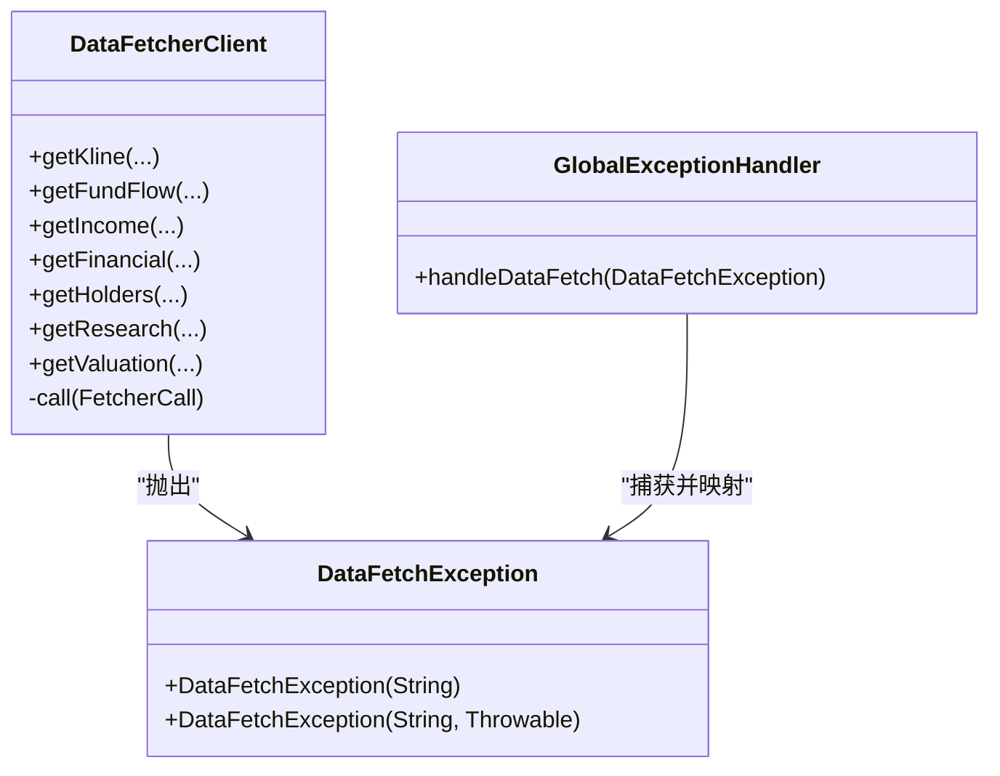
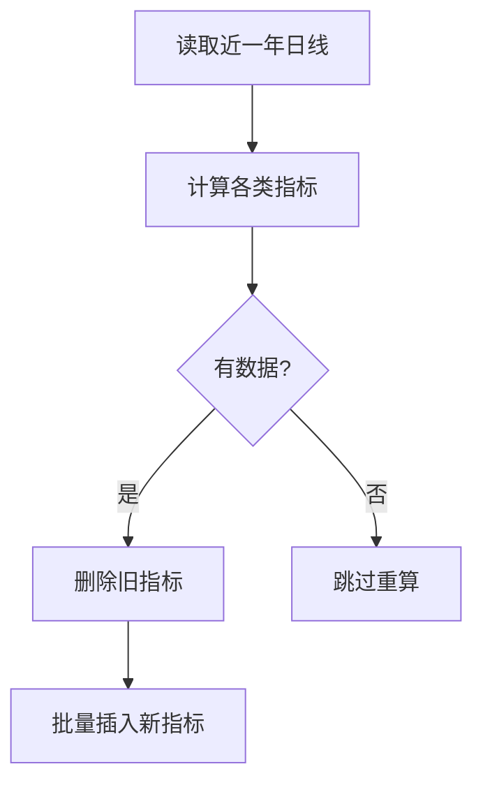
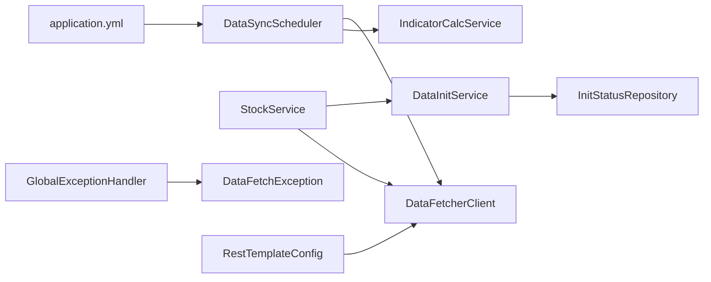

# 数据同步问题

<cite>
**本文引用的文件**
- [backend/src/main/java/com/stock/scheduler/DataSyncScheduler.java](file://backend/src/main/java/com/stock/scheduler/DataSyncScheduler.java)
- [backend/src/main/java/com/stock/service/DataInitService.java](file://backend/src/main/java/com/stock/service/DataInitService.java)
- [backend/src/main/java/com/stock/client/DataFetcherClient.java](file://backend/src/main/java/com/stock/client/DataFetcherClient.java)
- [backend/src/main/java/com/stock/exception/DataFetchException.java](file://backend/src/main/java/com/stock/exception/DataFetchException.java)
- [backend/src/main/resources/application.yml](file://backend/src/main/resources/application.yml)
- [backend/src/main/java/com/stock/repository/InitStatusRepository.java](file://backend/src/main/java/com/stock/repository/InitStatusRepository.java)
- [backend/src/main/java/com/stock/entity/InitStatus.java](file://backend/src/main/java/com/stock/entity/InitStatus.java)
- [backend/src/main/java/com/stock/dto/response/InitStatusResponse.java](file://backend/src/main/java/com/stock/dto/response/InitStatusResponse.java)
- [backend/src/main/java/com/stock/scheduler/AlertCheckScheduler.java](file://backend/src/main/java/com/stock/scheduler/AlertCheckScheduler.java)
- [backend/src/main/java/com/stock/exception/GlobalExceptionHandler.java](file://backend/src/main/java/com/stock/exception/GlobalExceptionHandler.java)
- [backend/src/main/java/com/stock/service/IndicatorCalcService.java](file://backend/src/main/java/com/stock/service/IndicatorCalcService.java)
- [backend/src/main/java/com/stock/config/RestTemplateConfig.java](file://backend/src/main/java/com/stock/config/RestTemplateConfig.java)
- [backend/src/main/java/com/stock/controller/StockController.java](file://backend/src/main/java/com/stock/controller/StockController.java)
- [backend/src/main/java/com/stock/service/StockService.java](file://backend/src/main/java/com/stock/service/StockService.java)
- [data-fetcher/app.py](file://data-fetcher/app.py)
</cite>

## 目录
1. [简介](#简介)
2. [项目结构](#项目结构)
3. [核心组件](#核心组件)
4. [架构总览](#架构总览)
5. [详细组件分析](#详细组件分析)
6. [依赖分析](#依赖分析)
7. [性能考虑](#性能考虑)
8. [故障排除指南](#故障排除指南)
9. [结论](#结论)
10. [附录](#附录)

## 简介
本指南聚焦于数据同步问题的故障排除，覆盖定时任务执行失败、数据初始化中断、数据获取器连接异常、数据转换错误等问题的诊断与解决方法。内容包括调度器配置检查、数据管道监控、异常重试机制、数据一致性验证以及状态监控与故障恢复策略。目标是帮助运维与开发人员快速定位问题根因并采取有效措施恢复服务。

## 项目结构
后端采用 Spring Boot 架构，数据同步由调度器驱动，通过数据获取器客户端访问外部数据源；初始化流程支持异步与事务边界控制；全局异常处理器统一返回错误响应；前端通过控制器暴露接口查询初始化状态与股票信息。

图表来源
- [backend/src/main/java/com/stock/scheduler/DataSyncScheduler.java:1-238](file://backend/src/main/java/com/stock/scheduler/DataSyncScheduler.java#L1-L238)
- [backend/src/main/java/com/stock/service/DataInitService.java:1-101](file://backend/src/main/java/com/stock/service/DataInitService.java#L1-L101)
- [backend/src/main/java/com/stock/client/DataFetcherClient.java:1-126](file://backend/src/main/java/com/stock/client/DataFetcherClient.java#L1-L126)
- [backend/src/main/resources/application.yml:1-28](file://backend/src/main/resources/application.yml#L1-L28)
- [backend/src/main/java/com/stock/config/RestTemplateConfig.java:1-18](file://backend/src/main/java/com/stock/config/RestTemplateConfig.java#L1-L18)
- [backend/src/main/java/com/stock/controller/StockController.java:1-57](file://backend/src/main/java/com/stock/controller/StockController.java#L1-L57)
- [backend/src/main/java/com/stock/service/StockService.java:1-243](file://backend/src/main/java/com/stock/service/StockService.java#L1-L243)
- [data-fetcher/app.py:1-31](file://data-fetcher/app.py#L1-L31)

章节来源
- [backend/src/main/java/com/stock/scheduler/DataSyncScheduler.java:1-238](file://backend/src/main/java/com/stock/scheduler/DataSyncScheduler.java#L1-L238)
- [backend/src/main/java/com/stock/service/DataInitService.java:1-101](file://backend/src/main/java/com/stock/service/DataInitService.java#L1-L101)
- [backend/src/main/java/com/stock/client/DataFetcherClient.java:1-126](file://backend/src/main/java/com/stock/client/DataFetcherClient.java#L1-L126)
- [backend/src/main/resources/application.yml:1-28](file://backend/src/main/resources/application.yml#L1-L28)
- [backend/src/main/java/com/stock/config/RestTemplateConfig.java:1-18](file://backend/src/main/java/com/stock/config/RestTemplateConfig.java#L1-L18)
- [backend/src/main/java/com/stock/controller/StockController.java:1-57](file://backend/src/main/java/com/stock/controller/StockController.java#L1-L57)
- [backend/src/main/java/com/stock/service/StockService.java:1-243](file://backend/src/main/java/com/stock/service/StockService.java#L1-L243)
- [data-fetcher/app.py:1-31](file://data-fetcher/app.py#L1-L31)

## 核心组件
- 调度器：按配置的 Cron 表达式周期性执行数据同步与指标重算任务，包含日线、资金流、估值研究、周频财务与股东数据、以及技术指标重算。
- 初始化服务：为新增股票创建初始化状态记录，顺序执行各步骤（估值、日线、资金流、利润表、财务、股东、研报、指标），并记录每个步骤的状态。
- 数据获取器客户端：封装对外部数据获取器服务的调用，统一处理空响应与异常包装。
- 全局异常处理器：将数据获取异常映射为统一的错误响应，便于前端与监控系统识别。
- 应用配置：定义调度器 Cron、数据获取器地址与超时、数据库与 H2 控制台等参数。
- 指标计算服务：基于日线数据批量计算多类技术指标，并写入指标表。

章节来源
- [backend/src/main/java/com/stock/scheduler/DataSyncScheduler.java:1-238](file://backend/src/main/java/com/stock/scheduler/DataSyncScheduler.java#L1-L238)
- [backend/src/main/java/com/stock/service/DataInitService.java:1-101](file://backend/src/main/java/com/stock/service/DataInitService.java#L1-L101)
- [backend/src/main/java/com/stock/client/DataFetcherClient.java:1-126](file://backend/src/main/java/com/stock/client/DataFetcherClient.java#L1-L126)
- [backend/src/main/java/com/stock/exception/GlobalExceptionHandler.java:1-33](file://backend/src/main/java/com/stock/exception/GlobalExceptionHandler.java#L1-L33)
- [backend/src/main/resources/application.yml:1-28](file://backend/src/main/resources/application.yml#L1-L28)
- [backend/src/main/java/com/stock/service/IndicatorCalcService.java:1-210](file://backend/src/main/java/com/stock/service/IndicatorCalcService.java#L1-L210)

## 架构总览
数据同步从调度器与初始化流程出发，经由数据获取器客户端访问外部数据服务，再写入数据库。异常在客户端统一捕获并抛出业务异常，由全局异常处理器统一响应。

图表来源
- [backend/src/main/java/com/stock/scheduler/DataSyncScheduler.java:54-82](file://backend/src/main/java/com/stock/scheduler/DataSyncScheduler.java#L54-L82)
- [backend/src/main/java/com/stock/client/DataFetcherClient.java:31-35](file://backend/src/main/java/com/stock/client/DataFetcherClient.java#L31-L35)
- [data-fetcher/app.py:1-31](file://data-fetcher/app.py#L1-L31)

## 详细组件分析

### 调度器组件分析
- 同步任务类型与频率
  - 日线同步：工作日 15:30 执行，按股票逐个增量拉取日线数据。
  - 资金流同步：工作日 16:00 执行，按股票逐个增量拉取最近 90 天资金流。
  - 日常数据同步：工作日 18:00 执行，更新估值与写入研报。
  - 周频数据同步：每周日 2:00 执行，删除旧数据后写入利润表、财务、股东数据。
  - 指标重算：工作日 15:45 执行，基于近一年日线重新计算技术指标。
- 错误处理
  - 每个股票循环内使用 try/catch 记录警告日志，避免单只股票异常影响整体进度。
- 增量逻辑
  - 通过查询各表最大交易日期确定起始时间，防止重复写入。

图表来源
- [backend/src/main/java/com/stock/scheduler/DataSyncScheduler.java:54-82](file://backend/src/main/java/com/stock/scheduler/DataSyncScheduler.java#L54-L82)
- [backend/src/main/java/com/stock/scheduler/DataSyncScheduler.java:84-117](file://backend/src/main/java/com/stock/scheduler/DataSyncScheduler.java#L84-L117)
- [backend/src/main/java/com/stock/scheduler/DataSyncScheduler.java:119-161](file://backend/src/main/java/com/stock/scheduler/DataSyncScheduler.java#L119-L161)
- [backend/src/main/java/com/stock/scheduler/DataSyncScheduler.java:163-214](file://backend/src/main/java/com/stock/scheduler/DataSyncScheduler.java#L163-L214)
- [backend/src/main/java/com/stock/scheduler/DataSyncScheduler.java:216-236](file://backend/src/main/java/com/stock/scheduler/DataSyncScheduler.java#L216-L236)

章节来源
- [backend/src/main/java/com/stock/scheduler/DataSyncScheduler.java:54-236](file://backend/src/main/java/com/stock/scheduler/DataSyncScheduler.java#L54-L236)

### 初始化服务组件分析
- 步骤定义与顺序
  - 估值、日线、资金流、利润表、财务、股东、研报、指标。
- 异步执行与事务边界
  - 使用异步注解启动初始化流程；在新增股票后，注册事务提交后的回调以确保异步线程可见新记录。
- 状态管理
  - 为每只股票与每个步骤创建状态记录，支持查询初始化进度。
- 错误处理
  - 步骤失败时标记为 FAILED 并继续下一个步骤，保证整体可观测性。

图表来源
- [backend/src/main/java/com/stock/controller/StockController.java:29-55](file://backend/src/main/java/com/stock/controller/StockController.java#L29-L55)
- [backend/src/main/java/com/stock/service/StockService.java:145-162](file://backend/src/main/java/com/stock/service/StockService.java#L145-L162)
- [backend/src/main/java/com/stock/service/DataInitService.java:42-71](file://backend/src/main/java/com/stock/service/DataInitService.java#L42-L71)
- [backend/src/main/java/com/stock/repository/InitStatusRepository.java:10-17](file://backend/src/main/java/com/stock/repository/InitStatusRepository.java#L10-L17)
- [backend/src/main/java/com/stock/entity/InitStatus.java:11-29](file://backend/src/main/java/com/stock/entity/InitStatus.java#L11-L29)

章节来源
- [backend/src/main/java/com/stock/service/DataInitService.java:1-101](file://backend/src/main/java/com/stock/service/DataInitService.java#L1-L101)
- [backend/src/main/java/com/stock/service/StockService.java:93-163](file://backend/src/main/java/com/stock/service/StockService.java#L93-L163)
- [backend/src/main/java/com/stock/controller/StockController.java:52-55](file://backend/src/main/java/com/stock/controller/StockController.java#L52-L55)
- [backend/src/main/java/com/stock/repository/InitStatusRepository.java:1-18](file://backend/src/main/java/com/stock/repository/InitStatusRepository.java#L1-L18)
- [backend/src/main/java/com/stock/entity/InitStatus.java:1-30](file://backend/src/main/java/com/stock/entity/InitStatus.java#L1-L30)

### 数据获取器客户端与异常处理
- 客户端职责
  - 统一封装 GET/POST 请求到数据获取器服务，自动拼接查询参数或请求体。
  - 对空响应进行校验并抛出数据获取异常。
- 异常映射
  - 全局异常处理器将数据获取异常映射为 503 响应，便于监控系统识别上游依赖问题。

图表来源
- [backend/src/main/java/com/stock/client/DataFetcherClient.java:1-126](file://backend/src/main/java/com/stock/client/DataFetcherClient.java#L1-L126)
- [backend/src/main/java/com/stock/exception/DataFetchException.java:1-6](file://backend/src/main/java/com/stock/exception/DataFetchException.java#L1-L6)
- [backend/src/main/java/com/stock/exception/GlobalExceptionHandler.java:21-24](file://backend/src/main/java/com/stock/exception/GlobalExceptionHandler.java#L21-L24)

章节来源
- [backend/src/main/java/com/stock/client/DataFetcherClient.java:1-126](file://backend/src/main/java/com/stock/client/DataFetcherClient.java#L1-L126)
- [backend/src/main/java/com/stock/exception/DataFetchException.java:1-6](file://backend/src/main/java/com/stock/exception/DataFetchException.java#L1-L6)
- [backend/src/main/java/com/stock/exception/GlobalExceptionHandler.java:1-33](file://backend/src/main/java/com/stock/exception/GlobalExceptionHandler.java#L1-L33)

### 技术指标重算流程
- 输入：近一年日线数据。
- 输出：对应日期的技术指标集合（MA、MACD、RSI、KDJ、布林带）。
- 流程：先删除旧指标，再批量插入新指标，确保一致性。

图表来源
- [backend/src/main/java/com/stock/scheduler/DataSyncScheduler.java:216-236](file://backend/src/main/java/com/stock/scheduler/DataSyncScheduler.java#L216-L236)
- [backend/src/main/java/com/stock/service/IndicatorCalcService.java:15-64](file://backend/src/main/java/com/stock/service/IndicatorCalcService.java#L15-L64)

章节来源
- [backend/src/main/java/com/stock/scheduler/DataSyncScheduler.java:216-236](file://backend/src/main/java/com/stock/scheduler/DataSyncScheduler.java#L216-L236)
- [backend/src/main/java/com/stock/service/IndicatorCalcService.java:1-210](file://backend/src/main/java/com/stock/service/IndicatorCalcService.java#L1-L210)

## 依赖分析
- 调度器依赖多个仓储与数据获取器客户端，负责跨表的增量写入与指标重算。
- 初始化服务依赖状态仓储与事务服务，保障步骤状态可追踪。
- 客户端依赖 RestTemplate 配置，受超时设置影响稳定性。
- 全局异常处理器依赖自定义异常类型，统一对外错误语义。

图表来源
- [backend/src/main/java/com/stock/scheduler/DataSyncScheduler.java:1-238](file://backend/src/main/java/com/stock/scheduler/DataSyncScheduler.java#L1-L238)
- [backend/src/main/java/com/stock/service/DataInitService.java:1-101](file://backend/src/main/java/com/stock/service/DataInitService.java#L1-L101)
- [backend/src/main/java/com/stock/client/DataFetcherClient.java:1-126](file://backend/src/main/java/com/stock/client/DataFetcherClient.java#L1-L126)
- [backend/src/main/java/com/stock/exception/GlobalExceptionHandler.java:1-33](file://backend/src/main/java/com/stock/exception/GlobalExceptionHandler.java#L1-L33)
- [backend/src/main/resources/application.yml:1-28](file://backend/src/main/resources/application.yml#L1-L28)
- [backend/src/main/java/com/stock/config/RestTemplateConfig.java:1-18](file://backend/src/main/java/com/stock/config/RestTemplateConfig.java#L1-L18)

章节来源
- [backend/src/main/java/com/stock/scheduler/DataSyncScheduler.java:1-238](file://backend/src/main/java/com/stock/scheduler/DataSyncScheduler.java#L1-L238)
- [backend/src/main/java/com/stock/service/DataInitService.java:1-101](file://backend/src/main/java/com/stock/service/DataInitService.java#L1-L101)
- [backend/src/main/java/com/stock/client/DataFetcherClient.java:1-126](file://backend/src/main/java/com/stock/client/DataFetcherClient.java#L1-L126)
- [backend/src/main/java/com/stock/exception/GlobalExceptionHandler.java:1-33](file://backend/src/main/java/com/stock/exception/GlobalExceptionHandler.java#L1-L33)
- [backend/src/main/resources/application.yml:1-28](file://backend/src/main/resources/application.yml#L1-L28)
- [backend/src/main/java/com/stock/config/RestTemplateConfig.java:1-18](file://backend/src/main/java/com/stock/config/RestTemplateConfig.java#L1-L18)

## 性能考虑
- 增量同步：通过查询最大交易日期避免重复写入，减少 IO 与网络开销。
- 限流与退避：在每次股票处理后增加短暂休眠，降低外部服务压力与自身并发峰值。
- 批量写入：将一组数据转换为实体后一次性保存，减少事务次数。
- 指标重算：仅对近一年数据重算，控制计算复杂度与写入量。
- 连接超时：合理设置连接与读取超时，避免长时间阻塞导致任务堆积。

## 故障排除指南

### 一、定时任务执行失败
- 现象
  - 某些任务未在预期时间运行或运行后立即退出。
- 排查步骤
  1) 检查调度器 Cron 配置是否正确生效
     - 参考路径：[application.yml:23-27](file://backend/src/main/resources/application.yml#L23-L27)
  2) 查看任务日志
     - 关注任务开始与结束日志，确认是否被异常吞没
     - 参考路径：[DataSyncScheduler.java:54-82](file://backend/src/main/java/com/stock/scheduler/DataSyncScheduler.java#L54-L82)
  3) 检查任务内部异常
     - 任务中使用 try/catch 记录警告日志，逐只股票排查
     - 参考路径：[DataSyncScheduler.java:78-80](file://backend/src/main/java/com/stock/scheduler/DataSyncScheduler.java#L78-L80)
  4) 核对数据库连接与事务
     - 确认 JPA 配置与 H2 控制台可用
     - 参考路径：[application.yml:5-17](file://backend/src/main/resources/application.yml#L5-L17)
- 解决建议
  - 修正 Cron 表达式或调整任务间隔
  - 在任务中补充更详细的异常堆栈日志以便定位
  - 对外部依赖增加重试与熔断策略（见“异常重试机制”）

章节来源
- [backend/src/main/resources/application.yml:23-27](file://backend/src/main/resources/application.yml#L23-L27)
- [backend/src/main/java/com/stock/scheduler/DataSyncScheduler.java:54-82](file://backend/src/main/java/com/stock/scheduler/DataSyncScheduler.java#L54-L82)
- [backend/src/main/java/com/stock/scheduler/DataSyncScheduler.java:78-80](file://backend/src/main/java/com/stock/scheduler/DataSyncScheduler.java#L78-L80)
- [backend/src/main/resources/application.yml:5-17](file://backend/src/main/resources/application.yml#L5-L17)

### 二、数据初始化中断
- 现象
  - 新增股票后初始化未完成或部分步骤失败。
- 排查步骤
  1) 查询初始化状态
     - 通过控制器接口获取指定股票的初始化状态
     - 参考路径：[StockController.java:52-55](file://backend/src/main/java/com/stock/controller/StockController.java#L52-L55)
     - 状态模型参考：[InitStatus.java:11-29](file://backend/src/main/java/com/stock/entity/InitStatus.java#L11-L29)，[InitStatusResponse.java:1-12](file://backend/src/main/java/com/stock/dto/response/InitStatusResponse.java#L1-L12)
  2) 检查事务回调
     - 确认 afterCommit 回调是否触发，避免异步线程看不到新记录
     - 参考路径：[StockService.java:145-162](file://backend/src/main/java/com/stock/service/StockService.java#L145-L162)
  3) 分析失败步骤
     - 初始化服务对每个步骤单独标记状态，定位具体失败步骤
     - 参考路径：[DataInitService.java:55-71](file://backend/src/main/java/com/stock/service/DataInitService.java#L55-L71)
- 解决建议
  - 对失败步骤进行重试或人工干预后重新触发初始化
  - 在步骤间增加更细粒度的健康检查与告警

章节来源
- [backend/src/main/java/com/stock/controller/StockController.java:52-55](file://backend/src/main/java/com/stock/controller/StockController.java#L52-L55)
- [backend/src/main/java/com/stock/entity/InitStatus.java:11-29](file://backend/src/main/java/com/stock/entity/InitStatus.java#L11-L29)
- [backend/src/main/java/com/stock/dto/response/InitStatusResponse.java:1-12](file://backend/src/main/java/com/stock/dto/response/InitStatusResponse.java#L1-L12)
- [backend/src/main/java/com/stock/service/StockService.java:145-162](file://backend/src/main/java/com/stock/service/StockService.java#L145-L162)
- [backend/src/main/java/com/stock/service/DataInitService.java:55-71](file://backend/src/main/java/com/stock/service/DataInitService.java#L55-L71)

### 三、数据获取器连接异常
- 现象
  - 调度器或初始化过程中出现连接超时、读取超时或空响应。
- 排查步骤
  1) 检查数据获取器地址与端口
     - 参考路径：[application.yml:20-21](file://backend/src/main/resources/application.yml#L20-L21)
  2) 校验数据获取器服务健康
     - 参考路径：[data-fetcher/app.py:23-25](file://data-fetcher/app.py#L23-L25)
  3) 检查客户端超时配置
     - 参考路径：[RestTemplateConfig.java:10-16](file://backend/src/main/java/com/stock/config/RestTemplateConfig.java#L10-L16)
  4) 查看异常映射
     - 全局异常处理器将数据获取异常映射为 503
     - 参考路径：[GlobalExceptionHandler.java:21-24](file://backend/src/main/java/com/stock/exception/GlobalExceptionHandler.java#L21-L24)
- 解决建议
  - 提升超时阈值或增加重试次数
  - 将数据获取器部署在低延迟网络区域
  - 对外部依赖增加熔断与降级策略

章节来源
- [backend/src/main/resources/application.yml:20-21](file://backend/src/main/resources/application.yml#L20-L21)
- [data-fetcher/app.py:23-25](file://data-fetcher/app.py#L23-L25)
- [backend/src/main/java/com/stock/config/RestTemplateConfig.java:10-16](file://backend/src/main/java/com/stock/config/RestTemplateConfig.java#L10-L16)
- [backend/src/main/java/com/stock/exception/GlobalExceptionHandler.java:21-24](file://backend/src/main/java/com/stock/exception/GlobalExceptionHandler.java#L21-L24)

### 四、数据转换错误
- 现象
  - 从外部接口获取的数据无法映射为本地实体，或字段缺失导致空指针。
- 排查步骤
  1) 核对 DTO 结构
     - 参考日线与财务等响应 DTO 的字段定义
     - 参考路径：[KlineDataResponse.java:1-10](file://backend/src/main/java/com/stock/dto/fetcher/KlineDataResponse.java#L1-L10)，[FinancialDataResponse.java:1-10](file://backend/src/main/java/com/stock/dto/fetcher/FinancialDataResponse.java#L1-L10)
  2) 检查客户端空响应校验
     - 客户端对空响应抛出数据获取异常
     - 参考路径：[DataFetcherClient.java:112-124](file://backend/src/main/java/com/stock/client/DataFetcherClient.java#L112-L124)
  3) 核对实体字段与精度
     - 指标计算服务对数值进行精度处理，避免入库异常
     - 参考路径：[IndicatorCalcService.java:66-78](file://backend/src/main/java/com/stock/service/IndicatorCalcService.java#L66-L78)
- 解决建议
  - 在客户端增加对关键字段的非空校验与默认值处理
  - 对外部接口版本变更建立兼容层与测试用例

章节来源
- [backend/src/main/java/com/stock/dto/fetcher/KlineDataResponse.java:1-10](file://backend/src/main/java/com/stock/dto/fetcher/KlineDataResponse.java#L1-L10)
- [backend/src/main/java/com/stock/dto/fetcher/FinancialDataResponse.java:1-10](file://backend/src/main/java/com/stock/dto/fetcher/FinancialDataResponse.java#L1-L10)
- [backend/src/main/java/com/stock/client/DataFetcherClient.java:112-124](file://backend/src/main/java/com/stock/client/DataFetcherClient.java#L112-L124)
- [backend/src/main/java/com/stock/service/IndicatorCalcService.java:66-78](file://backend/src/main/java/com/stock/service/IndicatorCalcService.java#L66-L78)

### 五、调度器配置检查清单
- Cron 表达式是否符合预期工作日与时间窗口
  - 参考路径：[application.yml:23-27](file://backend/src/main/resources/application.yml#L23-L27)
- 任务是否启用事务注解，避免半写入
  - 参考路径：[DataSyncScheduler.java:55-56](file://backend/src/main/java/com/stock/scheduler/DataSyncScheduler.java#L55-L56)
- 是否存在任务间资源竞争（如外部接口限流）
  - 参考路径：[DataSyncScheduler.java:77-113](file://backend/src/main/java/com/stock/scheduler/DataSyncScheduler.java#L77-L113)

章节来源
- [backend/src/main/resources/application.yml:23-27](file://backend/src/main/resources/application.yml#L23-L27)
- [backend/src/main/java/com/stock/scheduler/DataSyncScheduler.java:55-56](file://backend/src/main/java/com/stock/scheduler/DataSyncScheduler.java#L55-L56)
- [backend/src/main/java/com/stock/scheduler/DataSyncScheduler.java:77-113](file://backend/src/main/java/com/stock/scheduler/DataSyncScheduler.java#L77-L113)

### 六、数据管道监控
- 初始化状态监控
  - 通过控制器接口查询初始化进度
  - 参考路径：[StockController.java:52-55](file://backend/src/main/java/com/stock/controller/StockController.java#L52-L55)，[DataInitService.java:73-84](file://backend/src/main/java/com/stock/service/DataInitService.java#L73-L84)
- 调度器执行监控
  - 通过日志观察任务开始/结束与异常告警
  - 参考路径：[DataSyncScheduler.java:56-82](file://backend/src/main/java/com/stock/scheduler/DataSyncScheduler.java#L56-L82)
- 外部依赖健康监控
  - 数据获取器健康端点
  - 参考路径：[data-fetcher/app.py:23-25](file://data-fetcher/app.py#L23-L25)

章节来源
- [backend/src/main/java/com/stock/controller/StockController.java:52-55](file://backend/src/main/java/com/stock/controller/StockController.java#L52-L55)
- [backend/src/main/java/com/stock/service/DataInitService.java:73-84](file://backend/src/main/java/com/stock/service/DataInitService.java#L73-L84)
- [backend/src/main/java/com/stock/scheduler/DataSyncScheduler.java:56-82](file://backend/src/main/java/com/stock/scheduler/DataSyncScheduler.java#L56-L82)
- [data-fetcher/app.py:23-25](file://data-fetcher/app.py#L23-L25)

### 七、异常重试机制
- 当前实现
  - 调度器与初始化服务在单次执行中未内置自动重试，仅记录警告日志并继续后续步骤。
- 建议方案
  - 对外部调用增加指数退避重试与熔断保护
  - 对数据库写入失败进行幂等处理与补偿任务
  - 对关键步骤失败触发告警与人工介入流程

章节来源
- [backend/src/main/java/com/stock/scheduler/DataSyncScheduler.java:78-80](file://backend/src/main/java/com/stock/scheduler/DataSyncScheduler.java#L78-L80)
- [backend/src/main/java/com/stock/service/DataInitService.java:60-62](file://backend/src/main/java/com/stock/service/DataInitService.java#L60-L62)

### 八、数据一致性验证
- 增量起点校验
  - 通过查询各表最大交易日期确保不重复写入
  - 参考路径：[DataSyncScheduler.java:61-63](file://backend/src/main/java/com/stock/scheduler/DataSyncScheduler.java#L61-L63)，[DataSyncScheduler.java:91-93](file://backend/src/main/java/com/stock/scheduler/DataSyncScheduler.java#L91-L93)
- 删除旧数据策略
  - 周频任务先删除旧记录再写入，避免历史数据残留
  - 参考路径：[DataSyncScheduler.java:177-179](file://backend/src/main/java/com/stock/scheduler/DataSyncScheduler.java#L177-L179)，[DataSyncScheduler.java:192-194](file://backend/src/main/java/com/stock/scheduler/DataSyncScheduler.java#L192-L194)，[DataSyncScheduler.java:206-208](file://backend/src/main/java/com/stock/scheduler/DataSyncScheduler.java#L206-L208)
- 指标重算一致性
  - 先删除旧指标，再批量写入新指标
  - 参考路径：[DataSyncScheduler.java:228-230](file://backend/src/main/java/com/stock/scheduler/DataSyncScheduler.java#L228-L230)

章节来源
- [backend/src/main/java/com/stock/scheduler/DataSyncScheduler.java:61-63](file://backend/src/main/java/com/stock/scheduler/DataSyncScheduler.java#L61-L63)
- [backend/src/main/java/com/stock/scheduler/DataSyncScheduler.java:91-93](file://backend/src/main/java/com/stock/scheduler/DataSyncScheduler.java#L91-L93)
- [backend/src/main/java/com/stock/scheduler/DataSyncScheduler.java:177-179](file://backend/src/main/java/com/stock/scheduler/DataSyncScheduler.java#L177-L179)
- [backend/src/main/java/com/stock/scheduler/DataSyncScheduler.java:192-194](file://backend/src/main/java/com/stock/scheduler/DataSyncScheduler.java#L192-L194)
- [backend/src/main/java/com/stock/scheduler/DataSyncScheduler.java:206-208](file://backend/src/main/java/com/stock/scheduler/DataSyncScheduler.java#L206-L208)
- [backend/src/main/java/com/stock/scheduler/DataSyncScheduler.java:228-230](file://backend/src/main/java/com/stock/scheduler/DataSyncScheduler.java#L228-L230)

### 九、数据同步状态监控与故障恢复策略
- 状态监控
  - 初始化状态：通过接口查询已完成/失败步骤
  - 调度器日志：观察任务执行与异常
  - 外部服务健康：定期探测健康端点
- 故障恢复
  - 对失败步骤进行重放或人工修复后重新初始化
  - 对外部依赖异常触发告警并切换备用节点或降级策略
  - 对数据库异常进行回滚与补偿写入

章节来源
- [backend/src/main/java/com/stock/controller/StockController.java:52-55](file://backend/src/main/java/com/stock/controller/StockController.java#L52-L55)
- [backend/src/main/java/com/stock/service/DataInitService.java:73-84](file://backend/src/main/java/com/stock/service/DataInitService.java#L73-L84)
- [backend/src/main/java/com/stock/scheduler/DataSyncScheduler.java:56-82](file://backend/src/main/java/com/stock/scheduler/DataSyncScheduler.java#L56-L82)
- [data-fetcher/app.py:23-25](file://data-fetcher/app.py#L23-L25)

## 结论
本指南围绕调度器、初始化流程、数据获取器与异常处理四个维度，提供了系统化的故障排除方法与恢复策略。通过配置检查、状态监控、异常重试与一致性验证，可显著提升数据同步的稳定性与可观测性。建议在生产环境中进一步引入自动重试、熔断与补偿机制，以增强对瞬时故障的韧性。

## 附录
- 相关配置与接口路径
  - 调度器 Cron：[application.yml:23-27](file://backend/src/main/resources/application.yml#L23-L27)
  - 数据获取器地址与超时：[application.yml:20-22](file://backend/src/main/resources/application.yml#L20-L22)，[RestTemplateConfig.java:10-16](file://backend/src/main/java/com/stock/config/RestTemplateConfig.java#L10-L16)
  - 初始化状态查询接口：[StockController.java:52-55](file://backend/src/main/java/com/stock/controller/StockController.java#L52-L55)
  - 外部服务健康端点：[data-fetcher/app.py:23-25](file://data-fetcher/app.py#L23-L25)