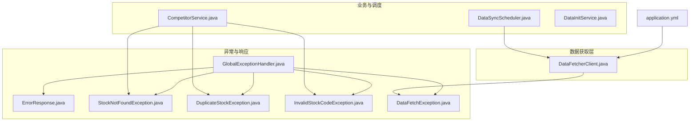
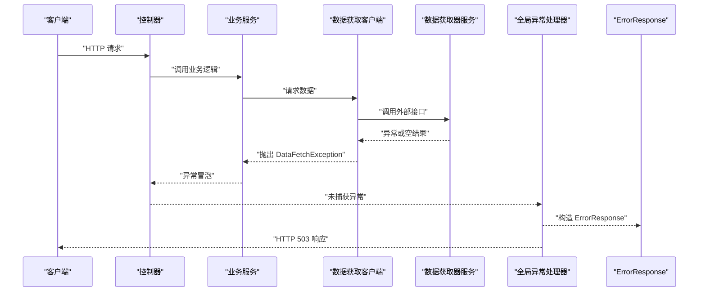
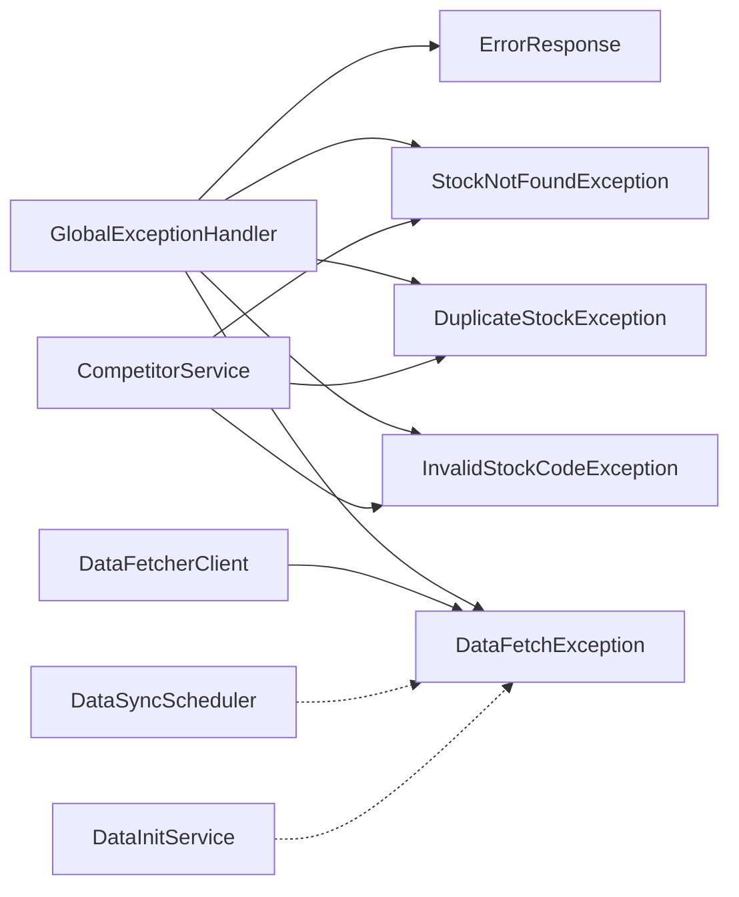

# 错误码对照表

<cite>
**本文引用的文件**
- [ErrorResponse.java](file://backend/src/main/java/com/stock/exception/ErrorResponse.java)
- [GlobalExceptionHandler.java](file://backend/src/main/java/com/stock/exception/GlobalExceptionHandler.java)
- [DataFetchException.java](file://backend/src/main/java/com/stock/exception/DataFetchException.java)
- [DuplicateStockException.java](file://backend/src/main/java/com/stock/exception/DuplicateStockException.java)
- [StockNotFoundException.java](file://backend/src/main/java/com/stock/exception/StockNotFoundException.java)
- [InvalidStockCodeException.java](file://backend/src/main/java/com/stock/exception/InvalidStockCodeException.java)
- [DataFetcherClient.java](file://backend/src/main/java/com/stock/client/DataFetcherClient.java)
- [application.yml](file://backend/src/main/resources/application.yml)
- [CompetitorService.java](file://backend/src/main/java/com/stock/service/CompetitorService.java)
- [DataSyncScheduler.java](file://backend/src/main/java/com/stock/scheduler/DataSyncScheduler.java)
- [DataInitService.java](file://backend/src/main/java/com/stock/service/DataInitService.java)
</cite>

## 目录
1. [简介](#简介)
2. [项目结构](#项目结构)
3. [核心组件](#核心组件)
4. [架构总览](#架构总览)
5. [详细组件分析](#详细组件分析)
6. [依赖分析](#依赖分析)
7. [性能考虑](#性能考虑)
8. [故障排查指南](#故障排查指南)
9. [结论](#结论)
10. [附录](#附录)

## 简介
本文件旨在为股票交易系统提供完整的错误码对照表与错误消息说明，覆盖以下内容：
- HTTP 状态码与业务异常码的对应关系
- 数据获取器错误码（DataFetcher）的来源与含义
- 关键异常类型：StockNotFoundException、DuplicateStockException、InvalidStockCodeException、DataFetchException 的语义、触发场景与处理建议
- 错误日志的关键信息识别方法与快速定位技巧

## 项目结构
围绕错误处理与异常管理的相关模块如下：
- 异常定义与统一响应体：exception 包
- 全局异常处理器：GlobalExceptionHandler
- 统一错误响应体：ErrorResponse
- 数据获取客户端：DataFetcherClient
- 配置：application.yml 中的数据源与调度配置
- 业务服务与定时任务：CompetitorService、DataSyncScheduler、DataInitService

图表来源
- [GlobalExceptionHandler.java:1-33](file://backend/src/main/java/com/stock/exception/GlobalExceptionHandler.java#L1-L33)
- [ErrorResponse.java:1-8](file://backend/src/main/java/com/stock/exception/ErrorResponse.java#L1-L8)
- [StockNotFoundException.java:1-6](file://backend/src/main/java/com/stock/exception/StockNotFoundException.java#L1-L6)
- [DuplicateStockException.java:1-5](file://backend/src/main/java/com/stock/exception/DuplicateStockException.java#L1-L5)
- [InvalidStockCodeException.java:1-5](file://backend/src/main/java/com/stock/exception/InvalidStockCodeException.java#L1-L5)
- [DataFetchException.java:1-6](file://backend/src/main/java/com/stock/exception/DataFetchException.java#L1-L6)
- [DataFetcherClient.java:1-126](file://backend/src/main/java/com/stock/client/DataFetcherClient.java#L1-L126)
- [application.yml:1-28](file://backend/src/main/resources/application.yml#L1-L28)
- [CompetitorService.java:1-84](file://backend/src/main/java/com/stock/service/CompetitorService.java#L1-L84)
- [DataSyncScheduler.java:1-238](file://backend/src/main/java/com/stock/scheduler/DataSyncScheduler.java#L1-L238)
- [DataInitService.java:1-101](file://backend/src/main/java/com/stock/service/DataInitService.java#L1-L101)

章节来源
- [GlobalExceptionHandler.java:1-33](file://backend/src/main/java/com/stock/exception/GlobalExceptionHandler.java#L1-L33)
- [ErrorResponse.java:1-8](file://backend/src/main/java/com/stock/exception/ErrorResponse.java#L1-L8)
- [application.yml:1-28](file://backend/src/main/resources/application.yml#L1-L28)

## 核心组件
- 统一错误响应体：ErrorResponse 提供 code、message、timestamp 字段，便于前后端一致化处理。
- 全局异常处理器：根据异常类型映射到标准 HTTP 状态码，并返回 ErrorResponse。
- 业务异常类型：StockNotFoundException、DuplicateStockException、InvalidStockCodeException、DataFetchException。
- 数据获取客户端：DataFetcherClient 在调用外部数据接口时捕获异常并抛出 DataFetchException。

章节来源
- [ErrorResponse.java:1-8](file://backend/src/main/java/com/stock/exception/ErrorResponse.java#L1-L8)
- [GlobalExceptionHandler.java:1-33](file://backend/src/main/java/com/stock/exception/GlobalExceptionHandler.java#L1-L33)
- [DataFetcherClient.java:112-124](file://backend/src/main/java/com/stock/client/DataFetcherClient.java#L112-L124)

## 架构总览
全局异常处理器在控制器层之上拦截业务异常，统一转换为 HTTP 响应；数据获取层通过 DataFetcherClient 调用外部服务，异常统一包装为 DataFetchException 并由处理器映射为 HTTP 503。

图表来源
- [GlobalExceptionHandler.java:21-24](file://backend/src/main/java/com/stock/exception/GlobalExceptionHandler.java#L21-L24)
- [DataFetcherClient.java:112-124](file://backend/src/main/java/com/stock/client/DataFetcherClient.java#L112-L124)

## 详细组件分析

### HTTP 状态码与业务异常码对照表
- 400 Bad Request：参数校验失败、无效股票代码
- 404 Not Found：股票不存在
- 409 Conflict：重复的股票或竞品关系
- 503 Service Unavailable：数据获取器调用失败或返回空值
- 201 Created：新增资源成功（用于创建接口）
- 204 No Content：删除资源成功（用于删除接口）

章节来源
- [GlobalExceptionHandler.java:9-31](file://backend/src/main/java/com/stock/exception/GlobalExceptionHandler.java#L9-L31)
- [StockController.java:29-40](file://backend/src/main/java/com/stock/controller/StockController.java#L29-L40)

### 统一错误响应体 ErrorResponse
- 字段：code（整数）、message（字符串）、timestamp（时间戳）
- 用途：标准化错误输出，便于前端统一处理

章节来源
- [ErrorResponse.java:1-8](file://backend/src/main/java/com/stock/exception/ErrorResponse.java#L1-L8)

### 全局异常处理器 GlobalExceptionHandler
- StockNotFoundException → HTTP 404
- DuplicateStockException → HTTP 409
- InvalidStockCodeException → HTTP 400
- DataFetchException → HTTP 503
- 参数校验异常 MethodArgumentNotValidException → HTTP 400（字段名: 错误信息）

章节来源
- [GlobalExceptionHandler.java:9-31](file://backend/src/main/java/com/stock/exception/GlobalExceptionHandler.java#L9-L31)

### 关键异常类型与处理建议

#### StockNotFoundException（股票不存在）
- 触发场景
  - 查询或操作不存在的股票 ID 或代码
  - 竞品服务中对不存在的股票进行查询或添加
- 处理建议
  - 前端提示“股票不存在”，引导用户检查输入
  - 后端记录异常上下文（如 stockId、code），便于审计
- 参考实现位置
  - [StockNotFoundException.java:1-6](file://backend/src/main/java/com/stock/exception/StockNotFoundException.java#L1-L6)
  - [CompetitorService.java:34-36](file://backend/src/main/java/com/stock/service/CompetitorService.java#L34-L36)

章节来源
- [StockNotFoundException.java:1-6](file://backend/src/main/java/com/stock/exception/StockNotFoundException.java#L1-L6)
- [CompetitorService.java:34-36](file://backend/src/main/java/com/stock/service/CompetitorService.java#L34-L36)

#### DuplicateStockException（重复的股票或竞品关系）
- 触发场景
  - 新增重复的股票或重复的竞品关系
- 处理建议
  - 前端提示“已存在，请勿重复添加”
  - 后端记录重复项的 code 或关系，避免后续重复尝试
- 参考实现位置
  - [DuplicateStockException.java:1-5](file://backend/src/main/java/com/stock/exception/DuplicateStockException.java#L1-L5)
  - [CompetitorService.java:65-67](file://backend/src/main/java/com/stock/service/CompetitorService.java#L65-L67)

章节来源
- [DuplicateStockException.java:1-5](file://backend/src/main/java/com/stock/exception/DuplicateStockException.java#L1-L5)
- [CompetitorService.java:65-67](file://backend/src/main/java/com/stock/service/CompetitorService.java#L65-L67)

#### InvalidStockCodeException（无效的股票代码）
- 触发场景
  - 将自身作为竞品添加
- 处理建议
  - 前端提示“不能添加自身为竞品”
  - 后端记录 code，避免后续无效尝试
- 参考实现位置
  - [InvalidStockCodeException.java:1-5](file://backend/src/main/java/com/stock/exception/InvalidStockCodeException.java#L1-L5)
  - [CompetitorService.java:54-56](file://backend/src/main/java/com/stock/service/CompetitorService.java#L54-L56)

章节来源
- [InvalidStockCodeException.java:1-5](file://backend/src/main/java/com/stock/exception/InvalidStockCodeException.java#L1-L5)
- [CompetitorService.java:54-56](file://backend/src/main/java/com/stock/service/CompetitorService.java#L54-L56)

#### DataFetchException（数据获取器错误）
- 触发场景
  - DataFetcherClient 调用外部数据接口时发生异常或返回空值
- 处理建议
  - 前端提示“数据服务暂时不可用，请稍后重试”
  - 后端记录异常堆栈与调用参数，定位具体接口与时间段
- 参考实现位置
  - [DataFetchException.java:1-6](file://backend/src/main/java/com/stock/exception/DataFetchException.java#L1-L6)
  - [DataFetcherClient.java:112-124](file://backend/src/main/java/com/stock/client/DataFetcherClient.java#L112-L124)

章节来源
- [DataFetchException.java:1-6](file://backend/src/main/java/com/stock/exception/DataFetchException.java#L1-L6)
- [DataFetcherClient.java:112-124](file://backend/src/main/java/com/stock/client/DataFetcherClient.java#L112-L124)

### 数据获取器错误码与含义
- 来源：DataFetcherClient 在调用外部数据接口时捕获异常并抛出 DataFetchException
- 错误码映射：DataFetchException → HTTP 503 Service Unavailable
- 常见原因
  - 外部数据接口超时或不可达
  - 返回空响应或格式异常
- 处理建议
  - 增加重试机制与熔断策略
  - 记录请求参数与时间窗口，便于定位问题

章节来源
- [DataFetcherClient.java:112-124](file://backend/src/main/java/com/stock/client/DataFetcherClient.java#L112-L124)
- [GlobalExceptionHandler.java:21-24](file://backend/src/main/java/com/stock/exception/GlobalExceptionHandler.java#L21-L24)

### 参数校验错误码
- 来源：Spring MVC 对 @Valid 参数校验失败
- 映射：HTTP 400，消息格式为“字段名: 错误信息”
- 处理建议
  - 前端逐项高亮显示错误字段
  - 后端记录字段与错误详情，便于修复

章节来源
- [GlobalExceptionHandler.java:25-31](file://backend/src/main/java/com/stock/exception/GlobalExceptionHandler.java#L25-L31)

## 依赖分析
- 全局异常处理器依赖各业务异常类型，统一返回 ErrorResponse
- DataFetcherClient 依赖外部数据获取器服务，异常统一包装为 DataFetchException
- 业务服务在查询不到股票或重复关系时抛出相应异常
- 定时任务在同步数据时记录警告日志，便于问题定位

图表来源
- [GlobalExceptionHandler.java:1-33](file://backend/src/main/java/com/stock/exception/GlobalExceptionHandler.java#L1-L33)
- [DataFetcherClient.java:1-126](file://backend/src/main/java/com/stock/client/DataFetcherClient.java#L1-L126)
- [CompetitorService.java:1-84](file://backend/src/main/java/com/stock/service/CompetitorService.java#L1-L84)
- [DataSyncScheduler.java:1-238](file://backend/src/main/java/com/stock/scheduler/DataSyncScheduler.java#L1-L238)
- [DataInitService.java:1-101](file://backend/src/main/java/com/stock/service/DataInitService.java#L1-L101)

## 性能考虑
- HTTP 201/204 仅用于资源创建与删除，不涉及复杂计算，性能开销低
- 503 通常由外部数据接口超时或不可用导致，需结合重试与限流策略
- 日志记录应避免高频写入敏感信息，注意脱敏与采样

## 故障排查指南
- 快速定位步骤
  - 检查 HTTP 状态码：400 表示参数问题；404/409 表示业务状态；503 表示数据获取器问题
  - 查看错误消息：400 的“字段名: 错误信息”可直接定位问题字段
  - 查看日志：DataSyncScheduler 与 DataInitService 在失败时会记录警告日志，包含股票代码与错误信息
- 关键日志识别
  - DataSyncScheduler：包含“Failed to sync ... for ...: ...”的日志
  - DataInitService：包含“Init step ... failed for stock ...: ...”的日志
- 处理建议
  - 对于 503：检查数据获取器服务地址与网络连通性，查看 application.yml 中的 stock.data-fetcher.url 配置
  - 对于 400/404/409：核对输入参数与业务状态，必要时回滚事务或提示用户修正

章节来源
- [DataSyncScheduler.java:78-80](file://backend/src/main/java/com/stock/scheduler/DataSyncScheduler.java#L78-L80)
- [DataSyncScheduler.java:113-115](file://backend/src/main/java/com/stock/scheduler/DataSyncScheduler.java#L113-L115)
- [DataSyncScheduler.java:157-159](file://backend/src/main/java/com/stock/scheduler/DataSyncScheduler.java#L157-L159)
- [DataSyncScheduler.java:210-212](file://backend/src/main/java/com/stock/scheduler/DataSyncScheduler.java#L210-L212)
- [DataInitService.java:60-63](file://backend/src/main/java/com/stock/service/DataInitService.java#L60-L63)
- [application.yml:19-22](file://backend/src/main/resources/application.yml#L19-L22)

## 结论
通过统一的异常处理与错误响应机制，系统能够以标准 HTTP 状态码与 ErrorResponse 向前端反馈错误信息。针对不同异常类型，建议采用差异化的处理策略：参数校验错误优先提示用户修正；业务状态错误（404/409）提示用户检查输入或状态；数据获取器错误（503）建议采用重试与熔断策略并加强日志监控。

## 附录
- 配置参考
  - 数据获取器地址：application.yml 中的 stock.data-fetcher.url
- 常见问题
  - 为什么出现 503？可能由于外部数据接口不可达或返回空值
  - 如何区分 400 与 404？400 是参数或业务状态错误，404 是资源不存在

章节来源
- [application.yml:19-22](file://backend/src/main/resources/application.yml#L19-L22)