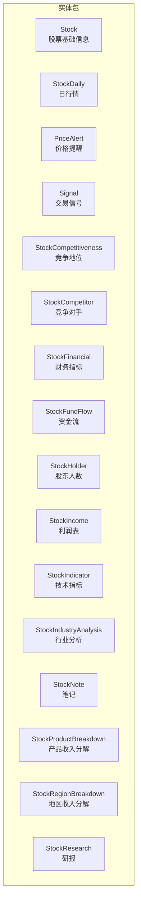
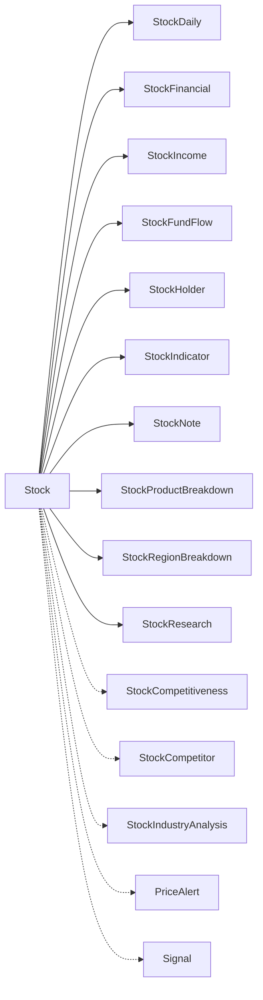

# 实体模型设计

<cite>
**本文引用的文件**
- [Stock.java](file://backend/src/main/java/com/stock/entity/Stock.java)
- [StockDaily.java](file://backend/src/main/java/com/stock/entity/StockDaily.java)
- [PriceAlert.java](file://backend/src/main/java/com/stock/entity/PriceAlert.java)
- [Signal.java](file://backend/src/main/java/com/stock/entity/Signal.java)
- [StockCompetitiveness.java](file://backend/src/main/java/com/stock/entity/StockCompetitiveness.java)
- [StockCompetitor.java](file://backend/src/main/java/com/stock/entity/StockCompetitor.java)
- [StockFinancial.java](file://backend/src/main/java/com/stock/entity/StockFinancial.java)
- [StockFundFlow.java](file://backend/src/main/java/com/stock/entity/StockFundFlow.java)
- [StockHolder.java](file://backend/src/main/java/com/stock/entity/StockHolder.java)
- [StockIncome.java](file://backend/src/main/java/com/stock/entity/StockIncome.java)
- [StockIndicator.java](file://backend/src/main/java/com/stock/entity/StockIndicator.java)
- [StockIndustryAnalysis.java](file://backend/src/main/java/com/stock/entity/StockIndustryAnalysis.java)
- [StockNote.java](file://backend/src/main/java/com/stock/entity/StockNote.java)
- [StockProductBreakdown.java](file://backend/src/main/java/com/stock/entity/StockProductBreakdown.java)
- [StockRegionBreakdown.java](file://backend/src/main/java/com/stock/entity/StockRegionBreakdown.java)
- [StockResearch.java](file://backend/src/main/java/com/stock/entity/StockResearch.java)
</cite>

## 目录
1. [简介](#简介)
2. [项目结构](#项目结构)
3. [核心组件](#核心组件)
4. [架构总览](#架构总览)
5. [详细组件分析](#详细组件分析)
6. [依赖分析](#依赖分析)
7. [性能考虑](#性能考虑)
8. [故障排查指南](#故障排查指南)
9. [结论](#结论)
10. [附录](#附录)

## 简介
本文件系统化梳理后端实体模型设计，覆盖所有 JPA 实体类的字段定义、数据类型、约束条件与业务含义；解释实体间的一对一、一对多、唯一性与外键关系；给出主键设计、唯一约束、非空约束、精度控制等规范；并结合 Lombok 注解与 JPA 注解配置，总结使用示例与最佳实践。

## 项目结构
实体类集中于包路径 com.stock.entity，采用按业务域分层的命名方式（如 Stock、StockDaily、StockFinancial 等），每个实体均以 JPA 注解标注持久化映射信息，统一使用 Lombok 简化 POJO 模板代码。

图示来源
- [Stock.java:1-86](file://backend/src/main/java/com/stock/entity/Stock.java#L1-L86)
- [StockDaily.java:1-60](file://backend/src/main/java/com/stock/entity/StockDaily.java#L1-L60)
- [PriceAlert.java:1-37](file://backend/src/main/java/com/stock/entity/PriceAlert.java#L1-L37)
- [Signal.java:1-36](file://backend/src/main/java/com/stock/entity/Signal.java#L1-L36)
- [StockCompetitiveness.java:1-51](file://backend/src/main/java/com/stock/entity/StockCompetitiveness.java#L1-L51)
- [StockCompetitor.java:1-32](file://backend/src/main/java/com/stock/entity/StockCompetitor.java#L1-L32)
- [StockFinancial.java:1-72](file://backend/src/main/java/com/stock/entity/StockFinancial.java#L1-L72)
- [StockFundFlow.java:1-66](file://backend/src/main/java/com/stock/entity/StockFundFlow.java#L1-L66)
- [StockHolder.java:1-48](file://backend/src/main/java/com/stock/entity/StockHolder.java#L1-L48)
- [StockIncome.java:1-41](file://backend/src/main/java/com/stock/entity/StockIncome.java#L1-L41)
- [StockIndicator.java:1-72](file://backend/src/main/java/com/stock/entity/StockIndicator.java#L1-L72)
- [StockIndustryAnalysis.java:1-44](file://backend/src/main/java/com/stock/entity/StockIndustryAnalysis.java#L1-L44)
- [StockNote.java:1-37](file://backend/src/main/java/com/stock/entity/StockNote.java#L1-L37)
- [StockProductBreakdown.java:1-44](file://backend/src/main/java/com/stock/entity/StockProductBreakdown.java#L1-L44)
- [StockRegionBreakdown.java:1-41](file://backend/src/main/java/com/stock/entity/StockRegionBreakdown.java#L1-L41)
- [StockResearch.java:1-55](file://backend/src/main/java/com/stock/entity/StockResearch.java#L1-L55)

章节来源
- [Stock.java:1-86](file://backend/src/main/java/com/stock/entity/Stock.java#L1-L86)
- [StockDaily.java:1-60](file://backend/src/main/java/com/stock/entity/StockDaily.java#L1-L60)

## 核心组件
本节概述各实体的核心职责与关键字段，便于快速理解模型边界与数据要点。

- 股票基础信息：记录股票代码、名称、所属行业、市值、PE/PB/PS/PEG 等估值指标，以及最新价、涨跌幅、成交量、换手率、振幅等实时数据。
- 日行情：记录某交易日的开盘、收盘、最高、最低、成交量、成交额、涨跌幅、涨跌额、换手率等。
- 价格提醒：基于股票与阈值设定的价格提醒，支持触发状态与创建时间。
- 交易信号：记录某日针对某股票生成的信号类型、描述与已读状态。
- 竞争地位：记录某股票的市场份额、年份、护城河等级与优劣势分析。
- 竞争对手：记录某股票与其竞争对手的配对关系及创建时间。
- 财务指标：记录某报告期的 EPS、EPS 同比、BVPS、OCFPS、未分配利润等财务指标。
- 资金流：记录某交易日的收盘价、涨跌幅与主力/大单/中单/小单净流入金额与占比。
- 股东人数：记录截至某个期末的股东总数、户均持股、户均持有金额、持股集中度与期末日期。
- 利润表：记录某报告期的归属净利润、营业收入、营业成本与报表类型。
- 技术指标：记录某交易日的 MA5/10/20/60、MACD、信号线、柱状图、RSI、KDJ、布林带上下轨等。
- 行业分析：记录某股票所处生命周期阶段、上下游关系、政策影响、行业趋势与更新时间。
- 笔记：记录某股票的分类、内容与创建/更新时间。
- 产品收入分解：记录某报告期的产品维度收入、占比与毛利率。
- 地区收入分解：记录某报告期的地区维度收入、占比。
- 研报：记录研报标题、评级、机构、报告日期、未来一年/两年 EPS 与 PE 预测、行业与 PDF 链接。

章节来源
- [Stock.java:1-86](file://backend/src/main/java/com/stock/entity/Stock.java#L1-L86)
- [StockDaily.java:1-60](file://backend/src/main/java/com/stock/entity/StockDaily.java#L1-L60)
- [PriceAlert.java:1-37](file://backend/src/main/java/com/stock/entity/PriceAlert.java#L1-L37)
- [Signal.java:1-36](file://backend/src/main/java/com/stock/entity/Signal.java#L1-L36)
- [StockCompetitiveness.java:1-51](file://backend/src/main/java/com/stock/entity/StockCompetitiveness.java#L1-L51)
- [StockCompetitor.java:1-32](file://backend/src/main/java/com/stock/entity/StockCompetitor.java#L1-L32)
- [StockFinancial.java:1-72](file://backend/src/main/java/com/stock/entity/StockFinancial.java#L1-L72)
- [StockFundFlow.java:1-66](file://backend/src/main/java/com/stock/entity/StockFundFlow.java#L1-L66)
- [StockHolder.java:1-48](file://backend/src/main/java/com/stock/entity/StockHolder.java#L1-L48)
- [StockIncome.java:1-41](file://backend/src/main/java/com/stock/entity/StockIncome.java#L1-L41)
- [StockIndicator.java:1-72](file://backend/src/main/java/com/stock/entity/StockIndicator.java#L1-L72)
- [StockIndustryAnalysis.java:1-44](file://backend/src/main/java/com/stock/entity/StockIndustryAnalysis.java#L1-L44)
- [StockNote.java:1-37](file://backend/src/main/java/com/stock/entity/StockNote.java#L1-L37)
- [StockProductBreakdown.java:1-44](file://backend/src/main/java/com/stock/entity/StockProductBreakdown.java#L1-L44)
- [StockRegionBreakdown.java:1-41](file://backend/src/main/java/com/stock/entity/StockRegionBreakdown.java#L1-L41)
- [StockResearch.java:1-55](file://backend/src/main/java/com/stock/entity/StockResearch.java#L1-L55)

## 架构总览
下图展示实体之间的继承与组合关系（概念示意）：

说明
- 组合关系：Stock 作为根实体，其他实体通过 stock_id 关联到 Stock，形成“一个股票对应多个明细”的聚合关系。
- 独立实体：PriceAlert、Signal、StockCompetitiveness、StockCompetitor、StockIndustryAnalysis 等可独立存在，但通常也通过 stock_id 与 Stock 建立关联。

## 详细组件分析

### 股票基础信息（Stock）
- 主键：自增 Long id
- 唯一性：code 唯一
- 非空：code、name、addedAt
- 字段要点：行业名称/代码、总股本/流通股本、总市值/流通市值、PE/PB/PS/PEG、最新价、涨跌幅/涨跌额、成交量、换手率、振幅、是否激活
- 业务含义：承载股票的基础属性与估值快照，是其他实体的上游根实体

章节来源
- [Stock.java:19-84](file://backend/src/main/java/com/stock/entity/Stock.java#L19-L84)

### 日行情（StockDaily）
- 主键：自增 Long id
- 唯一性：(stock_id, trade_date) 唯一键
- 非空：stock_id、trade_date
- 字段要点：开盘、收盘、最高、最低、成交量、成交额、涨跌幅、涨跌额、换手率、振幅
- 业务含义：记录每日交易数据，用于技术分析与回测

章节来源
- [StockDaily.java:15-59](file://backend/src/main/java/com/stock/entity/StockDaily.java#L15-L59)

### 价格提醒（PriceAlert）
- 主键：自增 Long id
- 非空：stock_id、type、threshold
- 字段要点：提醒类型、阈值、是否触发、创建时间
- 业务含义：基于阈值触发的提醒事件，常用于风控或策略执行

章节来源
- [PriceAlert.java:22-35](file://backend/src/main/java/com/stock/entity/PriceAlert.java#L22-L35)

### 交易信号（Signal）
- 主键：自增 Long id
- 非空：stock_id、type、trade_date
- 字段要点：信号类型、交易日期、描述、已读状态
- 业务含义：策略或规则引擎输出的买卖/观察信号

章节来源
- [Signal.java:21-34](file://backend/src/main/java/com/stock/entity/Signal.java#L21-L34)

### 竞争地位（StockCompetitiveness）
- 主键：自增 Long id
- 唯一性：stock_id 唯一
- 字段要点：市场份额、年份、护城河等级、优劣势分析、更新时间
- 业务含义：对股票竞争地位的综合评估

章节来源
- [StockCompetitiveness.java:24-49](file://backend/src/main/java/com/stock/entity/StockCompetitiveness.java#L24-L49)

### 竞争对手（StockCompetitor）
- 主键：自增 Long id
- 唯一性：(stock_id, competitor_stock_id) 唯一键
- 非空：stock_id、competitor_stock_id
- 字段要点：创建时间
- 业务含义：建立股票与竞争对手的配对关系

章节来源
- [StockCompetitor.java:23-30](file://backend/src/main/java/com/stock/entity/StockCompetitor.java#L23-L30)

### 财务指标（StockFinancial）
- 主键：自增 Long id
- 唯一性：(stock_id, report_date) 唯一键
- 非空：stock_id、report_date
- 字段要点：EPS、EPS 同比、BVPS、OCFPS、未分配利润、净利率、ROE、毛利率、资产负债率、存货周转、速动比率、流动比率、期间费用率
- 业务含义：财务健康度与盈利能力的关键指标

章节来源
- [StockFinancial.java:24-71](file://backend/src/main/java/com/stock/entity/StockFinancial.java#L24-L71)

### 资金流（StockFundFlow）
- 主键：自增 Long id
- 唯一性：(stock_id, trade_date) 唯一键
- 非空：stock_id、trade_date
- 字段要点：收盘价、涨跌幅、主力/大单/中单/小单净流入金额与占比
- 业务含义：反映市场资金流向与情绪

章节来源
- [StockFundFlow.java:24-64](file://backend/src/main/java/com/stock/entity/StockFundFlow.java#L24-L64)

### 股东人数（StockHolder）
- 主键：自增 Long id
- 唯一性：(stock_id, end_date) 唯一键
- 非空：stock_id、end_date
- 字段要点：股东总数、户均持股、户均持有金额、持股集中度、关注点
- 业务含义：衡量股东结构与集中度变化

章节来源
- [StockHolder.java:24-46](file://backend/src/main/java/com/stock/entity/StockHolder.java#L24-L46)

### 利润表（StockIncome）
- 主键：自增 Long id
- 唯一性：(stock_id, report_date, report_type) 唯一键
- 非空：stock_id、report_date、report_type
- 字段要点：归属净利润、营业收入、营业成本、报表类型
- 业务含义：利润表核心数据，支撑收入与盈利分析

章节来源
- [StockIncome.java:23-39](file://backend/src/main/java/com/stock/entity/StockIncome.java#L23-L39)

### 技术指标（StockIndicator）
- 主键：自增 Long id
- 唯一性：(stock_id, trade_date) 唯一键
- 非空：stock_id、trade_date
- 字段要点：MA5/10/20/60、MACD、信号线、柱状图、RSI、KDJ、布林带上下轨
- 业务含义：为量化策略提供技术面依据

章节来源
- [StockIndicator.java:24-70](file://backend/src/main/java/com/stock/entity/StockIndicator.java#L24-L70)

### 行业分析（StockIndustryAnalysis）
- 主键：自增 Long id
- 唯一性：stock_id 唯一
- 非空：stock_id
- 字段要点：生命周期阶段、上下游关系、政策影响、行业趋势、更新时间
- 业务含义：从宏观视角解读公司所处行业环境

章节来源
- [StockIndustryAnalysis.java:23-42](file://backend/src/main/java/com/stock/entity/StockIndustryAnalysis.java#L23-L42)

### 笔记（StockNote）
- 主键：自增 Long id
- 非空：stock_id、category、content
- 字段要点：分类、内容、创建/更新时间
- 业务含义：个人或团队对股票的分析笔记

章节来源
- [StockNote.java:21-35](file://backend/src/main/java/com/stock/entity/StockNote.java#L21-L35)

### 产品收入分解（StockProductBreakdown）
- 主键：自增 Long id
- 非空：stock_id、report_date、product_name、revenue、revenue_ratio
- 字段要点：产品名称、收入、收入占比、毛利率、创建时间
- 业务含义：拆解公司收入构成，识别增长驱动

章节来源
- [StockProductBreakdown.java:23-42](file://backend/src/main/java/com/stock/entity/StockProductBreakdown.java#L23-L42)

### 地区收入分解（StockRegionBreakdown）
- 主键：自增 Long id
- 非空：stock_id、report_date、region_name、revenue、revenue_ratio
- 字段要点：地区名称、收入、收入占比、创建时间
- 业务含义：识别不同地区的收入贡献

章节来源
- [StockRegionBreakdown.java:23-38](file://backend/src/main/java/com/stock/entity/StockRegionBreakdown.java#L23-L38)

### 研报（StockResearch）
- 主键：自增 Long id
- 非空：stock_id、title
- 字段要点：标题、评级、机构、报告日期、EPS/PE 预测（1/2 年）、行业、PDF 链接
- 业务含义：外部研究观点与预测汇总

章节来源
- [StockResearch.java:22-53](file://backend/src/main/java/com/stock/entity/StockResearch.java#L22-L53)

## 依赖分析
- 外键与关联
  - 所有明细类（StockDaily、StockFinancial、StockFundFlow、StockHolder、StockIncome、StockIndicator、StockProductBreakdown、StockRegionBreakdown、StockNote、StockResearch）均通过 stock_id 引用 Stock.id
  - 竞争地位与行业分析通过 stock_id 唯一约束保证一对一
  - 竞争对手通过 (stock_id, competitor_stock_id) 唯一键避免重复配对
- 约束与索引
  - 唯一约束覆盖高频查询与去重场景（如日频/报告期/期末）
  - 精度控制确保财务与技术指标的高保真存储
- 数据一致性
  - 通过唯一约束与非空约束保障数据完整性
  - 通过统一的 stock_id 关系维护跨表一致性

```mermaid
erDiagram
STOCK {
bigint id PK
string code UK
string name
string industry_name
string industry_code
long total_shares
long circulating_shares
long total_market_cap
long circulating_market_cap
decimal pe_ttm
decimal pb
decimal ps_ttm
decimal peg
decimal latest_price
decimal change_percent
decimal change_amount
long volume
decimal turnover_rate
decimal amplitude
datetime added_at
boolean is_active
}
STOCK_DAILY {
bigint id PK
bigint stock_id FK
date trade_date
decimal open
decimal close
decimal high
decimal low
long volume
decimal amount
decimal amplitude
decimal change_percent
decimal change_amount
decimal turnover_rate
}
STOCK_FINANCIAL {
bigint id PK
bigint stock_id FK
date report_date
decimal eps
decimal eps_yoy
decimal bvps
decimal ocfps
decimal undistributed_ps
decimal net_profit_margin
decimal roe
decimal roe_diluted
decimal gross_margin
decimal debt_ratio
decimal inventory_turnover
decimal quick_ratio
decimal current_ratio
decimal period_expense_ratio
}
STOCK_INCOME {
bigint id PK
bigint stock_id FK
date report_date
long parent_net_profit
long total_revenue
long operating_cost
string report_type
}
STOCK_FUND_FLOW {
bigint id PK
bigint stock_id FK
date trade_date
decimal close_price
decimal change_percent
long main_net_amount
decimal main_net_percent
long huge_net_amount
decimal huge_net_percent
long big_net_amount
decimal big_net_percent
long mid_net_amount
decimal mid_net_percent
long small_net_amount
decimal small_net_percent
}
STOCK_HOLDER {
bigint id PK
bigint stock_id FK
date end_date
int holder_total_num
decimal holder_num_ratio
long avg_free_shares
long avg_hold_amt
string hold_focus
decimal hold_ratio_total
}
STOCK_INDICATOR {
bigint id PK
bigint stock_id FK
date trade_date
decimal ma5
decimal ma10
decimal ma20
decimal ma60
decimal macd
decimal signal
decimal hist
decimal rsi
decimal kdj_k
decimal kdj_d
decimal kdj_j
decimal boll_upper
decimal boll_mid
decimal boll_lower
}
STOCK_NOTE {
bigint id PK
bigint stock_id FK
string category
text content
datetime created_at
datetime updated_at
}
STOCK_PRODUCT_BREAKDOWN {
bigint id PK
bigint stock_id FK
date report_date
string product_name
long revenue
decimal revenue_ratio
decimal gross_margin
datetime created_at
}
STOCK_REGION_BREAKDOWN {
bigint id PK
bigint stock_id FK
date report_date
string region_name
long revenue
decimal revenue_ratio
datetime created_at
}
STOCK_RESEARCH {
bigint id PK
bigint stock_id FK
string title
string rating
string institution
date report_date
decimal eps_forecast_1y
decimal pe_forecast_1y
decimal eps_forecast_2y
decimal pe_forecast_2y
string industry
string pdf_url
}
STOCK_COMPETITIVENESS {
bigint id PK
bigint stock_id UK
decimal market_share
int market_share_year
text advantage
text disadvantage
string moat_level
text moat_note
datetime updated_at
}
STOCK_COMPETITOR {
bigint id PK
bigint stock_id FK
bigint competitor_stock_id
datetime created_at
}
STOCK_INDUSTRY_ANALYSIS {
bigint id PK
bigint stock_id UK
string lifecycle_stage
text upstream_downstream
text policy_impact
text industry_trend
datetime updated_at
}
STOCK_ALERT {
bigint id PK
bigint stock_id FK
string type
decimal threshold
boolean is_triggered
datetime created_at
}
STOCK_SIGNAL {
bigint id PK
bigint stock_id FK
string type
date trade_date
string description
boolean is_read
}
STOCK ||--o{ STOCK_DAILY : "has daily"
STOCK ||--o{ STOCK_FINANCIAL : "has financial"
STOCK ||--o{ STOCK_INCOME : "has income"
STOCK ||--o{ STOCK_FUND_FLOW : "has fund flow"
STOCK ||--o{ STOCK_HOLDER : "has holder"
STOCK ||--o{ STOCK_INDICATOR : "has indicator"
STOCK ||--o{ STOCK_NOTE : "has note"
STOCK ||--o{ STOCK_PRODUCT_BREAKDOWN : "has product breakdown"
STOCK ||--o{ STOCK_REGION_BREAKDOWN : "has region breakdown"
STOCK ||--o{ STOCK_RESEARCH : "has research"
STOCK ||--|| STOCK_COMPETITIVENESS : "has one"
STOCK ||--o{ STOCK_COMPETITOR : "has competitors"
STOCK ||--|| STOCK_INDUSTRY_ANALYSIS : "has one"
STOCK ||--o{ STOCK_ALERT : "has alerts"
STOCK ||--o{ STOCK_SIGNAL : "has signals"
```

图示来源
- [Stock.java:19-84](file://backend/src/main/java/com/stock/entity/Stock.java#L19-L84)
- [StockDaily.java:24-59](file://backend/src/main/java/com/stock/entity/StockDaily.java#L24-L59)
- [StockFinancial.java:24-71](file://backend/src/main/java/com/stock/entity/StockFinancial.java#L24-L71)
- [StockIncome.java:23-39](file://backend/src/main/java/com/stock/entity/StockIncome.java#L23-L39)
- [StockFundFlow.java:24-64](file://backend/src/main/java/com/stock/entity/StockFundFlow.java#L24-L64)
- [StockHolder.java:24-46](file://backend/src/main/java/com/stock/entity/StockHolder.java#L24-L46)
- [StockIndicator.java:24-70](file://backend/src/main/java/com/stock/entity/StockIndicator.java#L24-L70)
- [StockNote.java:21-35](file://backend/src/main/java/com/stock/entity/StockNote.java#L21-L35)
- [StockProductBreakdown.java:23-42](file://backend/src/main/java/com/stock/entity/StockProductBreakdown.java#L23-L42)
- [StockRegionBreakdown.java:23-38](file://backend/src/main/java/com/stock/entity/StockRegionBreakdown.java#L23-L38)
- [StockResearch.java:22-53](file://backend/src/main/java/com/stock/entity/StockResearch.java#L22-L53)
- [StockCompetitiveness.java:24-49](file://backend/src/main/java/com/stock/entity/StockCompetitiveness.java#L24-L49)
- [StockCompetitor.java:23-30](file://backend/src/main/java/com/stock/entity/StockCompetitor.java#L23-L30)
- [StockIndustryAnalysis.java:23-42](file://backend/src/main/java/com/stock/entity/StockIndustryAnalysis.java#L23-L42)
- [PriceAlert.java:22-35](file://backend/src/main/java/com/stock/entity/PriceAlert.java#L22-L35)
- [Signal.java:21-34](file://backend/src/main/java/com/stock/entity/Signal.java#L21-L34)

## 性能考虑
- 索引与唯一约束
  - 对高频查询字段（stock_id、trade_date、report_date、end_date、category 等）建议在数据库层面建立索引，配合唯一约束减少重复写入
- 精度与存储
  - 财务与技术指标统一采用高精度 decimal 存储，避免浮点误差累积
- 写入批量化
  - 日频/报告期数据批量导入时，优先使用事务与批量插入，降低锁竞争
- 查询优化
  - 明确过滤条件（如按 stock_id 与日期范围），避免全表扫描
- 缓存策略
  - 对热点股票的实时数据可引入缓存，注意与数据库的最终一致性

## 故障排查指南
- 唯一冲突
  - 当出现违反唯一约束的错误时，检查重复的 (stock_id, trade_date)、(stock_id, report_date)、(stock_id, end_date) 或 (stock_id, competitor_stock_id) 等组合
- 非空校验
  - 确认 stock_id、type、threshold、category、content、report_date、report_type、product_name、region_name 等必填字段均已赋值
- 类型不匹配
  - 注意 decimal 精度与 scale 的设置，避免因精度不足导致截断
- 时间字段
  - trade_date、report_date、end_date、created_at、updated_at 等需确保时区与格式一致

章节来源
- [StockDaily.java:15-17](file://backend/src/main/java/com/stock/entity/StockDaily.java#L15-L17)
- [StockFinancial.java:15-17](file://backend/src/main/java/com/stock/entity/StockFinancial.java#L15-L17)
- [StockFundFlow.java:15-17](file://backend/src/main/java/com/stock/entity/StockFundFlow.java#L15-L17)
- [StockHolder.java:15-17](file://backend/src/main/java/com/stock/entity/StockHolder.java#L15-L17)
- [StockIncome.java:14-16](file://backend/src/main/java/com/stock/entity/StockIncome.java#L14-L16)
- [StockIndicator.java:15-17](file://backend/src/main/java/com/stock/entity/StockIndicator.java#L15-L17)
- [StockCompetitiveness.java:15-17](file://backend/src/main/java/com/stock/entity/StockCompetitiveness.java#L15-L17)
- [StockCompetitor.java:14-16](file://backend/src/main/java/com/stock/entity/StockCompetitor.java#L14-L16)
- [StockIndustryAnalysis.java:14-16](file://backend/src/main/java/com/stock/entity/StockIndustryAnalysis.java#L14-L16)
- [StockNote.java:14](file://backend/src/main/java/com/stock/entity/StockNote.java#L14)
- [StockProductBreakdown.java:16](file://backend/src/main/java/com/stock/entity/StockProductBreakdown.java#L16)
- [StockRegionBreakdown.java:16](file://backend/src/main/java/com/stock/entity/StockRegionBreakdown.java#L16)

## 结论
该实体模型围绕“股票”这一核心对象，构建了从基础信息到日行情、财务、资金流、技术指标、行业分析、笔记与研报的完整数据谱系。通过明确的主键、唯一约束与外键关系，确保了数据完整性与查询效率。建议在生产环境中配合索引、事务与缓存策略，持续优化读写性能与一致性。

## 附录

### 字段说明与约束清单
- 主键设计
  - 所有实体均使用自增 Long id 作为主键，保证全局唯一
- 外键约束
  - 明细类通过 stock_id 引用 Stock.id，形成一对多聚合
- 唯一性约束
  - 日行情：(stock_id, trade_date)
  - 财务：(stock_id, report_date)
  - 资金流：(stock_id, trade_date)
  - 股东：(stock_id, end_date)
  - 利润表：(stock_id, report_date, report_type)
  - 技术指标：(stock_id, trade_date)
  - 竞争地位：stock_id 唯一
  - 竞争对手：(stock_id, competitor_stock_id) 唯一
  - 行业分析：stock_id 唯一
  - 股票：code 唯一
- 非空约束
  - 股票：code、name、addedAt
  - 价格提醒：stock_id、type、threshold
  - 交易信号：stock_id、type、trade_date
  - 笔记：stock_id、category、content
  - 产品/地区分解：stock_id、report_date、product_name/region_name、revenue、revenue_ratio
  - 研报：stock_id、title
  - 财务/资金流/技术指标：stock_id、report_date/trade_date
  - 股东：stock_id、end_date
  - 利润表：stock_id、report_date、report_type
- 精度控制
  - 多数 decimal 字段采用 precision=10, scale=4 或更高，满足财务与技术指标的高精度需求
  - 特殊字段如 amount 使用更高精度 precision=20, scale=4

### 使用示例与最佳实践
- 新增股票
  - 创建 Stock 实体，填充 code、name、industryName、industryCode 等基础字段，设置 addedAt 与 is_active
- 批量导入日行情
  - 以 (stock_id, trade_date) 为键进行幂等写入，避免重复
- 财务/资金流/技术指标
  - 严格按 report_date/trade_date 去重，确保唯一性
- 研报与笔记
  - 使用 category 区分笔记类型，content 使用 TEXT 存储富文本
- 竞争对手与行业分析
  - 通过 stock_id 唯一约束保证一对一关系，定期更新 updatedAt

### 注解使用说明
- Lombok 注解
  - @Data：自动生成 getter/setter/toString/hashCode/equals
  - @NoArgsConstructor/@AllArgsConstructor：生成无参/全参构造器
- JPA 注解
  - @Entity：声明为 JPA 实体
  - @Table：指定表名，部分实体定义 uniqueConstraints
  - @Id/@GeneratedValue：主键与自增策略
  - @Column：字段映射，含长度、精度、是否非空、是否 LOB 等
  - @Lob：大文本字段（TEXT）