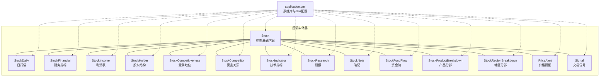
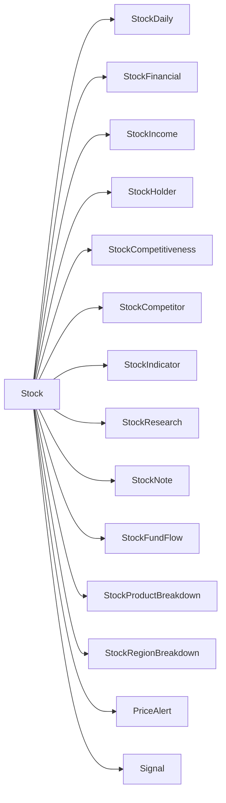

# 数据库设计

<cite>
**本文引用的文件**
- [Stock.java](file://backend/src/main/java/com/stock/entity/Stock.java)
- [StockDaily.java](file://backend/src/main/java/com/stock/entity/StockDaily.java)
- [StockFinancial.java](file://backend/src/main/java/com/stock/entity/StockFinancial.java)
- [StockIncome.java](file://backend/src/main/java/com/stock/entity/StockIncome.java)
- [StockHolder.java](file://backend/src/main/java/com/stock/entity/StockHolder.java)
- [StockCompetitiveness.java](file://backend/src/main/java/com/stock/entity/StockCompetitiveness.java)
- [StockCompetitor.java](file://backend/src/main/java/com/stock/entity/StockCompetitor.java)
- [StockIndicator.java](file://backend/src/main/java/com/stock/entity/StockIndicator.java)
- [StockResearch.java](file://backend/src/main/java/com/stock/entity/StockResearch.java)
- [StockNote.java](file://backend/src/main/java/com/stock/entity/StockNote.java)
- [StockFundFlow.java](file://backend/src/main/java/com/stock/entity/StockFundFlow.java)
- [StockProductBreakdown.java](file://backend/src/main/java/com/stock/entity/StockProductBreakdown.java)
- [StockRegionBreakdown.java](file://backend/src/main/java/com/stock/entity/StockRegionBreakdown.java)
- [PriceAlert.java](file://backend/src/main/java/com/stock/entity/PriceAlert.java)
- [Signal.java](file://backend/src/main/java/com/stock/entity/Signal.java)
- [application.yml](file://backend/src/main/resources/application.yml)
</cite>

## 目录
1. [简介](#简介)
2. [项目结构](#项目结构)
3. [核心组件](#核心组件)
4. [架构总览](#架构总览)
5. [详细组件分析](#详细组件分析)
6. [依赖分析](#依赖分析)
7. [性能考虑](#性能考虑)
8. [故障排查指南](#故障排查指南)
9. [结论](#结论)
10. [附录](#附录)

## 简介
本文件面向数据库设计与实现，基于后端 Java 实体类映射，系统化梳理各实体的字段定义、数据类型、约束条件与业务含义；明确实体间关系映射（主外键）、唯一性约束与索引策略；给出数据库表结构图与 ER 关系图；并从数据生命周期、迁移策略、备份恢复、查询优化、性能调优以及数据安全与访问控制等方面提供实践建议。

## 项目结构
后端采用 JPA/Hibernate 映射，实体类位于 com.stock.entity 包下，每个实体对应一张数据库表。仓库中还包含应用配置文件，用于数据库连接与 JPA 行为配置。

图表来源
- [Stock.java:18-85](file://backend/src/main/java/com/stock/entity/Stock.java#L18-L85)
- [StockDaily.java:18-59](file://backend/src/main/java/com/stock/entity/StockDaily.java#L18-L59)
- [StockFinancial.java:18-71](file://backend/src/main/java/com/stock/entity/StockFinancial.java#L18-L71)
- [StockIncome.java:17-40](file://backend/src/main/java/com/stock/entity/StockIncome.java#L17-L40)
- [StockHolder.java:18-47](file://backend/src/main/java/com/stock/entity/StockHolder.java#L18-L47)
- [StockCompetitiveness.java:18-50](file://backend/src/main/java/com/stock/entity/StockCompetitiveness.java#L18-L50)
- [StockCompetitor.java:17-31](file://backend/src/main/java/com/stock/entity/StockCompetitor.java#L17-L31)
- [StockIndicator.java:18-71](file://backend/src/main/java/com/stock/entity/StockIndicator.java#L18-L71)
- [StockResearch.java:16-54](file://backend/src/main/java/com/stock/entity/StockResearch.java#L16-L54)
- [StockNote.java:15-36](file://backend/src/main/java/com/stock/entity/StockNote.java#L15-L36)
- [StockFundFlow.java:18-65](file://backend/src/main/java/com/stock/entity/StockFundFlow.java#L18-L65)
- [StockProductBreakdown.java:17-43](file://backend/src/main/java/com/stock/entity/StockProductBreakdown.java#L17-L43)
- [StockRegionBreakdown.java:17-40](file://backend/src/main/java/com/stock/entity/StockRegionBreakdown.java#L17-L40)
- [PriceAlert.java:16-36](file://backend/src/main/java/com/stock/entity/PriceAlert.java#L16-L36)
- [Signal.java:15-35](file://backend/src/main/java/com/stock/entity/Signal.java#L15-L35)
- [application.yml](file://backend/src/main/resources/application.yml)

章节来源
- [application.yml](file://backend/src/main/resources/application.yml)

## 核心组件
本节对关键实体进行字段定义、数据类型与约束说明，并总结其在业务中的角色定位。

- 股票基础信息（Stock）
  - 字段与约束：自增主键；股票代码唯一非空；名称非空；行业名称/代码长度限制；市值、股本等数值型字段；PE/PB/PS/PEG 等比率精度控制；最新价、涨跌幅、成交量、换手率、振幅等行情字段；添加时间非空；是否激活布尔默认值。
  - 业务意义：作为所有衍生数据的根实体，其他表通过 stock_id 关联。

- 日行情（StockDaily）
  - 唯一约束：stock_id + trade_date 组合唯一。
  - 字段：开盘/收盘/最高/最低、成交量/成交额、振幅、涨跌幅、涨跌额、换手率等。

- 财务指标（StockFinancial）
  - 唯一约束：stock_id + report_date 组合唯一。
  - 字段：EPS、EPS 同比、BVPS、OCFPS、未分配利润、净利率、ROE、扣非 ROE、毛利率、负债率、存货周转、速动比率、流动比率、期间费用率等。

- 利润表（StockIncome）
  - 唯一约束：stock_id + report_date + report_type 组合唯一。
  - 字段：归属净利润、营业收入、营业成本、报表类型（如季度/年度）。

- 股东结构（StockHolder）
  - 唯一约束：stock_id + end_date 组合唯一。
  - 字段：股东户数、户数占比、人均持股、人均持股市值、前十大股东合计比例、股东集中度等。

- 竞争地位（StockCompetitiveness）
  - 唯一约束：stock_id 唯一。
  - 字段：市场份额、统计年份、优势/劣势、护城河等级与说明、更新时间。

- 竞品关系（StockCompetitor）
  - 唯一约束：stock_id + competitor_stock_id 组合唯一。
  - 字段：竞品股票 ID、创建时间。

- 技术指标（StockIndicator）
  - 唯一约束：stock_id + trade_date 组合唯一。
  - 字段：5/10/20/60 日均线、MACD、信号线、柱状差、RSI、KDJ 指标序列。

- 研报（StockResearch）
  - 字段：标题、评级、机构、报告日期、未来一年/两年 EPS 与 PE 预测、所属行业、PDF 链接。

- 笔记（StockNote）
  - 字段：分类、内容（TEXT）、创建/更新时间。

- 资金流（StockFundFlow）
  - 唯一约束：stock_id + trade_date 组合唯一。
  - 字段：收盘价、涨跌幅、主力净流入/占比、超大单、大单、中单、小单净流入/占比。

- 产品分部（StockProductBreakdown）
  - 字段：产品名、收入、收入占比、毛利率、报表期、创建时间。

- 地区分部（StockRegionBreakdown）
  - 字段：地区名、收入、收入占比、报表期、创建时间。

- 价格提醒（PriceAlert）
  - 字段：股票、提醒类型、阈值、是否触发、创建时间。

- 交易信号（Signal）
  - 字段：股票、信号类型、交易日、描述、是否已读。

章节来源
- [Stock.java:18-85](file://backend/src/main/java/com/stock/entity/Stock.java#L18-L85)
- [StockDaily.java:18-59](file://backend/src/main/java/com/stock/entity/StockDaily.java#L18-L59)
- [StockFinancial.java:18-71](file://backend/src/main/java/com/stock/entity/StockFinancial.java#L18-L71)
- [StockIncome.java:17-40](file://backend/src/main/java/com/stock/entity/StockIncome.java#L17-L40)
- [StockHolder.java:18-47](file://backend/src/main/java/com/stock/entity/StockHolder.java#L18-L47)
- [StockCompetitiveness.java:18-50](file://backend/src/main/java/com/stock/entity/StockCompetitiveness.java#L18-L50)
- [StockCompetitor.java:17-31](file://backend/src/main/java/com/stock/entity/StockCompetitor.java#L17-L31)
- [StockIndicator.java:18-71](file://backend/src/main/java/com/stock/entity/StockIndicator.java#L18-L71)
- [StockResearch.java:16-54](file://backend/src/main/java/com/stock/entity/StockResearch.java#L16-L54)
- [StockNote.java:15-36](file://backend/src/main/java/com/stock/entity/StockNote.java#L15-L36)
- [StockFundFlow.java:18-65](file://backend/src/main/java/com/stock/entity/StockFundFlow.java#L18-L65)
- [StockProductBreakdown.java:17-43](file://backend/src/main/java/com/stock/entity/StockProductBreakdown.java#L17-L43)
- [StockRegionBreakdown.java:17-40](file://backend/src/main/java/com/stock/entity/StockRegionBreakdown.java#L17-L40)
- [PriceAlert.java:16-36](file://backend/src/main/java/com/stock/entity/PriceAlert.java#L16-L36)
- [Signal.java:15-35](file://backend/src/main/java/com/stock/entity/Signal.java#L15-L35)

## 架构总览
下图展示以 Stock 为核心，围绕日线、财务、资金流、技术指标、研报、笔记、分部、提醒与信号等维度的数据模型与关联关系。

```mermaid
erDiagram
STOCK {
bigint id PK
varchar code UK
varchar name
varchar industry_name
varchar industry_code
bigint total_market_cap
bigint circulating_market_cap
date listing_date
bigint total_shares
bigint circulating_shares
decimal pe_ttm
decimal pb
decimal ps_ttm
decimal peg
decimal latest_price
decimal change_percent
decimal change_amount
bigint volume
decimal turnover_rate
decimal amplitude
datetime added_at
boolean is_active
}
STOCK_DAILY {
bigint id PK
bigint stock_id FK
date trade_date
decimal open
decimal close
decimal high
decimal low
bigint volume
decimal amount
decimal amplitude
decimal change_percent
decimal change_amount
decimal turnover_rate
}
STOCK_FINANCIAL {
bigint id PK
bigint stock_id FK
date report_date
decimal eps
decimal eps_yoy
decimal bvps
decimal ocfps
decimal undistributed_ps
decimal net_profit_margin
decimal roe
decimal roe_diluted
decimal gross_margin
decimal debt_ratio
decimal inventory_turnover
decimal quick_ratio
decimal current_ratio
decimal period_expense_ratio
}
STOCK_INCOME {
bigint id PK
bigint stock_id FK
date report_date
bigint parent_net_profit
bigint total_revenue
bigint operating_cost
varchar report_type
}
STOCK_HOLDER {
bigint id PK
bigint stock_id FK
date end_date
int holder_total_num
decimal holder_num_ratio
bigint avg_free_shares
bigint avg_hold_amt
varchar hold_focus
decimal hold_ratio_total
}
STOCK_COMPETITIVENESS {
bigint id PK
bigint stock_id UK
decimal market_share
int market_share_year
text advantage
text disadvantage
varchar moat_level
text moat_note
datetime updated_at
}
STOCK_COMPETITOR {
bigint id PK
bigint stock_id FK
bigint competitor_stock_id
datetime created_at
}
STOCK_INDICATOR {
bigint id PK
bigint stock_id FK
date trade_date
decimal ma5
decimal ma10
decimal ma20
decimal ma60
decimal macd
decimal signal
decimal hist
decimal rsi
decimal kdj_k
decimal kdj_d
decimal kdj_j
decimal boll_upper
decimal boll_mid
decimal boll_lower
}
STOCK_RESEARCH {
bigint id PK
bigint stock_id FK
varchar title
varchar rating
varchar institution
date report_date
decimal eps_forecast_1y
decimal pe_forecast_1y
decimal eps_forecast_2y
decimal pe_forecast_2y
varchar industry
varchar pdf_url
}
STOCK_NOTE {
bigint id PK
bigint stock_id FK
varchar category
text content
datetime created_at
datetime updated_at
}
STOCK_FUND_FLOW {
bigint id PK
bigint stock_id FK
date trade_date
decimal close_price
decimal change_percent
bigint main_net_amount
decimal main_net_percent
bigint huge_net_amount
decimal huge_net_percent
bigint big_net_amount
decimal big_net_percent
bigint mid_net_amount
decimal mid_net_percent
bigint small_net_amount
decimal small_net_percent
}
STOCK_PRODUCT_BREAKDOWN {
bigint id PK
bigint stock_id FK
date report_date
varchar product_name
bigint revenue
decimal revenue_ratio
decimal gross_margin
datetime created_at
}
STOCK_REGION_BREAKDOWN {
bigint id PK
bigint stock_id FK
date report_date
varchar region_name
bigint revenue
decimal revenue_ratio
datetime created_at
}
PRICE_ALERT {
bigint id PK
bigint stock_id FK
varchar type
decimal threshold
boolean is_triggered
datetime created_at
}
SIGNAL {
bigint id PK
bigint stock_id FK
varchar type
date trade_date
varchar description
boolean is_read
}
STOCK ||--o{ STOCK_DAILY : "1:N"
STOCK ||--o{ STOCK_FINANCIAL : "1:N"
STOCK ||--o{ STOCK_INCOME : "1:N"
STOCK ||--o{ STOCK_HOLDER : "1:N"
STOCK ||--|{ STOCK_COMPETITIVENESS : "1:1"
STOCK ||--o{ STOCK_COMPETITOR : "1:N"
STOCK ||--o{ STOCK_INDICATOR : "1:N"
STOCK ||--o{ STOCK_RESEARCH : "1:N"
STOCK ||--o{ STOCK_NOTE : "1:N"
STOCK ||--o{ STOCK_FUND_FLOW : "1:N"
STOCK ||--o{ STOCK_PRODUCT_BREAKDOWN : "1:N"
STOCK ||--o{ STOCK_REGION_BREAKDOWN : "1:N"
STOCK ||--o{ PRICE_ALERT : "1:N"
STOCK ||--o{ SIGNAL : "1:N"
```

图表来源
- [Stock.java:18-85](file://backend/src/main/java/com/stock/entity/Stock.java#L18-L85)
- [StockDaily.java:18-59](file://backend/src/main/java/com/stock/entity/StockDaily.java#L18-L59)
- [StockFinancial.java:18-71](file://backend/src/main/java/com/stock/entity/StockFinancial.java#L18-L71)
- [StockIncome.java:17-40](file://backend/src/main/java/com/stock/entity/StockIncome.java#L17-L40)
- [StockHolder.java:18-47](file://backend/src/main/java/com/stock/entity/StockHolder.java#L18-L47)
- [StockCompetitiveness.java:18-50](file://backend/src/main/java/com/stock/entity/StockCompetitiveness.java#L18-L50)
- [StockCompetitor.java:17-31](file://backend/src/main/java/com/stock/entity/StockCompetitor.java#L17-L31)
- [StockIndicator.java:18-71](file://backend/src/main/java/com/stock/entity/StockIndicator.java#L18-L71)
- [StockResearch.java:16-54](file://backend/src/main/java/com/stock/entity/StockResearch.java#L16-L54)
- [StockNote.java:15-36](file://backend/src/main/java/com/stock/entity/StockNote.java#L15-L36)
- [StockFundFlow.java:18-65](file://backend/src/main/java/com/stock/entity/StockFundFlow.java#L18-L65)
- [StockProductBreakdown.java:17-43](file://backend/src/main/java/com/stock/entity/StockProductBreakdown.java#L17-L43)
- [StockRegionBreakdown.java:17-40](file://backend/src/main/java/com/stock/entity/StockRegionBreakdown.java#L17-L40)
- [PriceAlert.java:16-36](file://backend/src/main/java/com/stock/entity/PriceAlert.java#L16-L36)
- [Signal.java:15-35](file://backend/src/main/java/com/stock/entity/Signal.java#L15-L35)

## 详细组件分析

### 股票基础信息（Stock）
- 主键：id（自增）
- 唯一约束：code（股票代码）
- 非空约束：code、name、addedAt
- 数据类型与精度：数值型使用 BigDecimal 控制精度，时间使用 LocalDate/LocalDateTime
- 业务要点：作为所有衍生数据的根实体，其他表均以 stock_id 外键关联

章节来源
- [Stock.java:18-85](file://backend/src/main/java/com/stock/entity/Stock.java#L18-L85)

### 日行情（StockDaily）
- 主键：id（自增）
- 外键：stock_id → Stock(id)
- 唯一约束：stock_id + trade_date
- 字段覆盖开盘、收盘、最高、最低、成交量、成交额、涨跌幅、换手率等

章节来源
- [StockDaily.java:18-59](file://backend/src/main/java/com/stock/entity/StockDaily.java#L18-L59)

### 财务指标（StockFinancial）
- 主键：id（自增）
- 外键：stock_id → Stock(id)
- 唯一约束：stock_id + report_date
- 字段覆盖 EPS、BVPS、OCFPS、ROE、毛利率、负债率、周转率等财务指标

章节来源
- [StockFinancial.java:18-71](file://backend/src/main/java/com/stock/entity/StockFinancial.java#L18-L71)

### 利润表（StockIncome）
- 主键：id（自增）
- 外键：stock_id → Stock(id)
- 唯一约束：stock_id + report_date + report_type
- 字段：归属净利润、营业收入、营业成本、报表类型

章节来源
- [StockIncome.java:17-40](file://backend/src/main/java/com/stock/entity/StockIncome.java#L17-L40)

### 股东结构（StockHolder）
- 主键：id（自增）
- 外键：stock_id → Stock(id)
- 唯一约束：stock_id + end_date
- 字段：股东户数、户数占比、人均持股、人均持股市值、集中度等

章节来源
- [StockHolder.java:18-47](file://backend/src/main/java/com/stock/entity/StockHolder.java#L18-L47)

### 竞争地位（StockCompetitiveness）
- 主键：id（自增）
- 外键：stock_id → Stock(id)，且 stock_id 唯一
- 字段：市场份额、统计年份、优势/劣势、护城河等级与说明、更新时间

章节来源
- [StockCompetitiveness.java:18-50](file://backend/src/main/java/com/stock/entity/StockCompetitiveness.java#L18-L50)

### 竞品关系（StockCompetitor）
- 主键：id（自增）
- 外键：stock_id → Stock(id)、competitor_stock_id → Stock(id)
- 唯一约束：stock_id + competitor_stock_id
- 字段：创建时间

章节来源
- [StockCompetitor.java:17-31](file://backend/src/main/java/com/stock/entity/StockCompetitor.java#L17-L31)

### 技术指标（StockIndicator）
- 主键：id（自增）
- 外键：stock_id → Stock(id)
- 唯一约束：stock_id + trade_date
- 字段：多周期均线、MACD、RSI、KDJ、布林带上下轨

章节来源
- [StockIndicator.java:18-71](file://backend/src/main/java/com/stock/entity/StockIndicator.java#L18-L71)

### 研报（StockResearch）
- 主键：id（自增）
- 外键：stock_id → Stock(id)
- 字段：标题、评级、机构、报告日期、未来预测指标、行业、PDF 链接

章节来源
- [StockResearch.java:16-54](file://backend/src/main/java/com/stock/entity/StockResearch.java#L16-L54)

### 笔记（StockNote）
- 主键：id（自增）
- 外键：stock_id → Stock(id)
- 字段：分类、内容（TEXT）、创建/更新时间

章节来源
- [StockNote.java:15-36](file://backend/src/main/java/com/stock/entity/StockNote.java#L15-L36)

### 资金流（StockFundFlow）
- 主键：id（自增）
- 外键：stock_id → Stock(id)
- 唯一约束：stock_id + trade_date
- 字段：主力/大小中小单净流入与占比、涨跌幅、收盘价

章节来源
- [StockFundFlow.java:18-65](file://backend/src/main/java/com/stock/entity/StockFundFlow.java#L18-L65)

### 产品分部（StockProductBreakdown）
- 主键：id（自增）
- 外键：stock_id → Stock(id)
- 字段：产品名、收入、收入占比、毛利率、报表期、创建时间

章节来源
- [StockProductBreakdown.java:17-43](file://backend/src/main/java/com/stock/entity/StockProductBreakdown.java#L17-L43)

### 地区分部（StockRegionBreakdown）
- 主键：id（自增）
- 外键：stock_id → Stock(id)
- 字段：地区名、收入、收入占比、报表期、创建时间

章节来源
- [StockRegionBreakdown.java:17-40](file://backend/src/main/java/com/stock/entity/StockRegionBreakdown.java#L17-L40)

### 价格提醒（PriceAlert）
- 主键：id（自增）
- 外键：stock_id → Stock(id)
- 字段：提醒类型、阈值、是否触发、创建时间

章节来源
- [PriceAlert.java:16-36](file://backend/src/main/java/com/stock/entity/PriceAlert.java#L16-L36)

### 交易信号（Signal）
- 主键：id（自增）
- 外键：stock_id → Stock(id)
- 字段：信号类型、交易日、描述、是否已读

章节来源
- [Signal.java:15-35](file://backend/src/main/java/com/stock/entity/Signal.java#L15-L35)

## 依赖分析
- 内聚性：各实体围绕单一业务主题（日线、财务、资金流、技术、研报、笔记、分部、提醒、信号）组织，内聚良好。
- 耦合性：除 Stock 为根实体外，其余实体均通过 stock_id 与 Stock 关联，耦合清晰、无循环依赖。
- 外键约束：StockDaily、StockFinancial、StockIncome、StockHolder、StockIndicator、StockFundFlow、StockProductBreakdown、StockRegionBreakdown、PriceAlert、Signal 均声明了 stock_id 外键；StockCompetitor 声明了双外键；StockCompetitiveness 声明了 stock_id 唯一键。
- 唯一约束：多表通过组合唯一约束保证数据完整性（如日频、财务、股东、竞品、技术、资金流）。

图表来源
- [Stock.java:18-85](file://backend/src/main/java/com/stock/entity/Stock.java#L18-L85)
- [StockDaily.java:18-59](file://backend/src/main/java/com/stock/entity/StockDaily.java#L18-L59)
- [StockFinancial.java:18-71](file://backend/src/main/java/com/stock/entity/StockFinancial.java#L18-L71)
- [StockIncome.java:17-40](file://backend/src/main/java/com/stock/entity/StockIncome.java#L17-L40)
- [StockHolder.java:18-47](file://backend/src/main/java/com/stock/entity/StockHolder.java#L18-L47)
- [StockCompetitiveness.java:18-50](file://backend/src/main/java/com/stock/entity/StockCompetitiveness.java#L18-L50)
- [StockCompetitor.java:17-31](file://backend/src/main/java/com/stock/entity/StockCompetitor.java#L17-L31)
- [StockIndicator.java:18-71](file://backend/src/main/java/com/stock/entity/StockIndicator.java#L18-L71)
- [StockResearch.java:16-54](file://backend/src/main/java/com/stock/entity/StockResearch.java#L16-L54)
- [StockNote.java:15-36](file://backend/src/main/java/com/stock/entity/StockNote.java#L15-L36)
- [StockFundFlow.java:18-65](file://backend/src/main/java/com/stock/entity/StockFundFlow.java#L18-L65)
- [StockProductBreakdown.java:17-43](file://backend/src/main/java/com/stock/entity/StockProductBreakdown.java#L17-L43)
- [StockRegionBreakdown.java:17-40](file://backend/src/main/java/com/stock/entity/StockRegionBreakdown.java#L17-L40)
- [PriceAlert.java:16-36](file://backend/src/main/java/com/stock/entity/PriceAlert.java#L16-L36)
- [Signal.java:15-35](file://backend/src/main/java/com/stock/entity/Signal.java#L15-L35)

## 性能考虑
- 索引策略
  - 必须索引：stock_id（所有子表）、trade_date（日线、资金流、技术指标、产品/地区分部）。
  - 唯一索引：各表的唯一约束列组（如 stock_id+trade_date、stock_id+report_date、stock_id+end_date、stock_id+report_type、stock_id+competitor_stock_id 等）。
  - 复合索引建议：按查询模式建立（如按 stock_id+trade_date 的范围查询；按 stock_id+report_date 的精确/范围查询）。
- 查询优化
  - 分页与范围：对日线、资金流、技术指标等高频时间序列查询，优先使用 trade_date 范围与分页。
  - 聚合与缓存：财务与分部类数据可按 report_date 聚合，结合应用层缓存减少重复计算。
  - 连接优化：尽量避免 N+1 查询，批量加载相关数据。
- 存储与压缩
  - 大文本字段（研报 PDF URL、笔记内容、竞争地位说明）可考虑外部存储或压缩传输。
- 批量写入
  - 使用批量插入/批量更新提升数据同步效率，注意事务边界与回滚点设置。
- 监控与告警
  - 对慢查询、锁等待、死锁进行监控与告警，定期分析执行计划。

## 故障排查指南
- 唯一约束冲突
  - 现象：插入时违反唯一约束（如重复 trade_date 或 report_date）。
  - 排查：检查 stock_id 是否正确、日期是否重复、报表类型是否一致。
- 外键约束失败
  - 现象：插入子表记录时报错“不存在的 stock_id”。
  - 排查：确认 Stock 记录是否存在，或同步流程是否遗漏根实体初始化。
- 数值精度问题
  - 现象：计算结果异常或截断。
  - 排查：核对 BigDecimal 精度与 scale 设置，确保入库前统一转换。
- 大字段读取异常
  - 现象：笔记或说明字段读取为空或截断。
  - 排查：确认 TEXT 类型映射与驱动版本兼容性，必要时调整字段定义或驱动参数。
- 配置问题
  - 现象：无法连接数据库或实体未映射。
  - 排查：检查 application.yml 中数据库连接、JPA DDL 行为、方言与自动建表策略。

章节来源
- [application.yml](file://backend/src/main/resources/application.yml)

## 结论
该数据库设计以 Stock 为核心，围绕日线、财务、资金流、技术指标、研报、笔记、分部、提醒与信号等维度构建，通过外键与唯一约束保障数据一致性。建议在生产环境完善索引策略、查询优化与缓存机制，同时制定数据生命周期管理、迁移与备份恢复方案，确保系统稳定与高性能运行。

## 附录
- 字段说明文档（示例）
  - 股票基础信息（Stock）
    - code：股票代码，唯一非空
    - name：股票简称，非空
    - industry_name/industry_code：所属行业名称与代码
    - total_market_cap/circulating_market_cap：总市值/流通市值
    - listing_date：上市日期
    - total_shares/circulating_shares：总股本/流通股本
    - pe_ttm/pb/ps_ttm/peg：估值指标
    - latest_price/change_percent/change_amount/volume/turnover_rate/amplitude：实时行情
    - added_at/is_active：入库时间与状态
  - 日行情（StockDaily）
    - stock_id：外键
    - trade_date：交易日
    - open/close/high/low：OHLC
    - volume/amount：成交量/成交额
    - amplitude/change_percent/change_amount/turnover_rate：波动与涨跌幅
  - 财务指标（StockFinancial）
    - stock_id：外键
    - report_date：报表日期
    - eps/eps_yoy/bvps/ocfps/undistributed_ps：盈利能力与成长性
    - net_profit_margin/gross_margin/debt_ratio：盈利质量与杠杆
    - inventory_turnover/quick_ratio/current_ratio：运营效率与偿债能力
    - period_expense_ratio：期间费用率
  - 利润表（StockIncome）
    - stock_id：外键
    - report_date/report_type：报表日期与类型（季度/年度）
    - parent_net_profit/total_revenue/operating_cost：归母净利润、营收、成本
  - 股东结构（StockHolder）
    - stock_id：外键
    - end_date：截止日期
    - holder_total_num/holder_num_ratio：股东户数与户数占比
    - avg_free_shares/avg_hold_amt：人均持股与持股市值
    - hold_focus/hold_ratio_total：前十大股东合计比例
  - 竞争地位（StockCompetitiveness）
    - stock_id：外键且唯一
    - market_share/market_share_year：市场份额与统计年份
    - advantage/disadvantage/moat_level/moat_note：优势、劣势、护城河等级与说明
    - updated_at：更新时间
  - 竞品关系（StockCompetitor）
    - stock_id：外键
    - competitor_stock_id：竞品外键
    - created_at：创建时间
  - 技术指标（StockIndicator）
    - stock_id：外键
    - trade_date：交易日
    - ma5/ma10/ma20/ma60/macd/signal/hist/rsi/kdj_*、boll_*：多周期均线与震荡指标
  - 研报（StockResearch）
    - stock_id：外键
    - title/rating/institution：标题、评级、机构
    - report_date：报告日期
    - eps_pe_forecast_*：未来一年/两年 EPS 与 PE 预测
    - industry/pdf_url：行业与 PDF 链接
  - 笔记（StockNote）
    - stock_id：外键
    - category/content：分类与内容（TEXT）
    - created_at/updated_at：创建与更新时间
  - 资金流（StockFundFlow）
    - stock_id：外键
    - trade_date：交易日
    - close_price/change_percent：收盘价与涨跌幅
    - main/huge/big/mid/small_net_*：主力/超大/大/中/小单净流入与占比
  - 产品分部（StockProductBreakdown）
    - stock_id：外键
    - report_date/product_name：报表期与产品名
    - revenue/revenue_ratio/gross_margin：收入、收入占比与毛利率
    - created_at：创建时间
  - 地区分部（StockRegionBreakdown）
    - stock_id：外键
    - report_date/region_name：报表期与地区名
    - revenue/revenue_ratio：收入与收入占比
    - created_at：创建时间
  - 价格提醒（PriceAlert）
    - stock_id：外键
    - type/threshold：提醒类型与阈值
    - is_triggered/created_at：是否触发与创建时间
  - 交易信号（Signal）
    - stock_id：外键
    - type/trade_date：信号类型与交易日
    - description/is_read：描述与是否已读

- 数据生命周期管理
  - 新增：通过数据采集器写入 Stock 及其子表；严格校验 stock_id 与日期唯一性。
  - 更新：按 trade_date 或 report_date 进行幂等更新；竞品关系与笔记支持增量更新。
  - 归档：历史数据超过保留期后归档至冷存储，保留查询索引与最小元数据。
  - 清理：删除失效 stock_id 的冗余数据；清理过期提醒与信号。

- 数据迁移策略
  - 版本化迁移：使用迁移脚本或框架（如 Flyway/Liquibase），先加列/建索引，再改默认值/填充数据，最后删旧列。
  - 并行验证：迁移前后对比关键指标（如日线条数、财务记录数）与抽样数据一致性。
  - 回滚预案：保留快照与增量备份，确保可快速回滚到上一个稳定版本。

- 备份恢复方案
  - 全量备份：每日全备，保留至少 7 天；每周全备保留 4 周。
  - 增量备份：基于 binlog/LSN 的增量备份，恢复到分钟级精度。
  - 恢复演练：每季度进行一次 RTO/RPO 验证，确保备份可用性与恢复时效。

- 数据安全与访问控制
  - 最小权限：数据库用户仅授予业务所需权限；禁止超级权限。
  - 加密传输：启用 TLS；敏感字段（如研报 PDF URL）考虑加密存储。
  - 审计日志：开启 DDL/DML 审计，追踪关键操作与异常登录。
  - 网络隔离：数据库置于内网，限制公网访问；通过堡垒机与 VPN 管理运维。