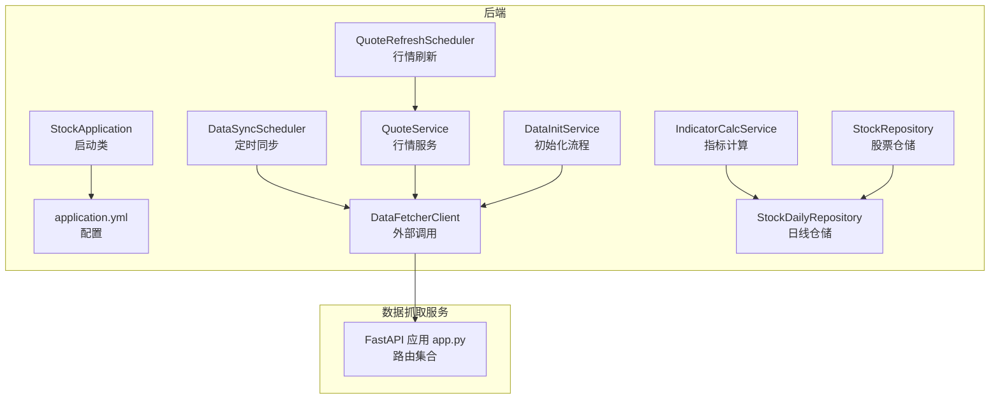
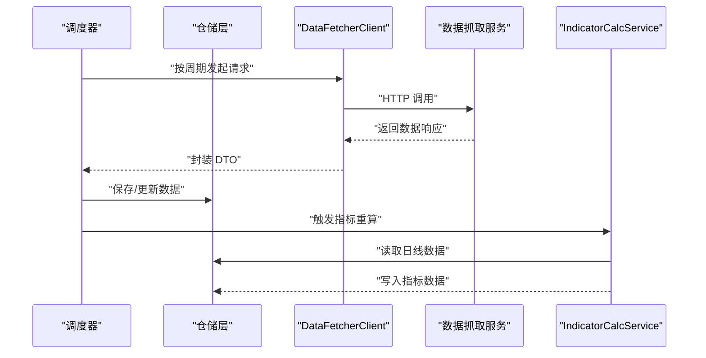
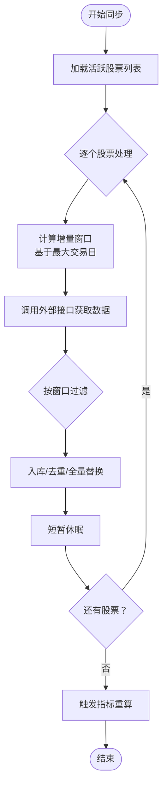
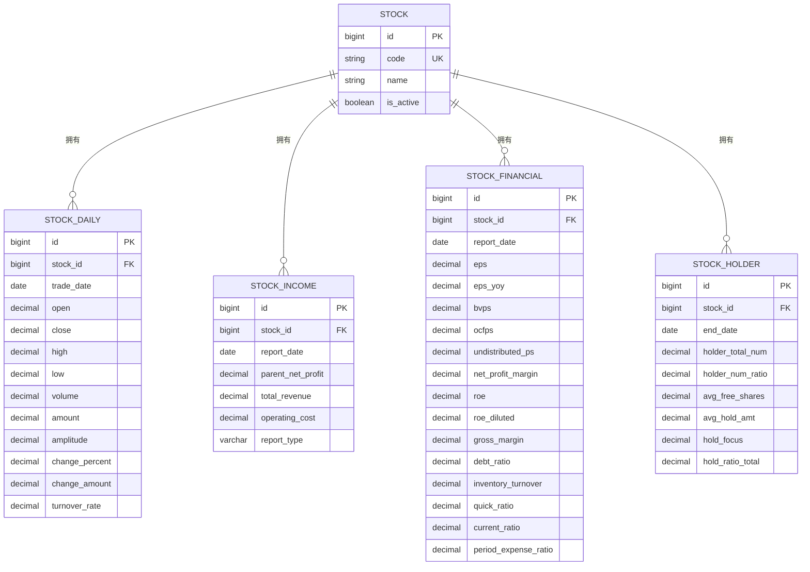
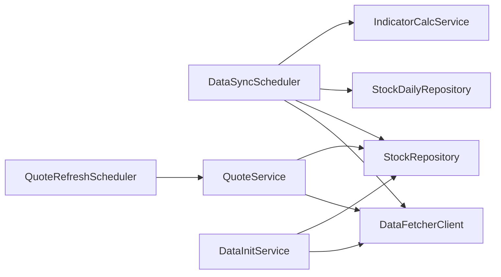

# 数据生命周期管理

<cite>
**本文引用的文件**
- [StockApplication.java](file://backend/src/main/java/com/stock/StockApplication.java)
- [application.yml](file://backend/src/main/resources/application.yml)
- [RestTemplateConfig.java](file://backend/src/main/java/com/stock/config/RestTemplateConfig.java)
- [DataSyncScheduler.java](file://backend/src/main/java/com/stock/scheduler/DataSyncScheduler.java)
- [QuoteRefreshScheduler.java](file://backend/src/main/java/com/stock/scheduler/QuoteRefreshScheduler.java)
- [DataFetcherClient.java](file://backend/src/main/java/com/stock/client/DataFetcherClient.java)
- [DataInitService.java](file://backend/src/main/java/com/stock/service/DataInitService.java)
- [QuoteService.java](file://backend/src/main/java/com/stock/service/QuoteService.java)
- [IndicatorCalcService.java](file://backend/src/main/java/com/stock/service/IndicatorCalcService.java)
- [Stock.java](file://backend/src/main/java/com/stock/entity/Stock.java)
- [StockDaily.java](file://backend/src/main/java/com/stock/entity/StockDaily.java)
- [StockRepository.java](file://backend/src/main/java/com/stock/repository/StockRepository.java)
- [StockDailyRepository.java](file://backend/src/main/java/com/stock/repository/StockDailyRepository.java)
- [app.py](file://data-fetcher/app.py)
</cite>

## 目录
1. [引言](#引言)
2. [项目结构](#项目结构)
3. [核心组件](#核心组件)
4. [架构总览](#架构总览)
5. [详细组件分析](#详细组件分析)
6. [依赖分析](#依赖分析)
7. [性能考虑](#性能考虑)
8. [故障排查指南](#故障排查指南)
9. [结论](#结论)
10. [附录](#附录)

## 引言
本文件围绕股票交易系统中的“数据生命周期管理”进行系统化梳理与设计说明，覆盖数据的创建、更新、归档与删除策略；历史数据的存储与管理（含版本控制与变更追踪）；数据清理与归档的自动化流程；数据保留策略与合规性要求；备份与恢复（全量与增量）方案；数据迁移与升级流程；以及数据质量监控与异常处理机制。文档以现有代码为依据，结合可扩展的设计建议，帮助读者在不直接阅读源码的情况下理解并实施数据生命周期管理。

## 项目结构
后端采用 Spring Boot 架构，通过调度器定时拉取数据、计算指标并持久化；前端通过 API 访问后端；数据抓取服务由独立的 Python FastAPI 应用提供。配置文件集中管理数据库连接、JPA 行为、调度周期与外部数据源地址等。

**图表来源**
- [StockApplication.java:1-16](file://backend/src/main/java/com/stock/StockApplication.java#L1-L16)
- [application.yml:1-28](file://backend/src/main/resources/application.yml#L1-L28)
- [DataSyncScheduler.java:1-238](file://backend/src/main/java/com/stock/scheduler/DataSyncScheduler.java#L1-L238)
- [QuoteRefreshScheduler.java:1-35](file://backend/src/main/java/com/stock/scheduler/QuoteRefreshScheduler.java#L1-L35)
- [DataFetcherClient.java:1-126](file://backend/src/main/java/com/stock/client/DataFetcherClient.java#L1-L126)
- [QuoteService.java:1-98](file://backend/src/main/java/com/stock/service/QuoteService.java#L1-L98)
- [DataInitService.java:1-101](file://backend/src/main/java/com/stock/service/DataInitService.java#L1-L101)
- [IndicatorCalcService.java:1-210](file://backend/src/main/java/com/stock/service/IndicatorCalcService.java#L1-L210)
- [StockRepository.java:1-18](file://backend/src/main/java/com/stock/repository/StockRepository.java#L1-L18)
- [StockDailyRepository.java:1-24](file://backend/src/main/java/com/stock/repository/StockDailyRepository.java#L1-L24)
- [app.py:1-31](file://data-fetcher/app.py#L1-L31)

**章节来源**
- [StockApplication.java:1-16](file://backend/src/main/java/com/stock/StockApplication.java#L1-L16)
- [application.yml:1-28](file://backend/src/main/resources/application.yml#L1-L28)

## 核心组件
- 启动与调度：应用启用调度与异步能力，统一由配置文件定义调度周期。
- 外部数据源：通过 RestTemplate 客户端访问独立的数据抓取服务，支持超时与错误包装。
- 数据同步：按日线、资金流、财务、股东、研报等维度分批同步，使用唯一约束避免重复写入。
- 指标计算：基于日线数据批量重算技术指标，先清空再写入，确保一致性。
- 行情刷新：工作日定时刷新最新报价，缓存于股票实体中，供查询接口使用。
- 初始化流程：异步执行多步骤初始化，记录每步状态，便于追踪与重试。

**章节来源**
- [DataSyncScheduler.java:1-238](file://backend/src/main/java/com/stock/scheduler/DataSyncScheduler.java#L1-L238)
- [DataFetcherClient.java:1-126](file://backend/src/main/java/com/stock/client/DataFetcherClient.java#L1-L126)
- [IndicatorCalcService.java:1-210](file://backend/src/main/java/com/stock/service/IndicatorCalcService.java#L1-L210)
- [QuoteRefreshScheduler.java:1-35](file://backend/src/main/java/com/stock/scheduler/QuoteRefreshScheduler.java#L1-L35)
- [DataInitService.java:1-101](file://backend/src/main/java/com/stock/service/DataInitService.java#L1-L101)

## 架构总览
下图展示数据从抓取到入库、计算与查询的整体流程，以及各组件间的交互关系。

**图表来源**
- [DataSyncScheduler.java:54-82](file://backend/src/main/java/com/stock/scheduler/DataSyncScheduler.java#L54-L82)
- [DataSyncScheduler.java:216-236](file://backend/src/main/java/com/stock/scheduler/DataSyncScheduler.java#L216-L236)
- [DataFetcherClient.java:31-93](file://backend/src/main/java/com/stock/client/DataFetcherClient.java#L31-L93)
- [IndicatorCalcService.java:15-64](file://backend/src/main/java/com/stock/service/IndicatorCalcService.java#L15-L64)

## 详细组件分析

### 数据同步与更新策略
- 日线数据同步：按股票筛选活跃标的，计算最大交易日并增量拉取，避免重复与越界。
- 资金流与周频数据：分别设定月级与周级增量窗口，拉取后过滤起始日期，入库前去重。
- 周频财务/收入/股东数据：每次同步前清空旧数据，再全量写入，保证时点准确性。
- 指标重算：按年级窗口读取日线，计算多指标序列，先删后插，确保与时间序列对齐。

**图表来源**
- [DataSyncScheduler.java:56-82](file://backend/src/main/java/com/stock/scheduler/DataSyncScheduler.java#L56-L82)
- [DataSyncScheduler.java:86-117](file://backend/src/main/java/com/stock/scheduler/DataSyncScheduler.java#L86-L117)
- [DataSyncScheduler.java:165-214](file://backend/src/main/java/com/stock/scheduler/DataSyncScheduler.java#L165-L214)
- [DataSyncScheduler.java:218-236](file://backend/src/main/java/com/stock/scheduler/DataSyncScheduler.java#L218-L236)

**章节来源**
- [DataSyncScheduler.java:54-236](file://backend/src/main/java/com/stock/scheduler/DataSyncScheduler.java#L54-L236)

### 历史数据存储与版本控制
- 唯一约束：日线表对“股票+交易日”建立唯一约束，天然防止重复写入，形成历史序列。
- 窗口化增量：通过“最大交易日+当前日期”确定增量范围，确保历史连续性。
- 全量替换策略：周频财务/收入/股东数据采用“清空后全量写入”，保证时点一致与版本清晰。
- 指标表一致性：指标按交易日序列生成，与日线严格对齐，便于回溯。

**图表来源**
- [StockDaily.java:15-17](file://backend/src/main/java/com/stock/entity/StockDaily.java#L15-L17)
- [StockDaily.java:18-59](file://backend/src/main/java/com/stock/entity/StockDaily.java#L18-L59)
- [StockRepository.java:10-17](file://backend/src/main/java/com/stock/repository/StockRepository.java#L10-L17)
- [StockDailyRepository.java:13-23](file://backend/src/main/java/com/stock/repository/StockDailyRepository.java#L13-L23)

**章节来源**
- [StockDaily.java:15-17](file://backend/src/main/java/com/stock/entity/StockDaily.java#L15-L17)
- [StockDailyRepository.java:19-20](file://backend/src/main/java/com/stock/repository/StockDailyRepository.java#L19-L20)
- [DataSyncScheduler.java:177-178](file://backend/src/main/java/com/stock/scheduler/DataSyncScheduler.java#L177-L178)
- [DataSyncScheduler.java:192-193](file://backend/src/main/java/com/stock/scheduler/DataSyncScheduler.java#L192-L193)
- [DataSyncScheduler.java:205-206](file://backend/src/main/java/com/stock/scheduler/DataSyncScheduler.java#L205-L206)

### 变更追踪与审计
- 初始化状态追踪：初始化服务为每个步骤写入状态记录，便于审计与重试。
- 日志记录：调度器与服务层广泛使用日志记录成功/失败信息与异常摘要。
- 建议增强：可在仓储层引入审计字段（如创建/更新时间戳、操作人），或在业务层增加变更前后对比。

**章节来源**
- [DataInitService.java:42-71](file://backend/src/main/java/com/stock/service/DataInitService.java#L42-L71)
- [DataSyncScheduler.java:56-81](file://backend/src/main/java/com/stock/scheduler/DataSyncScheduler.java#L56-L81)

### 数据清理与归档自动化
- 清理策略：周频财务/收入/股东数据采用“先删后插”，实现自动清理旧版本。
- 归档建议：对历史日线数据可按年/季度归档至独立表或分区表，保留唯一索引与查询索引；对低频数据可迁移至冷存储。
- 自动化流程：通过调度器统一编排，结合日志与状态表实现闭环。

**章节来源**
- [DataSyncScheduler.java:177-178](file://backend/src/main/java/com/stock/scheduler/DataSyncScheduler.java#L177-L178)
- [DataSyncScheduler.java:192-193](file://backend/src/main/java/com/stock/scheduler/DataSyncScheduler.java#L192-L193)
- [DataSyncScheduler.java:205-206](file://backend/src/main/java/com/stock/scheduler/DataSyncScheduler.java#L205-L206)

### 数据保留策略与合规性
- 保留期限：日线数据保留近一年，资金流保留近三个月，周频财务/收入/股东数据按报告期保留。
- 合规要求：建议在配置中增加“保留天数/年限”参数，到期自动清理；对涉及个人敏感信息的研报/机构数据，遵循最小化原则与删除请求处理流程。
- 配置化：通过配置文件集中管理保留策略，便于审计与调整。

**章节来源**
- [DataSyncScheduler.java:61-63](file://backend/src/main/java/com/stock/scheduler/DataSyncScheduler.java#L61-L63)
- [DataSyncScheduler.java:92-93](file://backend/src/main/java/com/stock/scheduler/DataSyncScheduler.java#L92-L93)

### 备份与恢复方案
- 全量备份：定期导出数据库快照（如 H2 文件型数据库的文件拷贝），并校验完整性。
- 增量备份：基于 WAL 或二进制日志（需数据库支持）进行增量备份；对于 H2 文件型数据库，可按时间点复制数据文件。
- 恢复流程：验证备份文件完整性 → 停止服务 → 还原数据 → 启动服务并验证关键指标与行情可用性。
- 建议：在生产环境使用独立的备份存储与异地容灾，定期演练恢复。

[本节为通用实践指导，无需特定文件引用]

### 数据迁移与升级
- 结构迁移：使用数据库迁移工具（如 Flyway/Liquibase）管理表结构演进；对历史数据进行兼容性转换。
- 数据迁移：在维护窗口内执行，先读取旧格式数据，转换后写入新表，最后切换引用。
- 升级回滚：保留旧版本数据与映射规则，确保回滚时不影响线上服务。

[本节为通用实践指导，无需特定文件引用]

### 数据质量监控与异常处理
- 监控指标：数据到达率、延迟、异常比例、重试次数、入库条数。
- 异常处理：客户端统一捕获外部调用异常并包装为领域异常；调度器与服务层记录告警日志并跳过失败项继续执行。
- 告警与重试：对可恢复异常（网络抖动）进行指数退避重试；对不可恢复异常（数据格式异常）记录并上报。

**章节来源**
- [DataFetcherClient.java:112-124](file://backend/src/main/java/com/stock/client/DataFetcherClient.java#L112-L124)
- [DataSyncScheduler.java:78-81](file://backend/src/main/java/com/stock/scheduler/DataSyncScheduler.java#L78-L81)

## 依赖分析
- 组件耦合：调度器依赖仓储与外部客户端；服务层依赖仓储与计算服务；仓储层依赖实体模型。
- 外部依赖：RestTemplate 客户端依赖配置文件中的数据抓取服务地址与超时设置。
- 循环依赖：未发现循环依赖迹象，职责边界清晰。

**图表来源**
- [DataSyncScheduler.java:21-52](file://backend/src/main/java/com/stock/scheduler/DataSyncScheduler.java#L21-L52)
- [QuoteRefreshScheduler.java:16-22](file://backend/src/main/java/com/stock/scheduler/QuoteRefreshScheduler.java#L16-L22)
- [DataFetcherClient.java:17-24](file://backend/src/main/java/com/stock/client/DataFetcherClient.java#L17-L24)
- [DataInitService.java:19-40](file://backend/src/main/java/com/stock/service/DataInitService.java#L19-L40)

**章节来源**
- [RestTemplateConfig.java:10-16](file://backend/src/main/java/com/stock/config/RestTemplateConfig.java#L10-L16)
- [application.yml:20-22](file://backend/src/main/resources/application.yml#L20-L22)

## 性能考虑
- 批量写入：使用 saveAll 与批量计算减少事务开销。
- 增量窗口：基于最大交易日计算增量，避免全量扫描。
- 限流与休眠：在循环中加入短暂休眠，降低外部接口压力。
- 指标计算：采用数组与向量化思路，减少重复计算。

**章节来源**
- [DataSyncScheduler.java:74](file://backend/src/main/java/com/stock/scheduler/DataSyncScheduler.java#L74)
- [DataSyncScheduler.java:108](file://backend/src/main/java/com/stock/scheduler/DataSyncScheduler.java#L108)
- [DataSyncScheduler.java:227-230](file://backend/src/main/java/com/stock/scheduler/DataSyncScheduler.java#L227-L230)

## 故障排查指南
- 外部接口异常：检查数据抓取服务健康状态与网络连通性；查看客户端异常包装与日志。
- 数据重复：确认唯一约束是否生效；检查增量窗口计算逻辑。
- 指标为空：确认日线数据是否充足；检查重算窗口与删除/插入顺序。
- 行情刷新失败：核对调度周期配置与服务可用性；查看刷新结果统计。

**章节来源**
- [app.py:23-25](file://data-fetcher/app.py#L23-L25)
- [DataFetcherClient.java:112-124](file://backend/src/main/java/com/stock/client/DataFetcherClient.java#L112-L124)
- [application.yml:24-27](file://backend/src/main/resources/application.yml#L24-L27)

## 结论
该系统通过调度器驱动的增量同步、全量替换与指标重算，实现了较为完整的数据生命周期管理闭环。建议在现有基础上补充配置化的保留策略、审计字段与归档流程，并完善备份恢复与迁移升级的自动化脚本，以满足长期运营与合规需求。

## 附录
- 关键配置项参考
  - 数据源与 JPA：数据库 URL、DDL 自动建模策略、H2 控制台路径
  - 外部数据抓取：服务地址、超时时间
  - 调度周期：行情刷新、K线同步、资金流同步、指标重算、周频数据同步

**章节来源**
- [application.yml:5-17](file://backend/src/main/resources/application.yml#L5-L17)
- [application.yml:20-27](file://backend/src/main/resources/application.yml#L20-L27)
- [RestTemplateConfig.java:12-15](file://backend/src/main/java/com/stock/config/RestTemplateConfig.java#L12-L15)