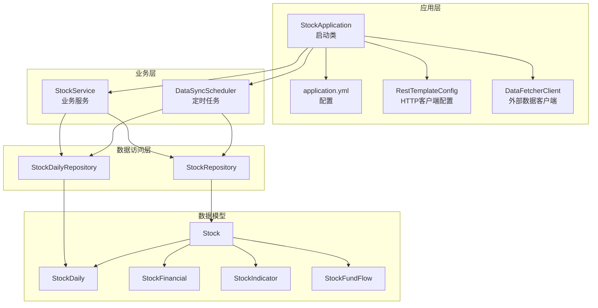
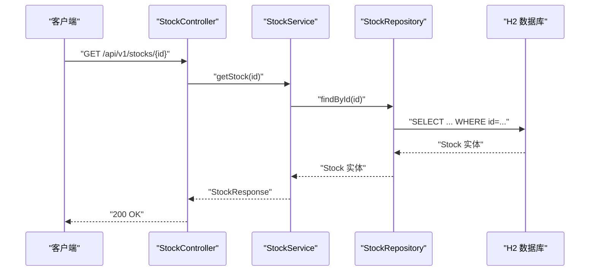
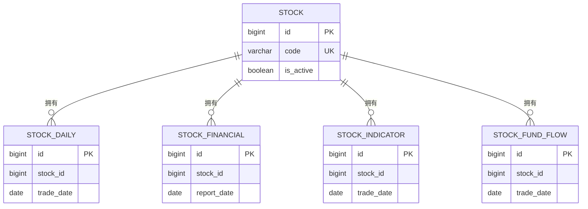
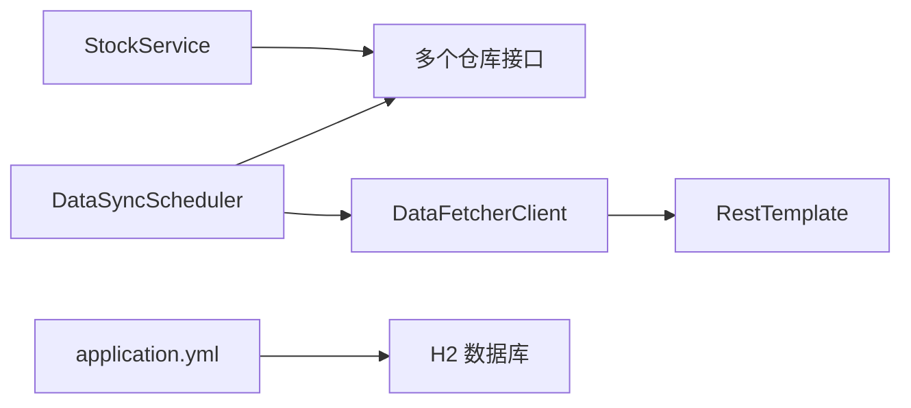

# 索引与性能优化

<cite>
**本文引用的文件**
- [StockApplication.java](file://backend/src/main/java/com/stock/StockApplication.java)
- [application.yml](file://backend/src/main/resources/application.yml)
- [RestTemplateConfig.java](file://backend/src/main/java/com/stock/config/RestTemplateConfig.java)
- [DataFetcherClient.java](file://backend/src/main/java/com/stock/client/DataFetcherClient.java)
- [StockRepository.java](file://backend/src/main/java/com/stock/repository/StockRepository.java)
- [Stock.java](file://backend/src/main/java/com/stock/entity/Stock.java)
- [StockDailyRepository.java](file://backend/src/main/java/com/stock/repository/StockDailyRepository.java)
- [StockDaily.java](file://backend/src/main/java/com/stock/entity/StockDaily.java)
- [StockFinancial.java](file://backend/src/main/java/com/stock/entity/StockFinancial.java)
- [StockIndicator.java](file://backend/src/main/java/com/stock/entity/StockIndicator.java)
- [StockFundFlow.java](file://backend/src/main/java/com/stock/entity/StockFundFlow.java)
- [StockService.java](file://backend/src/main/java/com/stock/service/StockService.java)
- [DataSyncScheduler.java](file://backend/src/main/java/com/stock/scheduler/DataSyncScheduler.java)
</cite>

## 目录
1. [简介](#简介)
2. [项目结构](#项目结构)
3. [核心组件](#核心组件)
4. [架构总览](#架构总览)
5. [详细组件分析](#详细组件分析)
6. [依赖分析](#依赖分析)
7. [性能考量](#性能考量)
8. [故障排查指南](#故障排查指南)
9. [结论](#结论)
10. [附录](#附录)

## 简介
本文件聚焦于数据库索引与性能优化，结合系统中实际的数据模型与查询模式，给出索引设计策略（单列、复合、唯一）、查询性能分析方法（执行计划与慢查询优化）、索引创建最佳实践（高选择性、频繁查询字段）、分区表设计建议、缓存与连接池配置、以及监控与调优方法。文档中的所有建议均基于后端代码库中实体定义、仓库接口与调度任务的查询行为进行归纳总结。

## 项目结构
系统采用 Spring Boot + JPA/Hibernate + H2 的技术栈，数据持久化通过 JPA 仓库接口访问 H2 文件数据库；定时任务负责周期性同步行情、财务、资金流等数据；外部数据抓取通过 RestTemplate 客户端调用独立的数据服务。

图表来源
- [StockApplication.java:1-16](file://backend/src/main/java/com/stock/StockApplication.java#L1-L16)
- [application.yml:1-28](file://backend/src/main/resources/application.yml#L1-L28)
- [RestTemplateConfig.java:1-18](file://backend/src/main/java/com/stock/config/RestTemplateConfig.java#L1-L18)
- [DataFetcherClient.java:1-126](file://backend/src/main/java/com/stock/client/DataFetcherClient.java#L1-L126)
- [StockService.java:1-243](file://backend/src/main/java/com/stock/service/StockService.java#L1-L243)
- [DataSyncScheduler.java:1-238](file://backend/src/main/java/com/stock/scheduler/DataSyncScheduler.java#L1-L238)
- [StockRepository.java:1-18](file://backend/src/main/java/com/stock/repository/StockRepository.java#L1-L18)
- [StockDailyRepository.java:1-24](file://backend/src/main/java/com/stock/repository/StockDailyRepository.java#L1-L24)
- [Stock.java:1-86](file://backend/src/main/java/com/stock/entity/Stock.java#L1-L86)
- [StockDaily.java:1-60](file://backend/src/main/java/com/stock/entity/StockDaily.java#L1-L60)
- [StockFinancial.java:1-72](file://backend/src/main/java/com/stock/entity/StockFinancial.java#L1-L72)
- [StockIndicator.java:1-72](file://backend/src/main/java/com/stock/entity/StockIndicator.java#L1-L72)
- [StockFundFlow.java:1-66](file://backend/src/main/java/com/stock/entity/StockFundFlow.java#L1-L66)

章节来源
- [StockApplication.java:1-16](file://backend/src/main/java/com/stock/StockApplication.java#L1-L16)
- [application.yml:1-28](file://backend/src/main/resources/application.yml#L1-L28)

## 核心组件
- 数据源与连接池：H2 文件数据库，JPA 自动建模，DDL 自动更新。
- 查询模式：主要围绕股票基础信息、日线行情、财务指标、技术指标、资金流等维度进行读写。
- 定时任务：按工作日与周期拉取数据，涉及大量批量插入与去重逻辑。
- 外部调用：通过 RestTemplate 访问独立数据服务，具备超时配置。

章节来源
- [application.yml:4-17](file://backend/src/main/resources/application.yml#L4-L17)
- [RestTemplateConfig.java:1-18](file://backend/src/main/java/com/stock/config/RestTemplateConfig.java#L1-L18)
- [DataSyncScheduler.java:1-238](file://backend/src/main/java/com/stock/scheduler/DataSyncScheduler.java#L1-L238)
- [DataFetcherClient.java:1-126](file://backend/src/main/java/com/stock/client/DataFetcherClient.java#L1-L126)

## 架构总览
下图展示从控制器到数据访问层的关键路径，以及定时任务对数据仓库的影响。

图表来源
- [StockController.java:1-57](file://backend/src/main/java/com/stock/controller/StockController.java#L1-L57)
- [StockService.java:215-236](file://backend/src/main/java/com/stock/service/StockService.java#L215-L236)
- [StockRepository.java:10-17](file://backend/src/main/java/com/stock/repository/StockRepository.java#L10-L17)

## 详细组件分析

### 数据模型与索引设计策略
基于实体定义，可识别出高频查询字段与唯一约束，据此制定索引策略：

- 唯一索引
  - 股票代码唯一：Stock.code（唯一约束）
  - 日线/财务/指标/资金流唯一组合：StockDaily(stock_id, trade_date)、StockFinancial(stock_id, report_date)、StockIndicator(stock_id, trade_date)、StockFundFlow(stock_id, trade_date)
  - 设计理由：保证数据完整性，加速按股票与日期的唯一性查询与去重。

- 单列索引
  - 活跃状态过滤：Stock.is_active（用于筛选活跃股票）
  - 股票主键：Stock.id（默认主键，通常自动建立聚簇索引）
  - 日线外键：StockDaily.stock_id（用于按股票分组查询）

- 复合索引
  - 日线区间查询：StockDaily(stock_id, trade_date)（已由唯一索引覆盖，但需确认是否满足范围查询需求）
  - 财务/指标/资金流按股票+日期查询：上述唯一索引已覆盖

图表来源
- [Stock.java:1-86](file://backend/src/main/java/com/stock/entity/Stock.java#L1-L86)
- [StockDaily.java:1-60](file://backend/src/main/java/com/stock/entity/StockDaily.java#L1-L60)
- [StockFinancial.java:1-72](file://backend/src/main/java/com/stock/entity/StockFinancial.java#L1-L72)
- [StockIndicator.java:1-72](file://backend/src/main/java/com/stock/entity/StockIndicator.java#L1-L72)
- [StockFundFlow.java:1-66](file://backend/src/main/java/com/stock/entity/StockFundFlow.java#L1-L66)

章节来源
- [Stock.java:23-24](file://backend/src/main/java/com/stock/entity/Stock.java#L23-L24)
- [StockDaily.java:15-17](file://backend/src/main/java/com/stock/entity/StockDaily.java#L15-L17)
- [StockFinancial.java:15-17](file://backend/src/main/java/com/stock/entity/StockFinancial.java#L15-L17)
- [StockIndicator.java:15-17](file://backend/src/main/java/com/stock/entity/StockIndicator.java#L15-L17)
- [StockFundFlow.java:15-17](file://backend/src/main/java/com/stock/entity/StockFundFlow.java#L15-L17)

### 查询性能分析与慢查询优化
- 执行计划分析
  - 使用 H2 控制台查看 SQL 执行计划，关注全表扫描、索引使用情况与排序/连接开销。
  - 关注范围查询（between）与日期索引的匹配度，避免函数包裹导致索引失效。

- 慢查询优化
  - 避免在 WHERE 子句中对索引列使用函数或表达式。
  - 对频繁的日期范围查询，确保查询谓词与索引列顺序一致（如 stock_id + trade_date）。
  - 批量写入时使用批量保存，减少事务拆分与往返次数。

- 具体优化点
  - 日线区间查询：优先使用 StockDailyRepository 中的按 stock_id + 日期范围查询方法，确保走唯一索引。
  - 最大交易日期查询：使用原生查询或 JPQL 获取最大日期，避免不必要的排序。
  - 删除清理：按 stock_id 清理多表数据时，先删除子表再删除主表，减少外键检查成本。

章节来源
- [StockDailyRepository.java:15-20](file://backend/src/main/java/com/stock/repository/StockDailyRepository.java#L15-L20)
- [DataSyncScheduler.java:223-225](file://backend/src/main/java/com/stock/scheduler/DataSyncScheduler.java#L223-L225)

### 索引创建最佳实践
- 高选择性字段
  - 股票代码（唯一）：作为主查询条件，应保持唯一性并确保高效检索。
  - 日期字段（trade_date/report_date）：与 stock_id 组合，提升时间序列查询效率。

- 频繁查询字段
  - is_active：用于活跃股票列表，建议建立单列索引。
  - stock_id：作为外键广泛参与联接与过滤，建议建立索引。

- 复合索引设计
  - 以“过滤性强的列 + 范围查询列”的顺序构建复合索引，例如 (stock_id, trade_date)。
  - 避免冗余索引，优先利用现有唯一索引覆盖常见查询。

- 唯一索引
  - 在 (stock_id, trade_date) 等唯一约束上，确保数据一致性的同时获得快速去重与唯一查找能力。

章节来源
- [StockRepository.java:12-16](file://backend/src/main/java/com/stock/repository/StockRepository.java#L12-L16)
- [StockDailyRepository.java:15-17](file://backend/src/main/java/com/stock/repository/StockDailyRepository.java#L15-L17)
- [Stock.java:83-84](file://backend/src/main/java/com/stock/entity/Stock.java#L83-L84)

### 分区表设计与使用场景
- 场景建议
  - 按年/月对 StockDaily 进行分区，便于清理历史数据与加速时间范围查询。
  - 按 stock_id 哈希分区可分散热点，提升并发写入性能（需数据库支持）。

- 注意事项
  - 分区键选择需与查询模式匹配（如 stock_id + trade_date）。
  - 分区过多会增加维护成本，需权衡查询性能与管理复杂度。

[本节为概念性内容，不直接分析具体文件，故无章节来源]

### 缓存策略、连接池与查询优化技巧
- 缓存策略
  - 读多写少的静态数据（如股票基础信息）可引入二级缓存或本地缓存，降低数据库压力。
  - 对高频报表数据（如当日行情、指标）可采用短期缓存，结合定时刷新。

- 连接池配置
  - 当前使用 H2 文件数据库，连接池参数在 application.yml 中未显式配置，建议根据并发与吞吐需求调整连接数与超时。
  - 外部 HTTP 客户端已设置连接与读取超时，避免阻塞影响整体性能。

- 查询优化技巧
  - 使用投影查询（DTO）减少字段传输与序列化开销。
  - 合理分页与批量处理，避免一次性加载大量数据。
  - 使用 exists/unique 查询替代 count(*) 判断存在性。

章节来源
- [application.yml:4-17](file://backend/src/main/resources/application.yml#L4-L17)
- [RestTemplateConfig.java:1-18](file://backend/src/main/java/com/stock/config/RestTemplateConfig.java#L1-L18)
- [StockService.java:191-213](file://backend/src/main/java/com/stock/service/StockService.java#L191-L213)

## 依赖分析
- 组件耦合
  - StockService 依赖多个仓库接口，承担跨表数据聚合与初始化触发。
  - DataSyncScheduler 依赖仓库与外部客户端，驱动批量数据同步与指标重算。
  - DataFetcherClient 通过 RestTemplate 访问外部数据服务，具备统一异常处理。

- 外部依赖
  - H2 数据库：文件型存储，适合开发与测试环境。
  - 外部数据服务：通过配置项指定地址与超时，避免长连接与阻塞。

图表来源
- [StockService.java:1-243](file://backend/src/main/java/com/stock/service/StockService.java#L1-L243)
- [DataSyncScheduler.java:1-238](file://backend/src/main/java/com/stock/scheduler/DataSyncScheduler.java#L1-L238)
- [DataFetcherClient.java:1-126](file://backend/src/main/java/com/stock/client/DataFetcherClient.java#L1-L126)
- [application.yml:4-17](file://backend/src/main/resources/application.yml#L4-L17)

章节来源
- [StockService.java:51-91](file://backend/src/main/java/com/stock/service/StockService.java#L51-L91)
- [DataSyncScheduler.java:32-52](file://backend/src/main/java/com/stock/scheduler/DataSyncScheduler.java#L32-L52)
- [DataFetcherClient.java:19-24](file://backend/src/main/java/com/stock/client/DataFetcherClient.java#L19-L24)

## 性能考量
- 数据增长与查询模式
  - 日线数据按日增量，建议按日期分区或归档旧数据。
  - 技术指标与资金流数据体量较大，需配合批量写入与索引策略。

- 并发与事务
  - 定时任务在事务内批量写入，注意锁竞争与死锁风险。
  - 异步初始化在事务提交后触发，避免读取未提交数据。

- 监控与告警
  - 结合 H2 控制台与应用日志，监控慢查询与异常。
  - 对外部数据抓取设置超时与重试，避免雪崩效应。

[本节为通用性能指导，不直接分析具体文件，故无章节来源]

## 故障排查指南
- 常见问题
  - 查询慢：检查是否命中索引、是否存在全表扫描、是否对索引列使用函数。
  - 外部接口超时：检查 RestTemplate 超时配置与网络连通性。
  - 数据重复：确认唯一约束是否生效，以及入库前去重逻辑。

- 排查步骤
  - 使用 H2 控制台执行 EXPLAIN 查看执行计划。
  - 在 StockService 与 DataSyncScheduler 中定位具体查询方法，核对参数与返回结果。
  - 检查 application.yml 中数据库与定时任务配置是否正确。

章节来源
- [application.yml:19-27](file://backend/src/main/resources/application.yml#L19-L27)
- [RestTemplateConfig.java:11-16](file://backend/src/main/java/com/stock/config/RestTemplateConfig.java#L11-L16)
- [StockService.java:94-163](file://backend/src/main/java/com/stock/service/StockService.java#L94-L163)
- [DataSyncScheduler.java:54-82](file://backend/src/main/java/com/stock/scheduler/DataSyncScheduler.java#L54-L82)

## 结论
通过对实体与查询模式的分析，建议优先完善唯一索引与单列索引，针对高频范围查询补充复合索引；结合分区与缓存策略提升大规模时间序列数据的查询与写入性能；同时完善监控与超时配置，保障系统稳定性与可维护性。

[本节为总结性内容，不直接分析具体文件，故无章节来源]

## 附录
- 关键查询路径参考
  - 按股票 ID 获取最新交易日：[StockDailyRepository.findTopByStockIdOrderByTradeDateDesc:17-17](file://backend/src/main/java/com/stock/repository/StockDailyRepository.java#L17-L17)
  - 按股票 ID 与日期范围查询日线：[StockDailyRepository.findByStockIdAndTradeDateBetweenOrderByTradeDate:15-15](file://backend/src/main/java/com/stock/repository/StockDailyRepository.java#L15-L15)
  - 获取最大交易日期：[StockDailyRepository.findMaxTradeDateByStockId:19-20](file://backend/src/main/java/com/stock/repository/StockDailyRepository.java#L19-L20)
  - 活跃股票列表：[StockRepository.findByIsActiveTrue:16-16](file://backend/src/main/java/com/stock/repository/StockRepository.java#L16-L16)

[本节为附录性内容，不直接分析具体文件，故无章节来源]