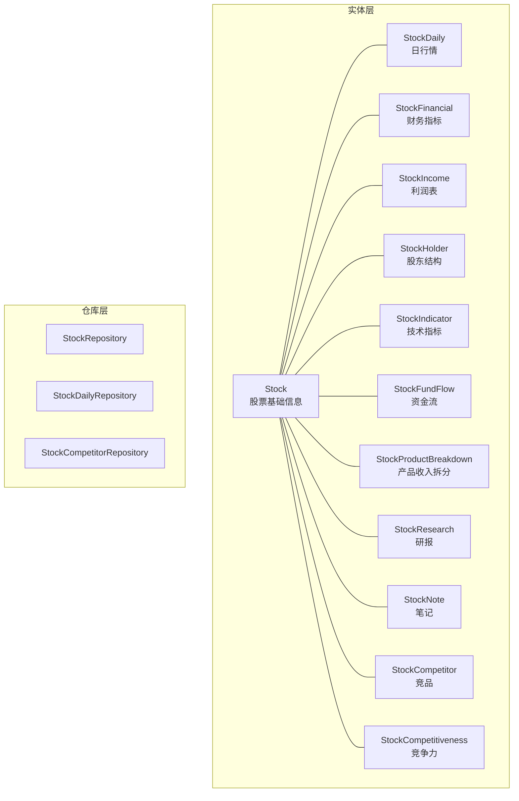
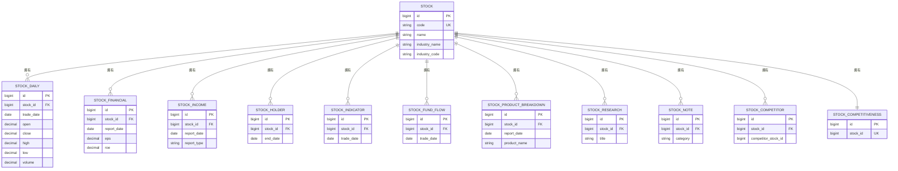
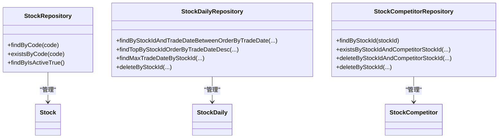

# 表关系设计

<cite>
**本文引用的文件**
- [Stock.java](file://backend/src/main/java/com/stock/entity/Stock.java)
- [StockDaily.java](file://backend/src/main/java/com/stock/entity/StockDaily.java)
- [StockFinancial.java](file://backend/src/main/java/com/stock/entity/StockFinancial.java)
- [StockCompetitor.java](file://backend/src/main/java/com/stock/entity/StockCompetitor.java)
- [StockCompetitiveness.java](file://backend/src/main/java/com/stock/entity/StockCompetitiveness.java)
- [StockHolder.java](file://backend/src/main/java/com/stock/entity/StockHolder.java)
- [StockIncome.java](file://backend/src/main/java/com/stock/entity/StockIncome.java)
- [StockIndicator.java](file://backend/src/main/java/com/stock/entity/StockIndicator.java)
- [StockResearch.java](file://backend/src/main/java/com/stock/entity/StockResearch.java)
- [StockNote.java](file://backend/src/main/java/com/stock/entity/StockNote.java)
- [StockFundFlow.java](file://backend/src/main/java/com/stock/entity/StockFundFlow.java)
- [StockProductBreakdown.java](file://backend/src/main/java/com/stock/entity/StockProductBreakdown.java)
- [StockRepository.java](file://backend/src/main/java/com/stock/repository/StockRepository.java)
- [StockDailyRepository.java](file://backend/src/main/java/com/stock/repository/StockDailyRepository.java)
- [StockCompetitorRepository.java](file://backend/src/main/java/com/stock/repository/StockCompetitorRepository.java)
</cite>

## 目录
1. [引言](#引言)
2. [项目结构](#项目结构)
3. [核心组件](#核心组件)
4. [架构总览](#架构总览)
5. [详细组件分析](#详细组件分析)
6. [依赖分析](#依赖分析)
7. [性能考虑](#性能考虑)
8. [故障排查指南](#故障排查指南)
9. [结论](#结论)
10. [附录](#附录)

## 引言
本文件聚焦于该股票交易系统中数据库表之间的关系设计与实现。通过对后端 JPA 实体类与仓库接口的分析，梳理出各数据表的主键、唯一性约束、外键（通过业务逻辑体现）以及典型的一对一、一对多、多对多关系，并给出 ER 关系图与表结构图。同时，讨论复合主键与联合外键的使用场景、中间表设计模式、级联行为的实现方式与维护策略。

## 项目结构
后端采用 Spring Data JPA 的分层组织：实体（entity）、仓库（repository）、服务（service）与控制器（controller）。本文仅从实体与仓库层面分析表关系设计，不涉及具体 SQL 语句与数据库 DDL 定义。

图表来源
- [Stock.java:16-84](file://backend/src/main/java/com/stock/entity/Stock.java#L16-L84)
- [StockDaily.java:15-59](file://backend/src/main/java/com/stock/entity/StockDaily.java#L15-L59)
- [StockFinancial.java:15-71](file://backend/src/main/java/com/stock/entity/StockFinancial.java#L15-L71)
- [StockIncome.java:14-40](file://backend/src/main/java/com/stock/entity/StockIncome.java#L14-L40)
- [StockHolder.java:15-47](file://backend/src/main/java/com/stock/entity/StockHolder.java#L15-L47)
- [StockIndicator.java:15-71](file://backend/src/main/java/com/stock/entity/StockIndicator.java#L15-L71)
- [StockFundFlow.java:15-65](file://backend/src/main/java/com/stock/entity/StockFundFlow.java#L15-L65)
- [StockProductBreakdown.java:16-43](file://backend/src/main/java/com/stock/entity/StockProductBreakdown.java#L16-L43)
- [StockResearch.java:14-54](file://backend/src/main/java/com/stock/entity/StockResearch.java#L14-L54)
- [StockNote.java:14-36](file://backend/src/main/java/com/stock/entity/StockNote.java#L14-L36)
- [StockCompetitor.java:14-31](file://backend/src/main/java/com/stock/entity/StockCompetitor.java#L14-L31)
- [StockCompetitiveness.java:15-50](file://backend/src/main/java/com/stock/entity/StockCompetitiveness.java#L15-L50)

章节来源
- [Stock.java:16-84](file://backend/src/main/java/com/stock/entity/Stock.java#L16-L84)
- [StockDaily.java:15-59](file://backend/src/main/java/com/stock/entity/StockDaily.java#L15-L59)
- [StockRepository.java:10-17](file://backend/src/main/java/com/stock/repository/StockRepository.java#L10-L17)

## 核心组件
- 股票基础信息表（stock）
  - 主键：自增 id
  - 唯一键：code（股票代码唯一）
  - 字段覆盖行业、市值、市盈率、市净率等基础属性
- 日行情表（stock_daily）
  - 主键：自增 id
  - 复合唯一键：(stock_id, trade_date)
  - 用于记录每日开盘、收盘、最高、最低、成交量、成交额等
- 财务指标表（stock_financial）
  - 主键：自增 id
  - 复合唯一键：(stock_id, report_date)
  - 记录季度/年度财务指标，如 EPS、ROE、毛利率等
- 利润表（stock_income）
  - 主键：自增 id
  - 复合唯一键：(stock_id, report_date, report_type)
  - 按报告类型区分合并报表/母公司报表等
- 股东结构（stock_holder）
  - 主键：自增 id
  - 复合唯一键：(stock_id, end_date)
  - 记录期末股东户数、户均持股等
- 技术指标（stock_indicator）
  - 主键：自增 id
  - 复合唯一键：(stock_id, trade_date)
  - 记录 MA、MACD、RSI、布林带等
- 资金流（stock_fund_flow）
  - 主键：自增 id
  - 复合唯一键：(stock_id, trade_date)
  - 记录主力净流入、大单、中单、小单等分层资金流
- 产品收入拆分（stock_product_breakdown）
  - 主键：自增 id
  - 复合唯一键：(stock_id, report_date, product_name)
  - 记录按产品维度的收入与占比
- 研报（stock_research）
  - 主键：自增 id
  - 无显式复合唯一键
- 笔记（stock_note）
  - 主键：自增 id
  - 无显式复合唯一键
- 竞品（stock_competitor）
  - 主键：自增 id
  - 复合唯一键：(stock_id, competitor_stock_id)
  - 无外键约束声明，但通过业务保证 refer stock(id)
- 竞争力（stock_competitiveness）
  - 主键：自增 id
  - 唯一键：stock_id（一对一）

章节来源
- [Stock.java:19-84](file://backend/src/main/java/com/stock/entity/Stock.java#L19-L84)
- [StockDaily.java:15-17](file://backend/src/main/java/com/stock/entity/StockDaily.java#L15-L17)
- [StockFinancial.java:15-17](file://backend/src/main/java/com/stock/entity/StockFinancial.java#L15-L17)
- [StockIncome.java:14-16](file://backend/src/main/java/com/stock/entity/StockIncome.java#L14-L16)
- [StockHolder.java:15-17](file://backend/src/main/java/com/stock/entity/StockHolder.java#L15-L17)
- [StockIndicator.java:15-17](file://backend/src/main/java/com/stock/entity/StockIndicator.java#L15-L17)
- [StockFundFlow.java:15-17](file://backend/src/main/java/com/stock/entity/StockFundFlow.java#L15-L17)
- [StockProductBreakdown.java:16](file://backend/src/main/java/com/stock/entity/StockProductBreakdown.java#L16)
- [StockCompetitor.java:14-16](file://backend/src/main/java/com/stock/entity/StockCompetitor.java#L14-L16)
- [StockCompetitiveness.java:15-17](file://backend/src/main/java/com/stock/entity/StockCompetitiveness.java#L15-L17)

## 架构总览
下图展示以“股票”为中心的典型一对多关系：一个股票可对应多条日行情、财务、利润、股东、指标、资金流、产品拆分、研报、笔记；同时存在一对一关系（股票与其竞争力档案），以及多对多关系（通过中间表“竞品”实现）。

图表来源
- [Stock.java:19-84](file://backend/src/main/java/com/stock/entity/Stock.java#L19-L84)
- [StockDaily.java:24-28](file://backend/src/main/java/com/stock/entity/StockDaily.java#L24-L28)
- [StockFinancial.java:24-28](file://backend/src/main/java/com/stock/entity/StockFinancial.java#L24-L28)
- [StockIncome.java:23-39](file://backend/src/main/java/com/stock/entity/StockIncome.java#L23-L39)
- [StockHolder.java:24-28](file://backend/src/main/java/com/stock/entity/StockHolder.java#L24-L28)
- [StockIndicator.java:24-28](file://backend/src/main/java/com/stock/entity/StockIndicator.java#L24-L28)
- [StockFundFlow.java:24-28](file://backend/src/main/java/com/stock/entity/StockFundFlow.java#L24-L28)
- [StockProductBreakdown.java:23-36](file://backend/src/main/java/com/stock/entity/StockProductBreakdown.java#L23-L36)
- [StockResearch.java:22-35](file://backend/src/main/java/com/stock/entity/StockResearch.java#L22-L35)
- [StockNote.java:21-35](file://backend/src/main/java/com/stock/entity/StockNote.java#L21-L35)
- [StockCompetitor.java:23-27](file://backend/src/main/java/com/stock/entity/StockCompetitor.java#L23-L27)
- [StockCompetitiveness.java:24](file://backend/src/main/java/com/stock/entity/StockCompetitiveness.java#L24)

## 详细组件分析

### 一对一关系：股票与竞争力档案
- 设计要点
  - 股票表（stock）与竞争力表（stock_competitiveness）之间为一对一关系
  - 在竞争力表中以 stock_id 建唯一约束，确保每个股票仅有一条竞争力记录
- 数据完整性
  - 通过唯一约束保证一对一
  - 更新时间字段可用于审计与版本控制
- 使用建议
  - 读取时可进行内连接查询，减少 N+1 查询
  - 写入时需保证原子性，避免并发导致重复插入

章节来源
- [StockCompetitiveness.java:15-17](file://backend/src/main/java/com/stock/entity/StockCompetitiveness.java#L15-L17)
- [StockCompetitiveness.java:24](file://backend/src/main/java/com/stock/entity/StockCompetitiveness.java#L24)

### 一对多关系：股票与日行情、财务、利润、股东、指标、资金流、产品拆分、研报、笔记
- 共同特征
  - 各子表均以 stock_id 作为外键（业务外键，未在实体上声明外键约束）
  - 通过复合唯一键防止重复记录（如按日期或产品名去重）
- 数据完整性
  - 复合唯一键确保同一股票在同一天或同一产品下的唯一性
  - 删除股票时，可通过仓库提供的批量删除方法清理子表数据
- 性能优化
  - 对 stock_id 建立索引，加速按股票维度的查询
  - 对 trade_date、report_date 等时间字段建立索引，支持范围查询

章节来源
- [StockDaily.java:15-17](file://backend/src/main/java/com/stock/entity/StockDaily.java#L15-L17)
- [StockFinancial.java:15-17](file://backend/src/main/java/com/stock/entity/StockFinancial.java#L15-L17)
- [StockIncome.java:14-16](file://backend/src/main/java/com/stock/entity/StockIncome.java#L14-L16)
- [StockHolder.java:15-17](file://backend/src/main/java/com/stock/entity/StockHolder.java#L15-L17)
- [StockIndicator.java:15-17](file://backend/src/main/java/com/stock/entity/StockIndicator.java#L15-L17)
- [StockFundFlow.java:15-17](file://backend/src/main/java/com/stock/entity/StockFundFlow.java#L15-L17)
- [StockProductBreakdown.java:16](file://backend/src/main/java/com/stock/entity/StockProductBreakdown.java#L16)
- [StockResearch.java:14-54](file://backend/src/main/java/com/stock/entity/StockResearch.java#L14-L54)
- [StockNote.java:14-36](file://backend/src/main/java/com/stock/entity/StockNote.java#L14-L36)

### 多对多关系：股票与竞品（中间表）
- 设计要点
  - 通过中间表（stock_competitor）实现多对多
  - 中间表以 (stock_id, competitor_stock_id) 建唯一约束，避免重复竞品关系
  - 无外键约束声明，需在业务层保证 refer stock(id)
- 数据完整性
  - 唯一键约束防止重复关系
  - 提供按 stock_id 查询与删除的方法，便于维护关系集合
- 使用建议
  - 查询竞品时可进行自连接或子查询
  - 删除竞品关系时注意双向性与一致性

章节来源
- [StockCompetitor.java:14-16](file://backend/src/main/java/com/stock/entity/StockCompetitor.java#L14-L16)
- [StockCompetitorRepository.java:9-18](file://backend/src/main/java/com/stock/repository/StockCompetitorRepository.java#L9-L18)

### 复合主键与联合外键使用场景
- 复合唯一键（联合唯一）
  - 日行情、财务、利润、股东、指标、资金流、产品拆分等表均采用 (stock_id, date_or_name) 组合作为唯一约束，避免重复记录
- 单列主键 + 外键
  - 大多数子表使用自增主键 + stock_id 外键，简化关联查询
- 中间表
  - 竞品关系表使用 (stock_id, competitor_stock_id) 唯一键，形成多对多关系

章节来源
- [StockDaily.java:15-17](file://backend/src/main/java/com/stock/entity/StockDaily.java#L15-L17)
- [StockFinancial.java:15-17](file://backend/src/main/java/com/stock/entity/StockFinancial.java#L15-L17)
- [StockIncome.java:14-16](file://backend/src/main/java/com/stock/entity/StockIncome.java#L14-L16)
- [StockHolder.java:15-17](file://backend/src/main/java/com/stock/entity/StockHolder.java#L15-L17)
- [StockIndicator.java:15-17](file://backend/src/main/java/com/stock/entity/StockIndicator.java#L15-L17)
- [StockFundFlow.java:15-17](file://backend/src/main/java/com/stock/entity/StockFundFlow.java#L15-L17)
- [StockProductBreakdown.java:16](file://backend/src/main/java/com/stock/entity/StockProductBreakdown.java#L16)
- [StockCompetitor.java:14-16](file://backend/src/main/java/com/stock/entity/StockCompetitor.java#L14-L16)

### 级联操作与约束
- 现状
  - 实体类未声明 JPA 外键级联（如 @JoinColumn、@OneToMany(cascade=...)）
  - 仓库接口提供按 stock_id 的批量删除方法，用于在删除股票时清理子表数据
- 建议
  - 在实体层通过 @JoinColumn(foreignKey=@ForeignKey(...)) 显式声明外键约束名称
  - 对于强依赖关系（如日行情、财务等），可在实体上配置 cascade 和 orphanRemoval
  - 对于弱关系（如研报、笔记），保持独立生命周期，通过业务层控制删除顺序

章节来源
- [StockDailyRepository.java:22](file://backend/src/main/java/com/stock/repository/StockDailyRepository.java#L22)
- [StockCompetitorRepository.java:17](file://backend/src/main/java/com/stock/repository/StockCompetitorRepository.java#L17)

### 关系完整性约束的实现与维护策略
- 唯一键约束
  - 通过 @UniqueConstraint 或 @Table(uniqueConstraints=...) 声明复合唯一键，防止重复
- 业务层校验
  - 在仓库层提供 existsBy... 方法，用于插入前校验唯一性
- 批量清理
  - 提供 deleteByStockId(...) 方法，确保删除父记录时同步清理子记录
- 审计字段
  - 部分子表包含 created_at/updated_at 字段，便于追踪变更

章节来源
- [StockDailyRepository.java:15-20](file://backend/src/main/java/com/stock/repository/StockDailyRepository.java#L15-L20)
- [StockCompetitorRepository.java:11-15](file://backend/src/main/java/com/stock/repository/StockCompetitorRepository.java#L11-L15)
- [StockNote.java:31-35](file://backend/src/main/java/com/stock/entity/StockNote.java#L31-L35)

## 依赖分析
- 实体依赖
  - 子表实体仅依赖 stock_id 进行关联，未声明 JPA 外键注解
- 仓库依赖
  - 仓库接口继承 JpaRepository，提供按主键与组合条件的查询与删除能力
  - 通过 @Query 与命名参数支持复杂查询（如按日期范围查询日线）

图表来源
- [StockRepository.java:10-17](file://backend/src/main/java/com/stock/repository/StockRepository.java#L10-L17)
- [StockDailyRepository.java:13-23](file://backend/src/main/java/com/stock/repository/StockDailyRepository.java#L13-L23)
- [StockCompetitorRepository.java:9-18](file://backend/src/main/java/com/stock/repository/StockCompetitorRepository.java#L9-L18)

章节来源
- [StockRepository.java:10-17](file://backend/src/main/java/com/stock/repository/StockRepository.java#L10-L17)
- [StockDailyRepository.java:13-23](file://backend/src/main/java/com/stock/repository/StockDailyRepository.java#L13-L23)
- [StockCompetitorRepository.java:9-18](file://backend/src/main/java/com/stock/repository/StockCompetitorRepository.java#L9-L18)

## 性能考虑
- 索引策略
  - 对 stock_id 建立索引，提升按股票维度的查询性能
  - 对 trade_date、report_date 等时间字段建立索引，支持范围查询
- 查询优化
  - 使用仓库提供的范围查询与排序方法，避免全表扫描
  - 对高频查询（如最新日线）优先使用 top/limit 查询
- 写入优化
  - 批量写入时注意复合唯一键冲突处理，必要时先查后插
  - 控制事务粒度，避免长时间持有锁

## 故障排查指南
- 插入重复数据
  - 症状：违反唯一约束异常
  - 排查：确认复合唯一键是否正确，检查是否存在并发插入
  - 处理：在业务层先 existsBy... 校验，再执行插入
- 删除不一致
  - 症状：删除股票后子表残留
  - 排查：确认是否调用 deleteByStockId(...) 清理子表
  - 处理：在删除股票流程中调用相关仓库的批量删除方法
- 查询结果为空
  - 症状：按 stock_id 查询不到数据
  - 排查：确认 stock_id 是否正确，是否存在大小写或格式差异
  - 处理：统一转换为标准格式后再查询

章节来源
- [StockDailyRepository.java:15-20](file://backend/src/main/java/com/stock/repository/StockDailyRepository.java#L15-L20)
- [StockCompetitorRepository.java:11-15](file://backend/src/main/java/com/stock/repository/StockCompetitorRepository.java#L11-L15)

## 结论
本系统通过清晰的复合唯一键设计与中间表模式，实现了股票与其多维数据之间的一对多与多对多关系。当前实体层未声明显式外键级联，建议在实体层补充外键约束与级联配置，以增强关系完整性与可维护性。配合合理的索引与查询策略，可有效支撑高频读写场景。

## 附录
- 表关系设计最佳实践
  - 明确主外键关系，必要时在实体层声明外键约束
  - 对高频查询字段建立索引，避免全表扫描
  - 使用复合唯一键防止重复数据，确保业务唯一性
  - 在业务层提供幂等的插入与删除逻辑，保障一致性