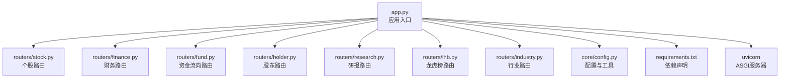
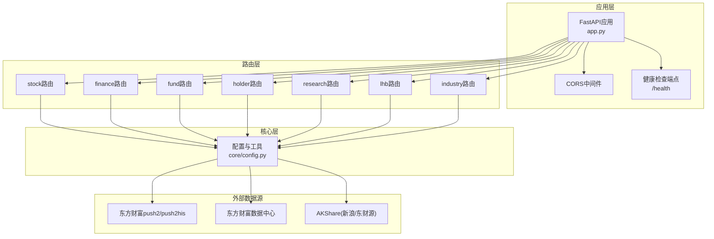
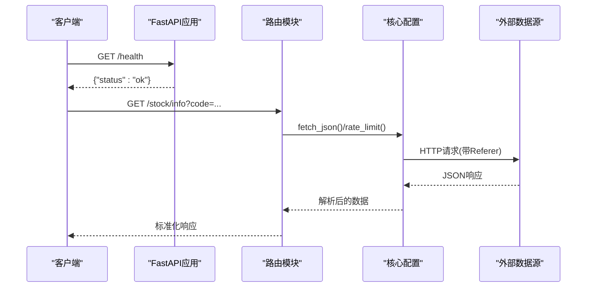
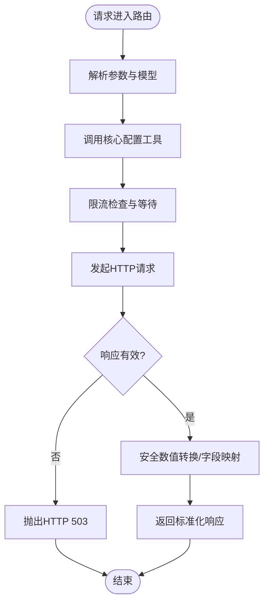
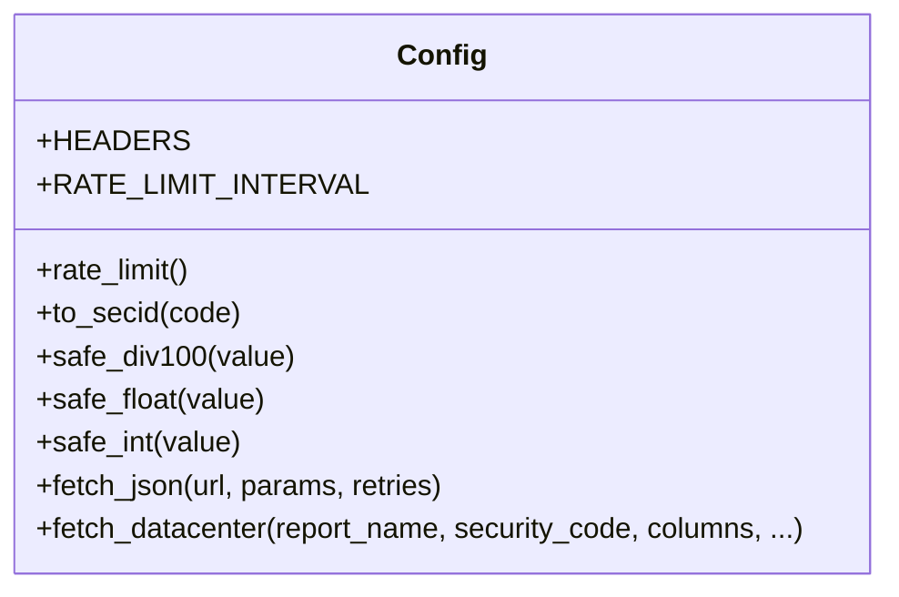
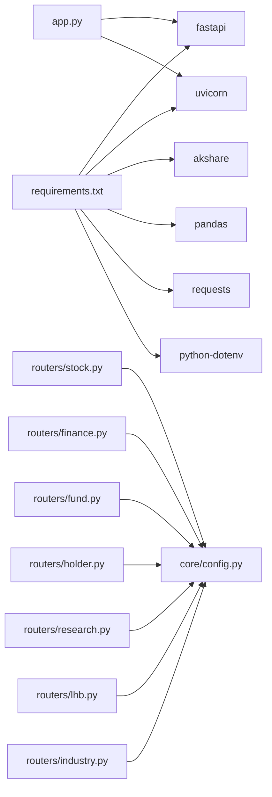
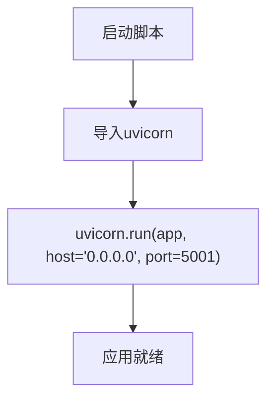

# FastAPI服务架构

<cite>
**本文引用的文件**
- [app.py](file://data-fetcher/app.py)
- [config.py](file://data-fetcher/core/config.py)
- [stock.py](file://data-fetcher/routers/stock.py)
- [finance.py](file://data-fetcher/routers/finance.py)
- [fund.py](file://data-fetcher/routers/fund.py)
- [holder.py](file://data-fetcher/routers/holder.py)
- [research.py](file://data-fetcher/routers/research.py)
- [lhb.py](file://data-fetcher/routers/lhb.py)
- [industry.py](file://data-fetcher/routers/industry.py)
- [requirements.txt](file://data-fetcher/requirements.txt)
- [test_config.py](file://data-fetcher/tests/test_config.py)
- [test_routers.py](file://data-fetcher/tests/test_routers.py)
- [test_stock_router.py](file://data-fetcher/tests/test_stock_router.py)
- [high-level-design.md](file://system-planner/high-level-design.md)
- [detailed-design.md](file://system-planner/detailed-design.md)
</cite>

## 目录
1. [简介](#简介)
2. [项目结构](#项目结构)
3. [核心组件](#核心组件)
4. [架构总览](#架构总览)
5. [详细组件分析](#详细组件分析)
6. [依赖分析](#依赖分析)
7. [性能考量](#性能考量)
8. [故障排查指南](#故障排查指南)
9. [结论](#结论)
10. [附录](#附录)

## 简介
本文件面向StockTradingSystem中的Python数据抓取服务（FastAPI），系统性梳理其服务初始化配置、中间件设置、路由注册机制、CORS跨域策略、健康检查端点、Uvicorn服务器配置、服务启动流程、配置管理与环境变量处理，并结合测试策略给出扩展性与性能优化建议。该服务作为Spring Boot后端的上游数据代理，负责对接东方财富与AKShare等外部数据源，提供标准化的REST接口。

## 项目结构
- 应用入口：app.py
- 路由模块：routers/stock.py、routers/finance.py、routers/fund.py、routers/holder.py、routers/research.py、routers/lhb.py、routers/industry.py
- 核心配置与工具：core/config.py
- 依赖声明：requirements.txt
- 测试：tests/test_config.py、tests/test_routers.py、tests/test_stock_router.py
- 系统设计文档：system-planner/high-level-design.md、system-planner/detailed-design.md

**图表来源**
- [app.py:1-31](file://data-fetcher/app.py#L1-L31)
- [stock.py:1-246](file://data-fetcher/routers/stock.py#L1-L246)
- [finance.py:1-148](file://data-fetcher/routers/finance.py#L1-L148)
- [fund.py:1-49](file://data-fetcher/routers/fund.py#L1-L49)
- [holder.py:1-41](file://data-fetcher/routers/holder.py#L1-L41)
- [research.py:1-63](file://data-fetcher/routers/research.py#L1-L63)
- [lhb.py:1-57](file://data-fetcher/routers/lhb.py#L1-L57)
- [industry.py:1-59](file://data-fetcher/routers/industry.py#L1-L59)
- [config.py:1-121](file://data-fetcher/core/config.py#L1-L121)
- [requirements.txt:1-7](file://data-fetcher/requirements.txt#L1-L7)

**章节来源**
- [app.py:1-31](file://data-fetcher/app.py#L1-L31)
- [requirements.txt:1-7](file://data-fetcher/requirements.txt#L1-L7)

## 核心组件
- 应用实例与中间件
  - 使用FastAPI创建应用实例，启用CORS中间件，允许任意来源、方法与头，便于前后端联调。
  - 注册多个路由模块，按功能分组（stock、fund、finance、holder、research、lhb、industry）。
  - 提供健康检查端点“/health”，返回服务可用状态。
  - 在主程序入口中直接运行Uvicorn服务器，监听0.0.0.0:5001。

- 核心配置与工具
  - 统一请求头（含必需Referer），用于满足目标站点要求。
  - 全局请求限流：最小500ms间隔，使用锁保护全局计时器，确保同一时刻仅有一个外部请求。
  - 数据转换工具：安全数值转换（除以100、浮点/整型转换）、SECID格式转换、JSON获取与重试（连接异常指数退避、超时重试）。
  - 数据中心API封装：统一参数构造与结果提取。

- 路由模块
  - 股票路由：个股信息、K线、分时、实时报价、批量报价。
  - 财务路由：利润表、财务摘要（AKShare）、估值。
  - 资金路由：资金流向（日K线维度）。
  - 股东路由：股东人数与持股比例等。
  - 研报路由：研报列表与评级信息（AKShare）。
  - 龙虎榜路由：按日期与可选股票过滤。
  - 行业路由：行业板块信息（AKShare）。

**章节来源**
- [app.py:1-31](file://data-fetcher/app.py#L1-L31)
- [config.py:1-121](file://data-fetcher/core/config.py#L1-L121)
- [stock.py:1-246](file://data-fetcher/routers/stock.py#L1-L246)
- [finance.py:1-148](file://data-fetcher/routers/finance.py#L1-L148)
- [fund.py:1-49](file://data-fetcher/routers/fund.py#L1-L49)
- [holder.py:1-41](file://data-fetcher/routers/holder.py#L1-L41)
- [research.py:1-63](file://data-fetcher/routers/research.py#L1-L63)
- [lhb.py:1-57](file://data-fetcher/routers/lhb.py#L1-L57)
- [industry.py:1-59](file://data-fetcher/routers/industry.py#L1-L59)

## 架构总览
FastAPI服务采用“入口应用 + 多路由模块 + 核心配置工具”的分层组织方式。应用启动时加载中间件与路由，路由内部通过核心配置工具访问外部数据源，统一进行限流、重试与数据转换，最终返回标准化响应。

**图表来源**
- [app.py:1-31](file://data-fetcher/app.py#L1-L31)
- [config.py:1-121](file://data-fetcher/core/config.py#L1-L121)
- [stock.py:1-246](file://data-fetcher/routers/stock.py#L1-L246)
- [finance.py:1-148](file://data-fetcher/routers/finance.py#L1-L148)
- [fund.py:1-49](file://data-fetcher/routers/fund.py#L1-L49)
- [holder.py:1-41](file://data-fetcher/routers/holder.py#L1-L41)
- [research.py:1-63](file://data-fetcher/routers/research.py#L1-L63)
- [lhb.py:1-57](file://data-fetcher/routers/lhb.py#L1-L57)
- [industry.py:1-59](file://data-fetcher/routers/industry.py#L1-L59)

## 详细组件分析

### 应用入口与中间件
- 中间件
  - CORS中间件允许任意来源、方法与头，便于前端开发调试。
- 路由注册
  - 通过include_router按功能标签分组注册，便于API文档分类与维护。
- 健康检查
  - “/health”端点返回固定状态，便于容器探针与运维监控。
- Uvicorn运行
  - 主程序入口直接运行Uvicorn，host绑定0.0.0.0，端口5001，便于容器化部署。

**图表来源**
- [app.py:23-25](file://data-fetcher/app.py#L23-L25)
- [stock.py:14-72](file://data-fetcher/routers/stock.py#L14-L72)
- [config.py:80-100](file://data-fetcher/core/config.py#L80-L100)

**章节来源**
- [app.py:1-31](file://data-fetcher/app.py#L1-L31)

### 路由模块设计
- 股票路由
  - 提供个股信息、K线、分时、实时报价与批量报价，统一进行SECID转换与数值安全处理。
- 财务路由
  - 利润表、财务摘要（AKShare）、估值，处理日期规范化与字段映射。
- 资金路由
  - 资金流向日K线，按字段拆分与安全转换。
- 股东路由
  - 股东人数与持股比例等，处理可能的百分比缩放。
- 研报路由
  - 研报列表与评级，尝试从标题等字段提取预测信息。
- 龙虎榜路由
  - 按日期与可选股票过滤，抽取交易明细。
- 行业路由
  - 行业板块信息，安全数值转换。

**图表来源**
- [stock.py:14-72](file://data-fetcher/routers/stock.py#L14-L72)
- [finance.py:14-40](file://data-fetcher/routers/finance.py#L14-L40)
- [fund.py:9-48](file://data-fetcher/routers/fund.py#L9-L48)
- [holder.py:9-40](file://data-fetcher/routers/holder.py#L9-L40)
- [research.py:9-62](file://data-fetcher/routers/research.py#L9-L62)
- [lhb.py:9-56](file://data-fetcher/routers/lhb.py#L9-L56)
- [industry.py:9-58](file://data-fetcher/routers/industry.py#L9-L58)
- [config.py:20-100](file://data-fetcher/core/config.py#L20-L100)

**章节来源**
- [stock.py:1-246](file://data-fetcher/routers/stock.py#L1-L246)
- [finance.py:1-148](file://data-fetcher/routers/finance.py#L1-L148)
- [fund.py:1-49](file://data-fetcher/routers/fund.py#L1-L49)
- [holder.py:1-41](file://data-fetcher/routers/holder.py#L1-L41)
- [research.py:1-63](file://data-fetcher/routers/research.py#L1-L63)
- [lhb.py:1-57](file://data-fetcher/routers/lhb.py#L1-L57)
- [industry.py:1-59](file://data-fetcher/routers/industry.py#L1-L59)

### 核心配置与工具
- 请求头与限流
  - 固定UA与Referer，最小500ms请求间隔，全局锁保护。
- 数值转换
  - 安全除以100、浮点/整型转换，处理None与异常值。
- JSON获取与重试
  - 连接异常指数退避（30s、60s），超时重试，统一超时时间。
- 数据中心API
  - 统一参数构造与结果提取，简化路由层调用。

**图表来源**
- [config.py:1-121](file://data-fetcher/core/config.py#L1-L121)

**章节来源**
- [config.py:1-121](file://data-fetcher/core/config.py#L1-L121)

## 依赖分析
- 第三方依赖
  - fastapi、uvicorn、akshare、pandas、requests、python-dotenv。
- 模块耦合
  - 路由模块依赖core/config.py进行数据获取与转换，耦合度低，内聚性强。
  - app.py集中管理中间件与路由注册，形成清晰的入口层。

**图表来源**
- [requirements.txt:1-7](file://data-fetcher/requirements.txt#L1-L7)
- [app.py:1-31](file://data-fetcher/app.py#L1-L31)
- [config.py:1-121](file://data-fetcher/core/config.py#L1-L121)

**章节来源**
- [requirements.txt:1-7](file://data-fetcher/requirements.txt#L1-L7)
- [app.py:1-31](file://data-fetcher/app.py#L1-L31)

## 性能考量
- 限流与退避
  - 全局500ms最小间隔，避免触发外部API限流；连接异常指数退避降低抖动。
- 超时与重试
  - 统一超时时间与有限重试次数，平衡可靠性与响应时间。
- 批量请求
  - 路由层对批量请求设置上限（如批量报价最多20只），防止瞬时压力过大。
- ASGI服务器
  - 使用Uvicorn作为ASGI服务器，具备较好的并发处理能力，适合生产部署。

**章节来源**
- [config.py:20-100](file://data-fetcher/core/config.py#L20-L100)
- [stock.py:213-245](file://data-fetcher/routers/stock.py#L213-L245)
- [app.py:28-31](file://data-fetcher/app.py#L28-L31)

## 故障排查指南
- 健康检查
  - 通过“/health”快速判断服务可用性。
- 错误码
  - 路由层在外部服务不可用时返回HTTP 503，便于上层感知与重试。
- 单元测试
  - 针对各路由的Mock测试覆盖成功、空数据与服务错误场景，便于定位问题。
- 日志与可观测性
  - 建议在核心配置工具中增加请求日志（URL、耗时、状态），便于问题追踪。

**章节来源**
- [app.py:23-25](file://data-fetcher/app.py#L23-L25)
- [stock.py:25-31](file://data-fetcher/routers/stock.py#L25-L31)
- [finance.py:21-22](file://data-fetcher/routers/finance.py#L21-L22)
- [fund.py:23-25](file://data-fetcher/routers/fund.py#L23-L25)
- [holder.py:16-17](file://data-fetcher/routers/holder.py#L16-L17)
- [research.py:60-62](file://data-fetcher/routers/research.py#L60-L62)
- [lhb.py:31-32](file://data-fetcher/routers/lhb.py#L31-L32)
- [test_stock_router.py:58-63](file://data-fetcher/tests/test_stock_router.py#L58-L63)
- [test_routers.py:31-34](file://data-fetcher/tests/test_routers.py#L31-L34)

## 结论
该FastAPI服务通过清晰的分层设计与严格的限流/重试策略，实现了对外部数据源的稳定接入。路由模块职责单一、配置工具集中复用，配合健康检查与完善的单元测试，具备良好的可维护性与扩展性。建议在生产环境中结合容器化与反向代理，进一步增强可用性与安全性。

## 附录

### 服务启动流程

**图表来源**
- [app.py:28-31](file://data-fetcher/app.py#L28-L31)

### CORS跨域配置
- 允许任意来源、方法与头，便于前端开发调试。
- 如需生产收紧，建议限定来源与方法。

**章节来源**
- [app.py:7-12](file://data-fetcher/app.py#L7-L12)

### 健康检查端点设计
- 简洁明确，返回固定状态，便于探针与自动化监控。

**章节来源**
- [app.py:23-25](file://data-fetcher/app.py#L23-L25)

### Uvicorn服务器配置
- 绑定0.0.0.0，端口5001，便于容器与网络访问。
- 建议在生产中通过环境变量或配置文件管理主机与端口。

**章节来源**
- [app.py:28-31](file://data-fetcher/app.py#L28-L31)

### 配置管理与环境变量
- 当前未显式使用dotenv加载环境变量，建议引入dotenv以支持环境变量注入（如主机、端口、超时、限流参数等）。

**章节来源**
- [requirements.txt:6](file://data-fetcher/requirements.txt#L6)
- [high-level-design.md:441-451](file://system-planner/high-level-design.md#L441-L451)

### 扩展性与最佳实践
- 路由扩展：新增路由时保持与core/config.py解耦，统一通过配置工具访问外部API。
- 限流策略：根据外部API限流策略调整最小间隔与退避参数。
- 错误处理：统一返回HTTP 503并在上层进行重试与熔断。
- 监控与日志：在核心配置工具中增加请求日志，便于问题定位。
- 安全加固：生产环境收紧CORS来源，启用TLS与认证。

**章节来源**
- [config.py:20-100](file://data-fetcher/core/config.py#L20-L100)
- [high-level-design.md:441-476](file://system-planner/high-level-design.md#L441-L476)