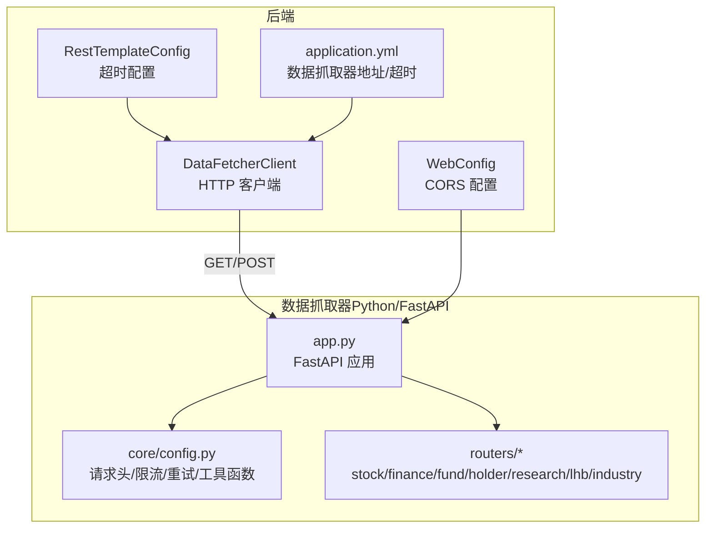
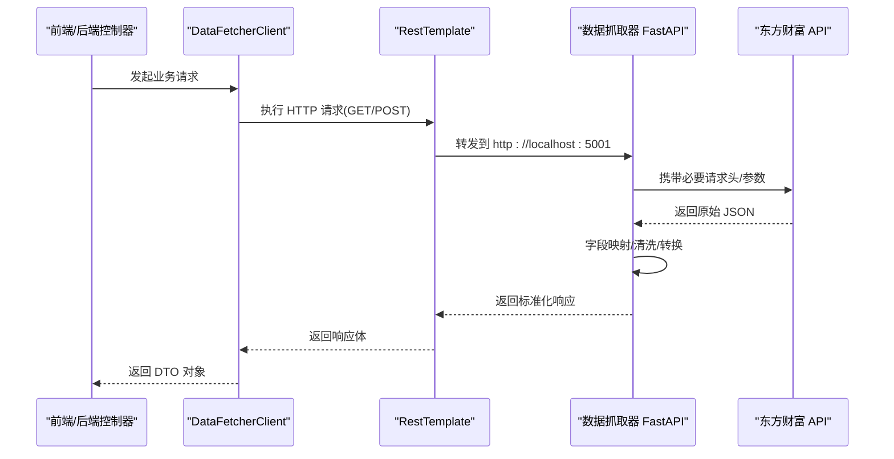
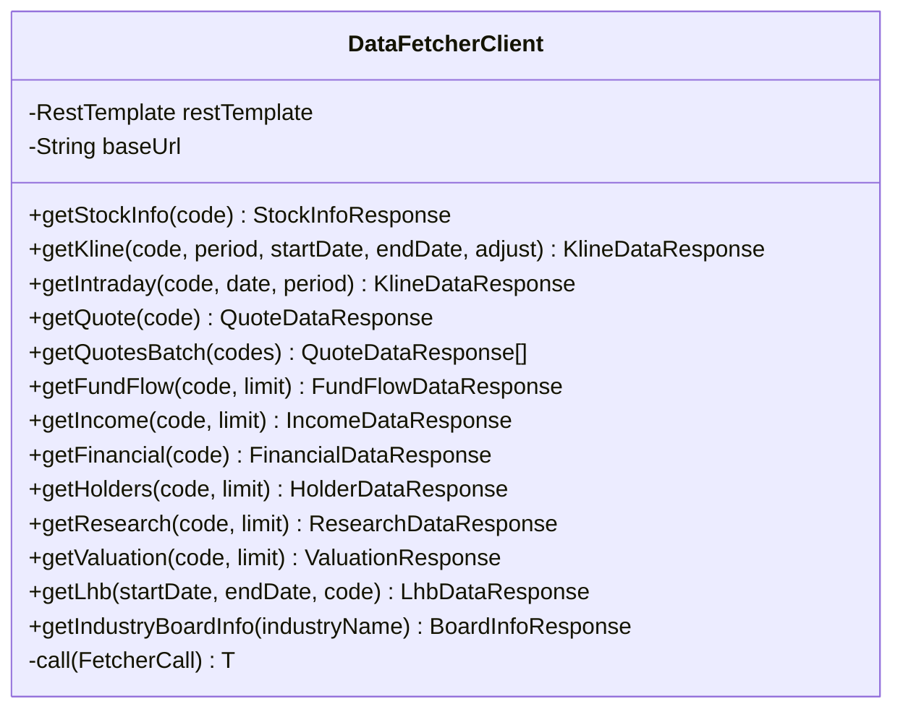
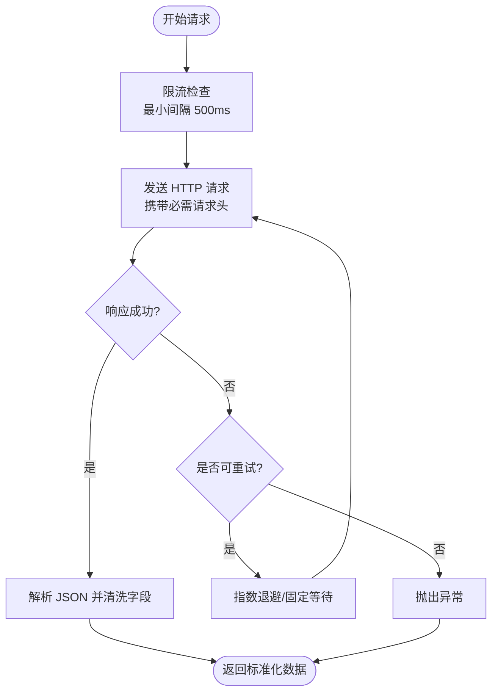
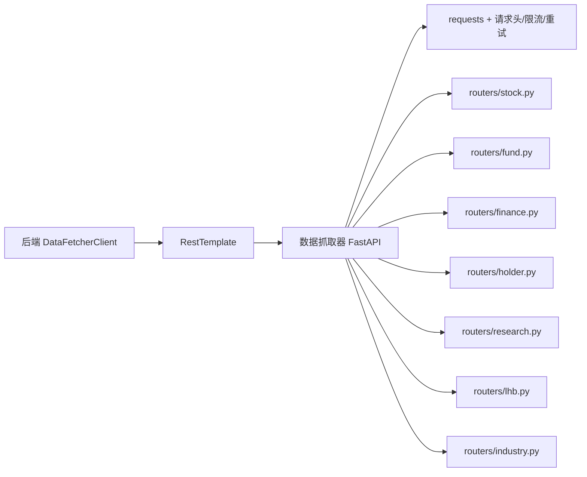

# 数据源集成

<cite>
**本文引用的文件**
- [DataFetcherClient.java](file://backend/src/main/java/com/stock/client/DataFetcherClient.java)
- [RestTemplateConfig.java](file://backend/src/main/java/com/stock/config/RestTemplateConfig.java)
- [WebConfig.java](file://backend/src/main/java/com/stock/config/WebConfig.java)
- [application.yml](file://backend/src/main/resources/application.yml)
- [StockInfoResponse.java](file://backend/src/main/java/com/stock/dto/fetcher/StockInfoResponse.java)
- [DataFetchException.java](file://backend/src/main/java/com/stock/exception/DataFetchException.java)
- [app.py](file://data-fetcher/app.py)
- [core/config.py](file://data-fetcher/core/config.py)
- [routers/stock.py](file://data-fetcher/routers/stock.py)
- [routers/finance.py](file://data-fetcher/routers/finance.py)
- [routers/fund.py](file://data-fetcher/routers/fund.py)
- [routers/holder.py](file://data-fetcher/routers/holder.py)
- [routers/research.py](file://data-fetcher/routers/research.py)
- [routers/lhb.py](file://data-fetcher/routers/lhb.py)
- [routers/industry.py](file://data-fetcher/routers/industry.py)
</cite>

## 目录
1. [简介](#简介)
2. [项目结构](#项目结构)
3. [核心组件](#核心组件)
4. [架构总览](#架构总览)
5. [详细组件分析](#详细组件分析)
6. [依赖分析](#依赖分析)
7. [性能考虑](#性能考虑)
8. [故障排查指南](#故障排查指南)
9. [结论](#结论)
10. [附录](#附录)

## 简介
本文件面向“数据源集成”主题，聚焦于后端服务通过客户端封装调用“数据抓取器（data-fetcher）”服务，实现与东方财富（Eastmoney）API的数据交互。内容涵盖：
- HTTP 请求处理与响应解析流程
- API 密钥管理、请求头设置、超时与重试机制
- 数据格式转换、字段映射、数据清洗与验证
- 错误处理策略、异常捕获与降级方案
- 实际 API 调用示例与数据处理代码片段路径

## 项目结构
后端采用 Spring Boot，前端通过 RestTemplate 访问本地运行的 Python FastAPI 数据抓取器服务。数据抓取器内部对东方财富多个接口进行封装，并统一输出标准化的 DTO。

图表来源
- [DataFetcherClient.java:1-126](file://backend/src/main/java/com/stock/client/DataFetcherClient.java#L1-L126)
- [RestTemplateConfig.java:1-18](file://backend/src/main/java/com/stock/config/RestTemplateConfig.java#L1-L18)
- [WebConfig.java:1-15](file://backend/src/main/java/com/stock/config/WebConfig.java#L1-L15)
- [application.yml:1-28](file://backend/src/main/resources/application.yml#L1-L28)
- [app.py:1-31](file://data-fetcher/app.py#L1-L31)
- [core/config.py:1-121](file://data-fetcher/core/config.py#L1-L121)
- [routers/stock.py:1-246](file://data-fetcher/routers/stock.py#L1-L246)

章节来源
- [DataFetcherClient.java:1-126](file://backend/src/main/java/com/stock/client/DataFetcherClient.java#L1-L126)
- [RestTemplateConfig.java:1-18](file://backend/src/main/java/com/stock/config/RestTemplateConfig.java#L1-L18)
- [WebConfig.java:1-15](file://backend/src/main/java/com/stock/config/WebConfig.java#L1-L15)
- [application.yml:1-28](file://backend/src/main/resources/application.yml#L1-L28)
- [app.py:1-31](file://data-fetcher/app.py#L1-L31)
- [core/config.py:1-121](file://data-fetcher/core/config.py#L1-L121)
- [routers/stock.py:1-246](file://data-fetcher/routers/stock.py#L1-L246)

## 核心组件
- 后端 HTTP 客户端：封装 RestTemplate，统一发起 GET/POST 请求到数据抓取器服务，集中处理空响应与异常转换。
- 数据抓取器服务：FastAPI 提供多路由接口，对接东方财富实时/历史行情、资金流、财务、股东、研报、龙虎榜等数据；内置请求头、限流与重试逻辑。
- 配置与异常：Spring 超时配置、CORS 允许、应用配置中定义数据抓取器地址与超时；自定义异常用于上层统一处理。

章节来源
- [DataFetcherClient.java:1-126](file://backend/src/main/java/com/stock/client/DataFetcherClient.java#L1-L126)
- [RestTemplateConfig.java:1-18](file://backend/src/main/java/com/stock/config/RestTemplateConfig.java#L1-L18)
- [application.yml:1-28](file://backend/src/main/resources/application.yml#L1-L28)
- [DataFetchException.java:1-6](file://backend/src/main/java/com/stock/exception/DataFetchException.java#L1-L6)
- [app.py:1-31](file://data-fetcher/app.py#L1-L31)
- [core/config.py:1-121](file://data-fetcher/core/config.py#L1-L121)

## 架构总览
后端通过 DataFetcherClient 统一访问数据抓取器，数据抓取器内部对东方财富 API 进行请求、限流、重试与数据清洗，最终返回标准化的 DTO 结构。

图表来源
- [DataFetcherClient.java:26-99](file://backend/src/main/java/com/stock/client/DataFetcherClient.java#L26-L99)
- [RestTemplateConfig.java:10-16](file://backend/src/main/java/com/stock/config/RestTemplateConfig.java#L10-L16)
- [app.py:14-20](file://data-fetcher/app.py#L14-L20)
- [core/config.py:80-100](file://data-fetcher/core/config.py#L80-L100)

## 详细组件分析

### 后端 HTTP 客户端与请求封装
- 统一入口：通过方法名映射到数据抓取器路由，如获取实时报价、K线、资金流、财务、股东、研报、估值、龙虎榜、行业板信息等。
- 参数拼装：使用占位符与参数对象，支持批量请求（POST）与单个查询（GET）。
- 异常处理：对空响应抛出自定义异常；对底层异常统一包装为数据抓取异常，便于上层处理。

图表来源
- [DataFetcherClient.java:14-126](file://backend/src/main/java/com/stock/client/DataFetcherClient.java#L14-L126)

章节来源
- [DataFetcherClient.java:1-126](file://backend/src/main/java/com/stock/client/DataFetcherClient.java#L1-L126)

### 数据抓取器服务与请求头/限流/重试
- 请求头：必须包含特定的 User-Agent 与 Referer（东方财富要求），以避免被反爬或返回空数据。
- 限流：全局锁+时间戳控制最小请求间隔（约 500ms），降低被封禁风险。
- 重试：针对连接断开类错误进行指数退避重试，超时则按固定等待重试，提升稳定性。
- 工具函数：提供安全数值转换（浮点/整型/百分比除以100），过滤无效值。

图表来源
- [core/config.py:20-100](file://data-fetcher/core/config.py#L20-L100)

章节来源
- [core/config.py:1-121](file://data-fetcher/core/config.py#L1-L121)

### 路由与数据格式转换（示例）
- 股票基础信息与实时报价：从实时接口读取字段，缺失时回退到财务数据中心补充行业信息；日期格式规范化；数值字段安全转换。
- K线/分时：按字段拆分字符串，映射为标准字段；支持前复权/后复权/不复权。
- 资金流：按字段拆分字符串，映射净流入/占比等字段。
- 财务/估值：从数据中心拉取，按报告期规范化日期；字段映射中文指标到英文字段。
- 股东：按报告期末日排序，数值字段安全转换。
- 研报：从第三方库抓取，提取标题、评级、机构、日期、PDF 链接等。
- 龙虎榜：按日期排序，金额/比例字段安全转换。
- 行业板：从第三方库抓取，返回行业最新价、涨跌幅、主力净流入、换手率等。

章节来源
- [routers/stock.py:14-246](file://data-fetcher/routers/stock.py#L14-L246)
- [routers/fund.py:9-49](file://data-fetcher/routers/fund.py#L9-L49)
- [routers/finance.py:14-148](file://data-fetcher/routers/finance.py#L14-L148)
- [routers/holder.py:9-41](file://data-fetcher/routers/holder.py#L9-L41)
- [routers/research.py:9-63](file://data-fetcher/routers/research.py#L9-L63)
- [routers/lhb.py:9-57](file://data-fetcher/routers/lhb.py#L9-L57)
- [routers/industry.py:9-59](file://data-fetcher/routers/industry.py#L9-L59)

### DTO 与字段映射
- 后端 DTO 使用记录类（record），忽略未知字段，确保与数据抓取器返回结构一致。
- 关键字段包括：代码、名称、市值、流通市值、总股本、流通股本、市盈率、市净率、最新价、涨跌幅、成交量、成交额、振幅、换手率等。

章节来源
- [StockInfoResponse.java:1-27](file://backend/src/main/java/com/stock/dto/fetcher/StockInfoResponse.java#L1-L27)

### CORS 与超时配置
- CORS：允许前端本地开发服务器跨域访问后端 API。
- 超时：连接超时 5 秒，读取超时 15 秒；应用配置中可调整数据抓取器超时时间。

章节来源
- [WebConfig.java:1-15](file://backend/src/main/java/com/stock/config/WebConfig.java#L1-L15)
- [RestTemplateConfig.java:10-16](file://backend/src/main/java/com/stock/config/RestTemplateConfig.java#L10-L16)
- [application.yml:19-22](file://backend/src/main/resources/application.yml#L19-L22)

## 依赖分析
- 后端依赖 Spring Web 的 RestTemplate，负责 HTTP 通信；通过配置类注入超时参数。
- 数据抓取器依赖 requests、FastAPI、第三方库（AKShare 等）；核心模块提供统一的请求头、限流与重试。
- 路由模块按功能拆分，分别对接不同东方财富接口，统一输出标准化结构。

图表来源
- [DataFetcherClient.java:1-126](file://backend/src/main/java/com/stock/client/DataFetcherClient.java#L1-L126)
- [RestTemplateConfig.java:1-18](file://backend/src/main/java/com/stock/config/RestTemplateConfig.java#L1-L18)
- [app.py:1-31](file://data-fetcher/app.py#L1-L31)
- [routers/stock.py:1-246](file://data-fetcher/routers/stock.py#L1-L246)
- [routers/fund.py:1-49](file://data-fetcher/routers/fund.py#L1-L49)
- [routers/finance.py:1-148](file://data-fetcher/routers/finance.py#L1-L148)
- [routers/holder.py:1-41](file://data-fetcher/routers/holder.py#L1-L41)
- [routers/research.py:1-63](file://data-fetcher/routers/research.py#L1-L63)
- [routers/lhb.py:1-57](file://data-fetcher/routers/lhb.py#L1-L57)
- [routers/industry.py:1-59](file://data-fetcher/routers/industry.py#L1-L59)

## 性能考虑
- 限流与退避：数据抓取器内置最小请求间隔与指数退避重试，降低被风控概率并提高成功率。
- 超时设置：后端与数据抓取器均设置合理超时，避免长时间阻塞。
- 批量请求：后端支持批量报价请求，减少多次往返；数据抓取器限制单批最大数量，避免一次性压力过大。
- 字段清洗：在数据抓取器侧完成字段清洗与类型转换，减轻后端负担。

## 故障排查指南
- 空响应：当数据抓取器返回空结果时，后端会抛出自定义异常，需检查上游接口可用性与参数合法性。
- 连接异常：若出现远程断开或超时，数据抓取器会进行重试；若仍失败，建议检查网络与目标站点状态。
- 字段缺失：部分接口字段可能为空，应以安全转换函数处理并记录日志。
- CORS 问题：确认前端域名已在后端 CORS 白名单中。
- 配置项：检查数据抓取器地址与超时配置是否正确。

章节来源
- [DataFetcherClient.java:112-124](file://backend/src/main/java/com/stock/client/DataFetcherClient.java#L112-L124)
- [DataFetchException.java:1-6](file://backend/src/main/java/com/stock/exception/DataFetchException.java#L1-L6)
- [core/config.py:88-100](file://data-fetcher/core/config.py#L88-L100)
- [WebConfig.java:8-13](file://backend/src/main/java/com/stock/config/WebConfig.java#L8-L13)
- [application.yml:19-22](file://backend/src/main/resources/application.yml#L19-L22)

## 结论
该数据源集成方案通过后端统一客户端与数据抓取器服务化，实现了与东方财富 API 的稳定交互。数据抓取器侧完成请求头设置、限流与重试、字段映射与清洗，后端仅负责编排与异常转换，整体具备良好的可维护性与扩展性。

## 附录

### API 调用示例（路径）
- 获取股票基础信息
  - [DataFetcherClient.getStockInfo:26-29](file://backend/src/main/java/com/stock/client/DataFetcherClient.java#L26-L29)
  - [routers/stock.py.get_stock_info:14-73](file://data-fetcher/routers/stock.py#L14-L73)
- 获取 K 线
  - [DataFetcherClient.getKline:31-35](file://backend/src/main/java/com/stock/client/DataFetcherClient.java#L31-L35)
  - [routers/stock.py.get_kline:75-127](file://data-fetcher/routers/stock.py#L75-L127)
- 获取分时
  - [DataFetcherClient.getIntraday:37-41](file://backend/src/main/java/com/stock/client/DataFetcherClient.java#L37-L41)
  - [routers/stock.py.get_intraday:129-171](file://data-fetcher/routers/stock.py#L129-L171)
- 获取实时报价
  - [DataFetcherClient.getQuote:43-46](file://backend/src/main/java/com/stock/client/DataFetcherClient.java#L43-L46)
  - [routers/stock.py.get_quote:173-207](file://data-fetcher/routers/stock.py#L173-L207)
- 批量报价
  - [DataFetcherClient.getQuotesBatch:48-57](file://backend/src/main/java/com/stock/client/DataFetcherClient.java#L48-L57)
  - [routers/stock.py.get_quotes_batch:213-246](file://data-fetcher/routers/stock.py#L213-L246)
- 资金流
  - [DataFetcherClient.getFundFlow:59-63](file://backend/src/main/java/com/stock/client/DataFetcherClient.java#L59-L63)
  - [routers/fund.py.get_fund_flow:9-49](file://data-fetcher/routers/fund.py#L9-L49)
- 利润表
  - [DataFetcherClient.getIncome:65-69](file://backend/src/main/java/com/stock/client/DataFetcherClient.java#L65-L69)
  - [routers/finance.py.get_income:14-41](file://data-fetcher/routers/finance.py#L14-L41)
- 财务摘要
  - [DataFetcherClient.getFinancial:71-75](file://backend/src/main/java/com/stock/client/DataFetcherClient.java#L71-L75)
  - [routers/finance.py.get_financial:43-119](file://data-fetcher/routers/finance.py#L43-L119)
- 估值
  - [DataFetcherClient.getValuation:89-93](file://backend/src/main/java/com/stock/client/DataFetcherClient.java#L89-L93)
  - [routers/finance.py.get_valuation:121-148](file://data-fetcher/routers/finance.py#L121-L148)
- 股东
  - [DataFetcherClient.getHolders:77-81](file://backend/src/main/java/com/stock/client/DataFetcherClient.java#L77-L81)
  - [routers/holder.py.get_holders:9-41](file://data-fetcher/routers/holder.py#L9-L41)
- 研报
  - [DataFetcherClient.getResearch:83-87](file://backend/src/main/java/com/stock/client/DataFetcherClient.java#L83-L87)
  - [routers/research.py.get_research:9-63](file://data-fetcher/routers/research.py#L9-L63)
- 龙虎榜
  - [DataFetcherClient.getLhb:95-99](file://backend/src/main/java/com/stock/client/DataFetcherClient.java#L95-L99)
  - [routers/lhb.py.get_lhb:9-57](file://data-fetcher/routers/lhb.py#L9-L57)
- 行业板信息
  - [DataFetcherClient.getIndustryBoardInfo:101-105](file://backend/src/main/java/com/stock/client/DataFetcherClient.java#L101-L105)
  - [routers/industry.py.get_board_info:9-38](file://data-fetcher/routers/industry.py#L9-L38)

### 关键配置项
- 数据抓取器地址与超时
  - [application.yml:19-22](file://backend/src/main/resources/application.yml#L19-L22)
- RestTemplate 超时
  - [RestTemplateConfig.java:10-16](file://backend/src/main/java/com/stock/config/RestTemplateConfig.java#L10-L16)
- CORS
  - [WebConfig.java:8-13](file://backend/src/main/java/com/stock/config/WebConfig.java#L8-L13)